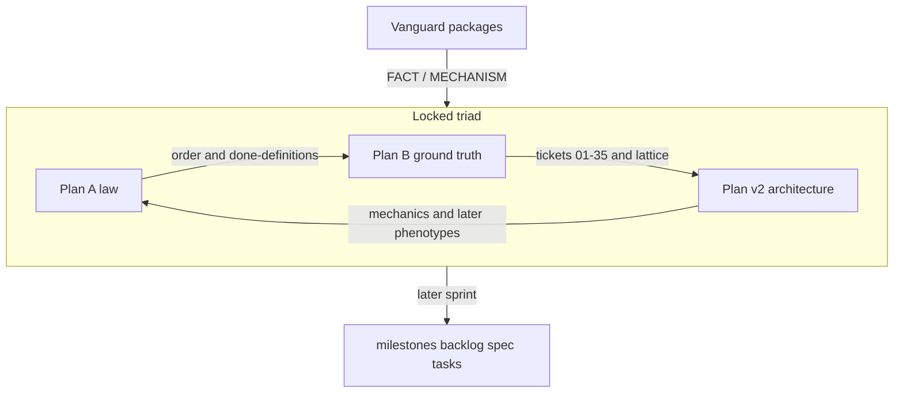

# Lock A / B / v2 as the SOTA triad

> For the implementing agent: edit **only** the three `.draft/` files below. Do **not** create a fourth plan file, do **not** write under `docs/`, do **not** touch `docs/execution/`. This pass locks the triad so a *later* sprint can generate milestones/backlog/specs from it. If any of A/B/v2 ends shorter than its pre-edit `wc -l`, the pass has failed.

**Goal:** Make A + B + v2 a single, source-true development lock for (1) a SOTA coding-agent harness loop and (2) a framework that can compile other agents — without deleting ideas.

**Architecture of the edit:** Each file keeps its role and grows. Shared lock preamble is duplicated in all three so each document stands alone. False statements are rewritten in place and the old wording is preserved as a dated snapshot or `[CONTRADICTION]`. Competing designs stay in full and get `[PROPOSAL]`. Missing modules stay described as future work, never deleted.

**Tech stack / subject:** Markdown drafts vs Vanguard HEAD `66aa7a3c0c31` (LDA index `FRESH`).

## Global constraints

- Files in scope: [`.draft/DEVELOPMENT_FINAL_PLAN.md`](.draft/DEVELOPMENT_FINAL_PLAN.md) (A, ~3305 lines), [`.draft/DEVELOPMENT_FINAL_PLAN_B.md`](.draft/DEVELOPMENT_FINAL_PLAN_B.md) (B, ~1679 lines), [`.draft/DEVELOPMENT_FINAL_PLAN_v2.md`](.draft/DEVELOPMENT_FINAL_PLAN_v2.md) (v2, ~552 lines).
- **Never shrink.** Additive edits only. Corrections rewrite a sentence *and* keep the prior claim nearby as historical/CONTRADICTION text.
- **Never prune good ideas.** If A, B, and v2 disagree on a future feature (new ports, HYDRA heads, mutation-0.80 gate, 17 domain types, second compiler), keep **all** variants. Mark the lattice-correct one `FACT`/`MECHANISM` where code exists; mark the rest `[PROPOSAL]`.
- B’s epistemic legend becomes **shared law** (copy into A and v2; do not delete B’s copy): `FACT` / `MECHANISM` / `INFERENCE` / `[PROPOSAL]` / `ASPIRATION` / `CONTRADICTION`. Change B’s `SUPERSEDED` meaning from “drop the text” to “keep text, mark `[PROPOSAL]`, cite the better location.”
- Source outranks drafts. Kernel remains domain-blind (I-7). Coding semantics stay in `packs/code-default/`. CLI is a client of `ApplicationService`.
- Do not restamp live execution IDs in this pass. v2’s `SUB-*` / `M-HYD` inventory stays as `[PROPOSAL]` mapping, not as a replacement DAG. B tickets 01–35 remain the critical-path numbering.
- `.draft/DEVELOPMENT_FINAL_PLAN_MERGED.md` is **out of scope**. If it is absent, v2 must stop treating it as authority.

## Locked triad roles (put this in every preamble)

```text
A  = Program law: reliability identity, wave order, competency profiles,
     formal model, per-class evidence, non-goals, D-01–D-10
B  = Ground truth: live inventory, proven gaps, lattice placement,
     tickets 01–35, operator one-pager (01–13 first)
v2 = Architecture catalog: 16 primitives (map, not new cores),
     context economics, 2PC/tamper/dialect mechanics, later phenotypes
     (director / HYDRA / mutation) as [PROPOSAL]
```

Build order (locked, from B, aligned with the SOTA suggestion):

```text
cannot-lie → can-resume → can-see → can-change-many-files
  → qualify one EpisodeEngine coding agent
  → then meta / specialists / campaign / skills-memory
```

## Source pins the drafts must match (HEAD `66aa7a3c`)

These are FACT. Any draft that contradicts them is a bug to correct in place.

- **Product loop** (session + compiler + engine), not “compile inside EpisodeEngine”: `ContextCompiler` freezes L1–L3 at construction ([`agency/context/compiler.py`](vanguard/packages/agency/context/compiler.py)); `EpisodeEngine` is observe → propose → `recover_proposal` → `Kernel.dispatch` → ingest ([`agency/episode/engine.py`](vanguard/packages/agency/episode/engine.py) ~371–740).
- **Admission:** live function is `admission_required` — exempt `vg-code-default` / `vg-code-lex`, else `"patch.apply" in verbs` ([`runtime/session.py`](vanguard/packages/runtime/session.py) 124–138). `ADMISSION_GATED_HARNESSES` (119–121) is **unused** in runtime (tests still pin it).
- **VerificationReceipt.passed** = `exit_code == 0 and executed_test_count > 0` ([`admission_gate.py`](vanguard/packages/agency/episode/admission_gate.py) 22–37). Session `_observed_test_count` returns 0 if unparseable (363–375). Forge still sets `test_count = 1` on green-empty ([`forge/engine.py`](vanguard/packages/agency/forge/engine.py) 309–311).
- **Resume:** `episode_id=f"episode-{run_id}"` ([`app_service.py`](vanguard/packages/runtime/app_service.py) ~414). `resume_state` JSON dumped into env / L3 ([`session.py`](vanguard/packages/runtime/session.py) 619–622).
- **Task state:** [`runtime/task_state.py`](vanguard/packages/runtime/task_state.py) `CodingTaskState` + `fold_task_state`. **`domain/task_state.py` does not exist.**
- **No** `transaction.py`, `tamper_shield.py`, `progressive.py`, `WorkspaceEpoch`, `agency/prediction/`, `runtime/event_store.py`, `adapters/index/`. Event store is [`adapters/stores/event_store.py`](vanguard/packages/adapters/stores/event_store.py); index is [`adapters/stores/repo_index.py`](vanguard/packages/adapters/stores/repo_index.py).
- **Git apply** is sequential; `ast.parse` is post-write observation ([`git.py`](vanguard/packages/adapters/environment/git.py) ~853–900). Kernel S7/S8 is RESERVE/VERIFY, **not** AST ([`dispatch.py`](vanguard/packages/kernel/dispatch.py) 4–19).
- **Forge/Chimera** do not call `Kernel.dispatch`.
- **TransformSpec** live fields: `transform_id`, `version`, `input_schema`, `output_schema`, … ([`domain/transforms/contracts.py`](vanguard/packages/domain/transforms/contracts.py) 20–31) — not v2’s `name` / `input_type` sketch.
- **Tools already present:** `fs.read` / `fs.search` / `fs.list`, `patch.apply`, `proc.exec`, pack `IndexToolkit`, `multi_file_completeness.py`, `GreenfieldPolicy`.
- **Facade:** `run` / `status` / `resume` / `evidence` / `cost`; presets `fast|balanced|max`.
- **Meta-controller** cannot enlarge budget; `conclude` becomes an ordinary `finish` proposal, still gated.
- **Memory:** authorize then recall ([`runtime/prompt_assembler.py`](vanguard/packages/runtime/prompt_assembler.py) 107–113). Skills: [`runtime/skill_lifecycle.py`](vanguard/packages/runtime/skill_lifecycle.py).



---

## Edit protocol (every section)

1. If the sentence is **false vs code**: rewrite to FACT; immediately keep the old sentence in a `Historical claim (draft SHA …)` or `CONTRADICTION` note. Do not delete the idea if it is still a future design — retag `[PROPOSAL]`.
2. If two drafts propose different futures: keep both; add a one-line pointer to the sibling (`See B §6.12` / `See v2 §4.2 [PROPOSAL]`).
3. If a path does not exist: say **MISSING in HEAD `66aa7a3c`** and keep the design as `[PROPOSAL]`.
4. New SOTA material from the user suggestion is **appended** as new sections (never a replacement of an existing pillar).

---

## Task 1 — Shared lock preamble in A, B, and v2

Insert (do not replace titles) after YAML / before or immediately after the existing epistemic/executive block:

- Triad roles table (above)
- Shared epistemic legend (copy from B lines 29–39, with SUPERSEDED redefined)
- Lock identity: `lock_head: 66aa7a3c0c31`, `lock_date: 2026-09-03`, `lda_freshness: FRESH`
- Dual mission (from v2 §1.1 + user suggestion): closed-loop coding harness **and** composable agent framework; CLI is not the brain
- Reliability identity \(R = \prod_t \Pr(\text{honest progress}_t \mid \text{honest state}_{t-1})\)
- Explicit: this triad **does not authorize** kernel AST, a second EpisodeEngine, or default HYDRA

**B-only YAML fixes:** set `observed_head` / `lda_index_head` to `66aa7a3c0c31`, `lda_freshness_vs_head: FRESH`, remove `does_not_modify` A (replace with `triad_complements: [A, v2]`). Keep the old SHA block as “planning-session snapshot” in §2.

**A YAML:** add `triad_role: law`, `complements: [B, v2]`.

**v2 YAML:** retarget `complements` to A + B (not MERGED); `triad_role: architecture`.

---

## Task 2 — Correct Plan B (ground truth) without shrinking

B is the best source inventory. Refresh facts; keep tickets and waves.

**Fix (keep old text as dated snapshot in §2):**

- §2.2 LDA STALE / W-092-F0 unsatisfied-because-STALE / `active.md` duplicate: those were true at `ebad36e`. Now: LDA `FRESH` at `66aa7a3c`; [`docs/execution/active.md`](docs/execution/active.md) is **absent**; execution files are `tasks.md` / `spec.md` / `milestones.md` / `backlog.md`. Do not delete the contradiction write-up — mark it `Historical CONTRADICTION (ebad36e)`.
- §21 appendix LDA SHA: add a lock-time row; keep the original row.

**Keep as FACT (already right):** admission exemption, unused `ADMISSION_GATED_HARNESSES`, Forge `test_count = 1`, L3 resume dump, missing FEATURE_SPEC modules, Forge/Chimera bypass, `KernelPort` absent, 2PC missing, `ast.parse` observation-only on git apply.

**Annotate, do not delete:**

- Ticket 04 (gate `vg-code-default`): keep; add FACT that RF-25 / `test_completion_gate_scope.py` pin the exemption. Implementation remains `[PROPOSAL]` requiring a successor baseline.
- Ticket 09 `domain/task_state.py`: keep; add FACT file is MISSING; `[PROPOSAL]` merge with `CodingTaskState` (B §6.12 wins over A’s 17 types).
- Waves 6–10 / tickets 28–35: keep entire text; header already says not authorized — add `[PROPOSAL]` on each wave title.

**Append (new sections, do not replace §3):**

- Tool/verb inventory matching pack YAML (`fs.read` windowed, `fs.search`, `fs.list`, `patch.apply`, `proc.exec`, index toolkit still verb `fs.read`).
- Product target loop from the suggestion (`INGEST → DISCOVER → PLAN → EDIT → VERIFY_TARGETED → RECOVER → VERIFY_BROAD → COMPLETE`) with FACT that transitions follow receipts.
- Pointer: edit/2PC mechanics live in v2; law/profiles live in A.

---

## Task 3 — Correct Plan A (law) without shrinking

Keep executive decision, formal model, competency profiles, waves, first-30 tickets, D-register, risks.

**Rewrite-in-place + preserve old wording:**

- §1 snapshot HEAD `7e08462c`: keep as original planning subject; add lock HEAD `66aa7a3c`. Navigation-health numbers stay as historical.
- §2.2 inner loop diagram: keep; add FACT that **compile is `ContextCompiler` / session**, not a step inside `EpisodeEngine`.
- §2.1 `KernelPort`: keep the row; note FACT no such symbol (B already said this).
- §6.1 Campaign Service stack: keep the diagram; mark the extra layer `[PROPOSAL]`; FACT canonical path is `ApplicationService → Runtime → HarnessSession → EpisodeEngine → Kernel`. Director as runtime client: see B §6.2 `[PROPOSAL]`.
- §6.2 17 domain values and §6.3 8 new ports: **keep the lists**; mark `[PROPOSAL]`. Add FACT current fold is `CodingTaskState`; preferred merge is B §6.12. Do not delete GoalContract / CampaignPlan / etc.
- §9.4 fail-to-pass: keep per-class matrix (this **wins** over v2 I-1 universal finish). Add a sentence that v2 §5.3 is `[PROPOSAL]` for bugfix only.
- Broken links `docs/execution/active.md` and `FEATURE_SPEC.md`: keep links; note `active.md` missing, current delta file is [`docs/execution/spec.md`](docs/execution/spec.md).

**Append:**

- Operator/CLI surface from the suggestion (TTY vs headless; `run/resume/cancel/status/evidence/cost/doctor/checkpoint`; CLI must not patch or grade). Tie to existing facade methods as MECHANISM and extra commands as `[PROPOSAL]`.
- Loop-engineering vs harness-engineering split (suggestion §9).
- Four-tier memory table (suggestion §7) pointing at existing authorize-before-retrieve as MECHANISM; product wiring `[PROPOSAL]`.

---

## Task 4 — Correct Plan v2 (architecture) without shrinking — this file will grow

v2 is the thin catalog; it must become the long architecture lock. **Grow it.** Do not compact pillars.

**Fix internal contradictions (keep both paragraphs):**

- §4.3 “Hooked into Kernel S7/S8” vs §9.1 “ZERO AST in kernel”: keep the `ast.parse` snippet; mark kernel hook `[PROPOSAL] rejected by I-7 / current dispatch.py`; FACT correct placement is §4.2 `adapters/environment/` (and B: observation already exists post-write in `git.py`).
- §2.4 `TransformSpec` sketch: keep the sketch as `[PROPOSAL]` alias; immediately paste the **live** dataclass fields from `contracts.py`.
- §2.1 Target Package Placement column: add a **Current owner (FACT)** column: `STORE` → `adapters/stores/event_store.py`, `RETRIEVE` → `adapters/stores/repo_index.py` + `ports/index.py`, `SELECT` → `agency/context/compiler.py`, `CONSOLIDATE` → `runtime/memory.py` / `skill_*`, `ACT`/`ALLOCATE` → kernel. Keep `agency/prediction/`, `agency/evolution/`, `runtime/outer_loop/` as `[PROPOSAL]` future packages — do not delete.
- §3.2 L1–L3 freeze: keep the layer diagram (correct rule). Add FACT that **current session puts `resume_state` and `repo_map` into env/L3** (B §4.4) — that is a product bug, not the target design. Target remains: σ in L4, epoch-bound map not in frozen prefix.
- Cache “27% → >72%”: mark `ASPIRATION`.
- §5.3 / I-1 “no finish without signed VerificationReceipt”: keep; mark `[PROPOSAL]` too strong vs A per-class evidence and vs local vs exterior evaluator split (B §3.4).
- §5.4 mutation ≥ 0.80: keep full section; `[PROPOSAL]` optional treatment, not default admission.
- Head 3 “CHIMERA IMPLEMENTER”: keep the topology; mark product implementer = `EpisodeEngine` + pack; ChimeraEngine is a parallel loop `[PROPOSAL]` / reject-as-default (B §3.5).
- §8 `SUB-01` inventory and `M-HYD`: keep the table; `[PROPOSAL]` ID mapping. Critical-path numbers remain B tickets 01–35. `PRG-01` must not mean a second `ContextCompiler` — `[PROPOSAL]` is L4/L5 strategy on existing compiler (B §6.8).
- §1.2 complementarity with MERGED: keep the diagram; retarget authority to **A (law) + B (DAG 01–35)**; MERGED as optional historical sibling `[PROPOSAL]` if the file is absent.

**Append new pillars from the user SOTA suggestion (full text, not a summary):**

1. Closed-loop controller vs chatbot; product loop `INGEST…COMPLETE`; AdmissionGate leak multiplies swarms.
2. CLI as operator surface (table + command list).
3. Small orthogonal toolkit table (Read/Search/Glob/Edit/Write/2PC/Shell/Index/Todo/Skill/Memory/Test) mapped to existing verbs + `[PROPOSAL]` upgrades (fuzzy apply, output caps, atomic multi-file).
4. Reading/editing stack (read-before-edit, surgical default, multi-strategy apply, preflight in adapter, workspace fingerprint, 2PC, completeness) — all `[PROPOSAL]` except sequential `GitEnvironment.apply` + post-write `ast.parse` as MECHANISM.
5. Context: rolling window, structured compact of observations vs durable σ, tool-output caps, goal echo at L5 tail, progressive packets, epoch refresh.
6. Index modes: structural map / lexical / graph zoom / docs RAG as fourth channel.
7. Skills progressive disclosure vs existing `skill_lifecycle.py`.
8. Meta-cognition powerless (align with live `meta_controller` FACT).
9. Long-session / brownfield fail-to-pass / greenfield oracle workflow (align A §9–12 and B §10–11; do not replace them — cross-link and expand mechanics).
10. One-picture architecture (suggestion §13) with FACT labels on existing boxes and `[PROPOSAL]` on 2PC/tamper/director.

**Do not** add a competing ticket DAG. End with “implementation numbering: B §18.”

---

## Task 5 — Cross-link matrix (append to all three)

Add the same appendix to A, B, and v2 (duplication is required so no file is a stub):

| Concern | Canonical write-up | Competing variants kept as `[PROPOSAL]` |
|---|---|---|
| Reliability order | A §0, B §8 | v2 HYDRA-first topologies |
| Live gaps / tickets | B §4, §18 | A §31 (less precise on exemption); v2 §8 IDs |
| Lattice placement | B §6.12 | A §6.2–6.3 port explosion; v2 new packages |
| L1–L5 + σ | v2 §3 + B §4.4 | dumping σ into L3 (current code, not target) |
| 2PC / AST | v2 §4.2 adapter | v2 §4.3 kernel hook (rejected) |
| Completion policy | A §9.4 per class | v2 I-1 universal signed finish |
| Forge/Chimera | B §3.5 quarantine | v2 Head 3 Chimera as product |
| Director / HYDRA | v2 §7, A waves 7–8, B waves 7–8 | default swarm |
| Mutation 0.80 | v2 §5.4 | as admission law |
| CLI | A appended operator surface | TUI visual design (A non-goal) |

---

## Task 6 — Integrity verification (must pass)

Run from repo root after edits:

```bash
wc -l .draft/DEVELOPMENT_FINAL_PLAN.md .draft/DEVELOPMENT_FINAL_PLAN_B.md .draft/DEVELOPMENT_FINAL_PLAN_v2.md
# each count MUST be >= pre-edit: 3305 / 1679 / 552
```

Grep gates (expect matches, not deletions):

- All three contain `triad_role` or “Locked triad roles” and the epistemic legend.
- A still contains the 17 domain-value list and the Campaign Service diagram.
- B still contains tickets 01–35 and the admission-exemption FACT.
- v2 still contains 16 primitives, HYDRA heads, mutation formula, and `ast.parse` snippet.
- v2 kernel S7/S8 hook is adjacent to `[PROPOSAL]` and I-7 rejection.
- Live `TransformSpec` field names `transform_id` / `input_schema` appear in v2.
- `adapters/stores/event_store.py` appears as FACT owner for STORE.
- No file claims `domain/task_state.py` exists without MISSING.

Do **not** run `just verify` as a claim that the triad “passes” product gates — this pass is draft-lock only.

## Out of scope (later sprint, after this lock)

Generating or rewriting [`docs/execution/milestones.md`](docs/execution/milestones.md), [`backlog.md`](docs/execution/backlog.md), [`spec.md`](docs/execution/spec.md), [`tasks.md`](docs/execution/tasks.md), [`docs/SPEC.md`](docs/SPEC.md), or any Vanguard Python. The locked triad is the input to that work, not the work itself.
