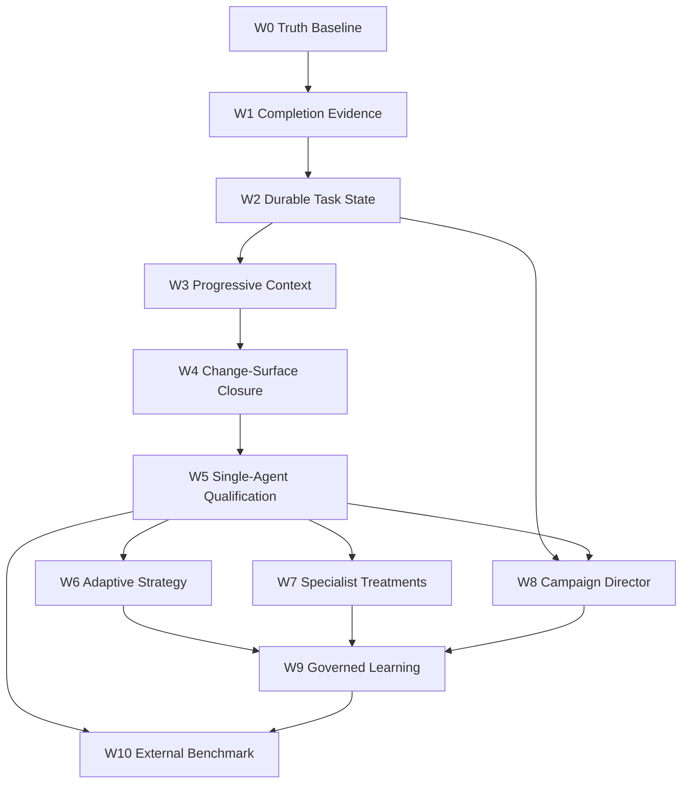

> **Unused reference.** Day-to-day development authority is [`docs/execution/`](../docs/execution/): [`milestones.md`](../docs/execution/milestones.md), [`spec.md`](../docs/execution/spec.md), [`technical.md`](../docs/execution/technical.md), [`backlog.md`](../docs/execution/backlog.md), [`tasks.md`](../docs/execution/tasks.md). This draft remains forensic lock at HEAD `66aa7a3c`. Do not treat it as the work board.

# AETHER SOTA Software-Engineering Agent Development Program

## Backend-first plan for long-horizon, greenfield, brownfield, research, and explanation agents

> This is a non-authoritative draft.
>
> It proposes work; it authorizes nothing.
>
> Current source and executable evidence outrank this file.
>
> Canonical synchronization belongs in the normal execution workflow after each proposal is accepted.

---

## Lock identity and triad law (2026-09-03)

This file is **Plan A** in the locked A / B / v2 triad. It stands alone: the preamble below is duplicated in B and v2 so no draft is a stub.

### Locked triad roles

```text
A  = Program law: reliability identity, wave order, competency profiles,
     formal model, per-class evidence, non-goals, D-01–D-10
B  = Ground truth: live inventory, proven gaps, lattice placement,
     tickets 01–35, operator one-pager (01–13 first)
v2 = Architecture catalog: 16 primitives (map, not new cores),
     context economics, 2PC/tamper/dialect mechanics, later phenotypes
     (director / HYDRA / mutation) as [PROPOSAL]
```

Build order (locked, from B, aligned with the SOTA harness-loop suggestion):

```text
cannot-lie → can-resume → can-see → can-change-many-files
  → qualify one EpisodeEngine coding agent
  → then meta / specialists / campaign / skills-memory
```

### Lock identity

| Field | Value |
|---|---|
| `lock_head` | `66aa7a3c0c31` |
| `lock_date` | 2026-09-03 |
| `lda_freshness` | `FRESH` |
| Original planning subject (`observed_head`) | `7e08462c2cbbf10e37c75f2d3f34d0beaa4ceef5` |

Source at `lock_head` outranks this draft. Kernel remains domain-blind (I-7). Coding semantics stay in `packs/code-default/`. The CLI is a client of `ApplicationService`, not a second intelligence.

This triad **does not authorize** kernel AST, a second `EpisodeEngine`, or default HYDRA.

### Dual mission

Vanguard / AETHER is simultaneously two tightly integrated systems:

1. **Closed-loop coding harness (`Coding Max`).** A software-engineering agent that executes multi-hour, multi-turn brownfield, greenfield, multi-file, and resume-safe campaigns with bound verification. The product loop is a controller, not a chatbot with files.
2. **Composable agent framework.** The same substrate (episode loop, kernel dispatch, ledger, budgets, ports, packs) must be able to compile other agents (review, planning, later campaign direction) without a second runtime.

The CLI (`vg` / `aether`) is the operator surface. It is **not** the brain: it must not assemble prompts, patch files, or grade success.

### Reliability identity

$$
R = \prod_{t}\Pr(\text{honest progress}_{t}\mid\text{honest state}_{t-1})
$$

Long-horizon SOTA is the product of honest turns. A leaky completion gate, a brittle patcher, or a context dump that forgets \(\sigma\) compounds across \(T\). Swarm, memory, and skills multiply whatever \(R\) already is.

Section 0 keeps the campaign-gate product \(P(G_i\mid G_{<i})\) as program law for milestone sequencing. The identity here is the per-turn harness law that those gates rest on.

### Epistemic legend (applies to every later claim)

Copied from Plan B as shared triad law. **SUPERSEDED** is redefined: keep the text; do not drop it.

| Tag | Meaning | Promotion rule |
|---|---|---|
| **FACT** | Observed in current source, tests executed this session, or an official primary source fetched on 2026-09-03 | May be treated as current truth for planning |
| **MECHANISM** | Code exists and unit/contract tests exist | Not a product or benchmark claim |
| **INFERENCE** | Reasonable engineering conclusion from FACT + MECHANISM | Must not be restated as evidence |
| **PROPOSAL** | Recommended next work | Requires a later ticket, falsifier, and WIP slot |
| **ASPIRATION** | Desired competitive position | Forbidden as a forecast of a specific score |
| **CONTRADICTION** | Two authorities disagree; source wins | Record both sides; do not silently pick the nicer one |
| **SUPERSEDED** | Attractive draft idea that current lattice or source rejects | Keep the text; mark `[PROPOSAL]`; cite the better location. Do not drop the insight. |

Body text uses `[PROPOSAL]` for the PROPOSAL tag. Competing designs across A, B, and v2 stay in full.

---

## 0. Executive decision

AETHER should not begin by building a larger swarm.

It should first make one coding lineage truthful, resumable, context-efficient, and independently verifiable.

The program order is:

1. repair benchmark and completion truth;
2. establish durable semantic task state;
3. put progressive repository context on the product path;
4. prove multi-file greenfield and brownfield closure;
5. qualify a strong single-agent control;
6. add adaptive strategy as bounded policy;
7. add specialist roles one treatment at a time;
8. add the persistent outer loop only after inner-loop evidence is reliable;
9. promote memory and skills only through held-out causal evidence;
10. optimize models, budgets, and topology against cost-adjusted signed success.

This ordering follows a simple reliability law:

$$
P(\text{campaign success})
=
\prod_{i=1}^{N}P(G_i\mid G_{<i}),
$$

where every weak milestone gate compounds across a long campaign.

If a per-package gate is only $0.95$ reliable, a 20-package campaign has at most
$0.95^{20}\approx0.358$ reliability before modeling other failures.

Long-horizon SOTA therefore comes from reducing compounded epistemic error, not merely increasing turns.

The recommended product target is a backend substrate that can instantiate four competency profiles:

- Senior Developer: bounded feature and bug-fix ownership with evidence-backed completion;
- Staff Engineer: repository-scale change planning, dependency management, and multi-package delivery;
- Principal Architect: architectural constraints, trade-off analysis, migrations, and evolution plans;
- Tech Lead: campaign decomposition, review routing, risk management, and operator escalation.

These are not four new runtimes.

They are four declarative organizations of the same causal substrate.

---

## 1. Evidence boundary and snapshot

### 1.1 Inspected subject

The source snapshot used for this plan was Git HEAD:

`7e08462c2cbbf10e37c75f2d3f34d0beaa4ceef5`.

The worktree was dirty with 61 reported local changes.

Those changes include canonical documentation, runtime files, client files, package metadata, and untracked tests.

This plan does not presume that any dirty document is final.

This plan does not overwrite or normalize those changes.

**Lock identity (2026-09-03).** This file is now locked against Git HEAD `66aa7a3c0c31` (LDA `FRESH`). The SHA `7e08462c2cbbf10e37c75f2d3f34d0beaa4ceef5` remains the original planning subject for the dirty-worktree inventory above and for the §1.2 navigation-health numbers. Do not restamp those historical counts as if they were lock-time doctor output.

### 1.2 Navigation health

`.generated/knowledge/report.json` reported:

- status `VALIDATED`;
- 135 documents;
- 135 canonical IDs;
- 252 links;
- 12 code mappings;
- 676 indexed symbols;
- zero broken links;
- zero stale paths.

`uv run lda doctor --json` reported:

- `index_healthy: true`;
- 3,421 files;
- 10,611 symbols;
- 77,720 relations;
- 13 duplicate-document pairs;
- 141 undocumented symbols;
- 200 documents without code evidence.

However, `uv run lda identity --json` reported the LDA index bound to `6136b653e9e5`, not current HEAD.

The Tier-1 `dev_context_logs/context_summary.md` reported HEAD `7d46c7f...`, also not current HEAD.

The freshness disagreement requires degraded navigation mode.

**FACT at lock HEAD `66aa7a3c`.** LDA is `FRESH` versus current HEAD. The counts in this subsection (`VALIDATED` knowledge report; doctor `index_healthy: true`; index bound to `6136b653e9e5`; Tier-1 summary at `7d46c7f...`) remain a **historical snapshot** of the `7e08462c` planning session. They are not the lock-time doctor output.

Consequently:

- LDA output was used as a locator;
- `docs_rag_v0.py` was used for canonical-owner routing;
- current files were read directly;
- current tests were used as falsifiers;
- stale summaries were treated as historical evidence only.

### 1.3 Commands executed during planning

The investigation executed repository identity, status, routing, source inspection, JSON artifact inspection, and focused tests.

The first bare-Python focused run executed 64 tests:

- 61 passed;
- three collection errors occurred;
- one named test module did not exist;
- two runtime imports lacked `cryptography` outside the project environment.

The corrected project-environment run executed 16 tests:

- all 16 passed;
- context residency passed;
- topology lowering passed;
- M-8 turn-loop memory integration passed.

Two requested coding test modules contained empty retired suites.

That retirement is itself planning evidence: old test names cannot be used as coverage claims.

No new paid model calls were run.

The reason was evidentiary, not economic:

- the previous 20-task campaign accidentally included `__pycache__`;
- its preregistration was invalidated;
- the observed `vg-code-max` result was 2/21 nominal passes, or 9.5%;
- a live BAAC multi-file run failed after 10 turns;
- a new isolated call would mostly remeasure known harness defects.

### 1.4 Authority rule

Use this precedence throughout implementation:

```text
VISION.md
  > docs/SPEC.md and accepted decisions
  > current canonical architecture/reference documents
  > current source contracts
  > executable tests and exterior oracles
  > exact-subject ledgers and benchmark artifacts
  > this draft and other research material
```

Indexes route.

Canonical documents constrain.

Source implements.

Tests falsify.

Signed exact-subject evidence supports acceptance.

---

## 2. What the code already provides

### 2.1 Foundation worth preserving

The current code already contains the difficult substrate primitives needed for a serious agent system.

| Capability | Current owner | Observed implementation | Planning disposition |
|---|---|---|---|
| Causal execution | `kernel`, `runtime` | S0-S12 dispatch and receipts | preserve |
| Kernel collaborator typing (`KernelPort`) | `ports/` | **FACT (HEAD `66aa7a3c`):** no symbol `KernelPort`; kernel collaborators are `Clock` / `EffectAdapter` / `Ledger` (B hexagonal-ports row) | keep the name as `[PROPOSAL]` documentation repair only; do not invent a second kernel |
| Typed budgets | `kernel/budget.py` | monotonic reservations and settlement | preserve |
| Capability attenuation | `kernel/attenuation.py` | child scope cannot exceed parent | preserve |
| Durable ledger | `adapters/stores/event_store.py` | SQLite WAL event store | preserve |
| Agent projection | `domain/ledger/agent_view.py` | state derived from events | extend |
| Recursive lineage | `agency/episode/engine.py` | bounded `spawn()` | qualify |
| Context layering | `agency/context/compiler.py` | immutable L1-L5 assembly | extend |
| Structured compaction | `agency/context/compaction.py` | several deterministic strategies | evaluate |
| Checkpoint cache | `runtime/checkpoints.py` | digest and version proof obligations | extend |
| Task projection | `runtime/task_state.py` | objective, discoveries, dead ends, TODOs | productize |
| Topology declaration | `runtime/topology.py` | validated roles, edges, flows | qualify |
| Scheduling | `runtime/scheduler.py` | sequential and bounded async graph paths | keep opt-in |
| Meta-controller seam | `ports/meta_controller.py`, `runtime/meta_controller.py` | validated directives | qualify |
| Memory contracts | `ports/memory.py` | authorization-before-retrieval | preserve |
| Durable memory adapter | `adapters/stores/memory_engine.py` | scoped file-backed implementation | qualify |
| Skill lifecycle | `runtime/skill_*` | indexing, evaluation, lifecycle | connect after evidence |
| Model abstraction | `ports/model.py` | provider-neutral proposal interface | preserve |
| Model routing | `adapters/models` | registry, profiles, dialect handling | measure |
| Response recovery | `domain/transforms/protocol/response_wrangler.py` | bounded normalization | harden |
| Repository index port | `ports/index.py` | map, symbol, dependency, tests | deepen |
| Repository adapter | `adapters/stores/repo_index.py` | in-memory and file index | refresh and rank |
| Completion gate | code pack plus `runtime/session.py` | task/composition/receipt binding | repair |
| Coding app | `apps/coding_max/facade.py` | thin fast/balanced/max facade | preserve |
| Exterior evaluation | evaluator port and adapters | signed verdict path | use for every claim |
| Workflow execution | `runtime/workflow_scheduler.py` | replayable node scheduling | reuse in outer loop |

**`KernelPort` (law vs source).** This foundation table historically needed a hexagonal `KernelPort` row for dispatch-as-port. **FACT (HEAD `66aa7a3c`):** `vanguard/packages/ports/` has no such symbol. **Historical claim (planning subject `7e08462c`):** treating kernel dispatch as a named `KernelPort` collaborator in the port set. Keep that wording as `[PROPOSAL]` if later docs want a typed kernel façade; B already recorded the absence. Do not add a second kernel.

### 2.2 The current inner loop

The operational loop is already structurally sound:

```text
observe
  -> compile bounded context
  -> model proposes
  -> parse and validate proposal
  -> authorize through kernel
  -> execute through adapter
  -> record receipt
  -> update projection
  -> decide continue / suspend / terminate
  -> evaluate outside cognition
```

**FACT (HEAD `66aa7a3c`).** Compile is **not** a per-turn stage inside `EpisodeEngine`. `ContextCompiler` freezes L1–L3 at construction (`vanguard/packages/agency/context/compiler.py`). Session owns compiler construction. `EpisodeEngine` is observe → propose → `recover_proposal` → `Kernel.dispatch` → ingest (`vanguard/packages/agency/episode/engine.py`). The engine consumes an already-constructed compiler; it does not recompile the frozen prefix each turn.

**Historical claim (planning subject `7e08462c`).** The operational-loop diagram above lists `compile bounded context` between observe and propose as if it were an `EpisodeEngine` step. Keep that wording as the product-shape sketch (bounded context still happens). The live split is compiler/session vs engine. See B for the L3 `resume_state` dump gap; target σ placement is v2 §3 + B §4.4, not a second compiler.

The `EpisodeEngine` is approximately 1,102 lines.

The `HarnessSession` is approximately 1,623 lines.

`HarnessSession` currently coordinates:

- context notes;
- policy swapping;
- controller consultation;
- dispatch;
- checkpointing;
- reconstruction;
- completion evidence;
- evaluation;
- telemetry;
- artifact capture;
- memory facts;
- approval re-entry.

This is not automatically wrong.

It is a change-coupling risk.

Future work should extract cohesive collaborators without creating a second runtime authority.

### 2.3 Current public product boundary

`CodingMaxFacade` correctly remains thin.

It exposes:

- `run`;
- `status`;
- `resume`;
- `evidence`;
- `cost`.

It selects only `fast`, `balanced`, or `max` presets.

The facade delegates execution to `ApplicationService`.

That boundary should remain stable while cognition evolves behind declarative manifests and code-pack policy.

**MECHANISM (HEAD `66aa7a3c`).** The live facade methods are `run` / `status` / `resume` / `evidence` / `cost` with presets `fast|balanced|max`. Extra operator commands (`cancel`, `doctor`, `checkpoint`) are `[PROPOSAL]`. Full operator/CLI surface: §37.

### 2.4 Current gaps proven by source or artifacts

#### G-01: completion evidence can be overstated

`agency/forge/engine.py::parse_test_output` sets `test_count = 1` when exit code is zero and no recognized count exists.

`agency/chimera/verification.py` contains a similar successful-command fallback.

A zero exit code is not proof that a test ran.

This blocks trustworthy completion.

#### G-02: verification classification is heuristic

`runtime/session.py` recognizes tests from executable names or arguments containing `test`.

Heuristic command-name matching cannot establish test subject, coverage, or task relevance.

#### G-03: task state is present but not yet the universal control state

`CodingTaskState` records useful semantic fields.

The model loop still depends heavily on session-local collections and prompt notes.

The task projection must become the stable decision input across restarts.

#### G-04: resume does not yet prove exact cognitive parity

`ApplicationService.resume` restores objective, turn ceiling, interactive mode, and a derived task state.

It does not yet prove byte-equivalent policy, full context selection identity, model route, approval state, verification subject, and next action over repeated restarts.

#### G-05: context is bounded but not yet task-adaptive enough

The compiler correctly protects immutable prefix layers and evicts dialogue/results first.

The missing capability is progressive, epoch-aware retrieval tied to unresolved task obligations and change surface.

#### G-06: repository intelligence is a port, not yet a complete product loop

Symbols, edges, tests, and bounded maps exist.

Required next steps include ranking by task phase, refresh after writes, omission reporting, and deterministic fallback.

#### G-07: multi-file closure is not demonstrated at target scale

The independent v0.9.1 artifact reports small basic, multi-file, and greenfield successes.

The artifact is bound to a different LDA HEAD and cannot qualify the current subject.

The live BAAC multi-file JSON store failed on an empty JSON file edge case.

#### G-08: benchmark membership integrity failed

The 20-task campaign observed 21 entries because `__pycache__` was treated as a task.

Any score from that campaign is non-qualifying.

#### G-09: strong single-agent behavior is not qualified

The nominal `vg-code-max` 9.5% result is far below the requested frontier range.

The one-task `vg-1-forge` 100% result has no useful confidence interval.

#### G-10: topology mechanisms exceed their empirical proof

Topology parsing and lowering tests pass.

This proves structural correctness, not that multiple agents improve solve rate.

#### G-11: outer-loop orchestration is proposed, not implemented

The Octopus director documents explicitly mark implementation `NOT_STARTED`.

Current workflow scheduling can be reused, but no durable roadmap director has been qualified.

#### G-12: memory mechanisms exceed learning evidence

Authorization, retrieval provenance, promotion, and rollback mechanisms exist.

The active evidence state does not establish held-out causal lift.

---

## 3. Product thesis and non-goals

### 3.1 Product thesis

AETHER should become an event-sourced operating substrate for engineering campaigns.

The unit of truth is a typed causal operation within a lineage.

The unit of delivery is a verified task contract.

The unit of long-horizon coordination is a durable campaign graph of task contracts.

The unit of learning is a promoted policy or skill with held-out evidence and rollback identity.

### 3.2 Definition of a SOTA engineering agent

A SOTA agent is not one that emits impressive prose.

It is one that maximizes accepted engineering value under constraints:

$$
\pi^*
=
\arg\max_{\pi}
\mathbb{E}
\left[
Q_{\text{functional}}
+ \lambda_a Q_{\text{architecture}}
+ \lambda_m Q_{\text{maintainability}}
- \lambda_c C
- \lambda_r R
\right],
$$

subject to:

$$
\text{authority}(a_t)\subseteq\text{grant}_t,
\qquad
\mathbf{B}_{t+1}\preceq\mathbf{B}_t,
\qquad
\text{accept}(\tau)\Rightarrow V_{\text{exterior}}(\tau)=\text{pass}.
$$

The quality terms mean:

- functional correctness under independent tests;
- architectural conformance under repository-specific constraints;
- maintainability across future changes;
- measured money, token, latency, and effect cost;
- security, regression, uncertainty, and evidence risk.

### 3.3 Non-goals for the backend program

The following are explicitly deferred:

- TUI visual design;
- desktop visualization;
- animated topology graphs;
- a second mutable agent-state database;
- a second execution engine for swarms;
- kernel-level coding semantics;
- automatic self-certification;
- uncontrolled autonomous skill installation;
- benchmark-specific hidden-test guessing;
- hardcoded role classes for every engineering title;
- unbounded parallel agents;
- 90% leaderboard marketing before exact reproducible evidence.

---

## 4. Competency model: agents as declarative projections

### 4.1 Shared competency dimensions

Every engineering profile should be scored on the same dimensions.

| Dimension | Observable | Required evidence |
|---|---|---|
| Problem framing | explicit goal and constraints | goal digest and ambiguity log |
| Localization | implicated symbols and files | retrieval receipt and inspected set |
| Planning | dependency-aware task graph | versioned plan artifact |
| Implementation | bounded, coherent change | patch receipts and change surface |
| Verification | task-relevant falsification | typed verifier receipt |
| Recovery | progress after failure | strategy-change evidence |
| Architecture | conformance and trade-offs | invariant checks and decision record |
| Communication | concise handoff | evidence-linked summary |
| Leadership | decomposition and review | campaign DAG and exterior verdicts |
| Economics | value per cost | measured cost and latency |

### 4.2 Senior Developer profile

The Senior Developer profile owns one bounded task contract.

It must:

- reproduce before repairing when feasible;
- locate the smallest causal change surface;
- preserve repository conventions;
- add or update falsifiers;
- run targeted validation during iteration;
- run required gates before completion;
- report uncertainty honestly;
- leave a resumable task state.

Its default topology is one worker.

Its optional reviewer is triggered only by risk.

### 4.3 Staff Engineer profile

The Staff Engineer profile owns a multi-package technical outcome.

It must additionally:

- construct a dependency DAG;
- partition interfaces before files;
- manage migrations and compatibility windows;
- coordinate concurrent read-only investigation;
- serialize conflicting writes;
- track cross-package acceptance predicates;
- maintain a decision and risk register;
- produce integration evidence.

Its default topology is director plus sequential package workers.

### 4.4 Principal Architect profile

The Principal Architect profile owns system evolution under constraints.

It must additionally:

- identify constitutional and normative constraints;
- model alternatives and reversal conditions;
- quantify blast radius and migration cost;
- define stable ports rather than premature implementations;
- preserve one source of runtime authority;
- preregister architectural experiments;
- reject complexity without measured lift;
- specify rollback and compatibility semantics.

Its primary artifacts are plans, decision proposals, formal invariants, and executable architecture tests.

### 4.5 Tech Lead profile

The Tech Lead profile owns campaign execution.

It must additionally:

- maintain WIP limits;
- assign bounded work packages;
- monitor evidence and budget events;
- resolve blockers or escalate;
- request revision at package boundaries;
- prevent duplicated ownership;
- close the campaign only when all acceptance predicates resolve;
- preserve human override.

The Tech Lead should not be a privileged bypass.

It is a policy-constrained consumer of the same runtime.

---

## 5. Formal model

### 5.1 Partially observable engineering process

Model a repository task as a constrained POMDP:

$$
\mathcal{M}
=
(\mathcal{S},\mathcal{A},\mathcal{O},T,Z,R,\gamma,\mathbf{B},\mathcal{G}).
$$

Here:

- $\mathcal{S}$ is actual repository, process, test, and ledger state;
- $\mathcal{A}$ is the capability-scoped operation set;
- $\mathcal{O}$ is bounded observations and retrieved context;
- $T$ is the effect transition induced by tools;
- $Z$ maps hidden state to observations;
- $R$ is exterior engineering value;
- $\gamma$ discounts delayed value;
- $\mathbf{B}$ is the typed budget vector;
- $\mathcal{G}$ is the set of hard gates.

The language model never observes $s_t$ directly.

It acts on a compiled belief-supporting context $c_t$.

### 5.2 Semantic task state

Define the durable task projection:

$$
X_t
=
(g,p,h,d,q,v,n,r,u),
$$

where:

- $g$ is the immutable goal contract;
- $p$ is the current versioned plan;
- $h$ is the active hypothesis set;
- $d$ is accumulated discoveries;
- $q$ is open obligations and TODOs;
- $v$ is verification state;
- $n$ is the next admissible action class;
- $r$ is remaining typed budget;
- $u$ is explicit uncertainty.

The projection is reconstructed by folding events:

$$
X_t=\operatorname{fold}(X_0,e_1,\ldots,e_t).
$$

No resume implementation may invent missing fields.

Missing identity becomes `undeterminable` or a blocked transition.

### 5.3 Progress potential

Use a deterministic progress potential for loop control:

$$
\Phi_t
=
w_q\frac{|q_0|-|q_t|}{\max(1,|q_0|)}
+w_e\Delta E_t
+w_c\Delta C_t
-w_f F_t
-w_r R_t,
$$

where:

- $\Delta E_t$ is new evidence;
- $\Delta C_t$ is verified change-surface closure;
- $F_t$ is repeated failure mass;
- $R_t$ is regression or rollback mass.

The controller may change strategy when $\Delta\Phi_t\le0$ for a bounded window.

It may not widen authority.

### 5.4 Context allocation

Let blocks $i$ have token cost $c_i$, estimated utility $u_i$, freshness $f_i$, dependency relevance $d_i$, and risk relevance $r_i$.

Context selection is a constrained submodular optimization:

$$
S^*
=
\arg\max_{S\subseteq\mathcal{I}}
\left[
\sum_{i\in S}(\alpha u_i+\beta f_i+\chi d_i+\delta r_i)
-\eta\sum_{i\ne j\in S}\operatorname{redundancy}(i,j)
\right]
$$

subject to:

$$
\sum_{i\in S}c_i\le B_{\text{context}},
\qquad
F_{\text{mandatory}}\subseteq S.
$$

Mandatory blocks include goal, authority constraints, open obligations, and the latest verification identity.

### 5.5 Retrieval value of information

Retrieve only when expected information gain exceeds cost:

$$
\operatorname{VOI}(r)
=
\mathbb{E}[H(H_t)-H(H_{t+1})\mid r]
-\lambda_c C(r)
-\lambda_l L(r).
$$

This prevents endless reading.

The practical approximation uses:

- unresolved hypothesis count;
- caller uncertainty;
- missing test association;
- stale repository epoch;
- prior retrieval duplication.

### 5.6 Blast-radius closure

Let $I$ be implicated files, $D^+(I)$ downstream dependents, $T(I)$ associated tests, and $P$ the patch surface.

Define required closure:

$$
\mathcal{C}(P)
=
P\cup D^+(P)\cup T(P)\cup\operatorname{DocsOwner}(P).
$$

Completion requires evidence over the applicable portion of $\mathcal{C}(P)$.

Truncation must be explicit:

$$
\operatorname{truncated}(\mathcal{C})\Rightarrow\neg\operatorname{admit}.
$$

### 5.7 Verification confidence

Verification should be a lattice, not a Boolean guessed from stdout:

```text
UNKNOWN
  < COMMAND_OBSERVED
  < RUNNER_IDENTIFIED
  < TESTS_COUNTED
  < SUBJECT_BOUND
  < TASK_RELEVANT
  < EXTERIOR_CONFIRMED
```

Admission requires a task-specific minimum lattice element.

For code changes, zero exit alone remains below `TESTS_COUNTED`.

### 5.8 Strategy selection

Treat optional agent mechanisms as contextual bandit arms, not permanent architecture.

For strategy $k$:

$$
U_k(x)
=
\hat p_k(\text{pass}\mid x)V
-\lambda_\$\mathbb{E}[C_\$]
-\lambda_t\mathbb{E}[C_t]
-\lambda_v\operatorname{Var}(Y_k).
$$

The context $x$ includes task class, repository size, language, uncertainty, and failure signature.

Only policies with held-out positive utility are promoted.

### 5.9 Multi-agent bifurcation rule

Do not spawn merely because a task is long.

Compute a bifurcation score:

$$
\mathcal{B}(x)
=
\theta_0
+\theta_1 U_{\text{loc}}
+\theta_2 C_{\text{dep}}
+\theta_3 S_{\text{spec}}
+\theta_4 K_{\text{ctx}}
+\theta_5 R_{\text{risk}}.
$$

Spawn specialists only when:

$$
P(\Delta Q>\Delta C\mid\mathcal{B})\ge\tau.
$$

The coefficients must be learned or calibrated from trajectories.

They must not be copied from draft numerology.

### 5.10 Campaign reliability

For a DAG of packages $V$ and dependency edges $E$:

$$
P_{\text{campaign}}
\le
\prod_{v\in V}P_v
\prod_{(u,v)\in E}(1-P_{\text{interface-drift}}^{u,v}).
$$

This motivates explicit interface artifacts, independent package verification, and early integration checks.

### 5.11 Cost per signed pass

The primary economic metric is:

$$
CSP
=
\frac{\sum_i C_i}{\sum_i\mathbb{1}[V_i=\text{signed pass}]}.
$$

Report it with pass rate, latency, tokens, turns, and missingness.

Never optimize token cost by silently weakening verification.

### 5.12 Long-horizon quality erosion

Single-shot pass rate misses future cost.

Define architectural erosion after checkpoint $j$:

$$
E_j
=
\alpha\,\Delta\operatorname{duplication}_j
+\beta\,\Delta\operatorname{complexity concentration}_j
+\gamma\,\Delta\operatorname{dependency cycles}_j
+\delta\,\Delta\operatorname{change amplification}_j.
$$

An iterative campaign fails quality qualification if $E_j$ exhibits a sustained positive trend despite passing local tests.

---

## 6. Target backend architecture

### 6.1 Architectural shape

```text
Campaign Service
  -> durable CampaignPlan projection
  -> OuterLoopPolicy
  -> Runtime application service
  -> HarnessSession
  -> EpisodeEngine
  -> Kernel S0-S12
  -> capability-scoped adapters
  -> immutable receipts
  -> exterior evaluator
  -> campaign reducer
```

**[PROPOSAL]** Campaign Service as an extra layer above runtime execution. Keep the diagram. Director as a runtime client: see B §6.2 `[PROPOSAL]`.

**FACT (HEAD `66aa7a3c`).** The canonical live path is `ApplicationService → Runtime → HarnessSession → EpisodeEngine → Kernel`. There is no live `CampaignService` type on that path.

**Historical claim.** The stack above treats Campaign Service as the top of the product. That remains the long-horizon outer-loop target (Wave 8). It is not present as a live type and is not a second `EpisodeEngine`.

The outer loop is above runtime execution.

It must not bypass `ApplicationService`, `Runtime`, `HarnessSession`, or the kernel.

**Lock note.** The next three sentences restate the Campaign Service FACT above. Keep both wordings; they are not two layers.

**[PROPOSAL]** Campaign Service as an extra layer above the live stack. Keep the diagram; it is the long-horizon outer-loop target, not a live type.

**FACT (HEAD `66aa7a3c`).** The canonical live path is `ApplicationService → Runtime → HarnessSession → EpisodeEngine → Kernel`. Director as a runtime client: see B §6.2 `[PROPOSAL]`.

**Historical claim.** The diagram treats Campaign Service as the top of the stack. That wording remains the wave-8 target shape.

### 6.2 Required new domain values

**[PROPOSAL]** The eventual implementation should define domain-pure values for:

- `GoalContract`;
- `AcceptancePredicate`;
- `TaskClass`;
- `TaskObligation`;
- `Hypothesis`;
- `EvidenceRef`;
- `VerificationLevel`;
- `RepositoryEpoch`;
- `ContextSelection`;
- `CampaignPlan`;
- `CampaignNode`;
- `CampaignEdge`;
- `PackageHandoff`;
- `DirectorDirective`;
- `EscalationReason`;
- `StrategyTreatment`;
- `BenchmarkSubject`.

These values contain no model provider, filesystem I/O, or runtime authority.

**FACT (HEAD `66aa7a3c`).** The current fold is `CodingTaskState` in `runtime/task_state.py` (`fold_task_state`). `vanguard/packages/domain/task_state.py` is **MISSING**. Preferred merge is B §6.12: promote schema to domain, keep the fold in runtime, do not run two authorities forever. Do not delete `GoalContract` / `CampaignPlan` / the rest of this 17-value list; they remain law-side targets.

**Historical claim.** This section read as if the 17 values were required next-code. They are `[PROPOSAL]` relative to the live fold.

### 6.3 Required ports

**[PROPOSAL]** Prefer small ports that express stable capabilities:

- `TaskStatePort` for reading durable task projection;
- `RepositoryIntelligencePort` by extending or composing `IndexPort`;
- `VerificationPort` for typed runner evidence;
- `CampaignStorePort` over the existing event store semantics;
- `OuterLoopPolicyPort` for next-action decisions;
- `DirectorReviewPort` for bounded supervisory judgments;
- `StrategyRegistryPort` for qualified treatments;
- `BenchmarkExecutorPort` for exact-subject attempts.

Avoid provider-shaped interfaces.

Avoid a `SeniorDeveloperAgent` class hierarchy.

**FACT.** Live ports that already cover adjacent jobs include `IndexPort`, evaluator, event-store, and memory SPI. This eight-port list is a competing design versus B §6.12 lattice placement. Keep both; do not explode ports before composing existing ones.

### 6.4 Typed verification receipt

A verification receipt should contain at least:

```text
receipt_id
run_id
episode_id
task_digest
composition_digest
workspace_before_digest
workspace_after_digest
repository_epoch
command_argv
runner_kind
runner_version
exit_code
tests_collected
tests_executed
tests_passed
tests_failed
tests_skipped
selected_test_ids_digest
coverage_scope_digest
changed_surface_digest
stdout_artifact
stderr_artifact
started_at
finished_at
effect_receipt_digest
evaluator_identity
signature
```

Unknown fields remain unknown.

They are never converted to a cheerful default.

### 6.5 Progressive context packet

Each turn should receive a packet with explicit sections:

```text
immutable system core
tool schemas
goal contract
repository authority constraints
semantic task state
current plan frontier
active hypothesis and alternatives
ranked repository evidence
latest effect receipts
latest verification receipt
omitted-items report
remaining budget
next-action affordances
```

The packet carries selection identity and repository epoch.

After every write, dependency-changing command, or generated-file update, the epoch changes.

Stale packets cannot justify completion.

### 6.6 Durable campaign state

The campaign reducer should derive:

- declared objective;
- plan versions;
- node readiness;
- leased node ownership;
- attempt identities;
- package artifacts;
- package verdicts;
- unresolved interfaces;
- risk register;
- budget allocations;
- operator interventions;
- next ready nodes;
- terminal disposition.

The reducer must be deterministic.

Checkpoints remain disposable caches with proof obligations.

### 6.7 Content-addressed handoffs

Agents should exchange artifact references, not transcript copies.

A package handoff should contain:

- goal digest;
- plan-node digest;
- relevant source revision;
- changed-surface digest;
- interface delta digest;
- verification receipt references;
- unresolved risks;
- next recommended action;
- explicit uncertainty;
- content digest.

This provides bounded communication and replayable provenance.

### 6.8 Director semantics

The director may emit only:

- `dispatch_ready_node`;
- `request_revision`;
- `request_investigation`;
- `request_integration`;
- `pause_for_operator`;
- `reallocate_budget` within its grant;
- `close_campaign` when predicates resolve;
- `mark_undeterminable`.

The director may not:

- forge verification;
- write around the worker grant;
- mutate historical events;
- promote its own skills;
- declare exterior acceptance;
- silently add scope.

### 6.9 Single-writer rule

Parallel agents may investigate disjoint questions.

Repository writes should default to one active writer per workspace.

Alternative branches may be used only with explicit merge ownership.

Every merge is a new effect with its own verification obligation.

This avoids shared-worktree races and invisible conflict resolution.

---

## 7. Wave map

```text
W0 Truth Baseline
  -> W1 Completion Evidence
  -> W2 Durable Task State
  -> W3 Progressive Context
  -> W4 Change-Surface Closure
  -> W5 Single-Agent Qualification
  -> W6 Adaptive Strategy
  -> W7 Specialist Treatments
  -> W8 Durable Campaign Director
  -> W9 Governed Memory and Skills
  -> W10 External Benchmark and Release
```

W0 through W5 are the critical path.

W6 through W9 are treatments, not assumed improvements.

W10 continuously evaluates exact frozen subjects but grants release only after its prerequisites.

---

## 8. Wave 0 — Truth baseline and benchmark integrity

### 8.1 Objective

Create one uncontested baseline from the current source subject.

### 8.2 Work packages

#### W0-01: freeze subject identity

Record:

- Git SHA;
- dirty-state prohibition for qualifying runs;
- dependency lock digests;
- model registry digest;
- harness manifest digest;
- evaluator digest;
- dataset manifest digest;
- container image digest;
- runner version;
- environment profile.

#### W0-02: repair task enumeration

Task discovery must require a schema-valid task manifest.

Directory names are insufficient.

Reject:

- `__pycache__`;
- hidden directories;
- temporary directories;
- missing oracle manifests;
- duplicate IDs;
- digest mismatches;
- out-of-split tasks.

#### W0-03: exact-subject runner

Every attempt must bind:

- input task;
- starting workspace;
- model route;
- harness;
- effects;
- final patch;
- usage;
- exterior verdict.

#### W0-04: missingness semantics

Use `passed`, `failed`, `undeterminable`, and `not_run` distinctly.

Provider failure is not task failure.

Harness failure is not model cognitive failure.

Dataset invalidity is not a solved task.

#### W0-05: baseline corpus

Freeze a small internal qualification ladder:

- 10 single-file bug fixes;
- 10 multi-file bug fixes;
- 10 greenfield components;
- 10 feature additions;
- 10 migration/refactor tasks;
- 10 explanation/research tasks with citation or evidence oracles.

Use at least three languages before claiming generality.

### 8.3 Likely files

- `benchmarks/baac/schema.py`;
- `benchmarks/baac/cli.py`;
- `benchmarks/baac/runner.py` or its current canonical equivalent;
- `benchmarks/protocols.py`;
- `benchmarks/statistics.py`;
- `vanguard/packages/domain/evidence/preregistration.py`;
- `vanguard/packages/domain/evidence/audit.py`;
- `vanguard/packages/runtime/evidence_capture.py`;
- benchmark contract and tool tests.

### 8.4 Acceptance predicates

- zero non-manifest task entries;
- order-independent task-set digest;
- duplicate ID fails closed;
- dirty qualifying subject fails closed;
- every attempt has a terminal evidence classification;
- replay regenerates the same report digest;
- evaluator never imports candidate workspace code into its authority process;
- a deliberately invalid dataset yields `DATASET_INVALID`, not pass or fail.

### 8.5 Exit gate

One frozen zero-cost or cassette run and one minimal live run must produce schema-valid, exact-subject, independently readable artifacts.

---

## 9. Wave 1 — Truthful task-aware completion

### 9.1 Objective

Make false completion structurally harder than continued work.

### 9.2 Required changes

Remove every `exit_code == 0 -> test_count = 1` fallback.

Replace regex-only inference with typed runner adapters.

Separate:

- command success;
- test runner identification;
- test collection;
- test execution;
- task relevance;
- regression result;
- exterior acceptance.

### 9.3 Task classes

Completion policy must branch on declared task class, not prompt keyword guessing.

Supported classes:

- `bugfix`;
- `feature`;
- `greenfield`;
- `migration`;
- `refactor`;
- `documentation`;
- `explanation`;
- `research`;
- `benchmark`;
- `architecture_plan`.

### 9.4 Per-class evidence

Bugfix requires:

- reproduced failure or explicit non-reproducibility reason;
- focused regression test;
- changed implementation;
- passing focused falsifier;
- no applicable regression failure.

Feature requires:

- acceptance requirements mapped to tests;
- public interface behavior;
- negative paths;
- compatibility checks;
- documentation obligation classification.

Greenfield requires:

- scaffold baseline;
- declared entrypoint;
- structural checks;
- behavioral tests;
- installation or startup smoke test;
- required files and configuration.

Migration requires:

- enumerated consumers;
- compatibility policy;
- transformed call sites;
- old-path negative check;
- integration verification.

Explanation requires:

- evidence-linked claims;
- inspected-symbol references;
- no workspace mutation unless requested;
- uncertainty markers.

Research requires:

- source provenance;
- claim-to-source mapping;
- date and version boundaries;
- contradiction handling;
- no fabricated citations.

This per-class evidence matrix **wins** as program law over v2 §5.3 / I-1 “no finish without signed `VerificationReceipt`”. That universal signed-finish rule remains `[PROPOSAL]` and is too strong versus this matrix and versus the local vs exterior evaluator split (B §3.4). Fail-to-pass is required for **bugfix**; it is not a universal finish law for explanation or research.

### 9.5 Likely files

- `vanguard/packages/agency/forge/engine.py`;
- `vanguard/packages/agency/chimera/verification.py`;
- `vanguard/packages/runtime/session.py`;
- `packs/code-default/middleware/repository/multi_file_completeness.py`;
- `vanguard/packages/domain/evidence/*`;
- `vanguard/packages/ports/evaluator.py`;
- new typed verification adapter modules under `adapters`;
- `test/runtime/test_coding_verification.py`, replacing the retired empty suite;
- new contract vectors for verification receipts.

### 9.6 Falsifiers

- `true` cannot count as a test;
- `echo 10 tests passed` cannot count as a test;
- a test command with zero collected tests cannot admit completion;
- a passing unrelated suite cannot satisfy task relevance;
- stale verification after a write is rejected;
- a foreign task digest is rejected;
- a foreign composition digest is rejected;
- a reused receipt after workspace epoch change is rejected;
- a partial test run is represented as partial;
- an unrecognized runner remains unknown;
- read-only task completion never requires a patch;
- a write task cannot finish with no change unless explicit no-change resolution is exterior-approved.

### 9.7 Exit gate

All supported task classes have positive and adversarial completion vectors.

No completion path infers positive test count from exit code alone.

---

## 10. Wave 2 — Durable semantic task state and restart parity

### 10.1 Objective

Make a process restart a performance event, not a cognitive amputation.

### 10.2 Extend the existing projection

Build on `runtime/task_state.py` rather than inventing a new mutable store.

Persist events for:

- task classified;
- ambiguity recorded;
- constraint discovered;
- hypothesis opened;
- hypothesis supported;
- hypothesis rejected;
- plan declared;
- plan revised;
- obligation opened;
- obligation satisfied;
- dead end recorded;
- change surface updated;
- verification recorded;
- next action selected;
- context selection recorded;
- operator directive received.

### 10.3 Resume identity

A resumed attempt must restore or explicitly reject missing:

- original objective;
- task class;
- task digest;
- composition digest;
- manifest digest;
- model route policy;
- execution profile;
- approval mode;
- total and remaining budgets;
- current plan version;
- open obligations;
- active hypotheses;
- dead ends;
- inspected files;
- changed files;
- repository epoch;
- last verification;
- next action;
- pending child lineages;
- pending approvals.

### 10.4 Restart invariants

Let $R(E)$ be the projection of event prefix $E$.

For any cut $k$:

$$
R(E_{1:k})\xrightarrow{\text{resume}}E_{k+1:n}
$$

must produce the same terminal semantic state as uninterrupted execution, modulo declared stochastic model outputs.

Settled idempotent effects must not execute twice.

Unsettled effects must reconcile to occurred, not occurred, or undeterminable.

### 10.5 Likely files

- `vanguard/packages/runtime/task_state.py`;
- `vanguard/packages/runtime/app_service.py`;
- `vanguard/packages/runtime/session.py`;
- `vanguard/packages/runtime/checkpoints.py`;
- `vanguard/packages/runtime/ledger/recovery.py`;
- `vanguard/packages/domain/ledger/events.py`;
- `vanguard/packages/domain/ledger/reducer.py`;
- wire schemas and generated bindings;
- restart falsifier tests.

### 10.6 Falsifiers

- restart after every turn from 1 through 40;
- three consecutive fresh-process restarts;
- restart during approval suspension;
- restart after patch but before verification;
- restart after verification but before finish;
- restart with corrupt checkpoint blob;
- restart with reducer-version mismatch;
- restart with stale repository epoch;
- restart with unresolved child lineage;
- replay with a duplicate idempotency key;
- compare semantic state digests at every boundary.

### 10.7 Exit gate

At least five 40-plus-turn deterministic trajectories must retain semantic parity over repeated fresh-process restarts with zero duplicate effects.

---

## 11. Wave 3 — Progressive context and repository intelligence

### 11.1 Objective

Deliver the smallest context that preserves the evidence needed for the next correct action.

### 11.2 Preserve current context strengths

Keep:

- immutable system and tool layers;
- stable prefix digests;
- brief protection;
- source and byte-length metadata;
- deterministic compaction strategies;
- explicit token ceilings;
- fail-closed floor overflow.

### 11.3 Add phase-aware retrieval

Retrieval policy should depend on task phase.

During localization, prioritize:

- issue vocabulary;
- symbol definitions;
- callers;
- callees;
- nearby tests;
- ownership docs;
- recent relevant history when authorized.

During implementation, prioritize:

- exact signatures;
- invariants;
- sibling patterns;
- call sites;
- typed contracts;
- pending TODOs.

During verification, prioritize:

- changed surface;
- affected tests;
- failure traces;
- acceptance predicates;
- previously omitted dependents.

During review, prioritize:

- diff;
- requirements matrix;
- architecture boundaries;
- regression evidence;
- unresolved uncertainty.

### 11.4 Repository epoch

Define:

$$
\epsilon_t=H(\text{tracked files},\text{generated state},\text{dependency locks}).
$$

The exact efficient construction may use incremental file digests.

Every context packet and verification receipt binds to $\epsilon_t$.

Writes invalidate affected retrieval results.

### 11.5 Omission ledger

Every bounded retrieval must report:

- candidates considered;
- selected IDs;
- omitted IDs;
- omission reason;
- token estimate;
- truncation flag;
- source revision;
- strategy version.

An agent cannot reason about what the context manager hid unless omission is observable.

### 11.6 LDA integration

Use LDA as an optional repository-intelligence adapter or development tool.

Do not make LDA the substrate truth.

The runtime contract should accept any `IndexPort` implementation.

The fallback must remain:

```text
targeted file listing
  -> lexical search
  -> canonical owner lookup
  -> exact source ranges
  -> targeted tests
```

### 11.7 Likely files

- `vanguard/packages/agency/context/compiler.py`;
- `vanguard/packages/agency/context/compaction.py`;
- `vanguard/packages/agency/context/layers.py`;
- `vanguard/packages/ports/index.py`;
- `vanguard/packages/adapters/stores/repo_index.py`;
- `vanguard/packages/runtime/prompt_assembler.py`;
- `vanguard/packages/runtime/session.py`;
- manifest retrieval policies;
- context and retrieval falsifiers.

### 11.8 Falsifiers

- relevant symbol survives distractor flood;
- mandatory goal block is never evicted;
- stale post-write symbol map is rejected or refreshed;
- omitted-count identity is stable;
- same subject and policy yield same selection digest;
- fallback works with index absent;
- fallback works with empty index;
- fallback works with stale index;
- no unauthorized path appears in candidates or score side channels;
- context resident bytes remain bounded across 100 turns;
- compaction cannot erase the latest failing test identity;
- compaction cannot erase an unsatisfied acceptance requirement.

### 11.9 Exit gate

On a frozen long-context corpus, progressive context must improve or preserve pass rate while reducing non-cache tokens, with no increase in false completion.

---

## 12. Wave 4 — Greenfield and brownfield change-surface closure

### 12.1 Objective

Turn multi-file work from prompt hope into explicit graph closure.

### 12.2 Unified change graph

Represent a planned change as:

$$
G_C=(V_f\cup V_s\cup V_t\cup V_d,E),
$$

where vertices are files, symbols, tests, and documentation owners.

Edges encode:

- imports;
- calls;
- inheritance;
- schema generation;
- configuration consumption;
- test association;
- documentation ownership;
- build dependency;
- public interface exposure.

### 12.3 Brownfield workflow

```text
classify task
  -> reproduce or establish observation
  -> retrieve candidate surface
  -> rank hypotheses
  -> inspect exact owners and callers
  -> create focused falsifier
  -> patch smallest coherent surface
  -> refresh repository epoch
  -> run focused checks
  -> expand affected-test closure
  -> run mandatory gates
  -> exterior evaluation
```

### 12.4 Greenfield workflow

```text
extract acceptance requirements
  -> define architecture and public contracts
  -> construct file/module DAG
  -> scaffold minimal vertical slice
  -> add executable tests
  -> implement leaf dependencies first
  -> integrate entrypoint
  -> run install/start smoke checks
  -> verify behavior and structure
  -> inspect future change cost
  -> exterior evaluation
```

### 12.5 Transaction semantics

Do not add distributed two-phase commit to ordinary local file editing.

Use recoverable workspace checkpoints and atomic patch effects.

For multi-file edits:

- capture pre-change digest;
- apply a coherent patch set;
- validate syntax or parseability;
- run focused falsifiers;
- roll back only through an explicit recoverable effect;
- retain failed-attempt evidence.

### 12.6 Test tamper resistance

Classify changed tests separately from changed production files.

Detect:

- deleted assertions;
- unconditional skips;
- weakened expected values;
- replaced exterior oracles;
- monkeypatches that bypass behavior;
- changes to benchmark fixtures;
- suspicious reduction in collected tests.

Test modification is not forbidden.

It requires explicit justification and stronger review.

### 12.7 Likely files

- `vanguard/packages/domain/transforms/repository/change_surface.py`;
- `vanguard/packages/ports/index.py`;
- repository index adapters;
- code-pack completion middleware;
- environment Git adapter;
- artifact graph modules;
- greenfield and brownfield benchmark fixtures;
- anti-tamper evaluator checks.

### 12.8 Exit gate

Qualify on repository-scale tasks touching 2-20 files before claiming Staff-level behavior.

Qualify at least one 20-plus-file migration before claiming Principal-level change planning.

---

## 13. Wave 5 — Strong single-agent control

### 13.1 Objective

Establish the baseline that every advanced treatment must beat.

### 13.2 Why single-agent first

Multi-agent systems can conceal:

- weak tool interfaces;
- duplicated exploration;
- inconsistent task state;
- merge loss;
- self-reinforcing review;
- multiplied cost;
- unclear causal attribution.

A qualified single-worker baseline makes later lift measurable.

### 13.3 Control policy

The control should use:

- one model route;
- one worker lineage;
- progressive context;
- typed verification;
- bounded reflex rules;
- durable task state;
- no reviewer;
- no skill retrieval treatment unless frozen as part of baseline;
- fixed budgets by task stratum.

### 13.4 Fast, balanced, and max

Presets should differ by data-selected parameters only.

Candidate dimensions:

- model tier;
- token ceiling;
- turn ceiling;
- context budget;
- retrieval depth;
- verification depth;
- allowed repair rounds;
- escalation threshold.

They should not be three divergent execution engines.

### 13.5 Qualification ladder

Rung A:

- deterministic unit corpus;
- zero provider cost;
- protocol and recovery coverage.

Rung B:

- 60 internal tasks;
- fixed low-cost model;
- at least three task classes;
- exact exterior oracles.

Rung C:

- 100-plus repository-scale held-out tasks;
- stratified languages and sizes;
- repeated seeds where stochasticity matters.

Rung D:

- official external benchmark subset;
- official containers;
- public trajectory artifacts where licensing permits.

### 13.6 Exit gate

No advanced topology enters default presets until the single-agent control has a valid confidence interval, cost profile, and failure taxonomy.

---

## 14. Wave 6 — Adaptive strategy and metacognition

### 14.1 Objective

Change tactics when evidence warrants it without changing history, authority, or truth criteria.

### 14.2 Controller input

Use only grounded features:

- current task-state digest;
- progress potential;
- repeated-failure fingerprints;
- repository uncertainty;
- verification level;
- remaining budgets;
- context saturation;
- provider health;
- open obligation count;
- recent strategy history.

### 14.3 Allowed directives

- re-localize;
- inspect caller surface;
- create focused reproducer;
- abandon current hypothesis;
- request a different verification rung;
- compact context;
- escalate model tier within budget;
- request specialist review;
- stop as undeterminable.

### 14.4 Forbidden directives

- widen capabilities;
- raise total budget;
- skip required verification;
- self-sign promotion;
- rewrite task intent;
- erase a failed attempt;
- mark unknown as pass.

### 14.5 Failure fingerprint

Use a stable digest over:

$$
F_t
=
H(\text{tool kind},\text{exit class},\text{failing tests},\text{exception},\text{top frame},\epsilon_t).
$$

Workspace epoch belongs in the fingerprint.

The same error after a materially different patch is not necessarily the same cognitive state.

### 14.6 Experiments

Test one directive family at a time:

- repeated-failure redirect;
- no-progress hypothesis reset;
- verification escalation;
- context compaction;
- model-tier escalation.

Compare each against the Wave 5 control.

### 14.7 Exit gate

Promote only treatments with positive held-out net utility and no safety or false-completion regression.

---

## 15. Wave 7 — Specialist agents and topology treatments

### 15.1 Objective

Use additional agents only where decomposition creates independent information or review value.

### 15.2 Candidate roles

Localizer:

- read-only;
- returns implicated symbols and confidence;
- cites exact evidence.

Test investigator:

- read and execute scoped tests;
- returns reproducer and failure taxonomy;
- cannot patch production code by default.

Implementer:

- owns the write lease;
- receives bounded handoffs;
- produces patch and verification evidence.

Reviewer:

- reads task, diff, and evidence;
- cannot reuse implementer hidden reasoning;
- emits issues, confidence, and requested checks.

Architect:

- proposes interfaces and migration graph;
- does not self-approve implementation.

Integrator:

- owns merge and cross-package verification;
- resolves content-addressed handoffs.

### 15.3 Topologies to test

Treatment T1: localizer then implementer.

Treatment T2: implementer then independent reviewer.

Treatment T3: test investigator then implementer.

Treatment T4: architect then implementer then reviewer.

Treatment T5: parallel read-only localizers with synthesis.

Treatment T6: two candidate patches on isolated branches with exterior selection.

### 15.4 Merge policies

Allowed policies should be explicit:

- `FIRST_VALID`;
- `EXTERIOR_BEST`;
- `SYNTHESIZE_HANDOFFS`;
- `UNANIMOUS_REVIEW`;
- `OPERATOR_SELECT`.

Never merge concurrent patches by concatenating text.

### 15.5 Independence

Reviewer independence requires:

- separate lineage;
- distinct role grant;
- no access to unneeded private chain-of-thought;
- access to task, patch, receipts, and repository evidence;
- explicit model identity;
- exterior evaluation after review.

### 15.6 Exit gate

Each role remains opt-in unless its paired treatment beats the Wave 5 control on its preregistered task stratum.

---

## 16. Wave 8 — Durable outer-loop campaign director

### 16.1 Objective

Extend reliable episodes into reliable multi-day, multi-package campaigns.

### 16.2 Reuse before invention

Reuse:

- `WorkflowSpec` and workflow reducer concepts;
- `WorkflowScheduler` readiness logic;
- `Topology` values and lowering;
- `ApplicationService` as execution boundary;
- SQLite event store;
- checkpoint proof obligations;
- artifact graph and blob store;
- approval flows;
- budget attenuation.

### 16.3 Campaign plan

A campaign node declares:

- stable node ID;
- goal contract;
- dependencies;
- expected artifacts;
- acceptance predicates;
- owner role;
- capability request;
- budget request;
- retry ceiling;
- escalation policy;
- merge policy;
- risk class.

### 16.4 Rolling horizon

Only the ready frontier is planned in detail.

For horizon $H$:

$$
P_t=(V_{t:t+H},E_{t:t+H},A_t),
$$

where $A_t$ records assumptions.

At each verified boundary:

$$
P_{t+1}=\operatorname{revise}(P_t,\Delta E_t,\Delta R_t).
$$

Past versions remain immutable events.

### 16.5 Director review boundary

Run director review:

- after node verification;
- after interface change;
- after repeated failure ceiling;
- after material budget variance;
- before irreversible external effect;
- before campaign closure.

Do not invoke a director model on every tool call.

### 16.6 Campaign dead ends

Mark a node dead-ended when:

- retry ceiling is reached;
- no new evidence appears across the configured window;
- all admissible strategies were attempted;
- a dependency is externally blocked;
- acceptance is impossible under remaining budget.

The director chooses revision, replan, escalation, or undeterminable termination.

### 16.7 Likely module placement

Subject to canonical design approval, prefer:

- domain campaign values near existing workflow contracts;
- ports for campaign policy and review;
- runtime campaign reducer and service;
- adapters only for external queue or notification integrations;
- declarative campaign packs for engineering profiles;
- no kernel changes unless a genuinely generic invariant is missing.

Do not adopt the draft path `domain/ports/orchestration.py` literally.

Ports belong in `vanguard/packages/ports/` under the current lattice.

### 16.8 Exit gate

Complete a frozen 10-node campaign with at least three fresh-process restarts, one forced revision, one failed node, one operator pause, and no duplicated effect.

---

## 17. Wave 9 — Governed memory, skills, and learning

### 17.1 Objective

Convert verified experience into reusable policy without creating self-confirming error loops.

### 17.2 Memory classes

Keep distinct:

- session working state;
- project facts;
- repository knowledge;
- episodic experience;
- reusable skills;
- benchmark and evaluation evidence.

### 17.3 Authorization-before-retrieval

Filter the candidate memory set before ranking.

For access scope $A$ and corpus $M$:

$$
M_A=\{m\in M:m\preceq A\},
$$

then rank only $M_A$.

Post-ranking filtering leaks information through scores and omissions.

**MECHANISM (HEAD `66aa7a3c`).** Authorize-then-recall already exists (`vanguard/packages/runtime/prompt_assembler.py`). Product wiring of the four-tier table is `[PROPOSAL]`; see §39. This subsection remains the law: filter before rank.

### 17.4 Skill object

A skill should contain:

- problem signature;
- preconditions;
- prohibited contexts;
- procedure or policy fragment;
- required tools;
- evidence references;
- source task distribution;
- known failures;
- version;
- promotion status;
- rollback target.

Do not store raw successful diffs as universal procedures.

### 17.5 Skill utility

Estimate conditional lift:

$$
\Delta_k(x)
=
P(Y=1\mid k,x)-P(Y=1\mid \neg k,x).
$$

Promotion requires:

- positive held-out lift;
- confidence interval or posterior bound;
- no increased false completion;
- acceptable cost delta;
- independent promotion authority;
- rollback exercise.

### 17.6 Counterfactual replay

Use event prefixes to compare policies from equivalent boundaries.

Do not claim causal lift from unrelated successful trajectories.

When model stochasticity prevents exact replay, use paired tasks, fixed configurations, repeated seeds, and hierarchical analysis.

### 17.7 Exit gate

At least one skill must demonstrate held-out positive lift and successful rollback.

A valid negative result closes the experiment but does not promote the skill.

---

## 18. Wave 10 — External benchmark and release program

### 18.1 Objective

Measure real capability without turning benchmark quirks into product architecture.

### 18.2 Target calibration

As of the research snapshot:

- DeepSWE v1.1 contains 113 original long-horizon tasks across 91 repositories and five languages;
- its public leaderboard showed approximately 74% at the top;
- `deepseek-v4-flash` was approximately 53%;
- `glm-5.3-flash` was approximately 63%;
- the public SWE-bench Pro leaderboard showed approximately 61.5% at the top;
- external audits have reported substantial SWE-bench Pro verifier-quality concerns.

Therefore use three target bands:

| Band | Score | Meaning |
|---|---:|---|
| qualification | 60% | credible strong system target |
| frontier parity | 70-75% | match current public frontier band |
| stretch | 80-90% | research horizon, never scheduled as guaranteed output |

A score of 90% on DeepSWE v1.1 would exceed the observed frontier by a large margin.

It is not a responsible near-term commitment.

### 18.3 Benchmark portfolio

Use a portfolio because each benchmark measures a different failure surface:

- DeepSWE v1.1 for original long-horizon repository tasks;
- SWE-bench Pro only with task-quality caveats and audited subsets;
- SWE-bench Live or similarly fresh tasks for contamination resistance;
- Multi-SWE-bench for language breadth;
- SlopCodeBench for iterative maintainability;
- internal BAAC for cheap controlled ablations;
- internal restart campaigns for durability;
- internal explanation and research suites for non-coding agents;
- METR-style human-time stratification for horizon analysis.

### 18.4 Metrics

Always report:

- pass@1;
- task count;
- exact confidence interval;
- invalid-task count;
- harness-error count;
- provider-error count;
- missing attempts;
- mean and median cost;
- cost per signed pass;
- prompt and completion tokens;
- turns and tool calls;
- wall time;
- patch size;
- files touched;
- false-positive verification rate;
- restart success;
- architectural erosion;
- security or policy violations.

### 18.5 Statistical protocol

For paired binary outcomes use exact McNemar testing when discordant counts are small.

Let:

- $n_{10}$ be treatment pass and control fail;
- $n_{01}$ be control pass and treatment fail.

The continuity-corrected statistic is:

$$
\chi^2
=
\frac{(|n_{10}-n_{01}|-1)^2}{n_{10}+n_{01}}.
$$

Do not rely on asymptotics when $n_{10}+n_{01}$ is small.

Report effect size:

$$
\widehat\Delta
=
\frac{n_{10}-n_{01}}{N}.
$$

For cost and turns, use paired bootstrap intervals or a preregistered robust test.

For heterogeneous repositories, fit a hierarchical logistic model:

$$
\operatorname{logit}P(Y_{ij}=1)
=
\alpha
+\beta T_i
+u_{\text{repo}(j)}
+v_{\text{taskclass}(j)}.
$$

### 18.6 Sequential testing

Do not repeatedly peek and stop on a favorable result.

Choose one:

- fixed sample size;
- alpha-spending sequence;
- always-valid confidence sequence;
- Bayesian stopping rule preregistered before outcomes.

### 18.7 Anti-overfitting controls

- freeze public development split;
- keep a private held-out split;
- rotate canary tasks;
- hash task membership;
- prohibit benchmark-specific prompt branches;
- review suspiciously exact solution patterns;
- separate harness developers from final evaluator authority;
- publish failures as well as passes;
- track treatment count to prevent silent multiple-comparison fishing.

### 18.8 Release gate

A release claim requires:

- clean exact subject;
- official or frozen containers;
- reproducible runner;
- complete evidence envelopes;
- independent evaluation;
- no unresolved high-severity false-positive completion defect;
- successful cold resume;
- architecture and security gates;
- budget and spend reconciliation.

---

## 19. Dependency graph and sprint sequencing

### 19.1 Critical DAG



### 19.2 Proposed sprint cadence

Each sprint ends with a usable vertical predicate, not only merged mechanisms.

Sprint S0:

- W0-01 through W0-04;
- task enumeration and evidence schema;
- exact-subject smoke artifact.

Sprint S1:

- typed verification receipt;
- remove positive-count fallbacks;
- adversarial completion tests.

Sprint S2:

- task-class contract;
- completion policies for bugfix, feature, greenfield, migration, and read-only work;
- replace retired empty test coverage.

Sprint S3:

- durable semantic task events;
- projection updates;
- restart at selected turn boundaries.

Sprint S4:

- full resume identity;
- repeated 40-turn restart parity;
- no duplicate effects.

Sprint S5:

- progressive context packet;
- repository epoch;
- omission ledger;
- deterministic fallback.

Sprint S6:

- change-surface graph;
- affected-test selection;
- greenfield module DAG;
- anti-tamper checks.

Sprint S7:

- frozen internal 60-task single-agent qualification;
- failure taxonomy;
- preset calibration.

Sprint S8:

- one adaptive-strategy treatment;
- one specialist treatment;
- paired ablations.

Sprint S9:

- durable campaign projection;
- sequential director;
- package handoffs;
- operator pause and revision.

Sprint S10:

- governed skill trial;
- held-out promotion decision;
- external benchmark pilot.

### 19.3 WIP policy

Maintain one production implementation lane and one independent evaluation lane.

Allow parallel work only when ownership and files are disjoint.

The evaluation lane may prepare frozen tasks while implementation proceeds.

It may not inspect treatment outcomes before preregistration freezes.

---

## 20. File ownership and expected change surface

### 20.1 Domain

Primary files to inspect first:

- `vanguard/packages/domain/ledger/events.py`;
- `vanguard/packages/domain/ledger/reducer.py`;
- `vanguard/packages/domain/ledger/agent_view.py`;
- `vanguard/packages/domain/evidence/*`;
- `vanguard/packages/domain/artifacts/graph.py`;
- `vanguard/packages/domain/workflows/contracts.py`;
- `vanguard/packages/domain/transforms/repository/change_surface.py`.

Domain changes should own pure values and deterministic reducers.

Domain must remain standard-library only.

### 20.2 Ports

Primary files:

- `vanguard/packages/ports/index.py`;
- `vanguard/packages/ports/evaluator.py`;
- `vanguard/packages/ports/memory.py`;
- `vanguard/packages/ports/meta_controller.py`;
- `vanguard/packages/ports/child_runtime.py`;
- `vanguard/packages/ports/environment.py`.

Prefer extending stable generic contracts over adding coding-specific ports.

### 20.3 Kernel

Expected default change surface: none.

Any proposed kernel change must prove:

- the invariant is domain-generic;
- it cannot live in policy or runtime;
- it fits the TCB budget;
- it preserves domain blindness;
- it has direct falsifiers.

### 20.4 Agency

Primary files:

- `vanguard/packages/agency/episode/engine.py`;
- `vanguard/packages/agency/episode/state.py`;
- `vanguard/packages/agency/episode/protocol_recovery.py`;
- `vanguard/packages/agency/context/compiler.py`;
- `vanguard/packages/agency/context/compaction.py`;
- `vanguard/packages/agency/forge/engine.py`;
- manifest policies and prompts.

Agency owns general cognition-loop mechanisms.

It should not own benchmark grading.

### 20.5 Runtime

Primary files:

- `vanguard/packages/runtime/session.py`;
- `vanguard/packages/runtime/app_service.py`;
- `vanguard/packages/runtime/task_state.py`;
- `vanguard/packages/runtime/checkpoints.py`;
- `vanguard/packages/runtime/topology.py`;
- `vanguard/packages/runtime/scheduler.py`;
- `vanguard/packages/runtime/workflow_scheduler.py`;
- `vanguard/packages/runtime/meta_controller.py`;
- `vanguard/packages/runtime/skill_*`;
- `vanguard/packages/runtime/governance/learning.py`.

Extract collaborators from `HarnessSession` gradually.

Do not create parallel lifecycle authority.

### 20.6 Adapters

Primary files:

- `vanguard/packages/adapters/models/*`;
- `vanguard/packages/adapters/stores/repo_index.py`;
- `vanguard/packages/adapters/stores/memory_engine.py`;
- `vanguard/packages/adapters/environment/git.py`;
- `vanguard/packages/adapters/evaluators/*`;
- sandbox adapters.

Adapters implement ports.

They must not import kernel or agency.

### 20.7 Apps and packs

Keep `apps/coding_max/facade.py` thin.

Put coding-specific cognition and completion policy in `packs/code-default` and declarative manifests.

Engineering title profiles should initially be manifests or pack configurations.

Do not fork the app facade for every title.

### 20.8 Documentation synchronization after authorization

When implementation begins, route durable changes to:

- `docs/SPEC.md` for normative requirements;
- `docs/decisions.md` for accepted architectural decisions;
- `docs/backend/architecture/agency.md` for turn/context mechanics;
- `docs/backend/architecture/runtime-execution.md` for session and campaign execution;
- `docs/backend/architecture/delegation-topology.md` for roles and topology;
- `docs/backend/architecture/memory-learning.md` for promotion and rollback;
- `docs/backend/architecture/assurance-evaluation.md` for verifier authority;
- `docs/backend/reference/*` for wire, event, port, and schema changes;
- the canonical execution runway for live sequencing.

Run `docs_rag_v0.py --file` for every changed production path.

Regenerate knowledge artifacts; never edit them manually.

---

## 21. Agent prompt and policy architecture

### 21.1 Stable system core

The stable core should teach:

- evidence hierarchy;
- authority limits;
- state and uncertainty semantics;
- tool grammar;
- completion protocol;
- concise communication requirements.

It should not contain a giant tutorial for every task class.

### 21.2 Task policy fragments

Inject small policy fragments based on declared task class:

- bugfix method;
- greenfield method;
- migration method;
- research method;
- explanation method;
- review method.

Fragments are versioned and independently ablatable.

### 21.3 Dynamic state

Render the semantic task state in a compact machine-readable form.

Do not ask the model to reconstruct the plan from raw dialogue.

### 21.4 Tool ergonomics

Follow the Agent-Computer Interface principle:

- concise commands;
- predictable output;
- bounded observations;
- stable error classes;
- explicit truncation;
- exact path and line references;
- atomic patches;
- easy targeted tests;
- no misleading success responses.

### 21.5 Prompt evaluation

Treat prompt modifications as code changes.

Require:

- version identity;
- regression corpus;
- token cost delta;
- protocol compliance;
- paired benchmark evidence;
- rollback path.

---

## 22. Model strategy

### 22.1 Model-neutral substrate

The framework should remain model-neutral.

Model-specific behavior belongs in capability profiles, dialect adapters, and routing policy.

### 22.2 Routing tiers

Candidate tiers:

- cheap fast model for classification and bounded localization;
- balanced coding model for normal implementation;
- frontier model for high-risk architecture, hard recovery, or final review;
- deterministic local or cassette models for protocol testing.

### 22.3 Escalation

Escalate only when grounded conditions hold:

- repeated distinct failures;
- unresolved high-risk ambiguity;
- change surface above threshold;
- architecture decision required;
- current model violates protocol repeatedly;
- expected value exceeds incremental cost.

### 22.4 Provider failure

Provider errors must preserve:

- request identity;
- partial usage if known;
- retry policy;
- idempotency;
- no false task verdict;
- resume state.

### 22.5 Routing experiments

Compare:

- one strong model throughout;
- cheap localizer plus strong implementer;
- strong planner plus cheap implementer;
- cheap worker plus strong reviewer;
- dynamic escalation.

Hold task set, tools, context, and verification fixed.

---

## 23. Security, control, and operator semantics

### 23.1 Least authority

Each role receives the minimum scope needed.

Read-only investigators do not receive patch or shell write capabilities.

Reviewers do not receive promotion authority.

The director does not receive arbitrary workspace write authority.

### 23.2 Budget attenuation

For parent budget vector $\mathbf{B}_p$ and child $\mathbf{B}_c$:

$$
\mathbf{B}_c\preceq\mathbf{B}_p.
$$

Across siblings:

$$
\sum_c \mathbf{B}_c + \mathbf{B}_{\text{reserved}}
\preceq
\mathbf{B}_p.
$$

### 23.3 Human control points

Require operator approval for configurable risk classes:

- external publication;
- credential or secret access;
- destructive data changes;
- dependency release;
- production deployment;
- scope expansion;
- high-cost budget increase;
- benchmark submission;
- skill promotion to default.

### 23.4 TUI-ready backend events

Although frontend work is deferred, backend events should expose:

- campaign state;
- ready/running/blocked nodes;
- active lineage;
- current goal and next action;
- budgets;
- recent effects;
- verification level;
- pending approval;
- uncertainty;
- artifact links;
- director directives.

The future TUI becomes a projection and command client.

It must not become another runtime authority.

---

## 24. Verification matrix

### 24.1 Unit level

- reducers are deterministic;
- digests are order-stable;
- unknown enums fail closed;
- budget arithmetic is monotonic;
- task transitions reject missing evidence;
- retrieval selection respects ceiling;
- policy directives validate references;
- completion lattice never promotes unknown.

### 24.2 Contract level

- Python and TypeScript wire parity;
- port implementations satisfy protocols;
- receipt schemas reject missing identity;
- generated schemas match sources;
- event coverage is exhaustive;
- checkpoint pins reject incompatible state;
- evaluator signatures bind exact subject.

### 24.3 Integration level

- run, status, resume, evidence, and cost agree;
- writes flow through kernel mediation;
- context refresh follows writes;
- verification follows current epoch;
- child lineages attenuate budgets;
- campaign nodes use canonical runtime execution;
- memory retrieval occurs after authorization.

### 24.4 End-to-end level

- single-file bugfix;
- multi-file feature;
- greenfield service;
- broad migration;
- explanation with source references;
- web-backed research with citations;
- 40-turn restart run;
- 10-node campaign;
- independent review treatment;
- skill promotion and rollback.

### 24.5 Adversarial level

- forged passing stdout;
- deleted tests;
- weakened assertions;
- stale repository index;
- foreign verification receipt;
- replayed approval;
- duplicate effect;
- corrupt checkpoint;
- context omission of mandatory requirement;
- reviewer collusion;
- task-set contamination;
- provider truncation;
- malformed tool calls;
- budget exhaustion;
- symlink and path escape;
- secret exfiltration attempt.

---

## 25. Benchmark task taxonomy

### 25.1 Scope axis

- single symbol;
- single file;
- small multi-file;
- subsystem;
- cross-subsystem;
- repository-wide;
- multi-repository campaign.

### 25.2 Horizon axis

- under 10 expert minutes;
- 10-60 minutes;
- 1-4 hours;
- 4-16 hours;
- 16-40 hours;
- multi-day.

Human duration estimates need provenance and uncertainty.

### 25.3 Work-type axis

- localization;
- bug repair;
- feature delivery;
- migration;
- refactor;
- test creation;
- performance;
- security;
- greenfield;
- architecture;
- research;
- explanation.

### 25.4 Environment axis

- hermetic;
- local toolchain;
- sandboxed;
- networked read-only;
- external service;
- operator-gated.

### 25.5 Failure attribution axis

- model cognitive error;
- context selection error;
- tool interface error;
- protocol error;
- harness error;
- evaluator error;
- dataset invalid;
- provider error;
- budget exhausted;
- policy denial;
- undeterminable.

---

## 26. Research and explanation agents

### 26.1 Shared substrate

Research and explanation should reuse:

- task contracts;
- context selection;
- source provenance;
- budget accounting;
- event sourcing;
- artifact graphs;
- exterior evaluation;
- campaign planning.

### 26.2 Research workflow

```text
scope question
  -> declare freshness requirements
  -> retrieve primary sources
  -> extract claims
  -> triangulate contradictions
  -> maintain claim-evidence graph
  -> synthesize with uncertainty
  -> citation audit
  -> publish artifact
```

### 26.3 Explanation workflow

```text
identify audience
  -> route to symbols and owners
  -> inspect causal slice
  -> build minimal mental model
  -> cite exact code evidence
  -> test explanation against questions
  -> disclose uncertainty
```

### 26.4 Research verification

Verify:

- every material factual claim has a source;
- sources support the claim directly;
- temporal claims include dates;
- primary sources are preferred;
- contradictions are not hidden;
- quotations respect limits;
- local repository claims bind to current source revision.

---

## 27. Risks and mitigations

### R-01: architecture sprawl

Risk: each agent idea becomes a new subsystem.

Mitigation: profiles are declarative compositions over shared values, ports, runtime, and packs.

### R-02: `HarnessSession` becomes a god object

Risk: new features accumulate in one 1,600-line coordinator.

Mitigation: extract verification tracking, context-state assembly, and controller coordination behind internal collaborators without changing authority.

### R-03: benchmark gaming

Risk: prompts and policies specialize to public tasks.

Mitigation: private held-out tasks, rotating canaries, multi-benchmark portfolio, and treatment registry.

### R-04: false-positive completion

Risk: agent looks strong because weak checks pass.

Mitigation: typed verification lattice and exterior exact-subject grading.

### R-05: multi-agent cost explosion

Risk: duplicated context and model calls dominate.

Mitigation: bifurcation threshold, read-only specialists, content-addressed handoffs, and cost-per-signed-pass gates.

### R-06: context compression loss

Risk: compaction removes requirements or evidence.

Mitigation: mandatory floors, omission ledger, paired continuation tests at compaction boundaries.

### R-07: stale repository intelligence

Risk: agents act on pre-patch graphs.

Mitigation: repository epochs, incremental refresh, explicit stale fallback.

### R-08: self-reinforcing memory

Risk: agent learns from its own false passes.

Mitigation: only exterior-verified trajectories can become promotion candidates.

### R-09: resume divergence

Risk: resumed agent repeats work or changes intent.

Mitigation: full semantic state identity and restart-at-every-boundary falsifiers.

### R-10: evaluator coupling

Risk: candidate can influence its grader.

Mitigation: process and identity separation, immutable task manifests, signed verdicts.

### R-11: overclaiming professional equivalence

Risk: benchmark score becomes a claim of human job replacement.

Mitigation: report bounded competencies, task strata, time horizons, and failure distributions.

### R-12: documentation drift

Risk: rapidly edited documents conflict with source.

Mitigation: reverse-route every production change and regenerate knowledge projections only after canonical updates.

---

## 28. Stop, simplify, and rollback rules

Stop a treatment when:

- false completion rises;
- cost per signed pass worsens beyond preregistered tolerance;
- confidence interval excludes useful lift;
- architecture boundaries are weakened;
- replay identity cannot be maintained;
- operator control becomes ambiguous.

Simplify when:

- two roles produce materially identical outputs;
- an LLM judgment can be replaced by deterministic evidence;
- a topology adds latency without lift;
- a new port duplicates an existing generic port;
- a cache cannot prove freshness.

Rollback when:

- promoted skill regresses held-out tasks;
- model route changes protocol reliability;
- new context policy loses mandatory facts;
- new scheduler produces non-deterministic effect ordering;
- external evaluator reports subject mismatch.

---

## 29. Definition of done by capability level

### 29.1 Senior Developer done

- at least 60% on frozen mixed internal repository tasks;
- false-positive completion below 1%;
- reliable focused-test selection;
- clean multi-file change closure;
- successful restart parity;
- evidence-linked handoff.

### 29.2 Staff Engineer done

- successful 10-node campaign;
- dependency-aware sequencing;
- cross-package integration checks;
- bounded revision loops;
- no duplicate effects across restart;
- measured cost advantage over naive giant-session control.

### 29.3 Principal Architect done

- successful repository-wide migration tasks;
- explicit alternative and reversal analysis;
- architecture invariant preservation;
- low change amplification on subsequent tasks;
- human reviewer acceptance of decision quality;
- no reliance on hidden benchmark conventions.

### 29.4 Tech Lead done

- maintains WIP and budget constraints;
- routes failures correctly;
- requests operator intervention at defined boundaries;
- completes or honestly terminates campaigns;
- produces reconstructible status from ledger alone;
- never bypasses exterior acceptance.

---

## 30. Go/no-go checklist for each sprint

### Before implementation

- [ ] active execution authority permits the package;
- [ ] current HEAD and dirty state are recorded;
- [ ] LDA or fallback navigation health is recorded;
- [ ] canonical owners are identified;
- [ ] source symbols are pinned;
- [ ] affected tests are identified;
- [ ] baseline behavior is executed;
- [ ] acceptance predicates are binary or explicitly graded;
- [ ] evidence subject is defined;
- [ ] rollback path exists.

### During implementation

- [ ] one WIP owner controls the production patch;
- [ ] tests change with behavior;
- [ ] generated outputs are not edited manually;
- [ ] task-introduced failures are fixed;
- [ ] unknown evidence stays unknown;
- [ ] context selection identity is recorded;
- [ ] repository epoch refreshes after writes;
- [ ] budgets remain attenuated;
- [ ] no layer boundary is violated;
- [ ] no second runtime authority appears.

### Before review

- [ ] targeted tests pass;
- [ ] adversarial falsifiers pass;
- [ ] required architecture linters pass;
- [ ] documentation debt is routed;
- [ ] full `just check` result is recorded;
- [ ] benchmark membership digest matches preregistration;
- [ ] evidence envelope is complete;
- [ ] reviewer independence is established;
- [ ] cost is reconciled;
- [ ] limitations are listed.

### Before completion claim

- [ ] `just verify` actually ran;
- [ ] exact commands and outcomes are reported;
- [ ] no stale verification receipt is reused;
- [ ] exterior verdict binds current subject;
- [ ] missingness is zero or explicitly accepted;
- [ ] canonical docs are synchronized if behavior changed;
- [ ] knowledge artifacts are regenerated;
- [ ] rollback was tested where required;
- [ ] benchmark confidence interval is reported;
- [ ] no score is generalized beyond its task distribution.

---

## 31. Concrete first 30 engineering tickets

1. Replace inferred positive test counts with typed unknown.

2. Add verification-runner identity to completion receipts.

3. Add collected/executed/passed/failed/skipped counts.

4. Bind verification to repository epoch.

5. Bind verification to selected test IDs.

6. Rebuild the retired coding verification suite with adversarial cases.

7. Require schema-valid task manifests in BAAC discovery.

8. Add a task-set membership digest.

9. Reject dirty exact-subject qualification runs.

10. Classify provider, harness, dataset, and model failures separately.

11. Extend `CodingTaskState` with explicit task class.

12. Add durable hypothesis open/support/reject events.

13. Add durable obligation events.

14. Add repository epoch to task projection.

15. Add context selection identity to task projection.

16. Add resume parity vectors for all semantic fields.

17. Add restart-after-patch falsifier.

18. Add restart-after-verification falsifier.

19. Add repeated fresh-process 40-turn falsifier.

20. Add progressive context omission report.

21. Add post-write index refresh contract.

22. Add phase-aware repository ranking.

23. Add deterministic no-index fallback evidence.

24. Expand change-surface graph with public callers.

25. Add task-to-test association confidence.

26. Add greenfield file DAG and entrypoint checks.

27. Add test-tamper risk classification.

28. Freeze a clean 60-task internal control corpus.

29. Run the single-agent baseline with exact confidence intervals.

30. Authorize only the first positive-value advanced treatment.

---

## 32. Decision register

### D-01

Decision: preserve the domain-blind kernel.

Reason: current gaps are higher-layer truth, state, context, and evaluation problems.

### D-02

Decision: one canonical runtime execution path.

Reason: benchmark, app, agent, and campaign behavior must remain comparable.

### D-03

Decision: strong single-agent control precedes swarm defaults.

Reason: causal attribution and economics require a baseline.

### D-04

Decision: typed evidence precedes adaptive intelligence.

Reason: a controller trained on false completion optimizes the wrong objective.

### D-05

Decision: task state is a ledger projection.

Reason: long sessions must survive process death without competing truth.

### D-06

Decision: context is a selected evidence packet, not transcript truncation.

Reason: goal, obligations, and verification must retain explicit identities.

### D-07

Decision: repository intelligence is an optional projection.

Reason: stale or unavailable indexes need a deterministic fallback.

### D-08

Decision: outer-loop coordination uses content-addressed handoffs.

Reason: transcripts do not scale across packages or roles.

### D-09

Decision: memory promotion remains exterior and reversible.

Reason: self-certifying memory creates epistemic corruption.

### D-10

Decision: external benchmark scores are measurements, not architecture requirements.

Reason: benchmark defects and contamination change over time.

---

## 33. Open research questions

### Q-01

Which context items have the highest causal value at each task phase?

### Q-02

Can boundary-local paired continuation reliably score compaction quality?

### Q-03

When does a read-only localizer outperform extra worker self-retrieval?

### Q-04

What task features predict positive reviewer lift?

### Q-05

How should repository epoch be computed incrementally without false freshness?

### Q-06

Can affected-test recall be estimated without privileged gold patches?

### Q-07

Which failure fingerprints transfer across repositories and languages?

### Q-08

How much of long-horizon failure is state loss versus model planning error?

### Q-09

What is the optimal rolling-plan horizon by task class?

### Q-10

How should architectural erosion enter promotion utility?

### Q-11

Can cheap models safely manage context while strong models implement?

### Q-12

How should correlated model failures alter multi-agent topology value?

### Q-13

What confidence threshold should trigger human escalation?

### Q-14

How can research-agent citation correctness be graded automatically?

### Q-15

Which agent-computer interface changes yield more lift than prompt changes?

---

## 34. Internal references

The following sources informed this plan but do not all carry equal authority.

### Constitutional and normative

- [`VISION.md`](../VISION.md)
- [`AGENTS.md`](../AGENTS.md)
- [`docs/SPEC.md`](../docs/SPEC.md)
- [`docs/decisions.md`](../docs/decisions.md)

### Current architecture and execution

- [`README.md`](../README.md)
- [`docs/execution/active.md`](../docs/execution/active.md)
  - **FACT (lock `66aa7a3c`):** this path is **missing**. Current execution files are `tasks.md`, `spec.md`, `milestones.md`, and `backlog.md`. Keep the link as the historical execution-board name from the `7e08462c` planning subject.
- [`docs/execution/milestones.md`](../docs/execution/milestones.md)
- [`docs/execution/backlog.md`](../docs/execution/backlog.md)
- [`docs/execution/FEATURE_SPEC.md`](../docs/execution/FEATURE_SPEC.md)
  - **FACT (lock `66aa7a3c`):** the current delta-contract file is [`docs/execution/spec.md`](../docs/execution/spec.md). Keep the `FEATURE_SPEC.md` link; it is the historical name used throughout this draft and in B/v2. Do not treat the missing filename as authorization to invent a parallel spec.
- [`docs/execution/tasks.md`](../docs/execution/tasks.md)
- [`docs/backend/architecture/agency.md`](../docs/backend/architecture/agency.md)
- [`docs/backend/architecture/runtime-execution.md`](../docs/backend/architecture/runtime-execution.md)
- [`docs/backend/architecture/delegation-topology.md`](../docs/backend/architecture/delegation-topology.md)
- [`docs/backend/architecture/memory-learning.md`](../docs/backend/architecture/memory-learning.md)
- [`docs/backend/architecture/assurance-evaluation.md`](../docs/backend/architecture/assurance-evaluation.md)

### Draft and research inputs

- [`HYDRA_MULTI_AGENT_TOPOLOGY_AND_EMERGENT_AGENCY.md`](HYDRA_MULTI_AGENT_TOPOLOGY_AND_EMERGENT_AGENCY.md)
- [`SONNET_SUPER_AGENT.md`](SONNET_SUPER_AGENT.md)
- [`todo/SOTA_CODING_HARNESS_ENGINEERING_ROADMAP.md`](todo/SOTA_CODING_HARNESS_ENGINEERING_ROADMAP.md)
- [`todo/development_plan_guidelines_0209.md`](todo/development_plan_guidelines_0209.md)
- [`docs/research/theory/SOTA_AGENTIC_CODING_HARNESS_ENGINEERING_TREATISE.md`](../docs/research/theory/SOTA_AGENTIC_CODING_HARNESS_ENGINEERING_TREATISE.md)
- [`docs/research/theory/optimizations_advanced_phd_LDA_techniques_tutorial.md`](../docs/research/theory/optimizations_advanced_phd_LDA_techniques_tutorial.md)
- [`docs/research/theory/agent-substrate.md`](../docs/research/theory/agent-substrate.md)
- [`docs/reports/reviews/electroweak_v092/octopus/consolidation/outer-loop-orchestrator.md`](../docs/reports/reviews/electroweak_v092/octopus/consolidation/outer-loop-orchestrator.md)
- [`docs/reports/reviews/electroweak_v092/octopus/agents/long-horizon-context-engine.md`](../docs/reports/reviews/electroweak_v092/octopus/agents/long-horizon-context-engine.md)
- [`docs/reports/reviews/electroweak_v092/octopus/agents/meta-conductor.md`](../docs/reports/reviews/electroweak_v092/octopus/agents/meta-conductor.md)
- [`docs/research/coding_harness/VANGUARD_FRONTIER_SWE_BENCH_AND_AGENTIC_METAFRAMEWORK_REPORT.md`](../docs/research/coding_harness/VANGUARD_FRONTIER_SWE_BENCH_AND_AGENTIC_METAFRAMEWORK_REPORT.md)
- [`docs/research/coding_harness/RESEARCH_THEORETICAL_SYNTHESIS.md`](../docs/research/coding_harness/RESEARCH_THEORETICAL_SYNTHESIS.md)

### Direct source anchors

- [`vanguard/packages/agency/episode/engine.py`](../vanguard/packages/agency/episode/engine.py)
- [`vanguard/packages/agency/context/compiler.py`](../vanguard/packages/agency/context/compiler.py)
- [`vanguard/packages/agency/context/compaction.py`](../vanguard/packages/agency/context/compaction.py)
- [`vanguard/packages/agency/forge/engine.py`](../vanguard/packages/agency/forge/engine.py)
- [`vanguard/packages/runtime/session.py`](../vanguard/packages/runtime/session.py)
- [`vanguard/packages/runtime/app_service.py`](../vanguard/packages/runtime/app_service.py)
- [`vanguard/packages/runtime/task_state.py`](../vanguard/packages/runtime/task_state.py)
- [`vanguard/packages/runtime/checkpoints.py`](../vanguard/packages/runtime/checkpoints.py)
- [`vanguard/packages/runtime/topology.py`](../vanguard/packages/runtime/topology.py)
- [`vanguard/packages/runtime/scheduler.py`](../vanguard/packages/runtime/scheduler.py)
- [`vanguard/packages/runtime/meta_controller.py`](../vanguard/packages/runtime/meta_controller.py)
- [`vanguard/packages/runtime/memory.py`](../vanguard/packages/runtime/memory.py)
- [`vanguard/packages/apps/coding_max/facade.py`](../vanguard/packages/apps/coding_max/facade.py)

### Local empirical artifacts

- [`benchmarks/benchmark_20_suite/benchmark_20_results_vg_code_max.json`](../benchmarks/benchmark_20_suite/benchmark_20_results_vg_code_max.json)
- [`benchmarks/benchmark_20_suite/benchmark_20_results_vg_1_forge.json`](../benchmarks/benchmark_20_suite/benchmark_20_results_vg_1_forge.json)
- [`benchmarks/baac/runs/baac-vg-code-max-v2-live-1788221583/report.json`](../benchmarks/baac/runs/baac-vg-code-max-v2-live-1788221583/report.json)
- [`benchmarks/independent_v091/artifacts/report.json`](../benchmarks/independent_v091/artifacts/report.json)
- [`benchmarks/sota_spend_ledger.json`](../benchmarks/sota_spend_ledger.json)

---

## 35. External references

### Benchmarks and measurement

- DataCurve, [DeepSWE v1.1 benchmark and leaderboard](https://deepswe.datacurve.ai/).
- DeepSWE authors, [DeepSWE: Measuring Frontier Coding Agents on Original, Long-Horizon Engineering Tasks](https://arxiv.org/abs/2607.07946).
- Scale AI et al., [SWE-Bench Pro: Can AI Agents Solve Long-Horizon Software Engineering Tasks?](https://arxiv.org/abs/2509.16941).
- Scale Labs, [SWE-Bench Pro public leaderboard](https://labs.scale.com/leaderboard/swe_bench_pro_public).
- Princeton NLP, [official SWE-bench repository and evaluation harness](https://github.com/SWE-bench/SWE-bench).
- Jimenez et al., [SWE-bench: Can Language Models Resolve Real-World GitHub Issues?](https://arxiv.org/abs/2310.06770).
- Microsoft Research et al., [SWE-bench Goes Live!](https://openreview.net/forum?id=34014365ce60e4ac9afc5fc205d7bdd70b1a796a).
- Orlanski et al., [SlopCodeBench](https://arxiv.org/abs/2603.24755).
- METR, [Task-Completion Time Horizons of Frontier AI Models](https://metr.org/time-horizons/).
- METR, [Time Horizon 1.1](https://metr.org/blog/2026-1-29-time-horizon-1-1/).
- OpenAI, [Separating signal from noise in coding evaluations](https://openai.com/index/separating-signal-from-noise-coding-evaluations/).

### Agent and harness architecture

- Yang et al., [SWE-agent: Agent-Computer Interfaces Enable Automated Software Engineering](https://openreview.net/forum?id=mXpq6ut8J3).
- Xia et al., [Agentless: Demystifying LLM-based Software Engineering Agents](https://arxiv.org/abs/2407.01489).
- Bairi et al., [CodePlan: Repository-level Coding using LLMs and Planning](https://arxiv.org/abs/2309.12499).
- OpenHands contributors, [OpenHands software-development agent platform](https://github.com/All-Hands-AI/OpenHands).
- mini-SWE-agent contributors, [mini-SWE-agent](https://github.com/SWE-agent/mini-swe-agent).

### Context, memory, and learning

- Kang et al., [ACON: Optimizing Context Compression for Long-horizon LLM Agents](https://arxiv.org/abs/2510.00615).
- Min et al., [Toward Reliable Context Compression for Long-Horizon Agents](https://arxiv.org/abs/2608.06503).
- Yang et al., [SWE-smith: Scaling Data for Software Engineering Agents](https://arxiv.org/abs/2504.21798).
- Wang et al., [Voyager: An Open-Ended Embodied Agent with Large Language Models](https://arxiv.org/abs/2305.16291).
- Shinn et al., [Reflexion: Language Agents with Verbal Reinforcement Learning](https://arxiv.org/abs/2303.11366).

### Statistical and protocol standards

- RFC 8785, [JSON Canonicalization Scheme](https://www.rfc-editor.org/rfc/rfc8785).
- NIST, [Engineering Statistics Handbook](https://www.itl.nist.gov/div898/handbook/).

---

## 36. Final recommendation

The next release program should be judged by whether it creates an agent that can carry truth across time.

That means:

- truth across tool calls;
- truth across context compaction;
- truth across process restarts;
- truth across files and packages;
- truth across agent handoffs;
- truth across evaluation boundaries;
- truth across learning and promotion.

The decisive technical sequence is:

```text
truthful evidence
  -> durable semantic state
  -> progressive context
  -> change-surface closure
  -> qualified single-agent control
  -> measured adaptive strategy
  -> measured specialist topology
  -> durable campaign direction
  -> governed learning
  -> external frontier qualification
```

If AETHER follows this order, its distinctive advantage will not be a fashionable swarm diagram.

Its advantage will be a small trusted substrate beneath agents that can work for hours or days, lose a process, recover their exact obligations, change strategy from evidence, coordinate specialists without sharing mutable hidden state, and stop only on independently bound proof.

That is the path from a capable coding harness to a credible Senior Developer, Staff Engineer, Principal Architect, and Tech Lead substrate.

---

## 37. Operator / CLI surface (lock append)

This section is program law for the operator surface. It does not replace §2.3 (facade) or §23 (security and TUI-ready events). TUI visual design remains a non-goal (§3.3).

A SOTA coding CLI needs two modes:

| Mode | Job |
|---|---|
| **Interactive TTY** | Streaming turns, diffs, cost, interrupt, resume, approvals |
| **Headless / CI** | `run` / `resume` / `cancel`, NDJSON events, stable exit codes, `--non-interactive` |

Minimum command surface:

- `run` / `resume` / `cancel` / `status` / `evidence` / `cost`
- `doctor` (index + sandbox + model route)
- `checkpoint` (crash-safe)
- flags for budget, model, profile (`fast` / `balanced` / `max`), workspace, worktree isolation

**MECHANISM (HEAD `66aa7a3c`).** `CodingMaxFacade` already exposes `run` / `status` / `resume` / `evidence` / `cost` and selects only `fast|balanced|max`. It delegates to `ApplicationService` (§2.3).

**[PROPOSAL]** `cancel`, `doctor`, `checkpoint`, NDJSON headless events, and `--non-interactive` as first-class commands. These extend the facade; they do not become a second runtime.

The CLI **must not** assemble prompts, patch files, or grade success. It streams ledger events. Intelligence stays in agency + pack. Approvals for destructive git, network, and secret files remain Ed25519 / TTY confirm; headless fails closed (§23.3).

Backend events already required for a future TUI (§23.4) are the same event stream the CLI consumes. The TUI is a projection and command client, not another authority.

See B for ticket numbering of operator work; see v2 for 2PC/edit mechanics behind the stream. Competing TUI visual design stays deferred (A non-goal; cross-link matrix).

---

## 38. Loop engineering vs harness engineering (lock append)

Suggestion §9, kept as law-side split. It does not replace Waves 0–10 or the formal model in §5.

**Loop engineering** is control policy around the model:

- One vs parallel tool calls (parallel reads OK; parallel writes on one tree are not).
- Protocol recovery: bad JSON / unknown tool / missing field → schema nudge, bounded retries (`protocol_recovery.py` as MECHANISM where present).
- Failure taxonomy with different recoveries: `PATCH_PREIMAGE_MISMATCH`, `TEST_COLLECTION_EMPTY`, `NO_PROGRESS`, `PREMATURE_FINISH`, `CONTEXT_STALE`, and siblings.
- Circuit breakers: same action+args+digest; cyclic workspace hash; same normalized traceback \(k\) times → strategy shift or escalate model.
- **Stop gate:** `finish` is a proposal the harness may reject with a nudge (“run tests; receipt stale”).
- Typed budgets (usd, tokens, turns, bytes). Exhaustion is a terminal state, not a vibe.
- Meta-cognition remains a bounded advisor: it **must not** admit `completed`, enlarge budget, be inherited by children, or grade its own work (Wave 6; live `meta_controller` FACT in B). `conclude` becomes an ordinary `finish` proposal, still gated.

**Harness engineering** is everything that makes the loop cheap, replayable, and honest:

- Prefix-stable compiler (not string concat). **MECHANISM:** `ContextCompiler` freezes L1–L3 at construction.
- Model dialect adapters (tool-call JSON vs XML vs markdown fences).
- Sandbox (bwrap) + path-escape.
- Single-writer ledger, crash resume (RF-25 style).
- Cassettes / LAM so harness iteration can be $0.
- Cost and model fingerprint on every turn.
- Isolation: git worktrees for speculative patches; one writer per tree.

The product \((1-\epsilon)^{T}\) means a 5% patch-apply fail rate over 40 turns is catastrophic. Harness quality is the multiplier on the same weights. This is the operational reading of the reliability identity in the lock preamble.

Edit/2PC mechanics live in v2 `[PROPOSAL]` except sequential `GitEnvironment.apply` + post-write `ast.parse` as MECHANISM (B). Kernel AST remains unauthorized.

---

## 39. Four-tier memory (lock append)

Do not put “memory” in one bucket. This table is the industry four-tier model from the SOTA suggestion §7. It does not replace §17.2 memory classes or §17.3 authorization-before-retrieval; it maps them.

| Tier | Lives | Goes into the prompt? |
|---|---|---|
| **Working** | Current turn scratch | Yes, ephemeral |
| **Episodic (short)** | This run’s receipts, plan, dead ends | As **folded state** + last \(N\) turns, not raw history |
| **Semantic (long, workspace)** | Facts: “auth lives in X”, “tests are pytest under test/” | Retrieved hits only, with provenance |
| **Procedural (skills)** | Promoted playbooks | Catalog always; body on demand |

Rules that separate SOTA from a sticky-note bot:

- **Authorize before retrieve** (`INV-B-010`). Child agents do not inherit parent memory grants.
- Every hit carries `event_id` / `run_id` / digest. No anonymous “the agent remembers.”
- Recall is **query + budget**, not “inject last 50 sessions.”
- Short-term durability is the **ledger + resume**, not a bigger window. Crash mid-episode must restore `episode_id`, prefix identity, and \(\sigma\), not a frozen L3 dump of old files.

**MECHANISM (HEAD `66aa7a3c`).** Authorize-then-recall is already implemented (`vanguard/packages/runtime/prompt_assembler.py`). Skills lifecycle exists (`vanguard/packages/runtime/skill_lifecycle.py`). Progressive disclosure (catalog in L2/L3; body on invoke) is the SOTA pattern for skills.

**[PROPOSAL]** Product wiring that actually folds episodic \(\sigma\) into L4/L5, retrieves semantic hits under grant, and promotes skills only through held-out exterior eval (Wave 9). Current session dumping `resume_state` into env/L3 is a product bug, not the target (B §4.4; v2 §3).

Long sessions are **many compacted turns over one durable \(\sigma\)**, optionally **many episodes in a campaign DAG**. One 400-turn transcript is how you get attention collapse. Campaign direction remains Wave 8 `[PROPOSAL]`; it is not a second `EpisodeEngine`.

---

## Appendix L: Cross-link matrix (locked triad)

This appendix is duplicated in Plan A, Plan B, and Plan v2 so no file is a stub. Source at lock HEAD `66aa7a3c0c31` outranks all three.

| Concern | Canonical write-up | Competing variants kept as `[PROPOSAL]` |
|---|---|---|
| Reliability order | A §0, B §8 | v2 HYDRA-first topologies |
| Live gaps / tickets | B §4, §18 | A §31 (less precise on exemption); v2 §8 IDs |
| Lattice placement | B §6.12 | A §6.2–6.3 port explosion; v2 new packages |
| L1–L5 + σ | v2 §3 + B §4.4 | dumping σ into L3 (current code, not target) |
| 2PC / AST | v2 §4.2 adapter | v2 §4.3 kernel hook (rejected) |
| Completion policy | A §9.4 per class | v2 I-1 universal signed finish |
| Forge/Chimera | B §3.5 quarantine | v2 Head 3 Chimera as product |
| Director / HYDRA | v2 §7, A waves 7–8, B waves 7–8 | default swarm |
| Mutation 0.80 | v2 §5.4 | as admission law |
| CLI | A appended operator surface | TUI visual design (A non-goal) |

---

## Lock-append alternate wording (keep; do not drop)

The following restates §37–39 and Appendix L with independent phrasing from a parallel lock pass. It is not a second operator surface, second loop split, or second matrix. Canonical headings remain §37–39 and Appendix L above.

## 37. Operator / CLI surface (lock append)

The CLI is the operator surface, not the brain. Intelligence stays in agency + pack + kernel. The CLI streams ledger events and operator commands into `ApplicationService`. It must **not** assemble prompts, patch files, or grade success. TUI visual design remains a non-goal (§3.3); backend events stay TUI-ready (§23.4).

A SOTA coding CLI needs two modes:

| Mode | Job |
|---|---|
| **Interactive TTY** | Streaming turns, diffs, cost, interrupt, resume, approvals |
| **Headless / CI** | `run` / `resume` / `cancel`, NDJSON events, stable exit codes, `--non-interactive` |

Minimum command surface:

- `run` / `resume` / `cancel` / `status` / `evidence` / `cost`
- `doctor` (index + sandbox + model route)
- `checkpoint` (crash-safe)
- flags for budget, model, profile (`fast` / `balanced` / `max`), workspace, worktree isolation

**MECHANISM (HEAD `66aa7a3c`).** `CodingMaxFacade` already exposes `run` / `status` / `resume` / `evidence` / `cost` and selects only `fast|balanced|max` (§2.3). The facade delegates to `ApplicationService`. That boundary stays.

**[PROPOSAL]** Extra commands: `cancel`, `doctor`, `checkpoint`, headless NDJSON, `--non-interactive`. These are operator-surface growth, not a second runtime.

Edit/2PC mechanics live in v2. Tickets and lattice live in B. This section is law for *what the operator may do* without becoming the agent.

---

## 38. Loop engineering vs harness engineering (lock append)

Suggestion §9, recorded here as program law so later specs can split work without collapsing both into “prompt tweaks.”

**Loop engineering** = control policy around the model.

- One vs parallel tool calls (parallel reads OK; parallel writes on one tree are not).
- Protocol recovery: bad JSON / unknown tool / missing field → schema nudge, bounded retries (`protocol_recovery.py`).
- Failure taxonomy with different recoveries: `PATCH_PREIMAGE_MISMATCH`, `TEST_COLLECTION_EMPTY`, `NO_PROGRESS`, `PREMATURE_FINISH`, `CONTEXT_STALE`, …
- Circuit breakers: same action+args+digest; cyclic workspace hash; same normalized traceback *k* times → strategy shift or escalate model.
- **Stop gate:** `finish` is a proposal the harness may reject with a nudge (“run tests; receipt stale”).
- Typed budgets (usd, tokens, turns, bytes). Exhaustion is a terminal state, not a vibe.

**Harness engineering** = everything that makes the loop cheap, replayable, and honest.

- Prefix-stable compiler (not string concat). **FACT:** `ContextCompiler` freezes L1–L3 at construction; see §2.2.
- Model **dialect** adapters (tool-call JSON vs XML vs markdown fences)
- Sandbox (bwrap) + path-escape
- Single-writer ledger, crash resume (`RF-25` style)
- Cassettes / LAM so harness iteration can run at $0
- Cost and model fingerprint on every turn (otherwise you cannot train or compare)
- Isolation: git worktrees for speculative patches; one writer per tree

The product of \((1-\epsilon)^T\) means a 5% patch-apply fail rate over 40 turns is catastrophic. Harness quality is the multiplier on the same weights. Reliability identity: preamble \(R\).

**MECHANISM.** EpisodeEngine observe → propose → `recover_proposal` → `Kernel.dispatch` → ingest already is the loop. Meta-controller cannot enlarge budget; `conclude` becomes an ordinary `finish` proposal, still gated.

**[PROPOSAL]** Richer failure taxonomy, circuit breakers, and 2PC/tamper as default product path — mechanics in v2, tickets in B. Do not authorize kernel AST or a second EpisodeEngine.

---

## 39. Four-tier memory (lock append)

Suggestion §7. Do not put “memory” in one bucket. Wave 9 (§17) remains the promotion law. This table is the product wiring target.

| Tier | Lives | Goes into the prompt? |
|---|---|---|
| **Working** | Current turn scratch | Yes, ephemeral |
| **Episodic (short)** | This run’s receipts, plan, dead ends | As **folded state** + last N turns, not raw history |
| **Semantic (long, workspace)** | Facts: “auth lives in X”, “tests are pytest under test/” | Retrieved hits only, with provenance |
| **Procedural (skills)** | Promoted playbooks | Catalog always; body on demand |

Rules that separate SOTA from a sticky-note bot:

- **Authorize before retrieve** (`INV-B-010`). Child agents do not inherit parent memory grants.
- Every hit carries `event_id` / `run_id` / digest. No anonymous “the agent remembers.”
- Recall is **query + budget**, not “inject last 50 sessions.”
- Short-term durability is the **ledger + resume**, not a bigger window. Crash mid-episode must restore `episode_id`, prefix identity, and \(\sigma\), not a frozen L3 dump of old files.

Long sessions are **many compacted turns over one durable \(\sigma\)**, optionally **many episodes in a campaign DAG**. One 400-turn transcript is how you get attention collapse.

**MECHANISM (HEAD `66aa7a3c`).** Authorize-then-recall already exists (`runtime/prompt_assembler.py`). Skills lifecycle exists (`runtime/skill_lifecycle.py`). §17.3 authorization-before-retrieval remains law.

**[PROPOSAL]** Product wiring of the four tiers into compiler packets (σ in L4, not dumped into L3). Current session puts `resume_state` into env/L3 — that is a product bug, not the target (B §4.4; v2 §3). Do not delete §17 memory classes; this table is the same idea under industry names.

---

## Appendix L: Cross-link matrix (locked triad)

This appendix is duplicated in Plan A, Plan B, and Plan v2 so no file is a stub. Source at lock HEAD `66aa7a3c0c31` outranks all three.

| Concern | Canonical write-up | Competing variants kept as `[PROPOSAL]` |
|---|---|---|
| Reliability order | A §0, B §8 | v2 HYDRA-first topologies |
| Live gaps / tickets | B §4, §18 | A §31 (less precise on exemption); v2 §8 IDs |
| Lattice placement | B §6.12 | A §6.2–6.3 port explosion; v2 new packages |
| L1–L5 + σ | v2 §3 + B §4.4 | dumping σ into L3 (current code, not target) |
| 2PC / AST | v2 §4.2 adapter | v2 §4.3 kernel hook (rejected) |
| Completion policy | A §9.4 per class | v2 I-1 universal signed finish |
| Forge/Chimera | B §3.5 quarantine | v2 Head 3 Chimera as product |
| Director / HYDRA | v2 §7, A waves 7–8, B waves 7–8 | default swarm |
| Mutation 0.80 | v2 §5.4 | as admission law |
| CLI | A appended operator surface | TUI visual design (A non-goal) |

