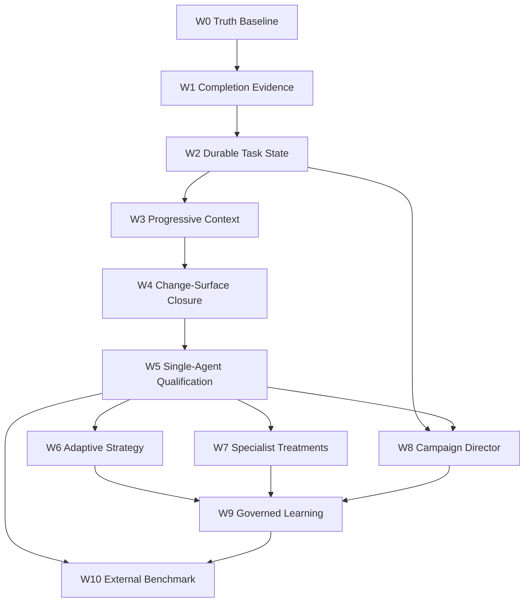

# AETHER SOTA Software-Engineering Agent Development Program

## 0. Legend + executive decision

This is the single proposed implementation plan assembled from the committed strategic and forensic drafts. It is one execution lineage: one substrate, one product run path, one evidence schema, and one control-first evaluation protocol. The strategic model, equations, competency profiles, security rules, and W0–W10 narrative are retained alongside the current-tree inventory, contradiction audit, file/symbol routing, operator order, and 35-ticket DAG. Treatments may be enabled or disabled, but they are not competing architectures.

This file proposes work and authorizes nothing. Current source, accepted canonical specifications, executable tests, and durable runtime evidence outrank it. A future acceptance step must explicitly promote any required delta into canonical execution documents; this merge does not edit those documents.

### Epistemic legend

| Tag | Meaning | Treatment |
|---|---|---|
| FACT | Observed in current source, tests, or a provenance-bound artifact | May constrain planning; re-check before implementation |
| MECHANISM | Code and tests exist | Does not imply product or benchmark success |
| INFERENCE | Engineering conclusion from evidence | Keep distinct from observation |
| PROPOSAL | Recommended work | Requires ticket, falsifier, owner, and WIP slot |
| ASPIRATION | Desired competitive position | Never present as a forecast or current score |
| CONTRADICTION | Authorities disagree | Record both sides; source and tests win |
| SUPERSEDED | Useful idea with an invalid location or ordering | Preserve insight; use the lattice-approved placement |

### Executive ordering

1. Establish HEAD-bound benchmark and repository identity, task membership, and missingness semantics.
2. Close false-positive completion on the default product path and remove invented verification counts.
3. Promote semantic task state into a domain value and make resume identity exact.
4. Bind progressive context and repository intelligence to workspace epochs and refresh after writes.
5. Prove greenfield and brownfield change-surface closure with recoverable multi-file transactions and tamper resistance.
6. Qualify a strong single-agent Coding Max control with preregistered statistics and explicit missingness.
7. Add metacognition, specialist roles, topology, campaign direction, memory, and skills only as measured, switchable treatments.
8. Enter external benchmark lanes only with independent verifiers, scaffold disclosure, and no score laundering.

The immediate critical path is tickets 01–08. Ticket 09 may be specified early but must not become authoritative state until admission truth is closed. No treatment, external spend, canonical-document edit, or T2 authorization is implied.

### Conflict-resolution laws

- Truth and admission precede semantic-state wiring; tickets 01–08 precede the session/ledger fold.
- The live T2-first board is a future delta to propose, not a reason to edit tasks.md here.
- Multi-file safety means **Preflighted Recoverable Multi-File Patch Transaction**: preflight, staged/recoverable writes, and explicit rollback; no crash-atomicity claim without a journal, staged tree, or worktree swap.
- Admission is a necessary predicate over epoch, subject identity, frozen verification-plan membership, task relevance, executed count, coverage/truncation, tamper class, pack completion, and result validity; it is never equivalent to process exit code alone.
- Brownfield reproducers and oracles are locked; feature, migration, and greenfield test edits require isolated deltas and independent review.
- Weights w, alpha, theta, and lambda remain unidentified until calibration; formulas stay, arbitrary constants do not.
- One substrate hosts many treatments. Control is gated minimal single-agent; the first bake-off is control plus at most two factors. mini-SWE-agent or an equivalent solve-to-patch baseline is mentioned for the same judge, not run or claimed here.
- Forge and Chimera remain quarantined experiments with the same result schema; CampaignDirector is a client of run_composed, never a second kernel or inner loop.
- Three headline metrics are reported together; provider and harness failures remain in R_system; dataset-invalid cases are excluded only when preregistered.

## 1. Inventory + contradictions

Legend for **Disposition**: `keep` = preserve and harden; `repair` = present but untruthful; `promote` = move to the correct layer; `defer` = do not productize yet; `reject-as-default` = keep as experiment, never the production loop.

### Substrate and control plane

| Capability | Owner | Actual implementation | Current evidence | Gap | Disposition |
|---|---|---|---|---|---|
| S0–S12 dispatch, typed budgets, attenuation | `vanguard/packages/kernel/` | 9 files, 1386 LOC; `dispatch.py` owns the pipeline | `check_tcb_budget.py` PASS; domain-blindness PASS | 52 LOC headroom; coding semantics must never enter | keep |
| Hexagonal ports | `vanguard/packages/ports/` | `ModelPort`, `EvaluatorPort`, `IndexPort`, SPI in `spi.py`; **no** symbol `KernelPort` (kernel collaborators are `Clock`/`EffectAdapter`/`Ledger`) | contract tests exist | docs that say `KernelPort` are stale | keep + doc repair later |
| Event-sourced ledger | `runtime/ledger_emitter.py`, SQLite WAL | single-writer; `State = fold(events)` | RF-25 test OK | resume episode-id synthesis (see §4.4) | keep + repair identity |
| Canonical composition | `runtime/compose.py`, `runtime/wiring.py` | one activation plan | M-3C historical | Forge/Chimera bypass this path | keep; isolate bypasses |

### Agency inner loop

| Capability | Owner | Actual implementation | Current evidence | Gap | Disposition |
|---|---|---|---|---|---|
| Episode turn loop | `agency/episode/engine.py` `EpisodeEngine`  | observe → propose → recover → admit finish → spawn or `kernel.dispatch` | `test_episode.py` OK | `_view` omits CodingTaskState | keep; enrich view via compiler, not a second loop |
| Completion admission | `agency/episode/admission_gate.py` `AdmissionGate.evaluate`  | write presets need changed files, inspection, bound `VerificationReceipt`, `executed_test_count > 0` | unit tests OK | preset-name substring heuristic; `**_` ignores greenfield kwargs; default pack exempt in session | repair |
| Session gate wiring | `runtime/session.py` `admission_required`  | exempt `vg-code-default`, `vg-code-lex`; else `patch.apply` in verbs | `ADMISSION_GATED_HARNESSES`  is **unused** | default product path can `finish` with zero effects | repair |
| Protocol recovery | `agency/episode/protocol_recovery.py` | fingerprint anti-repeat; truncation/patch-as-text retries | unit tests OK | string-marker `classify`; conversational accept when no patch required | keep + typed dialect later |
| Context compiler L1–L5 | `agency/context/compiler.py` , `layers.py`, `compaction.py` | prefix-frozen; brief exempt; result eviction | Budget tests OK | token estimate ≈ 4 chars/token; structured consolidate is keyword scrape; no `progressive.py` | keep L1–L5; add progressive as L4/L5 policy, not a fourth compiler |
| Context packet | `agency/context/packet.py` `ContextPacket`  | digestable packet with omissions | `validate_resume_identity` exists | session orientation packet often omits `repository_identity` / `selection_policy_identity` | repair |
| In-process spawn | `EpisodeEngine.spawn`  | attenuated child for tests/legacy | spawn tests | production recursion is `RuntimeChildRunner` | keep as test path only |

### Runtime session, state, resume

| Capability | Owner | Actual implementation | Current evidence | Gap | Disposition |
|---|---|---|---|---|---|
| HarnessSession | `runtime/session.py`  | constructs one kernel; injects meta-controller; observes completion; exterior evaluate | session tests exist | test-count regex fail-closed (good) but coarse; resume dumps state into L3 | repair |
| CodingTaskState | `runtime/task_state.py`, `fold_task_state` | discoveries, dead ends, todos, routes, implicated files | `test_coding_state` OK | lives in **runtime**, not domain; not consumed by ContextCompiler; `ProposalProduced` verification inference uses `"test" in action.lower()` | promote schema to domain; keep fold in runtime |
| SemanticTaskState | `docs/execution/FEATURE_SPEC.md` §3 | **absent** (`vanguard/packages/domain/task_state.py` does not exist) | claimed falsifier `test/contracts/test_semantic_task_state.py` absent | CMX-09 T2 not implemented | implement as domain value, fold from events |
| Checkpoints | `runtime/checkpoints.py` | blob-verified reconstruct; warm/cold parity | RF-96 tests exist | optional (needs blobs) | keep |
| ApplicationService.resume | `runtime/app_service.py` | `episode_id=f"episode-{resolved_run_id}"` | RF-25 proves **event fold** continuation | synthesized episode id may not match original ledger episode | repair |
| CodingMaxFacade | `apps/coding_max/facade.py` | thin client of `ApplicationService`; presets `fast|balanced|max` → `agency/manifests/vg-code-{preset}/manifest.json` | mechanism | no intelligence in apps; correct lattice | keep thin |

### Packs, verification, change surface

| Capability | Owner | Actual implementation | Current evidence | Gap | Disposition |
|---|---|---|---|---|---|
| code-default pack | `packs/code-default/` | harness.yaml, presets, plugin SPI, toolkits | pack tests exist | keyword `classify_task`; greenfield bypasses multi-file completeness | repair classifier; keep greenfield explicit |
| Change surface | `domain/transforms/repository/change_surface.py` `ChangeSurfaceEstimator` | traceback/brief regex + optional edges; `truncated` flag | mechanism | coverage_ratio can be 1.0 when primary empty; Python-path regex | repair estimator; do not treat ratio as proof |
| Implicated files | pack `implicated_files.py` | depth 1 / 128 file caps | mechanism | truncated sets must fail admission (already a reason code) except greenfield bypass | keep fail-closed; remove silent bypass |
| Git environment | `adapters/environment/git.py` `GitEnvironment.apply` | sequential writes; syntax is observation-only `ast.parse` | mechanism | **no** `transaction.py` Preflighted Recoverable Multi-File Patch Transaction | implement adapter Preflighted Recoverable Multi-File Patch Transaction; keep kernel blind |
| IndexPort | `ports/index.py` | observation-only repo map; `truncated` | port comment forbids ranking | no HEAD/mtime epoch protocol; pack IndexToolkit is regex, comment says no tree-sitter | add epoch; keep port policy-free |
| Exterior evaluator | `adapters/evaluators/`, `runtime/evaluator_gateway.py` | signed binding required to ledger a verdict | daemon/signing tests exist | product coding loop still uses local test output as admission evidence | keep gateway; bind local verify ≠ exterior verdict |

### Parallel engines, topology, memory

| Capability | Owner | Actual implementation | Current evidence | Gap | Disposition |
|---|---|---|---|---|---|
| ForgeEngine | `agency/forge/engine.py` | own tools, own admission, **bypasses Kernel.dispatch**; `if exit_code == 0 and test_count == 0: test_count = 1` in the current implementation | forge unit tests | second runtime semantics; false-positive completion | reject-as-default; quarantine from Coding Max scores |
| ChimeraEngine | `agency/chimera/engine.py` | parallel loop | chimera tests | same lattice tension | reject-as-default |
| Role manifests | `agency/manifests/{localizer,reviewer,test_investigator}.py` | helpers that write artifacts; reviewer has **no admission authority** | CMX-08 falsifiers | not autonomous agents | keep as treatments after Wave 5 |
| Topology lowering | `runtime/topology.py` | sequential default; rejects authority fields | topology tests OK | not a coding agent | keep |
| WorkflowScheduler | `runtime/workflow_scheduler.py` | sequential + `bounded_parallel` ThreadPoolExecutor | workflow tests | synthetic LeaseAcquired without kernel leases | repair parallel path or keep sequential-only in product |
| Child runtime | `runtime/child_runtime.py` | sole public recursion via `run_composed`; drops meta-controller | RF-101 tests | correct lattice | keep |
| Meta-controller | `runtime/meta_controller.py` | guarded consult; fail-closed on budget enlargement | M-6.5 falsifiers | opt-in; published study undeterminable | defer as default |
| Memory / skills | `runtime/memory.py`, `skill_lifecycle.py`, `skill_evaluation.py`, `governance/learning.py` | ports, unsigned registry refuses promote, held-out evaluator | M-8 lifecycle tests OK | no product wiring; MEM-02 blocked; presence≠use already encoded | defer productization |
| Tamper shield / Preflighted Recoverable Multi-File Patch Transaction / progressive compiler | FEATURE_SPEC §4–7 | **files absent** in `vanguard/` | claimed tests absent | T3–T5 of current sprint are unimplemented | implement on lattice, not as copies of review-tree code |

### Models

| Capability | Owner | Actual implementation | Current evidence | Gap | Disposition |
|---|---|---|---|---|---|
| Registry | `adapters/models/models_registry.json` | default `deepseek/deepseek-v4-flash-0731`; tier2 also `z-ai/glm-5.3-flash`; tier3 `openai/gpt-5.6-luna`; pricing micros recorded | file is source of truth | harness.yaml aliases can omit `-0731` | fail-closed resolve |
| Routing | `adapters/models/routing.py` | Single / TierEscalation / Fallback routers | mechanism | `resolve_route` swallows resolve exceptions; capabilities always empty tuple | repair |
| Dialect | `adapters/models/dialect.py` `normalize_response` | native tool_calls → fenced/balanced JSON; failures `not_json`/`truncated`/`missing_kind` | mechanism | FEATURE_SPEC taxonomy (`TRANSPORT`…`PERMISSION`) not implemented; `test/contracts/test_dialect_recovery.py` absent | enhance in adapter, not kernel |

### What VISION already forbids (FACT)

From [`VISION.md`](../VISION.md): event sourcing is the ontology; agents are projections not objects; memory/topology/learning are derived families not new cores; promotion requires separated generator/evaluator/promoter; mechanism ≠ acceptance. the merged plan does not reopen those decisions.

---

---

Each gap answers: what exists, where, what is missing, why it blocks long-horizon work, smallest next change, dependents, falsifier, promotion evidence, rollback.

### False-positive completion on the default path

**Exists.** `AdmissionGate` is strict when wired. `admission_required` exempts `vg-code-default` and `vg-code-lex`. `ADMISSION_GATED_HARNESSES` is documented and tested in spirit but **not consulted**.

**Why it blocks.** Long-horizon reliability is a product of honest terminals. If `finish` is a conversational act, compaction and resume preserve a lie.

**Smallest change.** Delete the exemption or replace it with an explicit `read_only` capability. Drive gating from verbs + task class, not from a second name set.

**Depends on this.** Every later wave’s pass rate.

**Falsifier.** A `vg-code-default` episode that issues `finish` with zero `patch.apply` receipts must be `abandoned`/`rejected`, not `completed`.

**Rollback.** If frozen RF-95 evidence depended on ungated default, record a successor baseline rather than silently widening the exemption again.

### Invented test counts (Forge)

**Exists.** `agency/forge/engine.py`  sets `test_count = 1` when `exit_code == 0` and parse failed.

**Contrast.** `runtime/session.py` `_observed_test_count`  returns 0 on unparseable output (correct fail-closed).

**Why it blocks.** Forge can admit “green” on empty or unparsed suites. Any benchmark that scores Forge against Coding Max is then incomparable.

**Smallest change.** Remove the fallback. If a later adapter cannot parse a CTRF/JUnit document, count is 0 and admission fails.

**Falsifier.** `exit_code == 0` + empty output ⇒ `VerificationReceipt.passed is False`.

### Heuristic verification classification

**Exists.** Session treats argv containing `pytest`/`unittest` or substring `"test"` as verification; exit code from `[exit N]` in detail; pack parsers accept `"OK" in output`.

**Why it blocks.** `python3 -c 'print("OK")'` and `ruff` on tests can look like verification. Test-count 0 should already fail admission; substring `"test"` can still attach a receipt to the wrong command.

**Smallest change.** Bind verification to an explicit subject: argv digest + workspace digest + task digest (AdmissionGate already has these fields). Refuse receipts whose command is not in the frozen verification plan.

### Incomplete restart identity

**Exists.** RF-25 proves fresh-process fold continuation. `ApplicationService.resume` synthesizes `episode_id=f"episode-{run_id}"`. Session dumps `task.resume_state` JSON into **immutable L3** at construction (`session.py` ). `ContextPacket.validate_resume_identity` is not fully populated on that path.

**Why it blocks.** Cognitive state (plan, dead ends, active file) is frozen in the prefix-cached environment. Later writes do not update L3. The model reasons about a snapshot that is definitionally stale after the first post-resume edit. Synthesized episode ids can fork attribution.

**Smallest change.** Persist original `episode_id`. Put `CodingTaskState` in L4 (stable notes) / L5 (turn-local), never L3. Recompile L4 from the fold every turn.

**Falsifier.** After resume + one write, the prefix bytes of L1–L3 match the pre-write prefix; L4 digest changes; original episode_id is preserved in events.

### Stale repository intelligence

**Exists.** IndexPort is observation-only (correct). Session pulls `repo_map(token_budget=4000)` once at construction into env_parts. Pack indexer comments that it is not tree-sitter. No workspace epoch / mtime / HEAD binding.

**Why it blocks.** After `patch.apply`, symbols and callers can be wrong. Progressive retrieval then maximizes the wrong subgraph.

**Smallest change.** Define `WorkspaceEpoch = (tree_hash, index_digest, source_revision)`. Invalidate the packet when tree_hash changes. Force `index.refresh` (mediated) before the next compile.

**Falsifier.** Write a function, then query callers: packet `truncated` or refresh required; never a pre-write caller set presented as current.

### Change-surface incompleteness

**Exists.** Regex estimator + depth-1 implicated builder. Completeness policy can reject empty/truncated sets, except greenfield bypass.

**Why it blocks.** Brownfield bugs whose names do not appear in the brief are under-localized. Over-broad directory prefixes dump noise into context.

**Smallest change.** Require IndexPort dependency/test edges for write presets. Treat `coverage_ratio` as non-evidence when `primary_files` is empty. Keep truncation as admission failure.

### Insufficient long-run evidence

**Exists.** Mechanism tests for 40-turn budgets, RF-25 death, compaction. **No** HEAD-bound live run of 40+ turns with exact patch identity.

**Why it blocks.** Compaction and resume bugs appear after the unit-test horizon.

**Smallest change.** After Waves 0–2, a frozen 40-turn internal task with ledger replay parity, not a leaderboard run.

### Benchmark membership errors

**Exists.** B1 included `__pycache__`; current runner filters `startswith("__")`; spend ledger already marked INVALID.

**Why it blocks.** Any citation of 9.5% or Forge 100% is contamination of the planning process itself.

**Smallest change.** Wave 0: enumerator contract test that the task set digest equals preregistration; refuse `__pycache__`, `.pytest_cache`, `.vanguard`.

### Multi-agent mechanisms without measured lift

**Exists.** Topology lowering, child runtime, localizer/reviewer manifests, workflow scheduler.

**Missing.** Paired ablation showing \(\Delta\) pass@1, \(\Delta\) cost, \(\Delta\) merge failures vs single-agent control.

**Disposition.** `reject-as-default` until Wave 5 control exists.

### Memory without held-out promotion on the product path

**Exists.** M-8 **mechanism** is strong (this session: contamination refused, lift threshold enforced, three authorities distinct, rollback executable).

**Missing.** MEM-02 empirical canary; product composition does not retrieve durable memory by default (`memory.py` comment: no public wiring before ADR-0100).

**Disposition.** Do not “turn memory on” to chase scores.

### Orchestration proposals not implemented

Octopus mailbox, CoordinationPlan DAG, outer-loop director, Hydra emergent agency, Chimera as default: **research**. FEATURE_SPEC T2–T5 files: **absent**. the merged plan will not copy review-tree file paths that violate the lattice (for example, putting coding oracles in `kernel/`).

### FEATURE_SPEC vs source (CONTRADICTION table)

| FEATURE_SPEC path | Source on HEAD `ebad36e` |
|---|---|
| `vanguard/packages/domain/task_state.py` | missing |
| `vanguard/packages/adapters/environment/transaction.py` | missing |
| `vanguard/packages/runtime/governance/tamper_shield.py` | missing |
| `vanguard/packages/agency/context/progressive.py` | missing |
| `test/contracts/test_semantic_task_state.py` | missing |
| `test/runtime/test_atomic_multi_file_transaction.py` | missing |
| `test/runtime/test_tamper_shield.py` | missing |
| `test/agency/test_progressive_context_compiler.py` | missing |
| `test/contracts/test_dialect_recovery.py` | missing |
| `adapters/models/dialect.py` | **exists**, narrower than FEATURE_SPEC taxonomy |

Sprint `tasks.md` still lists T2–T6 as the active DAG. the merged plan **agrees with the dependency order** (state → atomic writes → tamper → progressive context → dialect) and **disagrees with any reading that those modules already exist**.

### Draft reconciliation (do not copy blindly)

| Draft / research | Useful residue | Rejected or corrected |
|---|---|---|
| [`.draft/DEVELOPMENT_FINAL_PLAN.md`](DEVELOPMENT_FINAL_PLAN.md) | Same reliability-first ordering | Bound to SHA `7e08462c2cbb…`, not this HEAD; do not copy its evidence snapshot |
| [`.draft/todo/SOTA_CODING_HARNESS_ENGINEERING_ROADMAP.md`](todo/SOTA_CODING_HARNESS_ENGINEERING_ROADMAP.md) | Five systems challenges; pre-mutation impact | Overclaims “undisputed SOTA”; some file targets ignore packs vs kernel |
| [`.draft/todo/development_plan_guidelines_0209.md`](todo/development_plan_guidelines_0209.md) | Lattice, no second runtime, WIP | Forbids git; this planning task required git identity — planning ≠ that implementation prompt |
| [`.draft/HYDRA_MULTI_AGENT_TOPOLOGY_AND_EMERGENT_AGENCY.md`](HYDRA_MULTI_AGENT_TOPOLOGY_AND_EMERGENT_AGENCY.md) | Mailbox metaphor | Default swarm; competing runtime authority |
| [`.draft/SONNET_SUPER_AGENT.md`](SONNET_SUPER_AGENT.md) | Competency rhetoric | Model folklore as architecture |
| Octopus `long-horizon-context-engine.md` / `outer-loop-orchestrator.md` | Progressive packets; campaign director **above** EpisodeEngine | Not implemented; must not become a second engine |
| `docs/research/coding_harness/VANGUARD_VS_LIM_INSIGHTS_SOTS_TECHNIQUES.md` | LIM as **skunkworks**; prefix-cache hypothesis | Empirical 83% turn reduction / $0.00033 claims are **not** exact-subject for HEAD `ebad36e`; LIM is not runtime authority ([`README.md`](../README.md)) |
| FEATURE_SPEC synthetic oracle protocol | Greenfield TDD stages | Tamper shield hashing via `Path.glob("test/**")` is incomplete on real trees; implement with explicit test-file enumeration from IndexPort |

---

## 2. Thesis, units, and non-goals

### Product thesis

AETHER should become an event-sourced operating substrate for engineering campaigns.

The unit of truth is a typed causal operation within a lineage.

The unit of delivery is a verified task contract.

The unit of long-horizon coordination is a durable campaign graph of task contracts.

The unit of learning is a promoted policy or skill with held-out evidence and rollback identity.

### Definition of a SOTA engineering agent

A SOTA agent is not one that emits impressive prose.

It is one that maximizes accepted engineering value under constraints:

$$
\pi^*
=
\arg\max_{\pi}
\mathbb{E}
\left[
Q_{\text{functional}}
+ \lambda_a Q_{\text{architecture}}
+ \lambda_m Q_{\text{maintainability}}
- \lambda_c C
- \lambda_r R
\right],
$$

subject to:

$$
\text{authority}(a_t)\subseteq\text{grant}_t,
\qquad
\mathbf{B}_{t+1}\preceq\mathbf{B}_t,
\qquad
\text{accept}(\tau)\Rightarrow V_{\text{exterior}}(\tau)=\text{pass}.
$$

The quality terms mean:

- functional correctness under independent tests;
- architectural conformance under repository-specific constraints;
- maintainability across future changes;
- measured money, token, latency, and effect cost;
- security, regression, uncertainty, and evidence risk.

### Non-goals for the backend program

The following are explicitly deferred:

- TUI visual design;
- desktop visualization;
- animated topology graphs;
- a second mutable agent-state database;
- a second execution engine for swarms;
- kernel-level coding semantics;
- automatic self-certification;
- uncontrolled autonomous skill installation;
- benchmark-specific hidden-test guessing;
- hardcoded role classes for every engineering title;
- unbounded parallel agents;
- 90% leaderboard marketing before exact reproducible evidence.

---

## 3. Competency

### Shared competency dimensions

Every engineering profile should be scored on the same dimensions.

| Dimension | Observable | Required evidence |
|---|---|---|
| Problem framing | explicit goal and constraints | goal digest and ambiguity log |
| Localization | implicated symbols and files | retrieval receipt and inspected set |
| Planning | dependency-aware task graph | versioned plan artifact |
| Implementation | bounded, coherent change | patch receipts and change surface |
| Verification | task-relevant falsification | typed verifier receipt |
| Recovery | progress after failure | strategy-change evidence |
| Architecture | conformance and trade-offs | invariant checks and decision record |
| Communication | concise handoff | evidence-linked summary |
| Leadership | decomposition and review | campaign DAG and exterior verdicts |
| Economics | value per cost | measured cost and latency |

### Senior Developer profile

The Senior Developer profile owns one bounded task contract.

It must:

- reproduce before repairing when feasible;
- locate the smallest causal change surface;
- preserve repository conventions;
- add or update falsifiers;
- run targeted validation during iteration;
- run required gates before completion;
- report uncertainty honestly;
- leave a resumable task state.

Its default topology is one worker.

Its optional reviewer is triggered only by risk.

### Staff Engineer profile

The Staff Engineer profile owns a multi-package technical outcome.

It must additionally:

- construct a dependency DAG;
- partition interfaces before files;
- manage migrations and compatibility windows;
- coordinate concurrent read-only investigation;
- serialize conflicting writes;
- track cross-package acceptance predicates;
- maintain a decision and risk register;
- produce integration evidence.

Its default topology is director plus sequential package workers.

### Principal Architect profile

The Principal Architect profile owns system evolution under constraints.

It must additionally:

- identify constitutional and normative constraints;
- model alternatives and reversal conditions;
- quantify blast radius and migration cost;
- define stable ports rather than premature implementations;
- preserve one source of runtime authority;
- preregister architectural experiments;
- reject complexity without measured lift;
- specify rollback and compatibility semantics.

Its primary artifacts are plans, decision proposals, formal invariants, and executable architecture tests.

### Tech Lead profile

The Tech Lead profile owns campaign execution.

It must additionally:

- maintain WIP limits;
- assign bounded work packages;
- monitor evidence and budget events;
- resolve blockers or escalate;
- request revision at package boundaries;
- prevent duplicated ownership;
- close the campaign only when all acceptance predicates resolve;
- preserve human override.

The Tech Lead should not be a privileged bypass.

It is a policy-constrained consumer of the same runtime.

---

---

These are **measurable product profiles**, not job-title claims about replacing humans. Benchmark scores do not equal professional replacement ([OpenAI, separating signal from noise](https://openai.com/index/separating-signal-from-noise-coding-evaluations/)).

METR’s 50% time-horizon is a different construct (human-expert duration at 50% success on METR’s suite) and is saturating at long durations; METR warns measurements above 16 hours are unreliable with the current suite ([METR time horizons](https://metr.org/time-horizons/)). the merged plan uses METR only as a **qualitative horizon language**, not as a pass criterion.

### Senior Developer

| Axis | Requirement |
|---|---|
| Scope | 1–20 files; bugfix/feature within an existing architecture; 15–60 turns |
| Default topology | Single agent, `vg-code-balanced` |
| Abilities | Reproduce, localize with IndexPort, surgical patch, affected tests, truthful `finish` |
| Artifacts | Patch, bound verification receipt, ledger |
| Verification | Bound-local lattice ≥ `bound-local-receipt`; tamper shield on brownfield |
| Completion gate | AdmissionGate + pack completeness; zero-test fail closed |
| Internal criterion | Frozen senior-class suite Wilson LB \(\ge 0.50\) at \(n\ge 30\) **after** Waves 0–5 |
| External | Not claimed; DeepSWE-like tasks are often harder than “senior afternoon bugs” |

### Staff Engineer

| Axis | Requirement |
|---|---|
| Scope | Cross-module change; migration; 40–120 turns; resume ≥1 |
| Default topology | Single agent + optional `test_investigator → implementer` **after** ablation |
| Abilities | Blast-radius closure, epoch refresh, dead-end memory, budget-aware escalation |
| Artifacts | Plan DAG in \(\sigma\), implicated set, verification subject list |
| Verification | Affected-test closure + regression set; truncated ⇒ fail |
| Completion gate | All TaskSteps `VERIFIED` (once SemanticTaskState exists) |
| Internal criterion | Staff-class frozen suite LB \(\ge 0.40\) **and** resume parity on ≥5 tasks |
| External | SWE-bench Pro public is the closest published analogue; **do not** quote vendor 80% as this profile |

### Principal Architect

| Axis | Requirement |
|---|---|
| Scope | Greenfield multi-package or brownfield architectural change; contracts before code |
| Default topology | `architect-plan` (single writer) then implementer; reviewer has no admit authority |
| Abilities | Extract requirements, write ports/types first, synthetic failing oracle, topological file DAG |
| Artifacts | Architecture notes in \(\sigma.settled\_invariants\), oracle digest, scaffold |
| Verification | Oracle fail-on-stub (FEATURE_SPEC §5) then pass-on-impl; no test mutation |
| Completion gate | Behavioral oracle + smoke + files exist; greenfield completeness policy |
| Internal criterion | Greenfield suite \(n\ge 15\) with oracle-vacuity checks |
| External | DeepSWE’s original tasks are closer than mined SWE-bench; still not “principal architect” |

### Tech Lead

| Axis | Requirement |
|---|---|
| Scope | Campaign of multiple tasks; merge policy; operator checkpoints |
| Default topology | Outer-loop director; inner loop still single-writer episodes |
| Abilities | Decompose, sequence, refuse to start Wave-7 treatments without control, report missingness |
| Artifacts | CoordinationPlan, per-node receipts, campaign fold |
| Verification | Each node independently admitted; campaign success ≠ OR of conversational summaries |
| Completion gate | All required nodes signed; rollback of a node does not corrupt others’ CAS artifacts |
| Internal criterion | Campaign fixture of ≥8 nodes, one forced crash, resume of remaining DAG |
| External | Not a public leaderboard |

### Mapping to public benches (cautious)

| Profile | Internal suite | Public analogue (not equivalent) |
|---|---|---|
| Senior | B1-class 20 tasks **after membership repair** | SWE-bench Verified is too saturated to certify this |
| Staff | Multi-file brownfield 30+ | SWE-bench Pro public (731), Scale standardized ~55–62% frontier as of 2026-09-03 |
| Principal / long-horizon | Greenfield + original tasks | DeepSWE v1.1 (113 tasks, 91 repos); leaders 74%±1–4% on mini-swe-agent |
| Tech lead | Campaign DAG | None; do not fake one |

---

## 4. Formal model

### Partially observable engineering process

Model a repository task as a constrained POMDP:

$$
\mathcal{M}
=
(\mathcal{S},\mathcal{A},\mathcal{O},T,Z,R,\gamma,\mathbf{B},\mathcal{G}).
$$

Here:

- $\mathcal{S}$ is actual repository, process, test, and ledger state;
- $\mathcal{A}$ is the capability-scoped operation set;
- $\mathcal{O}$ is bounded observations and retrieved context;
- $T$ is the effect transition induced by tools;
- $Z$ maps hidden state to observations;
- $R$ is exterior engineering value;
- $\gamma$ discounts delayed value;
- $\mathbf{B}$ is the typed budget vector;
- $\mathcal{G}$ is the set of hard gates.

The language model never observes $s_t$ directly.

It acts on a compiled belief-supporting context $c_t$.

### Semantic task state

Define the durable task projection:

$$
X_t
=
(g,p,h,d,q,v,n,r,u),
$$

where:

- $g$ is the immutable goal contract;
- $p$ is the current versioned plan;
- $h$ is the active hypothesis set;
- $d$ is accumulated discoveries;
- $q$ is open obligations and TODOs;
- $v$ is verification state;
- $n$ is the next admissible action class;
- $r$ is remaining typed budget;
- $u$ is explicit uncertainty.

The projection is reconstructed by folding events:

$$
X_t=\operatorname{fold}(X_0,e_1,\ldots,e_t).
$$

No resume implementation may invent missing fields.

Missing identity becomes `undeterminable` or a blocked transition.

### Progress potential

Use a deterministic progress potential for loop control:

$$
\Phi_t
=
w_q\frac{|q_0|-|q_t|}{\max(1,|q_0|)}
+w_e\Delta E_t
+w_c\Delta C_t
-w_f F_t
-w_r R_t,
$$

where:

- $\Delta E_t$ is new evidence;
- $\Delta C_t$ is verified change-surface closure;
- $F_t$ is repeated failure mass;
- $R_t$ is regression or rollback mass.

The controller may change strategy when $\Delta\Phi_t\le0$ for a bounded window.

It may not widen authority.

### Context allocation

Let blocks $i$ have token cost $c_i$, estimated utility $u_i$, freshness $f_i$, dependency relevance $d_i$, and risk relevance $r_i$.

Context selection is a constrained submodular optimization:

$$
S^*
=
\arg\max_{S\subseteq\mathcal{I}}
\left[
\sum_{i\in S}(\alpha u_i+\beta f_i+\chi d_i+\delta r_i)
-\eta\sum_{i\ne j\in S}\operatorname{redundancy}(i,j)
\right]
$$

subject to:

$$
\sum_{i\in S}c_i\le B_{\text{context}},
\qquad
F_{\text{mandatory}}\subseteq S.
$$

Mandatory blocks include goal, authority constraints, open obligations, and the latest verification identity.

### Retrieval value of information

Retrieve only when expected information gain exceeds cost:

$$
\operatorname{VOI}(r)
=
\mathbb{E}[H(H_t)-H(H_{t+1})\mid r]
-\lambda_c C(r)
-\lambda_l L(r).
$$

This prevents endless reading.

The practical approximation uses:

- unresolved hypothesis count;
- caller uncertainty;
- missing test association;
- stale repository epoch;
- prior retrieval duplication.

### Blast-radius closure

Let $I$ be implicated files, $D^+(I)$ downstream dependents, $T(I)$ associated tests, and $P$ the patch surface.

Define required closure:

$$
\mathcal{C}(P)
=
P\cup D^+(P)\cup T(P)\cup\operatorname{DocsOwner}(P).
$$

Completion requires evidence over the applicable portion of $\mathcal{C}(P)$.

Truncation must be explicit:

$$
\operatorname{truncated}(\mathcal{C})\Rightarrow\neg\operatorname{admit}.
$$

### Verification confidence

Verification should be a lattice, not a Boolean guessed from stdout:

```text
UNKNOWN
  < COMMAND_OBSERVED
  < RUNNER_IDENTIFIED
  < TESTS_COUNTED
  < SUBJECT_BOUND
  < TASK_RELEVANT
  < EXTERIOR_CONFIRMED
```

Admission requires a task-specific minimum lattice element.

For code changes, zero exit alone remains below `TESTS_COUNTED`.

### Strategy selection

Treat optional agent mechanisms as contextual bandit arms, not permanent architecture.

For strategy $k$:

$$
U_k(x)
=
\hat p_k(\text{pass}\mid x)V
-\lambda_\$\mathbb{E}[C_\$]
-\lambda_t\mathbb{E}[C_t]
-\lambda_v\operatorname{Var}(Y_k).
$$

The context $x$ includes task class, repository size, language, uncertainty, and failure signature.

Only policies with held-out positive utility are promoted.

### Multi-agent bifurcation rule

Do not spawn merely because a task is long.

Compute a bifurcation score:

$$
\mathcal{B}(x)
=
\theta_0
+\theta_1 U_{\text{loc}}
+\theta_2 C_{\text{dep}}
+\theta_3 S_{\text{spec}}
+\theta_4 K_{\text{ctx}}
+\theta_5 R_{\text{risk}}.
$$

Spawn specialists only when:

$$
P(\Delta Q>\Delta C\mid\mathcal{B})\ge\tau.
$$

The coefficients must be learned or calibrated from trajectories.

They must not be copied from draft numerology.

### Campaign reliability

For a DAG of packages $V$ and dependency edges $E$:

$$
P_{\text{campaign}}
\le
\prod_{v\in V}P_v
\prod_{(u,v)\in E}(1-P_{\text{interface-drift}}^{u,v}).
$$

This motivates explicit interface artifacts, independent package verification, and early integration checks.

### Cost per signed pass

The primary economic metric is:

$$
CSP
=
\frac{\sum_i C_i}{\sum_i\mathbb{1}[V_i=\text{signed pass}]}.
$$

Report it with pass rate, latency, tokens, turns, and missingness.

Never optimize token cost by silently weakening verification.

### Long-horizon quality erosion

Single-shot pass rate misses future cost.

Define architectural erosion after checkpoint $j$:

$$
E_j
=
\alpha\,\Delta\operatorname{duplication}_j
+\beta\,\Delta\operatorname{complexity concentration}_j
+\gamma\,\Delta\operatorname{dependency cycles}_j
+\delta\,\Delta\operatorname{change amplification}_j.
$$

An iterative campaign fails quality qualification if $E_j$ exhibits a sustained positive trend despite passing local tests.

---

---

Assumptions are stated. Constants that are not estimated from this repository are marked **unidentified**.

### Constrained POMDP

Let an episode be a constrained POMDP

\[
\mathcal{M} = \langle \mathcal{S}, \mathcal{A}, \mathcal{O}, T, Z, R, \gamma, \mathcal{C} \rangle
\]

- \(\mathcal{S}\): workspace tree, test oracle, hidden bug/feature semantics, budget remaining, epoch.
- \(\mathcal{A}\): mediated effects (`fs.read`, `patch.apply`, `test.run`, `spawn`, `finish`, …) plus `abstain`.
- \(\mathcal{O}\): receipts, compiler packet, admission feedback — **not** the true tree.
- \(T(s'|s,a)\): deterministic for filesystem effects if the adapter is honest; stochastic for models and flaky tests.
- \(Z(o|s',a)\): observation channel; compaction and stale indexes corrupt \(Z\).
- \(R\): 1 iff exterior (or bound local) verifier accepts **and** admission is admissible; 0 if fail; **undefined** if missing — missing is not 0.
- \(\gamma \in (0,1]\): not identified; do not pick 0.99 for rhetoric.
- \(\mathcal{C}\): capability + budget constraints. Kernel enforces \(\mathcal{C}\) independently of \(R\).

Policy \(\pi\) is **not** inside the kernel. \(\pi\) is the composition of model, compiler, pack completion policy, and optional meta-controller.

**Constraint.** For all \(a\) not authorized by the current grant, \(T\) is not invoked; a denial event is appended. This is already MECHANISM.

### Event-sourced semantic task state

Let \(E_{1:n}\) be the ledger. A projection \(\Phi\) yields task state:

\[
\sigma_n = \Phi(E_{1:n}) \in \Sigma
\]

Today \(\Phi\) is `fold_task_state` producing `CodingTaskState` (runtime). FEATURE_SPEC wants \(\Sigma =\) `SemanticTaskState` (domain) with monotonic `revision`.

**Required properties (PROPOSAL, testable):**

1. **Immutability of prefixes:** \(\Phi(E_{1:k})\) depends only on \(E_{1:k}\).
2. **Monotone revision:** \(k < n \Rightarrow \sigma_n.\mathrm{revision} \ge \sigma_k.\mathrm{revision}\).
3. **JCS digest stability:** `digest_of(canonical(\(\sigma\)))` is RFC 8785 stable ([RFC 8785](https://www.rfc-editor.org/rfc/rfc8785)).
4. **No I/O in \(\Phi\)** if \(\sigma\) lives in domain.

**INFERENCE.** Dumping \(\sigma\) into L3 violates (1) for the *prompt* even if the ledger fold remains correct: the prompt is a second, stale projection.

### Progress potential

Define a Lyapunov-like potential on \(\sigma\):

\[
V(\sigma) = \alpha_1 U_{\text{unverified}} + \alpha_2 |\mathrm{open\ todos}| + \alpha_3 |\mathrm{uninspected\ modified}| + \alpha_4 \mathbf{1}[\neg \mathrm{epoch\ fresh}]
\]

with \(\alpha_i > 0\) **unidentified**. Admission of `finish` requires \(V(\sigma)=0\) on the **gated** coordinates (modified files inspected, verification bound, epoch fresh). Do not optimize \(V\) inside the kernel.

A turn is *honest progress* if \(V(\sigma_{t}) < V(\sigma_{t-1})\) or a new dead-end is recorded that strictly reduces the remaining hypothesis set. Repeating a semantically equal failed patch is not progress (`protocol_recovery` already fingerprints attempts — MECHANISM).

### Context optimization

Let token budget \(B\). Layers \(L_1,\ldots,L_5\) with freeze prefix \(L_1{\parallel}L_2{\parallel}L_3\).

\[
\max_{C \subseteq \mathcal{U}} \; F(C) \quad \text{s.t.} \quad \sum_{c \in C} \hat{\tau}(c) \le B - \tau_{\text{prefix}}
\]

where \(\mathcal{U}\) is the universe of candidate snippets (AST slices, stubs, receipts). \(F\) should be submodular if greedy packing is used (LDA’s compiler already uses submodular packing for **docs**; coding packets currently use truncation + recency).

**Token estimator.** Current \(\hat{\tau}(s) \approx |s|/4\). Error \(\varepsilon_\tau\) biases packing. PROPOSAL: calibrate \(\hat{\tau}\) per dialect on held-out traces; until then treat \(\hat{\tau}\) as biased and keep a reserve (session already reserves 1000 tokens in packet build — MECHANISM).

**Non-theorem.** More tokens \(\not\Rightarrow\) higher \(\Pr(\text{pass})\). DeepSWE prompts are ~half of SWE-bench Pro length with harder tasks ([DeepSWE paper](https://arxiv.org/abs/2607.07946)). the merged plan therefore optimizes *relevant* \(F(C)\), not \(|C|\).

### Retrieval value of information

For a candidate snippet \(c\):

\[
\mathrm{VoI}(c) = \mathbb{E}[R \mid C \cup \{c\}] - \mathbb{E}[R \mid C]
\]

This expectation is **unidentified** at planning time. Practical surrogate (PROPOSAL):

\[
\widetilde{\mathrm{VoI}}(c) = \mathbb{1}[c \in \mathrm{implicated}(\sigma)] \cdot w_{\text{kind}}(c) \cdot \mathbb{1}[\mathrm{epoch}(c)=\mathrm{epoch}(\sigma)]
\]

Zero VoI if epoch mismatch. IndexPort must not compute \(\pi\) (port comment already forbids ranking “on the agent’s behalf”). Ranking belongs in the **pack compiler policy**, which is a replaceable \(\pi\) component, not in the indexer.

### Blast-radius closure

Let \(G=(V,E)\) be the file/symbol dependence graph from IndexPort. For a patch \(P\) touching \(V_P\):

\[
\mathrm{Blast}(P) = \mathrm{Reach}_{E}^{k}(V_P) \cup \mathrm{Tests}(V_P)
\]

Admission for brownfield write tasks requires:

\[
V_P \subseteq \mathrm{Inspected}(\sigma) \quad \text{and} \quad \mathrm{Tests}(V_P) \subseteq \mathrm{VerifiedSubject}(\sigma) \quad \text{or truncated} \Rightarrow \text{fail closed}
\]

Current estimator is not \(G\); it is regex. Until IndexPort edges are epoch-bound, treat \(\mathrm{Blast}\) as an **upper bound with `truncated` bit**, never as complete.

### Verification confidence lattice

Define a lattice (bottom = least confidence):

\[
\bot \prec \text{parsed-output} \prec \text{bound-local-receipt} \prec \text{tamper-checked-local} \prec \text{signed-exterior-verdict}
\]

- `parsed-output`: regex on stdout. Current session path.
- `bound-local-receipt`: `VerificationReceipt` fields already on AdmissionGate (MECHANISM) **if** populated.
- `tamper-checked-local`: FEATURE_SPEC T4 (absent).
- `signed-exterior`: `evaluator_gateway` (MECHANISM) — product coding admission does not require this today.

**Law.** A higher node may imply a lower node; never the reverse. Model self-review is **not on this lattice**. Boolean `verification_passed=True` without a receipt is already rejected (`admission_gate.py` ).

Forge’s `test_count=1` is an illegal jump from \(\bot\) to `parsed-output`.

### Strategy selection

Let treatments \(u \in U = \{\text{single}, \text{localize-then-patch}, \text{test-first}, \ldots\}\). Choose

\[
u^\star = \arg\max_{u \in U} \left( \hat{p}_u - \lambda \hat{c}_u - \rho \widehat{\mathrm{Var}}(p_u) \right)
\]

subject to: \(u=\text{single}\) remains the **control**; any other \(u\) requires a paired study. \(\lambda\) is cost aversion (preregistration already has `lambda_usd_per_success: 1.0` — protocol constant, not a physical law). Meta-controller today is a consult with value-in/value-out guards, not this optimizer.

### Multi-agent bifurcation

A bifurcation of a parent lineage into children \(i=1..m\) with merge \(\mu\):

\[
R_{\mu} = \Pr(\mu(\{P_i\}) \text{ passes}) \le \sum_i \Pr(P_i \text{ passes}) \quad \text{(union bound; usually much worse)}
\]

For isolated patches with exterior selection, a tighter model is:

\[
R_{\text{sel}} = \Pr(\exists i: P_i \text{ passes} \land \mathrm{selector} \text{ picks a passing } i)
\]

If the selector is the same model, \(\mathrm{selector}\) is correlated with generators (not independent). the merged plan requires the selector to be **exterior tests**, not a reviewer LLM, for any treatment that claims lift.

### Campaign reliability

For \(K\) tasks i.i.d. Bernoulli(\(p\)):

\[
\hat{p} = \frac{S}{K_{\text{evaluated}}}, \quad K_{\text{evaluated}} = K - K_{\text{missing}}
\]

Missing (harness error, provider 5xx, invalid membership) **must not** enter the denominator as failures or the numerator as successes. Wilson interval:

\[
\hat{p}_W = \frac{\hat{p} + \frac{z^2}{2n}}{1+\frac{z^2}{n}} \pm \frac{z}{1+\frac{z^2}{n}}\sqrt{\frac{\hat{p}(1-\hat{p})}{n}+\frac{z^2}{4n^2}}
\]

with \(z=1.96\) as in `sota_preregistration.json`. Protocol tests for Wilson/McNemar **exist** (`test_sota_protocols` OK) and are not a substitute for a valid \(n\).

### Cost per signed pass

\[
\kappa = \frac{\sum \mathrm{USD} + \lambda_h \sum \mathrm{harness\_hours}}{\#\{\text{signed exterior or bound-local passes}\}}
\]

Report \(\kappa\) with the same missingness rules. Do not minimize \(\kappa\) by skipping verification.

### Iterative architectural erosion

Let quality \(Q_t\) be a hidden attribute (type-check cleanliness, invariant preservation). A naive loop that patches until tests pass can decrease \(Q\):

\[
Q_{t+1} = Q_t - \eta \mathbb{1}[\text{tests pass} \land \text{no review of } \mathrm{Blast}(P)]
\]

\(\eta\) unidentified. Mitigations that **are** lattice-legal: blast-radius tests, tamper shield, reviewer treatment **without** admission authority (already true of `reviewer.py`).

### Budget attenuation

Kernel already implements monotonic attenuation: child budgets \(\le\) parent remainder. Formally a residual vector \(b \in \mathbb{N}^d\):

\[
b_{\text{child}} \le b_{\text{parent}} - b_{\text{reserved}}, \quad b \ge 0
\]

Do not add a second governor in Forge. Children must not inherit meta-controller authority (`child_runtime.py` already drops it — MECHANISM).

### Skill promotion lift

Let \(p_0, p_1\) be held-out pass rates without/with skill composition. Promote only if:

\[
\hat{p}_1 - \hat{p}_0 \ge \delta, \quad \delta = 0.05 \text{ (M-8 backlog constant)}
\]

and generator \(\neq\) evaluator \(\neq\) promoter (already refused in tests). A single successful trajectory is \(\delta\)-inadmissible almost surely for any interesting \(n\).

---

All weights and thresholds in the equations above are unidentified parameters until a preregistered calibration study estimates them. No fixed weight or threshold is an implementation default.

## 5. Lattice + placement

### Architectural shape

```text
Campaign Service
  -> durable CampaignPlan projection
  -> OuterLoopPolicy
  -> Runtime application service
  -> HarnessSession
  -> EpisodeEngine
  -> Kernel S0-S12
  -> capability-scoped adapters
  -> immutable receipts
  -> exterior evaluator
  -> campaign reducer
```

The outer loop is above runtime execution.

It must not bypass `ApplicationService`, `Runtime`, `HarnessSession`, or the kernel.

### Required new domain values

The eventual implementation should define domain-pure values for:

- `GoalContract`;
- `AcceptancePredicate`;
- `TaskClass`;
- `TaskObligation`;
- `Hypothesis`;
- `EvidenceRef`;
- `VerificationLevel`;
- `RepositoryEpoch`;
- `ContextSelection`;
- `CampaignPlan`;
- `CampaignNode`;
- `CampaignEdge`;
- `PackageHandoff`;
- `DirectorDirective`;
- `EscalationReason`;
- `StrategyTreatment`;
- `BenchmarkSubject`.

These values contain no model provider, filesystem I/O, or runtime authority.

### Required ports

Prefer small ports that express stable capabilities:

- `TaskStatePort` for reading durable task projection;
- `RepositoryIntelligencePort` by extending or composing `IndexPort`;
- `VerificationPort` for typed runner evidence;
- `CampaignStorePort` over the existing event store semantics;
- `OuterLoopPolicyPort` for next-action decisions;
- `DirectorReviewPort` for bounded supervisory judgments;
- `StrategyRegistryPort` for qualified treatments;
- `BenchmarkExecutorPort` for exact-subject attempts.

Avoid provider-shaped interfaces.

Avoid a `SeniorDeveloperAgent` class hierarchy.

### Typed verification receipt

A verification receipt should contain at least:

```text
receipt_id
run_id
episode_id
task_digest
composition_digest
workspace_before_digest
workspace_after_digest
repository_epoch
command_argv
runner_kind
runner_version
exit_code
tests_collected
tests_executed
tests_passed
tests_failed
tests_skipped
selected_test_ids_digest
coverage_scope_digest
changed_surface_digest
stdout_artifact
stderr_artifact
started_at
finished_at
effect_receipt_digest
evaluator_identity
signature
```

Unknown fields remain unknown.

They are never converted to a cheerful default.

### Progressive context packet

Each turn should receive a packet with explicit sections:

```text
immutable system core
tool schemas
goal contract
repository authority constraints
semantic task state
current plan frontier
active hypothesis and alternatives
ranked repository evidence
latest effect receipts
latest verification receipt
omitted-items report
remaining budget
next-action affordances
```

The packet carries selection identity and repository epoch.

After every write, dependency-changing command, or generated-file update, the epoch changes.

Stale packets cannot justify completion.

### Durable campaign state

The campaign reducer should derive:

- declared objective;
- plan versions;
- node readiness;
- leased node ownership;
- attempt identities;
- package artifacts;
- package verdicts;
- unresolved interfaces;
- risk register;
- budget allocations;
- operator interventions;
- next ready nodes;
- terminal disposition.

The reducer must be deterministic.

Checkpoints remain disposable caches with proof obligations.

### Content-addressed handoffs

Agents should exchange artifact references, not transcript copies.

A package handoff should contain:

- goal digest;
- plan-node digest;
- relevant source revision;
- changed-surface digest;
- interface delta digest;
- verification receipt references;
- unresolved risks;
- next recommended action;
- explicit uncertainty;
- content digest.

This provides bounded communication and replayable provenance.

### Director semantics

The director may emit only:

- `dispatch_ready_node`;
- `request_revision`;
- `request_investigation`;
- `request_integration`;
- `pause_for_operator`;
- `reallocate_budget` within its grant;
- `close_campaign` when predicates resolve;
- `mark_undeterminable`.

The director may not:

- forge verification;
- write around the worker grant;
- mutate historical events;
- promote its own skills;
- declare exterior acceptance;
- silently add scope.

### Single-writer rule

Parallel agents may investigate disjoint questions.

Repository writes should default to one active writer per workspace.

Alternative branches may be used only with explicit merge ownership.

Every merge is a new effect with its own verification obligation.

This avoids shared-worktree races and invisible conflict resolution.

---

---

Preserve:

```text
domain ← ports ← kernel ← agency ← runtime → adapters
                              ↓
                         apps/ (runtime client)
```

Coding semantics stay in **packs + agency callbacks + runtime session policy**. Kernel remains domain-blind. `apps/coding_max/facade.py` stays thin.

### Inner loop (canonical)

```text
ApplicationService.run
  → Runtime.execute_profiled / compose
  → HarnessSession
       → ContextCompiler(L1–L5 + progressive L4/L5 from Φ(events))
       → EpisodeEngine.run
            → ModelPort.propose
            → protocol_recovery
            → completion_admitter (pack + AdmissionGate)
            → Kernel.dispatch            [only effect path]
            → ledger events
  → EvaluatorGateway (optional signed verdict)
```

**Forbidden.** ForgeEngine / ChimeraEngine on this path. Direct subprocess from packs. Apps importing kernel.

### Outer loop

A campaign director is a **runtime client** that submits a DAG of `TaskContext` values to the same `Runtime.run_composed`, persisting handoffs as blob digests. It is not an EpisodeEngine subclass and not a kernel stage.

```text
CampaignDirector (runtime)
  → for node in CoordinationPlan:
        artifact_in = CAS.get(digest)
        result = Runtime.run_composed(role_manifest, task)
        CAS.put(result.artifacts)
  → merge policy (CONCAT | FIRST_COMPLETE | EXTERIOR_SELECT | UNANIMOUS)
```

`UNANIMOUS` without exterior tests is just correlated LLM agreement. Default merge for patches is **EXTERIOR_SELECT**.

### Campaign projection

`CampaignState = fold(campaign_events)` analogous to `CodingTaskState`. Lives in domain as values; runtime folds. Never a mutable `Agent` object (VISION).

### Content-addressed handoffs

Handoffs are `digest_of(payload)` blobs already in the store. Roles communicate by digest references in `task.artifact_refs` (session already renders those into env_parts — MECHANISM). Do not add shared mutable memory between roles.

### Director policy

Director may **choose treatments** (Wave 7+) from a frozen catalog. It may not grant capabilities, enlarge budgets, or mark `completed`. Those remain kernel + admission + evaluator.

### Typed verification

Replace stdout folklore with, in order:

1. CTRF/JUnit/unittest parsed counts (0 if unknown).
2. `VerificationReceipt` identity fields (already specified).
3. Tamper shield on enumerated test files (Wave 1–2).
4. Optional signed exterior verdict for release claims.

### Repository epoch

```text
WorkspaceEpoch := {
  treeHash,           # git or hashed tree
  indexDigest,        # IndexPort snapshot
  sourceRevision,     # already on RepositoryMap
  compiledAtTurn
}
```

Compiler inputs include epoch. Resume identity includes epoch. Stale epoch ⇒ refresh or fail closed.

### Progressive context packet

Keep `ContextPacket`. Populate `repository_identity` and `selection_policy_identity` on every product compile. FEATURE_SPEC 4-tier budget is a **policy over L4/L5**, not a replacement of L1–L5 prefix freeze (INV-DELTA-5).

Proposed mapping:

| FEATURE_SPEC tier | Existing layer | Content |
|---|---|---|
| 0 Invariant anchor | L1 + L4 head | goal, active step, settled invariants |
| 1 Negative memory | L4 | dead ends, falsified hypotheses from \(\sigma\) |
| 2 Active AST slice | L5 | current files, epoch-bound |
| 3 Symbol stubs | L5 remainder | IndexPort stubs with omissions |

### One-writer workspace policy

One episode writes; children that write must be sequential or isolated worktrees (`git.py` already has worktree isolation MECHANISM). Parallel writers on one tree are forbidden in product profiles. WorkflowScheduler’s parallel leases must not imply parallel writes.

### Exterior evaluation

Keep UID-isolated daemon. Product `completed` may use bound-local lattice node for internal qualification; **official** SWE/DeepSWE claims require the official harness + separate verifier container (DeepSWE v1.1 already grades committed patches in a fresh container — [DeepSWE v1.1 blog](https://deepswe.datacurve.ai/blog/deepswe-v1-1)).

### Operator control

Approvals remain Ed25519-gated (`runtime/governance/approvals.py`). TUI/CLI is a client of `ApplicationService` (`run`/`resume`/`status`/`evidence`/`cost` already on CodingMaxFacade). This plan does not specify OpenTUI.

### Where FEATURE_SPEC modules belong (corrected)

| Module | Correct layer | Why |
|---|---|---|
| `SemanticTaskState` | `domain/` | pure values, JCS |
| `fold_semantic_task_state` | `runtime/` next to `fold_task_state` | I/O-free fold still may live in runtime if it imports events; alternatively domain reducer if event types are domain |
| `AtomicMultiFileTransactionManager` | `adapters/environment/` | disk I/O |
| `TestTamperShield` | `runtime/governance/` or pack testing middleware | policy; not kernel |
| Progressive compiler | `agency/context/` as strategy of existing compiler | do not fork a second ContextCompiler class hierarchy if a strategy suffices |
| Dialect taxonomy | `adapters/models/dialect.py` | already the owner |

---

Placement rule: preserve the domain-blind kernel and existing hexagonal flow. New semantic state belongs in domain; folds and orchestration belong in runtime/agency; concrete transactions, models, evaluators, and stores belong in adapters. No Forge, Chimera, or campaign feature may bypass the composed runtime path or import upward across the lattice.

## 6. Waves W0–W10 and operator execution

```text

W0 Truth Baseline
  -> W1 Completion Evidence
  -> W2 Durable Task State
  -> W3 Progressive Context
  -> W4 Change-Surface Closure
  -> W5 Single-Agent Qualification
  -> W6 Adaptive Strategy
  -> W7 Specialist Treatments
  -> W8 Durable Campaign Director
  -> W9 Governed Memory and Skills
  -> W10 External Benchmark and Release
```

W0 through W5 are the critical path.

W6 through W9 are treatments, not assumed improvements.

W10 continuously evaluates exact frozen subjects but grants release only after its prerequisites.

---

---

### Objective

Create one uncontested baseline from the current source subject.

### Work packages

### W0-01: freeze subject identity

Record:

- Git SHA;
- dirty-state prohibition for qualifying runs;
- dependency lock digests;
- model registry digest;
- harness manifest digest;
- evaluator digest;
- dataset manifest digest;
- container image digest;
- runner version;
- environment profile.

### W0-02: repair task enumeration

Task discovery must require a schema-valid task manifest.

Directory names are insufficient.

Reject:

- `__pycache__`;
- hidden directories;
- temporary directories;
- missing oracle manifests;
- duplicate IDs;
- digest mismatches;
- out-of-split tasks.

### W0-03: exact-subject runner

Every attempt must bind:

- input task;
- starting workspace;
- model route;
- harness;
- effects;
- final patch;
- usage;
- exterior verdict.

### W0-04: missingness semantics

Use `passed`, `failed`, `undeterminable`, and `not_run` distinctly.

Provider failure is not task failure.

Harness failure is not model cognitive failure.

Dataset invalidity is not a solved task.

### W0-05: baseline corpus

Freeze a small internal qualification ladder:

- 10 single-file bug fixes;
- 10 multi-file bug fixes;
- 10 greenfield components;
- 10 feature additions;
- 10 migration/refactor tasks;
- 10 explanation/research tasks with citation or evidence oracles.

Use at least three languages before claiming generality.

### Likely files

- `benchmarks/baac/schema.py`;
- `benchmarks/baac/cli.py`;
- `benchmarks/baac/runner.py` or its current canonical equivalent;
- `benchmarks/protocols.py`;
- `benchmarks/statistics.py`;
- `vanguard/packages/domain/evidence/preregistration.py`;
- `vanguard/packages/domain/evidence/audit.py`;
- `vanguard/packages/runtime/evidence_capture.py`;
- benchmark contract and tool tests.

### Acceptance predicates

- zero non-manifest task entries;
- order-independent task-set digest;
- duplicate ID fails closed;
- dirty qualifying subject fails closed;
- every attempt has a terminal evidence classification;
- replay regenerates the same report digest;
- evaluator never imports candidate workspace code into its authority process;
- a deliberately invalid dataset yields `DATASET_INVALID`, not pass or fail.

### Exit gate

One frozen zero-cost or cassette run and one minimal live run must produce schema-valid, exact-subject, independently readable artifacts.

---

---

### Objective

Make false completion structurally harder than continued work.

### Required changes

Remove every `exit_code == 0 -> test_count = 1` fallback.

Replace regex-only inference with typed runner adapters.

Separate:

- command success;
- test runner identification;
- test collection;
- test execution;
- task relevance;
- regression result;
- exterior acceptance.

### Task classes

Completion policy must branch on declared task class, not prompt keyword guessing.

Supported classes:

- `bugfix`;
- `feature`;
- `greenfield`;
- `migration`;
- `refactor`;
- `documentation`;
- `explanation`;
- `research`;
- `benchmark`;
- `architecture_plan`.

### Per-class evidence

Bugfix requires:

- reproduced failure or explicit non-reproducibility reason;
- focused regression test;
- changed implementation;
- passing focused falsifier;
- no applicable regression failure.

Feature requires:

- acceptance requirements mapped to tests;
- public interface behavior;
- negative paths;
- compatibility checks;
- documentation obligation classification.

Greenfield requires:

- scaffold baseline;
- declared entrypoint;
- structural checks;
- behavioral tests;
- installation or startup smoke test;
- required files and configuration.

Migration requires:

- enumerated consumers;
- compatibility policy;
- transformed call sites;
- old-path negative check;
- integration verification.

Explanation requires:

- evidence-linked claims;
- inspected-symbol references;
- no workspace mutation unless requested;
- uncertainty markers.

Research requires:

- source provenance;
- claim-to-source mapping;
- date and version boundaries;
- contradiction handling;
- no fabricated citations.

### Likely files

- `vanguard/packages/agency/forge/engine.py`;
- `vanguard/packages/agency/chimera/verification.py`;
- `vanguard/packages/runtime/session.py`;
- `packs/code-default/middleware/repository/multi_file_completeness.py`;
- `vanguard/packages/domain/evidence/*`;
- `vanguard/packages/ports/evaluator.py`;
- new typed verification adapter modules under `adapters`;
- `test/runtime/test_coding_verification.py`, replacing the retired empty suite;
- new contract vectors for verification receipts.

### Falsifiers

- `true` cannot count as a test;
- `echo 10 tests passed` cannot count as a test;
- a test command with zero collected tests cannot admit completion;
- a passing unrelated suite cannot satisfy task relevance;
- stale verification after a write is rejected;
- a foreign task digest is rejected;
- a foreign composition digest is rejected;
- a reused receipt after workspace epoch change is rejected;
- a partial test run is represented as partial;
- an unrecognized runner remains unknown;
- read-only task completion never requires a patch;
- a write task cannot finish with no change unless explicit no-change resolution is exterior-approved.

### Exit gate

All supported task classes have positive and adversarial completion vectors.

No completion path infers positive test count from exit code alone.

---

---

### Objective

Make a process restart a performance event, not a cognitive amputation.

### Extend the existing projection

Build on `runtime/task_state.py` rather than inventing a new mutable store.

Persist events for:

- task classified;
- ambiguity recorded;
- constraint discovered;
- hypothesis opened;
- hypothesis supported;
- hypothesis rejected;
- plan declared;
- plan revised;
- obligation opened;
- obligation satisfied;
- dead end recorded;
- change surface updated;
- verification recorded;
- next action selected;
- context selection recorded;
- operator directive received.

### Resume identity

A resumed attempt must restore or explicitly reject missing:

- original objective;
- task class;
- task digest;
- composition digest;
- manifest digest;
- model route policy;
- execution profile;
- approval mode;
- total and remaining budgets;
- current plan version;
- open obligations;
- active hypotheses;
- dead ends;
- inspected files;
- changed files;
- repository epoch;
- last verification;
- next action;
- pending child lineages;
- pending approvals.

### Restart invariants

Let $R(E)$ be the projection of event prefix $E$.

For any cut $k$:

$$
R(E_{1:k})\xrightarrow{\text{resume}}E_{k+1:n}
$$

must produce the same terminal semantic state as uninterrupted execution, modulo declared stochastic model outputs.

Settled idempotent effects must not execute twice.

Unsettled effects must reconcile to occurred, not occurred, or undeterminable.

### Likely files

- `vanguard/packages/runtime/task_state.py`;
- `vanguard/packages/runtime/app_service.py`;
- `vanguard/packages/runtime/session.py`;
- `vanguard/packages/runtime/checkpoints.py`;
- `vanguard/packages/runtime/ledger/recovery.py`;
- `vanguard/packages/domain/ledger/events.py`;
- `vanguard/packages/domain/ledger/reducer.py`;
- wire schemas and generated bindings;
- restart falsifier tests.

### Falsifiers

- restart after every turn from 1 through 40;
- three consecutive fresh-process restarts;
- restart during approval suspension;
- restart after patch but before verification;
- restart after verification but before finish;
- restart with corrupt checkpoint blob;
- restart with reducer-version mismatch;
- restart with stale repository epoch;
- restart with unresolved child lineage;
- replay with a duplicate idempotency key;
- compare semantic state digests at every boundary.

### Exit gate

At least five 40-plus-turn deterministic trajectories must retain semantic parity over repeated fresh-process restarts with zero duplicate effects.

---

---

### Objective

Deliver the smallest context that preserves the evidence needed for the next correct action.

### Preserve current context strengths

Keep:

- immutable system and tool layers;
- stable prefix digests;
- brief protection;
- source and byte-length metadata;
- deterministic compaction strategies;
- explicit token ceilings;
- fail-closed floor overflow.

### Add phase-aware retrieval

Retrieval policy should depend on task phase.

During localization, prioritize:

- issue vocabulary;
- symbol definitions;
- callers;
- callees;
- nearby tests;
- ownership docs;
- recent relevant history when authorized.

During implementation, prioritize:

- exact signatures;
- invariants;
- sibling patterns;
- call sites;
- typed contracts;
- pending TODOs.

During verification, prioritize:

- changed surface;
- affected tests;
- failure traces;
- acceptance predicates;
- previously omitted dependents.

During review, prioritize:

- diff;
- requirements matrix;
- architecture boundaries;
- regression evidence;
- unresolved uncertainty.

### Repository epoch

Define:

$$
\epsilon_t=H(\text{tracked files},\text{generated state},\text{dependency locks}).
$$

The exact efficient construction may use incremental file digests.

Every context packet and verification receipt binds to $\epsilon_t$.

Writes invalidate affected retrieval results.

### Omission ledger

Every bounded retrieval must report:

- candidates considered;
- selected IDs;
- omitted IDs;
- omission reason;
- token estimate;
- truncation flag;
- source revision;
- strategy version.

An agent cannot reason about what the context manager hid unless omission is observable.

### LDA integration

Use LDA as an optional repository-intelligence adapter or development tool.

Do not make LDA the substrate truth.

The runtime contract should accept any `IndexPort` implementation.

The fallback must remain:

```text
targeted file listing
  -> lexical search
  -> canonical owner lookup
  -> exact source ranges
  -> targeted tests
```

### Likely files

- `vanguard/packages/agency/context/compiler.py`;
- `vanguard/packages/agency/context/compaction.py`;
- `vanguard/packages/agency/context/layers.py`;
- `vanguard/packages/ports/index.py`;
- `vanguard/packages/adapters/stores/repo_index.py`;
- `vanguard/packages/runtime/prompt_assembler.py`;
- `vanguard/packages/runtime/session.py`;
- manifest retrieval policies;
- context and retrieval falsifiers.

### Falsifiers

- relevant symbol survives distractor flood;
- mandatory goal block is never evicted;
- stale post-write symbol map is rejected or refreshed;
- omitted-count identity is stable;
- same subject and policy yield same selection digest;
- fallback works with index absent;
- fallback works with empty index;
- fallback works with stale index;
- no unauthorized path appears in candidates or score side channels;
- context resident bytes remain bounded across 100 turns;
- compaction cannot erase the latest failing test identity;
- compaction cannot erase an unsatisfied acceptance requirement.

### Exit gate

On a frozen long-context corpus, progressive context must improve or preserve pass rate while reducing non-cache tokens, with no increase in false completion.

---

---

### Objective

Turn multi-file work from prompt hope into explicit graph closure.

### Unified change graph

Represent a planned change as:

$$
G_C=(V_f\cup V_s\cup V_t\cup V_d,E),
$$

where vertices are files, symbols, tests, and documentation owners.

Edges encode:

- imports;
- calls;
- inheritance;
- schema generation;
- configuration consumption;
- test association;
- documentation ownership;
- build dependency;
- public interface exposure.

### Brownfield workflow

```text
classify task
  -> reproduce or establish observation
  -> retrieve candidate surface
  -> rank hypotheses
  -> inspect exact owners and callers
  -> create focused falsifier
  -> patch smallest coherent surface
  -> refresh repository epoch
  -> run focused checks
  -> expand affected-test closure
  -> run mandatory gates
  -> exterior evaluation
```

### Greenfield workflow

```text
extract acceptance requirements
  -> define architecture and public contracts
  -> construct file/module DAG
  -> scaffold minimal vertical slice
  -> add executable tests
  -> implement leaf dependencies first
  -> integrate entrypoint
  -> run install/start smoke checks
  -> verify behavior and structure
  -> inspect future change cost
  -> exterior evaluation
```

### Transaction semantics

Do not add distributed two-phase commit to ordinary local file editing.

Use recoverable workspace checkpoints and atomic patch effects.

For multi-file edits:

- capture pre-change digest;
- apply a coherent patch set;
- validate syntax or parseability;
- run focused falsifiers;
- roll back only through an explicit recoverable effect;
- retain failed-attempt evidence.

### Test tamper resistance

Classify changed tests separately from changed production files.

Detect:

- deleted assertions;
- unconditional skips;
- weakened expected values;
- replaced exterior oracles;
- monkeypatches that bypass behavior;
- changes to benchmark fixtures;
- suspicious reduction in collected tests.

Test modification is not forbidden.

It requires explicit justification and stronger review.

### Likely files

- `vanguard/packages/domain/transforms/repository/change_surface.py`;
- `vanguard/packages/ports/index.py`;
- repository index adapters;
- code-pack completion middleware;
- environment Git adapter;
- artifact graph modules;
- greenfield and brownfield benchmark fixtures;
- anti-tamper evaluator checks.

### Exit gate

Qualify on repository-scale tasks touching 2-20 files before claiming Staff-level behavior.

Qualify at least one 20-plus-file migration before claiming Principal-level change planning.

---

---

### Objective

Establish the baseline that every advanced treatment must beat.

### Why single-agent first

Multi-agent systems can conceal:

- weak tool interfaces;
- duplicated exploration;
- inconsistent task state;
- merge loss;
- self-reinforcing review;
- multiplied cost;
- unclear causal attribution.

A qualified single-worker baseline makes later lift measurable.

### Control policy

The control should use:

- one model route;
- one worker lineage;
- progressive context;
- typed verification;
- bounded reflex rules;
- durable task state;
- no reviewer;
- no skill retrieval treatment unless frozen as part of baseline;
- fixed budgets by task stratum.

### Fast, balanced, and max

Presets should differ by data-selected parameters only.

Candidate dimensions:

- model tier;
- token ceiling;
- turn ceiling;
- context budget;
- retrieval depth;
- verification depth;
- allowed repair rounds;
- escalation threshold.

They should not be three divergent execution engines.

### Qualification ladder

Rung A:

- deterministic unit corpus;
- zero provider cost;
- protocol and recovery coverage.

Rung B:

- 60 internal tasks;
- fixed low-cost model;
- at least three task classes;
- exact exterior oracles.

Rung C:

- 100-plus repository-scale held-out tasks;
- stratified languages and sizes;
- repeated seeds where stochasticity matters.

Rung D:

- official external benchmark subset;
- official containers;
- public trajectory artifacts where licensing permits.

### Exit gate

No advanced topology enters default presets until the single-agent control has a valid confidence interval, cost profile, and failure taxonomy.

---

---

### Objective

Change tactics when evidence warrants it without changing history, authority, or truth criteria.

### Controller input

Use only grounded features:

- current task-state digest;
- progress potential;
- repeated-failure fingerprints;
- repository uncertainty;
- verification level;
- remaining budgets;
- context saturation;
- provider health;
- open obligation count;
- recent strategy history.

### Allowed directives

- re-localize;
- inspect caller surface;
- create focused reproducer;
- abandon current hypothesis;
- request a different verification rung;
- compact context;
- escalate model tier within budget;
- request specialist review;
- stop as undeterminable.

### Forbidden directives

- widen capabilities;
- raise total budget;
- skip required verification;
- self-sign promotion;
- rewrite task intent;
- erase a failed attempt;
- mark unknown as pass.

### Failure fingerprint

Use a stable digest over:

$$
F_t
=
H(\text{tool kind},\text{exit class},\text{failing tests},\text{exception},\text{top frame},\epsilon_t).
$$

Workspace epoch belongs in the fingerprint.

The same error after a materially different patch is not necessarily the same cognitive state.

### Experiments

Test one directive family at a time:

- repeated-failure redirect;
- no-progress hypothesis reset;
- verification escalation;
- context compaction;
- model-tier escalation.

Compare each against the Wave 5 control.

### Exit gate

Promote only treatments with positive held-out net utility and no safety or false-completion regression.

---

---

### Objective

Use additional agents only where decomposition creates independent information or review value.

### Candidate roles

Localizer:

- read-only;
- returns implicated symbols and confidence;
- cites exact evidence.

Test investigator:

- read and execute scoped tests;
- returns reproducer and failure taxonomy;
- cannot patch production code by default.

Implementer:

- owns the write lease;
- receives bounded handoffs;
- produces patch and verification evidence.

Reviewer:

- reads task, diff, and evidence;
- cannot reuse implementer hidden reasoning;
- emits issues, confidence, and requested checks.

Architect:

- proposes interfaces and migration graph;
- does not self-approve implementation.

Integrator:

- owns merge and cross-package verification;
- resolves content-addressed handoffs.

### Topologies to test

Treatment T1: localizer then implementer.

Treatment T2: implementer then independent reviewer.

Treatment T3: test investigator then implementer.

Treatment T4: architect then implementer then reviewer.

Treatment T5: parallel read-only localizers with synthesis.

Treatment T6: two candidate patches on isolated branches with exterior selection.

### Merge policies

Allowed policies should be explicit:

- `FIRST_VALID`;
- `EXTERIOR_BEST`;
- `SYNTHESIZE_HANDOFFS`;
- `UNANIMOUS_REVIEW`;
- `OPERATOR_SELECT`.

Never merge concurrent patches by concatenating text.

### Independence

Reviewer independence requires:

- separate lineage;
- distinct role grant;
- no access to unneeded private chain-of-thought;
- access to task, patch, receipts, and repository evidence;
- explicit model identity;
- exterior evaluation after review.

### Exit gate

Each role remains opt-in unless its paired treatment beats the Wave 5 control on its preregistered task stratum.

---

---

### Objective

Extend reliable episodes into reliable multi-day, multi-package campaigns.

### Reuse before invention

Reuse:

- `WorkflowSpec` and workflow reducer concepts;
- `WorkflowScheduler` readiness logic;
- `Topology` values and lowering;
- `ApplicationService` as execution boundary;
- SQLite event store;
- checkpoint proof obligations;
- artifact graph and blob store;
- approval flows;
- budget attenuation.

### Campaign plan

A campaign node declares:

- stable node ID;
- goal contract;
- dependencies;
- expected artifacts;
- acceptance predicates;
- owner role;
- capability request;
- budget request;
- retry ceiling;
- escalation policy;
- merge policy;
- risk class.

### Rolling horizon

Only the ready frontier is planned in detail.

For horizon $H$:

$$
P_t=(V_{t:t+H},E_{t:t+H},A_t),
$$

where $A_t$ records assumptions.

At each verified boundary:

$$
P_{t+1}=\operatorname{revise}(P_t,\Delta E_t,\Delta R_t).
$$

Past versions remain immutable events.

### Director review boundary

Run director review:

- after node verification;
- after interface change;
- after repeated failure ceiling;
- after material budget variance;
- before irreversible external effect;
- before campaign closure.

Do not invoke a director model on every tool call.

### Campaign dead ends

Mark a node dead-ended when:

- retry ceiling is reached;
- no new evidence appears across the configured window;
- all admissible strategies were attempted;
- a dependency is externally blocked;
- acceptance is impossible under remaining budget.

The director chooses revision, replan, escalation, or undeterminable termination.

### Likely module placement

Subject to canonical design approval, prefer:

- domain campaign values near existing workflow contracts;
- ports for campaign policy and review;
- runtime campaign reducer and service;
- adapters only for external queue or notification integrations;
- declarative campaign packs for engineering profiles;
- no kernel changes unless a genuinely generic invariant is missing.

Do not adopt the draft path `domain/ports/orchestration.py` literally.

Ports belong in `vanguard/packages/ports/` under the current lattice.

### Exit gate

Complete a frozen 10-node campaign with at least three fresh-process restarts, one forced revision, one failed node, one operator pause, and no duplicated effect.

---

---

### Objective

Convert verified experience into reusable policy without creating self-confirming error loops.

### Memory classes

Keep distinct:

- session working state;
- project facts;
- repository knowledge;
- episodic experience;
- reusable skills;
- benchmark and evaluation evidence.

### Authorization-before-retrieval

Filter the candidate memory set before ranking.

For access scope $A$ and corpus $M$:

$$
M_A=\{m\in M:m\preceq A\},
$$

then rank only $M_A$.

Post-ranking filtering leaks information through scores and omissions.

### Skill object

A skill should contain:

- problem signature;
- preconditions;
- prohibited contexts;
- procedure or policy fragment;
- required tools;
- evidence references;
- source task distribution;
- known failures;
- version;
- promotion status;
- rollback target.

Do not store raw successful diffs as universal procedures.

### Skill utility

Estimate conditional lift:


$$
\Delta_k(x)
=
P(Y=1\mid k,x)-P(Y=1\mid \neg k,x).
$$

Promotion requires:

- positive held-out lift;
- confidence interval or posterior bound;
- no increased false completion;
- acceptable cost delta;
- independent promotion authority;
- rollback exercise.

### Counterfactual replay

Use event prefixes to compare policies from equivalent boundaries.

Do not claim causal lift from unrelated successful trajectories.

When model stochasticity prevents exact replay, use paired tasks, fixed configurations, repeated seeds, and hierarchical analysis.

### Exit gate

At least one skill must demonstrate held-out positive lift and successful rollback.

A valid negative result closes the experiment but does not promote the skill.

---

---

### Objective

Measure real capability without turning benchmark quirks into product architecture.

### Target calibration

As of the research snapshot:

- DeepSWE v1.1 contains 113 original long-horizon tasks across 91 repositories and five languages;
- its public leaderboard showed approximately 74% at the top;
- `deepseek-v4-flash` was approximately 53%;
- `glm-5.3-flash` was approximately 63%;
- the public SWE-bench Pro leaderboard showed approximately 61.5% at the top;
- external audits have reported substantial SWE-bench Pro verifier-quality concerns.

Therefore use three target bands:

| Band | Score | Meaning |
|---|---:|---|
| qualification | 60% | credible strong system target |
| frontier parity | 70-75% | match current public frontier band |
| stretch | 80-90% | research horizon, never scheduled as guaranteed output |

A score of 90% on DeepSWE v1.1 would exceed the observed frontier by a large margin.

It is not a responsible near-term commitment.

### Benchmark portfolio

Use a portfolio because each benchmark measures a different failure surface:

- DeepSWE v1.1 for original long-horizon repository tasks;
- SWE-bench Pro only with task-quality caveats and audited subsets;
- SWE-bench Live or similarly fresh tasks for contamination resistance;
- Multi-SWE-bench for language breadth;
- SlopCodeBench for iterative maintainability;
- internal BAAC for cheap controlled ablations;
- internal restart campaigns for durability;
- internal explanation and research suites for non-coding agents;
- METR-style human-time stratification for horizon analysis.

### Metrics

Always report:

- pass@1;
- task count;
- exact confidence interval;
- invalid-task count;
- harness-error count;
- provider-error count;
- missing attempts;
- mean and median cost;
- cost per signed pass;
- prompt and completion tokens;
- turns and tool calls;
- wall time;
- patch size;
- files touched;
- false-positive verification rate;
- restart success;
- architectural erosion;
- security or policy violations.

### Statistical protocol

For paired binary outcomes use exact McNemar testing when discordant counts are small.

Let:

- $n_{10}$ be treatment pass and control fail;
- $n_{01}$ be control pass and treatment fail.

The continuity-corrected statistic is:

$$
\chi^2
=
\frac{(|n_{10}-n_{01}|-1)^2}{n_{10}+n_{01}}.
$$

Do not rely on asymptotics when $n_{10}+n_{01}$ is small.

Report effect size:

$$
\widehat\Delta
=
\frac{n_{10}-n_{01}}{N}.
$$

For cost and turns, use paired bootstrap intervals or a preregistered robust test.

For heterogeneous repositories, fit a hierarchical logistic model:

$$
\operatorname{logit}P(Y_{ij}=1)
=
\alpha
+\beta T_i
+u_{\text{repo}(j)}
+v_{\text{taskclass}(j)}.
$$

### Sequential testing

Do not repeatedly peek and stop on a favorable result.

Choose one:

- fixed sample size;
- alpha-spending sequence;
- always-valid confidence sequence;
- Bayesian stopping rule preregistered before outcomes.

### Anti-overfitting controls

- freeze public development split;
- keep a private held-out split;
- rotate canary tasks;
- hash task membership;
- prohibit benchmark-specific prompt branches;
- review suspiciously exact solution patterns;
- separate harness developers from final evaluator authority;
- publish failures as well as passes;
- track treatment count to prevent silent multiple-comparison fishing.

### Release gate

A release claim requires:

- clean exact subject;
- official or frozen containers;
- reproducible runner;
- complete evidence envelopes;
- independent evaluation;
- no unresolved high-severity false-positive completion defect;
- successful cold resume;
- architecture and security gates;
- budget and spend reconciliation.

---

---

### Critical DAG



### Proposed sprint cadence

Each sprint ends with a usable vertical predicate, not only merged mechanisms.

Sprint S0:

- W0-01 through W0-04;
- task enumeration and evidence schema;
- exact-subject smoke artifact.

Sprint S1:

- typed verification receipt;
- remove positive-count fallbacks;
- adversarial completion tests.

Sprint S2:

- task-class contract;
- completion policies for bugfix, feature, greenfield, migration, and read-only work;
- replace retired empty test coverage.

Sprint S3:

- durable semantic task events;
- projection updates;
- restart at selected turn boundaries.

Sprint S4:

- full resume identity;
- repeated 40-turn restart parity;
- no duplicate effects.

Sprint S5:

- progressive context packet;
- repository epoch;
- omission ledger;
- deterministic fallback.

Sprint S6:

- change-surface graph;
- affected-test selection;
- greenfield module DAG;
- anti-tamper checks.

Sprint S7:

- frozen internal 60-task single-agent qualification;
- failure taxonomy;
- preset calibration.

Sprint S8:

- one adaptive-strategy treatment;
- one specialist treatment;
- paired ablations.

Sprint S9:

- durable campaign projection;
- sequential director;
- package handoffs;
- operator pause and revision.

Sprint S10:

- governed skill trial;
- held-out promotion decision;
- external benchmark pilot.

### WIP policy

Maintain one production implementation lane and one independent evaluation lane.

Allow parallel work only when ownership and files are disjoint.

The evaluation lane may prepare frozen tasks while implementation proceeds.

It may not inspect treatment outcomes before preregistration freezes.

---

---

### Domain

Primary files to inspect first:

- `vanguard/packages/domain/ledger/events.py`;
- `vanguard/packages/domain/ledger/reducer.py`;
- `vanguard/packages/domain/ledger/agent_view.py`;
- `vanguard/packages/domain/evidence/*`;
- `vanguard/packages/domain/artifacts/graph.py`;
- `vanguard/packages/domain/workflows/contracts.py`;
- `vanguard/packages/domain/transforms/repository/change_surface.py`.

Domain changes should own pure values and deterministic reducers.

Domain must remain standard-library only.

### Ports

Primary files:

- `vanguard/packages/ports/index.py`;
- `vanguard/packages/ports/evaluator.py`;
- `vanguard/packages/ports/memory.py`;
- `vanguard/packages/ports/meta_controller.py`;
- `vanguard/packages/ports/child_runtime.py`;
- `vanguard/packages/ports/environment.py`.

Prefer extending stable generic contracts over adding coding-specific ports.

### Kernel

Expected default change surface: none.

Any proposed kernel change must prove:

- the invariant is domain-generic;
- it cannot live in policy or runtime;
- it fits the TCB budget;
- it preserves domain blindness;
- it has direct falsifiers.

### Agency

Primary files:

- `vanguard/packages/agency/episode/engine.py`;
- `vanguard/packages/agency/episode/state.py`;
- `vanguard/packages/agency/episode/protocol_recovery.py`;
- `vanguard/packages/agency/context/compiler.py`;
- `vanguard/packages/agency/context/compaction.py`;
- `vanguard/packages/agency/forge/engine.py`;
- manifest policies and prompts.

Agency owns general cognition-loop mechanisms.

It should not own benchmark grading.

### Runtime

Primary files:

- `vanguard/packages/runtime/session.py`;
- `vanguard/packages/runtime/app_service.py`;
- `vanguard/packages/runtime/task_state.py`;
- `vanguard/packages/runtime/checkpoints.py`;
- `vanguard/packages/runtime/topology.py`;
- `vanguard/packages/runtime/scheduler.py`;
- `vanguard/packages/runtime/workflow_scheduler.py`;
- `vanguard/packages/runtime/meta_controller.py`;
- `vanguard/packages/runtime/skill_*`;
- `vanguard/packages/runtime/governance/learning.py`.

Extract collaborators from `HarnessSession` gradually.

Do not create parallel lifecycle authority.

### Adapters

Primary files:

- `vanguard/packages/adapters/models/*`;
- `vanguard/packages/adapters/stores/repo_index.py`;
- `vanguard/packages/adapters/stores/memory_engine.py`;
- `vanguard/packages/adapters/environment/git.py`;
- `vanguard/packages/adapters/evaluators/*`;
- sandbox adapters.

Adapters implement ports.

They must not import kernel or agency.

### Apps and packs

Keep `apps/coding_max/facade.py` thin.

Put coding-specific cognition and completion policy in `packs/code-default` and declarative manifests.

Engineering title profiles should initially be manifests or pack configurations.

Do not fork the app facade for every title.

### Documentation synchronization after authorization

When implementation begins, route durable changes to:

- `docs/SPEC.md` for normative requirements;
- `docs/decisions.md` for accepted architectural decisions;
- `docs/backend/architecture/agency.md` for turn/context mechanics;
- `docs/backend/architecture/runtime-execution.md` for session and campaign execution;
- `docs/backend/architecture/delegation-topology.md` for roles and topology;
- `docs/backend/architecture/memory-learning.md` for promotion and rollback;
- `docs/backend/architecture/assurance-evaluation.md` for verifier authority;
- `docs/backend/reference/*` for wire, event, port, and schema changes;
- the canonical execution runway for live sequencing.

Run `docs_rag_v0.py --file` for every changed production path.

Regenerate knowledge artifacts; never edit them manually.

---

---

### Stable system core

The stable core should teach:

- evidence hierarchy;
- authority limits;
- state and uncertainty semantics;
- tool grammar;
- completion protocol;
- concise communication requirements.

It should not contain a giant tutorial for every task class.

### Task policy fragments

Inject small policy fragments based on declared task class:

- bugfix method;
- greenfield method;
- migration method;
- research method;
- explanation method;
- review method.

Fragments are versioned and independently ablatable.

### Dynamic state

Render the semantic task state in a compact machine-readable form.

Do not ask the model to reconstruct the plan from raw dialogue.

### Tool ergonomics

Follow the Agent-Computer Interface principle:

- concise commands;
- predictable output;
- bounded observations;
- stable error classes;
- explicit truncation;
- exact path and line references;
- atomic patches;
- easy targeted tests;
- no misleading success responses.

### Prompt evaluation

Treat prompt modifications as code changes.

Require:

- version identity;
- regression corpus;
- token cost delta;
- protocol compliance;
- paired benchmark evidence;
- rollback path.

---

---

### Model-neutral substrate

The framework should remain model-neutral.

Model-specific behavior belongs in capability profiles, dialect adapters, and routing policy.

### Routing tiers

Candidate tiers:

- cheap fast model for classification and bounded localization;
- balanced coding model for normal implementation;
- frontier model for high-risk architecture, hard recovery, or final review;
- deterministic local or cassette models for protocol testing.

### Escalation

Escalate only when grounded conditions hold:

- repeated distinct failures;
- unresolved high-risk ambiguity;
- change surface above threshold;
- architecture decision required;
- current model violates protocol repeatedly;
- expected value exceeds incremental cost.

### Provider failure

Provider errors must preserve:

- request identity;
- partial usage if known;
- retry policy;
- idempotency;
- no false task verdict;
- resume state.

### Routing experiments

Compare:

- one strong model throughout;
- cheap localizer plus strong implementer;
- strong planner plus cheap implementer;
- cheap worker plus strong reviewer;
- dynamic escalation.

Hold task set, tools, context, and verification fixed.

---

---

### Least authority

Each role receives the minimum scope needed.

Read-only investigators do not receive patch or shell write capabilities.

Reviewers do not receive promotion authority.

The director does not receive arbitrary workspace write authority.

### Budget attenuation

For parent budget vector $\mathbf{B}_p$ and child $\mathbf{B}_c$:

$$
\mathbf{B}_c\preceq\mathbf{B}_p.
$$

Across siblings:

$$
\sum_c \mathbf{B}_c + \mathbf{B}_{\text{reserved}}
\preceq
\mathbf{B}_p.
$$

### Human control points

Require operator approval for configurable risk classes:

- external publication;
- credential or secret access;
- destructive data changes;
- dependency release;
- production deployment;
- scope expansion;
- high-cost budget increase;
- benchmark submission;
- skill promotion to default.

### TUI-ready backend events

Although frontend work is deferred, backend events should expose:

- campaign state;
- ready/running/blocked nodes;
- active lineage;
- current goal and next action;
- budgets;
- recent effects;
- verification level;
- pending approval;
- uncertainty;
- artifact links;
- director directives.

The future TUI becomes a projection and command client.

It must not become another runtime authority.

---

---

### Shared substrate

Research and explanation should reuse:

- task contracts;
- context selection;
- source provenance;
- budget accounting;
- event sourcing;
- artifact graphs;
- exterior evaluation;
- campaign planning.

### Research workflow

```text
scope question
  -> declare freshness requirements
  -> retrieve primary sources
  -> extract claims
  -> triangulate contradictions
  -> maintain claim-evidence graph
  -> synthesize with uncertainty
  -> citation audit
  -> publish artifact
```

### Explanation workflow

```text
identify audience
  -> route to symbols and owners
  -> inspect causal slice
  -> build minimal mental model
  -> cite exact code evidence
  -> test explanation against questions
  -> disclose uncertainty
```

### Research verification

Verify:

- every material factual claim has a source;
- sources support the claim directly;
- temporal claims include dates;
- primary sources are preferred;
- contradictions are not hidden;
- quotations respect limits;
- local repository claims bind to current source revision.

---

---

WIP=1 in the implementation lane. Evaluation lane is independent and may only **invalidate**, never silently repair product code.

Shared rollback for every wave: revert the wave’s files; do not weaken falsifiers; do not update preregistration SHA to match a bad run.

### Wave 0 — Truth baseline and benchmark integrity

- **Objective.** HEAD-bound identity; enumerator membership digest; dry-run cannot emit pass/cost; no `__pycache__` tasks.
- **Dependencies.** None.
- **Source files.** `benchmarks/benchmark_20_suite/runner.py`, `benchmarks/protocols.py`, `test/benchmarks/test_m8_heldout_runner.py`, `benchmarks/sota_preregistration.json` (new subject SHA **after** freeze — evaluation lane).
- **Contracts.** Task-set digest == preregistration membership; `dry_run ⇒ empirical fields null`.
- **Packages.** `benchmarks/`, `test/benchmarks/`.
- **Tests.** Enumerator golden; refuse `__*`, `.pytest_cache`; subject SHA equals `git rev-parse HEAD` of the **frozen** candidate, not of a dirty tree.
- **Adversarial falsifiers.** Drop a `__pycache__` dir into the suite; runner must not count it. Cassette arm must not write `oracle_passed` into empirical tables.
- **Metrics.** `wilson_interval_valid` may be false until n is valid; that is OK. Invalid campaigns must self-stop (already happened for B1 — keep that behavior).
- **Acceptance.** New preregistration bound to a clean tree; W-092-F0 predicate actually true (`lda identity` FRESH or documented degraded mode in the receipt).
- **Rollback.** If enumerator “fixes” by shrinking the suite without a new prereg, reject.
- **Exit gate.** Evaluation lane signs “instrument valid, no score claimed”.

### Wave 1 — Truthful task-aware completion

- **Objective.** No `completed` without bound verification; Forge cannot invent counts; default pack gated.
- **Dependencies.** Wave 0 instrument (so later scores are not compared to B1).
- **Source files.** `runtime/session.py` (`admission_required`, `_observed_test_count`, `_observe_completion_dispatch`); `agency/episode/admission_gate.py`; `agency/forge/engine.py` ; pack completeness/parser.
- **Contracts.** `VerificationReceipt.passed ⇔ exit_code==0 ∧ count>0 ∧ identities match`; task class from pack policy, not substring alone.
- **Packages.** agency, runtime, packs/code-default, forge quarantine.
- **Tests.** Existing admission tests plus: default harness cannot finish empty; Forge fallback removed; greenfield vs bugfix policies explicit.
- **Adversarial.** `print("OK")` command; `exit 0` with 0 tests; modify tests to pass (expect fail until Wave 2 shield).
- **Metrics.** False-complete rate on a frozen negative suite → 0.
- **Acceptance.** W-092-F2 predicates on mechanism tests; no live score required.
- **Rollback.** If RF-95 default-harness evidence depends on exemption, successor baseline.
- **Exit gate.** Coding Max presets and default either gate or are explicitly read-only.

### Wave 2 — Durable semantic task state and restart parity

- **Objective.** Domain `SemanticTaskState` + runtime fold; resume preserves episode_id; state not in L3; 40-turn / crash continuation.
- **Dependencies.** Wave 1 (do not persist false completes).
- **Source files.** **Create** `vanguard/packages/domain/task_state.py`; fold in `runtime/task_state.py` or sibling; `app_service.py` resume; `session.py` ; `agency/context/packet.py` identity fields.
- **Contracts.** FEATURE_SPEC §3 plus provenance fields already on `CodingTaskState` (discoveries, dead_ends) merged, not duplicated forever.
- **Packages.** domain, runtime, agency (view/compiler consumption), tests/contracts.
- **Tests.** `test/contracts/test_semantic_task_state.py` as specified; RF-25 still green; new test: L3 prefix stable across resume+write.
- **Adversarial.** Corrupt checkpoint blob (existing RF-96); mismatched episode_id.
- **Metrics.** Resume divergence rate 0 on hermetic fixtures.
- **Acceptance.** W-092-F3 mechanism.
- **Rollback.** If domain schema forces kernel imports, abort — domain must stay stdlib.
- **Exit gate.** One coding resume path; `CodingTaskState` becomes a view of `SemanticTaskState` or is formally deprecated in a later ticket (not both as authorities).

### Wave 3 — Progressive context and repository intelligence

- **Objective.** Epoch-bound packets; progressive L4/L5; IndexPort refresh after writes; omissions explicit.
- **Dependencies.** Wave 2 (\(\sigma\) must exist to place negative memory).
- **Source files.** `agency/context/compiler.py`, **create** `agency/context/progressive.py` *or* strategy module; `ports/index.py` epoch fields if needed (keep ranking out); `adapters/stores/repo_index.py`; `session.py` repo_map block .
- **Contracts.** FEATURE_SPEC §7 budgets as policy; INV-DELTA-5 prefix freeze.
- **Packages.** agency, ports (minimal), adapters, packs context middleware.
- **Tests.** `test/agency/test_progressive_context_compiler.py`; prefix residency tests remain green; post-write refresh falsifier.
- **Adversarial.** Index truncated=true presented as complete; force token overflow; ensure L1/L2 untouched.
- **Metrics.** Prefix-cache byte identity across turns (already a design goal); omission rate reported not hidden.
- **Acceptance.** W-092-F4 mechanism.
- **Rollback.** If progressive compiler duplicates ContextCompiler into a second loop, reject.
- **Exit gate.** Product path uses one compiler.

### Wave 4 — Greenfield and brownfield change-surface closure

- **Objective.** Preflighted Recoverable Multi-File Patch Transaction multi-file writes; tamper shield; implicated-set admission; greenfield oracle protocol.
- **Dependencies.** Waves 1–3.
- **Source files.** **Create** `adapters/environment/transaction.py`; **create** `runtime/governance/tamper_shield.py`; `git.py` sequential apply replaced for multi-file product writes; pack `greenfield.py`, `implicated_files.py`, `multi_file_completeness.py`.
- **Contracts.** INV-DELTA-3, INV-DELTA-4; FEATURE_SPEC §5 oracle fail-on-stub.
- **Packages.** adapters, runtime, packs, tests.
- **Tests.** Atomic rollback of 5-file set; tamper on assertion change; greenfield vacuous-oracle reject.
- **Adversarial.** Syntax error in file 4 of 5; delete a test file; greenfield completeness bypass used on a brownfield brief.
- **Metrics.** Partial-write incidents 0 on fixtures.
- **Acceptance.** Internal greenfield+brownfield fixtures pass hermetically with fake model scripts **and** one live canary **after** Wave 0 (evaluation lane).
- **Rollback.** If Preflighted Recoverable Multi-File Patch Transaction lives in kernel, reject.
- **Exit gate.** `GitEnvironment.apply` either calls the transaction manager or is restricted to single-file.


### Wave 5 — Strong single-agent qualification

- **Objective.** Frozen internal multi-class suite on exact subject; Wilson; missingness; cost \(\kappa\); **single** EpisodeEngine path.
- **Dependencies.** Waves 0–4.
- **Source files.** Coding Max manifests only; quarantine Forge/Chimera from the report; `apps/coding_max/facade.py` unchanged.
- **Contracts.** Preregistration: n, model id from registry, max USD, stop rules.
- **Packages.** benchmarks, packs, apps (no new intelligence).
- **Tests.** Protocol tests already green; add subject-binding of patch digest.
- **Adversarial.** Provider 5xx labeled `provider_error` not `FAIL`; harness traceback not `NO_PATCH` if no model turn occurred.
- **Metrics.** pass@1, Wilson LB, \(\kappa\), missingness table. **No** DeepSWE claim.
- **Acceptance.** Evaluation lane disposition: positive / negative / undeterminable. Negative can still close the wave.
- **Rollback.** If score requires ungated finish, rollback Wave 1 violation.
- **Exit gate.** Single-agent control exists as a numbered receipt.

### Wave 6 — Adaptive strategy and metacognition

- **Objective.** Meta-controller on only if paired study vs Wave 5 control is valid (M-6.5).
- **Dependencies.** Wave 5 receipt.
- **Source files.** `runtime/meta_controller.py`, session `_consult_meta_controller`.
- **Contracts.** Cannot enlarge budget; cannot admit completion; children do not inherit.
- **Tests.** Existing M-6.5 falsifiers plus paired-study runner honesty (inconclusive stays inconclusive).
- **Adversarial.** Controller suggests `finish` without receipt — must not bypass gate.
- **Metrics.** McNemar on paired tasks; \(\Delta \kappa\).
- **Acceptance.** Valid positive **or** valid negative. Default remains off on negative.
- **Rollback.** Controller off.
- **Exit gate.** Documented disposition.

### Wave 7 — Specialist agents and topology treatments

- **Objective.** Named treatments against control; merge = exterior select.
- **Dependencies.** Wave 5; Wave 6 optional.
- **Source files.** manifests localizer/reviewer/test_investigator; `runtime/topology.py`; `child_runtime.py`.
- **Contracts.** Reviewer cannot admit; parallel reads only; writes single-writer.
- **Tests.** Ablation harness; merge policy tests.
- **Adversarial.** Two conflicting patches; LLM reviewer prefers the failing one — exterior must win.
- **Metrics.** \(\Delta p\), \(\Delta \kappa\), merge-error rate.
- **Acceptance.** Each treatment independently accepted or deferred. No default swarm.
- **Rollback.** Default topology sequential single agent.
- **Exit gate.** Catalog of treatments with receipts.

### Wave 8 — Durable outer-loop campaign director

- **Objective.** M-OCT-1..3 as runtime client; CAS mailboxes; CoordinationPlan.
- **Dependencies.** Wave 5; preferably Wave 7 catalog.
- **Source files.** new `runtime/campaign/` (name TBD) **not** `agency/campaign_engine.py` as a second loop; domain plan values.
- **Contracts.** \(\sum\) budget shares \(\le 1000\) per-mille; no kernel changes.
- **Tests.** Crash mid-DAG; resume remaining nodes; duplicate effect suppression.
- **Adversarial.** Director marks campaign complete while a node is ungated.
- **Metrics.** Node-level missingness; campaign success definition frozen in preregistration.
- **Acceptance.** Tech-lead profile fixture.
- **Rollback.** Disable director; inner loop remains product.
- **Exit gate.** One writer per workspace epoch.

### Wave 9 — Governed memory, skills, and learning

- **Objective.** Product-optional memory behind grants; MEM-02 canary; no self-certification.
- **Dependencies.** Wave 5; M-8 mechanism already present.
- **Source files.** `runtime/memory.py` wiring **after** ADR-0100; `skill_*`; `governance/learning.py`.
- **Contracts.** Authorization precedes retrieval; held-out \(\delta \ge 0.05\); rollback executable (already tested).
- **Tests.** Reuse M-8 suite; add product-path “no retrieve without grant”.
- **Adversarial.** Promote from one trajectory; generator=evaluator.
- **Metrics.** Held-out lift, residual failures recorded.
- **Acceptance.** M-8 empirical disposition. Negative closes honestly.
- **Rollback.** Unwire retrieval; registry unsigned.
- **Exit gate.** Memory off by default in `fast` preset.

### Wave 10 — External benchmark and release qualification

- **Objective.** SWE-P5 official procedures; DeepSWE v1.1 Harbor/Pier separate verifier; Scale Pro only if licensed/eligible.
- **Dependencies.** Waves 0–5 minimum; 6–9 only if their receipts are positive.
- **Source files.** Official adapters under `benchmarks/` **wrappers**, not a fork of EpisodeEngine; REL-03 container bridge.
- **Contracts.** G-3: local suites never official. Receipt subject = HEAD of the **release candidate**.
- **Tests.** Wrapper dry-run identity; no empirical fields.
- **Adversarial.** Git-history cheating (DeepSWE v1.1 deleted future history); test deletion (CTRF missing tests = fail).
- **Metrics.** Official pass@1 + CI + cost; report scaffold (`mini-swe-agent` vs Vanguard harness) **separately**.
- **Acceptance.** Independent evaluation lane. AETHER-harness scores are not comparable to Datacurve mini-swe-agent leaders without a cross-harness study.
- **Rollback.** Unpublished / withdrawn if membership or verifier isolation fails.
- **Exit gate.** M-9/M-10 still require M-8 per milestones; Wave 10 does not override G-2.

---

---

Implementation lane (WIP=1) and evaluation lane (WIP=1) never share a writer.

```text
Sprint S0  (eval+impl): Wave 0 enumerator + identity receipts
Sprint S1  (impl):      Wave 1 completion truth (session + forge + default pack)
Sprint S2  (impl):      Wave 2 domain SemanticTaskState + resume identity
Sprint S3  (impl):      Wave 3 progressive context + epoch
Sprint S4  (impl):      Wave 4 Preflighted Recoverable Multi-File Patch Transaction + tamper + implicated admission
Sprint S5  (eval):      Wave 5 single-agent canary (REL-02R successor)
Sprint S6  (impl):      only if S5 valid: Wave 6 controller study harness
Sprint S7  (impl):      Wave 7 one treatment (test_investigator→implementer) + ablation
Sprint S8  (impl):      Wave 8 director MVP on fixtures
Sprint S9  (eval):      Wave 9 MEM-02 if REL runners honest
Sprint S10 (eval):      Wave 10 official wrapper, no score fishing
```

**Mapping to current board.** `tasks.md` T2–T6 ≈ S2–S4 + dialect slice of S1. the merged plan inserts **S0 and S1 before T2** because completing SemanticTaskState on an ungated default pack would persist false completions. Dialect recovery (T6) can ride with S1 because it is adapter-local.

**WIP discipline.** TUI work in the dirty tree is not a third lane occupant for this program. Do not expand CMX-09 to OpenTUI.

**Independent evaluation lane.** Re-runs B1 only after S0. Never uses Forge as the Coding Max arm. Never cites LAM 100% as lift.

---

---

Target: Principal Architect profile, FEATURE_SPEC §5, pack `GreenfieldPolicy`.

```text
1. Requirements extraction
   - Brief → σ.overarching_goal (immutable)
   - Explicit non-goals → constraints
   - Unknowns stay unknown (do not invent APIs)
2. Architectural contracts
   - Ports/types/schemas first (domain/pack, not kernel)
   - Public entrypoints named
3. Multi-file DAG
   - TaskSteps with dependencies (SemanticTaskState)
   - Topological order: types → impl → tests already written as failing oracles
4. Scaffold
   - Directory layout, install metadata, README
   - PATH_ESCAPE fail closed (existing GreenfieldPolicy)
5. Oracle synthesis
   - Tests MUST fail on stubs (vacuity check)
   - Freeze hashes (tamper shield)
6. Implementation turns
   - One logical step / bounded files per turn (prompt already says one file/turn on empty src — pack prompt)
   - Preflighted Recoverable Multi-File Patch Transaction for multi-file
7. Integration
   - Smoke command from policy
8. Entrypoint + installation
   - Documented command; fail if missing
9. Behavioral verification
   - Oracle pass + smoke; count>0
10. Maintainability
    - Settled invariants recorded in σ; no undocumented dependency
```

**Falsifiers.** Vacuous oracle; tests modified after freeze; partial scaffold left on disk after syntax failure.

---

---

Target: Senior/Staff profiles; SWE-agent style localize-then-edit ([SWE-agent](https://arxiv.org/abs/2407.01489), [SWE-bench](https://arxiv.org/abs/2310.06770)) without copying their second loop.

```text
1. Reproduction
   - Run implicated tests first; record failing names (not “OK” substring)
2. Repository routing
   - IndexPort repo_map bounded; omissions listed
3. Localization
   - Traceback + symbols + callers (IndexPort), not brief regex alone
   - Optional localizer child: read-only
4. Caller/callee analysis
   - Blast(P) at depth k; truncated ⇒ more retrieve or fail
5. Hypothesis ranking
   - Record in σ.hypotheses; dead_ends on failure (already types)
6. Surgical patching
   - Single writer; Preflighted Recoverable Multi-File Patch Transaction; syntax preflight
7. Affected-test closure
   - Tests(Blast(P)) plus smoke
8. Integration
   - Pass-to-pass regressions (SWE-bench Pro methodology: fail-to-pass AND pass-to-pass)
9. Regression verification
   - Bound receipt to workspace digest after last write
10. Documentation debt
    - Only if behavior/contract changed; canonical owners via docs_rag --file
```

**Agentless** ([arxiv 2407.01489 companion line; Agentless paper](https://arxiv.org/abs/2407.01489)) shows localization can be a pipeline without a heavy agent. If a treatment copies Agentless, it must still emit Vanguard events and cannot bypass Kernel.dispatch.

**CodePlan** ([arxiv 2309.12499](https://arxiv.org/abs/2309.12499)) is a planning DAG — maps to SemanticTaskState steps, not a new runtime.

---

---

Same substrate, different admission policy (read-only presets already exist in AdmissionGate).

**Research.**

- Tools: read, search, IndexPort, optional memory **if granted**.
- Terminal: `task_requirements_satisfied` with citations (ledger blob digests), not a patch.
- Forbidden: mutating tests to match a narrative; claiming empirical lift from cassettes.

**Explanation.**

- Produce a bounded packet: files, symbols, omissions, epoch.
- Must fail if epoch stale.
- No `completed` that implies code changed.

Both workflows reuse EpisodeEngine. They do not fork Chimera.

---

---

Registry is the only catalog. Current defaults (FACT):

| Role | Identifier | Pricing (micros / 1M tok) |
|---|---|---|
| Default / fast / coding | `deepseek/deepseek-v4-flash-0731` | 65000 / 180000 |
| Secondary flash | `z-ai/glm-5.3-flash` | 75000 / 250000 |
| Free | `openrouter/free` and other tier1 | 0 |
| Escalation (tier3) | `openai/gpt-5.6-luna` | 1000000 / 4000000 |
| Fake/cassette | `FakeModel` / cassette adapters | 0 |

**Routing policy (PROPOSAL, must be measured):**

1. **Classifier/localizer** — cheapest model that meets a localization fixture score; not assumed to be flash.
2. **Implementer** — registry `coding` alias.
3. **Escalation** — only on typed failure classes (truncation storm, repeated admission reject, budget remaining).
4. **Deterministic** — tests and dry-run; never mixed into empirical tables.

DeepSWE v1.1 (official, 2026-09-02, mini-swe-agent): `deepseek-v4-flash [max]` **53%±4%** at **$0.46/task**; `glm-5.3-flash [max]` **63%±4%** at **$0.24/task**; leaders **74%±1–4%**. These are **not** AETHER scores and use a different harness. They bound **model** competence, not Vanguard competence.

Do not hardcode “Sonnet is better at review”. If a treatment uses a second model, preregister it and ablate.

Repair `resolve_route` exception swallowing before any routing study.

---

---

**Mandatory control.** Wave 5 single-agent receipt.

Candidate treatments (each a separate ticket after control):

| ID | Pipeline | Write policy | Merge |
|---|---|---|---|
| T-LI | localizer → implementer | implementer only | n/a |
| T-TI | test investigator → implementer | implementer only | n/a |
| T-IR | implementer → reviewer | implementer; reviewer advisory | reject if exterior fail, not if reviewer nack alone |
| T-AIR | architect → implementer → reviewer | implementer | same |
| T-PRL | parallel read-only localization | none | CONCAT evidence blobs |
| T-ISO | isolated candidate patches | separate worktrees | EXTERIOR_SELECT |

**Required paired ablations.** Same tasks, same model unless the treatment’s hypothesis is the model split. McNemar; missing pairs excluded (already tested).

**Not inherently superior.** Hydra/Octopus/multi-agent papers often improve coverage at quadratic cost. OpenHands ([github.com/All-Hands-AI/OpenHands](https://github.com/All-Hands-AI/OpenHands)) is a reference system, not a second Vanguard runtime.

---

---

Reuse M-8 laws; productize only in Wave 9.

| Rule | Source in tree | the merged plan |
|---|---|---|
| Authorization before retrieval | memory falsifiers | product path must call grants |
| Provenance | Discovery.source already on CodingTaskState | keep |
| Held-out lift | `test_m8_skill_lifecycle` OK | MEM-02 still blocked |
| Independent promotion | three authorities | no CLI “promote because it worked” |
| Rollback | executable, signed | keep |
| No self-certification | generator≠evaluator | keep |
| No single-trajectory promotion | lift tests | keep |

Skills are composition units, not prompt seasoning (`test_skills_are_load_bearing_not_decorative` exists). Turning them on without Wave 5 will confound scores.

---

## 7. Evaluation protocol

### Unit level

- reducers are deterministic;
- digests are order-stable;
- unknown enums fail closed;
- budget arithmetic is monotonic;
- task transitions reject missing evidence;
- retrieval selection respects ceiling;
- policy directives validate references;
- completion lattice never promotes unknown.

### Contract level

- Python and TypeScript wire parity;
- port implementations satisfy protocols;
- receipt schemas reject missing identity;
- generated schemas match sources;
- event coverage is exhaustive;
- checkpoint pins reject incompatible state;
- evaluator signatures bind exact subject.

### Integration level

- run, status, resume, evidence, and cost agree;
- writes flow through kernel mediation;
- context refresh follows writes;
- verification follows current epoch;
- child lineages attenuate budgets;
- campaign nodes use canonical runtime execution;
- memory retrieval occurs after authorization.

### End-to-end level

- single-file bugfix;
- multi-file feature;
- greenfield service;
- broad migration;
- explanation with source references;
- web-backed research with citations;
- 40-turn restart run;
- 10-node campaign;
- independent review treatment;
- skill promotion and rollback.

### Adversarial level

- forged passing stdout;
- deleted tests;
- weakened assertions;
- stale repository index;
- foreign verification receipt;
- replayed approval;
- duplicate effect;
- corrupt checkpoint;
- context omission of mandatory requirement;
- reviewer collusion;
- task-set contamination;
- provider truncation;
- malformed tool calls;
- budget exhaustion;
- symlink and path escape;
- secret exfiltration attempt.

---

---

### Scope axis

- single symbol;
- single file;
- small multi-file;
- subsystem;
- cross-subsystem;
- repository-wide;
- multi-repository campaign.

### Horizon axis

- under 10 expert minutes;
- 10-60 minutes;
- 1-4 hours;
- 4-16 hours;
- 16-40 hours;
- multi-day.

Human duration estimates need provenance and uncertainty.

### Work-type axis

- localization;
- bug repair;
- feature delivery;
- migration;
- refactor;
- test creation;
- performance;
- security;
- greenfield;
- architecture;
- research;
- explanation.

### Environment axis

- hermetic;
- local toolchain;
- sandboxed;
- networked read-only;
- external service;
- operator-gated.

### Failure attribution axis

- model cognitive error;
- context selection error;
- tool interface error;
- protocol error;
- harness error;
- evaluator error;
- dataset invalid;
- provider error;
- budget exhausted;
- policy denial;
- undeterminable.

---

---

### Task taxonomy (internal)

| Class | Examples | Notes |
|---|---|---|
| Bugfix | B1 `01_rate_limiter_lease_recovery` | needs reproducer |
| Feature | new API in existing package | change-surface |
| Migration | schema/format | staff profile |
| Refactor | behavior-preserving | pass-to-pass heavy |
| Greenfield | independent_v091 greenfield fixture is **too small** to certify | need larger frozen set |
| Research/explain | read-only | different gate |
| Invalid | `__pycache__`, missing tests, harness crash | missingness, not fail |

### Official corpora (external; do not treat as interchangeable)

| Corpus | Size / notes | Official metric | Current frontier snapshot (2026-09-03) | AETHER status |
|---|---|---|---|---|
| DeepSWE v1.1 | 113 original tasks, 91 repos, 5 languages; isolated verifier container | pass@1, 95% CI from reruns ([paper](https://arxiv.org/abs/2607.07946), [site](https://deepswe.datacurve.ai/)) | gemini-3.8-flash 74%±1%; claude-opus-5 74%±4%; gpt-5.6-sol 73%±3%; deepseek-v4-flash 53%±4% | protocol name only |
| SWE-bench Pro public | 731 of 1865; GPL contamination barrier; ~107 LOC / 4.1 files ([Scale](https://labs.scale.com/leaderboard/swe_bench_pro_public), [arxiv 2509.16941](https://arxiv.org/abs/2509.16941)) | resolve rate fail-to-pass ∧ pass-to-pass | Scale standardized: Muse Spark 1.1 **61.50±3.10**; gpt-5.4 xHigh **59.10±3.56**. Page still narrates GPT-5 / Opus 4.1 ~23% (stale narrative vs table). Vendor-scaffold aggregators quote ~80% — **not comparable** | protocol name only |
| SWE-bench Verified | 500 human-filtered ([swebench.com/verified](https://www.swebench.com/verified), [arxiv 2310.06770](https://arxiv.org/abs/2310.06770)) | resolve rate | saturating ~95–96% under various scaffolds | not a useful north star |
| SWE-bench Live | continuously updated | time-varying | contamination/drift | optional later |
| Multi-SWE-bench | multilingual | per-language | — | not wired |
| SlopCodeBench | quality/erosion | — | — | research only |
| METR horizons | HCAST/RE-Bench/SWAA | 50%/80% duration | dashboard live; long-horizon CIs wide | competency language only |

Independent audits of DeepSWE v1.1 still report residual transparency issues ([june.kim audit](https://june.kim/auditing-deepswe-v1-1)). the merged plan therefore treats even official boards as **imperfect oracles**.

### Statistics (mandatory)

- pass@1 primary; pass@k secondary and preregistered.
- Wilson 95% CI; no interval if membership invalid.
- McNemar or exact McNemar on paired arms; exclude missing pairs.
- Hierarchical repository effects: mixed-effects or cluster-robust SEs when many tasks share a repo (SWE-bench Pro and DeepSWE both have repo clusters).
- Sequential testing: α-spend (e.g. alpha-spending function) if peeking; otherwise freeze n.
- Multiple comparisons: Bonferroni or predeclared primary endpoint (usually pass@1 vs control).
- Cost per signed pass \(\kappa\).
- Missingness classes: `provider_error`, `harness_error`, `dataset_invalid`, `undeterminable`. None convert to FAIL/PASS.
- Contamination: refuse training-split overlap for skills; DeepSWE is original-by-construction but still not a license to overclaim.
- Scaffold disclosure: mini-swe-agent vs Vanguard vs SWE-agent vs OpenHands.

### What 60–90 means under this methodology

| Target | Interpretable as | Not interpretable as |
|---|---|---|
| 60 | Competitive with mid DeepSWE flash/pro pack **if** official DeepSWE + same effort flags | “60/100 staff engineer” |
| 70 | Overlapping weaker frontier DeepSWE configs (fable/glm-5.3/kimi ~69–70) | Scale Pro vendor 80% |
| 74–80 | Overlap with 2026-09-02 DeepSWE leaders | Guaranteed Pro public 60% |
| 90 | Stretch beyond current DeepSWE public leaders (74%) | Near-term plan exit |

SWE-bench Pro **standardized** frontier is ~60%, not ~90%. A 90% Pro public claim today would be a vendor-scaffold number or a mistake.

### Why did not buy a data point

See §2.6. Additionally, OpenAI’s evaluation note: coding evals mix signal and harness noise. A $0.10 flash call cannot estimate \(p\) with useful CI (\(n=1\) Wilson width is enormous).

---

### Evaluation invariants

- Headline metrics are pass@1 (or the preregistered primary), system reliability R_system, and cost per signed pass kappa, reported together.
- Wilson intervals are required for unpaired rates; paired treatments use McNemar or exact McNemar with missing pairs excluded by preregistration.
- Harness/provider failures are missingness classes inside R_system, not silently recoded as model FAIL.
- Dataset-invalid tasks are excluded only when the exclusion rule and task membership were frozen before execution.
- External scores disclose corpus, verifier, scaffold, model, effort flags, and subject SHA. Local suites never become official scores.
- First bake-off is control plus at most two factors on one substrate; no 12-arm zoo and no A-vs-B run.

## 8. Ticket DAG

| Work | Create / modify | Tests | Canonical docs **after** acceptance (not this draft) |
|---|---|---|---|
| SemanticTaskState | **C** `vanguard/packages/domain/task_state.py` | **C** `test/contracts/test_semantic_task_state.py` | `docs/backend/architecture/runtime-execution.md`, FEATURE_SPEC promote |
| Fold | **M** `vanguard/packages/runtime/task_state.py` | `test/agency/test_coding_state.py` | same |
| Resume identity | **M** `vanguard/packages/runtime/app_service.py` | `test/runtime/test_resume_from_ledger.py`, RF-25 | runtime-execution |
| Stop L3 dump | **M** `vanguard/packages/runtime/session.py` | `test/runtime/test_context_layer_residency.py` + new | agency.md |
| Packet identity | **M** `vanguard/packages/agency/context/packet.py` | `test/agency/test_context_packet.py` | agency.md |
| Progressive policy | **C** `vanguard/packages/agency/context/progressive.py` | **C** `test/agency/test_progressive_context_compiler.py` | agency.md |
| Admission verbs | **M** `runtime/session.py`, `agency/episode/admission_gate.py` | `test/falsifiers/test_completion_gate_scope.py` | FEATURE_SPEC, agency.md |
| Forge count | **M** `agency/forge/engine.py` | `test/agency/test_forge.py` | note quarantine in backlog |
| Preflighted Recoverable Multi-File Patch Transaction | **C** `adapters/environment/transaction.py`; **M** `git.py` | **C** `test/runtime/test_atomic_multi_file_transaction.py` | adapters/environment docs |
| Tamper | **C** `runtime/governance/tamper_shield.py` | **C** `test/runtime/test_tamper_shield.py` | governance |
| Dialect | **M** `adapters/models/dialect.py` | **C** `test/contracts/test_dialect_recovery.py` | adapters/models |
| Index epoch | **M** `ports/index.py`, `adapters/stores/repo_index.py` | adapter index tests | ports ICD |
| Change surface | **M** `domain/transforms/repository/change_surface.py` | domain/pack tests | domain transforms |
| Pack policies | **M** `packs/code-default/**` | `test/packs/code_default/` | pack README only if contract |
| Facade | rarely **M** `apps/coding_max/facade.py` | app tests | product PRD later |
| Enumerator | **M** `benchmarks/benchmark_20_suite/runner.py` | `test/benchmarks/` | never claim official |
| Child/topology | **M** only if Wave 7 | existing M-7/RF-101 | topology docs |
| Memory wiring | **M** `runtime/memory.py` Wave 9 | M-8 suite | ADR-0100 |
| Campaign | **C** `runtime/campaign/` Wave 8 | new workflow tests | architecture after M-OCT |
| Kernel | **avoid** | TCB tests | SPEC only if invariant |
| Clients TUI | **out of scope** | — | — |

`docs_rag --file` owners observed: EpisodeEngine/ContextCompiler → `docs/backend/architecture/agency.md`; HarnessSession/CodingTaskState → `docs/backend/architecture/runtime-execution.md`.

---

---

Dependency key: `requires:`. Status: all `PROPOSED` unless noted.

### Ticket 01 — Enumerator membership digest
- **Files:** `benchmarks/benchmark_20_suite/runner.py`; `test/benchmarks/test_b20_membership.py` (create)
- **Requires:** none
- **Falsifier:** `__pycache__` directory is not a task; digest matches frozen list of 20 names
- **Done when:** B1-style INVALID cannot recur without stop

### Ticket 02 — Subject SHA on every empirical JSON
- **Files:** benchmark writers; `benchmarks/protocols.py`
- **Requires:** 01
- **Falsifier:** missing `subject_sha` ⇒ receipt refused (`test_sota_protocols` already has binding — extend to B20 writer)

### Ticket 03 — Dry-run empirical field ban
- **Files:** runners; `test/benchmarks/test_m8_bundle.py` already has a cousin
- **Requires:** none
- **Falsifier:** dry-run JSON has null pass/cost

### Ticket 04 — Remove default admission exemption
- **Files:** `runtime/session.py` `ADMISSION_GATE_EXEMPT`
- **Requires:** none
- **Falsifier:** `vg-code-default` + `finish` + no patch ⇒ not completed
- **Rollback:** if a named compatibility harness must stay exempt, shrink set with a recorded governance note — do not restore lex+default silently

### Ticket 05 — Delete unused `ADMISSION_GATED_HARNESSES` or make it the only source
- **Files:** `session.py`; `test/falsifiers/test_completion_gate_scope.py`
- **Requires:** 04
- **Falsifier:** one function decides gating; name set cannot drift

### Ticket 06 — Remove Forge `test_count = 1`
- **Files:** `agency/forge/engine.py` ; `test/agency/test_forge.py`
- **Requires:** none (can parallel 04)
- **Falsifier:** exit 0 + empty output ⇒ not passed

### Ticket 07 — Typed verification command subject
- **Files:** `session.py` `_observe_completion_dispatch`; admission_gate
- **Requires:** 04
- **Falsifier:** `python3 -c 'print("OK")'` is not a verification subject

### Ticket 08 — Parse pytest `N passed` without inventing counts
- **Files:** `_observed_test_count`; pack `test_output_parser.py` if present
- **Requires:** 07
- **Falsifier:** unittest `Ran 0 tests` ⇒ count 0; pytest `0 passed` ⇒ 0

### Ticket 09 — Domain SemanticTaskState
- **Files:** create `domain/task_state.py`; FEATURE_SPEC §3
- **Requires:** none technically; **schedule after** 04 so we do not persist false completes
- **Falsifier:** `test/contracts/test_semantic_task_state.py` as specified

### Ticket 10 — Runtime fold of SemanticTaskState
- **Files:** `runtime/task_state.py`
- **Requires:** 09
- **Falsifier:** fold monotonic revision; unknown events ignored; `"test" in action.lower()` removed or replaced

### Ticket 11 — Preserve episode_id on resume
- **Files:** `app_service.py`
- **Requires:** 10
- **Falsifier:** resumed events use original episode_id

### Ticket 12 — Stop dumping resume_state into L3
- **Files:** `session.py` ; compiler
- **Requires:** 10
- **Falsifier:** L3 prefix identity; L4 contains σ digest

### Ticket 13 — Populate ContextPacket resume identity
- **Files:** `packet.py`; session orientation block
- **Requires:** 12
- **Falsifier:** `validate_resume_identity` fails on policy mismatch

### Ticket 14 — WorkspaceEpoch
- **Files:** ports/index.py (additive fields); repo_index adapter; session
- **Requires:** 13
- **Falsifier:** write ⇒ epoch change ⇒ packet invalid until refresh

### Ticket 15 — Progressive L4/L5 strategy
- **Files:** create `agency/context/progressive.py` **or** `compaction.py` strategy; `compiler.py`
- **Requires:** 12, 14
- **Falsifier:** settled invariants never truncated; FEATURE_SPEC budget caps

### Ticket 16 — Index refresh after patch.apply
- **Files:** session observe path; pack IndexToolkit
- **Requires:** 14
- **Falsifier:** callers after write include new symbol or explicit omission

### Ticket 17 — Atomic multi-file transaction manager
- **Files:** create `adapters/environment/transaction.py`; `git.py`
- **Requires:** 08 (verification still honest)
- **Falsifier:** 5-file syntax fail rolls back all

### Ticket 18 — TestTamperShield with IndexPort enumeration
- **Files:** create `runtime/governance/tamper_shield.py`
- **Requires:** 17 for greenfield freeze timing; 14 for file list
- **Falsifier:** assertion edit ⇒ admission reject; `Path.glob("test/**")` is insufficient — use enumerated tests

### Ticket 19 — Greenfield oracle vacuity
- **Files:** pack greenfield policy
- **Requires:** 18
- **Falsifier:** tests that pass on stubs rejected

### Ticket 20 — Brownfield implicated-set fail-closed
- **Files:** `multi_file_completeness.py`; change_surface.py
- **Requires:** 16
- **Falsifier:** empty primary + coverage_ratio 1.0 cannot admit; greenfield bypass cannot apply to `bugfix` brief

### Ticket 21 — Dialect typed failure classes
- **Files:** `dialect.py`; create `test/contracts/test_dialect_recovery.py`
- **Requires:** none (parallel)
- **Falsifier:** truncated JSON, DeepSeek fence, XML tool tags classified without false `ok`

### Ticket 22 — Fail-closed model resolve
- **Files:** `routing.py` ; harness.yaml aliases
- **Requires:** 21 optional
- **Falsifier:** `deepseek-v4-flash` without `-0731` either aliases or errors, never silent unknown

### Ticket 23 — Quarantine Forge/Chimera from Coding Max reports
- **Files:** benchmark arm lists; `runtime/root.py` exports remain but labeled experimental
- **Requires:** 06
- **Falsifier:** Wave 5 preregistration arms ⊆ `{vg-code-fast,balanced,max}`

### Ticket 24 — Patch identity on results
- **Files:** B20 result schema; session evidence
- **Requires:** 02
- **Falsifier:** PASS row without patch digest refused

### Ticket 25 — Missingness taxonomy in runners
- **Files:** BAAC + B20 diagnosis mapping
- **Requires:** 01, 02
- **Falsifier:** traceback-only row is `harness_error` not `FAIL`

### Ticket 26 — Frozen Wave 5 preregistration
- **Files:** new prereg JSON bound to candidate SHA after S4
- **Requires:** 01–25 as applicable
- **Falsifier:** n, models, λ, stop rule frozen before first paid call

### Ticket 27 — Single-agent canary execution (eval lane)
- **Files:** none in product if wrappers exist
- **Requires:** 26
- **Falsifier:** spend ledger disposition in {POSITIVE, NEGATIVE, UNDETERMINABLE, INVALID}; never silent

### Ticket 28 — Meta-controller paired study harness
- **Files:** `paired_evaluation.py`; meta_controller
- **Requires:** 27 control receipt
- **Falsifier:** inconclusive ≠ negative; budget cannot grow

### Ticket 29 — Treatment T-TI ablation
- **Files:** manifests; topology
- **Requires:** 27
- **Falsifier:** reviewer/investigator cannot call patch.apply; McNemar table includes missingness

### Ticket 30 — Isolated patch EXTERIOR_SELECT
- **Files:** child_runtime; git worktrees
- **Requires:** 27, 17
- **Falsifier:** selector is test verdict; LLM preference ignored

### Ticket 31 — Campaign director fixture
- **Files:** create `runtime/campaign/` (Wave 8)
- **Requires:** 27
- **Falsifier:** crash after node 3; resume nodes 4–8 without duplicate writes

### Ticket 32 — Memory grant on product path
- **Files:** `runtime/memory.py` wiring
- **Requires:** 27; ADR-0100
- **Falsifier:** retrieve without grant denied; MEM-02 still independent

### Ticket 33 — Official DeepSWE wrapper (no score fishing)
- **Files:** `benchmarks/` Harbor/Pier adapter
- **Requires:** 27; REL-03
- **Falsifier:** wrapper dry-run produces no pass%; committed-patch-only grading

### Ticket 34 — WorkflowScheduler lease honesty
- **Files:** `workflow_scheduler.py`
- **Requires:** none (lattice hygiene)
- **Falsifier:** parallel path either uses kernel leases or is disabled in product profiles

### Ticket 35 — TCB and boundary freeze
- **Files:** none expected
- **Requires:** each impl ticket
- **Falsifier:** `check_tcb_budget.py` still PASS; `check_boundaries.py`; domain-blindness PASS

Tickets 01–08 are the true critical path for long-horizon **truth**. Tickets 09–20 are the critical path for long-horizon **competence**. 21–25 are hygiene. 26–27 are the first honest score. 28–35 are gated.

---

The 35-ticket DAG is the executable index. Tickets 01–08 are the only immediate “this week” route; 09–20 close state and change-surface competence; 21–25 provide hygiene; 26–27 establish the first honest control receipt; 28–35 remain gated by evidence.

## 9. Decisions, risks, stop/rollback, and governance deltas

### R-01: architecture sprawl

Risk: each agent idea becomes a new subsystem.

Mitigation: profiles are declarative compositions over shared values, ports, runtime, and packs.

### R-02: `HarnessSession` becomes a god object

Risk: new features accumulate in one 1,600-line coordinator.

Mitigation: extract verification tracking, context-state assembly, and controller coordination behind internal collaborators without changing authority.

### R-03: benchmark gaming

Risk: prompts and policies specialize to public tasks.

Mitigation: private held-out tasks, rotating canaries, multi-benchmark portfolio, and treatment registry.

### R-04: false-positive completion

Risk: agent looks strong because weak checks pass.

Mitigation: typed verification lattice and exterior exact-subject grading.

### R-05: multi-agent cost explosion

Risk: duplicated context and model calls dominate.

Mitigation: bifurcation threshold, read-only specialists, content-addressed handoffs, and cost-per-signed-pass gates.

### R-06: context compression loss

Risk: compaction removes requirements or evidence.

Mitigation: mandatory floors, omission ledger, paired continuation tests at compaction boundaries.

### R-07: stale repository intelligence

Risk: agents act on pre-patch graphs.

Mitigation: repository epochs, incremental refresh, explicit stale fallback.

### R-08: self-reinforcing memory

Risk: agent learns from its own false passes.

Mitigation: only exterior-verified trajectories can become promotion candidates.

### R-09: resume divergence

Risk: resumed agent repeats work or changes intent.

Mitigation: full semantic state identity and restart-at-every-boundary falsifiers.

### R-10: evaluator coupling

Risk: candidate can influence its grader.

Mitigation: process and identity separation, immutable task manifests, signed verdicts.

### R-11: overclaiming professional equivalence

Risk: benchmark score becomes a claim of human job replacement.

Mitigation: report bounded competencies, task strata, time horizons, and failure distributions.

### R-12: documentation drift

Risk: rapidly edited documents conflict with source.

Mitigation: reverse-route every production change and regenerate knowledge projections only after canonical updates.

---

---

Stop a treatment when:

- false completion rises;
- cost per signed pass worsens beyond preregistered tolerance;
- confidence interval excludes useful lift;
- architecture boundaries are weakened;
- replay identity cannot be maintained;
- operator control becomes ambiguous.

Simplify when:

- two roles produce materially identical outputs;
- an LLM judgment can be replaced by deterministic evidence;
- a topology adds latency without lift;
- a new port duplicates an existing generic port;
- a cache cannot prove freshness.

Rollback when:

- promoted skill regresses held-out tasks;
- model route changes protocol reliability;
- new context policy loses mandatory facts;
- new scheduler produces non-deterministic effect ordering;
- external evaluator reports subject mismatch.

---

---

### Senior Developer done

- at least 60% on frozen mixed internal repository tasks;
- false-positive completion below 1%;
- reliable focused-test selection;
- clean multi-file change closure;
- successful restart parity;
- evidence-linked handoff.

### Staff Engineer done

- successful 10-node campaign;
- dependency-aware sequencing;
- cross-package integration checks;
- bounded revision loops;
- no duplicate effects across restart;
- measured cost advantage over naive giant-session control.

### Principal Architect done

- successful repository-wide migration tasks;
- explicit alternative and reversal analysis;
- architecture invariant preservation;
- low change amplification on subsequent tasks;
- human reviewer acceptance of decision quality;
- no reliance on hidden benchmark conventions.

### Tech Lead done

- maintains WIP and budget constraints;
- routes failures correctly;
- requests operator intervention at defined boundaries;
- completes or honestly terminates campaigns;
- produces reconstructible status from ledger alone;
- never bypasses exterior acceptance.

---

---

### Before implementation

- [ ] active execution authority permits the package;
- [ ] current HEAD and dirty state are recorded;
- [ ] LDA or fallback navigation health is recorded;
- [ ] canonical owners are identified;
- [ ] source symbols are pinned;
- [ ] affected tests are identified;
- [ ] baseline behavior is executed;
- [ ] acceptance predicates are binary or explicitly graded;
- [ ] evidence subject is defined;
- [ ] rollback path exists.

### During implementation

- [ ] one WIP owner controls the production patch;
- [ ] tests change with behavior;
- [ ] generated outputs are not edited manually;
- [ ] task-introduced failures are fixed;
- [ ] unknown evidence stays unknown;
- [ ] context selection identity is recorded;
- [ ] repository epoch refreshes after writes;
- [ ] budgets remain attenuated;
- [ ] no layer boundary is violated;
- [ ] no second runtime authority appears.

### Before review

- [ ] targeted tests pass;
- [ ] adversarial falsifiers pass;
- [ ] required architecture linters pass;
- [ ] documentation debt is routed;
- [ ] full `just check` result is recorded;
- [ ] benchmark membership digest matches preregistration;
- [ ] evidence envelope is complete;
- [ ] reviewer independence is established;
- [ ] cost is reconciled;
- [ ] limitations are listed.

### Before completion claim

- [ ] `just verify` actually ran;
- [ ] exact commands and outcomes are reported;
- [ ] no stale verification receipt is reused;
- [ ] exterior verdict binds current subject;
- [ ] missingness is zero or explicitly accepted;
- [ ] canonical docs are synchronized if behavior changed;
- [ ] knowledge artifacts are regenerated;
- [ ] rollback was tested where required;
- [ ] benchmark confidence interval is reported;
- [ ] no score is generalized beyond its task distribution.

---

---

### D-01

Decision: preserve the domain-blind kernel.

Reason: current gaps are higher-layer truth, state, context, and evaluation problems.

### D-02

Decision: one canonical runtime execution path.

Reason: benchmark, app, agent, and campaign behavior must remain comparable.

### D-03

Decision: strong single-agent control precedes swarm defaults.

Reason: causal attribution and economics require a baseline.

### D-04

Decision: typed evidence precedes adaptive intelligence.

Reason: a controller trained on false completion optimizes the wrong objective.

### D-05

Decision: task state is a ledger projection.

Reason: long sessions must survive process death without competing truth.

### D-06

Decision: context is a selected evidence packet, not transcript truncation.

Reason: goal, obligations, and verification must retain explicit identities.

### D-07

Decision: repository intelligence is an optional projection.

Reason: stale or unavailable indexes need a deterministic fallback.

### D-08

Decision: outer-loop coordination uses content-addressed handoffs.

Reason: transcripts do not scale across packages or roles.

### D-09

Decision: memory promotion remains exterior and reversible.

Reason: self-certifying memory creates epistemic corruption.

### D-10

Decision: external benchmark scores are measurements, not architecture requirements.

Reason: benchmark defects and contamination change over time.

---

---

### Q-01

Which context items have the highest causal value at each task phase?

### Q-02

Can boundary-local paired continuation reliably score compaction quality?

### Q-03

When does a read-only localizer outperform extra worker self-retrieval?

### Q-04

What task features predict positive reviewer lift?

### Q-05

How should repository epoch be computed incrementally without false freshness?

### Q-06

Can affected-test recall be estimated without privileged gold patches?

### Q-07

Which failure fingerprints transfer across repositories and languages?

### Q-08

How much of long-horizon failure is state loss versus model planning error?

### Q-09

What is the optimal rolling-plan horizon by task class?

### Q-10

How should architectural erosion enter promotion utility?

### Q-11

Can cheap models safely manage context while strong models implement?

### Q-12

How should correlated model failures alter multi-agent topology value?

### Q-13

What confidence threshold should trigger human escalation?

### Q-14

How can research-agent citation correctness be graded automatically?

### Q-15

Which agent-computer interface changes yield more lift than prompt changes?

---

---

| Risk | Why it is real here | Mitigation | Rollback |
|---|---|---|---|
| Architecture sprawl | Forge/Chimera already second loops; Octopus/Hydra drafts want a third | One EpisodeEngine product path; quarantine | Delete product wiring, keep modules experimental |
| God-object growth | `HarnessSession` ~1000 lines; `EpisodeEngine` ~900 | New behavior as injected policies, not more branches | Split only with tests; no drive-by rewrite |
| Benchmark gaming | B1 `__pycache__`; Forge count=1; vendor vs Scale Pro | Wave 0–1; scaffold disclosure | INVALID stop |
| False-positive completion | default exemption | Tickets 04–08 | Restore exemption only with named harness + test |
| Multi-agent cost explosion | DeepSWE leaders already $2–$26/task on mini-swe-agent | Control first; \(\kappa\) primary | Treatments off |
| Context compression loss | structured consolidate keyword scrape | Progressive invariants | Disable new strategy |
| Stale repository intelligence | map at session start | Epoch + refresh | Fail closed on stale |
| Self-reinforcing memory | M-8 mechanism exists, product wiring tempting | Wave 9 after control | Unwire |
| Restart divergence | L3 dump; synthesized episode_id | Tickets 11–13 | Disable resume product claim |
| Evaluator coupling | local tests vs signed daemon | Lattice of confidence | Official claims require official eval |
| Overclaiming professional equivalence | user asked senior/staff/principal/lead | Profiles are suites, not HR | Ban job-title marketing |
| Documentation drift | active.md = tasks.md; W-092-F0 DONE vs LDA STALE; FEATURE_SPEC files missing | This draft records contradictions; do not “fix” canonical docs in this task | Canonical updates after implementation |
| LIM technique import | README forbids LIM as authority | Reimplement behind ports | Reject LIM calls from runtime |
| Spending into noise | $0.10 cannot estimate p | No paid run | — |
| Kernel contamination | FEATURE_SPEC discipline is good; drafts sometimes ignore it | TCB 1386/1438 | revert kernel diffs |
| Adapter importing agency | hexagonal rule | `check_boundaries.py` | revert |
| Greenfield tamper gap | agents write tests then change them | Ticket 18–19 | fail closed |
| Parallel writes | WorkflowScheduler thread pool | Ticket 34 | sequential only |
| Stale Scale page narrative | ~23% GPT-5 story vs 61.5% table | Cite table + date | Re-fetch at Wave 10 |

---

---

The next release program should be judged by whether it creates an agent that can carry truth across time.

That means:

- truth across tool calls;
- truth across context compaction;
- truth across process restarts;
- truth across files and packages;
- truth across agent handoffs;
- truth across evaluation boundaries;
- truth across learning and promotion.

The decisive technical sequence is:

```text
truthful evidence
  -> durable semantic state
  -> progressive context
  -> change-surface closure
  -> qualified single-agent control
  -> measured adaptive strategy
  -> measured specialist topology
  -> durable campaign direction
  -> governed learning
  -> external frontier qualification
```

If AETHER follows this order, its distinctive advantage will not be a fashionable swarm diagram.

Its advantage will be a small trusted substrate beneath agents that can work for hours or days, lose a process, recover their exact obligations, change strategy from evidence, coordinate specialists without sharing mutable hidden state, and stop only on independently bound proof.

That is the path from a capable coding harness to a credible Senior Developer, Staff Engineer, Principal Architect, and Tech Lead substrate.

### Proposed canonical deltas (not applied here)

After this proposal is reviewed and accepted, route only explicit, approved deltas to the existing owners:

- docs/execution/tasks.md: propose the truth-first insertion before current T2, with ticket dependencies and WIP ordering.
- docs/execution/FEATURE_SPEC.md: propose SemanticTaskState, admission predicate, transaction semantics, epoch identity, and evaluation contracts.
- Architecture owners: synchronize only behavior that has passed its falsifiers and milestone gate.
- No delta in this draft authorizes implementation, changes current status, or overrides M-8/M-9/M-10 predicates.

## 10. Appendices: implementer algorithms and operator order

### Operator sequence

01–08: establish task membership, subject identity, dry-run honesty, admission scope, Forge count honesty, typed verification subjects, and truthful test counts.

09–13: introduce the domain SemanticTaskState, fold it at runtime, preserve episode identity across resume, keep mutable state out of the frozen prefix, and populate packet resume identity.

### A.1 Completion admission (target)

```text
function ADMIT_FINISH(σ, receipt, harness):
    if harness.verbs does not contain patch.apply and task_class in READ_ONLY:
        return task_requirements_satisfied(σ)
    if σ.modified_files is empty:
        return REJECT MISSING_SOURCE_PATCH
    if σ.modified_files ⊈ σ.inspected_files:
        return REJECT MODIFIED_FILE_NOT_INSPECTED
    if receipt is null or receipt.count == 0 or receipt.exit_code != 0:
        return REJECT VERIFICATION_FAILED
    if receipt.workspace_digest != epoch.treeHash:
        return REJECT VERIFICATION_STALE
    if receipt.command_digest not in σ.verification_plan:
        return REJECT VERIFICATION_FOREIGN_SUBJECT
    if tamper_shield broken:
        return REJECT TEST_TAMPER
    if pack.completion_policy fails (implicated, greenfield, …):
        return REJECT TASK_REQUIREMENTS_UNSATISFIED
    return ADMIT
```

This is the existing AdmissionGate plus epoch, command digest, tamper, and pack policy — not a new engine.

### A.2 Turn compile (target)

```text
function COMPILE(σ, epoch, budget):
    prefix ← freeze(L1, L2, L3_environment_without_σ)
    inv  ← encode(σ.goal, σ.active_step, σ.settled_invariants)  # never compact
    neg  ← encode(σ.dead_ends, σ.falsified_hypotheses)
    slice ← ast_slices(σ.active_files, epoch)                   # omit if stale
    stubs ← index.stubs(neighbors(slice), budget_remainder)
    packet ← ContextPacket(..., omissions=..., repository_identity=epoch)
    validate_resume_identity(packet, last_packet)
    return prefix ∥ pack(inv, neg, slice, stubs, budget)
```

### A.3 Preflighted Recoverable Multi-File Patch Transaction write (target)

```text
function PREFLIGHT_COMMIT(mutations):
    preimage ← read_all(paths)
    for m in mutations:
        if python(m): ast.parse(m.content) else syntax_check_lang(m)
    if any fail: return Err, disk unchanged
    try:
        write_all(mutations)
    catch:
        restore(preimage)
        return Err
    return Receipt(tree_before, tree_after)
```

### A.4 Campaign step (target)

```text
function RUN_NODE(plan_node, cas):
    inputs ← [cas.get(d) for d in plan_node.needs]
    result ← Runtime.run_composed(plan_node.manifest, task(inputs))
    if result.outcome not in {completed, abandoned, undeterminable}:
        record missingness
    cas.put(result.artifacts)
    return result
```

Unknown outcomes stay `undeterminable` (`child_runtime.py` already maps instrument_error that way — MECHANISM).

---

---

```text
W0 truth
 └─ W1 completion
     └─ W2 semantic state + resume
         └─ W3 progressive context + epoch
             └─ W4 greenfield/brownfield closure
                 └─ W5 single-agent qualification ── control receipt
                      ├─ W6 meta-controller (optional)
                      ├─ W7 treatments (optional, needs W5)
                      │    └─ W8 campaign director
                      ├─ W9 memory (optional, needs W5 + M-8 empirical)
                      └─ W10 official benches (needs W5; W6–9 only if positive)
```

No edge from W7 to W5 in reverse. No edge that lets Forge define W5.

---

---

If only one sprint can be staffed after this draft:

1. Ticket 01–08 (truth).
2. Ticket 09–13 (state/resume).
3. Do not enable multi-agent, memory, or DeepSWE spend.

That sequence is the smallest path that can eventually support senior-developer **internal** qualification. Staff/principal/lead profiles and 60–90 public bands remain gated on Waves 5 and 10.

---

*End of the merged plan. Non-authoritative. Source and tests win.*

---

The following sources informed this plan but do not all carry equal authority.

### Constitutional and normative

- [`VISION.md`](../VISION.md)
- [`AGENTS.md`](../AGENTS.md)
- [`docs/SPEC.md`](../docs/SPEC.md)
- [`docs/decisions.md`](../docs/decisions.md)

### Current architecture and execution

- [`README.md`](../README.md)
- [`docs/execution/active.md`](../docs/execution/active.md)
- [`docs/execution/milestones.md`](../docs/execution/milestones.md)
- [`docs/execution/backlog.md`](../docs/execution/backlog.md)
- [`docs/execution/FEATURE_SPEC.md`](../docs/execution/FEATURE_SPEC.md)
- [`docs/execution/tasks.md`](../docs/execution/tasks.md)
- [`docs/backend/architecture/agency.md`](../docs/backend/architecture/agency.md)
- [`docs/backend/architecture/runtime-execution.md`](../docs/backend/architecture/runtime-execution.md)
- [`docs/backend/architecture/delegation-topology.md`](../docs/backend/architecture/delegation-topology.md)
- [`docs/backend/architecture/memory-learning.md`](../docs/backend/architecture/memory-learning.md)
- [`docs/backend/architecture/assurance-evaluation.md`](../docs/backend/architecture/assurance-evaluation.md)

### Draft and research inputs

- [`HYDRA_MULTI_AGENT_TOPOLOGY_AND_EMERGENT_AGENCY.md`](HYDRA_MULTI_AGENT_TOPOLOGY_AND_EMERGENT_AGENCY.md)
- [`SONNET_SUPER_AGENT.md`](SONNET_SUPER_AGENT.md)
- [`todo/SOTA_CODING_HARNESS_ENGINEERING_ROADMAP.md`](todo/SOTA_CODING_HARNESS_ENGINEERING_ROADMAP.md)
- [`todo/development_plan_guidelines_0209.md`](todo/development_plan_guidelines_0209.md)
- [`docs/research/theory/SOTA_AGENTIC_CODING_HARNESS_ENGINEERING_TREATISE.md`](../docs/research/theory/SOTA_AGENTIC_CODING_HARNESS_ENGINEERING_TREATISE.md)
- [`docs/research/theory/optimizations_advanced_phd_LDA_techniques_tutorial.md`](../docs/research/theory/optimizations_advanced_phd_LDA_techniques_tutorial.md)
- [`docs/research/theory/agent-substrate.md`](../docs/research/theory/agent-substrate.md)
- [`docs/reports/reviews/electroweak_v092/octopus/consolidation/outer-loop-orchestrator.md`](../docs/reports/reviews/electroweak_v092/octopus/consolidation/outer-loop-orchestrator.md)
- [`docs/reports/reviews/electroweak_v092/octopus/agents/long-horizon-context-engine.md`](../docs/reports/reviews/electroweak_v092/octopus/agents/long-horizon-context-engine.md)
- [`docs/reports/reviews/electroweak_v092/octopus/agents/meta-conductor.md`](../docs/reports/reviews/electroweak_v092/octopus/agents/meta-conductor.md)
- [`docs/research/coding_harness/VANGUARD_FRONTIER_SWE_BENCH_AND_AGENTIC_METAFRAMEWORK_REPORT.md`](../docs/research/coding_harness/VANGUARD_FRONTIER_SWE_BENCH_AND_AGENTIC_METAFRAMEWORK_REPORT.md)
- [`docs/research/coding_harness/RESEARCH_THEORETICAL_SYNTHESIS.md`](../docs/research/coding_harness/RESEARCH_THEORETICAL_SYNTHESIS.md)

### Direct source anchors

- [`vanguard/packages/agency/episode/engine.py`](../vanguard/packages/agency/episode/engine.py)
- [`vanguard/packages/agency/context/compiler.py`](../vanguard/packages/agency/context/compiler.py)
- [`vanguard/packages/agency/context/compaction.py`](../vanguard/packages/agency/context/compaction.py)
- [`vanguard/packages/agency/forge/engine.py`](../vanguard/packages/agency/forge/engine.py)
- [`vanguard/packages/runtime/session.py`](../vanguard/packages/runtime/session.py)
- [`vanguard/packages/runtime/app_service.py`](../vanguard/packages/runtime/app_service.py)
- [`vanguard/packages/runtime/task_state.py`](../vanguard/packages/runtime/task_state.py)
- [`vanguard/packages/runtime/checkpoints.py`](../vanguard/packages/runtime/checkpoints.py)
- [`vanguard/packages/runtime/topology.py`](../vanguard/packages/runtime/topology.py)
- [`vanguard/packages/runtime/scheduler.py`](../vanguard/packages/runtime/scheduler.py)
- [`vanguard/packages/runtime/meta_controller.py`](../vanguard/packages/runtime/meta_controller.py)
- [`vanguard/packages/runtime/memory.py`](../vanguard/packages/runtime/memory.py)
- [`vanguard/packages/apps/coding_max/facade.py`](../vanguard/packages/apps/coding_max/facade.py)

### Local empirical artifacts

- [`benchmarks/benchmark_20_suite/benchmark_20_results_vg_code_max.json`](../benchmarks/benchmark_20_suite/benchmark_20_results_vg_code_max.json)
- [`benchmarks/benchmark_20_suite/benchmark_20_results_vg_1_forge.json`](../benchmarks/benchmark_20_suite/benchmark_20_results_vg_1_forge.json)
- [`benchmarks/baac/runs/baac-vg-code-max-v2-live-1788221583/report.json`](../benchmarks/baac/runs/baac-vg-code-max-v2-live-1788221583/report.json)
- [`benchmarks/independent_v091/artifacts/report.json`](../benchmarks/independent_v091/artifacts/report.json)
- [`benchmarks/sota_spend_ledger.json`](../benchmarks/sota_spend_ledger.json)

---

---

### Benchmarks and measurement

- DataCurve, [DeepSWE v1.1 benchmark and leaderboard](https://deepswe.datacurve.ai/).
- DeepSWE authors, [DeepSWE: Measuring Frontier Coding Agents on Original, Long-Horizon Engineering Tasks](https://arxiv.org/abs/2607.07946).
- Scale AI et al., [SWE-Bench Pro: Can AI Agents Solve Long-Horizon Software Engineering Tasks?](https://arxiv.org/abs/2509.16941).
- Scale Labs, [SWE-Bench Pro public leaderboard](https://labs.scale.com/leaderboard/swe_bench_pro_public).
- Princeton NLP, [official SWE-bench repository and evaluation harness](https://github.com/SWE-bench/SWE-bench).
- Jimenez et al., [SWE-bench: Can Language Models Resolve Real-World GitHub Issues?](https://arxiv.org/abs/2310.06770).
- Microsoft Research et al., [SWE-bench Goes Live!](https://openreview.net/forum?id=34014365ce60e4ac9afc5fc205d7bdd70b1a796a).
- Orlanski et al., [SlopCodeBench](https://arxiv.org/abs/2603.24755).
- METR, [Task-Completion Time Horizons of Frontier AI Models](https://metr.org/time-horizons/).
- METR, [Time Horizon 1.1](https://metr.org/blog/2026-1-29-time-horizon-1-1/).
- OpenAI, [Separating signal from noise in coding evaluations](https://openai.com/index/separating-signal-from-noise-coding-evaluations/).

### Agent and harness architecture

- Yang et al., [SWE-agent: Agent-Computer Interfaces Enable Automated Software Engineering](https://openreview.net/forum?id=mXpq6ut8J3).
- Xia et al., [Agentless: Demystifying LLM-based Software Engineering Agents](https://arxiv.org/abs/2407.01489).
- Bairi et al., [CodePlan: Repository-level Coding using LLMs and Planning](https://arxiv.org/abs/2309.12499).
- OpenHands contributors, [OpenHands software-development agent platform](https://github.com/All-Hands-AI/OpenHands).
- mini-SWE-agent contributors, [mini-SWE-agent](https://github.com/SWE-agent/mini-swe-agent).

### Context, memory, and learning

- Kang et al., [ACON: Optimizing Context Compression for Long-horizon LLM Agents](https://arxiv.org/abs/2510.00615).
- Min et al., [Toward Reliable Context Compression for Long-Horizon Agents](https://arxiv.org/abs/2608.06503).
- Yang et al., [SWE-smith: Scaling Data for Software Engineering Agents](https://arxiv.org/abs/2504.21798).
- Wang et al., [Voyager: An Open-Ended Embodied Agent with Large Language Models](https://arxiv.org/abs/2305.16291).
- Shinn et al., [Reflexion: Language Agents with Verbal Reinforcement Learning](https://arxiv.org/abs/2303.11366).

### Statistical and protocol standards

- RFC 8785, [JSON Canonicalization Scheme](https://www.rfc-editor.org/rfc/rfc8785).
- NIST, [Engineering Statistics Handbook](https://www.itl.nist.gov/div898/handbook/).

---

### Final merge acceptance checklist

- Every substantive strategic model, equation, profile, security rule, wave, verification rule, and rollback condition has a destination.
- Current-tree facts, contradictions, file/symbol routing, operator order, Forge/Chimera quarantine, and all 35 tickets remain.
- The document contains one voice, one substrate, common schemas, and switchable treatments.
- No stale command logs, dirty-tree snapshots, exact line-number claims, unsupported costs/scores, or A-vs-B bake-off remains as authority.
- Frontmatter remains non-canonical, PROPOSED, and explicitly authorizes nothing.
