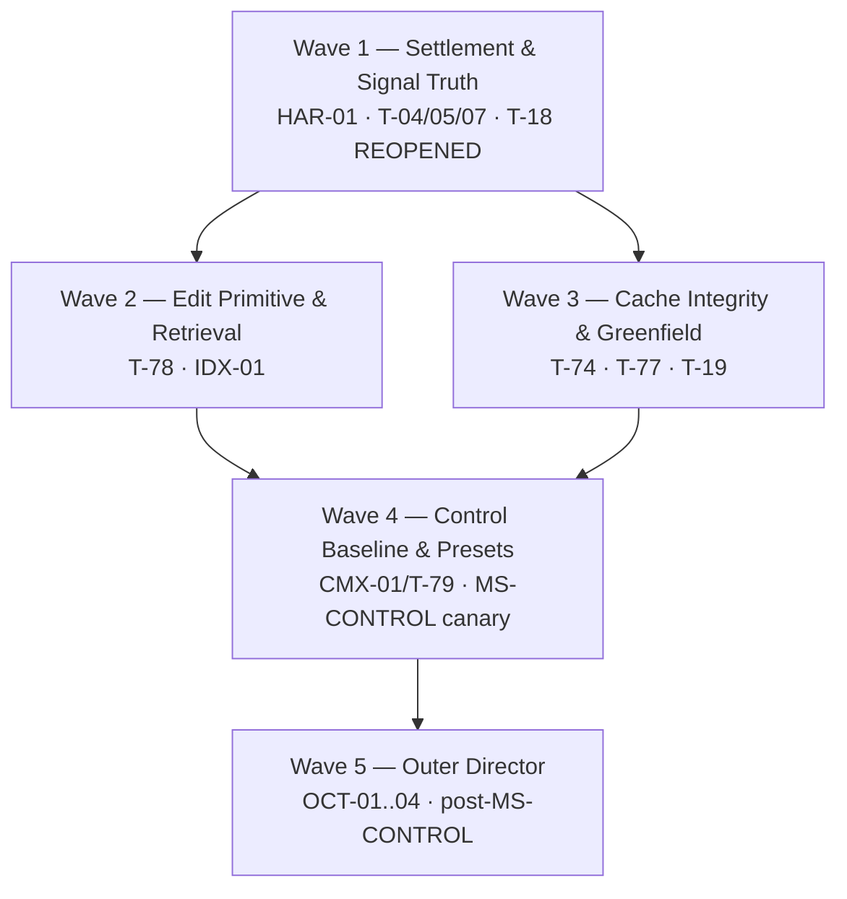

# ARCHITECTURAL SYNTHESIS OF RECORD — ELECTROWEAK v0.9.2 → v0.9.3

**To:** Vanguard / AETHER Engineering Steering Group & Release Governance
**From:** Principal Systems Architect / Lead Invariant Auditor (Package 0.9.3)
**Date:** 2026-09-04
**Authority:** Architectural Directive / Synthesis of Record (`authority: execution-runway-foundation`)
**Supersedes:** [DRAFT SYNTHESIS], Senior Tech Lead, 2026-09-04
**Applicable trees:** `docs/execution/{backlog,milestones,tasks,spec}.md`
**Verification basis:** working tree at `feat/strongforce_beta_release_v093`, HEAD `537bdb66`

---

## 0. Disposition of this pass

The Steering Group's four resolutions are **upheld without modification**:

1. REJECT 9-strategy fuzzy matching → exact `str_replace` + 2PC + AST preflight in adapters.
2. REJECT L2 PPR auto-injection → L5 on-demand `IndexPort` query tools.
3. REJECT rigid `derive_phase` ladders → outcome postconditions in the admission gate.
4. STAGE the Octopus outer director into Wave 5, strictly after `MS-CONTROL`.

The hardening pass did **not** change a single resolution. It changed the *packaging, the paths, the numbers, and one falsifier* — because ten of the draft's load-bearing claims do not survive contact with the source tree. Those ten are listed in §1 and are the reason this document is not the draft with a new date on it.

**The single most consequential correction (C-2):** the draft's `MS-TRUTH` falsifier — *"oracle-PASS runs record `completed`"* — is architecturally wrong and must not be committed. It would re-collapse the two axes this codebase deliberately separates, and it is the exact conflation that produced the 8/8 defect in the first place. The honest repair is the opposite of relabelling terminations. See §3.

---

## 1. Hardening findings — what the draft asserted vs. what the tree contains

Every row was verified against source in this working tree. `[C-n]` tags are referenced throughout the rest of the document.

| # | Draft assertion | Verified reality | Consequence |
|---|---|---|---|
| **C-1** | Tool declarations live at `agency/manifests/*/components/tools/` | **That path does not exist in any manifest.** Canonical convention: `manifest.json` carries a `components` **map** of kind → array of manifests-root-relative POSIX paths; tool schemas are flat `<verb>-tool.json` at the manifest directory root. A `tools/` subdirectory exists in exactly **one** of 32 manifests (`vg-herbs`) and is **not** canonical. Skills are `skills/<name>.{json,md}` **pairs**. Kind vocabulary: `manifests/kinds.json` (17 kinds). Registration: `manifests/registry.json`. | Mandate 3 answered in §5. Every `components/tools/` path in the draft is unbuildable. |
| **C-2** | Repair terminal-state inversion so "oracle-PASS runs record `completed`" | `agency/episode/state.py::RunTermination` is the **run-termination axis**; `agency/episode/engine.py:10` and `ICD §3` deliberately exclude the evaluation axis from `agency/`, because "collapsing this with the evaluation outcome is how instrument failure silently becomes task failure." A run that solved the task then burned its last turn failing to *say* so is honestly `terminal=abandoned` **and** `disposition=passed`. | The draft's falsifier inverts a correct invariant. Replaced in §3/§6. **The 8/8 defect is a reporting-layer conflation, not a mislabelled termination.** |
| **C-3** | Six new capability packages | **Four are duplicates of live backlog rows.** `SET-01` ≡ TRUTH (T-04/05/07 + T-18/19/20, CMX-10A). `EDT-01` ≡ CHANGE (T-17 `DONE`, T-47–T-49 `[PROPOSAL]`, TLS-04/05). `PRF-01` ≡ **CMX-01** (already `REOPENED (product divergence)`). `DIR-01` ≡ **OCT-03** + T-31/T-54. | Filing all six as new IDs would realize risk **R-01 (architecture sprawl)** in the very document that names it. Reconciled in §4. |
| **C-4** | T-18 `TestTamperShield` is "implemented but unwired" | Confirmed, and **worse than stated**: `grep -rn "TestTamperShield\|tamper_shield" --include=*.py vanguard/` returns the module, its `__init__` re-export, and **nothing else**. The only importer in the repository is `test/runtime/test_tamper_shield.py`. Zero production callers. Yet `milestones.md` records T-18 as `[x]` MECHANISM. | **T-18 must be `REOPENED`.** A mechanism with no caller is not a mechanism; it is a test fixture. |
| **C-5** | Presets are `$0.05/12t`, `$0.20/25t`, `$1.00/60t`; `harness.yaml` declares `$0.25` overridden by a hardcoded `$1.00` | `packs/code-default/harness.yaml` declares `budget: {usd_micros: 250000, millis: 1800000, tokens: 64000, turns: 40, depth: 2}`. **A differentiated catalog already exists** — `packs/code-default/presets.json` (`aether.code-preset/1`): fast `$0.05/8t/16k`, balanced `$0.15/20t/40k`, max `$0.40/40t/96k`, loaded by `packs/code-default/load.py`. **No `$1.00` literal exists anywhere in the runtime composition path.** | The draft's numbers would **restamp a frozen catalog** with invented ones. The real defect is C-6. Corrected numbers used in §4/§6. |
| **C-6** | Budget passthrough is broken by a hardcoded override | The real mechanism: **two disjoint preset catalogs, and the product path reads the dead one.** `apps/coding_max/facade.py::_manifest()` routes `preset` → `agency/manifests/vg-code-{preset}/manifest.json`, and those three manifests are **byte-identical alias shells** — every `components` entry points at `vg-code-default/*` and all three share `budgetPolicy: vg-code-default/budget-policy.json` (`{tokens:64000, wallClockMillis:1800000, effects:128, evaluations:16, depth:1}` — carrying **no cost and no turn dimension at all**). `presets.json` is never reached from the product path. The facade additionally hardcodes `max_turns: int = 40` as a Python default. | Precise, and a much smaller fix than the draft implies. This *is* CMX-01. |
| **C-7** | Hardcoded `approval_required_above="low"` must become manifest-configured | Confirmed at `runtime/session.py:656`: `approval_required_above=(None if self.scope.sealed else "low")`. **The manifest already declares the policy the runtime ignores** — `vg-code-default/approval-policy.json` = `{"mode":"assisted","threshold":"standard","escalate_on":["proc.exec"]}`, declared in `components.approval_policy`, and never read at this call site. | Not a new artifact. A **declared component the composition root never consults**. Pure wiring. |
| **C-8** | Files at `vanguard/packages/packs/code-default/...` | **`vanguard/packages/packs/` does not exist.** The pack layer is at **repository root**: `packs/code-default/{harness.yaml,presets.json,load.py,plugins/,toolkits/,oracles/,middleware/}`. Likewise `runtime/ledger/emitter.py` does not exist (`runtime/ledger_emitter.py`, flat, does); `adapters/environment/pycache.py`, `adapters/stores/lda_index.py`, `packs/code-default/policies/greenfield.py`, `domain/topology/coordination.py` and `runtime/campaign/director.py` are all absent. | **Six of twenty-one draft Wave paths are unresolvable.** Corrected inventory in §6. |
| **C-9** | `.lda/index.db` holds 77k relations | Actual: **`relations` 80,618**; also `symbols` 10,580, `entities` 14,033, `files` 3,372, `documents` 262, `doc_sections` 5,244, FTS5 corpus 90,028. 39 index runs. | Cite 80,618. A board document that rounds an auditable count down by 5% invites the reader to check the rest. |
| **C-10** | (not raised) | `packs/code-default/harness.yaml` `model_routes` tier 1 is **`provider: ollama, model: qwen2.5:1.5b`** — forbidden and deprecated repository-wide per the `llama-cpp` operational standard, and directly contradicted by commit `ffc3dc92` ("wiped ollama from the project"). Tier 3 is the unresolved literal `"$FRONTIER"`. | Folded into HAR-01 as a named falsifier. A live pack config still routes tier 1 at a banned provider. |

### Mandate 4 — kernel LOC guardrail: **PASS, with 52 lines of headroom**

```
$ python3 tools/linters/check_tcb_budget.py
TCB PASS: 1386 logical lines across 9 files (alarm above 1438)
```

`{__init__ 41, attenuation 171, budget 150, classifier 96, dispatch 374, grants 201, model 137, policy 106, provenance 110}`. Baseline 1307, current 1386, alarm delta 131, threshold 1438.

Every Wave 1–4 target verified outside `kernel/`. Three specific reconfirmations:

- **AST is already correctly placed.** `adapters/environment/transaction.py` opens with `"""I-7 / I-TXN: ast.parse lives here, never in kernel/."""` and imports `ast` at module scope. `grep -c "^import ast\|^from ast" vanguard/packages/kernel/*.py` → 0. EDT-01 adds **zero** kernel lines.
- **SQLite is structurally barred from the kernel.** `tools/linters/check_boundaries.py` grants `kernel: {domain, ports}` only. `LdaRepoIndex` lands in `adapters/stores/` beside `repo_index.py`, behind the existing `IndexPort` protocol — the port already exists, so IDX-01 adds no kernel line and no *new* port either.
- **Git transactions are in adapters.** `adapters/environment/git.py` is on the `check_boundaries.py` subprocess allowlist; `SUBPROCESS_HOME = adapters/sandbox/`. Process creation cannot migrate inward.

**Guardrail for the waves:** `check_tcb_budget.py` runs in CI, and **T-64** (kernel AST prohibition regression test) is already on the books. Wave 1–4 acceptance requires the linter to report **1386 unchanged** — not merely "under 1438". Headroom is not a budget to spend.

---

## 2. Refined synthesis matrix

Verdicts unchanged from the draft where the draft was right. Rationales corrected where the tree disagrees.

| Mechanism | Source | Subsystem | Verdict | Hardened rationale |
|---|---|---|---|---|
| Native tool-call profiles (`ToolCallStyle.NATIVE`) | Opus (Defect A) | `domain` | **ADOPT** | `domain/models/profile.py` defaults `tool_call_style=FENCED_JSON` and `_PROFILES` holds exactly **two** entries (`fake`, `openrouter/free`). Every production model resolves through the fallthrough `ModelCapabilityProfile(key)` → `FENCED_JSON` → `dialect.py:124` dumps schemas as prose. Confirmed. |
| Approval threshold decoupling | Opus (Defect C) | `runtime` | **ADOPT** | **C-7.** Not a new artifact — a declared `approval_policy` component the composition root never reads. Wiring only. |
| Explicit `finish` verb declaration | Opus (Defect E/N) | `agency/manifests` | **ADOPT** | Confirmed and localized: `finish-tool.json` exists in `vg-chimera-v1`, `vg-code-chimera`, `vg-code-max-v3`, `vg-code-max-v3luna` — and in **none** of the four product presets (`vg-code-{default,fast,balanced,max}`). The domain accepts it (`ProposalKind.FINISH`, `invocation.py:94`); only the declaration is missing. |
| **Two-axis settlement contract** (`TaskDisposition` ⟂ `RunTermination`) | **This pass**, replacing "terminal-state inversion repair" | `domain/evidence` | **ADOPT** | **C-2.** The draft's framing would relabel terminations to match oracles. The correct repair adds the missing *disposition* axis as a typed domain contract and forbids either axis from being published in the other's column. Full contract in §3. |
| Streaming error retryable flag | Opus (Defect K) | `adapters` | **ADOPT (verify-first)** | Partially contradicted: `openrouter.py` already carries `retryable=True` at lines 830, 862, 881, 917, 933. One `retryable=False` at 873 is a non-200 non-retry status, which is correct. The mid-stream malformed-chunk path was **not** isolated in this pass. Ships as **T-70a: reproduce the GLM stream-abort with a falsifier before changing a flag.** No flag flips on an unreproduced defect. |
| Duplicate `EffectStarted` emission | Opus (Defect L) | `runtime` | **ADOPT (verify-first)** | `ledger_emitter.py:83` declares `"EffectStarted": frozenset({"kernel"})` — kernel is the sole authorized originator, so a duplicate would be a **kernel-owner violation**, materially more serious than the draft's "double-counting". Requires a ledger-replay falsifier before any edit, and any fix that lands in `kernel/` is blocked by the LOC guardrail and needs an explicit ADR. |
| Workspace `.pyc` churn cleanup | Opus (Defect G) | `adapters` | **ADOPT** | `_IGNORED` in `adapters/stores/repo_index.py` already excludes `__pycache__` from *indexing*, but workspace **digests** and diff-based oracles are computed elsewhere and remain exposed. `PYTHONPYCACHEPREFIX` to tmpfs. |
| Remove `ADMISSION_GATE_EXEMPT` (T-04) | Grok §A.1, Opus | `runtime` | **ADOPT** | Confirmed live at `session.py:134`: `frozenset({"vg-code-default", "vg-code-lex"})`. `admission_required()` correctly gates every *other* preset by declared `patch.apply` capability — the name allowlist is the last remaining bypass, and it exempts the **product default**. |
| Wire `TestTamperShield` on admit | Grok §A.1, GPT | `runtime` | **ADOPT — and REOPEN T-18** | **C-4.** Zero production callers. `_admit_completion` (`session.py:1655`) checks epoch, omissions, and policy — never tamper. |
| Implicated tests as verification subject | Grok §A.2 | `runtime` | **ADOPT** | T-20 exists and is `[x]`; the `IndexPort` reverse-dependency feed is the open half. |
| Greenfield stub-fail / impl-pass oracle | Grok §A.3 | `packs` | **ADOPT** | T-19. `adapters/evaluators/suites/oracle_greenfield_webapp.py` exists; the red-then-green *ordering* obligation does not. |
| Read-before-edit at effect boundary | Grok §A.5 | `agency` | **ADOPT** | T-47 `[PROPOSAL]`. `_completion_inspected_files` is already tracked in session — it is consulted at finish, not at dispatch. Moving the check is a small, well-supported change. |
| Exact-match `str_replace` + AST preflight | Opus (Part 3 §5) | `adapters` | **ADOPT** | AST preflight **already exists** (`transaction.py`). Only the `str_replace` primitive is new. Fold into T-47; **close TLS-04 as mechanism-present**. |
| Wire `.lda/index.db` behind `IndexPort` | Opus (Part 3 §6) | `adapters` | **ADOPT** | **C-9**: 80,618 relations. Port exists; two adapters exist (`FileRepoIndex`, `InMemoryRepoIndex`); `LdaRepoIndex` is a third implementation of an unchanged protocol. |
| Prefix-cache breakpoints & telemetry | Opus, Octopus | `agency`, `adapters` | **ADOPT** | `packs/code-default/harness.yaml` already declares `context.config.prefix_freeze: true`; the breakpoint emission and `cache_{read,write}_tokens` ledger fields are the delta. |
| Sequential / campaign director | Octopus, Grok §B.1 | `runtime` | **STAGE (Wave 5)** | ≡ **OCT-03** + T-31/T-54. Not a new ID. Zero mutating tools; merge by `ExternalVerifier` only. |
| CAS mailbox & `CoordinationPlan` | Octopus OCT-01/02 | `domain/topology` | **STAGE (Wave 5)** | ≡ **OCT-01/OCT-02** ≡ T-54. Already `PROPOSED` in `backlog.md §2.10` with the `Σ budget_share ≤ 1000` predicate. |
| Read-only investigator subagent | Grok §B.2, Octopus | `agency` | **STAGE (Wave 5)** | ≡ T-29/T-53, CMX-06 (`BLOCKED` on CMX-07). Ablation against a qualified control is the gate. |
| Anti-thrashing FSM | Backlog | `agency` | **STAGE (Wave 4)** | ≡ **ALG-03**, already `PROPOSED` at W-092-4. |
| Native llama.cpp local inference | GPT, Opus | `adapters`, `packs` | **ADOPT** | **C-10**: `harness.yaml` tier 1 still routes `provider: ollama`. This is a live config contradicting a shipped ban. |
| 9-strategy fuzzy matching cascade | Treatise | `adapters` | **REJECT** | Indentation is syntax in Python/YAML. Silent nesting-level relocation. Loud failure + forced section re-read is strictly superior. |
| PPR auto-injection into L2 | Treatise | `agency` | **REJECT** | Breaks the frozen L1–L3 prefix (`prefix_freeze: true`) and violates `ports/index.py`'s stated contract: *"a retrieval component that decided what the agent should look at next would be a second policy wearing the word 'index'"* (`A-05`, `AT-01`). |
| Phased ladder (`derive_phase`) | `vg-code-max-v3` | `agency` | **REJECT** | Forbidding `proc.exec` during inspection breaks fail-to-pass reproduction (T-38). Note: `vg-code-max-v3` is an **experimental** manifest, not a product preset — rejecting it costs nothing on the product path. |
| Second runtime engines (Chimera / Forge) | historical | `agency` | **REJECT** | **D-02**. T-23 quarantine already `DONE`. |
| LLM-quorum / evolutionary merge | Octopus ORCH-10 | `runtime` | **REJECT** | Merge verdicts come from compilers and tests, never from votes. |
| Tree-sitter / SBFL localization | Backlog | `adapters` | **PARK** | ≡ TLS-03 / ALG-02, already `DEFERRED` to Post-CMX-07. `ports/index.py` states tree-sitter can replace the scan body later **without the port moving** — parking costs no future rework. |
| AST mutation verification | Backlog | `adapters` | **PARK** | ≡ TLS-06 / VER-02 / T-39, already `[PROPOSAL]`. |

---

## 3. Mandate 2 — the exact domain wire contract

### 3.1 Why the draft's repair is rejected

The tree draws one line with unusual care:

```
agency/episode/state.py:  class RunTermination(str, Enum):
    """VG-03 §6.2, run-termination axis only.
    Collapsing this with the evaluation outcome is how instrument failure
    silently becomes task failure, so the evaluation axis is deliberately
    absent from agency/: the Evidence plane owns it (ICD §3)."""
```

`agency/episode/engine.py:10` restates it: *"`agency` cannot import an evaluator, and the run-termination axis…"*. The rule is load-bearing and enforced structurally — `check_boundaries.py` grants `agency: {domain, ports, kernel}`, so an evaluator import would not link.

The 8/8 finding is therefore **not** a mislabelling of terminations. Those runs genuinely ended by exhausting `max_turns` without a `finish` — `abandoned` is the *correct* value on the termination axis. What was missing is that **the evaluation axis was never recorded at all**, so the benchmark reporting layer printed the only terminal word it had.

Adopting the draft's falsifier — *"oracle-PASS runs record `completed`"* — would make `RunTermination` a function of the oracle. That is the precise conflation `state.py` warns against, and it would let a green oracle launder an instrument error into a completion. **It must not be committed.**

Note that the vocabulary already exists and is already correct — it is simply in the wrong layer and untyped:

- `benchmarks/protocols.py:30` → `RESULT_DISPOSITIONS = frozenset({"passed","failed","undeterminable","not_run"})` — a bare frozenset of strings, in `benchmarks/`, invisible to the runtime.
- `domain/evidence/envelope.py:55` → `OUTCOMES = ("passed","failed","undeterminable")` — typed and in the domain, but only **three** states, because an envelope asserts a claim about an *executed* subject.

The fourth state is real and belongs in the domain. `MS-INSTRUMENT` already closed on all four (`dispositions {passed,failed,undeterminable,not_run}`) — the runtime simply cannot express them.

### 3.2 `vanguard/packages/domain/evidence/disposition.py` — new module

Pure, stdlib-only, no I/O (`VG-03 §4`, `LT-1`), consistent with every sibling in `domain/evidence/`.

```python
"""Task disposition: the evaluation axis, kept apart from run termination.

`ICD §3` splits two questions that one word keeps collapsing:

* **How did the run end?** -- `agency.episode.state.RunTermination`
  (`completed | abstained | escalated | cancelled | budget_exhausted |
  instrument_error | runtime_error | abandoned`).
* **What did the oracle say about the task?** -- this module.

They are orthogonal, and eight oracle-green runs were reported as eight
abandonments because only the first axis was ever recorded. A run that solved
the task and then spent its last turn failing to *say* so is honestly
`terminal=abandoned` and `disposition=passed`. So the repair is not to relabel
terminations against the oracle -- that would make the termination axis a
function of the evaluator, which is how instrument failure becomes task
failure (`state.py`, `VG-03 §6.2`). The repair is to give the disposition axis
a type, and to forbid either axis from being published in the other's column.

`NOT_RUN` is the state `envelope.py::OUTCOMES` deliberately cannot express: an
envelope binds a claim to an executed subject, and a task that never executed
has no claim to sign. It is a disposition, never an outcome, and it carries no
envelope digest. This is why the vocabularies differ by exactly one member and
why `disposition_to_outcome` refuses rather than invents.
"""

from __future__ import annotations

from dataclasses import dataclass
from enum import Enum
from typing import Any, Mapping

from ..canonicalisation.digest import digest_of

__all__ = [
    "SETTLEMENT_SCHEMA",
    "DispositionError",
    "SettlementReceipt",
    "TaskDisposition",
    "disposition_to_outcome",
    "parse_settlement",
]

#: Payload schema carried on the existing `VerdictRecorded` ledger kind.
#: No new event kind is allocated -- see section 3.4.
SETTLEMENT_SCHEMA = "aether.settlement/1"


class DispositionError(ValueError):
    """A settlement that cannot be admitted. Raised at build or parse."""


class TaskDisposition(str, Enum):
    """The honest four-state settlement. `str` mixin so JCS sees the value."""

    PASSED = "passed"
    FAILED = "failed"
    UNDETERMINABLE = "undeterminable"
    NOT_RUN = "not_run"

    @property
    def satisfies_predicate(self) -> bool:
        """`G-1`: only `passed` closes a gate. There is no second true value.

        A property rather than a caller-side comparison so that no reader can
        spell the check as `!= FAILED` and quietly admit `undeterminable`.
        """
        return self is TaskDisposition.PASSED

    @property
    def is_missingness(self) -> bool:
        """`T-25`: absent evidence, distinguished from a negative result."""
        return self in (TaskDisposition.UNDETERMINABLE, TaskDisposition.NOT_RUN)


def disposition_to_outcome(disposition: "TaskDisposition") -> str:
    """Project onto `envelope.py::OUTCOMES`. Refuses on `NOT_RUN`.

    A task that never executed has nothing to sign, so there is no honest
    outcome to project. Refusing here is what stops a `not_run` row from
    being silently laundered into an `undeterminable` envelope and counted
    as a legitimately-reported broken experiment.
    """
    if disposition is TaskDisposition.NOT_RUN:
        raise DispositionError(
            "not_run has no evidence outcome: a task that never executed "
            "cannot carry a signed envelope")
    return disposition.value


@dataclass(frozen=True, slots=True)
class SettlementReceipt:
    """One task's settlement on both axes, recorded without collapsing them.

    `terminal_status` is carried as a plain `str`, never a `RunTermination`:
    `domain` cannot import `agency` (`check_boundaries.py`), and the coupling
    would be wrong even if it linked. It is recorded for correlation and is
    never read to derive `disposition`, nor derived from it.
    """

    task_id: str
    disposition: TaskDisposition
    terminal_status: str = ""
    oracle_digest: str = ""
    verification_subject_digest: str = ""
    executed_test_count: int = 0
    envelope_digest: str = ""
    undeterminable_reason: str = ""

    def __post_init__(self) -> None:
        if not self.task_id.strip():
            raise DispositionError("a settlement requires a task_id")
        if self.executed_test_count < 0:
            raise DispositionError("executed_test_count cannot be negative")

        if self.disposition is TaskDisposition.PASSED:
            # T-08 / MS-TRUTH: a pass is a claim about an executed subject.
            # Zero counted tests is the shape of an invented pass.
            if self.executed_test_count <= 0:
                raise DispositionError(
                    "passed requires executed_test_count > 0")
            if not self.oracle_digest or not self.verification_subject_digest:
                raise DispositionError(
                    "passed requires a bound oracle and verification subject")

        if self.disposition is TaskDisposition.UNDETERMINABLE:
            # ADR-0101 section 4: a broken experiment must be describable.
            # Silence is the failure mode, so the reason is mandatory.
            if not self.undeterminable_reason.strip():
                raise DispositionError(
                    "undeterminable requires an explicit reason")

        if self.disposition is TaskDisposition.NOT_RUN:
            if (self.executed_test_count or self.oracle_digest
                    or self.verification_subject_digest
                    or self.envelope_digest):
                raise DispositionError(
                    "not_run cannot carry execution evidence")

    @property
    def identity(self) -> str:
        return digest_of(self.to_wire())

    def to_wire(self) -> dict[str, Any]:
        wire: dict[str, Any] = {
            "schema": SETTLEMENT_SCHEMA,
            "taskId": self.task_id,
            "disposition": self.disposition.value,
            "executedTestCount": self.executed_test_count,
        }
        if self.terminal_status:
            wire["terminalStatus"] = self.terminal_status
        if self.oracle_digest:
            wire["oracleDigest"] = self.oracle_digest
        if self.verification_subject_digest:
            wire["verificationSubjectDigest"] = self.verification_subject_digest
        if self.envelope_digest:
            wire["envelopeDigest"] = self.envelope_digest
        if self.undeterminable_reason:
            wire["undeterminableReason"] = self.undeterminable_reason
        return wire


def parse_settlement(source: Mapping[str, Any]) -> SettlementReceipt:
    """Parse a wire settlement, refusing anything the constructor refuses."""
    if source.get("schema") != SETTLEMENT_SCHEMA:
        raise DispositionError(
            f"expected {SETTLEMENT_SCHEMA}, got {source.get('schema')!r}")
    raw = str(source.get("disposition", ""))
    try:
        disposition = TaskDisposition(raw)
    except ValueError as exc:
        raise DispositionError(f"unknown disposition {raw!r}") from exc
    return SettlementReceipt(
        task_id=str(source.get("taskId", "")),
        disposition=disposition,
        terminal_status=str(source.get("terminalStatus", "")),
        oracle_digest=str(source.get("oracleDigest", "")),
        verification_subject_digest=str(
            source.get("verificationSubjectDigest", "")),
        executed_test_count=int(source.get("executedTestCount", 0)),
        envelope_digest=str(source.get("envelopeDigest", "")),
        undeterminable_reason=str(source.get("undeterminableReason", "")),
    )
```

### 3.3 Export surface

Append to `domain/evidence/__init__.py` (which currently exports `audit`, `claim`, `foundation`, `guardrails`, `preregistration` — note it does **not** yet re-export `envelope`; leave that unchanged in this pass):

```python
from .disposition import (
    SETTLEMENT_SCHEMA,
    DispositionError,
    SettlementReceipt,
    TaskDisposition,
    disposition_to_outcome,
    parse_settlement,
)
```

…with the six names appended to `__all__`.

### 3.4 Ledger event representation — **no new kind is allocated**

`domain/ledger/events.py` states the rule explicitly: reintroducing or adding a kind *"requires a full kind package — ADR, allocation, writer, reducer, schema, golden vector, and coverage proof — never a one-line addition to this set."* `READABLE_KINDS` is derived from `schemas/mhf/event_envelope.schema.json` via `_WireEventKind`, and `WRITABLE_KINDS` currently holds 55 members. Inventing `SettlementRecorded` would be a schema change plus an ADR, on the critical path of Wave 1, for no gain.

The two axes map onto two kinds that already exist and already have owners:

| Axis | Event kind | Payload | Owner |
|---|---|---|---|
| Run termination | **`EpisodeCompleted`** (existing) | `terminal_status` only — unchanged shape, no oracle field ever added | `agency` → `runtime` |
| Task disposition | **`VerdictRecorded`** (existing) | `SettlementReceipt.to_wire()` under `schema: aether.settlement/1` | Evidence plane |

Invariants this buys, stated as commit-ready falsifiers:

1. **`EpisodeCompleted` never carries a disposition field.** Falsifier: schema assertion over emitted payloads; `assert "disposition" not in payload`.
2. **`VerdictRecorded` never carries a terminal-derived pass.** `SettlementReceipt.__post_init__` refuses `PASSED` with `executed_test_count == 0`, so no reducer can synthesize one.
3. **The pair is jointly recoverable and independently readable.** Falsifier: a ledger with `terminal_status="abandoned"` and `disposition=passed` **replays without contradiction** — this is the exact 8/8 shape, and it must be representable, not repaired.
4. **`benchmarks/protocols.py` stops owning the vocabulary.** `RESULT_DISPOSITIONS` becomes `frozenset(d.value for d in TaskDisposition)`, and `classify_disposition()` returns `TaskDisposition`, preserving its existing `_UNDETERMINABLE_MARKERS` precedence (missingness markers beat a PASS status — already correct, and preserved verbatim).
5. **`G-1` is enforced by type, not by convention.** No call site may spell the gate check as `!= FAILED`; only `disposition.satisfies_predicate` closes a gate.

**Layering check:** `domain/evidence/disposition.py` imports only `dataclasses`, `enum`, `typing`, and `..canonicalisation.digest`. `check_boundaries.py` permits `domain: {}` — this module adds no edge to any package. It is legal from `runtime`, `adapters`, `apps`, and `benchmarks` alike, which is precisely why the vocabulary can finally be shared.

---

## 4. Hardened backlog inventory additions

**Copy-paste target:** `docs/execution/backlog.md`, new subsection after §2.10.

### 4.1 New section — insert verbatim

```markdown
### 2.11 Electroweak Convergence: Harness Preconditions & Settlement Truth

Accepted disposition of the Electroweak v0.9.2 review dossiers (Synthesis of
Record, 2026-09-04). This section adds **two** capability packages. The other
four IDs proposed in the draft synthesis resolved to live rows and are recorded
as aliases in §3 rather than as new packages, per **R-01 (architecture sprawl)**:
a synthesis that names sprawl as a risk does not open six rows where two are new.

| ID | Title & Focus | Subsystem | Lane | Status | Target Milestone | Reconciliation | Description & Acceptance Gate |
|---|---|---|---|---|---|---|---|
| **HAR-01** | Harness Precondition Repair (deaf-mute agent) | `domain` / `agency` / `runtime` / `adapters` | Lane A | `APPROVED` | MS-TRUTH (precondition) | **New.** No existing T-id covers native tool-call style, approval-policy passthrough, or `finish` declaration. Extends DIALECT (T-21, T-22). Precondition of **CMX-09**; does not subsume it. Adds T-69–T-74. | **Precondition.** No settlement gate is reachable until the agent can call tools, write, and finish. (1) Populate `domain/models/profile.py::_PROFILES` with `ToolCallStyle.NATIVE` for every production model (today: two entries, both non-NATIVE, everything else falls through to `FENCED_JSON`). (2) `runtime/session.py:656` reads `components.approval_policy` instead of the literal `"low"`. (3) Declare `finish-tool.json` in `vg-code-{default,fast,balanced,max}`. (4) Two-axis settlement contract (**T-72**, see spec §3). (5) Purge the `provider: ollama` tier-1 route and resolve `$FRONTIER` in `packs/code-default/harness.yaml`. <br/>*Falsifier*: a `Mode.BENCHMARK` run dispatches native `patch.apply` and `finish` with no `denied_ask_fail_closed`; `grep -rn "ollama" packs/` is empty; a run with `terminal_status=abandoned` and `disposition=passed` round-trips through the ledger without contradiction. |
| **IDX-01** | LDA-Backed Repository Intelligence | `adapters` / `agency` | Lane B | `APPROVED` | MS-SEE | **New adapter only.** `IndexPort` already exists (`ports/index.py`) and is **not modified**. Third implementation beside `FileRepoIndex` / `InMemoryRepoIndex`. Closes the CMX-02 `PARTIAL` retrieval half; **supersedes T-46** (`[PROPOSAL]` ranking) — ranking stays out of the port. Adds T-75–T-77. | **Intelligence.** `LdaRepoIndex` in `adapters/stores/lda_index.py` reading `.lda/index.db` (**80,618** relations, 10,580 symbols, 3,372 files). Expose `repo.{search_symbols,get_callers,get_dependencies,get_tests}` as bounded observations into **L5 only**. L1–L3 stay byte-identical (`harness.yaml` already declares `prefix_freeze: true`). Emit provider cache breakpoints at the L3 boundary; record `cache_read_tokens` / `cache_write_tokens`. <br/>*Falsifier*: `repo.get_callers` over a 40-file blast radius leaves the L1–L3 digest **bit-identical** across 10 turns; ranking logic in `adapters/stores/lda_index.py` fails review by inspection (`ports/index.py`, `A-05`). |
```

### 4.2 Lifecycle amendments to existing rows — apply in place

| Row | File / §  | Current | **Change to** | Ground |
|---|---|---|---|---|
| **T-18** | `tasks.md` §, `milestones.md` MS-CHANGE | `[x]` MECHANISM | **`REOPENED`** | `TestTamperShield` has **zero production callers** repository-wide; only `test/runtime/test_tamper_shield.py` imports it. Meets the `REOPENED` predicate exactly: *"a current-source falsifier that invalidates carrying its old closure forward."* **C-4** |
| **CMX-01** | §2.9 | `REOPENED` (product divergence) | **`APPROVED`**, absorbing draft `PRF-01`; note reads *"unify two disjoint preset catalogs: `apps/coding_max/facade.py` routes to alias manifests and never reaches `packs/code-default/presets.json`"* | **C-5/C-6** |
| **CMX-02** | §2.9 | `PARTIAL` | unchanged status; dependency becomes **IDX-01** | Retrieval half is IDX-01's deliverable |
| **TLS-04** | §2.4 | `DEFERRED` Post-CMX-07 | **`DONE` (mechanism)** | `adapters/environment/transaction.py` performs `ast.parse` preflight and aborts before durable flush. The gate exists; deferral is stale. |
| **TLS-03**, **TLS-06**, **ALG-02**, **T-39** | §2.4, §2.8 | `DEFERRED` / `PROPOSED` | **unchanged — PARK confirmed** | `ports/index.py` guarantees tree-sitter can replace the scan body without moving the port; parking incurs no rework debt. |
| **OCT-03** | §2.10 | `PROPOSED` M-OCT | unchanged status; title gains *"(≡ draft `DIR-01`)"*; dependency **`MS-CONTROL`** made explicit | **C-3** |

### 4.3 Package index — replace §3 rows

```markdown
| **TRUTH** | CMX-10A, W-092-F2, HAR-01, *SET-01* | T-04–T-08, T-42, T-38, T-23, T-69–T-74 | MS-TRUTH | T-23/T-38/T-42 `DONE`; T-08 landed `8637db55`; T-04/T-05/T-07 open; **T-18 REOPENED** (shield unwired) |
| **SEE** | CMX-11, PRG-01, W-092-F4, IDX-01 | T-14–T-16, T-36–T-37, T-45, T-75–T-77 | MS-SEE | T-46 **superseded by IDX-01**: ranking stays out of `IndexPort` |
| **CHANGE** | TXN-01, SHD-01, TLS-04/05, *EDT-01* | T-17–T-20, T-47–T-49 | MS-CHANGE | T-17 `DONE`; TLS-04 mechanism present in `transaction.py`; **T-18 REOPENED**; `str_replace` folds into T-47 |
| **CONTROL** | CMX-07, W-092-F5, CMX-01, *PRF-01* | T-26–T-27, T-51–T-52, T-79 | MS-CONTROL | Preset catalog unification is CMX-01, not a new package |
| **CAMPAIGN** | OCT-01…04, HYD-01/02, *DIR-01* | T-31, T-54–T-55, T-34 | MS-CAMPAIGN / MS-HYDRA | `DIR-01` ≡ **OCT-03**; director is a runtime client with zero mutating tools |
```

### 4.4 Alias table — append to "v2 ID → T-id aliases"

```markdown
| Draft `SET-01` | T-04/T-05/T-07 + T-18/T-19/T-20 | Not a package. TRUTH + CHANGE settlement half. |
| Draft `EDT-01` | T-47 (+ T-17 `DONE`, TLS-04/05) | Not a package. `str_replace` is a T-47 strategy. |
| Draft `PRF-01` | **CMX-01** | Not a package. Same product divergence, already `REOPENED`. |
| Draft `DIR-01` | **OCT-03** + T-31/T-54 | Not a package. Keep the OCT-* rows in §2.10 authoritative. |
| Draft `HAR-01` | T-69–T-74 | **New package.** Precondition of CMX-09. |
| Draft `IDX-01` | T-75–T-77 | **New package.** Supersedes T-46. |
```

### 4.5 New task rows — `docs/execution/tasks.md` (T-69 onward; current max is T-68)

Every path verified present in this tree. `depends_on` edges live here, per §3's *"`requires:` edges live on tasks."*

| T-id | Title | Package | `depends_on` | Exact target | Executable falsifier |
|---|---|---|---|---|---|
| **T-69** | Native tool-call profiles for production models | HAR-01 | — | `domain/models/profile.py::_PROFILES` | `test/contracts/test_model_profiles.py`: every registered production id resolves `tool_call_style is ToolCallStyle.NATIVE`; unknown ids still degrade `NATIVE→JSON_SCHEMA→FENCED_JSON→TEXT_GRAMMAR` via `degraded()`. |
| **T-70** | Approval threshold from declared `approval_policy` | HAR-01 | T-69 | `runtime/session.py:656` | `test/runtime/test_approval_passthrough.py`: with `{"threshold":"standard"}` declared, `patch.apply` (medium) and `proc.exec` (high) dispatch in `Mode.BENCHMARK` with zero `denied_ask_fail_closed`; the literal `"low"` is absent from `session.py`. |
| **T-70a** | Reproduce mid-stream SSE abort before flag change | HAR-01 | — | `adapters/models/openrouter.py::_execute_stream_transport` | `test/adapters/test_openrouter_stream_abort.py`: a truncated SSE chunk after ≥1 delta yields a **reproducing** failure first. Flag changes only after red. Closes as `no_defect` if it will not reproduce. |
| **T-71** | Declare `finish-tool.json` in the four product presets | HAR-01 | — | `agency/manifests/vg-code-{default,fast,balanced,max}/` | `test/contracts/test_manifest_components.py`: each product preset's `components.tools` contains a `finish` schema; every declared path resolves; every `kind` key is in `kinds.json`. |
| **T-72** | Two-axis settlement contract | HAR-01 | — | **new** `domain/evidence/disposition.py`; `domain/evidence/__init__.py`; `benchmarks/protocols.py` | `test/contracts/test_settlement_disposition.py`: `SettlementReceipt(disposition=PASSED, executed_test_count=0)` raises; `UNDETERMINABLE` without a reason raises; `NOT_RUN` with an `envelope_digest` raises; `disposition_to_outcome(NOT_RUN)` raises; a ledger carrying `terminal_status="abandoned"` + `disposition=passed` replays without contradiction; `EpisodeCompleted` payloads contain no `disposition` key. |
| **T-73** | `EffectStarted` single-emission ledger falsifier | HAR-01 | T-72 | `test/runtime/`, `runtime/ledger_emitter.py:83` | `test/runtime/test_effect_started_singleton.py`: replaying one effect yields exactly one `EffectStarted` with one lease id. **Any fix landing in `kernel/` blocks on an ADR + `check_tcb_budget.py`.** |
| **T-74** | Workspace `.pyc` hygiene | HAR-01 | — | `adapters/environment/sandboxed.py` (`PYTHONPYCACHEPREFIX` → tmpfs) | `test/adapters/test_workspace_pycache.py`: after a `pytest` run under a sandboxed env, `find <ws> -name "*.pyc"` is empty and the workspace digest is unchanged from pre-run. |
| **T-75** | `LdaRepoIndex` adapter | IDX-01 | — | **new** `adapters/stores/lda_index.py` | `test/contracts/test_lda_repo_index.py`: satisfies `IndexPort` structurally (`runtime_checkable`); returns value-only `Symbol`/`DependencyEdge`/`TestAssociation`; a missing/stale `.lda/index.db` returns a deterministic `Result.fail`, never a partial map (**T-45** fallback preserved). |
| **T-76** | `repo.*` observation tools bound into L5 | IDX-01 | T-75 | `packs/code-default/toolkits/repo_map.py`; `packs/code-default/plugins/index.yaml`; `adapters/bindings/code.py` | `test/agency/test_l5_only_observations.py`: calling all four `repo.*` verbs leaves the L1–L3 digest bit-identical across 10 turns; observations appear only in L5. |
| **T-77** | Prefix-cache breakpoints + cache-token telemetry | IDX-01 | T-76 | `agency/context/compiler.py`; `runtime/ledger_emitter.py` | `test/agency/test_cache_breakpoints.py`: a breakpoint is emitted at the L3 boundary; `cache_read_tokens`/`cache_write_tokens` are recorded per turn; turn ≥ 2 cache-hit rate exceeds 85% on the fixture. |
| **T-78** | Exact-match `str_replace` primitive | CHANGE (amends **T-47**) | T-17 `DONE` | `adapters/environment/git.py`; routed through `transaction.py::AtomicMultiFileTransactionManager` | `test/adapters/test_str_replace_exact.py`: a non-unique preimage fails closed with typed `PATCH_PREIMAGE_MISMATCH`; a syntax error in file 4 of 5 leaves all 5 byte-identical (`tree_hash_before == tree_hash_after`); no fuzzy/indentation relaxation path exists. |
| **T-79** | Unify the preset catalog on `presets.json` | CMX-01 | T-71 | `apps/coding_max/facade.py::_manifest`; `packs/code-default/load.py`; `agency/manifests/vg-code-{fast,balanced,max}/manifest.json` | `test/apps/test_preset_budgets.py`: `fast/balanced/max` yield **distinct** `EpisodeStarted.budgetCeiling` values matching `presets.json` exactly (`50000/150000/400000` µUSD; `8/20/40` turns); `max_turns` is never a Python default in the facade; `vg-code-fast` halts at turn 8 with `BUDGET_EXHAUSTED`. |

---

## 5. Mandate 3 — canonical pack & tool file layout

### 5.1 The convention, as the tree actually defines it

```
vanguard/packages/agency/manifests/
├── registry.json                  # {name, path, undeletable, role} per manifest
├── kinds.json                     # 17 kinds → schema:// URIs. THE vocabulary.
└── <manifest-name>/
    ├── manifest.json              # harness, components{}, capabilities[],
    │                              # evaluators[], budgetPolicy, undeletable
    ├── system-prompt.txt
    ├── <verb>-tool.json           # FLAT at manifest root. read/search/patch/
    │                              # test/finish. NOT under components/tools/.
    ├── <name>-policy.json         # approval|budget|context|retrieval|routing
    ├── repo-index.json
    ├── aliases.json               # optional; e.g. {"finish": "agency.finish"}
    └── skills/<name>.json + .md   # PAIRED. .json declares, .md instructs.
```

`components` is a **map**, not a directory, and its values are paths relative to the **manifests root** — which is what lets `vg-code-fast` reference `vg-code-default/read-tool.json` today. Cross-manifest reuse is a first-class, already-exercised feature.

**Verdict on the draft's `agency/manifests/*/components/tools/`: rejected.** It does not exist, it is not implied by `manifest.json`, and creating it would fork the loader. The `tools/` subdirectory in `vg-herbs` is a single-manifest local convention across 32 manifests and is explicitly **not** the standard.

### 5.2 JSON schemas vs. ad-hoc Python — the boundary

| Concern | Home | Why |
|---|---|---|
| **Tool declaration** (name, params, description) | JSON at manifest root, registered in `manifest.json` `components.tools` | Data. Model-facing. Must be diffable and hashable into the composition digest. |
| **Tool implementation** | `packs/<pack>/toolkits/*.py`, activated by `packs/<pack>/plugins/*.yaml` | Behavior. Note `kinds.json` distinguishes `tool_schema` from `tool_impl` — the split is already normative. |
| **Policy** (approval, budget, context, retrieval, routing) | JSON at manifest root | Data. Currently declared and, for approval, **ignored** — that is **T-70**. |
| **Skills** | `skills/<name>.json` + `skills/<name>.md`, pair-registered under `components.skill` | Existing three-skill precedent in `vg-code-default`. |
| **Task-class policy** | `packs/code-default/` (`context_policy.py`, `oracles/`, `middleware/`) | Cognition belongs to the pack; the manifest declares *what*, the pack decides *how*. |

**T-71 lands as:** `vg-code-default/finish-tool.json` (new file, manifest root), added to `components.tools` in all four product manifests — three of which reference it cross-manifest, exactly as they already reference the other four tool schemas. **Four files touched, one created. No new directory.**

### 5.3 Layout falsifier (ships with T-71)

`test/contracts/test_manifest_components.py`:
1. Every `components` value in every manifest resolves to an existing file under the manifests root.
2. Every `components` key is a `kind` in `kinds.json`.
3. Every `skills/<n>.json` has a sibling `<n>.md`.
4. Every manifest in `registry.json` exists, and every manifest directory is in `registry.json`.
5. **No manifest introduces a `components/` directory** — the anti-drift assertion this finding exists to prevent.

---

## 6. Milestone overlay updates

**Copy-paste target:** `docs/execution/milestones.md` §3. Replace these five rows.

| ID | TARGET | Acceptance | Status | Evidence |
|---|---|---|---|---|
| **MS-TRUTH** | No `completed` without bound verification; no invented counts; one gate; **both settlement axes recorded, neither derived from the other** | T-42/T-38/T-23 landed; T-08 landed `8637db55`. Open: **T-04** (remove `ADMISSION_GATE_EXEMPT`, live at `session.py:134`, under RF-25 successor baseline), **T-05**, **T-07** (typed verification subject), **T-18 REOPENED** (`TestTamperShield` has zero production callers → wire into `session._admit_completion`), **T-72** (two-axis settlement contract). Gated on **HAR-01** preconditions T-69–T-71. **Falsifier:** a run with zero patches or tampered tests cannot earn `passed`; greenfield passing on `pass`/`NotImplementedError` is rejected; **a run may legitimately record `terminal_status=abandoned` with `disposition=passed`, and the ledger replays it without contradiction** — the disposition axis is never derived from the termination axis, nor the reverse (`ICD §3`, `VG-03 §6.2`). | `OPEN` | No-session slice `63b77116`; session parser + `ParsedTestOutput.runner` `8637db55`. **T-18 reopened 2026-09-04: mechanism present at `runtime/governance/tamper_shield.py`, unreferenced outside its own test.** |
| **MS-SEE** | Epoch-bound packets; omissions explicit; one `ContextCompiler`; cache-stable prefix; port-backed intelligence | T-14–T-16, T-36, T-37, T-45 MECHANISM. Adds: `LdaRepoIndex` backs the **unchanged** `IndexPort` over `.lda/index.db` (**80,618** relations); `repo.*` tools return bounded observations into **L5 only**; provider cache breakpoints at the L3 boundary with `cache_read_tokens` recorded. **T-46 superseded by IDX-01** — ranking is pack policy, never the index (`ports/index.py`, `A-05`). **Falsifier:** `repo.get_callers` leaves the L1–L3 digest bit-identical across 10 turns; turn ≥ 2 cache-hit rate > 85%; no ranking logic in `adapters/stores/lda_index.py`. | `OPEN` (gated on **IDX-01**) | `587db91a`, `33dc7c33`, `2a4cdaad`, `179f5616`, `81b7b572`, `c7995195`. One `ContextCompiler`; omissions are a ledger; no-index fallback documented. |
| **MS-CHANGE** | Multi-file change closure; 2PC in adapters; exact edit primitive; **zero kernel AST** | T-17 `DONE`; T-19/T-20 MECHANISM; **T-18 REOPENED**. T-47 amended by **T-78** (exact `str_replace`, unique preimage, trimmed-EOL only — **no fuzzy cascade**). **TLS-04 closes as mechanism-present**: `ast.parse` preflight already lives in `adapters/environment/transaction.py` and aborts before durable flush. Read-before-edit moves from finish to `patch.apply` dispatch. **Falsifier:** a syntax error in file N of M leaves all M byte-identical (`tree_hash_before == tree_hash_after`); a patch to an uninspected file is rejected at dispatch; `grep -c "import ast" vanguard/packages/kernel/*.py` is **0**; `check_tcb_budget.py` reports **1386 unchanged**. | `OPEN` | `5c9870f0`, `094fa899`, `db935138`. Dialect tickets do not close this gate. |
| **MS-CONTROL** | One `EpisodeEngine` coding path; **one preset catalog**; true budget enforcement; Forge/Chimera excluded from product scores | T-23 `DONE` (≠ qualification). Open: T-26/T-27, T-51/T-52, **T-79**. `apps/coding_max/facade.py` must select from **`packs/code-default/presets.json`** (`aether.code-preset/1`: fast `$0.05`/8t/16k, balanced `$0.15`/20t/40k, max `$0.40`/40t/96k) rather than routing to three byte-identical alias manifests that share `vg-code-default/budget-policy.json` — a policy carrying **no cost and no turn dimension**. Qualify `vg-code-balanced` on the frozen multi-class canary (n ≥ 30, Wilson LB ≥ 0.40). **Falsifier:** the three presets emit **distinct** `EpisodeStarted.budgetCeiling` values matching `presets.json` exactly; `vg-code-fast` halts at turn 8 with `BUDGET_EXHAUSTED`; `max_turns` is not a Python default in the facade; canary runs execute on the exact frozen candidate SHA. **No specialist or director lift claim is authorized before this gate closes.** | `OPEN` (gated on **CMX-01**/T-79, T-26/T-27) | Two disjoint preset catalogs confirmed 2026-09-04; the product path reads the undifferentiated one. |
| **MS-CAMPAIGN** | Outer-loop director as a runtime client; isolated worktrees; CAS mailbox; merge by exterior tests | T-31, T-54, T-34. **`OCT-03` is the canonical row** (draft `DIR-01` is an alias). Director holds **zero** mutating verbs; child episodes run in isolated git worktrees under attenuated budgets; roles exchange only content-addressed digests (OCT-01); merge is decided by `ExternalVerifier` test verdict, **never** LLM quorum. **Hard dependency: `MS-CONTROL` closed.** **Falsifier:** a crash at node K resumes at K+1 with no duplicate effects; a failing child cannot mutate the parent tree. | `OPEN` `[PROPOSAL]` (gated on **MS-CONTROL**) | Staged to Wave 5 per **D-03**: a director dispatching unqualified inner episodes multiplies false completions across an expensive DAG. |

---

## 7. Wave staging blueprint — verified file-touch boundaries

Every path below exists in this tree unless marked **`[NEW]`**. Lane A and Lane B touch **disjoint** file sets within a wave; the only shared artifacts are the runway documents, edited between waves.



### Wave 1 — Settlement & Signal Truth (P0)

*Mission:* make the agent able to call tools, write, and finish — then hold it to the truth on **both** axes.
*Packages:* HAR-01 (T-69–T-74); TRUTH (T-04, T-05, T-07, T-18 `REOPENED`).

| Lane A (build) | Lane B (audit & falsifiers) |
|---|---|
| `domain/models/profile.py` — populate `_PROFILES` NATIVE (T-69) | **`[NEW]`** `test/contracts/test_model_profiles.py` |
| **`[NEW]`** `domain/evidence/disposition.py` (T-72) | **`[NEW]`** `test/contracts/test_settlement_disposition.py` |
| `domain/evidence/__init__.py` — export surface | **`[NEW]`** `test/runtime/test_approval_passthrough.py` |
| `runtime/session.py` — `:134` exempt set (T-04); `:656` approval (T-70); `:1655` `_admit_completion` tamper wiring (T-18) | `test/runtime/test_observed_test_counts.py` — update the frozen `ADMISSION_GATE_EXEMPT` assertion at `:50` |
| `agency/manifests/vg-code-{default,fast,balanced,max}/` + **`[NEW]`** `vg-code-default/finish-tool.json` (T-71) | **`[NEW]`** `test/contracts/test_manifest_components.py` (§5.3) |
| `packs/code-default/harness.yaml` — purge `ollama`, resolve `$FRONTIER` | **`[NEW]`** `test/runtime/test_effect_started_singleton.py` (T-73) |
| `runtime/ledger_emitter.py` — `VerdictRecorded` settlement payload | `benchmarks/protocols.py` — `RESULT_DISPOSITIONS` → `TaskDisposition` |
| | **`[NEW]`** `test/adapters/test_openrouter_stream_abort.py` (T-70a, reproduce-first) |

**Collision note:** `runtime/session.py` carries four Wave 1 edits at four distinct sites (134, 656, 1655, verification-subject binding). Lane A serializes them; Lane B touches the file only through `test/`.

### Wave 2 — Edit Primitive & Retrieval (P1)

| Lane A (edit engine) | Lane B (index & retrieval) |
|---|---|
| `adapters/environment/git.py` — exact `str_replace` (T-78) | **`[NEW]`** `adapters/stores/lda_index.py` (T-75) |
| `adapters/environment/transaction.py` — route `str_replace` through 2PC; AST preflight already present | `packs/code-default/toolkits/repo_map.py` — `repo.*` verbs (T-76) |
| `agency/episode/engine.py` — read-before-edit at dispatch; typed `PATCH_PREIMAGE_MISMATCH` | `packs/code-default/plugins/index.yaml` — activate |
| **`[NEW]`** `test/adapters/test_str_replace_exact.py` | `adapters/bindings/code.py` — bind observations to L5 |
| | **`[NEW]`** `test/contracts/test_lda_repo_index.py`, **`[NEW]`** `test/agency/test_l5_only_observations.py` |

`ports/index.py` is **not modified** — `IndexPort` already declares what `LdaRepoIndex` implements. Adapters may import only `{domain, ports}`; the L5 binding therefore lives in the pack and `adapters/bindings/`, never inside the store.

### Wave 3 — Cache Integrity & Greenfield Oracle (P1)

| Lane A | Lane B |
|---|---|
| `agency/context/compiler.py` — L3 breakpoint emission (T-77) | `adapters/environment/sandboxed.py` — `PYTHONPYCACHEPREFIX` → tmpfs (T-74) |
| `agency/context/compaction.py` — omission ledger, output caps | `runtime/ledger_emitter.py` — `cache_{read,write}_tokens` |
| `packs/code-default/oracles/gate.py` — red-then-green ordering (T-19) | **`[NEW]`** `test/adapters/test_workspace_pycache.py` |
| `adapters/evaluators/suites/oracle_greenfield_webapp.py` | **`[NEW]`** `test/agency/test_cache_breakpoints.py`, **`[NEW]`** `test/packs/test_greenfield_oracle.py` |

### Wave 4 — Control Baseline & Preset Unification (P2)

| Lane A | Lane B |
|---|---|
| `apps/coding_max/facade.py` — select from `presets.json`; drop the `max_turns=40` default (T-79) | `benchmarks/` — freeze the 30-task multi-class canary (T-51) |
| `packs/code-default/load.py` — expose the preset overlay on the product path | `benchmarks/protocols.py` — preregistered canary, Wilson LB, cost κ (T-52) |
| `agency/manifests/vg-code-{fast,balanced,max}/manifest.json` — per-preset `budgetPolicy`, stop aliasing `vg-code-default` wholesale | **`[NEW]`** `test/apps/test_preset_budgets.py` |
| `runtime/wiring.py` — declared budget → `Governor` without loss | |

### Wave 5 — Outer Director & Campaign Orchestration (post-`MS-CONTROL`)

Unblocked **only** by a closed `MS-CONTROL`. Packages OCT-01…04, T-31, T-54.
**`[NEW]`** `domain/topology/coordination.py` · **`[NEW]`** `runtime/campaign/{director,worktree,verifier}.py` · **`[NEW]`** `test/runtime/test_campaign_director.py`.
No file in Waves 1–4 is reopened.

---

## 8. Commit checklist

1. **Runway edits only.** `backlog.md` §2.11 + §2.9/§2.4 amendments + §3 index + alias table; `milestones.md` §3 five rows; `tasks.md` T-69–T-79; `spec.md` delta for `domain/evidence/disposition.py`. **Zero new files under `docs/reports/` or `docs/architecture/`** — this document stays in `.draft/` and is not itself a runway file.
2. **Reopen T-18 in the same commit that records its receipt.** Reopening it silently later reads as drift; reopening it here, with the zero-caller grep as the falsifier, is the honest record.
3. **Do not commit the draft's `MS-TRUTH` falsifier.** §6 replaces it. Committing "oracle-PASS ⇒ `completed`" would encode the 8/8 conflation as a requirement.
4. **Kernel guardrail on every wave's PR:** `python3 tools/linters/check_tcb_budget.py` must report `1386` **unchanged**, not merely under 1438. Pair with `check_boundaries.py` and `check_domain_blindness.py`.
5. **Numbers to carry forward verbatim:** kernel 1386/1438 · LDA relations 80,618 · presets `$0.05`/8t, `$0.15`/20t, `$0.40`/40t · `harness.yaml` `usd_micros: 250000`, `turns: 40`, `depth: 2`. Every one is re-derivable from this tree; none is rounded.

### Residual uncertainties — stated, not buried

- **T-70a (SSE retryable):** `openrouter.py` already carries `retryable=True` on five paths. Defect K's specific mid-stream site was **not** isolated in this pass. It ships as reproduce-first and may close as `no_defect`.
- **T-73 (duplicate `EffectStarted`):** not reproduced here. `ledger_emitter.py:83` names `kernel` the sole authorized originator, so if it reproduces, the fix likely lands in `kernel/dispatch.py` (374 logical lines) — which requires an ADR and consumes part of the 52-line headroom. Flagged as the one Wave 1 item that could touch the TCB.
- **Wilson LB ≥ 0.40 at n ≥ 30** is carried forward from `milestones.md` unchanged. This pass qualified no empirical claim, and the 8/10 and 6/6 figures in the draft remain **unreplicated** on the current tree — they are motivation for the repair, never evidence of it.
