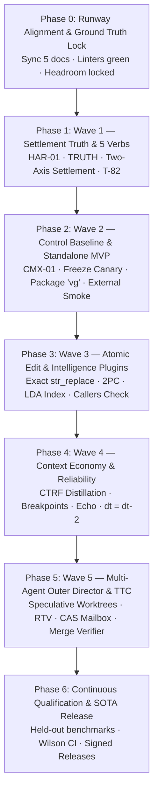

# ELECTROWEAK SYNTHESIS GUIDELINES — v0.9.3
## Master Operational Runway & Evolutionary Architecture Protocol

**Authority:** Execution Runway Directive (`authority: execution-runway-foundation`)  
**Companion Artifacts:** [`.draft/ELECTROWEAK_SYNTHESIS_FINAL_v093.md`](file:///home/rock-dev/Coding/cognitive-framework/.draft/ELECTROWEAK_SYNTHESIS_FINAL_v093.md), [`docs/execution/tasks.md`](file:///home/rock-dev/Coding/cognitive-framework/docs/execution/tasks.md), [`docs/execution/milestones.md`](file:///home/rock-dev/Coding/cognitive-framework/docs/execution/milestones.md), [`docs/execution/spec.md`](file:///home/rock-dev/Coding/cognitive-framework/docs/execution/spec.md), [`docs/execution/backlog.md`](file:///home/rock-dev/Coding/cognitive-framework/docs/execution/backlog.md)  
**Status:** Canonical Living Guideline & Project Management Runway  

---

## 1. Executive Tri-Lens Governance Framework

To ship a State-of-the-Art (SOTA) autonomous coding substrate without succumbing to **hallucination** (the catastrophic failure of one-shot mega-prompts) or **myopia** (the fragile hacks of myopic task-by-task coding), Vanguard / AETHER enforces an explicit **Tri-Lens Governance Model**:

```
                              ┌──────────────────────────────────────┐
                              │       PRODUCT OWNER (PO) LENS        │
                              │  Customer Value • MVP • Cost / Task  │
                              └──────────────────┬───────────────────┘
                                                 │
                        ┌────────────────────────┴────────────────────────┐
                        ▼                                                 ▼
      ┌───────────────────────────────────┐             ┌───────────────────────────────────┐
      │     PROJECT LEAD / TECH LEAD      │             │        SCRUM MASTER LENS          │
      │ Architecture • TCB LOC • Security │             │ Cadence • WIP=1 • DoD • Gating    │
      └───────────────────────────────────┘             └───────────────────────────────────┘
```

### 1.1 The Product Owner (PO) Perspective: Value, Packaging & Commercial Truth
* **Core Mandate:** Maximize developer utility per dollar spent. Every phase must produce tangible, working software.
* **Release Milestones:** Deliver a minimal, viable **Naked Solver MVP** at Wave 2 that can be packaged as a standalone CLI / library (`vg`) and deployed onto external projects to solve real bugs *before* investing in speculative multi-agent directors.
* **Value Metric:** Minimize Token Waste ($W \to 0$) and maximize Token Efficiency ($\kappa = \frac{\text{Tokens Expended}}{\text{Verified Successes}}$).

### 1.2 The Project Lead / Tech Lead Perspective: Architectural Invariants & Risk
* **Core Mandate:** Protect the Trusted Computing Base (TCB $\le 1438$ logical LOC, currently 1,386 LOC). Prevent layer-inversion bugs and circular dependencies.
* **Architectural Boundaries:** Strict hexagonal flow (`domain ← ports ← kernel ← agency ← runtime → adapters`). Zero AST imports in `kernel/`, zero SQLite imports in `kernel/`, zero adapter imports in `kernel/` or `agency/`.
* **Definition of Verification:** A mechanism with zero production callers is not done (Finding C-4). Every mechanism requires a named, hermetic test falsifier that exercises the live production wiring.

### 1.3 The Scrum Master Perspective: Flow, Cadence & Work-in-Progress (WIP)
* **Core Mandate:** Maintain maximum unblocked delivery velocity while eliminating thrashing.
* **Strict WIP Limits:** $\text{WIP} = 1$ task per developer/agent turn. No starting task $N+1$ until task $N$'s unit test falsifier is committed and green.
* **Rolling Wave Elaboration:** 
  - *Tier 1 (Holistic Upfront):* Global invariants, milestone gates, and domain wire schemas are 100% locked upfront (`milestones.md`, `spec.md`, `backlog.md`).
  - *Tier 2 (Rolling Tasks):* Detailed executable tasks (`tasks.md`) are planned strictly **1 to 2 waves ahead** (T-69 to T-83). Future waves remain capability packages in `backlog.md`.
* **Zero-Calendar Anti-Sprawl Rule:** No sprint calendars or artificial due dates (`AGENTS.md`). Progress is strictly event-driven and gate-governed by release predicates.

---

## 2. Technical PhD & Principal Architect Notes: The Substrate

### 2.1 The Naked Solver Baseline ($C_0$)
The execution engine ([`vanguard/packages/agency/episode.py`](file:///home/rock-dev/Coding/cognitive-framework/vanguard/packages/agency/episode.py)) is kept completely domain-blind and featureless. It implements one atomic state transition:
$$\text{State } S_t \xrightarrow{\text{compile}} \text{Prompt } P_t \xrightarrow{\text{infer}} \text{Proposal } M_t \xrightarrow{\text{dispatch}} \text{Receipt } R_t \to S_{t+1}$$

```
┌────────────────────────────────────────────────────────────────────────────────────────┐
│                                 THE NAKED SOLVER (C₀)                                  │
│                                                                                        │
│  State Sₜ ──> Compile(L1–L5) ──> Model ──> Proposal ──> Kernel (S0–S12) ──> Receipt    │
│     ▲                                                                         │        │
│     └───────────────────────── State Fold (Receipts) ◄────────────────────────┘        │
└────────────────────────────────────────────────────────────────────────────────────────┘
```

The Naked Solver exposes exactly **five primitive verbs**:
1. `fs.read`: inspect bytes.
2. `fs.search`: pattern and path matching.
3. `patch.apply`: atomic exact-string replacement with rollback.
4. `proc.exec`: sandboxed command execution (`pytest`, compilers).
5. `finish`: explicit task termination proposal (mandatory to prevent infinite burn).

### 2.2 The Four Hexagonal Interception SPIs
All intelligence, graph navigation, and self-correction mechanisms attach at four explicit hook points without modifying the core engine:

```
                       ┌────────────────────────────────────────┐
                       │  Point 1: Context SPI (agency/context) │ (Inject Info / Distill)
                       └───────────────────┬────────────────────┘
                                           ▼
         Prompt ───► [ ContextCompiler / L1–L5 Assembly ] ───► Model
                                                                │
                                           ┌────────────────────┘
                                           ▼
                       ┌────────────────────────────────────────┐
                       │  Point 2: Dialect SPI (adapters/models)│ (Normalize / Fenced Recover)
                       └───────────────────┬────────────────────┘
                                           ▼
       Proposal ───► [ Kernel Reference Monitor S0–S12 ]
                                           │
                                           ▼
                       ┌────────────────────────────────────────┐
                       │  Point 3: Toolkits SPI (packs/*/tools) │ (Capability Extensions)
                       └───────────────────┬────────────────────┘
                                           ▼
         Effect ───► [ Bubblewrap Sandbox / Adapters ] ───► Workspace
                                                                │
                                           ┌────────────────────┘
                                           ▼
                       ┌────────────────────────────────────────┐
                       │  Point 4: Turn SPI (agency/episode)    │ (Node Iteration / Gates)
                       └───────────────────┬────────────────────┘
                                           ▼
        Receipt ───► [ SQLite-WAL Ledger Emitter ] ───► State Fold Sₜ₊₁
```

1. **Point 1: Context Pipeline SPI (`agency/context/`) — Injecting & Distilling Information**
   * *Contract:* `ContextInjector(Protocol)` / `ContextDistiller(Protocol)`.
   * *Invariants:* Preserves byte-identical $L_1$–$L_3$ prefix cache stability ($\ge 85\%$ hit rate). Injected facts land only in $L_4$ (task state) or $L_5$ (dialogue).
   * *Canonical Plugins:* `LdaGraphInjector` (queries `.lda/index.db`), `CTRFDistiller` (failure-only test traces $\le 1500$ chars), `TrailingGoalEcho` (Lost-in-the-Middle mitigation).
2. **Point 2: Dialect & Normalization SPI (`adapters/models/dialect.py`) — Output Recovery**
   * *Contract:* `ResponseMiddleware(Protocol)`.
   * *Invariants:* Normalizes provider-specific outputs into typed `Proposal` value objects before kernel ingestion.
   * *Canonical Plugins:* `FencedJsonUnwrapper` (T-82: extracts JSON tool proposals from fenced `note` blocks), `GrammarNormalizer`.
3. **Point 3: Capability Extension SPI (`packs/code-default/toolkits/`) — Feature Verbs**
   * *Contract:* `ToolDescriptor(Protocol)`.
   * *Invariants:* Exposes declarative schemas backed by sandboxed execution handlers.
   * *Canonical Plugins:* `RepoQueryToolkit` (`repo.get_callers`, `repo.get_dependencies`), `GitCheckpointToolkit`.
4. **Point 4: Turn & Iteration SPI (`agency/episode/`) — Node Iteration & Admission Gates**
   * *Contract:* `StepStrategy(Protocol)` / `AdmissionGate(Protocol)`.
   * *Invariants:* Intercepts actions before execution or settlement. Enables local feedback loops without advancing external state, and enforces completion invariants.
   * *Canonical Plugins:* `PatchSyntaxPreflight` ($<0.2\text{ms}$ AST check), `AntiThrashingCircuitBreaker` (T-80: halts on $d_t == d_{t-2}$), `CallersAdmissionGate` (T-83: verifies call sites of changed signatures), `VacuityAdmissionGate` (T-81: rejects passes on empty stubs).

### 2.3 Four Inviolable Contributor Invariants
1. **TCB Guardrail:** `kernel/` must not exceed **1,438 logical LOC** (currently 1,386). Zero AST imports and zero SQLite imports in `kernel/`.
2. **Deterministic Ledger Fold:** State is a pure, reproducible fold over the immutable SQLite-WAL event stream (`State = fold(events)`).
3. **Prefix Stability:** Zero dynamic injection into $L_1$–$L_3$. Observations land strictly in $L_4$ or $L_5$.
4. **No Merge Without an Ablation Receipt:** Every plugin must demonstrate positive empirical lift over control ($C_0$).

---

## 3. Master End-to-End Execution Sequence: Phase 0 to the End

The execution sequence is partitioned into **seven sequential phases**. Each phase is defined with clear PO value, Tech Lead gates, and Scrum Master Definition of Done (DoD).



---

### Phase 0: Runway Alignment & Ground Truth Lock (P0 — Setup)
* **Mission:** Establish the single source of truth across all documentation before touching runtime code. Reconcile historical review findings (C-1 through C-13) and lock TCB baselines.
* **Product Owner Value:** Eliminates project ambiguity. Ensures all stakeholders, agents, and contributors are building toward the identical target without shadow packages.
* **Tech Lead Guardrails:**
  - Verify `check_tcb_budget.py` reports 1,386 logical LOC (threshold 1,438, headroom +52).
  - Verify `check_boundaries.py` reports 827 files green.
  - Reopen **T-18** (`TestTamperShield` has zero production callers).
* **Scrum Master Definition of Done (DoD):**
  - Five runway documents synchronized: `milestones.md`, `backlog.md`, `spec.md`, `technical.md`, `tasks.md`.
  - Zero parallel package sprawl (`SET-01`, `EDT-01`, `DIR-01` mapped to canonical aliases).
  - Working branch rebased on HEAD `537bdb66`.

---

### Phase 1: Wave 1 — Settlement Truth & 5-Verb Foundation (P0 — Grounding)
* **Mission:** Make the agent able to call tools, write, and finish—then hold it to the truth on **both** settlement axes.
* **Product Owner Value:** Eradicates the "deaf-mute" agent failure mode and false abandonments. Benchmarks reflect real capability instead of instrument artifacts.
* **Work Packages & Tasks:**
  - `HAR-01`: Native tool profiles (T-69), approval threshold passthrough (T-70), GLM stream reproduction (T-70a), declare `finish-tool.json` in product presets (T-71), Two-Axis Settlement contract (T-72), single-emission `EffectStarted` (T-73), workspace `.pyc` hygiene (T-74).
  - Dialect & Anti-Premature Finish: Fenced JSON action unwrapping in notes (T-82).
  - `TRUTH`: Remove `ADMISSION_GATE_EXEMPT` (T-04), wire `TestTamperShield` (T-18 `REOPENED`), greenfield vacuity rejection (T-81).
* **Tech Lead Guardrails:**
  - Add `domain/evidence/disposition.py` with `TaskDisposition` (`passed`, `failed`, `undeterminable`, `not_run`).
  - Wire `VerdictRecorded` under `schema: aether.settlement/1`. Never derive disposition from termination or vice versa.
  - `check_tcb_budget.py` must report **1386 unchanged**.
* **Scrum Master Definition of Done (DoD):**
  - `test/contracts/test_settlement_disposition.py` passes.
  - `test/adapters/test_dialect_fenced_action_recovery.py` passes.
  - Trajectory with `terminal_status=abandoned` and `disposition=passed` replays without contradiction.
  - Gate `MS-TRUTH` closed.

---

### Phase 2: Wave 2 — Control Baseline Calibration & Standalone MVP Packaging (P0 — Productization)
* **Mission:** Establish the shared, frozen control subject ($C_0$) against which all optional treatments are evaluated, and package the Naked Solver as a standalone product MVP.
* **Product Owner Value:** **A commercially usable, minimal coding agent.** The Naked Solver is packaged as a standalone Python library and CLI (`vg`). Before adding any complex features, we deploy this MVP to an external project to verify it can autonomously solve real-world bugfixes and scaffolding.
* **Work Packages & Tasks:**
  - `CMX-01` / T-79: Unify preset catalogs on `packs/code-default/presets.json` (fast `$0.05`/8t, balanced `$0.15`/20t, max `$0.40`/40t); remove hardcoded Python defaults in `facade.py`.
  - T-51: Freeze the $\ge 30$-task multi-class canary suite with content-addressed `suite_digest`.
  - Standalone Packaging: Package `vanguard` client CLI (`vg`) with the 5 foundational verbs.
* **External Deployment Gate (PO Mandate):**
  - Execute `vg` on an external, clean Git repository.
  - Verify end-to-end task solving: inspect code, execute tests, apply atomic patch, run verification, and explicitly finish.
* **Tech Lead Guardrails:**
  - Qualify `vg-code-balanced` on the frozen canary (Wilson lower bound $\ge 0.40$ at $n \ge 30$).
  - Mocks, cassettes, and dry runs are strictly barred from capability evidence.
* **Scrum Master Definition of Done (DoD):**
  - `MS-CONTROL` gate formally closed on the candidate SHA.
  - Baseline metrics recorded: $\text{Pass}(C_0)$, $\kappa(C_0)$, $W(C_0)$.
  - Standalone wheel / binary verified usable without ambient test harness env vars.

---

### Phase 3: Wave 3 — Atomic Edit & Intelligence Plugins (P1 — Capability Lift)
* **Mission:** Upgrade from raw patches to exact atomic transactions and wire deep repository intelligence into dialogue $L_5$.
* **Product Owner Value:** Zero file corruption from bad indentation (Python/YAML) and dramatic speedup in large brownfield codebases.
* **Work Packages & Tasks:**
  - `CHANGE` (T-78 / T-47): Exact-match `str_replace` routed through `AtomicMultiFileTransactionManager` (`transaction.py`). AST preflight check before durable disk flush. Preimage mismatch fails closed.
  - `IDX-01` (T-75 / T-76): Implement `LdaRepoIndex` adapter over `.lda/index.db` (**80,618** relations). Expose `repo.{search_symbols,get_callers,get_dependencies,get_tests}` as bounded observations into $L_5$ only.
  - Greenfield & Caller Admission (T-83): Purge *"Do not read or search first"* from `system-prompt.txt`. Wire `IndexPort.get_callers` into `session._admit_completion` so signature modifications check all call sites.
* **Tech Lead Guardrails:**
  - `IndexPort` protocol in `ports/index.py` remains **100% unmodified**.
  - `grep -c "import ast" vanguard/packages/kernel/*.py` must remain **0**.
  - No ranking logic enters `IndexPort` or the store adapter; optional PPR ranking is confined to query-local pack policy.
* **Scrum Master Definition of Done (DoD):**
  - Gates `MS-SEE` and `MS-CHANGE` closed.
  - Paired ablation against $C_0$ shows $>60\%$ drop in edit retries and statistically significant caller-coverage lift.

---

### Phase 4: Wave 4 — Context Economics & Reliability Plugins (P1 — Cost & Stability)
* **Mission:** Maximize context efficiency, eliminate Lost-in-the-Middle memory decay, and mathematically prevent repetitive edit loops.
* **Product Owner Value:** Reduces token costs by up to 70% on long-turn tasks (40–120 turns) and stops the agent from burning money in infinite thrashing loops.
* **Work Packages & Tasks:**
  - Context Economics (T-77): Provider cache breakpoints at $L_3$ boundary. Record `cache_read_tokens` / `cache_write_tokens`. Parse test receipts into CTRF (strip pass traces, cap failure diffs $\le 1500$ chars).
  - Trailing Goal Echo (T-77): `ContextCompiler` injects original goal and negative constraints at the tail of $L_5$.
  - Oscillation Circuit Breaker (T-80 / ALG-03): Hash workspace file tree at turn completion ($d_t$). If $d_t == d_{t-2}$, trip circuit breaker with typed diagnostic `OSCILLATION_CIRCUIT_BREAKER`.
* **Tech Lead Guardrails:**
  - Cache hit rate on turns $\ge 2$ must exceed $85\%$.
  - Full raw evidence remains retrievable by digest in CAS blob store after CTRF distillation.
* **Scrum Master Definition of Done (DoD):**
  - Paired ablation proves reduction in Token Metric $\kappa$.
  - Thrashing frequency drops to 0 on torture-test benchmark fixtures.

---

### Phase 5: Wave 5 — Multi-Agent Outer Director & Test-Time Compute (P2 — Swarm Scale)
* **Mission:** Scale from single-episode execution to autonomous multi-worktree exploration with competitive candidate generation.
* **Product Owner Value:** Enables the agent to solve massive, multi-file software engineering tasks overnight with zero human supervision.
* **Work Packages & Tasks:**
  - Outer Director (`OCT-03` / T-31 / T-54): Runtime campaign director coordinating child episodes under attenuated budgets. Director holds **zero** mutating verbs.
  - Speculative Candidate Generation: Child episodes run in isolated Git worktrees.
  - Recursive Tournament Voting (RTV): Speculative candidates ranked by exterior test performance. Roles communicate strictly via content-addressed digests (CAS mailbox `OCT-01`).
* **Tech Lead Guardrails:**
  - **HARD PREREQUISITE:** `MS-CONTROL` must be closed and qualified.
  - **Inviolable Merge Authority:** Merge is authorized **solely** by the bound `ExternalVerifier` test verdict, **never** by LLM voting or quorum.
  - Crash resilience: A crash at DAG node $K$ resumes at $K+1$ with zero duplicate side effects.
* **Scrum Master Definition of Done (DoD):**
  - Gate `MS-CAMPAIGN` closed.
  - Multi-agent isolation test passes: child failures cannot corrupt parent workspaces.

---

### Phase 6: Continuous Qualification & SOTA Release (Commercial Hardening)
* **Mission:** Execute continuous held-out validation, benchmark against SWE-bench / HumanEval, and publish cryptographic capability scorecards.
* **Product Owner Value:** Commercial market readiness. Auditable, cryptographically verifiable benchmark proofs for customers and enterprise users.
* **Tech Lead Guardrails:**
  - Every published pass rate includes the exact Git commit SHA, dataset digest, Wilson score 95% confidence interval, and micro-USD cost provenance.
  - Automated tamper detection verifies test files were not modified during benchmark runs.
* **Scrum Master Definition of Done (DoD):**
  - Release packages (`vg` CLI and Python wheels) signed and published.
  - Zero open P0/P1 defects in the execution runway.

---

## 4. Master Project Management Action Table

| Step | Phase | Runway Target File | Primary Owner | Action Required | Verification Gate / Falsifier | Status |
|:---:|:---:|---|:---:|---|---|:---:|
| **01** | **Phase 0** | `.draft/ELECTROWEAK_SYNTHESIS_FINAL_v093.md` | Tech Lead | Author & harden synthesis of record (reconcile C-1–C-13, Grok & Gem additions). | TCB $\le 1438$ LOC; boundaries green (827 files). | **DONE** |
| **02** | **Phase 0** | `docs/execution/milestones.md` | Scrum Master | Replace 5 MS-* rows (`MS-TRUTH`, `MS-SEE`, `MS-CHANGE`, `MS-CONTROL`, `MS-CAMPAIGN`). Reopen T-18. | Explicit Two-Axis Settlement and vacuity rejection falsifiers. | **TODO** |
| **03** | **Phase 0** | `docs/execution/spec.md` | Tech Lead | Formalize typed delta contracts: `TaskDisposition`, `SettlementReceipt`, and 4 SPI protocols. | RFC 8785 JCS test; zero duplicate event kinds. | **TODO** |
| **04** | **Phase 0** | `docs/execution/backlog.md` | Product Owner | Register `HAR-01` and `IDX-01`. Reconcile draft aliases (`SET-01`, `EDT-01`, `DIR-01`). | Zero parallel taxonomy sprawl; all dependencies mapped. | **TODO** |
| **05** | **Phase 0** | `docs/execution/technical.md` | Tech Lead | Document engineering handbook: Plugin SPI guide, paired canary procedure, canary setup. | Self-contained, reproducible recipes. | **TODO** |
| **06** | **Phase 0** | `docs/execution/tasks.md` | Scrum Master | Register atomic tasks `T-69` through `T-83` with verified `depends_on:` edges. | No cycles in DAG; target paths verified or marked `[NEW]`. | **TODO** |
| **07** | **Phase 1** | `Wave 1 Implementation` | Tech Lead | Execute `HAR-01` (T-69–T-74, T-82) + `TRUTH` (T-04, T-05, T-07, T-18, T-81, T-83). | `test_settlement_disposition.py` passes; agent can write & finish. | **TODO** |
| **08** | **Phase 2** | `Wave 2 Control Calibration` | Tech Lead | Execute `CMX-01` / T-79 (preset unification). Freeze canary suite $N \ge 30$. Run Control $C_0$. | `MS-CONTROL` qualified on SHA; Wilson LB $\ge 0.40$; baseline $C_0$ recorded. | **TODO** |
| **09** | **Phase 2** | `Standalone MVP Packaging` | Product Owner | Package Naked Solver ($C_0$) as standalone `vg` CLI / wheel. Execute external project smoke test. | External repo bugfix solved autonomously with the 5 basic verbs. | **TODO** |
| **10** | **Phase 3** | `Wave 3 Implementation` | Tech Lead | Implement exact `str_replace` (T-78) and `LdaRepoIndex` adapter over `.lda/index.db` (T-75/T-76). | `MS-SEE` & `MS-CHANGE` closed; zero kernel AST; observations in $L_5$. | **TODO** |
| **11** | **Phase 4** | `Wave 4 Implementation` | Tech Lead | Implement CTRF distillation, L3 cache breakpoints, Trailing Echo (T-77), and Circuit Breaker (T-80). | Cache hit $\ge 85\%$; thrashing frequency drops to 0. | **TODO** |
| **12** | **Phase 5** | `Wave 5 Implementation` | Tech Lead | Implement speculative worktree branching, CAS mailbox, and exterior-verifier merge (OCT-01–04). | `MS-CAMPAIGN` closed; director holds 0 mutating verbs; tests govern merge. | **TODO** |
| **13** | **Phase 6** | `Continuous Qualification` | Product Owner | Run full evaluation across multi-class benchmark suite. Publish cryptographic scorecards. | End-to-end autonomous SOTA release qualified. | **TODO** |

---

## 5. Scientific Feature-by-Feature Benchmark Protocol

Every candidate plugin $F_k$ must be evaluated against the current baseline $T_{k-1}$ using a frozen task suite ($N \ge 30$ multi-class coding tasks) to prevent capability regressions:
$$\text{Treatment } (T_k = T_{k-1} + F_k) \quad \text{vs.} \quad \text{Control } (T_{k-1})$$

```
[Candidate Plugin Fk] ──► [Declared in Manifest Overlay]
                                 │
     ┌───────────────────────────┴───────────────────────────┐
     ▼                                                       ▼
[Baseline Control Tk-1]                               [Treatment Tk = Tk-1 + Fk]
- Exact same Git SHA & Model                           - Exact same Git SHA & Model
- Exact same Canary Suite                              - Exact same Canary Suite
- Active plugins: {F1 ... Fk-1}                        - Active plugins: {F1 ... Fk}
     │                                                       │
     └───────────────────────────┬───────────────────────────┘
                                 ▼
                 [Paired Differential Evaluator]
                 • Pass Rate Delta (Δ Pass, McNemar p < 0.05)
                 • Token Efficiency (κ = Tokens / Success)
                 • Turn Waste Ratio (W -> 0)
                 • Cache Retention (Δ C >= 85%)
                 • Thrashing Index (H_thrash -> 0)
                                 │
             ┌───────────────────┴───────────────────┐
             ▼                                       ▼
     [Statistically Significant Lift?]       [Degradation or Noise?]
             │                                       │
             ▼                                       ▼
     [PROMOTE TO PRODUCT]                   [REJECT OR PARK TO BACKLOG]
```

### Evaluation Metric Matrix
1. **Pass Rate Lift ($\Delta \text{Pass}$):** Must show statistically significant improvement ($p < 0.05$ via McNemar test).
2. **Token Efficiency ($\kappa$):** Total tokens expended divided by oracle-verified successes. Must not explode.
3. **Turn Waste Ratio ($W$):** Turns spent after task was already solved divided by total turns. Must drop toward 0.
4. **Cache Retention ($\Delta C$):** Must maintain $\ge 85\%$ prefix hit rates on turns $\ge 2$.
5. **Thrashing Frequency ($H_{\text{thrash}}$):** Frequency of $d_t == d_{t-2}$. Must drop to 0.

---

## 6. Declarative Manifest Composition (Phenotype Assembly)

An agent phenotype is assembled by listing its plugins under `components` in a declarative manifest:

```yaml
# agency/manifests/vg-code-balanced/manifest.yaml
schema: "aether.manifest/1"
name: "vg-code-balanced"
engine: "vanguard.packages.agency.episode.EpisodeEngine"

budget_policy:
  usd_micros: 150000          # $0.15 ceiling
  max_turns: 20
  tokens: 40000
  depth: 1

components:
  system_prompt: "system-prompt.txt"
  approval_policy: "approval-policy.json"
  
  # Point 1: Context Pipeline Plugins
  context_injectors:
    - "vanguard.packages.agency.context.plugins.TrailingGoalEcho"
    - "vanguard.packages.agency.context.plugins.CTRFTestDistiller"
    - "vanguard.packages.agency.context.plugins.LdaGraphL5"

  # Point 2: Dialect & Response Middleware
  response_middleware:
    - "vanguard.packages.adapters.models.dialect.FencedJsonUnwrapper"
    - "vanguard.packages.adapters.models.dialect.PatchSyntaxPreflight"

  # Point 3: Toolkits (The 5 Primaries + Repo Query)
  tools:
    - "vg-code-default/read-tool.json"
    - "vg-code-default/search-tool.json"
    - "vg-code-default/patch-tool.json"
    - "vg-code-default/exec-tool.json"
    - "vg-code-default/finish-tool.json"
    - "vg-code-default/repo-map-tool.json"

  # Point 4: Turn & Admission Gates
  admission_gates:
    - "vanguard.packages.runtime.governance.TestTamperShield"
    - "vanguard.packages.agency.admission.CallersCompletenessGate"
    - "vanguard.packages.agency.admission.AntiThrashingCircuitBreaker"
    - "vanguard.packages.agency.admission.VacuityRejectionGate"
```

---

## 7. Zero-Loss Structured Logging & Telemetry Contract

Every session writes to the single-writer SQLite-WAL event stream (`aether.ledger/1`):
1. **Large Artifacts to Blob Store (CAS):** Raw stdout/stderr $> 2\text{ KB}$ is hashed and written to `.aether/blobs/sha256_<digest>`. The prompt receives only the CTRF distillation and the digest.
2. **Workspace Digest Tree:** At turn completion, emit `WorkspaceStateRecorded(tree_digest=d_t)`. If $d_t == d_{t-2}$, the anti-thrashing circuit breaker trips.
3. **Two-Axis Settlement Serialization:** Emitted on `VerdictRecorded` with schema `aether.settlement/1`. Stores orthogonal `terminal_status` and `disposition`.
4. **Deterministic Trajectory Replayability:** Replay and inspect any turn $t$:
   ```bash
   uv run vg replay --session-id <UUID> --turn <T> --inspect
   ```
