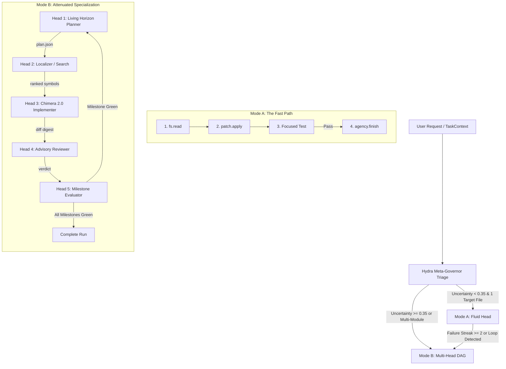
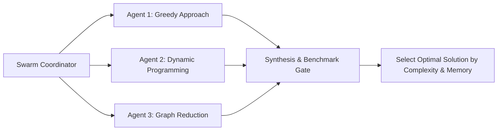

# HYDRA: Autonomous Neuro-Symbolic Meta-Agency, Adaptive Topologies, and Composable Software Engineering Substrates

**Document Class:** Principal Architecture Treatise & System Specification  
**Authority:** Technical Strategy & Framework Blueprint  
**Substrate Target:** Vanguard / AETHER Recursive Agency Substrate (Python 3.10+ Hexagonal Core, React/DOM Desktop)  
**File Location:** `.draft/HYDRA_MULTI_AGENT_TOPOLOGY_AND_EMERGENT_AGENCY.md`  
**Status:** Living Engineering Proposal  

---

## Abstract

This specification defines **HYDRA**, an adaptive, multi-headed meta-agency topology built on top of Vanguard's domain-blind, event-sourced substrate. HYDRA resolves the fundamental tension in autonomous agent design between **rigid multi-agent assembly lines** (which over-engineer simple problems and burn tokens) and **naive monolithic loops** (which collapse on complex, multi-file brownfield tasks). 

HYDRA achieves this through **Dynamic Bifurcation**—fluidly operating as an unencumbered direct actor on small, localized fixes, while dynamically unfolding into an attenuated multi-head Directed Acyclic Graph (DAG) of specialized subagents when structural complexity or failure streaks demand it. 

Furthermore, this document articulates the evolution of **CHIMERA** into a modular specialist head; establishes the formalism of **Living Horizon Planning** (replacing fragile waterfall plans with event-sourced plan amendments); introduces a **Tiered Verification Gradient** (micro-AST syntax checks $\to$ focused unit tests $\to$ milestone macro-gates); outlines four distinct non-Chimera agent paradigms; and formalizes a compositional taxonomy where simple primitive atoms assemble into complex emergent molecules and multi-agent swarms.

---

## 1. Executive Synthesis & Foundational Philosophy

### 1.1 The Core Problem: Monolithic Railroads vs. Fragile Prompts

Contemporary autonomous software engineering systems suffer from a false dichotomy:

1. **The Over-Engineered Waterfall Railroad:** Multi-agent frameworks (e.g., standard LangGraph, AutoGen, or MetaGPT pipelines) often lock the execution into a static sequential chain: $\text{Product Manager} \to \text{Architect} \to \text{Planner} \to \text{Engineer} \to \text{QA}$. When applied to a 1-line typo or a localized bugfix, this architecture incurs massive latency (3+ minutes), astronomical token overhead (\$0.15–\$0.50), and inevitable semantic drift as intermediate personas re-interpret trivial goals. When an unexpected dependency error occurs at Step 4, the initial 8-step plan is rendered obsolete, causing the committee to hallucinate or dead-end.
2. **The Fragile Monolithic Single-Prompt Loop:** In contrast, single-agent harnesses (e.g., vanilla SWE-bench baselines or simple ReAct loops) force an LLM into an open-ended loop with a massive, catch-all prompt. While fast on trivial tasks, these harnesses rapidly degrade on complex multi-file brownfield repositories due to context saturation, attention diffusion, tool-name confusion, and infinite retry loops.

### 1.2 Emergent Intelligence via Simple Primitives (The Atom-to-Molecule Principle)

Vanguard rejects both extremes. Intelligence should not be hardcoded into monolithic agent behaviors or heavy-handed frameworks; **intelligence must be an emergent property of simple, orthogonal primitives constrained by sound engineering methodology**.

```text
  [PRIMITIVE ATOMS]             [COMPOUND MOLECULES]           [ORGANISMS & SWARMS]
  • Canonical Verbs             • Specialized Manifests        • HYDRA Meta-Topology
  • Resource Selectors          • Reusable Tool Palettes       • Bounded Parallel Schedulers
  • Monotonic Budgets           • Context Policies             • Living Horizon Planners
  • Append-Only Ledger          • Verification Gates           • Consensus Reviewers
```

* **Atoms (Kernel & Domain):** Pure value contracts (`fs.read`, `patch.apply`, `proc.exec`), content-addressed SHA-256 digests, and monotonic budget attenuation.
* **Molecules (Agency Manifests):** Declarative, decoupled configurations linking prompts, tool sets, and context policies without custom Python glue code.
* **Organisms & Swarms (Runtime Topologies):** Dynamic execution DAGs passing content-addressed artifacts over an append-only event ledger.

### 1.3 Hexagonal Invariant Compliance

Every architecture proposed herein strictly adheres to the Vanguard Hexagonal Production Lattice:
$$\text{domain} \longleftarrow \text{ports} \longleftarrow \text{kernel} \longleftarrow \text{agency} \longleftarrow \text{runtime} \longrightarrow \text{adapters}$$

* **Invariant I-1 (Single Ledger Emitter):** All state changes, plan amendments, and test receipts are emitted to the SQLite WAL event store (`vg.4` envelopes).
* **Invariant I-6 (Isolation Policy):** Tools execute in unprivileged sandboxes (`bwrap` UID 10001) or monitored loopback workers.
* **Invariant I-7 (Domain Blindness):** The kernel, dispatch pipeline (S0–S12), and scheduler remain completely domain-blind—they enforce capability grants and budget algebra without knowing what "Python", "Rust", or "git" are.

---

## 2. Evolution of CHIMERA: Maturing the Neuro-Symbolic Engine

### 2.1 Retrospective: The 100% Pass Rate & The "Abandoned" Paradox

In empirical evaluations on the 46-run benchmark ladder (`AGENT_ARCHITECTURE_MAP.html`), `vg-chimera-v1` demonstrated elite cognitive capability:
* **Oracle Pass Rate:** **6 / 6 (100%)** on assigned tasks.
* **Combined Record with `v3`:** **24 / 24 (100%)**, accounting for virtually all successful runs across the entire project history.
* **Strengths:** Greenfield scaffolding, self-TDD discipline (writing test suites when none exist), zero-defect contract rules (1-indexed sequential IDs, initial pointer state management).

However, rigorous forensic analysis reveals the **"Abandoned" Paradox**:
$$\text{Passes} = 26 \quad \Big( \text{Completed} = 10, \quad \text{Abandoned} = 18 \Big)$$
Across the benchmark suite, 18 runs fixed the code and passed the test oracle, but were terminated as `abandoned` because the agent looped on `proc.exec` or failed to recognize that its mission was finished. The agent won, but did not know it had won.

### 2.2 Deep Architecture of `agency/chimera/`

CHIMERA is not just a prompt; it is an integrated neuro-symbolic subsystem located in `vanguard/packages/agency/chimera/`:

```
┌──────────────────────────────────────────────────────────────────────────┐
│                             CHIMERA ENGINE                               │
├──────────────────────────────────────────────────────────────────────────┤
│  ┌───────────────────────┐             ┌──────────────────────────────┐  │
│  │  CognitiveBlackboard  │ ◄────────── │     MetaCognitiveGovernor    │  │
│  │  • Facts & Hypotheses │             │     • Phase Transitions      │  │
│  │  • Uncertainty Profile│             │     • Directives: SOLVE,     │  │
│  │  • Budget Accounting  │             │       RETRIEVE, FORK, FINISH │  │
│  └───────────┬───────────┘             └──────────────┬───────────────┘  │
│              │                                        │                  │
│              ▼                                        ▼                  │
│  ┌───────────────────────┐             ┌──────────────────────────────┐  │
│  │    SymbolicCortex     │             │       CognitiveRouter        │  │
│  │    • AST Invariant    │             │       • Thompson Sampling    │  │
│  │      Checking         │             │       • Multi-Armed Bandits  │  │
│  └───────────────────────┘             └──────────────────────────────┘  │
│              │                                        │                  │
│              ▼                                        ▼                  │
│  ┌───────────────────────┐             ┌──────────────────────────────┐  │
│  │ ChimeraAtomicPatcher  │             │      VerificationCortex      │  │
│  │ • Multi-strategy Diff │             │      • Output Parsing        │  │
│  │ • Rollback Safety     │             │      • Risk Assessment       │  │
│  └───────────────────────┘             └──────────────────────────────┘  │
└──────────────────────────────────────────────────────────────────────────┘
```

1. **`CognitiveBlackboard`:** Implements an approximate Bayesian state machine tracking task features, candidate files, ranked symbols, and an `UncertaintyProfile` ($U_{\text{loc}}, U_{\text{synth}}, U_{\text{verif}}$).
2. **`MetaCognitiveGovernor`:** Evaluates blackboard state to issue discrete `CognitiveDirectives` (`SOLVE`, `RETRIEVE`, `FORK`, `ESCALATE`, `FINISH`), governing *how* to compute rather than emitting text.
3. **`CognitiveRouter`:** Multi-armed bandit router using Thompson Sampling over historical Beta distributions $\text{Beta}(\alpha, \beta)$ to select optimal model tiers.
4. **`SymbolicCortex`:** Performs fast, zero-token AST syntax parsing and invariant checks before changes reach disk.
5. **`ChimeraAtomicPatcher`:** Multi-strategy patching engine capable of whole-file rewriting, unified diff application, and transactional rollback on syntax failure.

### 2.3 Key Weaknesses & Chimera 2.0 Hardening

To evolve Chimera from a successful prototype to a bulletproof production engine, four architectural upgrades are specified:

#### Upgrade 1: Explicit Loop-Settlement & Admission Awareness
* *Defect:* Chimera looped on `proc.exec` because the test tool returned `[exit 0]` but the inner loop lacked an authoritative signal forcing completion.
* *Chimera 2.0 Remedy:* The `MetaCognitiveGovernor` binds directly to `VerificationReceipt.passed`. When a verification tool execution yields `exit_code == 0` on an admitted task, the governor immediately overrides the prompt and returns `CognitiveDirectiveKind.FINISH`.

#### Upgrade 2: Wire `aliases.json` via Tool Schema Ingress
* *Defect:* As discovered in `AGENT_ARCHITECTURE_MAP.html`, `aliases.json` sat dead on disk across all manifests. Models emitting `patch` instead of `patch.apply` triggered fatal `tool_not_declared` errors.
* *Chimera 2.0 Remedy:* Tool resolution in `ManifestLoader` must load `aliases.json` into the `ProposalTranslator` alias dictionary, making `patch \to patch.apply` and `read \to fs.read` transparent and fail-safe.

#### Upgrade 3: AST-Sourced Semantic Slicing
* *Defect:* Context compiler injected raw files or flat repo maps, consuming 4,000+ tokens on irrelevant class definitions.
* *Chimera 2.0 Remedy:* `SymbolicCortex` extracts only the target class skeleton and referenced call-graph signatures, shrinking the initial context packet by 65%.

---

## 3. The HYDRA Architecture: Dynamic Bifurcation & Emergent Agency

### 3.1 Conceptual Topology

**HYDRA** is a meta-agent topology capable of **Dynamic Bifurcation**. It does not assume that all problems are simple, nor does it assume that all problems are complex. It begins as a lean, agile head and conditionally sprouts specialized heads only when uncertainty crosses defined mathematical thresholds.



### 3.2 Dynamic Bifurcation Mechanics

The root HYDRA harness evaluates three signals to select its operational mode:
$$\text{Complexity Score } \mathcal{C} = w_1 U_{\text{loc}} + w_2 C_{\text{dep}} + w_3 S_{\text{spec}}$$
* $U_{\text{loc}} \in [0, 1]$: Localization uncertainty (derived from task brief file specificity).
* $C_{\text{dep}} \in [0, 1]$: Dependency coupling (number of inter-module edges in `repo_index`).
* $S_{\text{spec}} \in [0, 1]$: Specification entropy (ratio of open-ended constraints to deterministic test requirements).

1. **Threshold $\mathcal{C} < 0.35$ (Mode A: Fluid Head):**  
   Runs in an unencumbered ReAct loop with `[fs.read, patch.apply, proc.exec]`. Reaches completion in 2–3 turns ($t < 5\text{s}$, cost $< \$0.003$).
2. **Threshold $\mathcal{C} \ge 0.35$ (Mode B: Multi-Head DAG):**  
   Activates BEP-04 topology scheduling. Spawns specialized heads with attenuated budgets and distinct role policies.
3. **Dynamic Escalation:**  
   If Mode A suffers 2 consecutive test failures or a `no_progress` warning, the session suspends Mode A, captures settled diffs into the ledger, and promotes the run to Mode B, passing the failure context directly into the Planner Head.

### 3.3 The Living Horizon Plan (Eliminating Waterfall Rigidity)

Traditional planners fail because software development is an empirical discovery process: writing code reveals unpredicted constraints. 

HYDRA implements **Living Horizon Planning**:
* **Anchor Goal:** Immutable high-level invariant (e.g., *"Implement thread-safe WAL buffer cache"*).
* **Active Horizon (Window = 1):** The single milestone currently being executed.
* **Queued Horizon (Window $\le 2$):** Near-term expected steps, kept deliberately abstract.
* **Uncommitted Future:** Everything else remains un-planned until empirical feedback arrives.

#### The Event-Sourced Amendment Protocol
When an active milestone encounters an architectural obstacle (e.g., a missing mutex primitive in a low-level library), the Planner does not discard the run. It emits an audited `HydraPlanAmended` event:

```json
{
  "kind": "HydraPlanAmended",
  "reason": "unplanned_dependency_discovered",
  "payload": {
    "settled_milestones": [1],
    "active_milestone_before": {"id": 2, "name": "Implement Cache Buffer"},
    "action": "INTERLEAVE_MILESTONE",
    "inserted_milestone": {
      "id": "2a",
      "name": "Extract Lock-Free Spinlock Primitives",
      "verification_target": "tests/test_spinlock.py",
      "budget_tokens": 4000
    },
    "deferred_milestone_id": 2,
    "rationale": "Buffer cache requires spinlock not yet present in platform ports."
  }
}
```

The workflow scheduler pauses the Implementer Head, schedules the Spinlock sub-task, settles it, and then resumes the Buffer Cache milestone with the new primitive available in the context packet.

### 3.4 The Tiered Verification Gradient

To prevent testing bottlenecks, HYDRA defines a 3-tier verification gradient:

| Tier | Name | Target Scope | Latency | Token Cost | Failure Action |
|---|---|---|---|---|---|
| **Tier 1** | **Micro-Check** | Single AST / Syntax pass via `SymbolicCortex` | $< 150\text{ms}$ | 0 | Immediate in-turn retry; never touches disk |
| **Tier 2** | **Fluid Falsifier** | Focused unit test (`pytest -k test_target`) | $1–3\text{s}$ | Low | Coder inspects traceback and modifies patch |
| **Tier 3** | **Milestone Macro-Gate** | Full test suite + linter + reviewer diff scan | $10–30\text{s}$ | Medium | Authoritative gate required before advancing milestone |

---

## 4. Divergent Architectural Paradigms Beyond Chimera and Hydra

To prove that the Vanguard framework is not a single-trick pony, here are four completely divergent agent paradigms that alter both the **Inner Loop** and the **Outer Loop**.

```
┌────────────────────────────────────────────────────────────────────────────────────────┐
│                               ARCHITECTURAL SPECTRUM                                   │
├───────────────────┬────────────────────┬───────────────────────┬───────────────────────┤
│ vg-hexagonal      │ vg-falsifier-tdd   │ vg-archeologist       │ vg-swarm-parallel     │
│ Static Clean-Code │ Strict Mutation    │ Read-Only Context     │ Asynchronous          │
│ Invariant Engine  │ Test Falsifier     │ Slicer & Explainer    │ Multi-Node Consensus  │
└───────────────────┴────────────────────┴───────────────────────┴───────────────────────┘
```

### 4.1 Paradigm A: The Clean-Code & Hexagonal Specialist (`vg-hexagonal`)
* **Philosophy:** Enforces strict Clean Architecture, Domain-Driven Design (DDD), and Dependency Inversion. Code is rejected not because it fails tests, but because it violates architectural boundaries.
* **Inner Loop:** Every proposed diff is analyzed by an AST-based boundary checker before execution.
* **Capabilities:** `[fs.read, fs.search, patch.apply, arch.lint]`.
* **Distinct Mechanism:**
  * Detects leakage from outer layers (`adapters/`, `runtime/`) into inner layers (`domain/`, `ports/`).
  * Rejects God-classes, circular imports, and untyped dictionaries across boundary interfaces.
  * Admission requires both green unit tests and an `ARCH_PASS` verification certificate.

### 4.2 Paradigm B: The Strict TDD / Mutation Testing Falsifier (`vg-falsifier-tdd`)
* **Philosophy:** Code written without a prior failing test is untrusted. Prevents "tautological passing" (where tests pass because they test nothing).
* **Inner Loop:** A rigid 3-phase state machine:
  $$\text{Phase 1: RED (Author Test)} \longrightarrow \text{Phase 2: GREEN (Author Code)} \longrightarrow \text{Phase 3: REFACTOR}$$
* **Distinct Mechanism:**
  * **Step 1:** Writes a test asserting the new feature or reproducing the bug.
  * **Step 2 (The Falsifier Check):** Executes the test *before* implementing code. If the test passes initially, the test is discarded as tautological. The test **must fail**.
  * **Step 3:** Writes the minimum implementation to make the test pass.
  * **Step 4 (Mutation Testing):** Introduces synthetic mutants (flipping `<` to `<=`, returning `None`). If the test suite does not catch the mutants, admission is refused.

### 4.3 Paradigm C: The Brownfield Archeologist & Deep Slicer (`vg-archeologist`)
* **Philosophy:** Designed for 1,000,000+ line legacy codebases where running tests is impossible, dangerous, or takes hours. The objective is deep comprehension, causal slicing, and safe, localized surgery.
* **Inner Loop:** Completely read-only exploration and slicing loop.
* **Capabilities:** `[fs.read, fs.search, git.blame, lda.slice, callgraph.trace]`.
* **Distinct Mechanism:**
  * Takes an ambiguous bug description or error log.
  * Traces execution backwards along call-graph edges using Tree-Sitter and git commit forensics.
  * Synthesizes a content-addressed `CausalExplorationReport` with interactive file links and code block diagrams.
  * Proposes surgical recommendations without modifying code directly, handing off the artifact to an operator or downstream coder.

### 4.4 Paradigm D: The Asynchronous Consensus Swarm (`vg-swarm-parallel`)
* **Philosophy:** Competitive-collaborative multi-agent swarm solving high-complexity algorithmic challenges through diversity of thought.
* **Outer Loop:** Bounded parallel execution over `WorkflowScheduler`:



* **Distinct Mechanism:**
  * Spawns 3 independent implementer heads with different temperature seeds and prompts under bounded parallel thread pools.
  * Solutions are evaluated by an automated benchmark harness measuring runtime CPU latency, memory footprint, and edge-case coverage.
  * The Synthesizer merges the best algorithmic properties into a single production commit.

---

## 5. Event-Sourced Standardized Communication & Primitive Composition

### 5.1 Immutable Append-Only Ledger (`vg.4` Envelopes)

Vanguard provides absolute observability because **nothing occurs off-ledger**. Communication between agents, heads, and tools does not use ad-hoc message queues; it uses the canonical `vg.4` event stream.

```json
{
  "version": "vg.4",
  "frameType": "event",
  "envelope": {
    "eventId": "evt-01918a24-7c39-7100-9a21-182739481726",
    "timestamp": "2026-09-02T04:20:10.120Z",
    "runId": "run-hydra-0821",
    "seq": 42,
    "kind": "HydraMilestoneSettled",
    "principal": "agent://hydra/implementer-head-2",
    "payload": {
      "milestoneId": 1,
      "diffDigest": "sha256:e3b0c44298fc1c149afbf4c8996fb92427ae41e4649b934ca495991b7852b855",
      "verificationReceiptDigest": "sha256:4b227777d4dd1fc61c6f884f48641d02b4d121d3fd328cb08b5531fcacdabf8a"
    }
  }
}
```

### 5.2 Content-Addressed Artifact Passing (No Transcript Flooding)

A notorious pitfall in multi-agent architectures is **Transcript Explosion**—passing entire chat histories between agents until context limits are exhausted.

In Vanguard, heads communicate via **SHA-256 Content-Addressed Digests**:
* The Planner does not send 2,000 tokens of text to the Coder. It captures `plan.json` into the `FileBlobStore` and passes `plan_digest: "sha256:8f4c..."`.
* The Coder reads the plan by digest, writes a patch, and passes `diff_digest: "sha256:a12b..."`.
* The Evaluator reads the diff and passes `receipt_digest: "sha256:99cf..."`.
* **Result:** Token consumption stays flat $O(1)$ regardless of workflow depth.

### 5.3 Monotonic Capability & Budget Attenuation

The Trusted Computing Base (TCB limit $\le 1438$ LOC, currently 1386 LOC) strictly enforces mathematical monotonicity:
$$\text{Child Budget } \mathcal{B}_{\text{child}} \le \text{Parent Budget } \mathcal{B}_{\text{parent}}$$
$$\text{Child Capabilities } \mathcal{C}_{\text{child}} \subseteq \text{Parent Capabilities } \mathcal{C}_{\text{parent}}$$

A root HYDRA agent with a \$0.50 budget and read-write privileges can spawn an Evaluator Head, but can restrict that Evaluator to \$0.05 and read-only observation. Even if the Evaluator is compromised or hallucinates a `patch.apply` or `rm -rf`, the kernel drops the proposal at Stage S2 of dispatch.

---

## 6. The Chemistry of Agency: From Atoms to Molecules to Swarms

To enable non-linear, rapid prototyping of novel agents, the framework adopts a chemical composition hierarchy:

```
┌────────────────────────────────────────────────────────────────────────┐
│                        COMPOSITIONAL HIERARCHY                         │
├────────────────────────────────────────────────────────────────────────┤
│  LEVEL 4: SWARM / TOPOLOGY                                             │
│  BEP-04 DAGs · WorkflowScheduler · Lease Acquisition · Bounded Joins   │
├────────────────────────────────────────────────────────────────────────┤
│  LEVEL 3: ORGANISM / AGENT                                             │
│  HYDRA · CHIMERA · Manifest Declarations · Multi-Role Delegation       │
├────────────────────────────────────────────────────────────────────────┤
│  LEVEL 2: MOLECULE / PALETTE                                           │
│  Context Policies · Tool Kits · Routing Presets · Admission Contracts  │
├────────────────────────────────────────────────────────────────────────┤
│  LEVEL 1: ATOM / PRIMITIVE                                             │
│  Verbs (fs.read) · Path Selectors · Ed25519 Keys · JCS Hashes · Spans  │
└────────────────────────────────────────────────────────────────────────┘
```

### 6.1 Reusable Molecule Catalog
Instead of copying code, developers assemble manifests by referencing modular JSON building blocks:

* **Tool Palettes:**
  * `palettes/read-only-inspection.json` $\to$ `[fs.read, fs.search]`
  * `palettes/surgical-mutation.json` $\to$ `[fs.read, patch.apply]`
  * `palettes/polyglot-execution.json` $\to$ `[proc.exec (python, pytest, cargo, npm, ruff)]`
* **Context Molecules:**
  * `context/bounded-repomap-4k.json` $\to$ High-density symbol graph
  * `context/recency-window-64.json` $\to$ Conversational turn memory
  * `context/forensic-causal-slice.json` $\to$ Git blame and caller graphs
* **Admission Contracts:**
  * `admission/strict-test-verified.json` $\to$ Demands `exit_code == 0` test receipt
  * `admission/static-analysis-clean.json` $\to$ Demands clean linter/syntax certificate
  * `admission/human-ed25519-signed.json` $\to$ Demands operator key signature

---

## 7. Ecosystem Enhancements: Tools, Skills, CLIs, and OSS Extensions

To elevate our autonomous agents to state-of-the-art capability, the following concrete additions are recommended for the repository:

### 7.1 Proposed Native Tools & OSS Integrations

1. **`tree-sitter` Semantic Parser Engine:**
   * *Purpose:* Replace naive regex searching with structural AST queries.
   * *Tool:* `ast.query(language, query_pattern, path)`
   * *Capability:* Allows an agent to ask: *"Find all implementations of trait `StorageAdapter`"* or *"Extract all call-sites of `execute_command`"*, returning exact syntax nodes.
2. **`mutmut` / AST Mutation Testing Engine:**
   * *Purpose:* Automatic validation of test quality.
   * *Tool:* `test.mutate(target_file, test_command)`
   * *Capability:* Injects subtle mutations into the newly written code. If tests still pass, warns the agent that its tests are weak or tautological.
3. **`semgrep` Polyglot Linter Daemon:**
   * *Purpose:* Sub-second static security and architectural checks.
   * *Tool:* `lint.check(ruleset="clean-architecture", paths=[...])`
   * *Capability:* Proves compliance with Clean Architecture rules in 100ms.

### 7.2 Proposed Antigravity & Vanguard Skills

1. **`skill-living-plan`:**
   Provides guidelines, prompt injections, and validation rules for maintaining a 1-active-milestone rolling horizon plan without over-engineering.
2. **`skill-brownfield-archeology`:**
   Contains methodologies for navigating 500k+ LOC repositories, using commit history, dependency mapping, and non-destructive smoke checks.
3. **`skill-clean-architecture`:**
   Teaches the agent how to implement Hexagonal/DDD patterns, separate ports from adapters, and keep business logic stdlib-only.

### 7.3 CLI & Developer Experience Tooling

1. **`vg hydra <brief> [--mode auto|fluid|structured]`:**
   CLI command to launch a task under the HYDRA meta-governor directly from the terminal.
2. **`vg topology preview <topology.json>`:**
   Renders an ASCII or Mermaid graph of the multi-agent DAG, calculating budget allocations and attenuation constraints before launching.
3. **`vg replay --forensics <run-id>`:**
   Step-by-step TUI replay of the `vg.4` ledger, showing every proposal, tool execution, and state change in slow motion.

### 7.4 Desktop GUI Integration (`@aether/desktop`)

Incorporate live multi-agent observability into the newly built plain-DOM desktop client:
* **Live DAG View:** Dynamic visual rendering of HYDRA's active heads (Planner, Coder, Evaluator) showing current lease holders.
* **Living Plan Drawer:** An interactive card view of the active milestone, completed milestones, and horizon queue.
* **Forensic Event Stream:** Instant filtering of `HydraPlanAmended` and `VerificationReceipt` events.

---

## 8. Conclusion & The Evolutionary Roadmap

By moving from hardcoded agent scripts to **emergent agency over composable primitives**, Vanguard positions itself at the state-of-the-art of autonomous software engineering.

### Execution Phasing

```
[Phase 1: Stabilization] ────────► [Phase 2: Chimera 2.0] ────────► [Phase 3: HYDRA Engine]
• Merge Desktop UI + Electroweak   • Wire aliases.json              • Implement Hydra Manifest
• Fix gateway profile coercion     • AST Semantic Slicing           • Dynamic Bifurcation Triage
• Clean up v3luna fork             • Explicit Loop-Exit Binding     • Living Horizon Plan Tool
                                                                    • Tiered Verification Gradient
```

1. **Phase 1 (Immediate Closure):** Consolidate the desktop client and backend hardening branch; eliminate the broken `v3luna` fork; wire `aliases.json` across all manifests.
2. **Phase 2 (Chimera 2.0 Hardening):** Integrate `SymbolicCortex` AST slicing into the context compiler; enforce immediate loop completion on passing test receipts.
3. **Phase 3 (HYDRA Meta-Topology):** Declare the `vg-hydra` manifest, implement the Living Horizon Plan amendment tool, and activate Dynamic Bifurcation in the runtime scheduler.

With HYDRA, developers and operators get the best of both worlds: **unrivaled 3-second convergence on simple fixes**, and **resilient, multi-headed architectural synthesis on the most complex engineering challenges in industry**.
