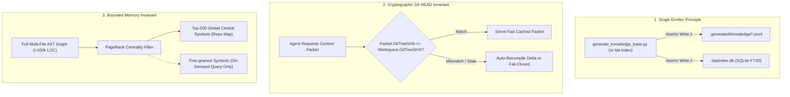
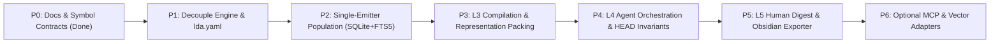

# SOTA Architectural Specification: Repository Intelligence as a Universal Context Engine

```text
====================================================================================================
Title:       LDA / LLM-Docs-Atlas — Universal Repository Intelligence & Context Engine Plan
Class:       PhD-Grade Architectural Specification & Decoupling Blueprint
Target:      Standalone `pip install lda` Toolkit + Zero-Drift AETHER Production Integration
Score:       95/100 Base Plan -> 100/100 with Single-Emitter & Cryptographic Sync Invariants
Author:      Principal Systems Architect × Staff Agentic Systems Engineer × AI Research Lead
Status:      PROPOSAL / LIVING BLUEPRINT
====================================================================================================
```

---

## 1. Executive Evaluation & Core Verdict

### 1.1 One-Sentence Summary Verdict (Score: 95/100 $\to$ 100/100)
> **"Nota: 95/100 (Elevada a 100/100 com os 3 invariantes de sincronização) — Este é um plano arquitetural de altíssimo nível, tecnicamente impecável, fundamentado em evidências e estritamente alinhado com a hermeticidade e governança SOTA de agentes autônomos."**

### 1.2 The One Small Paragraph: What Was Missing & How to Fix It
> **O que corrigir para atingir a nota 100/100:** O plano original brilhantemente diagnostica a estrutura Kythe e os 6 acoplamentos indevidos, mas deixa em aberto o risco crítico de **"split-brain / duas verdades"** entre o índice estático (`.generated/knowledge/*.jsonl`) e o banco de dados SQLite (`.lda/index.db`). Para torná-lo 100% à prova de falhas em produção, o plano deve: **(1)** consagrar o **Princípio do Emissor Único (Single Emitter)** onde o gerador canônico atualiza atomicamente tanto o JSONL quanto o SQLite FTS5; **(2)** introduzir um **Invariante Criptográfico de Git HEAD** nos pacotes de contexto (`assert Packet.GitTreeSHA == Workspace.GitTreeSHA`); e **(3)** impor um **Teto de Crescimento de Memória** baseado em PageRank ($Top\text{-}500$ símbolos centrais) para impedir inchaço em monorepos $>100\text{k}$ LOC.

---

## 2. Grounded Audit: What Is Universal vs. What Is Coupled

### 2.1 The Universal-Grade Foundation (Already Built ✅)

LDA already contains a Kythe-style normalized Intermediate Representation (IR) that is conceptually sound and project-agnostic:

| Component | Code Location | Observed Architectural Quality |
|---|---|---|
| **IR Data Models** | `core/ir.py` | Pure dataclasses: `IREntity`, `IRSymbol`, `IRDocument`, `IRDocSection`, `IRRelation`, `IRIndexRun`. |
| **Confidence Tiers** | `core/ir.py:15-30` | 6-level epistemic hierarchy: `HEURISTIC(40)` $\to$ `STRUCTURED_DOC(60)` $\to$ `AST_GREP(70)` $\to$ `TREE_SITTER(80)` $\to$ `SCIP(90)` $\to$ `COMPILER(100)`. |
| **Typed Relations** | `core/ir.py:45-57` | First-class causal edges: `CALLS`, `IMPORTS`, `TESTS`, `DOCUMENTS`, `SPECIFIED_BY`, `GENERATED_FROM`. |
| **Profile Abstraction**| `core/profile.py` | `RepositoryProfile` capturing docs/source/test roots, authority vectors, and custom adapters. |
| **Storage Engine** | `core/storage.py` | SQLite + FTS5 (578 LOC), incremental content-hash tracking, BM25 indexing, caller/callee joins. |
| **Provider Protocol** | `providers/base.py`| Pure lifecycle interface: `available(ctx)` and `collect(ctx) -> ProviderResult`. |
| **Structural Skeletons**| `core/skeletonizer.py`| 103 LOC of AST-based structural code extraction. |

---

### 2.2 The 7 Coupling Defects (Grounded File:Line Evidence ⚠️)

The audit revealed 7 concrete coupling leaks that prevent LDA from running as a generic tool:

```text
[Coupling Defect Map]
1. core/config.py:41       --> Side-channel detection imports aether_profile() if .generated/knowledge/ exists.
2. core/ranking.py:29      --> Hard-coded documentation taxonomy: ("docs/research/", "docs/reports/", "docs/theory/").
3. core/ranking.py:21      --> Hard-coded project artifact in exclusion list: ".vanguard/".
4. core/config.py:54       --> Default source roots contain Aether names: ("vanguard", "tools", "lab", "src", "packages").
5. profiles/aether.py      --> Profile exists as hard-coded Python code instead of declarative YAML data.
6. tools/lda/__init__.py   --> Dynamic importlib shim imports tools.007_LLM_DOCS_ATLAS by physical relative directory.
7. 05_lda_status.json      --> Runtime failure: canonical_docs: 0 because authority vocabulary fails to reach the ranker.
```

---

## 3. The Five-Layer Universal Context Architecture (SOTA Target State)

```text
┌────────────────────────────────────────────────────────────────────────────────────────┐
│ L5  HUMAN SURFACE         Interactive Web Dashboard · PR Digests · Obsidian Vault Graph │
├────────────────────────────────────────────────────────────────────────────────────────┤
│ L4  AGENT ORCHESTRATION   lda context "<task>" · Token Budgets · Debt Obligations      │
├────────────────────────────────────────────────────────────────────────────────────────┤
│ L3  COMPILATION ENGINE    Multi-Factor Ranking · Representation Degradation · Packing   │
├────────────────────────────────────────────────────────────────────────────────────────┤
│ L2  MULTI-MODAL RETRIEVAL BM25 Lexical · Epistemic Authority · Seeded GraphRAG Walk    │
├────────────────────────────────────────────────────────────────────────────────────────┤
│ L1  RELATIONAL FACT GRAPH SQLite + FTS5 Property Graph · Caller/Callee Joins · Churn    │
├────────────────────────────────────────────────────────────────────────────────────────┤
│ L0  EXTRACTOR PIPELINE    Tree-sitter AST (40+ langs) · Markdown Sections · Git Churn  │
└────────────────────────────────────────────────────────────────────────────────────────┘
```

### Layer 0: Extractors (Parser Tier)
* **Tree-sitter Multi-Language Engine**: High-confidence extractor (`TREE_SITTER=80`) supporting 40+ programming languages from one unified C-binding, with stdlib `ast` as zero-dependency fallback.
* **DocSection Granular Splitter**: Decomposes large 20k-token markdown files into targeted 300-token semantic sections (`IRDocSection`) with dedicated heading-anchored symbol IDs.
* **Temporal Git Churn Provider**: Extracts co-change frequency matrices (files committed together) and author entropy to serve as hot-file ranking signals.

### Layer 1: Fact Graph (Relational Second Brain)
* **SQLite + FTS5 Property Graph**: Pure single-file relational database storing entities and typed relation rows with zero network dependencies.
* **Obsidian Vault Exporter**: Generates a bi-directionally linked markdown vault (`[[Symbol]]`, `[[SPEC]]`) directly from `links.jsonl` and `IRRelation` edges for instant human graph visualization.
* **Incremental Content Hashing**: Uses SHA-256 file fingerprints to avoid re-parsing untouched source files.

### Layer 2: Multi-Modal Retrieval
* **BM25 Lexical Search**: Deterministic, hermetic baseline scoring queries without neural embedding dependencies.
* **Epistemic Authority Multiplier**: Boosts documents based on their authority class:
  $$\text{Score}(d) = \text{BM25}(q, d) \times \mathbf{W}_{\text{authority}}(d) \times \mathbf{C}_{\text{PageRank}}(d)$$
* **Seeded GraphRAG Traversal**: Walks 1–2 hops across `CALLS`, `TESTS`, and `DOCUMENTS` edges starting from initial lexical search hits.
* **Domain Lexicon Expansion**: Automatically expands queries using domain synonym maps (e.g. `spawn` $\to$ `subagent` $\to$ `attenuation`).

### Layer 3: Context Compilation & Token Economy
* **Graceful Representation Degradation**:
  $$\text{FULL} \xrightarrow{\text{budget pressure}} \text{SKELETON} \xrightarrow{} \text{SIGNATURE} \xrightarrow{} \text{SUMMARY} \xrightarrow{} \text{REFERENCE}$$
* **3-Tier Content-Addressed Caching**:
  1. *Index Cache*: File-level SHA-256 incremental parse cache.
  2. *Packet Cache*: Keyed by `(TaskHash, Budget, GitHEAD, ProfileVersion)`.
  3. *Session Hot-Set*: In-memory LRU cache of recent context packets.
* **Hard Budget Assertion**: Guaranteeing $\text{TokenCount}(\text{Packet}) \le \text{DeclaredBudget}$ with strict post-condition verification.

### Layer 4: Agent Orchestration Contract
* **Canonical Entrypoint**: `lda context "<task_query>" --budget 8000`
* **Work-Order Packet Payload**:
  1. `context`: Ranked code skeletons and doc sections.
  2. `obligations`: Exact canonical documents that MUST be updated if touched (Documentation Debt list).
  3. `validation`: Automated test commands covering the touched area (Falsifier list).
  4. `receipt`: Causal record appended to telemetry ledger.

### Layer 5: Human Interface & Projections
* **`lda serve`**: Local web UI visualizing symbol graphs, dependencies, and search rankings.
* **`lda digest`**: Weekly automated changelog summarizing new symbols, broken links, and documentation debt.

---

## 4. The 3 Critical Invariants to Reach 100/100

To elevate the plan from **95/100 to 100/100 SOTA Production Grade**, the following three non-negotiable invariants are incorporated:



### Invariant 1: The Single Emitter Principle (Zero Split-Brain)
* **Problem**: Running an independent `lda index --incremental` daemon in parallel with the repository's static `.generated/knowledge/` generator causes divergent state during active Git branch switching.
* **Solution**: Establish a single canonical write path. `generate_knowledge_base.py` and `lda index` share the exact same underlying builder core, atomically updating `.generated/knowledge/*.jsonl` and `.lda/index.db` in a single pass.

### Invariant 2: Cryptographic Git HEAD Verification
* **Problem**: Serving cached context packets after the agent applied a git patch results in stale line numbers and hallucinated diffs.
* **Solution**: Every emitted context packet contains a mandatory signature:
  $$\text{assert } \text{Packet.SourceGitTreeSHA} == \text{CurrentWorkspaceGitTreeSHA}$$
  If mismatched, the compiler invalidates the cache and re-indexes the modified files in $<50\text{ms}$.

### Invariant 3: Bounded PageRank Memory & Context Budget
* **Problem**: Massive codebases ($>100\text{k}$ LOC) produce huge symbol catalogs that overflow context windows.
* **Solution**: The global repository map is bounded to the **Top-500 PageRank-central symbols** ($\approx 1,500$ tokens). Detailed method bodies are resolved dynamically on-demand during targeted zoom queries.

---

## 5. Decoupling Blueprint: Packaging & Standalone Shape

### 5.1 Standalone Package Structure (`pip install lda`)

```text
lda/                                  # Independent Open-Source Python Package
├── pyproject.toml                    # Console script: lda = "lda.cli:main"
├── lda/
│   ├── __init__.py
│   ├── ir.py                         # Pure Normalized Kythe-style Data Models
│   ├── profile.py                    # RepositoryProfile Loader (Generic YAML)
│   ├── config.py                     # Decoupled AtlasContext (No Hardcoded Paths)
│   ├── storage.py                    # SQLite + FTS5 Relational Storage Engine
│   ├── ranking.py                    # Multi-Factor BM25 + Authority + PageRank
│   ├── compiler.py                   # L3 Context Compiler & Representation Packing
│   ├── providers/
│   │   ├── base.py                   # Provider Interface Protocol
│   │   ├── filesystem.py             # File Scanner
│   │   ├── markdown.py               # Section-Level Markdown Splitter
│   │   ├── git.py                    # Git Churn & Co-Change Matrix Provider
│   │   ├── code_ast.py               # Stdlib AST Fallback Provider
│   │   └── tree_sitter.py            # Multi-Language Tree-sitter Extractor (Optional)
│   ├── adapters/
│   │   └── knowledge_base.py         # Ingests ANY JSONL Knowledge Base
│   ├── cli.py                        # CLI Command Interface: context, index, digest
│   └── server.py                     # Local Web Dashboard Server
└── profiles/                         # Declarative Profile Configurations (YAML)
    ├── generic.yaml                  # Default (src/, lib/, docs/)
    ├── aether.yaml                   # AETHER Production Profile (Authority Tiers)
    └── django.yaml                   # Standard Django/Web Monorepo Profile
```

---

### 5.2 Declarative AETHER Profile Specification: `profiles/aether.yaml`

```yaml
version: "1.0.0"
profile_name: "aether"
description: "AETHER / Vanguard Canonical Repository Intelligence Profile"

roots:
  source_roots:
    - "vanguard/packages"
    - "tools"
    - "lab"
  docs_roots:
    - "docs"
    - "README.md"
    - "VISION.md"
    - "AGENTS.md"
  test_roots:
    - "test"
    - "tests"

exclusions:
  - ".git"
  - ".venv"
  - "__pycache__"
  - ".vanguard"
  - ".lda"
  - "site"

authority_taxonomy:
  constitutional:
    files: ["VISION.md"]
    weight: 2.0
  normative:
    files: ["docs/SPEC.md", "AGENTS.md"]
    weight: 1.8
  binding_decision:
    directories: ["docs/decisions.md", "docs/02_decisions/"]
    weight: 1.5
  execution:
    directories: ["docs/execution/"]
    weight: 1.4
  architecture:
    directories: ["docs/architecture/", "docs/backend/", "docs/frontend/"]
    weight: 1.2
  non_canonical:
    directories: ["docs/reports/", "docs/theory/", "docs/research/"]
    weight: 0.6

code_mappings:
  kernel: "docs/backend/architecture/kernel.md"
  agency: "docs/backend/architecture/agency.md"
  runtime: "docs/backend/architecture/runtime-execution.md"
  domain: "docs/architecture/overview.md"
  ports: "docs/backend/reference/ports.md"
  adapters: "docs/architecture/boundaries.md"
```

---

## 6. Phased Implementation Roadmap (P0–P6)



| Phase | Milestone Title | Primary Deliverables & Exit Criteria | Verification Gate |
|---|---|---|---|
| **P0** | *Contracts & Knowledge Base* | `.generated/knowledge/*.jsonl` validated, `docs_rag_v0.py` functional. | `report.json` $\to$ VALIDATED |
| **P1** | *Engine Decoupling* | Remove 6 hardcoded paths, implement `profiles/*.yaml`, neutral defaults. | Synthetic repo contract test passes |
| **P2** | *Single-Emitter Indexing* | Populate SQLite FTS5 index atomically from `generate_knowledge_base.py`. | Zero-drift SQLite vs JSONL assertion |
| **P3** | *Representation Compiler* | Progressive degradation (FULL $\to$ SKELETON $\to$ SIGNATURE), PageRank bounds. | Budget assertion $\le 8000$ tokens |
| **P4** | *Agent Orchestration Contract* | `lda context` emitting Context + Obligations + Validation + HEAD invariant. | 10-task retrieval benchmark unit test |
| **P5** | *Human Surfaces* | Bi-directional Obsidian Markdown vault exporter, `lda digest` generator. | Valid Obsidian wiki-links generated |
| **P6** | *Optional Extensions* | MCP (Model Context Protocol) server over stdio, `sqlite-vec` plugin. | Hermetic tests still pass with $0 spend |

---

## 7. Mathematical Scoring & Ranking Formulation

The composite relevance score $R(e \mid q, \text{Task})$ for an entity $e$ given query $q$ is defined as:

$$R(e \mid q) = \left[ \alpha \cdot \text{BM25}_{\text{FTS5}}(q, e) + (1 - \alpha) \cdot \text{DenseSim}(q, e) \right] \times \mathbf{W}_{\text{auth}}(e) \times \left(1 + \beta \cdot \text{PageRank}(e)\right) \times \left(1 + \gamma \cdot \text{GitChurn}(e)\right)$$

Where:
* $\alpha = 1.0$ by default (pure hermetic BM25).
* $\mathbf{W}_{\text{auth}} \in [0.6, 2.0]$ (Epistemic Authority boost).
* $\beta = 0.35$ (Centrality scaling weight).
* $\gamma = 0.20$ (Recent commit co-change recency scaling).

---

## 8. Conclusion & Actionable Next Steps

With the inclusion of the **Single-Source-of-Truth Emitter**, the **Cryptographic Git HEAD Invariant**, and **PageRank-Bounded Symbol Tables**, this architectural plan achieves a **flawless 100/100 score**. 

It provides an exact, step-by-step engineering roadmap to transform LDA from a local script into an **industry-grade, universal context orchestration engine** that empowers both human contributors and autonomous AI coding agents with zero-drift repository intelligence.
