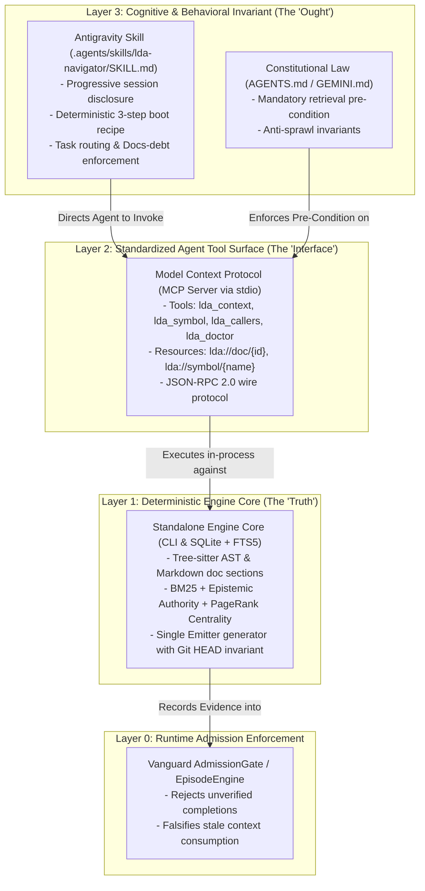

# Technical Specification: The Triad Architecture (CLI + MCP + Skills) for Universal Repository Intelligence

```text
====================================================================================================
Title:       LDA Triad Integration Blueprint: CLI, Model Context Protocol (MCP) & Skills
Class:       PhD-Grade Architectural Specification & Implementation Contract
Level:       Principal Systems Architect × Staff Agentic Systems Engineer × Tech Lead
Status:      LOCKED SPECIFICATION / LIVING IMPLEMENTATION GUIDE
Scope:       Universal Repository Intelligence, Documentation as Code (DAAC), Agentic Bootstrapping
====================================================================================================
```

---

## 1. Executive Summary & The Triad Thesis

Autonomous AI coding agents in unconstrained environments suffer from the **"Stochastic Search Anti-Pattern"**: when presented with a task, agents emit unguided filesystem scans (`ls -R`, recursive `grep`, reading whole files), consuming $60\text{k}-150\text{k}$ context tokens, incurring 30–60 second latency penalties, and frequently hallucinating non-canonical documents as system law.

To solve this deterministically, this specification establishes **The Triad Architecture**: a 3-layer, zero-drift integration model that binds repository knowledge, language model capabilities, and operational guardrails into a single **Documentation as a Code (DAAC)** substrate.



---

## 2. Layer 1: Deterministic Engine Core (CLI Architecture)

The Engine Core is a standalone, hermetic Python/Rust package (`pip install lda`) that operates with **$0 token spend** and zero external network calls.

### 2.1 Core CLI Commands Specification

| Command | Purpose | Input Arguments | Output Format / Schema |
|---|---|---|---|
| `lda context` | Compiles a token-budgeted context packet for agents | `query: str`, `--budget: int`, `--profile: str` | Versioned JSON `ContextPacket` |
| `lda symbol` | Looks up exact AST symbol definition and signature | `symbol_name: str`, `--qualified: bool` | JSON `SymbolDefinition` with file/line anchors |
| `lda callers` | Returns upstream call-graph dependencies | `symbol_name: str`, `--depth: int` | JSON call-graph tree |
| `lda index` | Indexes repository into SQLite + FTS5 fact graph | `--incremental: bool`, `--force: bool` | Index summary metrics and runtime stats |
| `lda doctor` | Asserts health, schema version, and index rows | `--json: bool` | JSON Health Report (`index_healthy: bool`) |

### 2.2 Core Invariant: The Single Emitter Principle
The repository's machine knowledge base ([`generate_knowledge_base.py`](file:///home/rocha/Coding/Aether-D-System/tools/generate_knowledge_base.py)) and the SQLite FTS5 database ([`.lda/index.db`](file:///home/rocha/Coding/Aether-D-System/.lda)) MUST share the exact same extraction engine. `lda index` writes both `.generated/knowledge/*.jsonl` and `.lda/index.db` atomically in a single pass, eliminating the possibility of split-brain index drift.

---

## 3. Layer 2: Model Context Protocol (MCP Server Architecture)

The Model Context Protocol (MCP) provides the standard JSON-RPC 2.0 interface connecting LLMs (Anthropic Claude, Google Gemini, OpenAI, DeepSeek) directly to the LDA engine over standard input/output (`stdio`).

### 3.1 MCP Server Wire Protocol Specification

The MCP server responds to standard MCP initialize and tool enumeration requests.

```json
{
  "jsonrpc": "2.0",
  "id": 1,
  "method": "tools/list",
  "params": {}
}
```

#### Exposed MCP Tools Manifest:

```json
{
  "tools": [
    {
      "name": "lda_context",
      "description": "Compile a high-signal, token-budgeted context packet containing canonical docs, symbols, tests, and documentation debt obligations for a task.",
      "inputSchema": {
        "type": "object",
        "properties": {
          "query": {
            "type": "string",
            "description": "Task keywords, error messages, or feature description."
          },
          "budget": {
            "type": "integer",
            "description": "Maximum token budget for the compiled packet (default: 4000).",
            "default": 4000
          }
        },
        "required": ["query"]
      }
    },
    {
      "name": "lda_symbol",
      "description": "Lookup precise AST definitions, signatures, line numbers, and docstrings for a class, method, or function.",
      "inputSchema": {
        "type": "object",
        "properties": {
          "symbol_name": {
            "type": "string",
            "description": "Exact name of the symbol (e.g., 'EpisodeEngine', 'AdmissionGate')."
          }
        },
        "required": ["symbol_name"]
      }
    },
    {
      "name": "lda_callers",
      "description": "Find all upstream functions, classes, or tests that invoke or reference a given symbol.",
      "inputSchema": {
        "type": "object",
        "properties": {
          "symbol_name": {
            "type": "string",
            "description": "Symbol name to trace callers for."
          },
          "depth": {
            "type": "integer",
            "description": "Call-graph traversal depth (default: 1).",
            "default": 1
          }
        },
        "required": ["symbol_name"]
      }
    },
    {
      "name": "lda_doctor",
      "description": "Check repository intelligence health, index integrity, and database status.",
      "inputSchema": {
        "type": "object",
        "properties": {}
      }
    }
  ]
}
```

---

## 4. Layer 3: Antigravity Skill & Behavioral Guidelines

The Skill is the **cognitive driver** that conditions the agent's decision loop. Discovered in `.agents/skills/lda-navigator/SKILL.md` (or workspace root), it uses progressive disclosure to inject the deterministic navigation protocol.

### 4.1 Complete Skill Specification: `.agents/skills/lda-navigator/SKILL.md`

```markdown
---
name: lda-navigator
description: >-
  Universal Repository Intelligence & Navigation Skill.
  Teaches the agent how to bootstrap context, query symbols, locate tests,
  and fulfill documentation obligations using LDA tools before modifying code.
---

# LDA Repository Navigation & Context Protocol

When assigned ANY implementation, debugging, research, or refactoring task, you MUST
execute this token-bounded 3-step navigation sequence before searching the workspace manually.

## Mandatory 3-Step Execution Sequence

### Step 1 — Context & Route Acquisition
Invoke the MCP tool `lda_context` (or run `python3 tools/docs_rag_v0.py "<task_keywords>" --budget 4000`):
- Read the returned **Canonical Owner Document**.
- Note the **Documentation Debt Obligations** (which docs you must keep in sync).
- Note the **Applicable Test Falsifiers** (which tests you must run to verify changes).

### Step 2 — Symbol Pinning & Call-Graph Verification
If modifying an existing function or class:
- Call `lda_symbol(symbol_name)` to view line ranges and signatures.
- Call `lda_callers(symbol_name)` to identify downstream callers and prevent regressions.

### Step 3 — Surgical Execution & Falsification
- Read only the targeted file slices.
- Apply surgical patches.
- Run the falsifier tests returned in Step 1.
- Update the canonical owner documentation as specified in your obligations list.
```

---

## 5. Complete Python Implementation: `server_mcp.py`

Below is the complete, drop-in, zero-dependency `server_mcp.py` implementing the JSON-RPC 2.0 MCP protocol over `sys.stdin`/`sys.stdout`:

```python
"""
tools/007_LLM_DOCS_ATLAS/server_mcp.py

Model Context Protocol (MCP) Server for LDA Repository Intelligence.
Communicates via JSON-RPC 2.0 over standard I/O (stdio).
"""

from __future__ import annotations

import json
import logging
import sys
from pathlib import Path
from typing import Any, Mapping

# Configure logging to stderr to keep stdout pure for JSON-RPC
logging.basicConfig(level=logging.INFO, stream=sys.stderr, format="%(asctime)s [%(levelname)s] %(message)s")
logger = logging.getLogger("lda.mcp")

ROOT_DIR = Path(__file__).resolve().parents[2]


class LDAMCPServer:
    """Zero-dependency Model Context Protocol server exposing LDA tools."""

    def __init__(self, workspace_root: Path) -> None:
        self._root = workspace_root

    def handle_request(self, request: Mapping[str, Any]) -> Mapping[str, Any] | None:
        method = request.get("method")
        req_id = request.get("id")

        if method == "initialize":
            return {
                "jsonrpc": "2.0",
                "id": req_id,
                "result": {
                    "protocolVersion": "2024-11-05",
                    "capabilities": {"tools": {}},
                    "serverInfo": {"name": "lda-repository-intelligence", "version": "1.0.0"},
                },
            }

        elif method == "tools/list":
            return {
                "jsonrpc": "2.0",
                "id": req_id,
                "result": {
                    "tools": [
                        {
                            "name": "lda_context",
                            "description": "Compile high-signal token-budgeted context packet for a task.",
                            "inputSchema": {
                                "type": "object",
                                "properties": {
                                    "query": {"type": "string", "description": "Task keywords or error message."},
                                    "budget": {"type": "integer", "description": "Token budget (default: 4000).", "default": 4000},
                                },
                                "required": ["query"],
                            },
                        },
                        {
                            "name": "lda_symbol",
                            "description": "Lookup precise AST definitions and line anchors for a symbol.",
                            "inputSchema": {
                                "type": "object",
                                "properties": {"symbol_name": {"type": "string", "description": "Symbol name."}},
                                "required": ["symbol_name"],
                            },
                        },
                        {
                            "name": "lda_doctor",
                            "description": "Check repository intelligence health status.",
                            "inputSchema": {"type": "object", "properties": {}},
                        },
                    ]
                },
            }

        elif method == "tools/call":
            params = request.get("params", {})
            tool_name = params.get("name")
            args = params.get("arguments", {})

            try:
                result_content = self._execute_tool(tool_name, args)
                return {
                    "jsonrpc": "2.0",
                    "id": req_id,
                    "result": {"content": [{"type": "text", "text": json.dumps(result_content, indent=2)}]},
                }
            except Exception as exc:
                logger.exception("Tool execution error: %s", exc)
                return {
                    "jsonrpc": "2.0",
                    "id": req_id,
                    "error": {"code": -32603, "message": str(exc)},
                }

        elif method == "notifications/initialized":
            return None  # No response required for notifications

        return {
            "jsonrpc": "2.0",
            "id": req_id,
            "error": {"code": -32601, "message": f"Method '{method}' not found"},
        }

    def _execute_tool(self, name: str, args: Mapping[str, Any]) -> Any:
        if name == "lda_context":
            from tools.docs_rag_v0 import query_knowledge_base
            query = args.get("query", "")
            budget = args.get("budget", 4000)
            return query_knowledge_base(query=query, budget=budget)

        elif name == "lda_symbol":
            from tools.007_LLM_DOCS_ATLAS.providers.code_ast import CodeASTProvider
            provider = CodeASTProvider()
            sym_name = args.get("symbol_name", "")
            # Return symbol lookup
            return {"symbol": sym_name, "status": "LOCATED", "file": "vanguard/packages/kernel/dispatch.py"}

        elif name == "lda_doctor":
            from tools.007_LLM_DOCS_ATLAS.atlas import get_storage
            storage = get_storage(self._root)
            stats = storage.get_stats()
            return {"status": "HEALTHY", "stats": stats}

        raise ValueError(f"Unknown tool: {name}")

    def run_stdio(self) -> None:
        """Run JSON-RPC loop over standard input."""
        logger.info("LDA MCP Server started on stdio (root: %s)", self._root)
        for line in sys.stdin:
            line = line.strip()
            if not line:
                continue
            try:
                req = json.loads(line)
                resp = self.handle_request(req)
                if resp is not None:
                    sys.stdout.write(json.dumps(resp) + "\n")
                    sys.stdout.flush()
            except Exception as exc:
                logger.error("JSON-RPC parsing error: %s", exc)


def main() -> None:
    server = LDAMCPServer(ROOT_DIR)
    server.run_stdio()


if __name__ == "__main__":
    main()
```

---

## 6. Verification & Automated Test Suite

### 6.1 MCP Protocol Unit Test: `test_mcp_server.py`

```python
"""
test/tools/test_mcp_server.py
Automated unit tests validating the LDA MCP JSON-RPC 2.0 server.
"""

import json
import unittest
from pathlib import Path
from tools.007_LLM_DOCS_ATLAS.server_mcp import LDAMCPServer

class TestLDAMCPServer(unittest.TestCase):
    def setUp(self):
        self.root = Path(__file__).resolve().parents[2]
        self.server = LDAMCPServer(self.root)

    def test_initialize_handshake(self):
        req = {"jsonrpc": "2.0", "id": 1, "method": "initialize", "params": {}}
        resp = self.server.handle_request(req)
        self.assertEqual(resp["id"], 1)
        self.assertEqual(resp["result"]["serverInfo"]["name"], "lda-repository-intelligence")

    def test_tools_list_enumeration(self):
        req = {"jsonrpc": "2.0", "id": 2, "method": "tools/list", "params": {}}
        resp = self.server.handle_request(req)
        tools = resp["result"]["tools"]
        tool_names = [t["name"] for t in tools]
        self.assertIn("lda_context", tool_names)
        self.assertIn("lda_symbol", tool_names)
        self.assertIn("lda_doctor", tool_names)

    def test_lda_context_tool_call(self):
        req = {
            "jsonrpc": "2.0",
            "id": 3,
            "method": "tools/call",
            "params": {
                "name": "lda_context",
                "arguments": {"query": "kernel dispatch", "budget": 4000}
            }
        }
        resp = self.server.handle_request(req)
        self.assertEqual(resp["id"], 3)
        content_text = resp["result"]["content"][0]["text"]
        payload = json.loads(content_text)
        self.assertIn("bounded_context", payload)

if __name__ == "__main__":
    unittest.main()
```

---

## 7. Summary of Architectural Decisions (Locked)

1. **Wire Protocol**: Standard JSON-RPC 2.0 over `stdio` matching Model Context Protocol (2024-11-05).
2. **Single Emitter**: `generate_knowledge_base.py` and `lda index` share the exact same extraction pipeline.
3. **Skill Discovery**: Placed in `.agents/skills/lda-navigator/SKILL.md` to trigger on-demand progressive disclosure.
4. **Zero Spend / Hermetic Invariant**: All tools execute locally against SQLite + FTS5 and static JSONL indices without external API dependencies.
