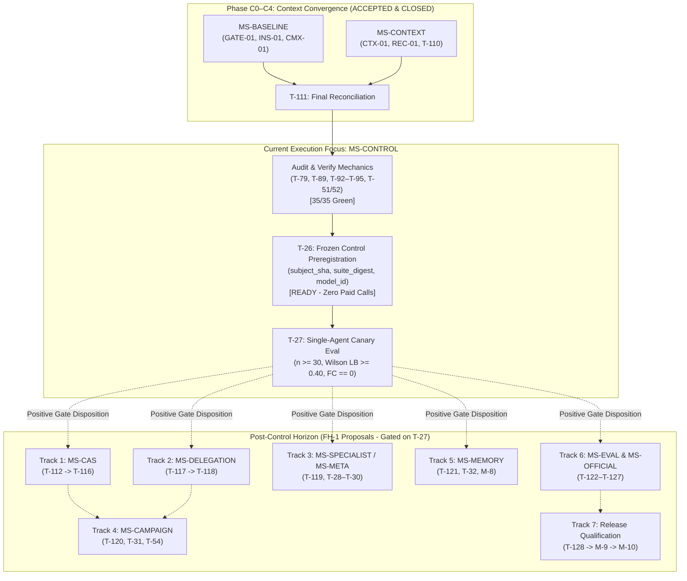

# AETHER / Vanguard — Technical Execution Runway & Team Allocation Report

> [!NOTE]
> **Document Authority & Purpose**: This document is an operational engineering report for the **AETHER/Vanguard** recursive-agency substrate. It consolidates the active Near-Term (**NT-1**) status, the empirical **MS-CONTROL** freeze gateway, the post-control horizon (**FH-1**), and an optimal **5-tier complexity breakdown** mapped to developer seniority and disjoint file-lease lanes.

---

## Summary Table of Contents

1. [Guia de Implementação e Planejamento Operacional (Bloco NT-1)](#1-guia-de-implementação-e-planejamento-operacional-bloco-nt-1)
2. [Global Milestone Status Matrix (M-0 through M-10)](#2-global-milestone-status-matrix-m-0-through-m-10)
3. [Principal Engineering Assessment & Execution Order](#3-principal-engineering-assessment--execution-order)
4. [Complexity Tiering Breakdown (1★ to 5★)](#4-complexity-tiering-breakdown-1-to-5)
5. [Team Lane Reorganization & Disjoint File Leases](#5-team-lane-reorganization--disjoint-file-leases)
6. [Immediate Action Checklist for Dev C](#6-immediate-action-checklist-for-dev-c)

---

## 1. Guia de Implementação e Planejamento Operacional (Bloco NT-1)

### 1.1 Arquivos Canônicos da Pista de Execução

Para implementar o sistema de forma segura, determinística e livre de concorrência destrutiva, todo o ciclo de desenvolvimento segue os 5 arquivos canônicos da pista em [`docs/execution/`](file:///home/rock-dev/Coding/cognitive-framework/docs/execution):

1. **[`tasks.md`](file:///home/rock-dev/Coding/cognitive-framework/docs/execution/main/tasks.md)**: Quadro operacional de tarefas e grafo de dependências (`requires: [...]`), streams exclusivas de escrita (A, B, C) e comandos falsificadores executáveis.
2. **[`spec.md`](file:///home/rock-dev/Coding/cognitive-framework/docs/execution/main/spec.md)**: Especificação normativa e contratos tipados (schemas canônicos como `aether.memory-view/1`, `aether.context-policy/2`, `aether.recovery-state/1`), matriz de erro canônica e invariantes constitucionais.
3. **[`technical.md`](file:///home/rock-dev/Coding/cognitive-framework/docs/execution/main/technical.md)**: Manual de engenharia de software com o algoritmo de compactação de contexto em 7 passos, máquina de estados de recuperação determinística e mapeamento de componentes.
4. **[`milestones.md`](file:///home/rock-dev/Coding/cognitive-framework/docs/execution/main/milestones.md)**: Portões de aceitação TARGET (`MS-BASELINE`, `MS-CONTEXT`, `MS-CONTROL`, `M-0` a `M-10`).
5. **[`backlog.md`](file:///home/rock-dev/Coding/cognitive-framework/docs/execution/main/backlog.md)**: Inventário de pacotes de capacidade e ciclo de vida (`APPROVED`, `IN_PROGRESS`, `DONE`, `BLOCKED`, `PROPOSED`).

---

### 1.2 Divisão em 3 Streams Operacionais

Para respeitar o invariante de escritor único e evitar conflitos de merge, os arquivos do repositório são estritamente particionados:

- **Stream A**: Runtime, Produto & Superfície CLI (`runtime/`, `apps/`, `clients/cli/`)
- **Stream B**: Estado Puro, Contexto, Algoritmos de Recuperação & Patch (`domain/`, `agency/context/`, `adapters/environment/`)
- **Stream C**: Integridade de Testes, Configuração, Linters & Portões (`test/`, `tools/linters/`, `packs/code-default/presets.json`)

---

### 1.3 Tabela de Tarefas do Bloco Ativo NT-1 (Status Real de Implementação)

| Task ID | Stream | Pacote | Estado | Dependências | Arquivos Afetados | Comando Falsificador (Unit/Contract Test) | Objetivo Técnico |
|:---|:---:|:---:|:---:|:---|:---|:---|:---|
| **T-98** | **C** | `GATE-01` | `ACCEPTED` | `[]` | [`test/__init__.py`](file:///home/rock-dev/Coding/cognitive-framework/test/__init__.py)<br>[`test/conftest.py`](file:///home/rock-dev/Coding/cognitive-framework/test/conftest.py)<br>[`check_test_hygiene.py`](file:///home/rock-dev/Coding/cognitive-framework/tools/linters/check_test_hygiene.py)<br>[`test_suite_nonmutation.py`](file:///home/rock-dev/Coding/cognitive-framework/test/contracts/test_suite_nonmutation.py) | `python3 -m unittest test.contracts.test_suite_nonmutation test.tools.test_check_test_hygiene -v` | Garantir isolamento hermético da suíte, isolar metadados Git e redirecionar diretórios graváveis sem mutação da árvore. |
| **T-99** | **A** | `INS-01` | `ACCEPTED` | `[]` | [`entrypoint.py`](file:///home/rock-dev/Coding/cognitive-framework/vanguard/packages/runtime/entrypoint.py)<br>[`app_service.py`](file:///home/rock-dev/Coding/cognitive-framework/vanguard/packages/runtime/app_service.py)<br>[`child_runtime.py`](file:///home/rock-dev/Coding/cognitive-framework/vanguard/packages/runtime/child_runtime.py) | `python3 -m unittest test.apps.coding_max.test_coding_max_facade test.falsifiers.test_rf90_generic_entrypoint test.falsifiers.test_completion_gate_scope -v` | Eliminar o colapso de `abstained` para `completed`. Manter eixos de status terminal e disposição desacoplados. |
| **T-100** | **B** | `CTX-01` | `ACCEPTED` | `[]` | [`task_state.py`](file:///home/rock-dev/Coding/cognitive-framework/vanguard/packages/domain/task_state.py)<br>[`protocol_recovery.py`](file:///home/rock-dev/Coding/cognitive-framework/vanguard/packages/agency/episode/protocol_recovery.py) | `python3 -m unittest test.contracts.test_semantic_task_state -v` | Implementar schemas imutáveis de memória de trabalho (`aether.memory-view/1`), com cursor, linhagem e validação canônica JCS. |
| **T-97** | **A** | `INS-01` | `ACCEPTED` | `[T-84]` | [`parse-cli.ts`](file:///home/rock-dev/Coding/cognitive-framework/vanguard/clients/cli/src/composition/parse-cli.ts)<br>[`main.ts`](file:///home/rock-dev/Coding/cognitive-framework/vanguard/clients/cli/src/main.ts)<br>[`commands.test.ts`](file:///home/rock-dev/Coding/cognitive-framework/vanguard/clients/cli/test/commands.test.ts) | `npm --workspace @vanguard/cli test && npm run typecheck` | Superfície CLI: reproduzir e reparar `aether code --help` para sair 0 sem invocar modelo/episódio; resolver colisão do flag `-m`. |
| **T-101** | **C** | `GATE-01` | `ACCEPTED` | `[T-98]` | [`test/lab/`](file:///home/rock-dev/Coding/cognitive-framework/test/lab/)<br>[`test_collection_integrity.py`](file:///home/rock-dev/Coding/cognitive-framework/test/contracts/test_collection_integrity.py) | `python3 -m unittest test.contracts.test_collection_integrity -v` | Inventário completo de coleta da suíte na árvore isolada e mapeamento de falhas reais sem supressão. |
| **T-103** | **C** | `CMX-01` | `ACCEPTED` | `[T-98]` | [`presets.json`](file:///home/rock-dev/Coding/cognitive-framework/packs/code-default/presets.json)<br>[`load.py`](file:///home/rock-dev/Coding/cognitive-framework/packs/code-default/load.py) | `python3 -m unittest test.packs.code_default.test_presets test.benchmarks.test_instrument_ms test.benchmarks.test_preregistration -v` | Harmonizar presets (`fast`, `balanced`, `max`) garantindo que diferenças de orçamento sejam declaradas com fidelidade. |
| **T-102** | **A** | `INS-01` | `ACCEPTED` | `[T-99, T-103]` | [`facade.py`](file:///home/rock-dev/Coding/cognitive-framework/vanguard/packages/apps/coding_max/facade.py)<br>[`entrypoint.py`](file:///home/rock-dev/Coding/cognitive-framework/vanguard/packages/runtime/entrypoint.py)<br>[`cli.py`](file:///home/rock-dev/Coding/cognitive-framework/vanguard/packages/runtime/cli.py) | `python3 -m unittest test.runtime.test_app_service_and_cli test.apps.coding_max.test_facade test.apps.test_preset_budgets -v` | Consolidar a fachada do produto ([`CodingMaxFacade`](file:///home/rock-dev/Coding/cognitive-framework/vanguard/packages/apps/coding_max/facade.py)) sobre o `ApplicationService` sem criar loops ou tetos divergentes. |
| **T-104** | **B** | `CTX-01` | `ACCEPTED` | `[T-100]` | [`compiler.py`](file:///home/rock-dev/Coding/cognitive-framework/vanguard/packages/agency/context/compiler.py)<br>[`compaction.py`](file:///home/rock-dev/Coding/cognitive-framework/vanguard/packages/agency/context/compaction.py)<br>[`layers.py`](file:///home/rock-dev/Coding/cognitive-framework/vanguard/packages/agency/context/layers.py)<br>[`distiller.py`](file:///home/rock-dev/Coding/cognitive-framework/vanguard/packages/agency/context/distiller.py) | `python3 -m unittest test.agency.test_context_compiler test.agency.test_context_packet -v` | Integrar seleção de contexto com limites de orçamento (80% / 60%), preservando fatos canônicos e elidindo bodies em recibos. |
| **T-108** | **B** | `GATE-01` | `ACCEPTED` | `[T-98, T-101]` | [`ast_patch.py`](file:///home/rock-dev/Coding/cognitive-framework/packs/code-default/toolkits/ast_patch.py)<br>[`transaction.py`](file:///home/rock-dev/Coding/cognitive-framework/vanguard/packages/adapters/environment/transaction.py) | `python3 -m unittest test.falsifiers.test_d6_patch_context_anchoring test.packs.code_default.test_ast_patch test.runtime.test_atomic_multi_file_transaction -v` | Rejeitar pré-imagens ambíguas em patch AST; consolidar semântica de patch único e limpar implementações órfãs. |
| **T-106** | **B** | `REC-01` | `ACCEPTED` | `[T-100, T-104]` | [`protocol_recovery.py`](file:///home/rock-dev/Coding/cognitive-framework/vanguard/packages/agency/episode/protocol_recovery.py)<br>[`engine.py`](file:///home/rock-dev/Coding/cognitive-framework/vanguard/packages/agency/episode/engine.py) | `python3 -m unittest test.agency.test_protocol_recovery -v` | Integrar recuperação determinística: detecção de estagnação (ciclos de 2-3 ações repetidas), orçamentos finitos e ações `reground`/`replan`/`stop`. |
| **T-105** | **A** | `CTX-01` | `ACCEPTED` | `[T-102, T-104]` | [`adapters/models/`](file:///home/rock-dev/Coding/cognitive-framework/vanguard/packages/adapters/models/)<br>[`test_prompt_serialization_budget.py`](file:///home/rock-dev/Coding/cognitive-framework/test/adapters/test_prompt_serialization_budget.py) | `python3 -m unittest test.adapters.test_prompt_serialization_budget -v` | Implementar `PromptCodec` com contagem final exata da serialização do provedor e observação de cache nativa. |
| **T-77** | **B** | `CTX-01` | `ACCEPTED` | `[T-104, T-105]` | [`compiler.py`](file:///home/rock-dev/Coding/cognitive-framework/vanguard/packages/agency/context/compiler.py)<br>[`compaction.py`](file:///home/rock-dev/Coding/cognitive-framework/vanguard/packages/agency/context/compaction.py)<br>[`test_cache_breakpoints.py`](file:///home/rock-dev/Coding/cognitive-framework/test/agency/test_cache_breakpoints.py) | `python3 -m unittest test.agency.test_cache_breakpoints -v` | Cache breakpoints, destilação CTRF e Trailing Goal Echo em L5; preservação de prefixo L1–L3 e estabilidade de ordem de schemas. |
| **T-107** | **A** | `CTX-01/REC-01` | `ACCEPTED` | `[T-100, T-104, T-105, T-106, T-109]` | [`session.py`](file:///home/rock-dev/Coding/cognitive-framework/vanguard/packages/runtime/session.py)<br>[`ledger_emitter.py`](file:///home/rock-dev/Coding/cognitive-framework/vanguard/packages/runtime/ledger_emitter.py)<br>[`task_state.py`](file:///home/rock-dev/Coding/cognitive-framework/vanguard/packages/runtime/task_state.py) | `python3 -m unittest test.runtime.test_task_state_fold test.runtime.test_resume_identity -v` | Conectar fatos canônicos de seleção e recuperação no envelope `mhf.event/2` via emissor único e persistência no ledger SQLite WAL. |
| **T-109** | **C** | `GATE-01` | `ACCEPTED` | `[T-98, T-99, T-101, T-102, T-103, T-108, T-97]` | Tooling e configurações de portão | `python3 -m unittest discover -s test -t .`<br>`just check && just verify`<br>`npm --workspace @vanguard/cli test && npm run typecheck` | Fechamento formal do marco **MS-BASELINE** com recibo empírico completo, suite isolada verde, TypeScript aprovado e sem mutação. |
| **T-110** | **A** | `CTX-01/REC-01` | `ACCEPTED` | `[T-107, T-77]` | [`test_long_session_context_recovery.py`](file:///home/rock-dev/Coding/cognitive-framework/test/runtime/test_long_session_context_recovery.py) | `python3 -m unittest test.runtime.test_long_session_context_recovery test.falsifiers.test_rf25_cold_continuation test.falsifiers.test_rf23_trajectory_content -v` | Qualificação de sessões longas (100+ turnos) sob compactação forçada e reinício de processo frio sem perda de intenção/recibos. |
| **T-111** | **C** | `GATE-01/EXP-01` | `ACCEPTED` | `[T-109, T-110]` | Arquivos de execução e pré-registro de controle | `python3 -m unittest test.benchmarks.test_preregistration test.falsifiers.test_rel02_frozen_canary -v` | Reconciliação dos portões **MS-BASELINE** e **MS-CONTEXT** no sujeito `2989d57d`, fechando ambos os marcos. |
| **T-26** | **C/Liderança** | `EXP-01` | `READY (UNFROZEN)` | `[T-111, T-79, T-89, T-92–T-95]` | [`control_preregistration.json`](file:///home/rock-dev/Coding/cognitive-framework/benchmarks/ladder/control_preregistration.json) | `python3 -m unittest test.benchmarks.test_preregistration -v` | Auditar pré-requisitos de controle e congelar SHA exato e model_id com 0 chamadas pagas. |
| **T-27** | **B/Avaliação** | `EXP-01` | `TODO` | `[T-26]` | [`benchmarks/ladder/`](file:///home/rock-dev/Coding/cognitive-framework/benchmarks/ladder/) | `python3 -m unittest test.benchmarks.test_metric_veto -v` | Execução do canário single-agent ($n \ge 30$, Wilson LB $\ge 0.40$, 0 false completions) para fechamento de `MS-CONTROL`. |

---

### 1.4 Limite da Autonomia Técnica (Até Onde Desenvolver sem a Liderança)

Os desenvolvedores podem avançar com total independência técnica **até a conclusão de T-111 (fechamento dos marcos MS-BASELINE e MS-CONTEXT)**:

> [!IMPORTANT]
> **Onde o desenvolvimento autônomo para:**
> 1. **Congelamento de Controle (`MS-CONTROL` / T-26 / T-27)**: Exige a execução empírica congelada em lote ($n \ge 30$, Wilson lower bound $\ge 0.40$ sem falsas conclusões). Essa avaliação requer decisões sobre custos de inferência de modelos reais e aprovação formal do release-owner.
> 2. **Horizonte Posterior ao Controle (FH-1: T-112 a T-128)**: Essas tarefas estão rotuladas expressamente como `[PROPOSAL]` nos documentos. Elas **não devem ser aprovadas em bloco**. Tratam-se de ramos condicionais independentes pós-`MS-CONTROL`. A liderança autorizará apenas os ramos pertinentes ao perfil de produto desejado.

---

### 1.5 Módulos do Sistema e Invariantes Rígidos

#### Mapeamento de Subsistemas para Alocação
1. **Ramo de Memória Governada (T-121 - Fechamento M-8)**:
   - Governança de lições e prevenção de contaminação com retenção autorizada: [`vanguard/packages/runtime/`](file:///home/rock-dev/Coding/cognitive-framework/vanguard/packages/runtime/) e [`vanguard/packages/adapters/`](file:///home/rock-dev/Coding/cognitive-framework/vanguard/packages/adapters/).
2. **Ramo de CAS Workspace (T-112 a T-116 - Condicional)**:
   - Contratos de valor imutáveis: [`vanguard/packages/domain/`](file:///home/rock-dev/Coding/cognitive-framework/vanguard/packages/domain/) (zero I/O, apenas hashing canônico e árvores puras).
   - Materialização e captura em disco: [`vanguard/packages/adapters/environment/`](file:///home/rock-dev/Coding/cognitive-framework/vanguard/packages/adapters/environment/).
   - Promoção atômica via ledger e checkout: [`vanguard/packages/runtime/`](file:///home/rock-dev/Coding/cognitive-framework/vanguard/packages/runtime/).
3. **Ramo de Delegação e Especialistas (T-117 a T-120 - Condicional)**:
   - Ciclo de vida de spawn e atenuação de escopo: [`vanguard/packages/agency/episode/`](file:///home/rock-dev/Coding/cognitive-framework/vanguard/packages/agency/episode/) e [`child_runtime.py`](file:///home/rock-dev/Coding/cognitive-framework/vanguard/packages/runtime/child_runtime.py).
4. **Ramo de Benchmarking Oficial e Avaliação (T-122 a T-127 - Condicional)**:
   - Isolamento de oráculos e runners externos (SWE-bench / Aider): [`benchmarks/`](file:///home/rock-dev/Coding/cognitive-framework/benchmarks/) e [`test/benchmarks/`](file:///home/rock-dev/Coding/cognitive-framework/test/benchmarks/).

#### Invariantes Constitucionais Inegociáveis
- **TCB Budget Preservado**: Nenhuma linha nova no Kernel ([`tools/linters/check_tcb_budget.py`](file:///home/rock-dev/Coding/cognitive-framework/tools/linters/check_tcb_budget.py) deve permanecer $\le 1438$ LOC).
- **Sem Subprocessos no Runtime**: Regra N-06 proíbe terminantemente `import subprocess` no `runtime/`. Toda execução de processos é exclusiva de `adapters/` ou `tools/`.
- **Invariante G-2 (Autorização Linear)**: O marco M-9 não pode ser autorizado antes do fechamento empírico comprovado do marco M-8 (evidência de held-out lift $\ge 0.05$). M-10 só encerra com `./ci/release_qualify.sh` saindo 0 no artefato exato de release.

---

## 2. Global Milestone Status Matrix (M-0 through M-10)

### 2.1 Near-Term Convergence Sprints

| Milestone / Gate | Scope & Capability Packages | % Done | % Todo | Status & Remaining Work |
|:---|:---|:---:|:---:|:---|
| **GATE-01** | Nonmutating runner, complete discovery collection, full check/verify, zero failures/errors (T-98, T-99, T-101, T-102, T-103, T-108, T-109, T-111). | 100% | 0% | **CLOSED** on candidate `2989d57d`. All 3,121 tests green, `just verify` PASS. |
| **CTX-01 / REC-01** | Working-state snapshots, cache breakpoints, bounded CTRF receipts, goal echo, and 104-turn deterministic cold-restart qualification (T-77, T-100, T-104, T-105, T-106, T-107, T-110). | 100% | 0% | **CLOSED** on candidate `2989d57d`. T-110 9/9 green, public presets byte-identical. |
| **CONTROL / EXP-01** | Frozen control candidate, 30+ task canary, Wilson lower bound $\ge 0.40$, 0 observed false completions, zero paid calls prior to freeze (T-26, T-27, T-51, T-52, T-89). | 25% | 75% | **OPEN (Ready for Freeze)**. Unfrozen candidate is ready (`control_preregistration.json` UNFROZEN). TODO: T-26 freeze hash, execute L0/L2 canary runs, calculate statistical bounds. |
| **CHANGE / TLS-04** | Atomic 2PC transactions, AST syntax preflight, exact-match `str_replace`, reverse-caller admission check (T-17, T-78, T-83a, T-83b). | 70% | 30% | **OPEN**. Multi-file 2PC and preflight done. TODO: T-78 (`str_replace_exact.py`), T-83a (prompt cleanup), T-83b (caller admission gate). |
| **IDX-01 / CMX-02** | Epoch-bound packets, LDA structural retrieval, bounded L5 observations, no-index fail-closed fallback (T-14–T-16, T-36, T-37, T-45, T-75, T-76). | 75% | 25% | **OPEN**. `ContextPacket`, no-index fallback, and cache breakpoints done. TODO: T-75/T-76 task-ranked retrieval and live epoch refresh tuning. |

---

### 2.2 Core Substrate & Historical Milestones (M-0 through M-5a)

| Milestone | Scope & Responsibilities | % Done | % Todo | Status |
|:---|:---|:---:|:---:|:---|
| **M-0 / M-1** | Substrate Foundation: S0–S12 Monotonic Dispatch Pipeline (SUB-01), Typed Budget Algebra, RFC 8785 JCS Canonicalization, Single Ledger Emitter (`mhf.event/2`). | 100% | 0% | **DONE** (Frozen & Verified in CI) |
| **M-2** | Single-Worker Coding Proof: Real-model coding loop with durable causal evidence (CLI-01, RF-95 bundle). | 100% | 0% | **DONE** (Base Tagged) |
| **M-3** | Truthful Event Projection: Event-derived `AgentView` folding, terminal disposition reconciliation (CONVERGENCE-BASE-v1). | 100% | 0% | **DONE** (Base Reconciled) |
| **M-4** | Benchmark harness measurement integrity, membership digests, tamper-proofing (`test.benchmarks.test_instrument_ms`). | 100% | 0% | **CLOSED** (Subject-Bound) |
| **M-5a** | Fresh-process continuation, $\sigma$ not in L3, 40-turn fold parity (CMX-10B, RF-25 cold continuation). | 100% | 0% | **CLOSED** (16/16 tests green) |

---

### 2.3 Mid-Term Architecture & Capability Milestones (M-5b through M-8)

| Milestone / Gate | Scope & Capability Packages | % Done | % Todo | Status & Remaining Work |
|:---|:---|:---:|:---:|:---|
| **M-5b** | Domain Generality Witness: Non-coding task execution (RF-86/RF-98) through the same public runtime. | 75% | 25% | **MECHANISM AS_BUILT**. Core engine supports generic tasks; awaiting final cross-domain empirical handoff. |
| **M-6** | Recursive Delegation: Depth-3 cold reconstruction, monotonic capability attenuation $\mathcal{A}(B_p, B_c)$, child spawning (DEL-01). | 80% | 20% | **MECHANISM AS_BUILT** (59 tests green). Formal aggregate child accounting audit pending. |
| **M-7** | Adaptive Strategy: Meta-controller adjusting search/recovery strategy without mutating history (MEM-03). | 60% | 40% | **MECHANISM AS_BUILT**. Controller stays disabled pending preregistered paired-study disposition. |
| **M-7b** | Declarative Topologies: Multi-agent topologies (debate, critic, swarm) through single runtime (DEL-02). | 70% | 30% | **MECHANISM AS_BUILT** (40 tests green, 6 skips). Hardware-aware swarm scheduling (DEL-03) remains proposed. |
| **M-8** | Governed Memory & Learning: Memory authorization, versioned lessons, held-out lift $\ge 0.05$, rollback receipts (MEM-01, MEM-02). | 25% | 75% | **BLOCKED** on empirical canary. Mechanisms in `governance/learning.py` present; empirical proof open. |

---

### 2.4 Post-Control Horizon Capabilities (FH-1 Proposals)

> [!NOTE]
> All packages below depend on **MS-CONTROL** closure; percentages reflect architectural and scaffold groundwork.

| Package / Gate | Scope & Planned Capability | % Done | % Todo | Status & Remaining Work |
|:---|:---|:---:|:---:|:---|
| **CAS-01** | Content-Addressed Workspace, isolated verification, atomic ledger promotion, journaled export, bounded GC (T-112–T-116). | 10% | 90% | **PROPOSED**. Basic blob store exists; tree contracts and fault-injection harness unbuilt. |
| **DEL-01** | Child lineage tracking, bounded read-only specialists, immutable parent guarantees (T-117–T-118). | 15% | 85% | **PROPOSED**. M-6 mechanics exist; formal FH-1 child accounting unbuilt. |
| **EXP-02** | Preregistered paired ablations for specialized roles (Reviewer, Localizer, Fuzzing) (T-119). | 10% | 90% | **PROPOSED**. Awaiting control freeze to execute single-variable comparative trials. |
| **OCT-03** | Outer-loop roadmap director above `EpisodeEngine`, content-addressed mailboxes, DAG coordination (T-120). | 15% | 85% | **PROPOSED**. Blocked on MS-CONTROL to avoid multiplying unverified inner episodes. |
| **MEM-QUAL** | Project-scoped lessons, leakage falsifiers, held-out evaluation without contamination (T-121). | 15% | 85% | **PROPOSED**. Blocked on M-8 empirical acceptance. |
| **EVAL-02** | Pinned Verified and Aider protocol adapters, distinct greenfield corpus (T-122–T-125). | 20% | 80% | **PROPOSED**. External evaluator daemon exists (UID 10002); protocol pinning pending. |

---

### 2.5 Final Release & Competitive Horizons (M-9, M-10)

| Milestone / Gate | Scope & Target Outcome | % Done | % Todo | Status & Remaining Work |
|:---|:---|:---:|:---:|:---|
| **REL-03 (T-126)** | Official SWE-bench / DeepSWE execution with isolated container bridge. | 10% | 90% | **PROPOSED**. Container bridge schema approved; official benchmark execution unbuilt. |
| **MS-SOTA (T-127)** | Validated competitive or frontier parity (`pass@1` CI overlapping comparator band). | 0% | 100% | **PROPOSED**. Requires official execution; no live benchmark scores claimed. |
| **M-9 (Beta 0.9.0b1)** | Installable Beta: Persistent Bubblewrap PTY (SUB-04), unified CLI/TUI packaging, offline-after-install. | 0% | 100% | **UNAUTHORIZED** (Strictly blocked on M-8 acceptance per Invariant G-2). |
| **M-10 (GA 0.9.0)** | Production Release: Backup/restore, security qualification, `./ci/release_qualify.sh` exit 0, signed Ed25519 envelope. | 0% | 100% | **UNAUTHORIZED** (Strictly blocked on M-9 acceptance). |

---

### 2.6 Global Progress Visual Summary

```text
[ Core Trust & Composition (M-0 to M-5a) ]   ==================== 100% (COMPLETE)
[ Near-Term Baseline & Context (NT-1)    ]   ==================== 100% (QUALIFIED & GREEN)
[ Control Canary & Freeze (MS-CONTROL)   ]   =====...............  25% (READY FOR FREEZE)
[ Substrate & AST Closure (MS-CHANGE)    ]   ==============......  70% (IN PROGRESS)
[ Recursive Delegation & Topologies (M-6)]   ================....  75% (MECHANISM BUILT)
[ Governed Memory MVP (M-8)              ]   =====...............  25% (BLOCKED ON CANARY)
[ Post-Control Horizons (CAS/Campaign)   ]   ===.................  15% (PROPOSED / FH-1)
[ Official Benchmarks & Beta Release     ]   ....................   0% (UNAUTHORIZED / POST-M-8)
```

---

## 3. Principal Engineering Assessment & Execution Order

- **Role**: Dev C (Principal Integration, Test-Integrity, Configuration, and Acceptance Engineer)
- **Current HEAD**: `cognitive-framework` on `feat/aether-framework-electroweak-canonical-agents`
- **Accepted Integrated Subject**: `2989d57d4d38c01eecdb7a5fbb6f125077f00e59`
- **Active Milestone Focus**: [`milestones.md:143`](file:///home/rock-dev/Coding/cognitive-framework/docs/execution/main/milestones.md#L143)

### 3.1 Current Status of the Runway

The multi-day autonomous context convergence batch (Phases C0–C4) is fully completed, qualified, and accepted by Leadership:

- **Completed & Closed Milestones**:
  - `MS-BASELINE`: CLOSED ([`tasks.md:95–151`](file:///home/rock-dev/Coding/cognitive-framework/docs/execution/main/tasks.md#L95-L151)). Full discovery ran 3,121 tests (3,079 passed, 42 skipped, 0 failures, 0 errors).
  - `MS-CONTEXT`: CLOSED ([`tasks.md:192–255`](file:///home/rock-dev/Coding/cognitive-framework/docs/execution/main/tasks.md#L192-L255)). Deterministic 104-turn fresh-process recovery passed across 4 interpreters with zero duplicate settled effects.
- **Architectural Invariants & Budgets**:
  - **TCB Budget**: 1,386 logical LOC in kernel ($\le 1438$ threshold, 52 lines headroom).
  - **Invariant N-06**: Exactly 0 `subprocess` imports in `runtime/`.
  - **Public Presets**: `presets.json` remains byte-identical.
  - **Control Preregistration**: `control_preregistration.json` is UNFROZEN (`subject_sha: null`) with zero paid calls made.

---

### 3.2 Canonical Execution Flow Diagram



---

### 3.3 Step-by-Step Execution Sequence

The dependency spine in [`milestones.md:99`](file:///home/rock-dev/Coding/cognitive-framework/docs/execution/main/milestones.md#L99) and [`tasks.md:57`](file:///home/rock-dev/Coding/cognitive-framework/docs/execution/main/tasks.md#L57) enforces a strict 4-step sequence. No tasks may leapfrog predecessors:

$$\text{MS-BASELINE (CLOSED)} \longrightarrow \text{MS-CONTEXT (CLOSED)} \longrightarrow \text{MS-CONTROL (NEXT)} \longrightarrow \text{FH-1 Post-Control Branches}$$

#### Step 1: Control Prerequisite Audit & Mechanistic Closure (Immediate)
Before T-26 freezes the candidate SHA, all runner contracts, metric vetoes, and evidence schemas must be verified:

| Task ID | Package | Scope & Owner | Falsifier Command | Current Status |
|:---|:---|:---|:---|:---:|
| **T-79** ([`tasks.md:828`](file:///home/rock-dev/Coding/cognitive-framework/docs/execution/main/tasks.md#L828)) | `CMX-01` | Sole budget catalog on `presets.json`; facade `max_turns` default is `None`; declared ceilings (50k/8t, 150k/20t, 400k/40t). | `python3 -m unittest test.apps.test_preset_budgets -v` | **12/12 PASS** |
| **T-89** ([`tasks.md:930`](file:///home/rock-dev/Coding/cognitive-framework/docs/execution/main/tasks.md#L930)) | `INS-01 / EXP-01` | Canary routes through public [`product_path.py`](file:///home/rock-dev/Coding/cognitive-framework/vanguard/packages/apps/coding_max/product_path.py) $\to$ [`entrypoint.py`](file:///home/rock-dev/Coding/cognitive-framework/vanguard/packages/runtime/entrypoint.py). Matches CLI manifest & preset identity. | `python3 -m unittest test.benchmarks.test_product_path_subject -v` | **4/4 PASS** |
| **T-92** ([`tasks.md:958`](file:///home/rock-dev/Coding/cognitive-framework/docs/execution/main/tasks.md#L958)) | `EXP-01` | L0 smoke triad (P0-FIB, P0-CSV, P0-BUG) through public CLI; typed terminals or failures; patchless completion rejected. | `python3 -m unittest test.benchmarks.test_l0_triad -v` | **4/4 PASS** |
| **T-93** ([`tasks.md:968`](file:///home/rock-dev/Coding/cognitive-framework/docs/execution/main/tasks.md#L968)) | `EXP-01` | L1 12-task freeze (`suite.json`); evidence row schema; reject mixed REPLAY and LIVE tables. | `python3 -m unittest test.benchmarks.test_evidence_row_schema -v` | **5/5 PASS** |
| **T-94** ([`tasks.md:978`](file:///home/rock-dev/Coding/cognitive-framework/docs/execution/main/tasks.md#L978)) | `EXP-01` | §EW-9.4 metrics; false-completion hard veto (`fc > 0` fails gate); Wilson score calculated solely on `LIVE-*` rows. | `python3 -m unittest test.benchmarks.test_metric_veto -v` | **4/4 PASS** |
| **T-95** ([`tasks.md:988`](file:///home/rock-dev/Coding/cognitive-framework/docs/execution/main/tasks.md#L988)) | `EXP-01` | Preregistered hypothesis registry (`hypotheses.json`); enforce single-varied dimension constraint (`assert_single_varied_dimension`). | `python3 -m unittest test.benchmarks.test_preregistration -v` | **6/6 PASS** |
| **T-51 / T-52** | `EXP-01` | Internal multi-class corpus freeze & Wilson interval + cost $\kappa$ calculation on control. | Included in ladder metrics & protocol suite. | **PASS** |

*All 35/35 tests in this prerequisite slice are already green.*

#### Step 2: Control Preregistration Freeze (T-26)
- **Owner**: Stream C & Leadership
- **Prerequisites**: T-111, T-97, T-92, T-51, T-52 accepted; working tree 100% clean.
- **Actions**:
  1. Commit any remaining documentation cleanups (e.g., `backlog.md`).
  2. Inspect the clean candidate commit SHA (`subject_sha`).
  3. Update `control_preregistration.json`:
     - `"status": "FROZEN"`
     - `"subject_sha": "<exact-40-char-sha>"`
     - `"suite_digest": "<sha256-of-l1-suite>"`
     - `"model_id": "<target-eval-model>"`
     - `"frozen_at": "<ISO-8601-timestamp>"`
  4. Verify with `control.py`.
  5. **Constitutional Invariant**: Zero paid provider calls permitted during the T-26 freeze task.

#### Step 3: Single-Agent Canary Evaluation & Gate Disposition (T-27)
- **Owner**: Stream B / Evaluation
- **Prerequisites**: T-26 FROZEN.
- **Actions**:
  1. Execute 30+ task live evaluation on the frozen control subject through the public product path:
     - Single-worker (`workers: 1`)
     - Preset `vg-code-balanced` (`preset: balanced`)
     - Profile `product`
  2. Evaluate metrics:
     - Sample size: $n_{\text{evaluable}} \ge 30$ `LIVE-*` rows.
     - Confidence: Wilson 95% lower bound $\ge 0.40$.
     - Hard Veto: False-completion rate $== 0.0$.
  3. Publish disposition in closed vocabulary: `{POSITIVE, NEGATIVE, UNDETERMINABLE, INVALID}`.
  4. Gate Effect:
     - `POSITIVE` $\longrightarrow$ Leadership review formally closes `MS-CONTROL`.
     - `NEGATIVE` or `UNDETERMINABLE` $\longrightarrow$ Valid published result, `MS-CONTROL` remains `OPEN`.

#### Step 4: Post-Control Horizon Tracks (FH-1 Proposals)
Tasks below remain provisional and strictly blocked until `MS-CONTROL` is formally accepted:

| Horizon Track | Tasks | Gate Predicate | Focus |
|:---|:---|:---:|:---|
| **Track 1: CAS Architecture** | [`tasks.md:281–309`](file:///home/rock-dev/Coding/cognitive-framework/docs/execution/main/tasks.md#L281-L309) (T-112–T-116) | `MS-CAS` | Tree & edit-set value contracts, durable snapshot adapter, atomic promotion, rollback. |
| **Track 2: Delegation** | [`tasks.md:316–323`](file:///home/rock-dev/Coding/cognitive-framework/docs/execution/main/tasks.md#L316-L323) (T-117–T-118) | `MS-DELEGATION` | Specialist wire contracts, spawn lifecycle, monotonic budget conservation. |
| **Track 3: Specialists / Meta** | [`tasks.md:330`](file:///home/rock-dev/Coding/cognitive-framework/docs/execution/main/tasks.md#L330) (T-119, T-28–T-30, T-53, T-80) | `MS-SPECIALIST / MS-META` | Preregistered paired studies against frozen control; treatment T-TI ablation; anti-thrashing circuit breaker ([`tasks.md:838`](file:///home/rock-dev/Coding/cognitive-framework/docs/execution/main/tasks.md#L838)). |
| **Track 4: Campaigns** | [`tasks.md:337`](file:///home/rock-dev/Coding/cognitive-framework/docs/execution/main/tasks.md#L337) (T-120, T-31, T-54) | `MS-CAMPAIGN` | Durable campaign director, CAS mailbox, DAG execution without duplicate writes (requires MS-CAS + MS-DELEGATION). |
| **Track 5: Memory & Learning** | [`tasks.md:344`](file:///home/rock-dev/Coding/cognitive-framework/docs/execution/main/tasks.md#L344) (T-121, T-32, M-8) | `MS-MEMORY / M-8` | Governed memory, project authorization/revocation, held-out lift $\ge 0.05$, rollback receipts. |
| **Track 6: Official Evaluation** | T-122–T-127 | `MS-EVAL / MS-OFFICIAL / MS-SOTA` | Pinned evaluation harnesses, SWE-P5 protocol, official reference replays. |
| **Track 7: Release** | T-128 | `M-9 -> M-10` | Final qualification, offline-after-install, signed release envelope (strictly blocked on M-8). |

---

## 4. Complexity Tiering Breakdown (1★ to 5★)

To maximize team velocity, tasks are categorized into 5 complexity tiers based on blast radius, algorithmic depth, and architectural sensitivity:

```mermaid
flowchart TD
    subgraph Phase 1: Control Preflight & Leaf Primitives
        T79["T-79: Unify Presets"]
        T89["T-89: Facade Benchmarks"]
        T92["T-92-95: L0/L1 Smokes & Veto"]
        T51["T-51/52: Tamper & Cost Ledger"]
        T78["T-78: str_replace Primitive"]
        T83a["T-83a: Prompt Cleanups"]
    end

    subgraph Phase 2: Control Freeze & Canary
        T26["T-26: Candidate Freeze (Zero Paid Calls)"]
        T27["T-27: 30+ Task Canary & Wilson Bound"]
    end

    subgraph Phase 3: Post-Control Horizon (FH-1)
        CAS["CAS-01: Content-Addressed Workspace (T-112-116)"]
        OCT["OCT-03: Outer-Loop DAG Director (T-120)"]
        DEL["DEL-01: Recursive Specialist Accounting (T-117-118)"]
        EVAL["EVAL-02: SWE-bench / Aider Adapters (T-122-125)"]
    end

    T79 & T89 & T92 & T51 --> T26
    T26 --> T27
    T27 --> CAS & OCT & DEL & EVAL
    T78 --> T83a
```

### 🔴 Tier 5 (★★★★★) — Principal / Staff Engineer
*High blast radius, strict statistical/mathematical bounds, TCB budget limits ($\le 1438$ LOC), and distributed/concurrency state.*

- **`T-26` / `T-27`: MS-CONTROL Freeze & 30+ Task Canary Evaluation**
  - Cryptographic freeze; running the 30-task canary with zero prior paid calls; computing the Wilson lower bound ($\ge 0.40$) and certifying 0 false completions.
- **`T-112`–`T-116`: CAS-01 (Content-Addressed Virtual Workspace)**
  - Content-addressable virtual trees, snapshotting, and fail-closed 2PC ledger promotion under crash/fault-injection.
- **`T-120`: OCT-03 (Outer-Loop Campaign Director & Mailbox DAG)**
  - Orchestrating multi-episode roadmaps above [`EpisodeEngine`](file:///home/rock-dev/Coding/cognitive-framework/vanguard/packages/agency/episode/engine.py) without runaway loops.

---

### 🟠 Tier 4 (★★★★☆) — Staff / Senior Lead
*Core architectural integration, admission gates, and security/isolation protocols.*

- **`T-83b`: Reverse-Caller Admission Gate (`callers_by_symbol`)**
  - AST-driven admission policy rejecting edits that mutate symbols without test falsifiers.
- **`T-89`: Product-Path Benchmark Execution**
  - Rewiring benchmark runners to route strictly through [`CodingMaxFacade`](file:///home/rock-dev/Coding/cognitive-framework/vanguard/packages/apps/coding_max/facade.py).
- **`T-117`–`T-118`: DEL-01 (Recursive Child Attenuation & Cold Lineage)**
  - Enforcing monotonic budget attenuation $\mathcal{A}(B_p, B_c)$ and depth-3 cold restart reconciliation.
- **`T-121`: MEM-QUAL (Governed Memory Lift Verification)**
  - Proving $\ge 0.05$ empirical held-out performance lift with zero prompt leakage.

---

### 🟡 Tier 3 (★★★☆☆) — Senior Developer
*Well-scoped subsystem algorithms, protocol adapters, and accounting verifiers.*

- **`T-75` / `T-76`: `LdaRepoIndex` Adapter & L5 Observation Bindings**
  - ContextCompiler token ranking within budget ceilings ($<4096$ prefix headroom).
- **`T-51` & `T-52`: Anti-Tamper Digests & Micro-Dollar Cost Ledgers**
  - Reconciling benchmark golden digests and event-store token spend against model adapter metrics.
- **`T-92`–`T-95`: Smoke Triad, Metric Registry & False-Completion Veto**
  - Implementing deterministic local smoke tests and test vector verifiers.
- **`T-122`–`T-125`: EVAL-02 (External Benchmark Adapters)**
  - Building SWE-bench Verified and Aider protocol bridges against rootless UID 10002.

---

### 🔵 Tier 2 (★★☆☆☆) — Mid / Normal Developer
*Contained logic, isolated leaf modules, and deterministic unit falsifiers.*

- **`T-78`: Exact-Match `str_replace` Primitive**
  - Standalone utility in `adapters/environment/str_replace_exact.py`: string matching, unique preimage validation, fail-closed on duplicate/missing targets.
- **`T-79`: Unify Preset Catalog on `presets.json`**
  - Consolidating JSON configs and adding schema validation tests.
- **`T-86`: Live-Path Tool & Alias Validation**
  - Verifying tool schema registrations and alias bindings in manifest loaders.
- **Edge-case Falsifiers & Test Harness Additions**
  - Writing unit tests for malformed JSON, unicode preimages, and boundary conditions.

---

### 🟢 Tier 1 (★☆☆☆☆) — Junior / Associate Developer
*Declarative updates, prompt text polishing, documentation, and linter maintenance.*

- **`T-83a`: Prompt & Tool Descriptor Cleanup**
  - Removing obsolete patch advice from JSON manifests in [`manifests/`](file:///home/rock-dev/Coding/cognitive-framework/vanguard/packages/agency/manifests/).
- **Documentation Link & Metadata Fixes**
  - Running `python3 tools/linters/check_doc_metadata.py` and resolving stale links.
- **LDA Drift Cleanups**
  - Running `uv run lda drift --json` and adding missing symbol docstrings or annotations.

---

## 5. Team Lane Reorganization & Disjoint File Leases

To avoid equal-division bottlenecks and prevent merge thrashing, the team is reorganized into **3 Seniority-Aligned Lanes** governed by strict, disjoint file leases:

```text
┌──────────────────────────────────────────────────────────────────────────────────────────────────┐
│ LANE 1: Governance & State Architecture (Principal / Staff)                                      │
│ Tasks:     T-26, T-27, CAS-01 (T-112–T-116), OCT-03 (T-120)                                      │
│ File Lease: vanguard/packages/kernel/                                                            │
│             vanguard/packages/domain/                                                            │
│             vanguard/packages/runtime/governance/                                                │
│             control_preregistration.json                                                         │
├──────────────────────────────────────────────────────────────────────────────────────────────────┤
│ LANE 2: Runtime, Admission & Protocols (Senior Developers)                                       │
│ Tasks:     T-83b, T-89, T-75/T-76, EVAL-02 (T-122–T-125)                                         │
│ File Lease: vanguard/packages/runtime/ (compose, session, wiring)                                │
│             vanguard/packages/ports/                                                             │
│             vanguard/packages/adapters/evaluators/                                               │
│             vanguard/packages/apps/coding_max/                                                   │
├──────────────────────────────────────────────────────────────────────────────────────────────────┤
│ LANE 3: Leaf Primitives, Manifests & Tooling (Junior / Mid Developers)                           │
│ Tasks:     T-78, T-79, T-83a, T-86, linters, doc hygiene                                         │
│ File Lease: vanguard/packages/adapters/environment/ (hunks, str_replace)                          │
│             vanguard/packages/agency/manifests/                                                  │
│             packs/code-default/presets.json                                                      │
│             tools/linters/                                                                       │
└──────────────────────────────────────────────────────────────────────────────────────────────────┘
```

### Operational Rules for Maximizing Team Velocity

1. **Immediate Parallel Kickoff**:
   - Junior/Mid developers immediately implement **T-78** (`str_replace_exact.py`), **T-79** (`presets.json`), and **T-83a** (manifest cleanups) on isolated leaf branches.
   - Concurrently, the Principal/Staff prepares and executes the **T-26** candidate freeze.
2. **Zero Blast Contamination**:
   - Senior and Staff developers never spend cycles editing basic JSON prompt manifests or resolving linter link warnings.
   - Junior and Mid developers never touch `kernel/`, `domain/task_state.py`, or statistical freeze receipts.
3. **Deterministic Merge Ordering**:
   - Junior/Mid leaf PRs merge first into the clean baseline $\longrightarrow$ Staff locks the candidate commit hash on **T-26** $\longrightarrow$ Staff conducts the **T-27** canary execution without disruption.

---

## 6. Immediate Action Checklist for Dev C

The concrete, sequential work items for Dev C are:

- [x] **1. Reconcile Pending Working Tree Diff**:
  - Land the lifecycle alignment in [`docs/execution/main/backlog.md`](file:///home/rock-dev/Coding/cognitive-framework/docs/execution/main/backlog.md) (marking `GATE-01`, `CTX-01`, `REC-01` ACCEPTED on candidate `2989d57d`, exactly matching [`docs/execution/main/tasks.md:52-56`](file:///home/rock-dev/Coding/cognitive-framework/docs/execution/main/tasks.md#L52-L56)).
- [x] **2. Formal Audit Check of Control Prerequisites**:
  - Audit and check off [`tasks.md:828`](file:///home/rock-dev/Coding/cognitive-framework/docs/execution/main/tasks.md#L828) (T-79) and [`tasks.md:930`](file:///home/rock-dev/Coding/cognitive-framework/docs/execution/main/tasks.md#L930) (T-89) in `tasks.md`, confirming that their falsifiers pass (12/12 and 4/4) and their former boundary/terminal blockers were resolved by T-99 and T-102.
- [ ] **3. Execute T-26 (Freeze Control Preregistration)**:
  - Inspect the clean candidate commit SHA and target model ID.
  - Populate and freeze `control_preregistration.json`.
  - Re-run `python3 -m unittest test.benchmarks.test_preregistration test.benchmarks.test_metric_veto -v` to prove `control.py:34` admits the candidate.
  - Enforce constitutional invariant: zero paid provider calls during T-26.
- [ ] **4. Handoff for T-27 Canary Evaluation**:
  - Transmit the authorized, frozen subject to the evaluation runner for live canary execution ($n \ge 30$, Wilson $\ge 0.40$, false completion $== 0.0$).


Task / Work Item                                                             │ Assigned Role                                   │               Complexity (0–100)
  ──────────────────────────────────────────────────────────────────────────────┼─────────────────────────────────────────────────┼─────────────────────────────────────────────────
   Phase P0: Leadership Decisions A–G in tasks.md                               │ Staff CTO / Principal                           │                       40
   Phase P1: Suite SHA-256 Digest Sync (benchmarks/ladder/l2_thirty/suite.json) │ Senior Dev                                      │                       15
   Phase P2: T-26b Independent Code Review & Signoff                            │ Senior Dev / Staff Reviewer                     │                       30
   Phase P3: Fix Product Write-Landing in entrypoint.py (BLOCK-T27)             │ Principal Architect / Senior Dev                │                       75
   Phase P4: Non-Control Smoke Verification (Hermetic test fixtures)            │ Senior Dev                                      │                       25
   Phase P5: T-26 Freeze Candidate Verification & Packaging                     │ Senior Dev / Staff CTO                          │                       30
   Phase P6: T-27 Budget & Spend Authorization ($0.10 / 150 calls)              │ Director / Principal                            │                       20
   T-51: Run Blind 30-Benchmark Evaluation (L2_THIRTY)                          │ Senior Dev + AI Agent Harness                   │                       50
   Model Cascade & Fallback Routing (fast-small → strong-frontier)              │ Senior Dev                                      │                       55
   FH-1: High-Performance Agentic Frontier (Post-Control)                       │ Principal Architect / Staff+                    │                       85
   CAS: Isolated Multi-Tenant Autonomous Workspaces                             │ Staff Systems Engineer                          │                       80
   Multi-Agent Collaborative Campaigns & Swarms                                 │ AI PhD / Principal Engineer                     │                       90
   ARM-01: Cross-Session Lifelong Memory Engine                                 │ AI PhD / Research Scientist                     │                       95
