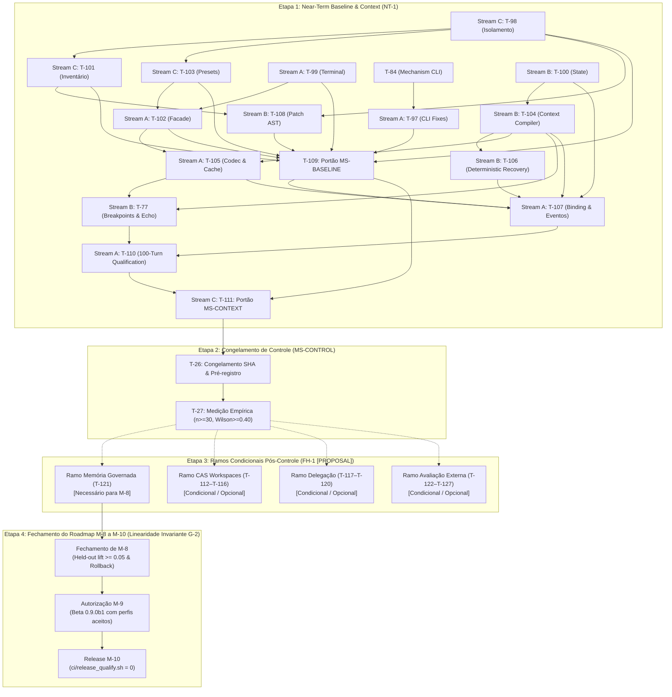

# Guia de Implementação e Planejamento Operacional

### Arquivos a Seguir e Tasks Prontas para Implementação

Para implementar o sistema de forma segura e padronizada, o desenvolvimento deve seguir rigorosamente a pista de execução composta pelos 5 arquivos canônicos em [`docs/execution/`](file:///home/rock-dev/Coding/cognitive-framework/docs/execution):

1. [tasks.md](file:///home/rock-dev/Coding/cognitive-framework/docs/execution/tasks.md): Quadro de controle operacional diário. Define o grafo plano de tarefas, streams exclusivas de escrita (A, B, C), arquivos de cada entrega e comandos falsificadores executáveis.
2. [spec.md](file:///home/rock-dev/Coding/cognitive-framework/docs/execution/spec.md): Especificação normativa e contratos tipados. Contém a emenda executiva NT-1 com schemas canônicos (ex: `aether.memory-view/1`, `aether.context-policy/2`, `aether.recovery-state/1`), matriz de erros e invariantes rígidos (ex: I-6 de isolamento, I-7 de domain blindness no kernel e N-06 de proibição de subprocess no runtime).
3. [technical.md](file:///home/rock-dev/Coding/cognitive-framework/docs/execution/technical.md): Manual prático de engenharia. Detalha o algoritmo de seleção e compactação de contexto em 7 passos, a máquina de estados de recuperação determinística e o mapeamento de classes existentes a serem adaptadas sem duplicação.
4. [milestones.md](file:///home/rock-dev/Coding/cognitive-framework/docs/execution/milestones.md): Portões de aceitação TARGET. Define os critérios para fechamento de `MS-BASELINE`, `MS-CONTEXT` e o congelamento empírico de `MS-CONTROL`.
5. [backlog.md](file:///home/rock-dev/Coding/cognitive-framework/docs/execution/backlog.md): Ciclo de vida dos pacotes de capacidade. Usado para rastrear o status de cada pacote (`APPROVED`, `IN_PROGRESS`, `DONE`, `BLOCKED`).

Atualmente, todas as tarefas do bloco Near-Term (NT-1: T-98 a T-111, incluindo T-77 e T-97) possuem detalhamento técnico completo, com arquivos-alvo definidos, contratos validados e testes falsificadores apontados. As tarefas no estado `READY` (`requires: []`) podem ser iniciadas em paralelo imediato por desenvolvedores sêniores.

---

### TODO List Operacional (Bloco Ativo NT-1 Completo)

O trabalho segue a divisão estrita em 3 streams sem concorrência de escrita no mesmo arquivo ([tasks.md](file:///home/rock-dev/Coding/cognitive-framework/docs/execution/tasks.md)):

- **Stream A**: Runtime, Produto & Superfície CLI
- **Stream B**: Estado Puro, Contexto, Algoritmos de Recuperação & Patch
- **Stream C**: Integridade de Testes, Configuração, Linters & Portões

| Task ID | Stream | Pacote | Dependências | Arquivos Afetados | Comando Falsificador (Unit/Contract Test) | Objetivo Técnico |
|---|---|---|---|---|---|---|
| **T-98** | **C** | `GATE-01` | `[]` (**READY**) | [`test/__init__.py`](file:///home/rock-dev/Coding/cognitive-framework/test/__init__.py)<br>[`test/conftest.py`](file:///home/rock-dev/Coding/cognitive-framework/test/conftest.py)<br>[`tools/linters/check_test_hygiene.py`](file:///home/rock-dev/Coding/cognitive-framework/tools/linters/check_test_hygiene.py)<br>[`test/contracts/test_suite_nonmutation.py`](file:///home/rock-dev/Coding/cognitive-framework/test/contracts/test_suite_nonmutation.py) | `python3 -m unittest test.contracts.test_suite_nonmutation test.tools.test_check_test_hygiene -v` | Garantir isolamento hermético da suíte, isolar metadados Git e redirecionar diretórios de teste graváveis sem mutação da árvore. |
| **T-99** | **A** | `INS-01` | `[]` (**READY**) | [`entrypoint.py`](file:///home/rock-dev/Coding/cognitive-framework/vanguard/packages/runtime/entrypoint.py)<br>[`app_service.py`](file:///home/rock-dev/Coding/cognitive-framework/vanguard/packages/runtime/app_service.py)<br>[`child_runtime.py`](file:///home/rock-dev/Coding/cognitive-framework/vanguard/packages/runtime/child_runtime.py) | `python3 -m unittest test.apps.coding_max.test_coding_max_facade test.falsifiers.test_rf90_generic_entrypoint test.falsifiers.test_completion_gate_scope -v` | Eliminar o colapso de `abstained` para `completed`. Manter eixos de status terminal e disposição estritamente desacoplados. |
| **T-100** | **B** | `CTX-01` | `[]` (**READY**) | [`task_state.py`](file:///home/rock-dev/Coding/cognitive-framework/vanguard/packages/domain/task_state.py)<br>[`protocol_recovery.py`](file:///home/rock-dev/Coding/cognitive-framework/vanguard/packages/agency/episode/protocol_recovery.py) | `python3 -m unittest test.contracts.test_semantic_task_state -v` | Implementar schemas imutáveis de memória de trabalho (`aether.memory-view/1`), com cursor, linhagem e validação canônica JCS. |
| **T-97** | **A** | `INS-01` | `[T-84]` | [`vanguard/clients/cli/src/composition/parse-cli.ts`](file:///home/rock-dev/Coding/cognitive-framework/vanguard/clients/cli/src/composition/parse-cli.ts)<br>[`vanguard/clients/cli/src/main.ts`](file:///home/rock-dev/Coding/cognitive-framework/vanguard/clients/cli/src/main.ts)<br>[`vanguard/clients/cli/test/commands.test.ts`](file:///home/rock-dev/Coding/cognitive-framework/vanguard/clients/cli/test/commands.test.ts) | `npm --workspace @vanguard/cli test && npm run typecheck` | Superfície CLI: reproduzir e reparar `aether code --help` para sair 0 sem invocar modelo/episódio; resolver colisão do flag `-m`. Pré-requisito para T-109. |
| **T-101** | **C** | `GATE-01` | `[T-98]` | [`test/lab/`](file:///home/rock-dev/Coding/cognitive-framework/test/lab/)<br>[`test/contracts/test_collection_integrity.py`](file:///home/rock-dev/Coding/cognitive-framework/test/contracts/test_collection_integrity.py) | `python3 -m unittest test.contracts.test_collection_integrity -v` | Fazer o inventário completo de coleta da suíte na árvore isolada e mapear falhas reais sem supressão. |
| **T-103** | **C** | `CMX-01` | `[T-98]` | [`packs/code-default/presets.json`](file:///home/rock-dev/Coding/cognitive-framework/packs/code-default/presets.json)<br>[`packs/code-default/load.py`](file:///home/rock-dev/Coding/cognitive-framework/packs/code-default/load.py) | `python3 -m unittest test.packs.code_default.test_presets test.benchmarks.test_instrument_ms test.benchmarks.test_preregistration -v` | Harmonizar presets (`fast`, `balanced`, `max`) garantindo que diferenças de orçamento sejam declaradas com fidelidade. |
| **T-102** | **A** | `INS-01` | `[T-99, T-103]` | [`facade.py`](file:///home/rock-dev/Coding/cognitive-framework/vanguard/packages/apps/coding_max/facade.py)<br>[`entrypoint.py`](file:///home/rock-dev/Coding/cognitive-framework/vanguard/packages/runtime/entrypoint.py)<br>[`cli.py`](file:///home/rock-dev/Coding/cognitive-framework/vanguard/packages/runtime/cli.py) | `python3 -m unittest test.runtime.test_app_service_and_cli test.apps.coding_max.test_facade test.apps.test_preset_budgets -v` | Consolidar a fachada do produto ([`CodingMaxFacade`](file:///home/rock-dev/Coding/cognitive-framework/vanguard/packages/apps/coding_max/facade.py)) sobre o `ApplicationService` sem criar loops ou tetos divergentes. |
| **T-104** | **B** | `CTX-01` | `[T-100]` | [`compiler.py`](file:///home/rock-dev/Coding/cognitive-framework/vanguard/packages/agency/context/compiler.py)<br>[`compaction.py`](file:///home/rock-dev/Coding/cognitive-framework/vanguard/packages/agency/context/compaction.py)<br>[`layers.py`](file:///home/rock-dev/Coding/cognitive-framework/vanguard/packages/agency/context/layers.py)<br>[`distiller.py`](file:///home/rock-dev/Coding/cognitive-framework/vanguard/packages/agency/context/distiller.py) | `python3 -m unittest test.agency.test_context_compiler test.agency.test_context_packet -v` | Integrar seleção de contexto com limites rígidos de orçamento (80% / 60%), preservando fatos canônicos e elidindo bodies em recibos. |
| **T-108** | **B** | `GATE-01` | `[T-98, T-101]` | [`packs/code-default/toolkits/ast_patch.py`](file:///home/rock-dev/Coding/cognitive-framework/packs/code-default/toolkits/ast_patch.py)<br>[`transaction.py`](file:///home/rock-dev/Coding/cognitive-framework/vanguard/packages/adapters/environment/transaction.py) | `python3 -m unittest test.falsifiers.test_d6_patch_context_anchoring test.packs.code_default.test_ast_patch test.runtime.test_atomic_multi_file_transaction -v` | Rejeitar pré-imagens ambíguas em patch AST; consolidar semântica de patch único e limpar implementações órfãs. |
| **T-106** | **B** | `REC-01` | `[T-100, T-104]` | [`protocol_recovery.py`](file:///home/rock-dev/Coding/cognitive-framework/vanguard/packages/agency/episode/protocol_recovery.py)<br>[`engine.py`](file:///home/rock-dev/Coding/cognitive-framework/vanguard/packages/agency/episode/engine.py) | `python3 -m unittest test.agency.test_protocol_recovery -v` | Integrar recuperação determinística: detecção de estagnação (ciclos de 2-3 ações repetidas), orçamentos finitos e ações `reground`/`replan`/`stop`. |
| **T-105** | **A** | `CTX-01` | `[T-102, T-104]` | [`adapters/models/`](file:///home/rock-dev/Coding/cognitive-framework/vanguard/packages/adapters/models/)<br>[`test/adapters/test_prompt_serialization_budget.py`](file:///home/rock-dev/Coding/cognitive-framework/test/adapters/test_prompt_serialization_budget.py) | `python3 -m unittest test.adapters.test_prompt_serialization_budget -v` | Implementar `PromptCodec` com contagem final exata da serialização do provedor e observação de cache nativa. |
| **T-77** | **B** | `CTX-01` | `[T-104, T-105]` | [`compiler.py`](file:///home/rock-dev/Coding/cognitive-framework/vanguard/packages/agency/context/compiler.py)<br>[`compaction.py`](file:///home/rock-dev/Coding/cognitive-framework/vanguard/packages/agency/context/compaction.py)<br>[`test/agency/test_cache_breakpoints.py`](file:///home/rock-dev/Coding/cognitive-framework/test/agency/test_cache_breakpoints.py) | `python3 -m unittest test.agency.test_cache_breakpoints -v` | Cache breakpoints, destilação CTRF e Trailing Goal Echo em L5; preservação de prefixo L1–L3 e estabilidade de ordem de schemas. |
| **T-107** | **A** | `CTX-01/REC-01` | `[T-100, T-104, T-105, T-106, T-109]` | [`session.py`](file:///home/rock-dev/Coding/cognitive-framework/vanguard/packages/runtime/session.py)<br>[`ledger_emitter.py`](file:///home/rock-dev/Coding/cognitive-framework/vanguard/packages/runtime/ledger_emitter.py)<br>[`task_state.py`](file:///home/rock-dev/Coding/cognitive-framework/vanguard/packages/runtime/task_state.py) | `python3 -m unittest test.runtime.test_task_state_fold test.runtime.test_resume_identity -v` | Conectar fatos canônicos de seleção e recuperação no envelope `mhf.event/2` via emissor único e persistência no ledger SQLite WAL. |
| **T-109** | **C** | `GATE-01` | `[T-98, T-99, T-101, T-102, T-103, T-108, T-97]` | Tooling e configurações de portão | `python3 -m unittest discover -s test -t .`<br>`just check && just verify`<br>`npm --workspace @vanguard/cli test && npm run typecheck` | Fechamento formal do marco **MS-BASELINE** com recibo empírico completo, suite isolada verde, TypeScript aprovado e sem mutação. |
| **T-110** | **A** | `CTX-01/REC-01` | `[T-107, T-77]` | [`test/runtime/test_long_session_context_recovery.py`](file:///home/rock-dev/Coding/cognitive-framework/test/runtime/test_long_session_context_recovery.py) | `python3 -m unittest test.runtime.test_long_session_context_recovery test.falsifiers.test_rf25_cold_continuation test.falsifiers.test_rf23_trajectory_content -v` | Qualificação de sessões longas (100+ turnos) sob compactação forçada e reinício de processo frio sem perda de intenção/recibos. |
| **T-111** | **C** | `GATE-01/EXP-01` | `[T-109, T-110]` | Arquivos de execução e pré-registro de controle | `python3 -m unittest test.benchmarks.test_preregistration test.falsifiers.test_rel02_frozen_canary -v` | Reconciliação dos portões **MS-BASELINE** e **MS-CONTEXT**, preparando a entrega para a verificação de **MS-CONTROL**. |

---

### Limite da Autonomia Técnica (Até Onde Desenvolver sem a Liderança)

Os desenvolvedores sêniores podem avançar com total independência técnica **até a conclusão de T-111 (fechamento dos marcos MS-BASELINE e MS-CONTEXT)**.

- **Tudo em NT-1 (T-98 até T-111) está especificado nos mínimos detalhes**: contratos de dados em [spec.md](file:///home/rock-dev/Coding/cognitive-framework/docs/execution/spec.md), algoritmos e classes no [technical.md](file:///home/rock-dev/Coding/cognitive-framework/docs/execution/technical.md), e comandos falsificadores em [tasks.md](file:///home/rock-dev/Coding/cognitive-framework/docs/execution/tasks.md).
- **Onde o desenvolvimento autônomo para**:
  1. **Congelamento de Controle (`MS-CONTROL` / T-26 / T-27)**: Exige a execução empírica congelada em lote ($n \ge 30$, Wilson lower bound $\ge 0.40$ sem falsas conclusões). Essa avaliação requer decisões sobre custos de inferência de modelos reais e aprovação formal do release-owner.
  2. **Horizonte Posterior ao Controle (FH-1: T-112 a T-128)**: Essas tarefas estão rotuladas expressamente como `[PROPOSAL]` nos documentos. Elas **não devem ser aprovadas em bloco**. Tratam-se de **ramos condicionais independentes** pós-`MS-CONTROL`. A liderança deve refinar e autorizar apenas os ramos pertinentes ao perfil de produto desejado.

---

### Cronograma Causal e Sequenciamento de Portões

No framework AETHER/Vanguard, não se utilizam sprints arbitrários por tempo calendário (*"No sprint calendar. No waves"*). O sequenciamento é estritamente regido pelas arestas de causalidade (`requires: [...]`) e pela espinha de portões em [milestones.md](file:///home/rock-dev/Coding/cognitive-framework/docs/execution/milestones.md):

```text
Spine central: MS-BASELINE -> MS-CONTEXT -> MS-CONTROL
Pós-controle: Ramos condicionais e desacoplados (CAS, Delegação, Memória, Avaliação)
Invariante G-2: Linha de release estrita M-8 -> M-9 -> M-10
```



---

### Instruções, Módulos e Arquivos para a Liderança Criar a Próxima Etapa (FH-1)

Para que a liderança possa transformar o horizonte conceitual em tarefas executáveis sem criar débito de governança ou aprovações indevidas em bloco, devem ser seguidas estas diretrizes:

#### 1. Diretriz de Não-Aprovação em Bloco (Ramos Condicionais)
- As propostas `T-112` a `T-128` **não devem ser aprovadas monoliticamente**.
- **M-8 depende exclusivamente de governança de memória**: Apenas o Ramo de Memória (`T-121` e fechamento de evidências pendentes de M-8 com lift $\ge 0.05$ e rollback comprovado) é mandatório para desbloquear M-8.
- **CAS, Delegação e Avaliação Externa são independentes**: CAS (`T-112–T-116`), Delegação/Campanhas (`T-117–T-120`) e Avaliação SWE-bench/Aider (`T-122–T-127`) só devem ser refinados e aprovados se o perfil de release exigir esses recursos específicos. Avaliar o controlador único não requer CAS nem campanhas.

#### 2. Arquivos de Governança que a Liderança Deve Atualizar

A liderança **não deve criar novos arquivos soltos de plano ou Markdown** (invariante anti-sprawl estrito do [AGENTS.md](file:///home/rock-dev/Coding/cognitive-framework/AGENTS.md)):

- **[`tasks.md`](file:///home/rock-dev/Coding/cognitive-framework/docs/execution/tasks.md)**:
  - Refinar o ramo selecionado (ex: `T-121` para M-8) de `[PROPOSAL]` para tarefas com status de prontas.
  - Atribuir para cada tarefa: a **Stream proprietária única** (A, B ou C), o **leque exclusivo de arquivos** (sem sobreposição de escrita simultânea) e o **comando falsificador** exato que verifica a conclusão.
- **[`spec.md`](file:///home/rock-dev/Coding/cognitive-framework/docs/execution/spec.md)**:
  - Promover os schemas aplicáveis do FH-1 para especificação ativa conforme o ramo ativado:
    - **Se Memória**: validar autorização por projeto, retenção e separação de oráculos.
    - **Se CAS**: ratificar `aether.tree/1`, `aether.edit-set/1`, `aether.check-plan/1`, `aether.candidate-check/1`, `aether.promotion/1`.
    - **Se Delegação**: ratificar `aether.specialist-request/1`, `aether.specialist-findings/1`, `aether.campaign-plan/1`.
    - **Se Avaliação**: ratificar `aether.evaluation-manifest/1`, `aether.evaluation-attempt/1`.
- **[`technical.md`](file:///home/rock-dev/Coding/cognitive-framework/docs/execution/technical.md)**:
  - Detalhar as receitas técnicas específicas do ramo ativado (ex: isolamento Bubblewrap, protocolo 2PC em adaptadores ou cálculo de lift em holdout).
- **[`backlog.md`](file:///home/rock-dev/Coding/cognitive-framework/docs/execution/backlog.md)** e **[`milestones.md`](file:///home/rock-dev/Coding/cognitive-framework/docs/execution/milestones.md)**:
  - Transicionar individualmente os pacotes selecionados (`MEM-QUAL`, `CAS-01`, `DEL-01`, `EVAL-02`) de `PROPOSED` para `APPROVED`.

#### 3. Módulos do Sistema a Serem Alocados

A liderança deve direcionar as implementações para os subsistemas adequados:

1. **Ramo de Memória Governada (T-121 - Fechamento M-8)**:
   - Governança de lições e prevenção de contaminação com retenção autorizada: [`vanguard/packages/runtime/`](file:///home/rock-dev/Coding/cognitive-framework/vanguard/packages/runtime/) e [`vanguard/packages/adapters/`](file:///home/rock-dev/Coding/cognitive-framework/vanguard/packages/adapters/).
2. **Ramo de CAS Workspace (T-112 a T-116 - Condicional)**:
   - **Contratos de valor imutáveis**: [`vanguard/packages/domain/`](file:///home/rock-dev/Coding/cognitive-framework/vanguard/packages/domain/) (zero I/O, apenas hashing canônico e árvores puras).
   - **Materialização e captura em disco**: [`vanguard/packages/adapters/environment/`](file:///home/rock-dev/Coding/cognitive-framework/vanguard/packages/adapters/environment/).
   - **Promoção atômica via ledger e checkout**: [`vanguard/packages/runtime/`](file:///home/rock-dev/Coding/cognitive-framework/vanguard/packages/runtime/).
3. **Ramo de Delegação e Especialistas (T-117 a T-120 - Condicional)**:
   - **Ciclo de vida de spawn e atenuação de escopo**: [`vanguard/packages/agency/episode/`](file:///home/rock-dev/Coding/cognitive-framework/vanguard/packages/agency/episode/) e [`vanguard/packages/runtime/child_runtime.py`](file:///home/rock-dev/Coding/cognitive-framework/vanguard/packages/runtime/child_runtime.py).
4. **Ramo de Benchmarking Oficial e Avaliação (T-122 a T-127 - Condicional)**:
   - **Isolamento de oráculos e runners externos (SWE-bench / Aider)**: [`benchmarks/`](file:///home/rock-dev/Coding/cognitive-framework/benchmarks/) e [`test/benchmarks/`](file:///home/rock-dev/Coding/cognitive-framework/test/benchmarks/).

#### 4. Invariantes Rígidos que a Liderança Deve Impor nas Instruções

- **TCB Budget Preservado**: Nenhuma linha nova no Kernel ([`tools/linters/check_tcb_budget.py`](file:///home/rock-dev/Coding/cognitive-framework/tools/linters/check_tcb_budget.py) deve permanecer $\le 1438$ LOC).
- **Sem Subprocessos no Runtime**: Regra N-06 proíbe terminantemente `import subprocess` no `runtime/`. Toda execução de processos é exclusiva de `adapters/` ou `tools/`.
- **Invariante G-2 (Autorização Linear)**: O marco M-9 não pode ser autorizado antes do fechamento empírico comprovado do marco M-8 (evidência de held-out lift $\ge 0.05$). M-10 só encerra com `./ci/release_qualify.sh` saindo com código 0 no artefato exato de release.


Based on the canonical execution runway in execution (milestones.md, backlog.md, and tasks.md), here is the comprehensive status from the current sprint up to the final post-control horizon and release      
  gates.                                                                                                                                                                                                         
  ──────                                                                                                                                                                                                         
  ### 1. Near-Term Convergence Sprints (Recent Delivery & Active Handoff)                                                                                                                                        
                                                                                                                                                                                                                 
   Milestone / Gate  │ Scope & Capability Packages                                                           │ % … │ % … │ Status & Remaining Work
  ───────────────────┼───────────────────────────────────────────────────────────────────────────────────────┼─────┼─────┼───────────────────────────────────────────────────────────────────────────────────────
   **milestones.md** │ GATE-01 (T-98, T-99, T-101, T-102, T-103, T-108, T-109, T-111)Nonmutating runner,     │ 100 │ 0%  │ CLOSED on candidate session.py / tasks.md. All 3,121 tests green, just verify PASS.
                     │ complete discovery collection, full check/verify, zero failures/errors.               │  %  │     │
   **milestones.md** │ CTX-01 / REC-01 (T-77, T-100, T-104, T-105, T-106, T-107, T-110)Working-state         │ 100 │ 0%  │ CLOSED on candidate session.py / tasks.md. T-110 9/9 green, public presets byte-
                     │ snapshots, cache breakpoints, bounded CTRF receipts, goal echo, and 104-turn          │  %  │     │ identical.
                     │ deterministic cold-restart qualification.                                             │     │     │
   **milestones.md** │ CONTROL / EXP-01 (T-26, T-27, T-51, T-52, T-89)Frozen control candidate, 30+ task     │ 25% │ 75% │ OPEN (Ready for Freeze). Unfrozen candidate is ready (control_preregistration.json
                     │ canary, Wilson lower bound ≥ 0.40, 0 observed false completions, zero paid calls      │     │     │ UNFROZEN). TODO: T-26 freeze hash, execute L0/L2 canary runs, calculate statistical
                     │ prior to freeze.                                                                      │     │     │ bounds.
   **milestones.md** │ CHANGE / TLS-04 (T-17, T-78, T-83a, T-83b)Atomic 2PC transactions, AST syntax         │ 70% │ 30% │ OPEN. Multi-file 2PC and preflight done. TODO: T-78 (str_replace_exact.py), T-83a
                     │ preflight, exact-match str_replace, reverse-caller admission check.                   │     │     │ (prompt cleanup), T-83b (caller admission gate).
   **milestones.md** │ IDX-01 / CMX-02 (T-14–T-16, T-36, T-37, T-45, T-75, T-76)Epoch-bound packets, LDA     │ 75% │ 25% │ OPEN. ContextPacket, no-index fallback, and cache breakpoints done. TODO: T-75/T-76
                     │ structural retrieval, bounded L5 observations, no-index fail-closed fallback.         │     │     │ task-ranked retrieval and live epoch refresh tuning.
  ──────                                                                                                                                                                                                         
  ### 2. Core Substrate & Historical Milestones (M-0 through M-5a)                                                                                                                                               
                                                                                                                                                                                                                 
   Milestone         │ Scope & Responsibilities                                                                                                               │ % Done │ % Todo │ Status
  ───────────────────┼────────────────────────────────────────────────────────────────────────────────────────────────────────────────────────────────────────┼────────┼────────┼────────────────────────────────
   **milestones.md** │ Substrate Foundation: S0–S12 Monotonic Dispatch Pipeline (SUB-01), Typed Budget Algebra, RFC 8785 JCS Canonicalization, Single Ledger  │  100%  │   0%   │ DONE (Frozen & Verified in CI)
                     │ Emitter (mhf.event/2).                                                                                                                 │        │        │
   **milestones.md** │ Single-Worker Coding Proof: Real-model coding loop with durable causal evidence (CLI-01, RF-95 bundle).                                │  100%  │   0%   │ DONE (Base Tagged)
   **milestones.md** │ Truthful Event Projection: Event-derived AgentView folding, terminal disposition reconciliation (CONVERGENCE-BASE-v1).                 │  100%  │   0%   │ DONE (Base Reconciled)
   **milestones.md** │ Benchmark harness measurement integrity, membership digests, tamper-proofing (test.benchmarks.test_instrument_ms).                     │  100%  │   0%   │ CLOSED (Subject-Bound)
   **milestones.md** │ Fresh-process continuation, σ not in L3, 40-turn fold parity (CMX-10B, RF-25 cold continuation).                                       │  100%  │   0%   │ CLOSED (16/16 tests green)
  ──────                                                                                                                                                                                                         
  ### 3. Mid-Term Architecture & Capability Milestones (M-5b through M-8)                                                                                                                                        
                                                                                                                                                                                                                 
   Milestone / Gate  │ Scope & Capability Packages                                                           │ % … │ % … │ Status & Remaining Work
  ───────────────────┼───────────────────────────────────────────────────────────────────────────────────────┼─────┼─────┼───────────────────────────────────────────────────────────────────────────────────────
   **milestones.md** │ Domain Generality Witness: Non-coding task execution (RF-86/RF-98) through the same   │ 75% │ 25% │ MECHANISM AS_BUILT. Core engine supports generic tasks; awaiting final cross-domain
                     │ public runtime.                                                                       │     │     │ empirical handoff.
   **milestones.md** │ Recursive Delegation: Depth-3 cold reconstruction, monotonic capability attenuation   │ 80% │ 20% │ MECHANISM AS_BUILT (59 tests green). Formal aggregate child accounting audit pending.
                     │ 𝒜(Bₚ, B_c), child spawning (DEL-01).                                                  │     │     │
   **milestones.md** │ Adaptive Strategy: Meta-controller adjusting search/recovery strategy without         │ 60% │ 40% │ MECHANISM AS_BUILT. Controller stays disabled pending preregistered paired-study
                     │ mutating history (MEM-03).                                                            │     │     │ disposition.
   **milestones.md** │ Declarative Topologies: Multi-agent topologies (debate, critic, swarm) through single │ 70% │ 30% │ MECHANISM AS_BUILT (40 tests green, 6 skips). Hardware-aware swarm scheduling (DEL-
                     │ runtime (DEL-02).                                                                     │     │     │ 03) remains proposed.
   **milestones.md** │ Governed Memory & Learning: Memory authorization, versioned lessons, held-out lift ≥  │ 25% │ 75% │ BLOCKED on empirical canary. Mechanisms in governance/learning.py present; empirical
                     │ 0.05, rollback receipts (MEM-01, MEM-02).                                             │     │     │ proof open.
  ──────                                                                                                                                                                                                         
  ### 4. Post-Control Horizon Capabilities (spec.md)                                                                                                                                                             
                                                                                                                                                                                                                 
  All packages below are dependent on MS-CONTROL closure; percentages reflect architectural/scaffold groundwork.                                                                                                 
                                                                                                                                                                                                                 
   Package / Gate           │ Scope & Planned Capability                                                      │ % Do… │ % To… │ Status & Remaining Work
  ──────────────────────────┼─────────────────────────────────────────────────────────────────────────────────┼───────┼───────┼──────────────────────────────────────────────────────────────────────────────────
   milestones.md / CAS-01   │ Content-Addressed Workspace, isolated verification, atomic ledger promotion,    │  10%  │  90%  │ PROPOSED. Basic blob store exists; tree contracts and fault-injection harness
                            │ journaled export, bounded GC (T-112–T-116).                                     │       │       │ unbuilt.
   milestones.md / DEL-01   │ Child lineage tracking, bounded read-only specialists, immutable parent         │  15%  │  85%  │ PROPOSED. M-6 mechanics exist; formal FH-1 child accounting unbuilt.
                            │ guarantees (T-117–T-118).                                                       │       │       │
   milestones.md / EXP-02   │ Preregistered paired ablations for specialized roles (Reviewer, Localizer,      │  10%  │  90%  │ PROPOSED. Awaiting control freeze to execute single-variable comparative trials.
                            │ Fuzzing) (T-119).                                                               │       │       │
   milestones.md / OCT-03   │ Outer-loop roadmap director above EpisodeEngine, content-addressed mailboxes,   │  15%  │  85%  │ PROPOSED. Blocked on MS-CONTROL to avoid multiplying unverified inner episodes.
                            │ DAG coordination (T-120).                                                       │       │       │
   milestones.md / MEM-QUAL │ Project-scoped lessons, leakage falsifiers, held-out evaluation without         │  15%  │  85%  │ PROPOSED. Blocked on M-8 empirical acceptance.
                            │ contamination (T-121).                                                          │       │       │
   milestones.md / EVAL-02  │ Pinned Verified and Aider protocol adapters, distinct greenfield corpus (T-     │  20%  │  80%  │ PROPOSED. External evaluator daemon exists (UID 10002); protocol pinning
                            │ 122–T-125).                                                                     │       │       │ pending.
  ──────                                                                                                                                                                                                         
  ### 5. Final Release & Competitive Horizons (M-9, M-10, MS-OFFICIAL, MS-SOTA)                                                                                                                                  
                                                                                                                                                                                                                 
   Milestone / Gate  │ Scope & Target Outcome                                                                               │ %… │ % T… │ Status & Remaining Work
  ───────────────────┼──────────────────────────────────────────────────────────────────────────────────────────────────────┼────┼──────┼────────────────────────────────────────────────────────────────────────
   **milestones.md** │ Official SWE-bench / DeepSWE execution with isolated container bridge (REL-03, T-126).               │ 10 │ 90%  │ PROPOSED. Container bridge schema approved; official benchmark
                     │                                                                                                      │ %  │      │ execution unbuilt.
   **milestones.md** │ Validated competitive or frontier parity (pass@1 CI overlapping comparator band) (T-127).            │ 0% │ 100% │ PROPOSED. Requires official execution; no live benchmark scores
                     │                                                                                                      │    │      │ claimed.
   **milestones.md** │ Installable Beta (0.9.0b1): Persistent Bubblewrap PTY (SUB-04), unified CLI/TUI packaging, offline-  │ 0% │ 100% │ UNAUTHORIZED (Strictly blocked on M-8 acceptance per Invariant G-2).
                     │ after-install.                                                                                       │    │      │
   **milestones.md** │ Production Release (0.9.0): Backup/restore, security qualification, ./ci/release_qualify.sh exit 0,  │ 0% │ 100% │ UNAUTHORIZED (Strictly blocked on M-9 acceptance).
                     │ signed Ed25519 envelope.                                                                             │    │      │
  ──────                                                                                                                                                                                                         
  ### Summary Overview of Global Progress                                                                                                                                                                        
                                                                                                                                                                                                                 
    [ Core Trust & Composition (M-0 to M-5a) ]   ==================== 100% (COMPLETE)                                                                                                                            
    [ Near-Term Baseline & Context (NT-1)    ]   ==================== 100% (QUALIFIED & GREEN)                                                                                                                   
    [ Control Canary & Freeze (MS-CONTROL)   ]   =====...............  25% (READY FOR FREEZE)                                                                                                                    
    [ Substrate & AST Closure (MS-CHANGE)    ]   ==============......  70% (IN PROGRESS)                                                                                                                         
    [ Recursive Delegation & Topologies (M-6)]   ================....  75% (MECHANISM BUILT)                                                                                                                     
    [ Governed Memory MVP (M-8)              ]   =====...............  25% (BLOCKED ON CANARY)                                                                                                                   
    [ Post-Control Horizons (CAS/Campaign)   ]   ===.................  15% (PROPOSED / FH-1)                                                                                                                     
    [ Official Benchmarks & Beta Release     ]   ....................   0% (UNAUTHORIZED / POST-M-8)     


# ORDER

Principal Engineering Assessment & Execution Runway Plan                                                                                                                                                      
                                                                                                                                                                                                                 
  Role: Dev C (Principal Integration, Test-Integrity, Configuration, and Acceptance Engineer)                                                                                                                    
  Current HEAD: cognitive-framework on feat/aether-framework-electroweak-canonical-agents                                                                                                                        
  Accepted Integrated Subject: 2989d57d4d38c01eecdb7a5fbb6f125077f00e59                                                                                                                                          
  Active Milestone Focus: milestones.md:143                                                                                                                                                                      
  ──────                                                                                                                                                                                                         
  ## 1. Where We Stand: Current State of the Runway                                                                                                                                                              
                                                                                                                                                                                                                 
  The multi-day autonomous context convergence batch (Phases C0–C4) is fully completed, qualified, and accepted by Leadership:                                                                                   
                                                                                                                                                                                                                 
  • Completed & Closed Milestones:                                                                                                                                                                               
      • milestones.md:138: CLOSED (tasks.md:95, tasks.md:103, tasks.md:111, tasks.md:119, tasks.md:135, tasks.md:127, tasks.md:143, tasks.md:151). Full discovery ran 3,121 tests (3,079 passed, 42 skipped, 0   
      failures, 0 errors).                                                                                                                                                                                       
      • milestones.md:83: CLOSED (tasks.md:192, tasks.md:200, tasks.md:208, tasks.md:216, tasks.md:53, tasks.md:224, tasks.md:240, tasks.md:255). Deterministic 104-turn fresh-process recovery passed across 4  
      interpreters with zero duplicate settled effects.                                                                                                                                                          
  • Architectural Invariants & Budgets:                                                                                                                                                                          
      • TCB Budget: 1,386 logical LOC in kernel (≤ 1438 threshold, 52 lines headroom).                                                                                                                           
      • Invariant N-06: Exactly 0 subprocess imports in runtime.                                                                                                                                                 
      • Public Presets: presets.json remains byte-identical.                                                                                                                                                     
      • Control Preregistration: control_preregistration.json is UNFROZEN (subject_sha: null) with zero paid calls made.                                                                                         
                                                                                                                                                                                                                 
                                                                                                                                                                                                                 
┌──────────────────────────────────────────────────────────────────────────────────────────────────┬───────────────────────────────────────────────────────────────────────────────┐
│                      Phase C0–C4: Context Convergence (ACCEPTED & CLOSCurrent Execution Focus: MS-CONTROL                                                                        │
│                                                                                                  │                                                                               │
│                                                                                                  │                                                                               │
│ ┌─────────────────────────────────────────────────────┐   ┌────────────────────────────────────┐ │ ┌────────────┐   ┌──────────────┐   ┌───────────────────────────────────────┐ │
│ │                                                     │   │                                    │ │ │            │   │              │   │                                       │ │
│ │                                                     │   │                                    │ │ │            │   │              │ │ │ CAS["Track 1: MS-CAS │               │
│ │        MS-BASELINE (GATE-01, INS-01, CMX-01)        │   │ MS-CONTEXT (CTX-01, REC-01, T-110) │ │ │ PRE["Audit │   │ 35/35 Green] │ │ │                      │               │
            MB --> T111                                                                                                                                                                                          
            MC --> T111                                                                                                                                                                                          
        end                                                                                                                                                                                                      
                                                                                                                                                                                                                 
        subgraph ACTIVE_GATE["Current Execution Focus: MS-CONTROL"]                                                                                                                                              
            PRE["Audit & Verify Mechanics\n(T-79, T-89, T-92–T-95, T-51/52)\n[35/35 Green]"]                                                                                                                     
            T26["T-26: Frozen Control Preregistration\n(subject_sha, suite_digest, model_id)\n[READY - Zero Paid Calls]"]                                                                                        
            T27["T-27: Single-Agent Canary Eval\n(n >= 30, Wilson LB >= 0.40, FC == 0)"]                                                                                                                         
            T111 --> PRE                                                                                                                                                                                         
            PRE --> T26                                                                                                                                                                                          
            T26 --> T27                                                                                                                                                                                          
        end                                                                                                                                                                                                      
                                                                                                                                                                                                                 
        subgraph POST_CONTROL["Post-Control Horizon (FH-1 Proposals - Gated on T-27)"]                                                                                                                           
            CAS["Track 1: MS-CAS\n(T-112 -> T-116)"]                                                                                                                                                             
            DEL["Track 2: MS-DELEGATION\n(T-117 -> T-118)"]                                                                                                                                                      
            SPEC["Track 3: MS-SPECIALIST / MS-META\n(T-119, T-28–T-30)"]                                                                                                                                         
            CMP["Track 4: MS-CAMPAIGN\n(T-120, T-31, T-54)"]                                                                                                                                                     
            MEM["Track 5: MS-MEMORY\n(T-121, T-32, M-8)"]                                                                                                                                                        
            EVAL["Track 6: MS-EVAL & MS-OFFICIAL\n(T-122–T-127)"]                                                                                                                                                
            REL["Track 7: Release Qualification\n(T-128 -> M-9 -> M-10)"]                                                                                                                                        
        end                                                                                                                                                                                                      
                                                                                                                                                                                                                 
        T27 -.->|Positive Gate Disposition| CAS                                                                                                                                                                  
        T27 -.->|Positive Gate Disposition| DEL                                                                                                                                                                  
        T27 -.->|Positive Gate Disposition| SPEC                                                                                                                                                                 
        T27 -.->|Positive Gate Disposition| MEM                                                                                                                                                                  
        T27 -.->|Positive Gate Disposition| EVAL                                                                                                                                                                 
        CAS & DEL -.-> CMP                                                                                                                                                                                       
        EVAL -.-> REL                                                                                                                                                                                            
  ──────                                                                                                                                                                                                         
  ## 2. What Is Planned in the Execution Runway: Exact Execution Order                                                                                                                                           
                                                                                                                                                                                                                 
  The dependency spine in milestones.md:99 and tasks.md:57 enforces a strict 4-phase sequence. No tasks may leapfrog their predecessors.                                                                         
                                                                                                                                                                                                                 
    MS-BASELINE (CLOSED) ──► MS-CONTEXT (CLOSED) ──► MS-CONTROL (NEXT) ──► FH-1 Post-Control Branches                                                                                                            
  ──────                                                                                                                                                                                                         
  ### Step 1: Control Prerequisite Audit & Mechanistic Closure (Immediate)                                                                                                                                       
                                                                                                                                                                                                                 
  Before T-26 freezes the subject SHA, all control runner contracts, metric vetoes, and evidence schemas must be verified on the exact candidate:                                                                
                                                                                                                                                                                                                 
   Task         │ Package    │ Scope & Owner                                                                                        │ Falsifier Command                                           │ Current Sta…
  ──────────────┼────────────┼──────────────────────────────────────────────────────────────────────────────────────────────────────┼─────────────────────────────────────────────────────────────┼──────────────
   tasks.md:828 │ CMX-01     │ Sole budget catalog on presets.json; facade max_turns default is None; declared ceilings (50k/8t,    │ python3 -m unittest test.apps.test_preset_budgets -v        │ 12/12 PASS
                │            │ 150k/20t, 400k/40t).                                                                                 │                                                             │
   tasks.md:930 │ INS-01 /   │ Canary routes through public product_path.py:27 → entrypoint.py:60 (never direct                     │ python3 -m unittest                                         │ 4/4 PASS
                │ EXP-01     │ Runtime.execute_profiled). Matches CLI manifest & preset identity.                                   │ test.benchmarks.test_product_path_subject -v                │
   tasks.md:958 │ EXP-01     │ L0 smoke triad (P0-FIB, P0-CSV, P0-BUG) through public CLI; typed terminals or failures; patchless   │ python3 -m unittest test.benchmarks.test_l0_triad -v        │ 4/4 PASS
                │            │ completion rejected.                                                                                 │                                                             │
   tasks.md:968 │ EXP-01     │ L1 12-task freeze (suite.json); evidence row schema; reject mixed REPLAY and LIVE tables.            │ python3 -m unittest                                         │ 5/5 PASS
                │            │                                                                                                      │ test.benchmarks.test_evidence_row_schema -v                 │
   tasks.md:978 │ EXP-01     │ §EW-9.4 metrics; false-completion hard veto (fc > 0 fails gate); Wilson score calculated solely on   │ python3 -m unittest test.benchmarks.test_metric_veto -v     │ 4/4 PASS
                │            │ LIVE-* rows.                                                                                         │                                                             │
   tasks.md:988 │ EXP-01     │ Preregistered hypothesis registry (hypotheses.json); enforce single-varied dimension constraint      │ python3 -m unittest test.benchmarks.test_preregistration -v │ 6/6 PASS
                │            │ (assert_single_varied_dimension).                                                                    │                                                             │
   T-51 / T-52  │ EXP-01     │ Internal multi-class corpus freeze & Wilson interval + cost κ calculation on control.                │ Included in ladder metrics & protocol suite.                │ PASS
                                                                                                                                                                                                                 
  All 35/35 tests in this prerequisite slice are already passing.                                                                                                                                                
  ──────                                                                                                                                                                                                         
  ### Step 2: Control Preregistration Freeze (tasks.md:605)                                                                                                                                                      
                                                                                                                                                                                                                 
  Owner: Stream C & Leadership                                                                                                                                                                                   
  Prerequisites: T-111, T-97, T-92, T-51, T-52 accepted; working tree 100% clean.                                                                                                                                
                                                                                                                                                                                                                 
  1. Commit any remaining documentation cleanups (e.g. backlog.md).                                                                                                                                              
  2. Inspect the clean candidate commit SHA (subject_sha).                                                                                                                                                       
  3. Update control_preregistration.json:                                                                                                                                                                        
      • Set "status": "FROZEN"                                                                                                                                                                                   
      • Set "subject_sha": "<exact-40-char-sha>"                                                                                                                                                                 
      • Set "suite_digest": "<sha256-of-l1-suite>"                                                                                                                                                               
      • Set "model_id": "<target-eval-model>"                                                                                                                                                                    
      • Set "frozen_at": "<ISO-8601-timestamp>"                                                                                                                                                                  
  4. Verify with control.py:34.                                                                                                                                                                                  
  5. Constitutional Invariant: Zero paid provider calls are permitted during the T-26 freeze task.                                                                                                               
  ──────                                                                                                                                                                                                         
  ### Step 3: Single-Agent Canary Evaluation & Gate Disposition (tasks.md:611)                                                                                                                                   
                                                                                                                                                                                                                 
  Owner: Stream B / Evaluation                                                                                                                                                                                   
  Prerequisites: T-26 FROZEN.                                                                                                                                                                                    
                                                                                                                                                                                                                 
  1. Execute the 30+ task live evaluation on the frozen control subject through the public product path (product_path.py:27):                                                                                    
      • Single-worker (workers: 1)                                                                                                                                                                               
      • Preset vg-code-balanced (preset: balanced)                                                                                                                                                               
      • Profile product                                                                                                                                                                                          
  2. Evaluate metrics using metrics.py:66:
      • Sample size: n_{evaluable} ≥ 30 LIVE-* rows.
      • Confidence: Wilson 95% lower bound ≥ 0.40.
      • Hard Veto: False-completion rate == 0.0.
  3. Publish disposition in closed vocabulary: {POSITIVE, NEGATIVE, UNDETERMINABLE, INVALID}.
  4. Gate Effect:
      • POSITIVE ⟶ Leadership review formally closes MS-CONTROL.
      • NEGATIVE or UNDETERMINABLE ⟶ Valid published result, MS-CONTROL remains OPEN.
  
  ──────
  ### Step 4: Post-Control Horizon (FH-1 Proposals)
  
  Strict Boundary: Tasks below are post-control proposals and remain provisional & blocked until MS-CONTROL is formally accepted:
  
   Horizon Track                │ Tasks                               │ Gate Predicate                  │ Focus
  ──────────────────────────────┼─────────────────────────────────────┼─────────────────────────────────┼────────────────────────────────────────────────────────────────────────────────────────────────────────
   Track 1: CAS Architecture    │ tasks.md:281 → tasks.md:309         │ MS-CAS                          │ Tree & edit-set value contracts (spec.md:161, spec.md:162), durable snapshot adapter, atomic
				│                                     │                                 │ promotion, rollback.
   Track 2: Delegation          │ tasks.md:316 → tasks.md:323         │ MS-DELEGATION                   │ Specialist wire contracts, spawn lifecycle, monotonic budget conservation.
   Track 3: Specialists / Meta  │ tasks.md:330, T-28–T-30, T-53, T-80 │ MS-SPECIALIST / MS-META         │ Preregistered paired studies against frozen control; treatment T-TI ablation; anti-thrashing circuit
				│                                     │                                 │ breaker (tasks.md:838).
   Track 4: Campaigns           │ tasks.md:337, T-31, T-54, T-34      │ MS-CAMPAIGN                     │ Durable campaign director, CAS mailbox, DAG execution without duplicate writes (requires MS-CAS + MS-
				│                                     │                                 │ DELEGATION).
   Track 5: Memory & Learning   │ tasks.md:344, T-32, T-56–T-57       │ MS-MEMORY / M-8                 │ Governed memory, project authorization/revocation, held-out lift ≥ 0.05, rollback receipts.
   Track 6: Official Evaluation │ T-122–T-127                         │ MS-EVAL / MS-OFFICIAL / MS-SOTA │ Pinned evaluation harnesses, SWE-P5 protocol, official reference replays.
   Track 7: Release             │ T-128                               │ M-9 → M-10                      │ Final qualification, offline-after-install, signed release envelope (strictly blocked on M-8).
  ──────
  ## 3. Immediate Action Plan (What We Should Do Right Now)
  
  As Dev C, the concrete, sequential work items for our current turn are:
  
  1. Reconcile Pending Working Tree Diff:
      • Land the one-line lifecycle alignment in backlog.md (marking GATE-01, CTX-01, REC-01 ACCEPTED on 2989d57d, exactly matching tasks.md:52-56).
  2. Formal Audit Check of Control Prerequisites:
      • Formally check off tasks.md:828 and tasks.md:930 in tasks.md now that their full test falsifiers pass (12/12 and 4/4) and their former boundary/terminal blockers were resolved by T-99 and T-102.       
  3. Execute T-26 (Freeze Control Preregistration):
      • Identify the clean candidate SHA and model target.
      • Populate and freeze control_preregistration.json.
      • Re-run test.benchmarks.test_preregistration and test.benchmarks.test_metric_veto to prove control.py:34 admits the candidate.
  4. Handoff for T-27 Canary Evaluation:
      • Provide the authorized, frozen subject to the evaluation runner for live canary execution.


# Lanes Seniority 

Principal Engineering Assessment & Execution Runway Plan                                                                                                                                                      
                                                                                                                                                                                                                 
  Role: Dev C (Principal Integration, Test-Integrity, Configuration, and Acceptance Engineer)                                                                                                                    
  Current HEAD: cognitive-framework on feat/aether-framework-electroweak-canonical-agents                                                                                                                        
  Accepted Integrated Subject: 2989d57d4d38c01eecdb7a5fbb6f125077f00e59                                                                                                                                          
  Active Milestone Focus: milestones.md:143                                                                                                                                                                      
  ──────                                                                                                                                                                                                         
  ## 1. Where We Stand: Current State of the Runway                                                                                                                                                              
                                                                                                                                                                                                                 
  The multi-day autonomous context convergence batch (Phases C0–C4) is fully completed, qualified, and accepted by Leadership:                                                                                   
                                                                                                                                                                                                                 
  • Completed & Closed Milestones:                                                                                                                                                                               
      • milestones.md:138: CLOSED (tasks.md:95, tasks.md:103, tasks.md:111, tasks.md:119, tasks.md:135, tasks.md:127, tasks.md:143, tasks.md:151). Full discovery ran 3,121 tests (3,079 passed, 42 skipped, 0   
      failures, 0 errors).                                                                                                                                                                                       
      • milestones.md:83: CLOSED (tasks.md:192, tasks.md:200, tasks.md:208, tasks.md:216, tasks.md:53, tasks.md:224, tasks.md:240, tasks.md:255). Deterministic 104-turn fresh-process recovery passed across 4  
      interpreters with zero duplicate settled effects.                                                                                                                                                          
  • Architectural Invariants & Budgets:                                                                                                                                                                          
      • TCB Budget: 1,386 logical LOC in kernel (≤ 1438 threshold, 52 lines headroom).                                                                                                                           
      • Invariant N-06: Exactly 0 subprocess imports in runtime.                                                                                                                                                 
      • Public Presets: presets.json remains byte-identical.                                                                                                                                                     
      • Control Preregistration: control_preregistration.json is UNFROZEN (subject_sha: null) with zero paid calls made.                                                                                         
                                                                                                                                                                                                                 
                                                                                                                                                                                                                 
┌──────────────────────────────────────────────────────────────────────────────────────────────────┬───────────────────────────────────────────────────────────────────────────────┐
│                      Phase C0–C4: Context Convergence (ACCEPTED & CLOSCurrent Execution Focus: MS-CONTROL                                                                        │
│                                                                                                  │                                                                               │
│                                                                                                  │                                                                               │
│ ┌─────────────────────────────────────────────────────┐   ┌────────────────────────────────────┐ │ ┌────────────┐   ┌──────────────┐   ┌───────────────────────────────────────┐ │
│ │                                                     │   │                                    │ │ │            │   │              │   │                                       │ │
│ │                                                     │   │                                    │ │ │            │   │              │ │ │ CAS["Track 1: MS-CAS │               │
│ │        MS-BASELINE (GATE-01, INS-01, CMX-01)        │   │ MS-CONTEXT (CTX-01, REC-01, T-110) │ │ │ PRE["Audit │   │ 35/35 Green] │ │ │                      │               │
            MB --> T111                                                                                                                                                                                          
            MC --> T111                                                                                                                                                                                          
        end                                                                                                                                                                                                      
                                                                                                                                                                                                                 
        subgraph ACTIVE_GATE["Current Execution Focus: MS-CONTROL"]                                                                                                                                              
            PRE["Audit & Verify Mechanics\n(T-79, T-89, T-92–T-95, T-51/52)\n[35/35 Green]"]                                                                                                                     
            T26["T-26: Frozen Control Preregistration\n(subject_sha, suite_digest, model_id)\n[READY - Zero Paid Calls]"]                                                                                        
            T27["T-27: Single-Agent Canary Eval\n(n >= 30, Wilson LB >= 0.40, FC == 0)"]                                                                                                                         
            T111 --> PRE                                                                                                                                                                                         
            PRE --> T26                                                                                                                                                                                          
            T26 --> T27                                                                                                                                                                                          
        end                                                                                                                                                                                                      
                                                                                                                                                                                                                 
        subgraph POST_CONTROL["Post-Control Horizon (FH-1 Proposals - Gated on T-27)"]                                                                                                                           
            CAS["Track 1: MS-CAS\n(T-112 -> T-116)"]                                                                                                                                                             
            DEL["Track 2: MS-DELEGATION\n(T-117 -> T-118)"]                                                                                                                                                      
            SPEC["Track 3: MS-SPECIALIST / MS-META\n(T-119, T-28–T-30)"]                                                                                                                                         
            CMP["Track 4: MS-CAMPAIGN\n(T-120, T-31, T-54)"]                                                                                                                                                     
            MEM["Track 5: MS-MEMORY\n(T-121, T-32, M-8)"]                                                                                                                                                        
            EVAL["Track 6: MS-EVAL & MS-OFFICIAL\n(T-122–T-127)"]                                                                                                                                                
            REL["Track 7: Release Qualification\n(T-128 -> M-9 -> M-10)"]                                                                                                                                        
        end                                                                                                                                                                                                      
                                                                                                                                                                                                                 
        T27 -.->|Positive Gate Disposition| CAS                                                                                                                                                                  
        T27 -.->|Positive Gate Disposition| DEL                                                                                                                                                                  
        T27 -.->|Positive Gate Disposition| SPEC                                                                                                                                                                 
        T27 -.->|Positive Gate Disposition| MEM                                                                                                                                                                  
        T27 -.->|Positive Gate Disposition| EVAL                                                                                                                                                                 
        CAS & DEL -.-> CMP                                                                                                                                                                                       
        EVAL -.-> REL                                                                                                                                                                                            
  ──────                                                                                                                                                                                                         
  ## 2. What Is Planned in the Execution Runway: Exact Execution Order                                                                                                                                           
                                                                                                                                                                                                                 
  The dependency spine in milestones.md:99 and tasks.md:57 enforces a strict 4-phase sequence. No tasks may leapfrog their predecessors.                                                                         
                                                                                                                                                                                                                 
    MS-BASELINE (CLOSED) ──► MS-CONTEXT (CLOSED) ──► MS-CONTROL (NEXT) ──► FH-1 Post-Control Branches                                                                                                            
  ──────                                                                                                                                                                                                         
  ### Step 1: Control Prerequisite Audit & Mechanistic Closure (Immediate)                                                                                                                                       
                                                                                                                                                                                                                 
  Before T-26 freezes the subject SHA, all control runner contracts, metric vetoes, and evidence schemas must be verified on the exact candidate:                                                                
                                                                                                                                                                                                                 
   Task         │ Package    │ Scope & Owner                                                                                        │ Falsifier Command                                           │ Current Sta…
  ──────────────┼────────────┼──────────────────────────────────────────────────────────────────────────────────────────────────────┼─────────────────────────────────────────────────────────────┼──────────────
   tasks.md:828 │ CMX-01     │ Sole budget catalog on presets.json; facade max_turns default is None; declared ceilings (50k/8t,    │ python3 -m unittest test.apps.test_preset_budgets -v        │ 12/12 PASS
                │            │ 150k/20t, 400k/40t).                                                                                 │                                                             │
   tasks.md:930 │ INS-01 /   │ Canary routes through public product_path.py:27 → entrypoint.py:60 (never direct                     │ python3 -m unittest                                         │ 4/4 PASS
                │ EXP-01     │ Runtime.execute_profiled). Matches CLI manifest & preset identity.                                   │ test.benchmarks.test_product_path_subject -v                │
   tasks.md:958 │ EXP-01     │ L0 smoke triad (P0-FIB, P0-CSV, P0-BUG) through public CLI; typed terminals or failures; patchless   │ python3 -m unittest test.benchmarks.test_l0_triad -v        │ 4/4 PASS
                │            │ completion rejected.                                                                                 │                                                             │
   tasks.md:968 │ EXP-01     │ L1 12-task freeze (suite.json); evidence row schema; reject mixed REPLAY and LIVE tables.            │ python3 -m unittest                                         │ 5/5 PASS
                │            │                                                                                                      │ test.benchmarks.test_evidence_row_schema -v                 │
   tasks.md:978 │ EXP-01     │ §EW-9.4 metrics; false-completion hard veto (fc > 0 fails gate); Wilson score calculated solely on   │ python3 -m unittest test.benchmarks.test_metric_veto -v     │ 4/4 PASS
                │            │ LIVE-* rows.                                                                                         │                                                             │
   tasks.md:988 │ EXP-01     │ Preregistered hypothesis registry (hypotheses.json); enforce single-varied dimension constraint      │ python3 -m unittest test.benchmarks.test_preregistration -v │ 6/6 PASS
                │            │ (assert_single_varied_dimension).                                                                    │                                                             │
   T-51 / T-52  │ EXP-01     │ Internal multi-class corpus freeze & Wilson interval + cost κ calculation on control.                │ Included in ladder metrics & protocol suite.                │ PASS
                                                                                                                                                                                                                 
  All 35/35 tests in this prerequisite slice are already passing.                                                                                                                                                
  ──────                                                                                                                                                                                                         
  ### Step 2: Control Preregistration Freeze (tasks.md:605)                                                                                                                                                      
                                                                                                                                                                                                                 
  Owner: Stream C & Leadership                                                                                                                                                                                   
  Prerequisites: T-111, T-97, T-92, T-51, T-52 accepted; working tree 100% clean.                                                                                                                                
                                                                                                                                                                                                                 
  1. Commit any remaining documentation cleanups (e.g. backlog.md).                                                                                                                                              
  2. Inspect the clean candidate commit SHA (subject_sha).                                                                                                                                                       
  3. Update control_preregistration.json:                                                                                                                                                                        
      • Set "status": "FROZEN"                                                                                                                                                                                   
      • Set "subject_sha": "<exact-40-char-sha>"                                                                                                                                                                 
      • Set "suite_digest": "<sha256-of-l1-suite>"                                                                                                                                                               
      • Set "model_id": "<target-eval-model>"                                                                                                                                                                    
      • Set "frozen_at": "<ISO-8601-timestamp>"                                                                                                                                                                  
  4. Verify with control.py:34.                                                                                                                                                                                  
  5. Constitutional Invariant: Zero paid provider calls are permitted during the T-26 freeze task.                                                                                                               
  ──────                                                                                                                                                                                                         
  ### Step 3: Single-Agent Canary Evaluation & Gate Disposition (tasks.md:611)                                                                                                                                   
                                                                                                                                                                                                                 
  Owner: Stream B / Evaluation                                                                                                                                                                                   
  Prerequisites: T-26 FROZEN.                                                                                                                                                                                    
                                                                                                                                                                                                                 
  1. Execute the 30+ task live evaluation on the frozen control subject through the public product path (product_path.py:27):                                                                                    
      • Single-worker (workers: 1)                                                                                                                                                                               
      • Preset vg-code-balanced (preset: balanced)                                                                                                                                                               
      • Profile product                                                                                                                                                                                          
  2. Evaluate metrics using metrics.py:66:
      • Sample size: n_{evaluable} ≥ 30 LIVE-* rows.
      • Confidence: Wilson 95% lower bound ≥ 0.40.
      • Hard Veto: False-completion rate == 0.0.
  3. Publish disposition in closed vocabulary: {POSITIVE, NEGATIVE, UNDETERMINABLE, INVALID}.
  4. Gate Effect:
      • POSITIVE ⟶ Leadership review formally closes MS-CONTROL.
      • NEGATIVE or UNDETERMINABLE ⟶ Valid published result, MS-CONTROL remains OPEN.
  
  ──────
  ### Step 4: Post-Control Horizon (FH-1 Proposals)
  
  Strict Boundary: Tasks below are post-control proposals and remain provisional & blocked until MS-CONTROL is formally accepted:
  
   Horizon Track                │ Tasks                               │ Gate Predicate                  │ Focus
  ──────────────────────────────┼─────────────────────────────────────┼─────────────────────────────────┼────────────────────────────────────────────────────────────────────────────────────────────────────────
   Track 1: CAS Architecture    │ tasks.md:281 → tasks.md:309         │ MS-CAS                          │ Tree & edit-set value contracts (spec.md:161, spec.md:162), durable snapshot adapter, atomic
				│                                     │                                 │ promotion, rollback.
   Track 2: Delegation          │ tasks.md:316 → tasks.md:323         │ MS-DELEGATION                   │ Specialist wire contracts, spawn lifecycle, monotonic budget conservation.
   Track 3: Specialists / Meta  │ tasks.md:330, T-28–T-30, T-53, T-80 │ MS-SPECIALIST / MS-META         │ Preregistered paired studies against frozen control; treatment T-TI ablation; anti-thrashing circuit
				│                                     │                                 │ breaker (tasks.md:838).
   Track 4: Campaigns           │ tasks.md:337, T-31, T-54, T-34      │ MS-CAMPAIGN                     │ Durable campaign director, CAS mailbox, DAG execution without duplicate writes (requires MS-CAS + MS-
				│                                     │                                 │ DELEGATION).
   Track 5: Memory & Learning   │ tasks.md:344, T-32, T-56–T-57       │ MS-MEMORY / M-8                 │ Governed memory, project authorization/revocation, held-out lift ≥ 0.05, rollback receipts.
   Track 6: Official Evaluation │ T-122–T-127                         │ MS-EVAL / MS-OFFICIAL / MS-SOTA │ Pinned evaluation harnesses, SWE-P5 protocol, official reference replays.
   Track 7: Release             │ T-128                               │ M-9 → M-10                      │ Final qualification, offline-after-install, signed release envelope (strictly blocked on M-8).
  ──────
  ## 3. Immediate Action Plan (What We Should Do Right Now)
  
  As Dev C, the concrete, sequential work items for our current turn are:
  
  1. Reconcile Pending Working Tree Diff:
      • Land the one-line lifecycle alignment in backlog.md (marking GATE-01, CTX-01, REC-01 ACCEPTED on 2989d57d, exactly matching tasks.md:52-56).
  2. Formal Audit Check of Control Prerequisites:
      • Formally check off tasks.md:828 and tasks.md:930 in tasks.md now that their full test falsifiers pass (12/12 and 4/4) and their former boundary/terminal blockers were resolved by T-99 and T-102.       
  3. Execute T-26 (Freeze Control Preregistration):
      • Identify the clean candidate SHA and model target.
      • Populate and freeze control_preregistration.json.
      • Re-run test.benchmarks.test_preregistration and test.benchmarks.test_metric_veto to prove control.py:34 admits the candidate.
  4. Handoff for T-27 Canary Evaluation:
      • Provide the authorized, frozen subject to the evaluation runner for live canary execution.
