# Guia de Implementação e Planejamento Operacional

### Arquivos a Seguir e Tasks Prontas para Implementação

Para implementar o sistema de forma segura e padronizada, o desenvolvimento deve seguir rigorosamente a pista de execução composta pelos 5 arquivos canônicos em [`docs/execution/`](file:///home/rock-dev/Coding/cognitive-framework/docs/execution):

1. [tasks.md](file:///home/rock-dev/Coding/cognitive-framework/docs/execution/tasks.md): Quadro de controle operacional diário. Define o grafo plano de tarefas, streams exclusivas de escrita (A, B, C), arquivos de cada entrega e comandos falsificadores executáveis.
2. [spec.md](file:///home/rock-dev/Coding/cognitive-framework/docs/execution/spec.md): Especificação normativa e contratos tipados. Contém a emenda executiva NT-1 com schemas canônicos (ex: `aether.memory-view/1`, `aether.context-policy/2`, `aether.recovery-state/1`), matriz de erros e invariantes rígidos (ex: I-6 de isolamento, I-7 de domain blindness no kernel e N-06 de proibição de subprocess no runtime).
3. [technical.md](file:///home/rock-dev/Coding/cognitive-framework/docs/execution/technical.md): Manual prático de engenharia. Detalha o algoritmo de seleção e compactação de contexto em 7 passos, a máquina de estados de recuperação determinística e o mapeamento de classes existentes a serem adaptadas sem duplicação.
4. [milestones.md](file:///home/rock-dev/Coding/cognitive-framework/docs/execution/milestones.md): Portões de aceitação TARGET. Define os critérios para fechamento de `MS-BASELINE`, `MS-CONTEXT` e o congelamento empírico de `MS-CONTROL`.
5. [backlog.md](file:///home/rock-dev/Coding/cognitive-framework/docs/execution/backlog.md): Ciclo de vida dos pacotes de capacidade. Usado para rastrear o status de cada pacote (`APPROVED`, `IN_PROGRESS`, `DONE`, `BLOCKED`).

Atualmente, todas as tarefas do bloco Near-Term (NT-1: T-98 a T-111, incluindo T-77 e T-97) possuem detalhamento técnico completo, com arquivos-alvo definidos, contratos validados e testes falsificadores apontados. As tarefas no estado `READY` (`requires: []`) podem ser iniciadas em paralelo imediato por desenvolvedores sêniores.

---

### TODO List Operacional (Bloco Ativo NT-1 Completo)

O trabalho segue a divisão estrita em 3 streams sem concorrência de escrita no mesmo arquivo ([tasks.md](file:///home/rock-dev/Coding/cognitive-framework/docs/execution/tasks.md)):

- **Stream A**: Runtime, Produto & Superfície CLI
- **Stream B**: Estado Puro, Contexto, Algoritmos de Recuperação & Patch
- **Stream C**: Integridade de Testes, Configuração, Linters & Portões

| Task ID | Stream | Pacote | Dependências | Arquivos Afetados | Comando Falsificador (Unit/Contract Test) | Objetivo Técnico |
|---|---|---|---|---|---|---|
| **T-98** | **C** | `GATE-01` | `[]` (**READY**) | [`test/__init__.py`](file:///home/rock-dev/Coding/cognitive-framework/test/__init__.py)<br>[`test/conftest.py`](file:///home/rock-dev/Coding/cognitive-framework/test/conftest.py)<br>[`tools/linters/check_test_hygiene.py`](file:///home/rock-dev/Coding/cognitive-framework/tools/linters/check_test_hygiene.py)<br>[`test/contracts/test_suite_nonmutation.py`](file:///home/rock-dev/Coding/cognitive-framework/test/contracts/test_suite_nonmutation.py) | `python3 -m unittest test.contracts.test_suite_nonmutation test.tools.test_check_test_hygiene -v` | Garantir isolamento hermético da suíte, isolar metadados Git e redirecionar diretórios de teste graváveis sem mutação da árvore. |
| **T-99** | **A** | `INS-01` | `[]` (**READY**) | [`entrypoint.py`](file:///home/rock-dev/Coding/cognitive-framework/vanguard/packages/runtime/entrypoint.py)<br>[`app_service.py`](file:///home/rock-dev/Coding/cognitive-framework/vanguard/packages/runtime/app_service.py)<br>[`child_runtime.py`](file:///home/rock-dev/Coding/cognitive-framework/vanguard/packages/runtime/child_runtime.py) | `python3 -m unittest test.apps.coding_max.test_coding_max_facade test.falsifiers.test_rf90_generic_entrypoint test.falsifiers.test_completion_gate_scope -v` | Eliminar o colapso de `abstained` para `completed`. Manter eixos de status terminal e disposição estritamente desacoplados. |
| **T-100** | **B** | `CTX-01` | `[]` (**READY**) | [`task_state.py`](file:///home/rock-dev/Coding/cognitive-framework/vanguard/packages/domain/task_state.py)<br>[`protocol_recovery.py`](file:///home/rock-dev/Coding/cognitive-framework/vanguard/packages/agency/episode/protocol_recovery.py) | `python3 -m unittest test.contracts.test_semantic_task_state -v` | Implementar schemas imutáveis de memória de trabalho (`aether.memory-view/1`), com cursor, linhagem e validação canônica JCS. |
| **T-97** | **A** | `INS-01` | `[T-84]` | [`vanguard/clients/cli/src/composition/parse-cli.ts`](file:///home/rock-dev/Coding/cognitive-framework/vanguard/clients/cli/src/composition/parse-cli.ts)<br>[`vanguard/clients/cli/src/main.ts`](file:///home/rock-dev/Coding/cognitive-framework/vanguard/clients/cli/src/main.ts)<br>[`vanguard/clients/cli/test/commands.test.ts`](file:///home/rock-dev/Coding/cognitive-framework/vanguard/clients/cli/test/commands.test.ts) | `npm --workspace @vanguard/cli test && npm run typecheck` | Superfície CLI: reproduzir e reparar `aether code --help` para sair 0 sem invocar modelo/episódio; resolver colisão do flag `-m`. Pré-requisito para T-109. |
| **T-101** | **C** | `GATE-01` | `[T-98]` | [`test/lab/`](file:///home/rock-dev/Coding/cognitive-framework/test/lab/)<br>[`test/contracts/test_collection_integrity.py`](file:///home/rock-dev/Coding/cognitive-framework/test/contracts/test_collection_integrity.py) | `python3 -m unittest test.contracts.test_collection_integrity -v` | Fazer o inventário completo de coleta da suíte na árvore isolada e mapear falhas reais sem supressão. |
| **T-103** | **C** | `CMX-01` | `[T-98]` | [`packs/code-default/presets.json`](file:///home/rock-dev/Coding/cognitive-framework/packs/code-default/presets.json)<br>[`packs/code-default/load.py`](file:///home/rock-dev/Coding/cognitive-framework/packs/code-default/load.py) | `python3 -m unittest test.packs.code_default.test_presets test.benchmarks.test_instrument_ms test.benchmarks.test_preregistration -v` | Harmonizar presets (`fast`, `balanced`, `max`) garantindo que diferenças de orçamento sejam declaradas com fidelidade. |
| **T-102** | **A** | `INS-01` | `[T-99, T-103]` | [`facade.py`](file:///home/rock-dev/Coding/cognitive-framework/vanguard/packages/apps/coding_max/facade.py)<br>[`entrypoint.py`](file:///home/rock-dev/Coding/cognitive-framework/vanguard/packages/runtime/entrypoint.py)<br>[`cli.py`](file:///home/rock-dev/Coding/cognitive-framework/vanguard/packages/runtime/cli.py) | `python3 -m unittest test.runtime.test_app_service_and_cli test.apps.coding_max.test_facade test.apps.test_preset_budgets -v` | Consolidar a fachada do produto ([`CodingMaxFacade`](file:///home/rock-dev/Coding/cognitive-framework/vanguard/packages/apps/coding_max/facade.py)) sobre o `ApplicationService` sem criar loops ou tetos divergentes. |
| **T-104** | **B** | `CTX-01` | `[T-100]` | [`compiler.py`](file:///home/rock-dev/Coding/cognitive-framework/vanguard/packages/agency/context/compiler.py)<br>[`compaction.py`](file:///home/rock-dev/Coding/cognitive-framework/vanguard/packages/agency/context/compaction.py)<br>[`layers.py`](file:///home/rock-dev/Coding/cognitive-framework/vanguard/packages/agency/context/layers.py)<br>[`distiller.py`](file:///home/rock-dev/Coding/cognitive-framework/vanguard/packages/agency/context/distiller.py) | `python3 -m unittest test.agency.test_context_compiler test.agency.test_context_packet -v` | Integrar seleção de contexto com limites rígidos de orçamento (80% / 60%), preservando fatos canônicos e elidindo bodies em recibos. |
| **T-108** | **B** | `GATE-01` | `[T-98, T-101]` | [`packs/code-default/toolkits/ast_patch.py`](file:///home/rock-dev/Coding/cognitive-framework/packs/code-default/toolkits/ast_patch.py)<br>[`transaction.py`](file:///home/rock-dev/Coding/cognitive-framework/vanguard/packages/adapters/environment/transaction.py) | `python3 -m unittest test.falsifiers.test_d6_patch_context_anchoring test.packs.code_default.test_ast_patch test.runtime.test_atomic_multi_file_transaction -v` | Rejeitar pré-imagens ambíguas em patch AST; consolidar semântica de patch único e limpar implementações órfãs. |
| **T-106** | **B** | `REC-01` | `[T-100, T-104]` | [`protocol_recovery.py`](file:///home/rock-dev/Coding/cognitive-framework/vanguard/packages/agency/episode/protocol_recovery.py)<br>[`engine.py`](file:///home/rock-dev/Coding/cognitive-framework/vanguard/packages/agency/episode/engine.py) | `python3 -m unittest test.agency.test_protocol_recovery -v` | Integrar recuperação determinística: detecção de estagnação (ciclos de 2-3 ações repetidas), orçamentos finitos e ações `reground`/`replan`/`stop`. |
| **T-105** | **A** | `CTX-01` | `[T-102, T-104]` | [`adapters/models/`](file:///home/rock-dev/Coding/cognitive-framework/vanguard/packages/adapters/models/)<br>[`test/adapters/test_prompt_serialization_budget.py`](file:///home/rock-dev/Coding/cognitive-framework/test/adapters/test_prompt_serialization_budget.py) | `python3 -m unittest test.adapters.test_prompt_serialization_budget -v` | Implementar `PromptCodec` com contagem final exata da serialização do provedor e observação de cache nativa. |
| **T-77** | **B** | `CTX-01` | `[T-104, T-105]` | [`compiler.py`](file:///home/rock-dev/Coding/cognitive-framework/vanguard/packages/agency/context/compiler.py)<br>[`compaction.py`](file:///home/rock-dev/Coding/cognitive-framework/vanguard/packages/agency/context/compaction.py)<br>[`test/agency/test_cache_breakpoints.py`](file:///home/rock-dev/Coding/cognitive-framework/test/agency/test_cache_breakpoints.py) | `python3 -m unittest test.agency.test_cache_breakpoints -v` | Cache breakpoints, destilação CTRF e Trailing Goal Echo em L5; preservação de prefixo L1–L3 e estabilidade de ordem de schemas. |
| **T-107** | **A** | `CTX-01/REC-01` | `[T-100, T-104, T-105, T-106, T-109]` | [`session.py`](file:///home/rock-dev/Coding/cognitive-framework/vanguard/packages/runtime/session.py)<br>[`ledger_emitter.py`](file:///home/rock-dev/Coding/cognitive-framework/vanguard/packages/runtime/ledger_emitter.py)<br>[`task_state.py`](file:///home/rock-dev/Coding/cognitive-framework/vanguard/packages/runtime/task_state.py) | `python3 -m unittest test.runtime.test_task_state_fold test.runtime.test_resume_identity -v` | Conectar fatos canônicos de seleção e recuperação no envelope `mhf.event/2` via emissor único e persistência no ledger SQLite WAL. |
| **T-109** | **C** | `GATE-01` | `[T-98, T-99, T-101, T-102, T-103, T-108, T-97]` | Tooling e configurações de portão | `python3 -m unittest discover -s test -t .`<br>`just check && just verify`<br>`npm --workspace @vanguard/cli test && npm run typecheck` | Fechamento formal do marco **MS-BASELINE** com recibo empírico completo, suite isolada verde, TypeScript aprovado e sem mutação. |
| **T-110** | **A** | `CTX-01/REC-01` | `[T-107, T-77]` | [`test/runtime/test_long_session_context_recovery.py`](file:///home/rock-dev/Coding/cognitive-framework/test/runtime/test_long_session_context_recovery.py) | `python3 -m unittest test.runtime.test_long_session_context_recovery test.falsifiers.test_rf25_cold_continuation test.falsifiers.test_rf23_trajectory_content -v` | Qualificação de sessões longas (100+ turnos) sob compactação forçada e reinício de processo frio sem perda de intenção/recibos. |
| **T-111** | **C** | `GATE-01/EXP-01` | `[T-109, T-110]` | Arquivos de execução e pré-registro de controle | `python3 -m unittest test.benchmarks.test_preregistration test.falsifiers.test_rel02_frozen_canary -v` | Reconciliação dos portões **MS-BASELINE** e **MS-CONTEXT**, preparando a entrega para a verificação de **MS-CONTROL**. |

---

### Limite da Autonomia Técnica (Até Onde Desenvolver sem a Liderança)

Os desenvolvedores sêniores podem avançar com total independência técnica **até a conclusão de T-111 (fechamento dos marcos MS-BASELINE e MS-CONTEXT)**.

- **Tudo em NT-1 (T-98 até T-111) está especificado nos mínimos detalhes**: contratos de dados em [spec.md](file:///home/rock-dev/Coding/cognitive-framework/docs/execution/spec.md), algoritmos e classes no [technical.md](file:///home/rock-dev/Coding/cognitive-framework/docs/execution/technical.md), e comandos falsificadores em [tasks.md](file:///home/rock-dev/Coding/cognitive-framework/docs/execution/tasks.md).
- **Onde o desenvolvimento autônomo para**:
  1. **Congelamento de Controle (`MS-CONTROL` / T-26 / T-27)**: Exige a execução empírica congelada em lote ($n \ge 30$, Wilson lower bound $\ge 0.40$ sem falsas conclusões). Essa avaliação requer decisões sobre custos de inferência de modelos reais e aprovação formal do release-owner.
  2. **Horizonte Posterior ao Controle (FH-1: T-112 a T-128)**: Essas tarefas estão rotuladas expressamente como `[PROPOSAL]` nos documentos. Elas **não devem ser aprovadas em bloco**. Tratam-se de **ramos condicionais independentes** pós-`MS-CONTROL`. A liderança deve refinar e autorizar apenas os ramos pertinentes ao perfil de produto desejado.

---

### Cronograma Causal e Sequenciamento de Portões

No framework AETHER/Vanguard, não se utilizam sprints arbitrários por tempo calendário (*"No sprint calendar. No waves"*). O sequenciamento é estritamente regido pelas arestas de causalidade (`requires: [...]`) e pela espinha de portões em [milestones.md](file:///home/rock-dev/Coding/cognitive-framework/docs/execution/milestones.md):

```text
Spine central: MS-BASELINE -> MS-CONTEXT -> MS-CONTROL
Pós-controle: Ramos condicionais e desacoplados (CAS, Delegação, Memória, Avaliação)
Invariante G-2: Linha de release estrita M-8 -> M-9 -> M-10
```

```mermaid
flowchart TD
    subgraph ETAPA_1["Etapa 1: Near-Term Baseline & Context (NT-1)"]
        direction TB
        T98["Stream C: T-98 (Isolamento)"] --> T101["Stream C: T-101 (Inventário)"]
        T98 --> T103["Stream C: T-103 (Presets)"]
        T98 --> T108["Stream B: T-108 (Patch AST)"]
        T101 --> T108
        
        T99["Stream A: T-99 (Terminal)"] --> T102["Stream A: T-102 (Facade)"]
        T103 --> T102
        
        T84["T-84 (Mechanism CLI)"] --> T97["Stream A: T-97 (CLI Fixes)"]
        
        T100["Stream B: T-100 (State)"] --> T104["Stream B: T-104 (Context Compiler)"]
        T104 --> T106["Stream B: T-106 (Deterministic Recovery)"]
        
        T102 & T104 --> T105["Stream A: T-105 (Codec & Cache)"]
        T104 & T105 --> T77["Stream B: T-77 (Breakpoints & Echo)"]
        
        T98 & T99 & T101 & T102 & T103 & T108 & T97 --> T109["T-109: Portão MS-BASELINE"]
        
        T100 & T104 & T105 & T106 & T109 --> T107["Stream A: T-107 (Binding & Eventos)"]
        T107 & T77 --> T110["Stream A: T-110 (100-Turn Qualification)"]
        
        T109 & T110 --> T111["Stream C: T-111: Portão MS-CONTEXT"]
    end

    subgraph ETAPA_2["Etapa 2: Congelamento de Controle (MS-CONTROL)"]
        T111 --> T26["T-26: Congelamento SHA & Pré-registro"]
        T26 --> T27["T-27: Medição Empírica (n>=30, Wilson>=0.40)"]
    end

    subgraph ETAPA_3["Etapa 3: Ramos Condicionais Pós-Controle (FH-1 [PROPOSAL])"]
        direction TB
        T27 -.-> RAMO_MEM["Ramo Memória Governada (T-121)<br>[Necessário para M-8]"]
        T27 -.-> RAMO_CAS["Ramo CAS Workspaces (T-112–T-116)<br>[Condicional / Opcional]"]
        T27 -.-> RAMO_DEL["Ramo Delegação (T-117–T-120)<br>[Condicional / Opcional]"]
        T27 -.-> RAMO_EVAL["Ramo Avaliação Externa (T-122–T-127)<br>[Condicional / Opcional]"]
    end

    subgraph ETAPA_4["Etapa 4: Fechamento do Roadmap M-8 a M-10 (Linearidade Invariante G-2)"]
        RAMO_MEM --> M8["Fechamento de M-8<br>(Held-out lift >= 0.05 & Rollback)"]
        M8 --> M9["Autorização M-9<br>(Beta 0.9.0b1 com perfis aceitos)"]
        M9 --> M10["Release M-10<br>(ci/release_qualify.sh = 0)"]
    end
```



---

### Instruções, Módulos e Arquivos para a Liderança Criar a Próxima Etapa (FH-1)

Para que a liderança possa transformar o horizonte conceitual em tarefas executáveis sem criar débito de governança ou aprovações indevidas em bloco, devem ser seguidas estas diretrizes:

#### 1. Diretriz de Não-Aprovação em Bloco (Ramos Condicionais)
- As propostas `T-112` a `T-128` **não devem ser aprovadas monoliticamente**.
- **M-8 depende exclusivamente de governança de memória**: Apenas o Ramo de Memória (`T-121` e fechamento de evidências pendentes de M-8 com lift $\ge 0.05$ e rollback comprovado) é mandatório para desbloquear M-8.
- **CAS, Delegação e Avaliação Externa são independentes**: CAS (`T-112–T-116`), Delegação/Campanhas (`T-117–T-120`) e Avaliação SWE-bench/Aider (`T-122–T-127`) só devem ser refinados e aprovados se o perfil de release exigir esses recursos específicos. Avaliar o controlador único não requer CAS nem campanhas.

#### 2. Arquivos de Governança que a Liderança Deve Atualizar

A liderança **não deve criar novos arquivos soltos de plano ou Markdown** (invariante anti-sprawl estrito do [AGENTS.md](file:///home/rock-dev/Coding/cognitive-framework/AGENTS.md)):

- **[`tasks.md`](file:///home/rock-dev/Coding/cognitive-framework/docs/execution/tasks.md)**:
  - Refinar o ramo selecionado (ex: `T-121` para M-8) de `[PROPOSAL]` para tarefas com status de prontas.
  - Atribuir para cada tarefa: a **Stream proprietária única** (A, B ou C), o **leque exclusivo de arquivos** (sem sobreposição de escrita simultânea) e o **comando falsificador** exato que verifica a conclusão.
- **[`spec.md`](file:///home/rock-dev/Coding/cognitive-framework/docs/execution/spec.md)**:
  - Promover os schemas aplicáveis do FH-1 para especificação ativa conforme o ramo ativado:
    - **Se Memória**: validar autorização por projeto, retenção e separação de oráculos.
    - **Se CAS**: ratificar `aether.tree/1`, `aether.edit-set/1`, `aether.check-plan/1`, `aether.candidate-check/1`, `aether.promotion/1`.
    - **Se Delegação**: ratificar `aether.specialist-request/1`, `aether.specialist-findings/1`, `aether.campaign-plan/1`.
    - **Se Avaliação**: ratificar `aether.evaluation-manifest/1`, `aether.evaluation-attempt/1`.
- **[`technical.md`](file:///home/rock-dev/Coding/cognitive-framework/docs/execution/technical.md)**:
  - Detalhar as receitas técnicas específicas do ramo ativado (ex: isolamento Bubblewrap, protocolo 2PC em adaptadores ou cálculo de lift em holdout).
- **[`backlog.md`](file:///home/rock-dev/Coding/cognitive-framework/docs/execution/backlog.md)** e **[`milestones.md`](file:///home/rock-dev/Coding/cognitive-framework/docs/execution/milestones.md)**:
  - Transicionar individualmente os pacotes selecionados (`MEM-QUAL`, `CAS-01`, `DEL-01`, `EVAL-02`) de `PROPOSED` para `APPROVED`.

#### 3. Módulos do Sistema a Serem Alocados

A liderança deve direcionar as implementações para os subsistemas adequados:

1. **Ramo de Memória Governada (T-121 - Fechamento M-8)**:
   - Governança de lições e prevenção de contaminação com retenção autorizada: [`vanguard/packages/runtime/`](file:///home/rock-dev/Coding/cognitive-framework/vanguard/packages/runtime/) e [`vanguard/packages/adapters/`](file:///home/rock-dev/Coding/cognitive-framework/vanguard/packages/adapters/).
2. **Ramo de CAS Workspace (T-112 a T-116 - Condicional)**:
   - **Contratos de valor imutáveis**: [`vanguard/packages/domain/`](file:///home/rock-dev/Coding/cognitive-framework/vanguard/packages/domain/) (zero I/O, apenas hashing canônico e árvores puras).
   - **Materialização e captura em disco**: [`vanguard/packages/adapters/environment/`](file:///home/rock-dev/Coding/cognitive-framework/vanguard/packages/adapters/environment/).
   - **Promoção atômica via ledger e checkout**: [`vanguard/packages/runtime/`](file:///home/rock-dev/Coding/cognitive-framework/vanguard/packages/runtime/).
3. **Ramo de Delegação e Especialistas (T-117 a T-120 - Condicional)**:
   - **Ciclo de vida de spawn e atenuação de escopo**: [`vanguard/packages/agency/episode/`](file:///home/rock-dev/Coding/cognitive-framework/vanguard/packages/agency/episode/) e [`vanguard/packages/runtime/child_runtime.py`](file:///home/rock-dev/Coding/cognitive-framework/vanguard/packages/runtime/child_runtime.py).
4. **Ramo de Benchmarking Oficial e Avaliação (T-122 a T-127 - Condicional)**:
   - **Isolamento de oráculos e runners externos (SWE-bench / Aider)**: [`benchmarks/`](file:///home/rock-dev/Coding/cognitive-framework/benchmarks/) e [`test/benchmarks/`](file:///home/rock-dev/Coding/cognitive-framework/test/benchmarks/).

#### 4. Invariantes Rígidos que a Liderança Deve Impor nas Instruções

- **TCB Budget Preservado**: Nenhuma linha nova no Kernel ([`tools/linters/check_tcb_budget.py`](file:///home/rock-dev/Coding/cognitive-framework/tools/linters/check_tcb_budget.py) deve permanecer $\le 1438$ LOC).
- **Sem Subprocessos no Runtime**: Regra N-06 proíbe terminantemente `import subprocess` no `runtime/`. Toda execução de processos é exclusiva de `adapters/` ou `tools/`.
- **Invariante G-2 (Autorização Linear)**: O marco M-9 não pode ser autorizado antes do fechamento empírico comprovado do marco M-8 (evidência de held-out lift $\ge 0.05$). M-10 só encerra com `./ci/release_qualify.sh` saindo com código 0 no artefato exato de release.
