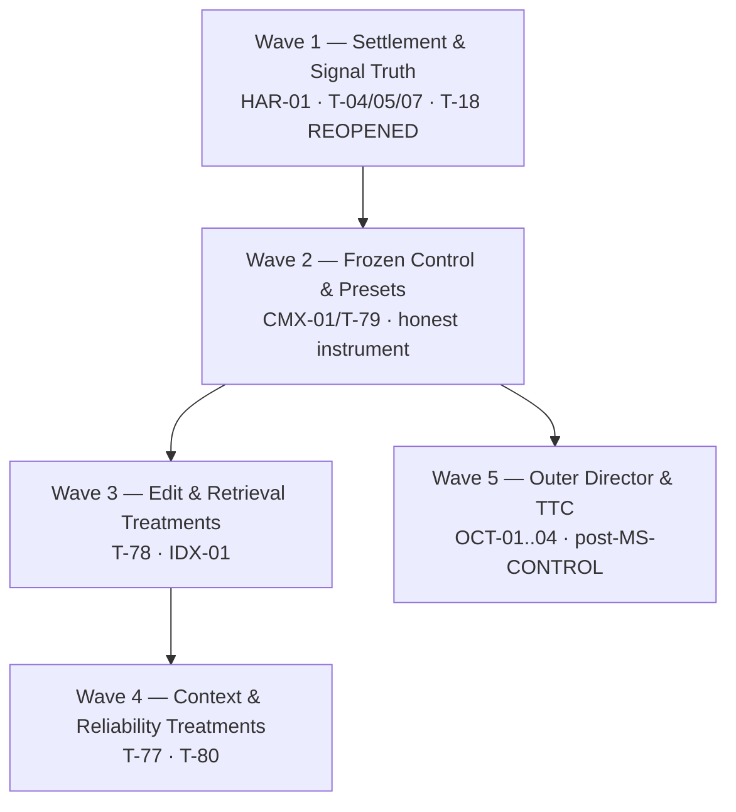

# ARCHITECTURAL SYNTHESIS OF RECORD — ELECTROWEAK v0.9.2 → v0.9.3

**To:** Vanguard / AETHER Engineering Steering Group & Release Governance
**From:** Principal Systems Architect / Lead Invariant Auditor (Package 0.9.3)
**Date:** 2026-09-04
**Authority:** Architectural Directive / Synthesis of Record (`authority: execution-runway-foundation`)
**Supersedes:** [DRAFT SYNTHESIS], Senior Tech Lead, 2026-09-04
**Applicable trees:** `docs/execution/{backlog,milestones,tasks,spec}.md`
**Verification basis:** working tree at `feat/strongforce_beta_release_v093`, HEAD `537bdb66`

---

## 0. Disposition of this pass

The Steering Group's four resolutions are **upheld without modification**, augmented by the **Gem Technical Evaluation Additions**:

1. REJECT 9-strategy fuzzy matching → exact `str_replace` + 2PC + AST preflight in adapters.
2. REJECT L2 PPR auto-injection → L5 on-demand `IndexPort` query tools.
3. REJECT rigid `derive_phase` ladders → outcome postconditions in the admission gate.
4. STAGE the Octopus outer director into Wave 5, strictly after `MS-CONTROL`.
5. **INTEGRATE Gem SOTA Cognitive & Context Mechanics:**
   - (a) L5 Trailing Goal Echo (Lost-in-the-Middle mitigation at prompt tail for 40–120 turn runs).
   - (b) CTRF test log distillation (strip pass traces, cap assertion diff $\le 1500$ chars) & tool body eviction.
   - (c) Algebraic stuck-loop circuit breaker ($d_t = d_{t-2}$ workspace tree hash oscillation) for `ALG-03`.
   - (d) Greenfield vacuity rejection check (empty stubs must fail before implementation is admitted) for T-19.
   - (e) Test-time compute scaling (ephemeral worktree branching + Recursive Tournament Voting) for Wave 5 director.
6. **INTEGRATE Grok Live-Trial Forensics & Execution Truth:**
   - (a) Fenced-action dialect recovery: unpack markdown-fenced JSON action blocks within `note` payloads into candidate tool proposals instead of decaying into null actions.
   - (b) Anti-premature finish gate: strictly reject unsolicited `finish` proposals when notes contain unparsed tool invocations or when zero mutating effects have executed on an unverified trajectory (`gf-orders-001` post-mortem).
   - (c) Greenfield prompt law deconfliction: purge legacy heuristics (*"Write ONE file per turn... Do not read or search first"*) from `system-prompt.txt`, establishing the 3-phase greenfield protocol (scaffold stubs $\to$ red tests $\to$ atomic 2PC commit).
   - (d) Cross-file signature caller admission: wire `IndexPort.get_callers` into `session._admit_completion` and pass `callers_by_symbol` to `multi_file_completeness.py`.
7. **PRESERVE Opus's viable experimental programme without preserving architectural forks:** benchmark
   protocol, tool, editing, retrieval, context, memory, composition, and supervision treatments against
   one frozen control; reject only the unsafe implementation form. §2.1 is the preservation register.
8. **INTEGRATE the GPT (SOL + Terra) instrument & edge layer** — the only dossier produced by executing the
   *public CLI* against a live local model. Five further defects verified in this tree (**C-14**…**C-18**):
   fixed `run-cli` identity, a product receipt that hardcodes empty telemetry, manifest `aliases.json` dead on
   every live provider, an unsafe local-inference launcher, and a benchmark runner that bypasses the product
   path entirely. Packages **INS-01**, **DLG-01**, **BRG-01** (§4.1).
9. **ADOPT a procedural evidence standard (§9)** — the run-level protocol that operationalizes §2.2's ablation
   algebra: a four-rung measurement ladder, a per-run evidence row schema, a metric set with
   **false-completion rate = 0** as a hard veto, and two declared admission routes into `APPROVED` —
   **Route R** (repair of a source-verified defect; falsifier is a regression test) and **Route L**
   (speculative lift; requires a preregistered single-variable ablation against the Wave 2 control).
   Packages **EXP-01** and **ARM-01**.

**Standing disposition rule for this dossier.** A candidate is discarded only when it is *falsified* —
architecturally unbuildable, contradicted by source, or unsafe in kind — never when it is merely unproven.
Unproven mechanisms with a plausible mechanism of action are filed `PROPOSED` with a preregistered experiment
attached, because a framework built to run the comparison should not settle it by argument. Every `REJECT` in
§2 cites the source line that falsifies it; everything else is adopted, staged, parked, or piloted. The cost of
carrying a wrong hypothesis one wave longer is one ablation; the cost of discarding a right one is invisible
and permanent.

The hardening pass did **not** change a single resolution. It changed the *packaging, the paths, the numbers, and one falsifier* — because eighteen of the draft's load-bearing claims and unverified edge cases do not survive contact with the source tree. Those are listed in §1 and are the reason this document is not the draft with a new date on it.

**The single most consequential correction (C-2):** the draft's `MS-TRUTH` falsifier — *"oracle-PASS runs record `completed`"* — is architecturally wrong and must not be committed. It would re-collapse the two axes this codebase deliberately separates, and it is the exact conflation that produced the 8/8 defect in the first place. The honest repair is the opposite of relabelling terminations. See §3.

---

## 1. Hardening findings — what the draft asserted vs. what the tree contains

Every row was verified against source in this working tree. `[C-n]` tags are referenced throughout the rest of the document.

| # | Draft assertion | Verified reality | Consequence |
|---|---|---|---|
| **C-1** | Tool declarations live at `agency/manifests/*/components/tools/` | **That path does not exist in any manifest.** Canonical convention: `manifest.json` carries a `components` **map** of kind → array of manifests-root-relative POSIX paths; tool schemas are flat `<verb>-tool.json` at the manifest directory root. A `tools/` subdirectory exists in exactly **one** of 32 manifests (`vg-herbs`) and is **not** canonical. Skills are `skills/<name>.{json,md}` **pairs**. Kind vocabulary: `manifests/kinds.json` (17 kinds). Registration: `manifests/registry.json`. | Mandate 3 answered in §5. Every `components/tools/` path in the draft is unbuildable. |
| **C-2** | Repair terminal-state inversion so "oracle-PASS runs record `completed`" | `agency/episode/state.py::RunTermination` is the **run-termination axis**; `agency/episode/engine.py:10` and `ICD §3` deliberately exclude the evaluation axis from `agency/`, because "collapsing this with the evaluation outcome is how instrument failure silently becomes task failure." A run that solved the task then burned its last turn failing to *say* so is honestly `terminal=abandoned` **and** `disposition=passed`. | The draft's falsifier inverts a correct invariant. Replaced in §3/§6. **The 8/8 defect is a reporting-layer conflation, not a mislabelled termination.** |
| **C-3** | Six new capability packages | **Four are duplicates of live backlog rows.** `SET-01` ≡ TRUTH (T-04/05/07 + T-18/19/20, CMX-10A). `EDT-01` ≡ CHANGE (T-17 `DONE`, T-47–T-49 `[PROPOSAL]`, TLS-04/05). `PRF-01` ≡ **CMX-01** (already `REOPENED (product divergence)`). `DIR-01` ≡ **OCT-03** + T-31/T-54. | Filing all six as new IDs would realize risk **R-01 (architecture sprawl)** in the very document that names it. Reconciled in §4. |
| **C-4** | T-18 `TestTamperShield` is "implemented but unwired" | Confirmed, and **worse than stated**: `grep -rn "TestTamperShield\|tamper_shield" --include=*.py vanguard/` returns the module, its `__init__` re-export, and **nothing else**. The only importer in the repository is `test/runtime/test_tamper_shield.py`. Zero production callers. Yet `milestones.md` records T-18 as `[x]` MECHANISM. | **T-18 must be `REOPENED`.** A mechanism with no caller is not a mechanism; it is a test fixture. |
| **C-5** | Presets are `$0.05/12t`, `$0.20/25t`, `$1.00/60t`; `harness.yaml` declares `$0.25` overridden by a hardcoded `$1.00` | `packs/code-default/harness.yaml` declares `budget: {usd_micros: 250000, millis: 1800000, tokens: 64000, turns: 40, depth: 2}`. **A differentiated catalog already exists** — `packs/code-default/presets.json` (`aether.code-preset/1`): fast `$0.05/8t/16k`, balanced `$0.15/20t/40k`, max `$0.40/40t/96k`, loaded by `packs/code-default/load.py`. **No `$1.00` literal exists anywhere in the runtime composition path.** | The draft's numbers would **restamp a frozen catalog** with invented ones. The real defect is C-6. Corrected numbers used in §4/§6. |
| **C-6** | Budget passthrough is broken by a hardcoded override | The real mechanism: **two disjoint preset catalogs, and the product path reads the dead one.** `apps/coding_max/facade.py::_manifest()` routes `preset` → `agency/manifests/vg-code-{preset}/manifest.json`, and those three manifests are **byte-identical alias shells** — every `components` entry points at `vg-code-default/*` and all three share `budgetPolicy: vg-code-default/budget-policy.json` (`{tokens:64000, wallClockMillis:1800000, effects:128, evaluations:16, depth:1}` — carrying **no cost and no turn dimension at all**). `presets.json` is never reached from the product path. The facade additionally hardcodes `max_turns: int = 40` as a Python default. | Precise, and a much smaller fix than the draft implies. This *is* CMX-01. |
| **C-7** | Hardcoded `approval_required_above="low"` must become manifest-configured | Confirmed at `runtime/session.py:656`: `approval_required_above=(None if self.scope.sealed else "low")`. **The manifest already declares the policy the runtime ignores** — `vg-code-default/approval-policy.json` = `{"mode":"assisted","threshold":"standard","escalate_on":["proc.exec"]}`, declared in `components.approval_policy`, and never read at this call site. | Not a new artifact. A **declared component the composition root never consults**. Pure wiring. |
| **C-8** | Files at `vanguard/packages/packs/code-default/...` | **`vanguard/packages/packs/` does not exist.** The pack layer is at **repository root**: `packs/code-default/{harness.yaml,presets.json,load.py,plugins/,toolkits/,oracles/,middleware/}`. Likewise `runtime/ledger/emitter.py` does not exist (`runtime/ledger_emitter.py`, flat, does); `adapters/environment/pycache.py`, `adapters/stores/lda_index.py`, `packs/code-default/policies/greenfield.py`, `domain/topology/coordination.py` and `runtime/campaign/director.py` are all absent. | **Six of twenty-one draft Wave paths are unresolvable.** Corrected inventory in §6. |
| **C-9** | `.lda/index.db` holds 77k relations | Actual: **`relations` 80,618**; also `symbols` 10,580, `entities` 14,033, `files` 3,372, `documents` 262, `doc_sections` 5,244, FTS5 corpus 90,028. 39 index runs. | Cite 80,618. A board document that rounds an auditable count down by 5% invites the reader to check the rest. |
| **C-10** | (not raised) | `packs/code-default/harness.yaml` `model_routes` tier 1 is **`provider: ollama, model: qwen2.5:1.5b`** — forbidden and deprecated repository-wide per the `llama-cpp` operational standard, and directly contradicted by commit `ffc3dc92` ("wiped ollama from the project"). Tier 3 is the unresolved literal `"$FRONTIER"`. | Folded into HAR-01 as a named falsifier. A live pack config still routes tier 1 at a banned provider. |
| **C-11** | Dialect degradation to premature `finish` on fenced action notes | In live trial `gf-orders-001` (`deepseek-v4-flash`, SHA `ffc3dc92`), agent abandoned at turn 3 with **zero effects**. Model emitted structured JSON tool call inside the free-text `note` field (`` ````json {"action": "read", "path": "orders/__init__.py"} ```` ``). Dialect parser saw `action: null`, treated it as an empty proposal, and fell through to an unprompted `finish` proposal. | Dialect parser must unpack and promote markdown-fenced JSON action blocks in notes/text to candidate proposals. Admission gate must reject `finish` proposals when notes contain unparsed tool shapes or when zero mutations have occurred on an unverified trajectory. Ships as **T-82**. |
| **C-12** | Greenfield policy vs. legacy prompt law contradiction | `packs/code-default/system-prompt.txt` states: *"Write ONE file per turn... Do not read or search first"*. This toy heuristic directly sabotages greenfield directory/stub scaffolding and multi-file refactoring (Invariant I-8). Models are instructed to bypass inspection and write blind. | Purge *"Do not read or search first"* and single-file restrictions from agent system prompts. Replace with normative 3-phase greenfield protocol (scaffold stubs $\to$ red test falsifier $\to$ atomic 2PC commit). Ships as **T-83a**. |
| **C-13** | Omission of `callers_by_symbol` in `session._admit_completion` | `agency/multi_file_completeness.py` accepts `callers_by_symbol` to prevent premature exit when public API signatures are modified across files. However, `runtime/session.py::_admit_completion` never queries `IndexPort` or passes callers, leaving multi-file signature refactoring unguarded. | Wire `IndexPort.get_callers` into `session._admit_completion` and pass reverse call graph to `multi_file_completeness.py`. Ships as **T-83b**. |
| **C-14** | (not raised) | `runtime/entrypoint.py:56`: `run_id = str(request.get("runId") or request.get("resumeFrom") or "run-cli")`. Every product invocation without an explicit `--run-id` binds the **same fixed identity** and the same `.vanguard/events.sqlite3` ledger. The comment at `:82` documents the hazard and then routes only the *fake* backend to an in-memory store; real runs still collide. GPT reproduced the consequence: a second run silently resumed a prior episode's approval events and died `max_turns (1) exhausted across approval`. | An **instrument** failure indistinguishable from a model failure. No `n ≥ 30` claim is sound while two runs in one workspace can share a ledger. **T-84**, Wave 1. |
| **C-15** | (not raised) | `runtime/entrypoint.py:218` hardcodes `"verifiedStepIds": [], "modelRoutes": [], "promptTokens": None, "completionTokens": None` on the **success** path — literal constants, not absent data. `runtime/compose.py:288` and `runtime/app_service.py:313` already compute routes and usage; the CLI receipt never reads them. | The product receipt structurally cannot report **what was verified, at what cost, through which route**. T-52's cost \(\kappa\) has no input. **T-85**, Wave 2. |
| **C-16** | (not raised) | `adapters/models/openrouter.py:1204` calls `ProposalTranslator.translate(proposal, tool_schemas=tools)` with **no `aliases=` argument**; `llama_cpp.py` is a 60-line subclass that adds none. `lam.py:122` and `stochastic.py:231` *do* pass alias maps. Ten manifests ship an `aliases.json` — `vg-code-default` among them — and §5.1 documents the file as canonical. | **Manifest `aliases.json` is live only on the test doubles and dead on every real provider.** Structurally identical to **C-7**: a declared component the composition root never consults. **T-86**, Wave 3. |
| **C-17** | (not raised) | `tools/llama_cpp/cli.py:145` emits bare `-fa` (this build requires `--flash-attn on\|off\|auto`, so the child dies at argument parse); `:165` confirms liveness by polling the shared port only — no `proc.poll()`, no PID match, no `/props` identity — so a **dead child is reported ONLINE** whenever any server already holds the port; `:188` falls back to `pkill -f llama-server`, a blanket kill of every server on the machine. `tools/llama_cpp/mcp_server.py:115` returns `content` with no `finish_reason` check, so an empty completion is returned as success. | The local-inference **instrument** is unsafe for automated measurement: a run can be scored against a different model than the one launched. **T-87/T-88**, Wave 1 Lane B — outside `vanguard/packages/`, zero collision, zero kernel lines. |
| **C-18** | (not raised) | `benchmarks/agentic_harness_matrix_benchmark.py:98` calls `Runtime.execute_profiled(...)` **directly**, bypassing `runtime/entrypoint.py` and therefore the product's manifest routing, preset selection, run-id assignment, and receipt construction. | The benchmark measures a **different subject than the product ships**. This is the mechanism behind GPT's disqualification of the DeepSeek 2/21 row as *"custom runner, not the exact public runtime"*. `MS-CONTROL` must qualify the product path. **T-89**, Wave 2. |

### Mandate 4 — kernel LOC guardrail: **PASS, with 52 lines of headroom**

```
$ python3 tools/linters/check_tcb_budget.py
TCB PASS: 1386 logical lines across 9 files (alarm above 1438)
```

`{__init__ 41, attenuation 171, budget 150, classifier 96, dispatch 374, grants 201, model 137, policy 106, provenance 110}`. Baseline 1307, current 1386, alarm delta 131, threshold 1438.

Every Wave 1–4 target verified outside `kernel/`. Three specific reconfirmations:

- **AST is already correctly placed.** `adapters/environment/transaction.py` opens with `"""I-7 / I-TXN: ast.parse lives here, never in kernel/."""` and imports `ast` at module scope. `grep -c "^import ast\|^from ast" vanguard/packages/kernel/*.py` → 0. EDT-01 adds **zero** kernel lines.
- **SQLite is structurally barred from the kernel.** `tools/linters/check_boundaries.py` grants `kernel: {domain, ports}` only. `LdaRepoIndex` lands in `adapters/stores/` beside `repo_index.py`, behind the existing `IndexPort` protocol — the port already exists, so IDX-01 adds no kernel line and no *new* port either.
- **Git transactions are in adapters.** `adapters/environment/git.py` is on the `check_boundaries.py` subprocess allowlist; `SUBPROCESS_HOME = adapters/sandbox/`. Process creation cannot migrate inward.

**Guardrail for the waves:** `check_tcb_budget.py` runs in CI, and **T-64** (kernel AST prohibition regression test) is already on the books. Wave 1–4 acceptance requires the linter to report **1386 unchanged** — not merely "under 1438". Headroom is not a budget to spend.

---

## 2. Refined synthesis matrix

Verdicts unchanged from the draft where the draft was right. Rationales corrected where the tree disagrees.

| Mechanism | Source | Subsystem | Verdict | Hardened rationale |
|---|---|---|---|---|
| Native tool-call profiles (`ToolCallStyle.NATIVE`) | Opus (Defect A) | `domain` | **ADOPT, capability-bound** | `domain/models/profile.py` defaults `tool_call_style=FENCED_JSON` and `_PROFILES` holds verified production routes: DeepSeek V4 Flash (`deepseek/deepseek-v4-flash-0731`, primary) and GLM 5.3 Flash (`z-ai/glm-5.3-flash`, first fallback). `openrouter/free` serves simple tasks under `FENCED_JSON`. Unverified routes (including Tier 3 DeepSeek V4 Pro until verified with a provider-shape vector) and excluded routes (GLM 5.2) retain the honest fail-closed degradation chain rather than being globally stamped `NATIVE`. |
| Approval threshold decoupling | Opus (Defect C) | `runtime` | **ADOPT** | **C-7.** Not a new artifact — a declared `approval_policy` component the composition root never reads. Wiring only. |
| Explicit `finish` verb declaration | Opus (Defect E/N) | `agency/manifests` | **ADOPT** | Confirmed and localized: `finish-tool.json` exists in `vg-chimera-v1`, `vg-code-chimera`, `vg-code-max-v3`, `vg-code-max-v3luna` — and in **none** of the four product presets (`vg-code-{default,fast,balanced,max}`). The domain accepts it (`ProposalKind.FINISH`, `invocation.py:94`); only the declaration is missing. |
| **Two-axis settlement contract** (`TaskDisposition` ⟂ `RunTermination`) | **This pass**, replacing "terminal-state inversion repair" | `domain/evidence` | **ADOPT** | **C-2.** The draft's framing would relabel terminations to match oracles. The correct repair adds the missing *disposition* axis as a typed domain contract and forbids either axis from being published in the other's column. Full contract in §3. |
| Streaming error retryable flag | Opus (Defect K) | `adapters` | **ADOPT (verify-first)** | Partially contradicted: `openrouter.py` already carries `retryable=True` at lines 830, 862, 881, 917, 933. One `retryable=False` at 873 is a non-200 non-retry status, which is correct. The mid-stream malformed-chunk path was **not** isolated in this pass. Ships as **T-70a: reproduce the GLM stream-abort with a falsifier before changing a flag.** No flag flips on an unreproduced defect. |
| Duplicate `EffectStarted` emission | Opus (Defect L) | `runtime` | **ADOPT (verify-first)** | `ledger_emitter.py:83` declares `"EffectStarted": frozenset({"kernel"})` — kernel is the sole authorized originator, so a duplicate would be a **kernel-owner violation**, materially more serious than the draft's "double-counting". Requires a ledger-replay falsifier before any edit, and any fix that lands in `kernel/` is blocked by the LOC guardrail and needs an explicit ADR. |
| Workspace `.pyc` churn cleanup | Opus (Defect G) | `adapters` | **ADOPT** | `_IGNORED` in `adapters/stores/repo_index.py` already excludes `__pycache__` from *indexing*, but workspace **digests** and diff-based oracles are computed elsewhere and remain exposed. `PYTHONPYCACHEPREFIX` to tmpfs. |
| Remove `ADMISSION_GATE_EXEMPT` (T-04) | Grok §A.1, Opus | `runtime` | **ADOPT** | Confirmed live at `session.py:134`: `frozenset({"vg-code-default", "vg-code-lex"})`. `admission_required()` correctly gates every *other* preset by declared `patch.apply` capability — the name allowlist is the last remaining bypass, and it exempts the **product default**. |
| Wire `TestTamperShield` on admit | Grok §A.1, GPT | `runtime` | **ADOPT — and REOPEN T-18** | **C-4.** Zero production callers. `_admit_completion` (`session.py:1655`) checks epoch, omissions, and policy — never tamper. |
| Implicated tests as verification subject | Grok §A.2 | `runtime` | **ADOPT** | T-20 exists and is `[x]`; the `IndexPort` reverse-dependency feed is the open half. |
| Greenfield stub-fail / impl-pass oracle (Vacuity-Gated) | Grok §A.3, Gem | `packs` | **ADOPT** | T-19. `adapters/evaluators/suites/oracle_greenfield_webapp.py` exists; add red-then-green ordering AND vacuity rejection (suite passing on empty stubs containing only `pass`/`NotImplementedError` is rejected). |
| Fenced-action dialect recovery & anti-premature finish | Grok §A.1, trial `gf-orders-001` | `adapters`, `agency` | **ADOPT** | **C-11.** Unpack markdown-fenced JSON action blocks in `note` or free-text payloads into candidate proposals; reject unsolicited `finish` proposals when notes contain unparsed tool invocations or when zero mutating effects have executed on an unverified trajectory (T-82). |
| Greenfield prompt law modernization | Grok §A.4, Plan B | `packs` | **ADOPT** | **C-12.** Purge *"Write ONE file per turn... Do not read or search first"* from `system-prompt.txt`. Replace with normative 3-phase greenfield protocol: scaffold baseline stubs $\to$ red test falsifier $\to$ atomic 2PC commit (T-83a). |
| Cross-file caller admission (`callers_by_symbol`) | Grok §A.2, Runtime | `runtime`, `agency` | **ADOPT** | **C-13.** Wire `IndexPort.get_callers` into `session._admit_completion` and pass `callers_by_symbol` to `multi_file_completeness.py`, preventing completion when public API signatures change without inspecting dependent call sites (T-83b). |
| Read-before-edit | Grok §A.5, Opus | `agency`, `packs` | **EXPERIMENT — profile/pack policy** | `_completion_inspected_files` is already tracked. Preserve read-before-edit as prompt guidance and an A/B-able strict policy, not universal prior restraint: a hard dispatch prohibition would repeat the `derive_phase` error by controlling the path instead of the outcome. Security-sensitive profiles may require it explicitly. |
| Exact-match `str_replace` + AST preflight | Opus (Part 3 §5) | `adapters` | **ADOPT** | AST preflight **already exists** (`transaction.py`). Only the `str_replace` primitive is new. Fold into T-47; **close TLS-04 as mechanism-present**. |
| Wire `.lda/index.db` behind `IndexPort` | Opus (Part 3 §6) | `adapters` | **ADOPT** | **C-9**: 80,618 relations. Port exists; two adapters exist (`FileRepoIndex`, `InMemoryRepoIndex`); `LdaRepoIndex` is a third implementation of an unchanged protocol. |
| Context economics, breakpoints & Trailing Goal Echo | Opus, Octopus, Gem | `agency`, `adapters` | **ADOPT** | `packs/code-default/harness.yaml` declares `prefix_freeze: true`; add L3 breakpoint emission, `cache_{read,write}_tokens`, CTRF test distillation (failure-only diffs $\le 1500$ chars), and L5 Trailing Goal Echo for Lost-in-the-Middle mitigation. |
| Campaign director & Test-Time Compute (TTC) | Octopus, Grok §B.1, Gem | `runtime` | **STAGE (Wave 5)** | ≡ **OCT-03** + T-31/T-54. Zero mutating tools; speculative parallel candidate generation in isolated git worktrees. RTV may allocate tests or rank candidates, but the bound `ExternalVerifier` remains the **sole** merge authority. |
| CAS mailbox & `CoordinationPlan` | Octopus OCT-01/02 | `domain/topology` | **STAGE (Wave 5)** | ≡ **OCT-01/OCT-02** ≡ T-54. Already `PROPOSED` in `backlog.md §2.10` with the `Σ budget_share ≤ 1000` predicate. |
| Read-only investigator subagent | Grok §B.2, Octopus | `agency` | **STAGE (Wave 5)** | ≡ T-29/T-53, CMX-06 (`BLOCKED` on CMX-07). Ablation against a qualified control is the gate. |
| Anti-thrashing FSM (Oscillation Circuit Breaker) | Backlog, Gem | `agency` | **STAGE (Wave 4)** | ≡ **ALG-03**, already `PROPOSED` at W-092-4. Operationalized by algebraic trigger: workspace tree digest oscillation $d_t = d_{t-2}$ halts repeating loops and forces an alternative hypothesis. |
| Native llama.cpp local inference | GPT, Opus | `adapters`, `packs` | **ADOPT** | **C-10**: `harness.yaml` tier 1 still routes `provider: ollama`. This is a live config contradicting a shipped ban. |
| Unique durable run identity | GPT (Blocker B) | `runtime` | **ADOPT** | **C-14.** `entrypoint.py:56` binds every product run to the literal `run-cli`. Route R: the falsifier is a regression test, not an experiment. |
| Product receipt telemetry passthrough | GPT (Blocker E) | `runtime` | **ADOPT** | **C-15.** Empty constants on the success path, while routes and usage already exist upstream at `compose.py:288` / `app_service.py:313`. Wiring only. |
| Live-path alias & tool-name validation | GPT (Blocker C) | `adapters` | **ADOPT** | **C-16.** Pass the existing `aliases=` parameter on the live translator call. Explicit manifest alias table only — **never** fuzzy tool-name matching; the rule that rejects the 9-strategy cascade governs tool names too. |
| Raw-response digest & dialect classifier provenance | GPT (Blocker C) | `adapters`, `runtime` | **ADOPT** | The only post-hoc way to separate a template mismatch from a model failure. Complements T-82's fenced-note recovery; `agency/episode/protocol_recovery.py` already supplies the bounded temperature-zero retry GPT specified. |
| Local-inference instrument fail-closed (bridge + MCP) | GPT (Blocker D) | `tools/` | **ADOPT** | **C-17.** A measurement programme cannot rest on a launcher that reports a dead child ONLINE and can `pkill` an unrelated server. Outside `vanguard/packages/`; zero kernel, zero wave collision. |
| Product-path benchmark execution | GPT (PR-2), Opus Part 7 | `benchmarks` | **ADOPT** | **C-18.** `MS-CONTROL` qualifies what ships — through `entrypoint.py` — or it qualifies nothing. |
| Measurement ladder & preregistered arms | GPT (PR-2/PR-3) | `benchmarks` | **ADOPT (§9)** | Operationalizes §2.2's factorial ablation at run level: L0 triad → L1 twelve-task freeze → L2 ≥30-task canary → L3 arm comparison, with `false-completion rate = 0` as a hard veto at every rung. |
| Native-only migration completion | GPT (Blocker F) | `adapters`, `packs`, `tools` | **ADOPT** | Widens **C-10** from one grep to the whole alias/env surface: only `VANGUARD_LLAMA_ENDPOINT` and `VANGUARD_LLAMA_MODEL` survive, together with their tests and docs. |
| Evidence-label taxonomy (`LIVE-LOCAL` / `LIVE-HISTORICAL` / `REPLAY` / `STATIC` / `UNDETERMINABLE`) | GPT | `domain/evidence`, `benchmarks` | **ADOPT — partly landed** | Already absorbed into §3's `TaskDisposition.is_missingness` and `NOT_RUN`. §9.3 adds the run-level label so a replay row can never be published beside a live row, and so a provider outage is never scored as model failure. |
| CLI product surface (`aether -m`, `code --help`) | GPT | `clients/cli` | **PILOT (unverified)** | `clients/cli/src/main.ts:22` handles top-level `--help`, but there is no `code.ts` and `code` routes through the generic path, so GPT's observation is plausible and **was not reproduced in this pass**. Reproduce first; the `-m` = model/message collision must be resolved by decision, not by precedence accident. |
| 9-strategy fuzzy matching cascade | Treatise | `adapters` | **REJECT** | Indentation is syntax in Python/YAML. Silent nesting-level relocation. Loud failure + forced section re-read is strictly superior. |
| PPR auto-injection into L2 | Treatise | `agency` | **REJECT FORM; RETAIN QUERY-RANKING EXPERIMENT** | Automatic injection breaks the frozen L1–L3 prefix and makes retrieval a second policy. Preserve the useful part as an A/B-able pack/query policy: an agent explicitly calls a `repo.*` tool, optional PPR ranks results *within that request*, and the bounded observation lands in L5. No ranking enters `IndexPort` or the store adapter. |
| Phased ladder (`derive_phase`) | `vg-code-max-v3` | `agency` | **REJECT** | Forbidding `proc.exec` during inspection breaks fail-to-pass reproduction (T-38). Note: `vg-code-max-v3` is an **experimental** manifest, not a product preset — rejecting it costs nothing on the product path. |
| Second runtime engines (Chimera / Forge) | historical, Opus | `agency` | **REJECT ENGINE FORKS; RETAIN STRATEGIES** | **D-02.** T-23 quarantine already `DONE`. Preserve useful mechanisms—failure fingerprints, test-output parsing, trajectory distillation, and search policies—as composable treatments over the one `EpisodeEngine`, then benchmark them. Do not preserve duplicate execution engines. |
| LLM quorum as merge authority | Octopus ORCH-10 | `runtime` | **REJECT** | Merge verdicts come from compilers and bound exterior tests, never model votes. |
| Evolutionary / tournament candidate search | Opus, Octopus, Gem | `runtime` | **STAGE (Wave 5)** | Retain opt-in candidate generation for packages with numeric exterior evaluators. Votes or RTV may schedule evaluation and rank candidates; they never authorize merge or substitute for `ExternalVerifier`. |
| Tree-sitter / SBFL localization | Backlog | `adapters` | **PARK** | ≡ TLS-03 / ALG-02, already `DEFERRED` to Post-CMX-07. `ports/index.py` states tree-sitter can replace the scan body later **without the port moving** — parking costs no future rework. |
| AST mutation verification | Backlog | `adapters` | **PARK** | ≡ TLS-06 / VER-02 / T-39, already `[PROPOSAL]`. |

### 2.1 Opus preservation register — retain hypotheses without retaining sprawl

The matrix above decides immediate architecture; it must not silently erase viable treatments that
have not yet received a fair comparison. **Preserve the idea, not necessarily its current fork:**
experimental variants belong in small declarative overlays or replaceable adapters over the one
runtime, never in duplicate engines or copied manifests. `PRESERVE` below is not implementation
authorization and creates no new package ID; runway reconciliation MUST map each item to an existing
owner before work begins.

Parallel agents may build independent treatments, but empirical attribution stays serial: freeze one
control subject and suite first, vary one treatment at a time, and publish positive, negative, or
undeterminable results. A losing treatment may be retired only after its configuration digest,
trajectory evidence, and falsifier remain reproducible.

| Viable Opus idea family | Disposition | Preservation boundary and decision gate |
|---|---|---|
| Proposal-protocol convergence | **PRESERVE — P0 verify/fix** | Unify `dialect.normalize_response` and `ProposalTranslator`; either declare `payloadArgument` or remove the dead recovery branch; add native/fenced/text must-fail vectors and an alert when correct tool-shaped text degrades to `finish` with no action. |
| Workspace bootstrap and greenfield completion | **PRESERVE — P0 verify/fix** | `vanguard init` must leave workspace discovery and Git state usable without an ambient environment variable. Preserve a declared no-test greenfield admission shape, but only after `.pyc`/cache churn and vacuous stub passes are excluded. |
| Effect-budget and evidence accounting | **PRESERVE — P0 verify/fix** | Reproduce Opus Defect M: `BudgetReserved` must not be empty and `BudgetCommitted` must not settle with an unknown sentinel when a dimension is knowable. Keep effect settlement distinct from preset-ceiling passthrough. Live cost provenance must be explicit. |
| Honest comparison instrument | **PRESERVE — prerequisite to optimization claims** | One frozen content-addressed suite, append-only result rows, separate `terminal` and `disposition`, mandatory provenance/model reality/cost provenance, oracle-tamper digest, and paired comparison using the existing statistics. No rate from `n=1`; mocks and dry runs never become capability evidence. |
| Broader tool surface and concurrency | **PRESERVE — benchmark treatments** | Bounded `glob`/list/windowed read/ripgrep/diff/lint/typecheck, sandboxed shell and background-process tools, `todo_write`, and parallel disjoint observations. Keep the argv allowlist as a restrictive profile. Each verb needs a selector, output bound, and must-fail perimeter test. |
| Editing alternatives | **PRESERVE — benchmark treatments** | Exact `str_replace` is the preferred treatment; also preserve atomic `multi_edit`, current-region feedback after rejection, unified diff as compatibility input, greenfield-only whole-file write, and narrow structural `ast_patch`. Unsafe fuzzy strategies remain rejected. |
| Retrieval alternatives | **PRESERVE — benchmark treatments** | Keep incremental changed-path/reverse-closure indexing, epoch-bound index identity, and optional PPR ranking behind agent-issued L5 queries. Code-vector retrieval stays rejected; FTS/semantic retrieval may still be tested for natural-language memory. |
| Context economy and long-horizon state | **PRESERVE — post-control treatments** | Digest-addressable result distillation with `expand`, prefix-stability test before cache controls, salience-ordered L5, pinned working set including `falsified`, ledger-derived summarize-on-compact, `ContextCompacted` receipts, tool-result cache, and rolling handoff with the original brief verbatim. Gem's CTRF and Trailing Goal Echo are compatible treatments within this family. |
| Memory, skills, and subagents | **PRESERVE — post-control treatments** | Load repository instructions as stated constraints; retain a progressive-disclosure skill catalogue, ledger-derived `EpisodeMemory`, and `spawn` primarily for context isolation. Learning promotion remains gated on held-out evaluation and rollback. |
| Composition and supervision | **PRESERVE — post-control treatments** | Preserve manifest delta/inheritance semantics and shared declarations, evidence-gated fixed topologies, and a restartable ledger-tailing supervisor. Useful Forge/Chimera mechanisms migrate behind canonical interfaces; their engines do not. |
| Model and local-inference experiments | **PRESERVE — capability-bound** | Report frontier-model capability ceiling separately from cheap-model economy; retain free-tier smoke testing; qualify native profiles per route. Native local inference means standalone llama.cpp with the required chat/tool template and hardware backend—not an Ollama compatibility route. |
| Replay research and product smoke | **PRESERVE — instrument-dependent** | Retain replay-with-substitution as an ablation method and a real end-to-end coding smoke test. Neither a cassette nor a single live task authorizes a product rate. |

### 2.2 The Naked Solver & Decoupled SPI Architecture — solving measurability and traceability

Past benchmark evaluations suffered from two fatal flaws: **unmeasurability** (bundling multiple unisolated features so the cause of score deltas was unknown, or inverting settlement axes to mask instrument failures) and **loss of traceability** (truncating large test outputs or relying on unrecorded in-memory state). 

To resolve this permanently, the architecture establishes a minimal **Naked Solver Control Baseline ($C_0$)** wrapped by **Four Hexagonal Interception SPIs**, evaluated via paired differential ablation, and recorded onto an immutable event stream:

```
┌────────────────────────────────────────────────────────────────────────────────────────┐
│                                 THE NAKED SOLVER (C₀)                                  │
│                                                                                        │
│  State Sₜ ──> Compile(L1–L5) ──> Model ──> Proposal ──> Kernel (S0–S12) ──> Receipt    │
│     ▲                                                                         │        │
│     └───────────────────────── State Fold (Receipts) ◄────────────────────────┘        │
└────────────────────────────────────────────────────────────────────────────────────────┘
```

The Naked Solver exposes exactly five primitive verbs:
1. `fs.read`: inspect bytes.
2. `fs.search`: pattern and path matching.
3. `patch.apply`: atomic exact-string replacement with rollback.
4. `proc.exec`: sandboxed command execution (`pytest`, compilers).
5. `finish`: explicit task termination proposal.

All cognitive extensions, graph queries, dialect normalizations, and admission checks attach as decoupled plugins across four explicit hexagonal SPI boundaries:

1. **Point 1: Context Pipeline SPI (`agency/context/`) — Injecting & Distilling Information**
   * *Contract:* `ContextInjector(Protocol)` / `ContextDistiller(Protocol)` augments context into $L_4$/$L_5$ while preserving byte-identical $L_1$–$L_3$ prefix cache stability ($\ge 85\%$ hit rate).
   * *Plugins:* `LdaGraphInjector` (queries `.lda/index.db`), `CTRFDistiller` (failure-only test traces $\le 1500$ chars), `TrailingGoalEcho` (Lost-in-the-Middle mitigation).
2. **Point 2: Dialect & Normalization SPI (`adapters/models/dialect.py`) — Output Recovery**
   * *Contract:* `ResponseMiddleware(Protocol)` normalizes raw model completions into typed `Proposal` objects before kernel evaluation.
   * *Plugins:* `FencedJsonUnwrapper` (T-82: extracts tool proposals from fenced `note` blocks), `GrammarNormalizer`.
3. **Point 3: Capability Extension SPI (`packs/code-default/toolkits/`) — Feature Toolkits**
   * *Contract:* `ToolDescriptor(Protocol)` exposes declarative tool schemas backed by sandboxed execution handlers.
   * *Plugins:* `RepoQueryToolkit` (`repo.get_callers`, `repo.get_dependencies`), `GitCheckpointToolkit`.
4. **Point 4: Turn & Iteration SPI (`agency/episode/`) — Node Iteration & Admission Gates**
   * *Contract:* `StepStrategy(Protocol)` / `AdmissionGate(Protocol)` intercepts actions before kernel execution or task settlement. Enables local feedback loops without advancing external state, and enforces outcome invariants.
   * *Plugins:* `PatchSyntaxPreflight` ($<0.2\text{ms}$ AST check), `AntiThrashingCircuitBreaker` (T-80: halts on $d_t == d_{t-2}$), `CallersAdmissionGate` (T-83b: verifies call sites of changed signatures), `VacuityAdmissionGate` (T-81: rejects passes on empty stubs).

#### Measurability & Traceability Guarantees

* **Single-Variable Factorial Ablation:** In Wave 2, the Naked Solver $C_0$ is qualified on the frozen canary suite ($N \ge 30$). Every subsequent treatment $T_k = T_{k-1} + F_k$ varies exactly **one plugin at a time**, evaluated on three scalar metrics:
  1. **Accuracy Lift:** $\Delta \text{Pass} = \text{Pass}(T_k) - \text{Pass}(T_{k-1})$ (McNemar test $p < 0.05$).
  2. **Token Efficiency:** $\kappa = \frac{\text{Total Tokens Expended}}{\text{Oracle-Verified Successes}}$ (must not explode).
  3. **Turn Waste Ratio:** $W = \frac{\text{Turns Expended After Task Solved}}{\text{Total Turns Expended}}$ ($W \to 0$ with `finish` declaration).
* **Dual-Plane Zero-Loss Traceability:**
  1. *Plane 1 (Cognitive Window):* Compact, CTRF-distilled summaries presented to the LLM.
  2. *Plane 2 (Immutable Ledger & CAS):* Full uncompressed outputs written to Content-Addressed Blob Storage (`.aether/blobs/sha256_<digest>`). The single-writer SQLite-WAL event stream records causal DAG links (`parent_event_id`), workspace digests ($d_t$), and the orthogonal Two-Axis Settlement (`SettlementReceipt`), guaranteeing 100% deterministic trajectory replayability (`uv run vg replay`).

---

## 3. Mandate 2 — the exact domain wire contract

### 3.1 Why the draft's repair is rejected

The tree draws one line with unusual care:

```
agency/episode/state.py:  class RunTermination(str, Enum):
    """VG-03 §6.2, run-termination axis only.
    Collapsing this with the evaluation outcome is how instrument failure
    silently becomes task failure, so the evaluation axis is deliberately
    absent from agency/: the Evidence plane owns it (ICD §3)."""
```

`agency/episode/engine.py:10` restates it: *"`agency` cannot import an evaluator, and the run-termination axis…"*. The rule is load-bearing and enforced structurally — `check_boundaries.py` grants `agency: {domain, ports, kernel}`, so an evaluator import would not link.

The 8/8 finding is therefore **not** a mislabelling of terminations. Those runs genuinely ended by exhausting `max_turns` without a `finish` — `abandoned` is the *correct* value on the termination axis. What was missing is that **the evaluation axis was never recorded at all**, so the benchmark reporting layer printed the only terminal word it had.

Adopting the draft's falsifier — *"oracle-PASS runs record `completed`"* — would make `RunTermination` a function of the oracle. That is the precise conflation `state.py` warns against, and it would let a green oracle launder an instrument error into a completion. **It must not be committed.**

Note that the vocabulary already exists and is already correct — it is simply in the wrong layer and untyped:

- `benchmarks/protocols.py:30` → `RESULT_DISPOSITIONS = frozenset({"passed","failed","undeterminable","not_run"})` — a bare frozenset of strings, in `benchmarks/`, invisible to the runtime.
- `domain/evidence/envelope.py:55` → `OUTCOMES = ("passed","failed","undeterminable")` — typed and in the domain, but only **three** states, because an envelope asserts a claim about an *executed* subject.

The fourth state is real and belongs in the domain. `MS-INSTRUMENT` already closed on all four (`dispositions {passed,failed,undeterminable,not_run}`) — the runtime simply cannot express them.

### 3.2 `vanguard/packages/domain/evidence/disposition.py` — new module

Pure, stdlib-only, no I/O (`VG-03 §4`, `LT-1`), consistent with every sibling in `domain/evidence/`.

```python
"""Task disposition: the evaluation axis, kept apart from run termination.

`ICD §3` splits two questions that one word keeps collapsing:

* **How did the run end?** -- `agency.episode.state.RunTermination`
  (`completed | abstained | escalated | cancelled | budget_exhausted |
  instrument_error | runtime_error | abandoned`).
* **What did the oracle say about the task?** -- this module.

They are orthogonal, and eight oracle-green runs were reported as eight
abandonments because only the first axis was ever recorded. A run that solved
the task and then spent its last turn failing to *say* so is honestly
`terminal=abandoned` and `disposition=passed`. So the repair is not to relabel
terminations against the oracle -- that would make the termination axis a
function of the evaluator, which is how instrument failure becomes task
failure (`state.py`, `VG-03 §6.2`). The repair is to give the disposition axis
a type, and to forbid either axis from being published in the other's column.

`NOT_RUN` is the state `envelope.py::OUTCOMES` deliberately cannot express: an
envelope binds a claim to an executed subject, and a task that never executed
has no claim to sign. It is a disposition, never an outcome, and it carries no
envelope digest. This is why the vocabularies differ by exactly one member and
why `disposition_to_outcome` refuses rather than invents.
"""

from __future__ import annotations

from dataclasses import dataclass
from enum import Enum
from typing import Any, Mapping

from ..canonicalisation.digest import digest_of

__all__ = [
    "SETTLEMENT_SCHEMA",
    "DispositionError",
    "SettlementReceipt",
    "TaskDisposition",
    "disposition_to_outcome",
    "parse_settlement",
]

#: Payload schema carried on the existing `VerdictRecorded` ledger kind.
#: No new event kind is allocated -- see section 3.4.
SETTLEMENT_SCHEMA = "aether.settlement/1"


class DispositionError(ValueError):
    """A settlement that cannot be admitted. Raised at build or parse."""


class TaskDisposition(str, Enum):
    """The honest four-state settlement. `str` mixin so JCS sees the value."""

    PASSED = "passed"
    FAILED = "failed"
    UNDETERMINABLE = "undeterminable"
    NOT_RUN = "not_run"

    @property
    def satisfies_predicate(self) -> bool:
        """`G-1`: only `passed` closes a gate. There is no second true value.

        A property rather than a caller-side comparison so that no reader can
        spell the check as `!= FAILED` and quietly admit `undeterminable`.
        """
        return self is TaskDisposition.PASSED

    @property
    def is_missingness(self) -> bool:
        """`T-25`: absent evidence, distinguished from a negative result."""
        return self in (TaskDisposition.UNDETERMINABLE, TaskDisposition.NOT_RUN)


def disposition_to_outcome(disposition: "TaskDisposition") -> str:
    """Project onto `envelope.py::OUTCOMES`. Refuses on `NOT_RUN`.

    A task that never executed has nothing to sign, so there is no honest
    outcome to project. Refusing here is what stops a `not_run` row from
    being silently laundered into an `undeterminable` envelope and counted
    as a legitimately-reported broken experiment.
    """
    if disposition is TaskDisposition.NOT_RUN:
        raise DispositionError(
            "not_run has no evidence outcome: a task that never executed "
            "cannot carry a signed envelope")
    return disposition.value


@dataclass(frozen=True, slots=True)
class SettlementReceipt:
    """One task's settlement on both axes, recorded without collapsing them.

    `terminal_status` is carried as a plain `str`, never a `RunTermination`:
    `domain` cannot import `agency` (`check_boundaries.py`), and the coupling
    would be wrong even if it linked. It is recorded for correlation and is
    never read to derive `disposition`, nor derived from it.
    """

    task_id: str
    disposition: TaskDisposition
    terminal_status: str = ""
    oracle_digest: str = ""
    verification_subject_digest: str = ""
    executed_test_count: int = 0
    envelope_digest: str = ""
    undeterminable_reason: str = ""

    def __post_init__(self) -> None:
        if not self.task_id.strip():
            raise DispositionError("a settlement requires a task_id")
        if self.executed_test_count < 0:
            raise DispositionError("executed_test_count cannot be negative")

        if self.disposition is TaskDisposition.PASSED:
            # T-08 / MS-TRUTH: a pass is a claim about an executed subject.
            # Zero counted tests is the shape of an invented pass.
            if self.executed_test_count <= 0:
                raise DispositionError(
                    "passed requires executed_test_count > 0")
            if not self.oracle_digest or not self.verification_subject_digest:
                raise DispositionError(
                    "passed requires a bound oracle and verification subject")

        if self.disposition is TaskDisposition.UNDETERMINABLE:
            # ADR-0101 section 4: a broken experiment must be describable.
            # Silence is the failure mode, so the reason is mandatory.
            if not self.undeterminable_reason.strip():
                raise DispositionError(
                    "undeterminable requires an explicit reason")

        if self.disposition is TaskDisposition.NOT_RUN:
            if (self.executed_test_count or self.oracle_digest
                    or self.verification_subject_digest
                    or self.envelope_digest):
                raise DispositionError(
                    "not_run cannot carry execution evidence")

    @property
    def identity(self) -> str:
        return digest_of(self.to_wire())

    def to_wire(self) -> dict[str, Any]:
        wire: dict[str, Any] = {
            "schema": SETTLEMENT_SCHEMA,
            "taskId": self.task_id,
            "disposition": self.disposition.value,
            "executedTestCount": self.executed_test_count,
        }
        if self.terminal_status:
            wire["terminalStatus"] = self.terminal_status
        if self.oracle_digest:
            wire["oracleDigest"] = self.oracle_digest
        if self.verification_subject_digest:
            wire["verificationSubjectDigest"] = self.verification_subject_digest
        if self.envelope_digest:
            wire["envelopeDigest"] = self.envelope_digest
        if self.undeterminable_reason:
            wire["undeterminableReason"] = self.undeterminable_reason
        return wire


def parse_settlement(source: Mapping[str, Any]) -> SettlementReceipt:
    """Parse a wire settlement, refusing anything the constructor refuses."""
    if source.get("schema") != SETTLEMENT_SCHEMA:
        raise DispositionError(
            f"expected {SETTLEMENT_SCHEMA}, got {source.get('schema')!r}")
    raw = str(source.get("disposition", ""))
    try:
        disposition = TaskDisposition(raw)
    except ValueError as exc:
        raise DispositionError(f"unknown disposition {raw!r}") from exc
    return SettlementReceipt(
        task_id=str(source.get("taskId", "")),
        disposition=disposition,
        terminal_status=str(source.get("terminalStatus", "")),
        oracle_digest=str(source.get("oracleDigest", "")),
        verification_subject_digest=str(
            source.get("verificationSubjectDigest", "")),
        executed_test_count=int(source.get("executedTestCount", 0)),
        envelope_digest=str(source.get("envelopeDigest", "")),
        undeterminable_reason=str(source.get("undeterminableReason", "")),
    )
```

### 3.3 Export surface

Append to `domain/evidence/__init__.py` (which currently exports `audit`, `claim`, `foundation`, `guardrails`, `preregistration` — note it does **not** yet re-export `envelope`; leave that unchanged in this pass):

```python
from .disposition import (
    SETTLEMENT_SCHEMA,
    DispositionError,
    SettlementReceipt,
    TaskDisposition,
    disposition_to_outcome,
    parse_settlement,
)
```

…with the six names appended to `__all__`.

### 3.4 Ledger event representation — **no new kind is allocated**

`domain/ledger/events.py` states the rule explicitly: reintroducing or adding a kind *"requires a full kind package — ADR, allocation, writer, reducer, schema, golden vector, and coverage proof — never a one-line addition to this set."* `READABLE_KINDS` is derived from `schemas/mhf/event_envelope.schema.json` via `_WireEventKind`, and `WRITABLE_KINDS` currently holds 55 members. Inventing `SettlementRecorded` would be a schema change plus an ADR, on the critical path of Wave 1, for no gain.

The two axes map onto two kinds that already exist and already have owners:

| Axis | Event kind | Payload | Owner |
|---|---|---|---|
| Run termination | **`EpisodeCompleted`** (existing) | `terminal_status` only — unchanged shape, no oracle field ever added | `agency` → `runtime` |
| Task disposition | **`VerdictRecorded`** (existing) | `SettlementReceipt.to_wire()` under `schema: aether.settlement/1` | Evidence plane |

Invariants this buys, stated as commit-ready falsifiers:

1. **`EpisodeCompleted` never carries a disposition field.** Falsifier: schema assertion over emitted payloads; `assert "disposition" not in payload`.
2. **`VerdictRecorded` never carries a terminal-derived pass.** `SettlementReceipt.__post_init__` refuses `PASSED` with `executed_test_count == 0`, so no reducer can synthesize one.
3. **The pair is jointly recoverable and independently readable.** Falsifier: a ledger with `terminal_status="abandoned"` and `disposition=passed` **replays without contradiction** — this is the exact 8/8 shape, and it must be representable, not repaired.
4. **`benchmarks/protocols.py` stops owning the vocabulary.** `RESULT_DISPOSITIONS` becomes `frozenset(d.value for d in TaskDisposition)`, and `classify_disposition()` returns `TaskDisposition`, preserving its existing `_UNDETERMINABLE_MARKERS` precedence (missingness markers beat a PASS status — already correct, and preserved verbatim).
5. **`G-1` is enforced by type, not by convention.** No call site may spell the gate check as `!= FAILED`; only `disposition.satisfies_predicate` closes a gate.

**Layering check:** `domain/evidence/disposition.py` imports only `dataclasses`, `enum`, `typing`, and `..canonicalisation.digest`. `check_boundaries.py` permits `domain: {}` — this module adds no edge to any package. It is legal from `runtime`, `adapters`, `apps`, and `benchmarks` alike, which is precisely why the vocabulary can finally be shared.

---

## 4. Hardened backlog inventory additions

**Copy-paste target:** `docs/execution/backlog.md`, new subsection after §2.10.

### 4.1 New section — insert verbatim

```markdown
### 2.11 Electroweak Convergence: Harness Preconditions & Settlement Truth

Accepted disposition of the Electroweak v0.9.2 review dossiers (Synthesis of
Record, 2026-09-04). This section adds **seven** capability packages. The other
four IDs proposed in the draft synthesis resolved to live rows and are recorded
as aliases in §3 rather than as new packages, per **R-01 (architecture sprawl)**:
a synthesis that names sprawl as a risk does not open six rows where two are new.

Five of the seven (`INS-01`, `DLG-01`, `BRG-01`, `EXP-01`, `ARM-01`) come from the
GPT (SOL + Terra) dossier and the procedural evidence standard in §9. Each declares
its admission route: **Route R** rows repair a defect verified at a named source
line and close on a regression test; the single **Route L** row (`ARM-01`) claims
lift and therefore stays `PROPOSED` until a preregistered ablation says otherwise.

| ID | Title & Focus | Subsystem | Lane | Status | Target Milestone | Reconciliation | Description & Acceptance Gate |
|---|---|---|---|---|---|---|---|
| **HAR-01** | Harness Precondition Repair (deaf-mute agent) | `domain` / `agency` / `runtime` / `adapters` | Lane A | `APPROVED` | MS-TRUTH (precondition) | **New.** No existing T-id covers native tool-call style, approval-policy passthrough, or `finish` declaration. Extends DIALECT (T-21, T-22). Precondition of **CMX-09**; does not subsume it. Adds T-69–T-74. | **Precondition.** No settlement gate is reachable until the agent can call tools, write, and finish. (1) Add explicit `ToolCallStyle.NATIVE` profiles only for production routes whose native-tool support is verified; unverified routes preserve the degradation chain. (2) `runtime/session.py:656` reads `components.approval_policy` instead of the literal `"low"`. (3) Declare `finish-tool.json` in `vg-code-{default,fast,balanced,max}`. (4) Two-axis settlement contract (**T-72**, see spec §3). (5) Purge the `provider: ollama` tier-1 route and resolve `$FRONTIER` in `packs/code-default/harness.yaml`. <br/>*Falsifier*: each native-declared route dispatches `patch.apply` and `finish` in `Mode.BENCHMARK` with no protocol degradation or `denied_ask_fail_closed`; an unverified route is never silently promoted to `NATIVE`; `grep -rn "ollama" packs/` is empty; `terminal_status=abandoned` plus `disposition=passed` round-trips without contradiction. |
| **INS-01** | Product Instrument Integrity (identity · receipt · measured subject) | `runtime` / `benchmarks` / `clients` | Lane A | `APPROVED` (Route R) | MS-TRUTH (Wave 1) → MS-CONTROL (Wave 2) | **New.** GPT Blockers B/E plus **C-18**. No existing T-id covers run identity, receipt telemetry, or the benchmark subject. `MS-INSTRUMENT` is `CLOSED` over the **benchmark harness** subject (`test.benchmarks.test_instrument_ms`); the product CLI path was never its subject, so that closure does not transfer and this is not a REOPEN. Adds T-84, T-85, T-89, T-97. | **Instrument.** (1) Generated UUID/ULID run identity; `--resume <id>` is the only recovery route (`entrypoint.py:56`). (2) Receipt carries real `modelRoutes`, `promptTokens`, `completionTokens`, `verifiedStepIds` and cost provenance (`entrypoint.py:218`). (3) The canary executes through `entrypoint.execute`, not `Runtime.execute_profiled` directly (`agentic_harness_matrix_benchmark.py:98`). <br/>*Falsifier*: two `vg code` calls in one workspace produce two distinct ledgers and only `--resume` recovers a prior one; one live run's receipt carries a non-empty `modelRoutes`, non-null token counts, and `verifiedStepIds` matching the ledger; the canary runner's entry symbol is `entrypoint.execute`. |
| **DLG-01** | Live Dialect Validation & Provenance | `adapters` | Lane A | `APPROVED` (Route R) | MS-TRUTH | **New.** Extends DIALECT (T-21/T-22) and T-82 rather than replacing them; `agency/episode/protocol_recovery.py` already supplies the bounded temperature-zero retry, so only validation and provenance are missing. Adds T-86, T-90. | **Dialect.** Pass the manifest `aliases.json` map into `ProposalTranslator.translate` on the live path (`openrouter.py:1204`); validate tool name and arguments against the declared schema; record the raw-response digest and typed classifier class in the ledger. Explicit alias table only — no fuzzy tool-name matching. <br/>*Falsifier*: an undeclared tool name is rejected typed and never translated; a declared alias resolves to its canonical verb; a malformed completion leaves a retrievable raw-response digest plus a typed failure class, and never a silent `note`. |
| **BRG-01** | Local Inference Instrument Fail-Closed | `tools/llama_cpp` | Lane B | `APPROVED` (Route R) | MS-TRUTH (precondition of any `LIVE-LOCAL` row) | **New.** Lives outside `vanguard/packages/`: touches no kernel line, no port, and no wave file set. Precondition of every local measurement, which is why it is Wave 1 despite being tooling. Adds T-87, T-88, T-91. | **Instrument.** `--flash-attn on\|off\|auto`; `ONLINE` requires `proc.poll() is None`, the expected child PID, and a `/props` model + alias match; an occupied port is `MODEL_MISMATCH`, never silently adopted; `stop` terminates only an identity-verified recorded child; structured status `{ONLINE, REFUSED, FORBIDDEN, TIMEOUT, PID_STALE, MODEL_MISMATCH}`; MCP returns typed `EMPTY_COMPLETION` / `MAX_TOKENS_WITHOUT_CONTENT` instead of empty success. <br/>*Falsifier*: an invalid `-fa` child cannot be reported online while another server holds the port; `stop` never issues a process-name kill; an empty completion with `finish_reason=length` returns a typed error, not content. |
| **EXP-01** | Measurement Ladder & Preregistration | `benchmarks` | Lane B | `APPROVED` (Route R — method, not lift) | MS-CONTROL | **New.** Operationalizes §2.2's ablation algebra and Opus's honest-comparison instrument at run level. **Consumes** T-51/T-52 rather than duplicating them: T-51 freezes the suite, T-52 supplies Wilson and \(\kappa\), EXP-01 supplies the ladder, the row schema, and the veto. Adds T-92–T-95. | **Method.** Four rungs (§9.2): L0 smoke triad, L1 twelve-task freeze, L2 ≥30-task canary, L3 arm comparison. Per-run evidence row schema (§9.3); metric set with **false-completion rate = 0** as a hard veto (§9.4); a hypothesis registry binding every Route L mechanism to a preregistered single-variable ablation. <br/>*Falsifier*: a rung-L2 report missing any required schema field is refused by the writer; a run with `disposition=passed` and no bound oracle digest cannot enter a report; a treatment with no registered hypothesis id cannot be scored; a `REPLAY` row cannot be published in the same table as a `LIVE-LOCAL` row. |
| **ARM-01** | Comparative Arm Program (agents × models × presets) | `benchmarks` / `agency/manifests` | Lane B | `PROPOSED` (Route L) | MS-CONTROL (gate) → MS-SENIOR | **New.** The multi-agent comparison the framework exists to run. Deliberately `PROPOSED`, not `APPROVED`: it is authorized by a **closed MS-CONTROL and a landed EXP-01**, never by this document. Adds T-96. | **Comparison.** Declare arms as (manifest × model × preset) triples over one immutable task bundle; LAM-first hermetic protocol regression, then one live canary per authorized arm, then the frozen corpus. Provider outage, zero model calls, HTTP error, or missing credentials are `not_run` — never task failure, never a model-quality score. <br/>*Falsifier*: two arms differing in more than one declared dimension cannot be published as a comparison; every arm report cites the exact manifest digest, model id, server build, quantization, and sampling; `openrouter/free` cannot be cited as a stable benchmark identity unless it pins the selected model. |
| **IDX-01** | LDA-Backed Repository Intelligence | `adapters` / `agency` | Lane B | `APPROVED` | MS-SEE | **New adapter only.** `IndexPort` already exists (`ports/index.py`) and is **not modified**. Third implementation beside `FileRepoIndex` / `InMemoryRepoIndex`. Closes the CMX-02 `PARTIAL` retrieval half; **narrows T-46** to optional query-local ranking in pack policy. Adds T-75–T-77. | **Intelligence.** `LdaRepoIndex` in `adapters/stores/lda_index.py` reads `.lda/index.db` (**80,618** relations, 10,580 symbols, 3,372 files) and returns unranked value objects. Expose `repo.{search_symbols,get_callers,get_dependencies,get_tests}` as bounded observations into **L5 only**. An A/B-able pack policy may PPR-rank results inside an explicit request; no ranking enters `IndexPort`, the adapter, or L1–L3. Emit provider cache breakpoints at the L3 boundary and record cache tokens. |
```

### 4.2 Lifecycle amendments to existing rows — apply in place

| Row | File / §  | Current | **Change to** | Ground |
|---|---|---|---|---|
| **T-18** | `tasks.md` §, `milestones.md` MS-CHANGE | `[x]` MECHANISM | **`REOPENED`** | `TestTamperShield` has **zero production callers** repository-wide; only `test/runtime/test_tamper_shield.py` imports it. Meets the `REOPENED` predicate exactly: *"a current-source falsifier that invalidates carrying its old closure forward."* **C-4** |
| **CMX-01** | §2.9 | `REOPENED` (product divergence) | **`APPROVED`**, absorbing draft `PRF-01`; note reads *"unify two disjoint preset catalogs: `apps/coding_max/facade.py` routes to alias manifests and never reaches `packs/code-default/presets.json`"* | **C-5/C-6** |
| **CMX-02** | §2.9 | `PARTIAL` | unchanged status; dependency becomes **IDX-01** | Retrieval half is IDX-01's deliverable |
| **TLS-04** | §2.4 | `DEFERRED` Post-CMX-07 | **`DONE` (mechanism)** | `adapters/environment/transaction.py` performs `ast.parse` preflight and aborts before durable flush. The gate exists; deferral is stale. |
| **TLS-03**, **TLS-06**, **ALG-02**, **T-39** | §2.4, §2.8 | `DEFERRED` / `PROPOSED` | **unchanged — PARK confirmed** | `ports/index.py` guarantees tree-sitter can replace the scan body without moving the port; parking incurs no rework debt. |
| **OCT-03** | §2.10 | `PROPOSED` M-OCT | unchanged status; title gains *"(≡ draft `DIR-01`)"*; dependency **`MS-CONTROL`** made explicit | **C-3** |

### 4.3 Package index — replace §3 rows

```markdown
| **TRUTH** | CMX-10A, W-092-F2, HAR-01, *SET-01* | T-04–T-08, T-42, T-38, T-23, T-69–T-74, T-81, T-82 | MS-TRUTH | T-23/T-38/T-42 `DONE`; T-08 landed `8637db55`; T-04/T-05/T-07 open; **T-18 REOPENED** (shield unwired); T-82 dialect recovery |
| **SEE** | CMX-11, PRG-01, W-092-F4, IDX-01 | T-14–T-16, T-36–T-37, T-45, T-75–T-77 | MS-SEE | T-46 **narrowed**: optional query-local ranking stays in pack policy, never `IndexPort` or the adapter |
| **CHANGE** | TXN-01, SHD-01, TLS-04/05, *EDT-01* | T-17–T-20, T-47–T-49, T-78, T-83a, T-83b | MS-CHANGE | T-17 `DONE`; TLS-04 mechanism present in `transaction.py`; **T-18 REOPENED**; `str_replace` folds into T-47; T-83b callers admission |
| **CONTROL** | CMX-07, W-092-F5, CMX-01, EXP-01, *PRF-01* | T-26–T-27, T-51–T-52, T-79, T-89, T-92–T-95 | MS-CONTROL | Preset catalog unification is CMX-01, not a new package; EXP-01 supplies the ladder and the veto, and consumes T-51/T-52 |
| **INSTRUMENT (product)** | INS-01, BRG-01, DLG-01 | T-84–T-88, T-90, T-91, T-97 | MS-TRUTH → MS-CONTROL | Distinct subject from the `CLOSED` MS-INSTRUMENT (benchmark harness). Precondition of every `LIVE-*` row |
| **COMPARISON** | ARM-01 | T-96 | MS-CONTROL → MS-SENIOR | `PROPOSED` (Route L). No arm claim is authorized before MS-CONTROL closes |
| **CAMPAIGN** | OCT-01…04, HYD-01/02, *DIR-01* | T-31, T-54–T-55, T-34 | MS-CAMPAIGN / MS-HYDRA | `DIR-01` ≡ **OCT-03**; director is a runtime client with zero mutating tools |
```

### 4.4 Alias table — append to "v2 ID → T-id aliases"

```markdown
| Draft `SET-01` | T-04/T-05/T-07 + T-18/T-19/T-20 | Not a package. TRUTH + CHANGE settlement half. |
| Draft `EDT-01` | T-47 (+ T-17 `DONE`, TLS-04/05) | Not a package. `str_replace` is a T-47 strategy. |
| Draft `PRF-01` | **CMX-01** | Not a package. Same product divergence, already `REOPENED`. |
| Draft `DIR-01` | **OCT-03** + T-31/T-54 | Not a package. Keep the OCT-* rows in §2.10 authoritative. |
| Draft `HAR-01` | T-69–T-74 | **New package.** Precondition of CMX-09. |
| Draft `IDX-01` | T-75–T-77 | **New package.** Supersedes T-46. |
| `INS-01` | T-84, T-85, T-89, T-97 | **New package** (GPT Blockers B/E, C-18). Product instrument; distinct subject from `MS-INSTRUMENT`'s benchmark harness. |
| `DLG-01` | T-86, T-90 | **New package** (GPT Blocker C). Extends T-21/T-22 and T-82; does not replace them. |
| `BRG-01` | T-87, T-88, T-91 | **New package** (GPT Blocker D/F). `tools/llama_cpp` only; no package-tree collision. |
| `EXP-01` | T-92–T-95 | **New package** (GPT PR-2, §9). Consumes T-51/T-52; does not replace them. |
| `ARM-01` | T-96 | **New package, `PROPOSED`** (GPT PR-3). Gated on a closed MS-CONTROL and a landed EXP-01. |
```

### 4.5 New task rows — `docs/execution/tasks.md` (T-69 onward; current max is T-68)

Every path verified present in this tree. `depends_on` edges live here, per §3's *"`requires:` edges live on tasks."*

| T-id | Title | Package | `depends_on` | Exact target | Executable falsifier |
|---|---|---|---|---|---|
| **T-69** | Capability-bound native tool-call profiles | HAR-01 | — | `domain/models/profile.py::_PROFILES`; model registry capability declarations | `test/contracts/test_model_profiles.py`: every route declared native resolves `ToolCallStyle.NATIVE` and passes a provider-shape vector; unverified and unknown ids are not silently promoted and still degrade `NATIVE→JSON_SCHEMA→FENCED_JSON→TEXT_GRAMMAR` via `degraded()`. |
| **T-70** | Approval threshold from declared `approval_policy` | HAR-01 | T-69 | `runtime/session.py:656` | `test/runtime/test_approval_passthrough.py`: with `{"threshold":"standard"}` declared, `patch.apply` (medium) and `proc.exec` (high) dispatch in `Mode.BENCHMARK` with zero `denied_ask_fail_closed`; the literal `"low"` is absent from `session.py`. |
| **T-70a** | Reproduce mid-stream SSE abort before flag change | HAR-01 | — | `adapters/models/openrouter.py::_execute_stream_transport` | `test/adapters/test_openrouter_stream_abort.py`: a truncated SSE chunk after ≥1 delta yields a **reproducing** failure first. Flag changes only after red. Closes as `no_defect` if it will not reproduce. |
| **T-71** | Declare `finish-tool.json` in the four product presets | HAR-01 | — | `agency/manifests/vg-code-{default,fast,balanced,max}/` | `test/contracts/test_manifest_components.py`: each product preset's `components.tools` contains a `finish` schema; every declared path resolves; every `kind` key is in `kinds.json`. |
| **T-72** | Two-axis settlement contract | HAR-01 | — | **new** `domain/evidence/disposition.py`; `domain/evidence/__init__.py`; `benchmarks/protocols.py` | `test/contracts/test_settlement_disposition.py`: `SettlementReceipt(disposition=PASSED, executed_test_count=0)` raises; `UNDETERMINABLE` without a reason raises; `NOT_RUN` with an `envelope_digest` raises; `disposition_to_outcome(NOT_RUN)` raises; a ledger carrying `terminal_status="abandoned"` + `disposition=passed` replays without contradiction; `EpisodeCompleted` payloads contain no `disposition` key. |
| **T-73** | `EffectStarted` single-emission ledger falsifier | HAR-01 | T-72 | `test/runtime/`, `runtime/ledger_emitter.py:83` | `test/runtime/test_effect_started_singleton.py`: replaying one effect yields exactly one `EffectStarted` with one lease id. **Any fix landing in `kernel/` blocks on an ADR + `check_tcb_budget.py`.** |
| **T-74** | Workspace `.pyc` hygiene | HAR-01 | — | `adapters/environment/sandboxed.py` (`PYTHONPYCACHEPREFIX` → tmpfs) | `test/adapters/test_workspace_pycache.py`: after a `pytest` run under a sandboxed env, `find <ws> -name "*.pyc"` is empty and the workspace digest is unchanged from pre-run. |
| **T-75** | `LdaRepoIndex` adapter | IDX-01 | — | **new** `adapters/stores/lda_index.py` | `test/contracts/test_lda_repo_index.py`: satisfies `IndexPort` structurally (`runtime_checkable`); returns value-only `Symbol`/`DependencyEdge`/`TestAssociation`; a missing/stale `.lda/index.db` returns a deterministic `Result.fail`, never a partial map (**T-45** fallback preserved). |
| **T-76** | `repo.*` observation tools bound into L5 | IDX-01 | T-75 | `packs/code-default/toolkits/repo_map.py`; `packs/code-default/plugins/index.yaml`; `adapters/bindings/code.py` | `test/agency/test_l5_only_observations.py`: calling all four `repo.*` verbs leaves the L1–L3 digest bit-identical across 10 turns; observations appear only in L5. |
| **T-77** | Context economics: cache breakpoints, CTRF distillation & Trailing Goal Echo | IDX-01 | T-76 | `agency/context/compiler.py`; `agency/context/compaction.py`; `runtime/ledger_emitter.py` | `test/agency/test_cache_breakpoints.py`: a breakpoint is emitted at the L3 boundary; `cache_read_tokens`/`cache_write_tokens` are recorded per turn; turn ≥ 2 cache-hit rate exceeds 85% on the fixture; test output is distilled into CTRF format (passing runs omitted, failure diffs capped at 1,500 chars); compiler injects a compact Trailing Goal Echo at the tail of L5 to mitigate Lost-in-the-Middle attention decay on 40–120 turn runs. |
| **T-78** | Exact-match `str_replace` primitive | CHANGE (amends **T-47**) | T-17 `DONE` | `adapters/environment/git.py`; routed through `transaction.py::AtomicMultiFileTransactionManager` | `test/adapters/test_str_replace_exact.py`: a non-unique preimage fails closed with typed `PATCH_PREIMAGE_MISMATCH`; a syntax error in file 4 of 5 leaves all 5 byte-identical (`tree_hash_before == tree_hash_after`); no fuzzy/indentation relaxation path exists. |
| **T-79** | Unify the preset catalog on `presets.json` | CMX-01 | T-71 | `apps/coding_max/facade.py::_manifest`; `packs/code-default/load.py`; `agency/manifests/vg-code-{fast,balanced,max}/manifest.json` | `test/apps/test_preset_budgets.py`: `fast/balanced/max` yield **distinct** `EpisodeStarted.budgetCeiling` values matching `presets.json` exactly (`50000/150000/400000` µUSD; `8/20/40` turns); `max_turns` is never a Python default in the facade; `vg-code-fast` halts at turn 8 with `BUDGET_EXHAUSTED`. |
| **T-80** | Anti-thrashing workspace oscillation circuit breaker | CONTROL (ALG-03) | T-78 | `agency/episode/engine.py`; `packs/code-default/middleware/` | `test/agency/test_anti_thrashing_circuit_breaker.py`: if workspace file-tree digest $d_t == d_{t-2}$, engine trips circuit breaker before dispatching proposal, returning typed `OSCILLATION_CIRCUIT_BREAKER` diagnostic forcing hypothesis change. |
| **T-81** | Greenfield oracle vacuity rejection check | TRUTH (amends **T-19**) | T-19 | `packs/code-default/oracles/gate.py` | `test/packs/test_greenfield_vacuity_rejection.py`: greenfield test suite executed against empty stubs (containing only `pass` or `raise NotImplementedError`) that returns 0 failures is rejected with typed `VACUOUS_ORACLE_REJECTED`. |
| **T-82** | Fenced JSON action unwrapping & anti-premature finish | HAR-01 / TRUTH | T-71 | `adapters/models/invocation.py`; `adapters/models/dialect.py`; `agency/admission.py` | `test/adapters/test_dialect_fenced_action_recovery.py`: when model output carries `action: null` but `note` contains a markdown-fenced tool call (e.g. ````json {"action": "read", "path": "foo.py"} ````), dialect parser unpacks and promotes it to a typed candidate proposal; an unsolicited `finish` proposal when no mutations/verifications occurred or when notes contain unparsed tool invocations is rejected with typed `PREMATURE_FINISH_REJECTED`. |
| **T-83a** | Greenfield prompt modernization | TRUTH | — | `packs/code-default/system-prompt.txt` | `! rg -n -i 'write one file per turn|do not read or search first' packs/code-default/system-prompt.txt`. **Split from T-83:** a pure prompt edit with no dependency, so it does not wait on `IndexPort`. |
| **T-83b** | `callers_by_symbol` completion admission | CHANGE | T-75 | `runtime/session.py::_admit_completion`; `agency/multi_file_completeness.py` | `test/runtime/test_multi_file_callers_admission.py`: modifying a public symbol in `file_a.py` without inspecting/updating callers in `file_b.py` causes `_admit_completion` (fed by `IndexPort.get_callers`) to reject completion with typed `UNINSPECTED_CALLERS_REMAINING`. **Split from T-83:** T-78 is deliberately not a dependency. |
| **T-84** | Unique durable run identity; explicit resume | INS-01 | — | `runtime/entrypoint.py:56`; `clients/cli` request builder | `test/runtime/test_run_identity.py`: two successive `code` requests with no `runId` produce **two distinct** `run_id`s and two distinct ledgers; the literal `"run-cli"` is absent from `entrypoint.py`; `resumeFrom` is the only path that recovers a prior ledger; the generated id appears in the first JSON frame **and** the receipt. |
| **T-85** | Product receipt telemetry passthrough | INS-01 | T-84 | `runtime/entrypoint.py:218` (sources: `runtime/compose.py:288`, `runtime/app_service.py:313`) | `test/runtime/test_receipt_telemetry.py`: a completed run's receipt carries a non-empty `modelRoutes`, non-null `promptTokens`/`completionTokens`, `verifiedStepIds` equal to the ledger's verified step set, and cost provenance; no literal `[]`/`None` telemetry constant remains on the success path. |
| **T-86** | Live-path alias & tool-name validation | DLG-01 | T-69 | `adapters/models/openrouter.py:1204`; `adapters/models/invocation.py`; `agency/manifests/*/aliases.json` | `test/adapters/test_live_alias_validation.py`: a declared alias (`search` → canonical verb) resolves on the **live** translator path; an undeclared tool name yields a typed `TOOL_NOT_DECLARED` rejection and never a translated effect; an argument violating the declared schema is rejected typed; no fuzzy or edit-distance name match exists in the path. |
| **T-87** | Bridge lifecycle fail-closed | BRG-01 | — | `tools/llama_cpp/cli.py` (`:145` FA flag, `:165` readiness, `:188` stop) | `test/tools/test_llama_bridge_lifecycle.py` (hermetic fake process + HTTP): an invalid `-fa` child is reported `FAILED`, never `ONLINE`, **while a foreign server holds the port**; adopting an occupied port requires matching `/props` model and alias, else `MODEL_MISMATCH`; `stop` never issues `pkill`/`pgrep -f`; a stale PID file yields `PID_STALE`. |
| **T-88** | MCP fail-closed completions | BRG-01 | — | `tools/llama_cpp/mcp_server.py:115` | `test/tools/test_llama_mcp_failclosed.py`: an empty `content` with `finish_reason=length` returns typed `MAX_TOKENS_WITHOUT_CONTENT`; empty content otherwise returns `EMPTY_COMPLETION`; one bounded retry is permitted; `status` returns a compact summary with raw chat template behind an opt-in flag. |
| **T-89** | Benchmarks execute the product path | INS-01 / EXP-01 | T-84, T-85 | `benchmarks/agentic_harness_matrix_benchmark.py:98`; `benchmarks/backend_baselines.py` | `test/benchmarks/test_product_path_subject.py`: the canary runner's entry symbol is `runtime.entrypoint.execute`; a run recorded by the runner and the same task run through `vg code` produce **the same manifest digest and preset**; a runner that calls `Runtime.execute_profiled` directly fails the check. |
| **T-90** | Raw-response digest & dialect classifier provenance | DLG-01 | T-86 | `adapters/models/dialect.py::normalize_response`; `runtime/ledger_emitter.py` | `test/adapters/test_dialect_provenance.py`: every normalization failure records the raw-response digest and one of the typed classes (`not_json`, `missing_kind`, `xml_tool_tags`, `deepseek_fence`, `truncated`, `tool_not_declared`); the full raw body is retrievable from CAS by that digest; a malformed completion is never published as a bare `note`. |
| **T-91** | Native-only alias & environment purge | BRG-01 / HAR-01 | — | `packs/code-default/harness.yaml`; `adapters/models/{factory,routing,env_loader}.py`; docs and tests | `test/contracts/test_native_only_routes.py`: only `VANGUARD_LLAMA_ENDPOINT` and `VANGUARD_LLAMA_MODEL` are read for local inference; every retired provider alias fails to route with a typed error; `grep -rin "ollama" packs/ vanguard/ tools/ docs/` returns only historical changelog entries. |
| **T-92** | L0 smoke triad through the public CLI | EXP-01 | T-84, T-85, T-87 | **new** `benchmarks/ladder/l0_triad/` (`P0-FIB`, `P0-CSV`, `P0-BUG`) | `test/benchmarks/test_l0_triad.py`: each task runs in a **fresh** workspace through the public CLI and either passes its exterior oracle or fails with a retained trajectory and a typed reason; a `completed` outcome with no patch digest is refused; fixture and oracle digests are recorded per run. |
| **T-93** | L1 frozen pre-canary & evidence row schema | EXP-01 | T-92 | `benchmarks/protocols.py`; **new** `benchmarks/ladder/l1_twelve/` | `test/benchmarks/test_evidence_row_schema.py`: 12 tasks (4 greenfield, 4 single-file bug, 4 data/CLI) frozen by `suite_digest`; a row missing any §9.3 field is refused by the writer; a row whose `evidence_label` is `REPLAY` cannot appear in a table containing a `LIVE-LOCAL` row. |
| **T-94** | Metric set & the false-completion veto | EXP-01 | T-93, T-72 | `benchmarks/protocols.py`; `benchmarks/statistics.py` | `test/benchmarks/test_metric_veto.py`: the report emits false-completion rate, valid-first-tool-call rate, malformed-tool rate, recovery rate, no-op rate, time-to-first-valid-action, turn-waste \(W\) and \(\kappa\); **any** non-zero false-completion rate fails the gate regardless of pass rate; Wilson LB is computed only over rows with `evidence_label=LIVE-*`. |
| **T-95** | Hypothesis registry & preregistration harness | EXP-01 | T-94 | **new** `benchmarks/hypotheses.json`; `runtime/paired_evaluation.py` | `test/benchmarks/test_preregistration.py`: every Route L row in `backlog.md` resolves to a registered hypothesis with a control digest, one declared varied dimension, an expected metric and direction, and a stopping rule; a paired comparison whose treatment differs from its control in more than one declared dimension is refused. |
| **T-96** | Arm matrix & LAM-first comparison protocol | ARM-01 | **MS-CONTROL closed**, T-95 | `benchmarks/ladder/l3_arms/`; `agency/manifests/` | `test/benchmarks/test_arm_matrix.py`: an arm is a (manifest digest × model id × preset) triple; LAM replay regression passes before any live arm executes; a provider outage, HTTP error, or zero-model-call run records `not_run` and is excluded from the denominator with an explicit missingness reason. |
| **T-97** | CLI product surface — reproduce then repair | INS-01 | T-84 | `clients/cli/src/composition/parse-cli.ts`; `clients/cli/src/main.ts` | `test/cli/test_help_and_flags.spec.ts`: `aether code --help` prints help and **exits 0** without emitting a completion frame (reproduce first — **not verified in this pass**); the `-m` collision is resolved by an explicit declared binding, with the losing spelling erroring rather than silently winning. |

---

## 5. Mandate 3 — canonical pack & tool file layout

### 5.1 The convention, as the tree actually defines it

```
vanguard/packages/agency/manifests/
├── registry.json                  # {name, path, undeletable, role} per manifest
├── kinds.json                     # 17 kinds → schema:// URIs. THE vocabulary.
└── <manifest-name>/
    ├── manifest.json              # harness, components{}, capabilities[],
    │                              # evaluators[], budgetPolicy, undeletable
    ├── system-prompt.txt
    ├── <verb>-tool.json           # FLAT at manifest root. read/search/patch/
    │                              # test/finish. NOT under components/tools/.
    ├── <name>-policy.json         # approval|budget|context|retrieval|routing
    ├── repo-index.json
    ├── aliases.json               # optional; e.g. {"finish": "agency.finish"}
    └── skills/<name>.json + .md   # PAIRED. .json declares, .md instructs.
```

`components` is a **map**, not a directory, and its values are paths relative to the **manifests root** — which is what lets `vg-code-fast` reference `vg-code-default/read-tool.json` today. Cross-manifest reuse is a first-class, already-exercised feature.

**Verdict on the draft's `agency/manifests/*/components/tools/`: rejected.** It does not exist, it is not implied by `manifest.json`, and creating it would fork the loader. The `tools/` subdirectory in `vg-herbs` is a single-manifest local convention across 32 manifests and is explicitly **not** the standard.

### 5.2 JSON schemas vs. ad-hoc Python — the boundary

| Concern | Home | Why |
|---|---|---|
| **Tool declaration** (name, params, description) | JSON at manifest root, registered in `manifest.json` `components.tools` | Data. Model-facing. Must be diffable and hashable into the composition digest. |
| **Tool implementation** | `packs/<pack>/toolkits/*.py`, activated by `packs/<pack>/plugins/*.yaml` | Behavior. Note `kinds.json` distinguishes `tool_schema` from `tool_impl` — the split is already normative. |
| **Policy** (approval, budget, context, retrieval, routing) | JSON at manifest root | Data. Currently declared and, for approval, **ignored** — that is **T-70**. |
| **Skills** | `skills/<name>.json` + `skills/<name>.md`, pair-registered under `components.skill` | Existing three-skill precedent in `vg-code-default`. |
| **Task-class policy** | `packs/code-default/` (`context_policy.py`, `oracles/`, `middleware/`) | Cognition belongs to the pack; the manifest declares *what*, the pack decides *how*. |

**T-71 lands as:** `vg-code-default/finish-tool.json` (new file, manifest root), added to `components.tools` in all four product manifests — three of which reference it cross-manifest, exactly as they already reference the other four tool schemas. **Four files touched, one created. No new directory.**

### 5.3 Layout falsifier (ships with T-71)

`test/contracts/test_manifest_components.py`:
1. Every `components` value in every manifest resolves to an existing file under the manifests root.
2. Every `components` key is a `kind` in `kinds.json`.
3. Every `skills/<n>.json` has a sibling `<n>.md`.
4. Every manifest in `registry.json` exists, and every manifest directory is in `registry.json`.
5. **No manifest introduces a `components/` directory** — the anti-drift assertion this finding exists to prevent.

---

## 6. Milestone overlay updates

**Copy-paste target:** `docs/execution/milestones.md` §3. Replace these five rows.

| ID | TARGET | Acceptance | Status | Evidence |
|---|---|---|---|---|
| **MS-TRUTH** | No `completed` without bound verification; no invented counts; one gate; **both settlement axes recorded, neither derived from the other**; greenfield vacuity rejection; anti-premature exit | T-42/T-38/T-23 landed; T-08 landed `8637db55`. Open: **T-04** (remove `ADMISSION_GATE_EXEMPT`, live at `session.py:134`, under RF-25 successor baseline), **T-05**, **T-07** (typed verification subject), **T-18 REOPENED** (`TestTamperShield` has zero production callers → wire into `session._admit_completion`), **T-72** (two-axis settlement contract), **T-81** (greenfield vacuity rejection), **T-82** (dialect fenced-action recovery & anti-premature finish). Gated on **HAR-01** preconditions T-69–T-71 and on **INS-01**/**BRG-01** (**T-84**, **T-85**, **T-87**, **T-88**): a settlement claim recorded by an instrument that reuses a fixed run id, publishes an empty receipt, or may have addressed a different model than the one launched is not evidence. **Falsifier:** a run with zero patches or tampered tests cannot earn `passed`; greenfield passing on `pass`/`NotImplementedError` is rejected via **T-81**; unsolicited `finish` proposals with 0 mutations or unparsed note actions are rejected via **T-82**; **a run may legitimately record `terminal_status=abandoned` with `disposition=passed`, and the ledger replays it without contradiction** — the disposition axis is never derived from the termination axis, nor the reverse (`ICD §3`, `VG-03 §6.2`). | `OPEN` | No-session slice `63b77116`; session parser + `ParsedTestOutput.runner` `8637db55`. **T-18 reopened 2026-09-04: mechanism present at `runtime/governance/tamper_shield.py`, unreferenced outside its own test.** |
| **MS-SEE** | Epoch-bound packets; omissions explicit; one `ContextCompiler`; cache-stable prefix; CTRF distillation; Trailing Goal Echo; port-backed intelligence | T-14–T-16, T-36, T-37, T-45 MECHANISM. Adds: `LdaRepoIndex` backs the **unchanged** `IndexPort` over `.lda/index.db` (**80,618** relations); `repo.*` tools return bounded observations into **L5 only**; provider cache breakpoints at the L3 boundary with `cache_read_tokens` recorded; test tool receipts parsed into CTRF (passing runs omitted, failure traces capped $\le 1500$ chars); `ContextCompiler` emits Trailing Goal Echo at tail of L5 (**T-77**). **T-46 is narrowed, not erased:** optional PPR ranking may be A/B-tested inside an agent-issued query in pack policy, never in `IndexPort`, the adapter, or L1–L3. **Falsifier:** `repo.get_callers` leaves the L1–L3 digest bit-identical across 10 turns; turn ≥ 2 cache-hit rate > 85%; compiler includes trailing goal echo; no ranking logic exists in `adapters/stores/lda_index.py`. | `OPEN` (gated on **IDX-01**) | `587db91a`, `33dc7c33`, `2a4cdaad`, `179f5616`, `81b7b572`, `c7995195`. One `ContextCompiler`; omissions are a ledger; no-index fallback documented. |
| **MS-CHANGE** | Multi-file change closure; 2PC in adapters; exact edit primitive; reverse-caller admission; **zero kernel AST** | T-17 `DONE`; T-19/T-20 MECHANISM; **T-18 REOPENED**; **T-83** (greenfield prompt modernization & caller admission). T-47 amended by **T-78** (exact `str_replace`, unique preimage, trimmed-EOL only — **no fuzzy cascade**). **TLS-04 closes as mechanism-present**: `ast.parse` preflight already lives in `adapters/environment/transaction.py` and aborts before durable flush. Read-before-edit remains prompt guidance plus an A/B-able strict profile, not a universal dispatch ladder. **Falsifier:** a syntax error in file N of M leaves all M byte-identical (`tree_hash_before == tree_hash_after`); public API signature changes reject completion if dependent call sites remain uninspected (**T-83b**); greenfield prompts contain zero *"Do not read or search first"* bans (**T-83a**); strict-policy and control runs differ only by the declared read-before-edit policy; `grep -c "import ast" vanguard/packages/kernel/*.py` is **0**; `check_tcb_budget.py` reports **1386 unchanged**. | `OPEN` | `5c9870f0`, `094fa899`, `db935138`. Dialect tickets do not close this gate. |
| **MS-CONTROL** | One `EpisodeEngine` coding path; **one preset catalog**; true budget enforcement; Forge/Chimera excluded from product scores | T-23 `DONE` (≠ qualification). Open: T-26/T-27, T-51/T-52, **T-79**. `apps/coding_max/facade.py` must select from **`packs/code-default/presets.json`** (`aether.code-preset/1`: fast `$0.05`/8t/16k, balanced `$0.15`/20t/40k, max `$0.40`/40t/96k) rather than routing to three byte-identical alias manifests that share `vg-code-default/budget-policy.json` — a policy carrying **no cost and no turn dimension**. Qualify `vg-code-balanced` on the frozen multi-class canary (n ≥ 30, Wilson LB ≥ 0.40), executed **through `entrypoint.py`** (**T-89**, C-18 — a bespoke runner qualifies a different subject than the product ships) and reported under the §9 evidence standard, where **false-completion rate = 0** is a hard veto that no pass rate can override. **Falsifier:** the three presets emit **distinct** `EpisodeStarted.budgetCeiling` values matching `presets.json` exactly; `vg-code-fast` halts at turn 8 with `BUDGET_EXHAUSTED`; `max_turns` is not a Python default in the facade; canary runs execute on the exact frozen candidate SHA. **T-80 is a post-control treatment and does not gate this baseline. No specialist or director lift claim is authorized before this gate closes.** | `OPEN` (gated on **CMX-01**/T-79, T-26/T-27) | Two disjoint preset catalogs confirmed 2026-09-04; the product path reads the undifferentiated one. |
| **MS-CAMPAIGN** | Outer-loop director as a runtime client; isolated worktrees; CAS mailbox; test-time compute & Recursive Tournament Voting; merge by exterior tests | T-31, T-54, T-34. **`OCT-03` is the canonical row** (draft `DIR-01` is an alias). Director holds **zero** mutating verbs; child episodes run in isolated git worktrees under attenuated budgets; RTV may allocate evaluation and rank speculative candidates; roles exchange only content-addressed digests (OCT-01). Merge is decided solely by the bound `ExternalVerifier` test verdict, **never** LLM quorum or tournament votes. **Hard dependency: `MS-CONTROL` closed.** **Falsifier:** a crash at node K resumes at K+1 with no duplicate effects; a failing child cannot mutate the parent tree; changing an RTV score cannot admit a candidate whose exterior verdict failed. | `OPEN` `[PROPOSAL]` (gated on **MS-CONTROL**) | Staged to Wave 5 per **D-03**: a director dispatching unqualified inner episodes multiplies false completions across an expensive DAG. |

**Subject boundary — why `MS-INSTRUMENT` is not reopened.** `MS-INSTRUMENT` is `CLOSED` over the *benchmark
harness* subject (`63b77116` + T-01–T-03, falsifier `test.benchmarks.test_instrument_ms`), and that closure
stands for its subject. The product CLI path — `runtime/entrypoint.py` — was never that subject, which is why
C-14, C-15 and C-18 do not meet the `REOPENED` predicate and open **INS-01** instead. The consequence is the
point: the moment the canary is required to run through the product path (**T-89**), MS-INSTRUMENT's
guarantees stop transferring and INS-01 becomes a precondition of `MS-CONTROL`, not a nicety.

---

## 7. Wave staging blueprint — verified file-touch boundaries

Every path below exists in this tree unless marked **`[NEW]`**. Lane A and Lane B touch **disjoint** file sets within a wave; the only shared artifacts are the runway documents, edited between waves.



### Wave 1 — Settlement & Signal Truth (P0)

*Mission:* make the agent able to call tools, write, and finish — then hold it to the truth on **both** axes.
*Packages:* HAR-01 (T-69–T-74, T-82); TRUTH (T-04, T-05, T-07, T-18 `REOPENED`, T-81, T-83a); INS-01 (T-84); BRG-01 (T-87, T-88, T-91).

| Lane A (build) | Lane B (audit & falsifiers) |
|---|---|
| `domain/models/profile.py` — populate `_PROFILES` NATIVE (T-69) | **`[NEW]`** `test/contracts/test_model_profiles.py` |
| **`[NEW]`** `domain/evidence/disposition.py` (T-72) | **`[NEW]`** `test/contracts/test_settlement_disposition.py` |
| `domain/evidence/__init__.py` — export surface | **`[NEW]`** `test/runtime/test_approval_passthrough.py` |
| `runtime/session.py` — `:134` exempt set (T-04); `:656` approval (T-70); `:1655` `_admit_completion` tamper wiring (T-18); caller admission (T-83b) | `test/runtime/test_observed_test_counts.py` — update the frozen `ADMISSION_GATE_EXEMPT` assertion at `:50` |
| `agency/manifests/vg-code-{default,fast,balanced,max}/` + **`[NEW]`** `vg-code-default/finish-tool.json` (T-71) | **`[NEW]`** `test/contracts/test_manifest_components.py` (§5.3) |
| `packs/code-default/harness.yaml` — purge `ollama`, resolve `$FRONTIER` | **`[NEW]`** `test/runtime/test_effect_started_singleton.py` (T-73) |
| `runtime/ledger_emitter.py` — `VerdictRecorded` settlement payload | `benchmarks/protocols.py` — `RESULT_DISPOSITIONS` → `TaskDisposition` |
| `adapters/models/invocation.py` + `dialect.py` — converge protocols & recover fenced JSON notes (T-82) | **`[NEW]`** `test/adapters/test_dialect_fenced_action_recovery.py` (T-82) |
| `packs/code-default/system-prompt.txt` — deconflict greenfield prompt (T-83a) | **`[NEW]`** `test/runtime/test_multi_file_callers_admission.py` (T-83) |
| | **`[NEW]`** `test/adapters/test_openrouter_stream_abort.py` (T-70a, reproduce-first) |
| `runtime/entrypoint.py:56` — generated UUID/ULID run identity; explicit `--resume` (T-84) | **`[NEW]`** `test/runtime/test_run_identity.py` |
| `tools/llama_cpp/cli.py` — FA flag, child/PID/props readiness, identity-verified stop (T-87) | **`[NEW]`** `test/tools/test_llama_bridge_lifecycle.py` |
| `tools/llama_cpp/mcp_server.py` — typed empty/max-token failures (T-88) | **`[NEW]`** `test/tools/test_llama_mcp_failclosed.py` |
| retired provider alias & env purge across `packs/`, `adapters/`, `tools/`, docs (T-91) | **`[NEW]`** `test/contracts/test_native_only_routes.py` |
| `runtime/cli.py::cmd_init` — write resolvable workspace state and initialize Git when absent | fresh `vanguard init` reaches `proc.exec` without ambient `AETHER_WORKSPACE_ROOT` |
| `adapters/environment/sandboxed.py` — move `.pyc` output outside workspace (T-74) | **`[NEW]`** `test/adapters/test_workspace_pycache.py` |
| `packs/code-default/oracles/gate.py` — red/green and vacuity checks (T-19/T-81) | **`[NEW]`** `test/packs/test_greenfield_vacuity_rejection.py` |
| effect-budget binding — reproduce before choosing a fix boundary | a known reservation never emits `{}` or an unexplained `-1` settlement |

**Collision note:** `runtime/session.py` carries four Wave 1 edits at four distinct sites (134, 656, 1655, verification-subject binding). Lane A serializes them; Lane B touches the file only through `test/`. The three added Opus precondition checks MUST be reconciled to existing runway owners before promotion; they do not silently mint another package.

### Wave 2 — Frozen Control, Honest Instrument & Preset Unification (P0)

*Mission:* establish the shared subject against which all optional treatments are evaluated. This
precedes edit, retrieval, context, topology, and TTC claims. Independent agents may build those
treatments in parallel, but their qualification waits for this control.

| Lane A (product control) | Lane B (measurement contract) |
|---|---|
| `apps/coding_max/facade.py` — select from `presets.json`; drop the `max_turns=40` default (T-79) | `benchmarks/` — freeze the ≥30-task multi-class canary (T-51) with `suite_digest` |
| `packs/code-default/load.py` — expose the preset overlay on the product path | `benchmarks/protocols.py` — separate `terminal`/`disposition`; require provenance, `model_real`, cost provenance, and explicit missingness |
| `agency/manifests/vg-code-{fast,balanced,max}/manifest.json` — distinct declared budget policies | append-only result rows; oracle-tamper digest; reject rates computed from `n < suite_size` |
| `runtime/wiring.py` — declared budget → `Governor` without loss | existing `benchmarks/statistics.py` / `runtime/paired_evaluation.py` — paired comparison over the frozen subject |
| `runtime/entrypoint.py:218` — real routes, tokens, verified steps, cost provenance (T-85) | **`[NEW]`** `test/runtime/test_receipt_telemetry.py` |
| `benchmarks/agentic_harness_matrix_benchmark.py:98` — route the runner through `entrypoint.execute` (T-89) | **`[NEW]`** `test/benchmarks/test_product_path_subject.py` |
| **`[NEW]`** `benchmarks/ladder/l0_triad/` — `P0-FIB`, `P0-CSV`, `P0-BUG` through the public CLI (T-92) | **`[NEW]`** `benchmarks/ladder/l1_twelve/` + §9.3 row schema (T-93) |
| | metric set & false-completion veto (T-94); **`[NEW]`** `benchmarks/hypotheses.json` (T-95) |
| product end-to-end smoke on a live-capable route | falsifier: cassette/LAM/dry-run rows cannot authorize a capability rate |

**Wave 2 gate:** close `MS-CONTROL` on the exact candidate SHA and publish the result even if it is
negative or undeterminable. This is the ordering correction from Opus Part 7: small-task evidence
demoted `str_replace` and LDA from product blockers to treatments whose value must be measured at
repository scale.

### Wave 3 — Edit Primitive & Retrieval Treatments (P1, post-control)

| Lane A (edit engine) | Lane B (index & retrieval) |
|---|---|
| `adapters/environment/git.py` — exact `str_replace` (T-78) | **`[NEW]`** `adapters/stores/lda_index.py` (T-75) |
| `runtime/session.py::_admit_completion` — caller admission (T-83b, `requires: T-75`) | |
| `adapters/environment/transaction.py` — route `str_replace` through 2PC; AST preflight already present | `packs/code-default/toolkits/repo_map.py` — `repo.*` verbs (T-76) |
| pack policy — prompt-default and strict-profile read-before-edit treatments; typed `PATCH_PREIMAGE_MISMATCH` | `packs/code-default/plugins/index.yaml` — activate; optional query-local PPR treatment |
| **`[NEW]`** `test/adapters/test_str_replace_exact.py` | `adapters/bindings/code.py` — bind observations to L5 |
| `adapters/models/openrouter.py:1204` — pass manifest `aliases`; validate tool name/args (T-86) | **`[NEW]`** `test/adapters/test_live_alias_validation.py` |
| `adapters/models/dialect.py` + `runtime/ledger_emitter.py` — raw-response digest & classifier class (T-90) | **`[NEW]`** `test/adapters/test_dialect_provenance.py` |
| | **`[NEW]`** `test/contracts/test_lda_repo_index.py`, **`[NEW]`** `test/agency/test_l5_only_observations.py` |

`ports/index.py` is **not modified** — `IndexPort` already declares what `LdaRepoIndex` implements. Adapters may import only `{domain, ports}`; the L5 binding therefore lives in the pack and `adapters/bindings/`, never inside the store.

### Wave 4 — Context Economy & Reliability Treatments (P1, post-control)

| Lane A | Lane B |
|---|---|
| prefix-stability test, then L3 breakpoint emission and L5 Trailing Goal Echo (T-77) | `runtime/ledger_emitter.py` — prefix/cache/volatile token telemetry |
| digest-addressable CTRF/result distillation and tool-body eviction | falsifier: full evidence remains retrievable by digest after distillation |
| pinned working set (`goal`, `changed`, `verified`, `falsified`, `next`, budget) | summarize-on-compact + `ContextCompacted` receipt; rolling-handoff treatment |
| `agency/episode/engine.py` — anti-thrashing oscillation treatment $d_t == d_{t-2}$ (T-80) | **`[NEW]`** `test/agency/test_anti_thrashing_circuit_breaker.py` |
| repository instruction/skill/subagent-isolation treatments | paired long-horizon and greenfield comparisons against Wave 2 control |

### Wave 5 — Outer Director & Test-Time Compute (post-`MS-CONTROL`)

Unblocked **only** by a closed `MS-CONTROL`. Packages OCT-01…04, T-31, T-54.
**`[NEW]`** `domain/topology/coordination.py` · **`[NEW]`** `runtime/campaign/{director,worktree,verifier}.py` (speculative worktree candidate generation, mutation scoring, RTV scheduling/ranking, exterior-verdict-only merge) · **`[NEW]`** `test/runtime/test_campaign_director.py`.
Wave 5 owns a distinct primary file set; any shared policy edit requires an explicit collision review.

**Wave 5 also opens rung L3 (`ARM-01`, T-96)** — the agent-versus-agent and model-versus-model comparison —
but only on a closed `MS-CONTROL` and a landed `EXP-01`. Directors and arms are the two things that multiply
an unqualified inner loop's errors, so they share one gate.

---

## 8. Commit checklist

1. **Runway edits only.** `backlog.md` §2.11 + §2.9/§2.4 amendments + §3 index + alias table; `milestones.md` §3 five rows; `tasks.md` T-69–T-97; `spec.md` delta for `domain/evidence/disposition.py` and the §9.3 evidence row schema. Reconcile §2.1's preserved ideas to existing owners before allocating any further ID. **Zero new files under `docs/reports/` or `docs/architecture/`** — this document stays in `.draft/` and is not itself a runway file.
2. **Reopen T-18 in the same commit that records its receipt.** Reopening it silently later reads as drift; reopening it here, with the zero-caller grep as the falsifier, is the honest record.
3. **Do not commit the draft's `MS-TRUTH` falsifier.** §6 replaces it. Committing "oracle-PASS ⇒ `completed`" would encode the 8/8 conflation as a requirement.
4. **Kernel guardrail on every wave's PR:** `python3 tools/linters/check_tcb_budget.py` must report `1386` **unchanged**, not merely under 1438. Pair with `check_boundaries.py` and `check_domain_blindness.py`.
5. **Numbers to carry forward verbatim:** kernel 1386/1438 · LDA relations 80,618 · presets `$0.05`/8t, `$0.15`/20t, `$0.40`/40t · `harness.yaml` `usd_micros: 250000`, `turns: 40`, `depth: 2`. Every one is re-derivable from this tree; none is rounded.
6. **Benchmark before promotion.** Wave 2 freezes the common control before Wave 3/4 treatments can
   claim lift. Parallel implementation is allowed; bundled qualification is not. Each treatment must
   be independently switchable and evaluated against the exact control digest.
7. **Every new row declares its admission route.** `APPROVED` via **Route R** requires a named source line
   and a regression test; `APPROVED` via **Route L** requires a registered hypothesis in
   `benchmarks/hypotheses.json` with a control digest, one varied dimension, and a stopping rule (§9.1).
   A row that can state neither stays `PROPOSED`. This is the anti-sprawl mechanism that replaces judgement
   calls about which ideas "sound promising".
8. **Nothing is deleted for being unproven.** A treatment that loses its ablation moves to `DEFERRED` with its
   configuration digest and trajectory retained, so the re-test is cheap when the subject changes. Deletion is
   reserved for falsified mechanisms, and the falsifying line is cited in the row (§0, standing disposition rule).

### Residual uncertainties — stated, not buried

- **T-70a (SSE retryable):** `openrouter.py` already carries `retryable=True` on five paths. Defect K's specific mid-stream site was **not** isolated in this pass. It ships as reproduce-first and may close as `no_defect`.
- **T-73 (duplicate `EffectStarted`):** not reproduced here. `ledger_emitter.py:83` names `kernel` the sole authorized originator, so if it reproduces, the fix likely lands in `kernel/dispatch.py` (374 logical lines) — which requires an ADR and consumes part of the 52-line headroom. Flagged as the one Wave 1 item that could touch the TCB.
- **Wilson LB ≥ 0.40 at n ≥ 30** is carried forward from `milestones.md` unchanged. This pass qualified no empirical claim, and the 8/10 and 6/6 figures in the draft remain **unreplicated** on the current tree — they are motivation for the repair, never evidence of it.

---

## 9. Procedural evidence standard — how a proposal becomes a decision

§2.2 supplies the algebra (single-variable factorial ablation, McNemar \(p<0.05\), token efficiency \(\kappa\), turn-waste \(W\)). This section supplies the **procedure**: which rung a run belongs to, what it must record, and what verdict that rung can license. It is the standing protocol for every `PROPOSED` row in this dossier, and the reason none of them needed to be discarded to keep the backlog honest.

The governing principle is inverted from the usual review instinct. **Argument decides only what is falsified; measurement decides everything else.** A dossier of five independent reviews produces far more plausible mechanisms than any team can reason about reliably — so the mechanisms are kept, made independently switchable, and put in a queue behind one frozen control. What this document owes each idea is not a verdict but a *falsifier and a place in line*.

### 9.1 Two admission routes into `APPROVED`

`backlog.md §1` defines the lifecycle states but not the evidence bar for the `PROPOSED → APPROVED` transition. There are exactly two routes, and every row must declare which one it took.

| | **Route R — Repair** | **Route L — Lift** |
|---|---|---|
| **Applies to** | A defect verified against current source at a named file and line | A mechanism claimed to improve an outcome the control already produces |
| **Evidence to approve** | A failing regression test that passes after the change | A preregistered single-variable ablation against the Wave 2 control at rung L2 |
| **Experiment?** | **No.** Measuring whether a broken instrument beats a broken instrument is not science; it is expensive noise. | **Yes**, and its result is published positive, negative, **or undeterminable** |
| **Failure disposition** | The defect is not real → row is deleted and the falsifying line cited | Negative lift → `DEFERRED` with configuration digest retained |
| **This dossier** | HAR-01, INS-01, DLG-01, BRG-01, EXP-01, T-04, T-18, T-72, T-79 | IDX-01 retrieval, T-77 context economy, T-78 `str_replace`, T-80 circuit breaker, ARM-01, TLS-03, CMX-06, every §2.1 `PRESERVE` row |

A Route L row that cannot name its control, its single varied dimension, and the metric it expects to move is **not ready for `APPROVED` and stays `PROPOSED`** — not because the idea is weak, but because an unfalsifiable claim cannot be retired later either, and that is how backlogs accumulate permanent residents.

A Route L row that loses its ablation goes to `DEFERRED` **with its configuration digest, trajectory, and falsifier retained** — retired, not deleted. A treatment that loses on 30 small tasks may win at repository scale or on a different model, and the digest is what makes that re-test cost one command instead of one rediscovery. This is the concrete form of §2.1's preservation rule.

### 9.2 The four-rung measurement ladder

Each rung answers a different question and licenses a different claim. Skipping rungs is what produced the unreplicated 8/10 and 6/6 figures the draft carried, and what let a 2/21 row from a bespoke runner sit beside a 1/1 row from an experimental harness as if they were comparable.

| Rung | Subject | Size | Question it answers | What it licenses | What it must never license |
|---|---|---|---|---|---|
| **L0 — smoke triad** | `P0-FIB`, `P0-CSV`, `P0-BUG`, fresh workspaces, **public CLI** | 3 | Does the repaired harness produce *any* honest end-to-end pass? | "Wave 1 landed." | Any capability or pass-rate statement |
| **L1 — frozen pre-canary** | 4 greenfield · 4 single-file bug · 4 data/CLI | 12 | Are the fixtures, oracles, and instrument sound before we spend on \(n\ge30\)? | Instrument readiness; fixture defect discovery | **No published pass rate.** This rung is for finding broken measurement, and tuning here is legitimate *only* because nothing here is scored |
| **L2 — qualification canary** | The frozen multi-class suite, exact-subject, product path | ≥ 30 | Does the control qualify, and does one treatment move one metric? | Wilson LB, \(\kappa\), \(W\), McNemar; `MS-CONTROL`; Route L verdicts | A claim about any treatment that was not the single varied dimension |
| **L3 — arm comparison** | Immutable bundle across (manifest × model × preset) arms | ≥ 30 / arm | Which agent, and which model, is better *for this task class*? | Relative claims between arms one declared dimension apart | An absolute or leaderboard claim; any comparison mixing evidence labels |

**Freeze rule.** After the first measured attempt at a rung, nothing changes — not prompts, tools, fixtures, oracle, model, server flags, sampling, or budgets. Any change resets that rung. **Tuning rung L1 and then reporting those same tasks as evaluation is prohibited**; the L2 suite is disjoint from the L1 suite by construction.

**Promotion rule.** A rung opens only when the rung below it is green on the current subject SHA. L0 is gated on Wave 1; L2 is gated on INS-01 + BRG-01 (§6 subject-boundary note); L3 is gated on a closed `MS-CONTROL`.

### 9.3 The evidence row — what every run must leave behind

One append-only row per run, written by the harness, refused by the writer if any field is absent. Missingness is a *value*, never a blank.

```
identity      subject_sha · dirty_flag · suite_digest · task_id · task_digest · oracle_digest · run_id
arm           manifest_digest · preset · model_id · provider · server_build · gguf_digest ·
              quantization · context_size · sampling_digest · prompt_digest · tool_schema_digest
execution     evidence_label{LIVE-LOCAL|LIVE-HOSTED|LIVE-HISTORICAL|REPLAY|STATIC|UNDETERMINABLE} ·
              raw_response_digest · valid_tool_calls · malformed_tool_calls · recovery_attempts ·
              turns · time_to_first_valid_action_s · latency_s
change        patch_digest · postimage_digest · files_changed · no_op{bool}
verification  tests_discovered · tests_executed · tests_passed · tests_failed · tamper_verdict
settlement    terminal_status (RunTermination) · disposition (TaskDisposition) · undeterminable_reason
economics     prompt_tokens · completion_tokens · cache_read_tokens · cache_write_tokens ·
              cost_usd_micros | local_time_proxy_s
provenance    hypothesis_id | "control" · control_digest · varied_dimension
```

Three rules give the schema its teeth, and each is a direct consequence of a defect verified in §1:

1. **`terminal_status` and `disposition` occupy separate columns and neither is derived from the other** (§3, C-2). A row carrying `abandoned` + `passed` is valid and must survive replay.
2. **`evidence_label` partitions every table.** A `REPLAY` or `LIVE-HISTORICAL` row may never appear in the same published table as a `LIVE-*` current row, and `UNDETERMINABLE` rows are excluded from the denominator with an explicit reason. LAM's 949 calls and \$2,387 of "saved" tokens are replay economics, not competence, and the schema is what keeps the two apart.
3. **Zero model calls is never a model result.** Provider outage, HTTP error, absent credentials, or a run that never dispatched are `not_run` — the fourth disposition, which is precisely why §3 refused to let `NOT_RUN` project onto an envelope outcome.

### 9.4 Metric set, and the one hard veto

Published for the control and for every treatment:

| Metric | Definition | Gate |
|---|---|---|
| **False-completion rate** | `completed`/`passed` settlements whose oracle failed or never ran, over all runs | **= 0. Hard veto.** No pass rate, lift, or cost advantage overrides it |
| Oracle pass rate | Wilson LB at \(n\), over `LIVE-*` rows only | `MS-CONTROL`: LB ≥ 0.40 at \(n\ge30\) |
| Valid first-tool-call rate | Runs whose first proposal was a schema-valid declared tool call | Diagnostic; the deaf-mute-agent detector |
| Malformed-tool & recovery rate | Malformed completions, and the share recovered by `protocol_recovery` | Diagnostic; separates dialect defects from cognition |
| No-op rate | Runs terminating with zero workspace mutation | Diagnostic; pairs with T-80 oscillation |
| Time to first valid action | Seconds to first accepted effect | Diagnostic; catches prompt/template regressions early |
| Turn waste \(W\) | Turns after the task was solved ÷ total turns | §2.2; \(W\to0\) with `finish` declared (T-71) |
| Token efficiency \(\kappa\) | Total tokens ÷ oracle-verified successes | §2.2; must not explode for a treatment to be adopted |

**Why false-completion is the veto and not just a metric.** It is the direct, measurable negation of the defect that motivates this entire document. Every other number is a statement about capability; this one is a statement about whether the instrument is telling the truth, and a capability number measured by a lying instrument is not a weaker result — it is not a result. It therefore gates every rung, including L0.

### 9.5 What disqualifies a row, a table, or a claim

- A run whose `subject_sha` is dirty, or whose `suite_digest` does not match the frozen suite.
- A comparison whose arms differ in **more than one** declared dimension (§9.3 `varied_dimension`).
- A treatment scored without a `hypothesis_id` registered before the run (T-95).
- A table mixing evidence labels, or computing a rate over a denominator that includes `not_run`.
- A pass rate cited from a runner that is not the product path (**C-18**, T-89).
- A local run whose server identity was not verified at launch (**C-17**, T-87) — the model that answered may not be the model named.
- Any claim of lift stated before `MS-CONTROL` closes. Parallel *implementation* of treatments is explicitly allowed and encouraged; parallel *qualification* is not.

### 9.6 Arm declaration for L3 (`ARM-01`)

An arm is a **(manifest digest × model id × preset)** triple over one immutable task bundle. The framework's flexibility is the asset here: multiple agents can be declared as manifest overlays over the one `EpisodeEngine` rather than as forks, which is what makes an honest comparison affordable at all — and what distinguishes ARM-01 from the Chimera/Forge engine forks §2 rejects.

Execution order per arm is fixed: **LAM replay regression** (hermetic protocol check, \$0) → **one live canary task** (authorized spend ceiling) → **the frozen corpus**. Candidate arms, once MS-CONTROL closes:

| Arm | Purpose | Note |
|---|---|---|
| `vg-code-balanced` × Qwen-27B-Q2 × balanced | Local development baseline | The qualified control; every other arm is measured against it |
| `vg-code-balanced` × Qwen-27B-Q4 × balanced | Quantization ablation | Only if it fits with safe KV/context settings |
| `vg-code-{fast,max}` × control model | Preset economics (\(\kappa\) vs. pass rate) | Requires T-79; the three presets must first emit distinct budgets |
| `vg-code-balanced` × hosted comparator × balanced | Cost/capability ceiling | Exact stable model id, authorized ceiling; never a moving alias |
| Treatment overlays (IDX-01, T-77, T-78, T-80) × control model | Route L verdicts | One overlay at a time; this is the queue §2.1's preserved families are waiting in |

`openrouter/free` is an availability experiment, never a benchmark identity, unless it pins and reports the model actually selected.

### 9.7 What this standard costs, stated honestly

It front-loads work: T-84–T-91 repair instruments that produce no capability improvement whatsoever, and T-92–T-95 build measurement that ships no feature. Against that, the dossier under review contains roughly forty candidate mechanisms across five independent reviews, and the current instrument cannot tell which of them helped — it reported eight oracle-green runs as eight abandonments, reused one ledger identity across runs, published empty receipts, and measured a subject the product does not ship. **The ladder is cheaper than one wrong architectural commitment**, and this document's own §1 is the evidence: ten draft claims and eight further findings dissolved on contact with the source tree, at the cost of reading it.
