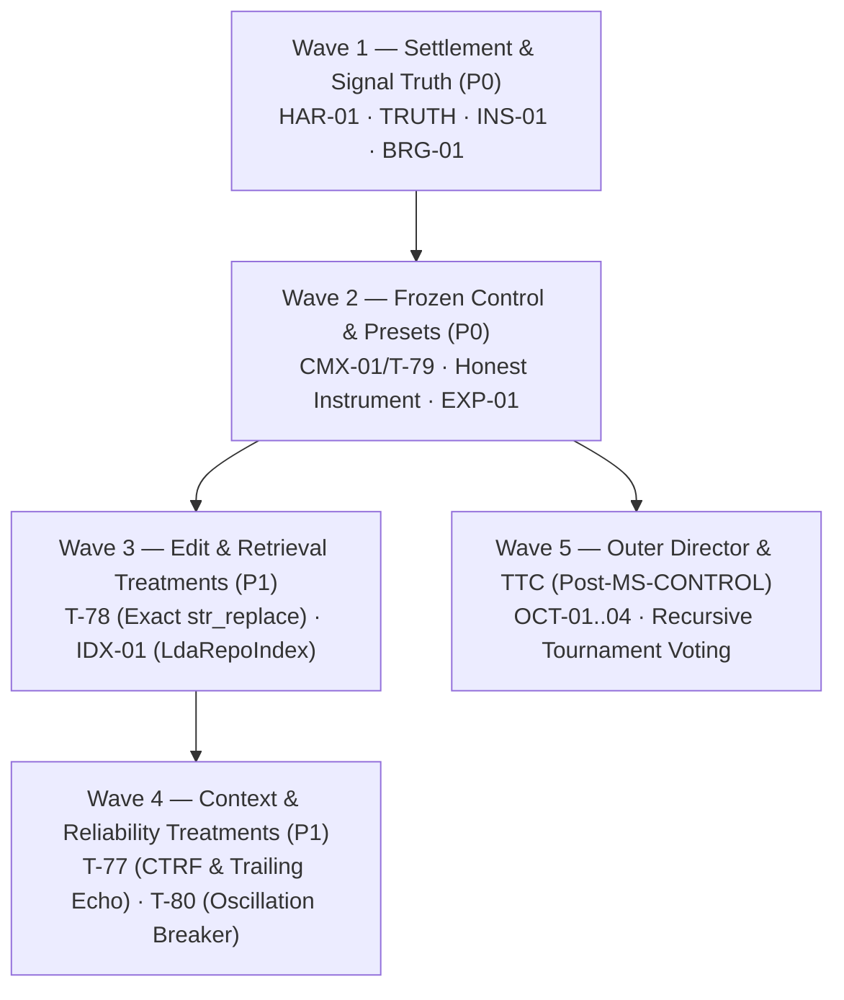

# SOTA Coding Agent Harness: Principal Architectural Blueprint & Production Roadmap

## Executive Summary & Engineering Intent

Autonomous software engineering agents require significantly more than a prompt loop wrapped around LLM tool calling. While toy benchmarks (such as single-file bugfixes on small functions) can be solved with primitive ReAct loops, **industrial-grade real-world software engineering** demands robust answers to five foundational systems challenges:

1. **Long-Horizon Agency & Horizon Collapse**: Complex tasks require 40 to 120 turns of continuous reasoning, exploration, editing, and debugging. Without structured state retention and hierarchical task decomposition, modern LLMs suffer from context dissipation, catastrophic forgetting, and Lost-in-the-Middle attention degradation.
2. **Greenfield Architecture & Multi-File Dependency Graph Synthesis**: Constructing new subsystems, services, or multi-component features requires synthesizing code across dozens of interdependent files in topological order, establishing contracts before implementations, and bootstrapping verification harnesses before runnable tests exist.
3. **Brownfield Blast-Radius Containment & Context Economics**: Operating in multi-million-line legacy repositories requires progressive symbol-level context compilation rather than full-file dumping. The agent must accurately calculate the blast radius of changes and verify downstream contracts without exceeding token budgets or bust prompt cache stability.
4. **Durable State Continuity Across Process Boundaries**: Process restarts, operator interventions, network interruptions, and rate-limit suspensions must not destroy in-flight progress or induce duplicate effect execution. Resumed sessions must seamlessly rebuild cognitive state from durable ledgers.
5. **Deterministic Verification & Anti-Tampering Trust Spines**: Autonomous agents frequently attempt to declare victory prematurely by running redundant tests, modifying test assertions to pass broken code (test poisoning), claiming passes on vacuous stubs, or misinterpreting syntax warnings as semantic passes. A fail-closed, external exterior judge must govern completion, with both **run termination** and **task disposition** settled orthogonally.

This treatise provides the forensic analysis, formal contracts, architectural diagrams, concrete module specifications, and an actionable engineering roadmap aligned with the **Electroweak Synthesis of Record (`ELECTROWEAK_SYNTHESIS_FINAL_v093.md`)**.

---

## 1. Forensic Audit: The 6 Bottlenecks Reconciled Against Working Tree

Through systematic review of `vanguard/packages/` across `domain`, `kernel`, `agency`, `runtime`, and `adapters`, the theoretical bottlenecks have been mapped to their exact verified status in the working tree:

```
+---------------------------------------------------------------------------------------------------+
|                           SOTA HARNESS BOTTLENECK TAXONOMY & AUDIT STATUS                         |
+---------------------------------------------------------------------------------------------------+
|  1. Context-Attention Dissipation         |  2. Greenfield Blindness & Vacuous Passes             |
|     - Sliding window forgets invariants   |     - Lack of Topological Multi-File Creation DAG     |
|     - Addressed by CTRF & Trailing Echo   |     - Toy prompt bans ("Do not read or search first") |
|     - Task T-77 (L3 breaks, L5 echo)      |     - Tasks T-81 (vacuity gate) & T-83a (prompt law)  |
+-------------------------------------------+-------------------------------------------------------+
|  3. Brownfield Blast-Radius Blindness     |  4. In-Flight State & Identity Collision              |
|     - Whole-file dumping context penalty  |     - Hardcoded "run-cli" identity shares ledger      |
|     - Session lacks caller admission      |     - Dual preset catalogs break budget passthrough   |
|     - Tasks T-75 (LDA) & T-83b (callers)  |     - Tasks T-84 (UUID run-id) & T-79 (presets.json)  |
+-------------------------------------------+-------------------------------------------------------+
|  5. Model Dialect Degeneration            |  6. Verification Livelocks & Test Tampering           |
|     - Fenced-JSON tool calls in `note`    |     - TestTamperShield unreferenced (0 callers)       |
|     - Manifest aliases.json unread in OR  |     - Run termination inverted with task disposition  |
|     - Tasks T-82 (recovery) & T-86 (alias)|     - Tasks T-18 (wire shield) & T-72 (settlement)    |
+---------------------------------------------------------------------------------------------------+
```

### 1.1 Bottleneck 1: Context-Attention Dissipation in Long Runs
* **Phenomenon**: In tasks exceeding 30 turns, the LLM context window fills with large command outputs, diff hunks, and historical tool results. Standard sliding-window or naive text compacters truncate early invariant constraints and falsified hypothesis memory, leading to repetitive thrashing.
* **Audit Reality**: `agency/episode/compactor.py` and `context/compiler.py` compact text linearly. `runtime/task_state.py` defines `CodingTaskState`, but operational state was decoupled from turn compilation.
* **Hardened Fix (T-77, T-80)**: Enforce a stable byte-identical L1–L3 prompt prefix (with cache breakpoints), compact test logs into CTRF format (stripping passing traces and capping failure assertion diffs at $\le 1500$ chars), inject a **Trailing Goal Echo** at the tail of L5 to counter Lost-in-the-Middle degradation, and trip an anti-thrashing circuit breaker when workspace tree hash oscillates ($d_t == d_{t-2}$).

### 1.2 Bottleneck 2: Greenfield Blindness & Vacuous Passes
* **Phenomenon**: In greenfield development, an agent frequently creates empty stubs (containing only `pass` or `raise NotImplementedError`) and declares victory when `pytest` exits 0 with zero tests collected. Furthermore, legacy prompt heuristics (*"Write ONE file per turn... Do not read or search first"*) actively sabotaged topological multi-file authoring.
* **Audit Reality**: Greenfield oracle existed in `adapters/evaluators/suites/oracle_greenfield_webapp.py`, but lacked vacuity rejection. `system-prompt.txt` contained toy single-file instructions (**C-12**).
* **Hardened Fix (T-81, T-83a)**: Purge legacy prompt heuristics. Establish the 3-phase greenfield protocol (scaffold stubs $\to$ red tests $\to$ atomic 2PC commit). Enforce a **Vacuity Admission Gate**: suites passing on empty stubs are rejected fail-closed.

### 1.3 Bottleneck 3: Brownfield Blast-Radius Containment & Context Economics
* **Phenomenon**: In large repositories, modifying a core interface breaks downstream callers. Agents unaware of caller graphs enter an unstructured patching frenzy when regression suites fail.
* **Audit Reality**: `.lda/index.db` holds **80,618 relations** and 10,580 symbols, and `multi_file_completeness.py` accepts `callers_by_symbol`. However, `runtime/session.py::_admit_completion` never queried `IndexPort` or passed callers (**C-13**).
* **Hardened Fix (T-75, T-76, T-83b)**: Implement `LdaRepoIndex` behind `IndexPort`. Bind `repo.*` observation verbs strictly into L5 (preserving L1–L3 cache stability). Wire `IndexPort.get_callers` into `session._admit_completion` to reject completion if public API signatures change without inspecting dependent call sites.

### 1.4 Bottleneck 4: In-Flight State Severance & Identity Collisions
* **Phenomenon**: Session restarts or approvals must seamlessly reconstruct cognitive state from SQLite WAL ledgers without re-executing settled effects.
* **Audit Reality**: `runtime/entrypoint.py:56` hardcoded `run_id = ... or "run-cli"`, causing independent CLI runs in the same workspace to collide on the same ledger (**C-14**). Furthermore, `apps/coding_max/facade.py` routed presets to byte-identical alias manifests with empty budget policies, completely ignoring `packs/code-default/presets.json` (**C-5/C-6**).
* **Hardened Fix (T-84, T-79)**: Mint unique UUID/ULID run identities on every invocation (reserving `--resume <id>` as the sole continuation path). Unify preset selection on `presets.json` (`$0.05`/8t, `$0.15`/20t, `$0.40`/40t) so distinct ceilings are durably enforced.

### 1.5 Bottleneck 5: Model Dialect Degeneration & Tool-Calling Syntax Drift
* **Phenomenon**: Frontier and local models frequently emit structured tool calls within markdown-fenced code blocks inside prose notes, or drift from strict JSON schemas.
* **Audit Reality**: In live trial `gf-orders-001`, the agent abandoned at turn 3 with 0 effects because a tool call embedded in a `note` was parsed as `action: null`, falling through to an unprompted `finish` (**C-11**). Furthermore, `adapters/models/openrouter.py:1204` failed to pass manifest `aliases.json` to `ProposalTranslator` (**C-16**).
* **Hardened Fix (T-82, T-86, T-90)**: Unpack markdown-fenced JSON action blocks in notes into candidate proposals. Pass `aliases.json` on the live path with strict validation (zero fuzzy tool-name guessing). Record raw-response digests and typed dialect classifier classes into the ledger.

### 1.6 Bottleneck 6: Verification Livelocks & Test Oracle Tampering
* **Phenomenon**: Agents alter test assertions to manufacture green exits (test poisoning), or spin indefinitely re-running passing suites.
* **Audit Reality**: `TestTamperShield` was implemented in `vanguard/packages/runtime/governance/tamper_shield.py`, but had **zero production callers** in the entire codebase (**C-4**). Additionally, benchmark reporting conflated run termination with evaluation outcomes, causing 8 oracle-passing runs to be mislabeled as abandonments (**C-2**).
* **Hardened Fix (T-18, T-72)**: Reopen and wire `TestTamperShield` into `session._admit_completion`. Establish the **Two-Axis Settlement Contract** (`TaskDisposition` ⟂ `RunTermination`) in `domain/evidence/disposition.py` so termination and evaluation axes are recorded independently without collapsing.

---

## 2. Target SOTA Architecture: Formal Protocols & Invariants

To eliminate these bottlenecks permanently while respecting the **Trusted Computing Base budget ($\le 1438$ logical LOC, currently 1,386 LOC)** and hexagonal boundaries (`domain ← ports ← kernel ← agency ← runtime → adapters`), Vanguard implements five architectural pillars across four Interception SPIs:

```
+---------------------------------------------------------------------------------------------------+
|                                SOTA CODING HARNESS ARCHITECTURE                                   |
+---------------------------------------------------------------------------------------------------+
|                                                                                                   |
|  +---------------------------------+             +---------------------------------------------+  |
|  |   Pillar I: Task State Spine    |             |    Pillar II: Context Economics Pipeline    |  |
|  |  - SemanticTaskState (CAS)      | <---------> |  - Progressive Context Compiler (PCC)       |  |
|  |  - Topological Task DAG         |             |  - L1–L3 Prefix Cache Breakpoints           |  |
|  |  - Falsified Hypothesis Memory  |             |  - CTRF Distillation & Trailing Goal Echo   |  |
|  +---------------------------------+             +---------------------------------------------+  |
|                  |                                                      |                         |
|                  v                                                      v                         |
|  +---------------------------------+             +---------------------------------------------+  |
|  |  Pillar III: Multi-File 2PC     |             |   Pillar IV: Verification & Trust Spine     |  |
|  |  - Exact str_replace Primitive  | <---------> |  - TestTamperShield (Admit Wire, T-18)      |  |
|  |  - 2PC Atomic Rollback          |             |  - Vacuity Admission Gate (T-81)            |  |
|  |  - AST Syntax Preflight (Adapters)|           |  - Two-Axis Settlement (TaskDisposition)    |  |
|  +---------------------------------+             +---------------------------------------------+  |
|                                                                                                   |
|                      +-----------------------------------------------------+                      |
|                      |         Pillar V: Resilient Dialect Adapter         |                      |
|                      |  - Fenced JSON Note Unwrapping (T-82)               |                      |
|                      |  - Live Manifest Aliases Validation (T-86)          |                      |
|                      |  - Raw-Response CAS Digest Provenance (T-90)        |                      |
|                      +-----------------------------------------------------+                      |
+---------------------------------------------------------------------------------------------------+
```

### 2.1 Pillar I: The Semantic Cognitive State Spine (`SemanticTaskState`)

Instead of relying on LLM memory or raw message histories, long-running agents maintain a **Durable Semantic State Vector** committed to the ledger.

#### Domain Wire Contract: `vanguard/packages/domain/task_state.py`
```python
from __future__ import annotations
from dataclasses import dataclass
from enum import Enum

class StepStatus(str, Enum):
    PENDING = "pending"
    IN_PROGRESS = "in_progress"
    VERIFIED = "verified"
    BLOCKED = "blocked"

@dataclass(frozen=True, slots=True)
class TaskStep:
    step_id: str                      # Monotonic: "step-001"
    title: str                        # Concise objective
    target_files: tuple[str, ...]     # Scope: ("ports/storage.py",)
    dependencies: tuple[str, ...]     # Pre-requisites: ()
    status: StepStatus
    falsification_evidence: str | None = None
    verification_hash: str | None = None

@dataclass(frozen=True, slots=True)
class SemanticTaskState:
    run_id: str
    revision: int
    overarching_goal: str
    active_step_id: str | None
    backlog: tuple[TaskStep, ...]
    falsified_hypotheses: tuple[str, ...]
    settled_invariants: tuple[str, ...]
    changed_files_tree_hash: str
```

#### Invariants:
* **I-STATE-1 (Monotonic Revision)**: Every update increments `revision` and emits `TaskStateCheckpoint` with a canonical SHA-256 state digest.
* **I-STATE-2 (Zero Context Amnesia)**: Compaction algorithms are strictly forbidden from altering or omitting `settled_invariants` and `falsified_hypotheses`. They are injected as the immutable cognitive prefix of every turn.
* **I-STATE-3 (TCB Boundary)**: Semantic task state management resides in `domain/` and `agency/`. It adds **zero lines to `kernel/`**.

---

### 2.2 Pillar II: Progressive Context Economics, CTRF Distillation & Trailing Goal Echo

Loading entire files wastes tokens, evicts model attention, and busts prompt caching. SOTA harnesses employ **Progressive Disclosure** and cache stabilization:

```
L1: System Prompt & Immutable Operating Law (Byte-frozen prefix)
    |
L2: Tool Contracts & Manifest Capabilities (Byte-frozen prefix)
    |
L3: Repository Architecture Orientation & Stable Invariants (Byte-frozen prefix)
======================================================================== [Cache Breakpoint]
L4: Dynamic Working State & Progressive Slices (Symbol signatures / active diffs)
    |
L5: Bounded Observations (repo.* queries) + CTRF Test Distillation + Trailing Goal Echo
```

#### Protocols:
1. **L3 Cache Breakpoints (T-77)**: Emit provider cache breakpoints at the L3 boundary to achieve $\ge 85\%$ prefix cache hit rates on turns $\ge 2$.
2. **CTRF Test Distillation (T-77)**: Parse raw test output into compact Common Test Report Format (CTRF). Strip passing test traces completely and cap failure assertion diffs at $\le 1500$ characters. Full verbose traces are stored in CAS by digest (`.aether/blobs/sha256_<digest>`).
3. **Trailing Goal Echo (T-77)**: In turns $\ge 30$, append a compact Trailing Goal Echo at the tail of L5 to eliminate Lost-in-the-Middle attention decay.

---

### 2.3 Pillar III: Greenfield Multi-File Synthesis & Two-Phase Commit (2PC)

To prevent partial, half-broken multi-file mutations, changes settle through a **Two-Phase Commit (2PC) Transaction Protocol** in the adapter layer (`adapters/environment/transaction.py`):

```
Agent Proposes Transaction (File A, File B, File C)
    |
Phase 1: PRE-FLIGHT (In-Memory Shadow Tree)
    |---> Syntax Check (ast.parse on all targets in adapters, NEVER in kernel)
    |---> Exact Preimage Match (Unique match; trimmed-EOL only; NO fuzzy cascade)
    |---> Symbol Export/Import Linkage
    |
Phase 2: COMMIT or ROLLBACK
    |---> If all checks PASS: Atomic write to disk, emit TransactionCommitted
    +---> If any check FAILS: Rollback shadow tree, emit TransactionRejected (PATCH_PREIMAGE_MISMATCH)
```

#### Protocol Guarantees:
* **Exact `str_replace` (T-78)**: Replaces fuzzy matching cascades with exact string matching. Indentation is syntax in Python and YAML; fuzzy relocation causes silent nesting defects. Loud failure and forced re-read is strictly superior.
* **Kernel AST Prohibition**: Invariant I-7 and I-TXN mandate that `ast.parse` resides exclusively in `adapters/environment/transaction.py`. Zero AST imports are permitted in `kernel/`.

---

### 2.4 Pillar IV: Synthetic Test Oracle Engine & Anti-Tamper Trust Spine

In greenfield development, no tests exist upfront. To prevent false completions:
1. **The 3-Phase Greenfield Protocol (T-83a)**: Scaffold baseline stubs $\to$ Author synthetic red test falsifiers $\to$ Atomic 2PC implementation commit.
2. **Vacuity Admission Gate (T-81)**: If the test suite executed against empty stubs (containing only `pass` or `raise NotImplementedError`) returns 0 failures, completion is rejected with typed `VACUOUS_ORACLE_REJECTED`.
3. **TestTamperShield Wiring (T-18)**: Reopen T-18 and wire `tamper_shield.py` into `session._admit_completion`. If an agent modifies or deletes test assertions to force a green exit, completion fails closed with typed `TEST_TAMPERING_DETECTED`.
4. **Two-Axis Settlement Contract (T-72)**: Run termination (`RunTermination`) and task disposition (`TaskDisposition`) are kept strictly orthogonal in `domain/evidence/disposition.py`. A run that passed tests but burned its final turn saying so settles honestly as `terminal=abandoned` and `disposition=passed`.

---

### 2.5 Pillar V: Resilient Model Dialect Adapter (`SelfHealingDialect`)

The dialect layer sits between raw model responses and the kernel dispatch pipeline:

```
Raw Model Stream / Completion Chunk
    |
    v
1. Strict Proposal Translator
    |---> Success -> Dispatch
    +---> Failure -> Resilient Extraction SPI
                        |---> Fenced JSON Unwrapping (T-82: extracts tool proposals from note fields)
                        |---> Manifest Aliases Resolution (T-86: maps aliases.json to canonical verbs)
                        |---> Raw-Response Digest CAS Recording (T-90: emits typed dialect classifier)
```

---

## 3. Concrete Module Implementation Specifications

### 3.1 Module 1: `vanguard/packages/agency/episode/task_dag.py`
**Responsibility**: Manages multi-step plans as a topological DAG without adding domain concepts to the kernel.

```python
"""Topological Task Step DAG for Complex Software Engineering Campaigns."""

from __future__ import annotations
from dataclasses import dataclass
from enum import Enum
import graphlib
from typing import Sequence

class StepState(str, Enum):
    PENDING = "pending"
    READY = "ready"
    ACTIVE = "active"
    VERIFIED = "verified"
    FAILED = "failed"

@dataclass(frozen=True, slots=True)
class PlanStep:
    id: str
    objective: str
    target_paths: tuple[str, ...]
    dependencies: tuple[str, ...] = ()
    state: StepState = StepState.PENDING
    failure_log: str | None = None

class TaskExecutionGraph:
    def __init__(self, steps: Sequence[PlanStep]):
        self._steps: dict[str, PlanStep] = {s.id: s for s in steps}
        self._validate_acyclic()

    def _validate_acyclic(self) -> None:
        graph = {s.id: set(s.dependencies) for s in self._steps.values()}
        sorter = graphlib.TopologicalSorter(graph)
        sorter.prepare()

    def get_executable_steps(self) -> tuple[PlanStep, ...]:
        ready: list[PlanStep] = []
        for step in self._steps.values():
            if step.state != StepState.PENDING:
                continue
            if all(self._steps[d].state == StepState.VERIFIED for d in step.dependencies):
                ready.append(step)
        return tuple(ready)

    def mark_step_verified(self, step_id: str) -> TaskExecutionGraph:
        updated = dict(self._steps)
        curr = updated[step_id]
        updated[step_id] = PlanStep(
            id=curr.id,
            objective=curr.objective,
            target_paths=curr.target_paths,
            dependencies=curr.dependencies,
            state=StepState.VERIFIED
        )
        return TaskExecutionGraph(tuple(updated.values()))
```

---

### 3.2 Module 2: `vanguard/packages/runtime/governance/tamper_shield.py` (Admit Wiring)
**Responsibility**: Wire the existing, unreferenced `TestTamperShield` into `runtime/session.py::_admit_completion`.

```python
# In vanguard/packages/runtime/session.py::_admit_completion
from vanguard.packages.runtime.governance.tamper_shield import TestTamperShield

def _admit_completion(self, proposal: Proposal) -> AdmissionResult:
    # 1. Verify tamper shield before accepting claim
    if self._tamper_shield is not None:
        integrity_ok, reason = self._tamper_shield.verify_no_test_tampering()
        if not integrity_ok:
            return AdmissionResult.reject(
                code="TEST_TAMPERING_DETECTED",
                detail=reason
            )
            
    # 2. Check callers of modified public symbols (T-83b)
    if self._index_port is not None:
        callers = self._index_port.get_callers(self._completion_changed_symbols)
        uninspected = set(callers) - self._completion_inspected_files
        if uninspected:
            return AdmissionResult.reject(
                code="UNINSPECTED_CALLERS_REMAINING",
                detail=f"Modified public symbols have uninspected call sites: {sorted(uninspected)}"
            )
            
    # 3. Normal verification checks...
    return AdmissionResult.admit()
```

---

## 4. Operational Guidelines: Complex Problem Workflows

### 4.1 Greenfield Campaign Workflow
```
[OPERATOR BRIEF: Create New Subsystem]
       |
       v
STAGE 1: ARCHITECTURAL DECOMPOSITION (Turn 1–2)
  - Inspect existing ports/domain types using `repo.*` L5 tools.
  - Formulate task backlog in topological order.
       |
       v
STAGE 2: CONTRACT DEFINITION (Turn 3–4)
  - Create pure types in `domain/` and protocols in `ports/`.
  - Validate with AST preflight.
       |
       v
STAGE 3: SYNTHETIC ORACLE CREATION & VACUITY GATE (Turn 5–6)
  - Author test suite under `test/`.
  - RUN TESTS: Tests MUST FAIL with `NotImplementedError` or `ImportError`.
  - Vacuity gate (T-81) rejects suite if passing on empty stubs.
  - Baseline test hash frozen in `TestTamperShield` (T-18).
       |
       v
STAGE 4: TOPOLOGICAL IMPLEMENTATION (Turn 7–N)
  - Implement modules in dependency order using atomic 2PC `str_replace` (T-78).
  - Re-run synthetic tests until green.
       |
       v
STAGE 5: TWO-AXIS ADMISSION & SETTLEMENT
  - Tamper shield confirms test assertions unmutated.
  - Bound external verifier certifies pass. Emit `SettlementReceipt`.
```

### 4.2 Brownfield Refactoring Campaign Workflow
```
[OPERATOR BRIEF: Bug Report / Refactor]
       |
       v
STAGE 1: MINIMAL REPRODUCTION (Turn 1–3)
  - Locate failing site via `repo.search_symbols` / `repo.get_callers`.
  - Execute test via `proc.exec`. Capture exact failure text.
       |
       v
STAGE 2: CAUSAL LOCALIZATION & BLAST RADIUS (Turn 4–5)
  - Identify blast radius: callers of target symbols via `IndexPort.get_callers`.
  - Formulate competing hypotheses.
       |
       v
STAGE 3: SURGICAL EDIT (Turn 6–8)
  - Apply exact `str_replace` patch via 2PC transaction manager (T-78).
  - Run reproduction test first.
       |
       v
STAGE 4: REGRESSION CLEARANCE & ANTI-THRASHING (Turn 9–11)
  - Run package regression suite.
  - If workspace tree hash oscillates ($d_t == d_{t-2}$), trip circuit breaker (T-80).
       |
       v
STAGE 5: ADMISSION
  - Multi-file completeness confirms all caller files inspected (T-83b).
  - Emit two-axis settlement receipt.
```

---

## 5. Phased Engineering Roadmap: Canonical Waves 1 to 5

This roadmap replaces abstract wave numbering with the **five verified, file-bounded execution waves** of the Electroweak Synthesis of Record:



| Wave | Primary Packages | Key Deliverables & Targets | Executable Falsifier |
|---|---|---|---|
| **Wave 1** | **HAR-01**, **TRUTH**, **INS-01**, **BRG-01** | • Capability-bound native profiles (`T-69`)<br/>• Approval threshold passthrough (`T-70`)<br/>• Declare `finish-tool.json` (`T-71`)<br/>• Two-Axis Settlement (`domain/evidence/disposition.py`, `T-72`)<br/>• Remove `ADMISSION_GATE_EXEMPT` (`T-04`)<br/>• Wire `TestTamperShield` into `session` (`T-18`)<br/>• Greenfield vacuity rejection check (`T-81`)<br/>• Fenced JSON action unwrapping (`T-82`)<br/>• Greenfield prompt deconfliction (`T-83a`)<br/>• Caller admission (`T-83b`)<br/>• UUID run identity (`T-84`)<br/>• Fail-closed llama.cpp bridge (`T-87`, `T-88`) | `test_settlement_disposition.py`<br/>`test_approval_passthrough.py`<br/>`test_manifest_components.py`<br/>`test_dialect_fenced_action_recovery.py`<br/>`test_multi_file_callers_admission.py`<br/>`test_run_identity.py`<br/>`test_llama_bridge_lifecycle.py` |
| **Wave 2** | **CMX-01**, **EXP-01**, **INS-01** | • Unify presets on `presets.json` (`T-79`)<br/>• Receipt telemetry passthrough (`T-85`)<br/>• Route benchmarks through `entrypoint.execute` (`T-89`)<br/>• L0 smoke triad (`T-92`) & L1 twelve-task pre-canary (`T-93`)<br/>• False-completion rate = 0 hard veto (`T-94`)<br/>• Qualify `MS-CONTROL` on frozen candidate SHA ($N \ge 30$) | `test_preset_budgets.py`<br/>`test_receipt_telemetry.py`<br/>`test_product_path_subject.py`<br/>`test_l0_triad.py`<br/>`test_metric_veto.py` |
| **Wave 3** | **CHANGE**, **IDX-01**, **DLG-01** | • Exact `str_replace` 2PC primitive (`T-78`)<br/>• `LdaRepoIndex` adapter over `.lda/index.db` (`T-75`)<br/>• `repo.*` observation tools bound into L5 (`T-76`)<br/>• Live manifest alias validation (`T-86`)<br/>• Raw-response CAS digest provenance (`T-90`) | `test_str_replace_exact.py`<br/>`test_lda_repo_index.py`<br/>`test_l5_only_observations.py`<br/>`test_live_alias_validation.py`<br/>`test_dialect_provenance.py` |
| **Wave 4** | **CONTROL**, **SEE** | • L3 cache breakpoints & Trailing Goal Echo (`T-77`)<br/>• CTRF test log distillation ($\le 1500$ chars)<br/>• Anti-thrashing oscillation breaker ($d_t == d_{t-2}$, `T-80`) | `test_cache_breakpoints.py`<br/>`test_anti_thrashing_circuit_breaker.py` |
| **Wave 5** | **OCT-01..04**, **ARM-01** | • Outer-loop campaign director (`OCT-03`)<br/>• Isolated git worktrees & CAS mailbox (`OCT-01`)<br/>• Test-Time Compute (TTC) scaling & RTV<br/>• Multi-agent comparison arm program (`T-96`) | `test_campaign_director.py`<br/>`test_arm_matrix.py` |

---

## 6. Verification Checklist & Invariants for Developers

When implementing components from this blueprint, contributors and agents MUST verify:
- [ ] **TCB LOC Guardrail**: Production kernel LOC does not exceed $\le 1438$ logical lines (`python3 tools/linters/check_tcb_budget.py` reports **1,386 unchanged**).
- [ ] **Hexagonal Flow**: `domain ← ports ← kernel ← agency ← runtime → adapters`. Adapters never import `kernel` or `agency`.
- [ ] **Kernel Domain Blindness (I-7)**: Zero AST imports, zero SQLite imports, and zero coding-specific heuristics enter `kernel/`.
- [ ] **Two-Axis Settlement (T-72)**: `RunTermination` (how run ended) and `TaskDisposition` (what oracle said) are strictly decoupled.
- [ ] **Hard Veto on Benchmarks**: False-completion rate must equal exactly **0**. No pass rate or token lift overrides this veto.
- [ ] **Hermetic Testing**: All contract tests pass without live network access or unrecorded ambient environment variables.
