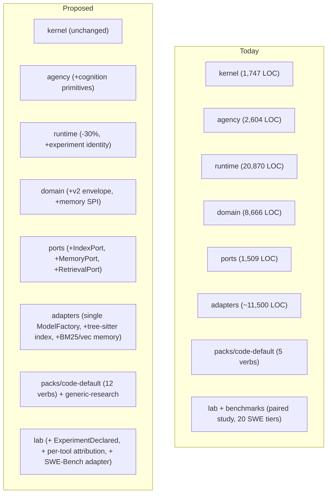
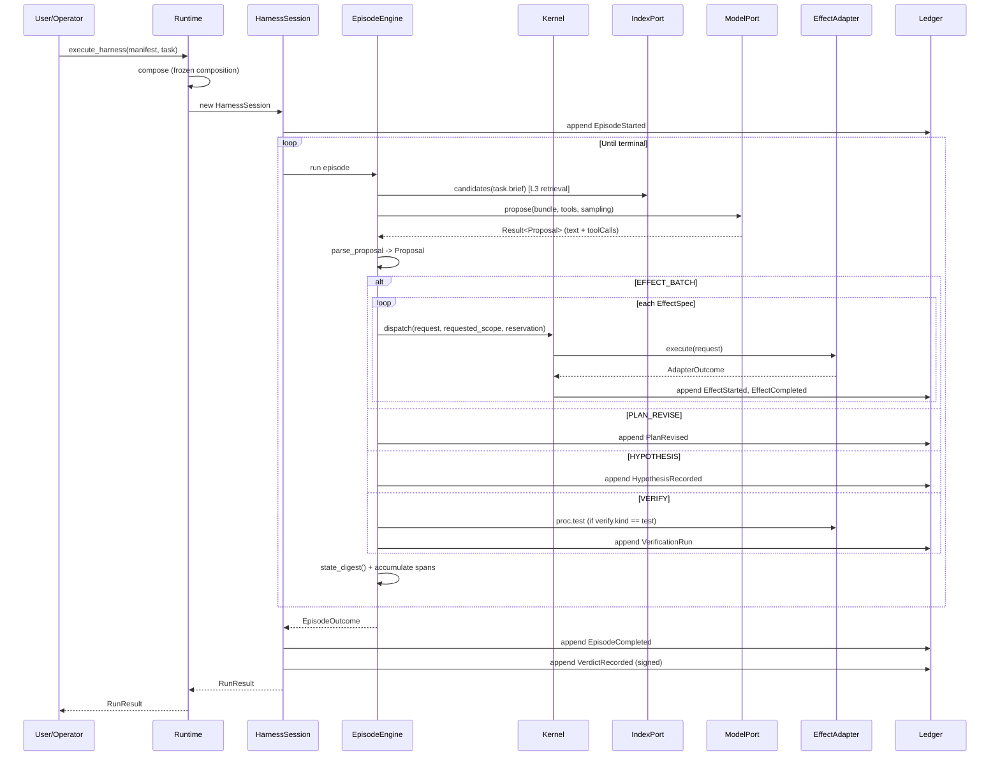
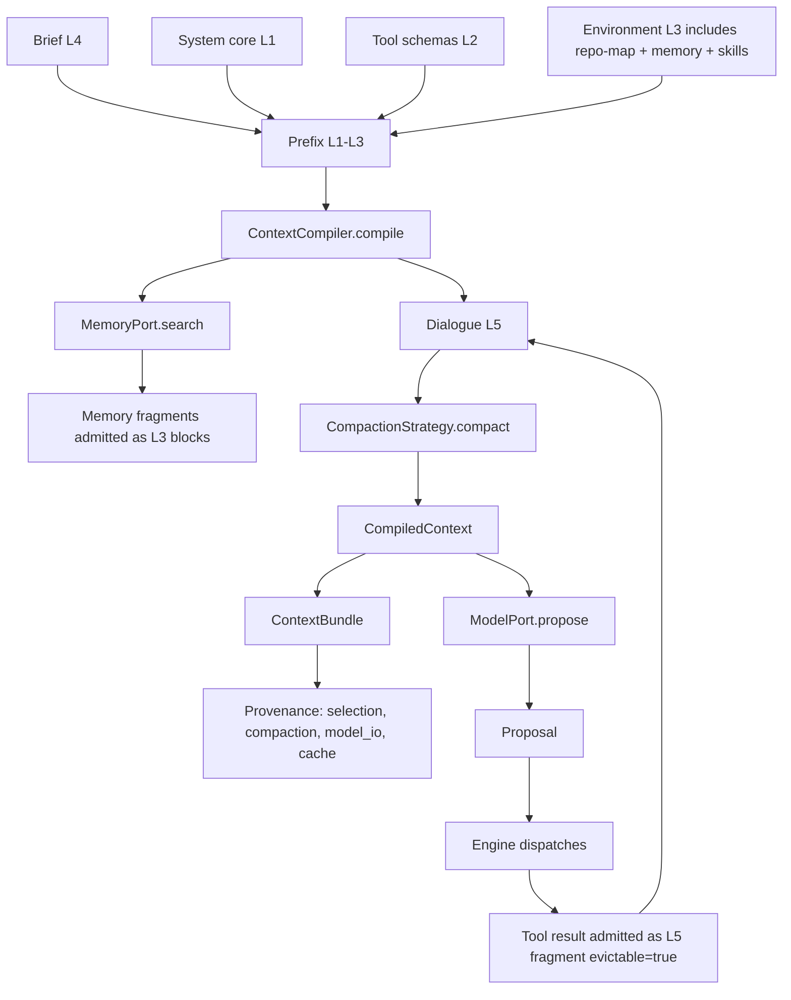
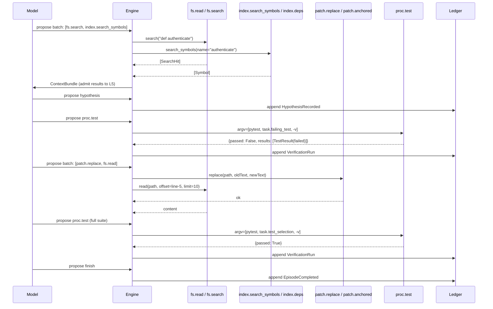
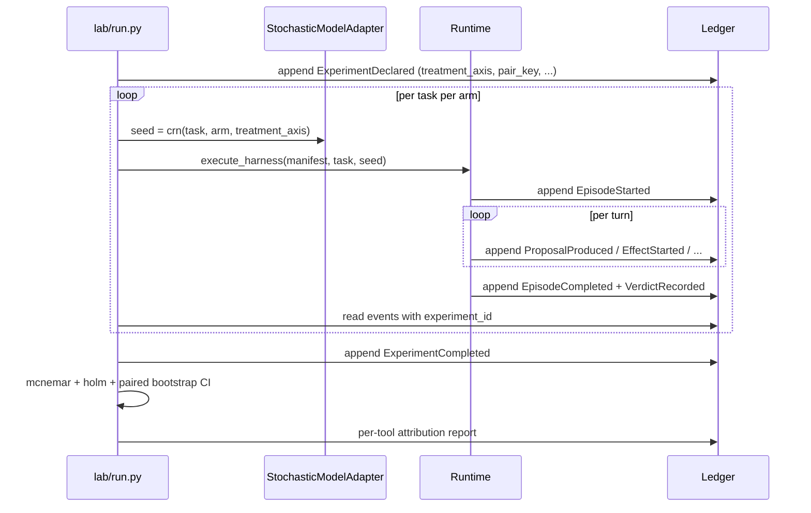
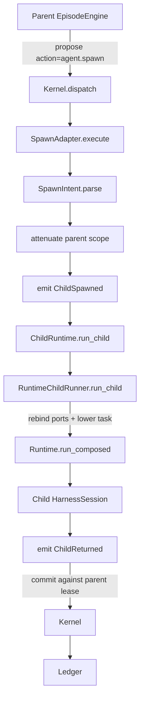
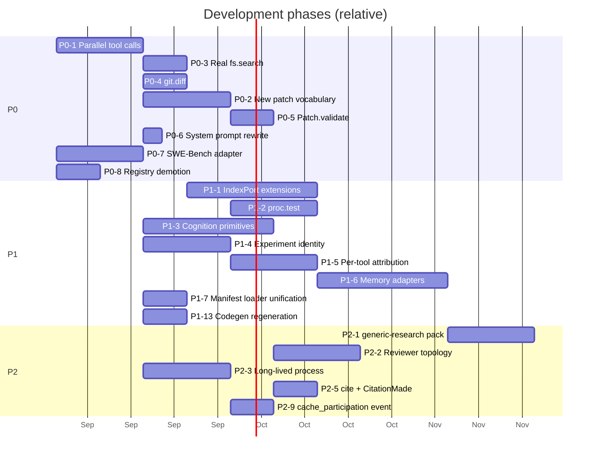

# K3 — Vanguard Backend: Principal Architecture & Agentic Capability Review

A code-first review of the Vanguard / AETHER backend (`vanguard/packages/`,
`packs/`, `lab/`, `benchmarks/`, `tools/`, `schemas/`, `docs/`) conducted
against the declared normative law (`docs/SPEC.md`, `docs/01_law/`,
ADRs through `0103`) and the live execution board (`docs/03_execution/`).
No code is modified by this document. Every claim is tagged with one of
**Observed** (directly supported by current source/active docs),
**Inferred** (a derived conclusion), **Proposed** (a recommendation), or
**Experimental** (plausible but requires measurement).

## Reading guide

- The **Executive Verdict** (§1) is the principal-architect summary.
- §2–§5 describe what exists, what should be preserved, and what is weak.
- §6–§18 are diagnostic and gap analysis, organised by the mechanism being
  asked to support a general agentic framework.
- §19–§35 are the proposed changes, with priority and effort.
- §33 is the explicit list of what to *not* build.
- Throughout, every major proposition includes a P0–P3 / Reject tag and
  expected impact ratings.

> File-anchored abbreviations used below:
> `kernel/` = `vanguard/packages/kernel/` (1,747 LOC),
> `agency/` = `vanguard/packages/agency/` (2,604 LOC),
> `runtime/` = `vanguard/packages/runtime/` (20,870 LOC),
> `domain/` = `vanguard/packages/domain/` (8,666 LOC),
> `ports/` = `vanguard/packages/ports/` (1,509 LOC),
> `adapters/` = `vanguard/packages/adapters/` (~11,500 LOC across
> models/sandbox/stores/evaluators/environment/context/bindings).
> Total backend Python ≈ 47,000 LOC across the production lattice.

---

## 1. Executive Verdict

Vanguard today is a **domain-blind substrate with a 1,373-LOC TCB, a deeply
worked-out event-sourced ledger, and one credible general primitive —
recursive delegation through the same run path.** That core is genuinely
strong. The fragility lives elsewhere.

The four findings a principal architect must act on first:

1. **The tool surface is the bottleneck for every agentic application, and
   it is currently too thin to be competitive on coding, research, or
   document-analysis workloads.** The kernel is general; the packs are not.
   `packs/code-default/` exposes only `fs.read`, `fs.search`, `patch.apply`,
   `proc.exec`, `index.refresh` — five verbs. There is no symbol search, no
   semantic search, no structured edit-by-anchor over arbitrary languages, no
   directory listing, no diff inspection, no test selection, no LSP, no
   background observation. The system-prompt (`packs/code-default/system-prompt.txt`)
   tells the model to use *one tool per turn* and forbids parallel calls.
   For SWE-Bench-class tasks this is the largest single cause of
   under-performance, and it is a **pack problem, not a kernel problem**.

2. **The agent loop is a *prompt-then-act* loop, not a *plan-then-act-verify*
   loop.** The episode engine (`agency/episode/engine.py`) has no first-class
   notion of a plan, a hypothesis, a verification step, or a failure
   classification. Termination is decided by `max_turns`, the
   `no_progress_limit` heuristic (`VG-03 §6.4`), and budget exhaustion. The
   `compaction.structured_consolidate` strategy is a placeholder that
   substring-matches "failed"/"error" — not a real consolidation pass. There
   is no critic, no reflection, no retry-with-replanning primitive.
   Reasonable for now; the cost is bounded only by what the kernel enforces
   on retries. The opportunity is a small set of *opt-in* cognition
   primitives that sit alongside the engine without growing the TCB.

3. **The runtime is large and the layering is leaking.** `runtime/` is
   20,870 LOC (about 12× the kernel). It does not enforce its own
   hexagonal boundary: the `LedgerEmitter` (441 LOC) lives next to wiring,
   policy, evaluation and governance concerns; `service/server.py` is a
   Unix-domain-socket RPC for `RuntimeService`; `service/studio_gateway.py`
   is a separate transport for the same core. There is duplicate file-locking
   and per-event transaction code; the same sqlite pattern appears in
   `event_store.py`, `ledger_emitter.py`, `memory_engine.py`. The `RunResult`
   construction in `HarnessSession.run` is a 100+ line sequence of imperative
   steps that must be re-entered at the right offset for the resume path to
   hold (this is the `C-04`/`D9` invariant the comments in `session.py`
   defend at length — proof of a real failure mode, not a property). Several
   capabilities are described by both a *concept* in `kernel/model.py` and
   an equivalent in `domain/wire/types_gen.py`, drift is held only by
   comments, and the wiring layer reaches into both.

4. **The experimental / scientific apparatus is real but untyped.** There
   is a McNemar-exact paired study (`lab/m65_study.py` + `bench.py`), a
   stochastic perturbation harness (`adapters/models/stochastic.py`),
   topology measurement (`lab/m701_independence.py`, `lab/topology_analysis.py`),
   and a `lab/lab_driver.py` for reproducing composition roots. There is
   *no* first-class experiment identity in the ledger, *no* in-the-loop
   mechanism to attribute a metric to a single feature, *no* paired-run
   dataset for SWE-Bench-style tasks (only the synthetic SWE-Pro tiers
   in `benchmarks/swe_bench/challenges.py` which embed the oracle code
   in the task file itself). A "did planner-on help?" question is
   answerable; a "did adding `fs.symbols` help on SWE-Bench?" question is
   only answerable by running the lab by hand and re-pointing the index
   port.

The single strategic direction that follows: **shift the development
budget from "more kernel invariants" to "richer, swappable, scientifically
measurable capabilities above the kernel."** The TCB is already over-fit
to a regime (one-shot kernel-bound effects with monotonic attenuation) that
the agentic substrate does not actually need to enforce. The agentic value
sits in:

- a richer, swap-in, forkable tool surface (`packs/`) with a small,
  composable *task* vocabulary (read / search / plan / patch / test / verify);
- an opt-in cognition layer (plan revision, failure classification, evidence
  admission, retriever) that lives above the kernel and below the
  per-pack prompt;
- an experiment-and-trajectory substrate that lets a single fact in the
  ledger carry "this was the planner-on / planner-off run for task
  X, seed Y, code-default pack" so ablations become a query, not a
  re-execution;
- deliberate pruning of the runtime's *non-TCB* surface (ledger/projection
  work, event schema evolution, stale/dual-written code).

**Top-priority work, ordered by capability impact:** (1) Task tool surface
for coding/research/document-analysis packs; (2) Experiment and ablation
substrate; (3) Plan/Hypothesis/Verify cognitive primitives above the
kernel; (4) A 30–50% reduction in `runtime/` non-TCB surface; (5) A
single canonical reasoner adapter, not four (`openrouter` + `ollama` +
`cassette` + `stochastic` + `lam` + `planner`); (6) Memory port that
actually ranks (semantic + lexical) and a *usable* index port (real
language-aware symbols, not just Python regex).

---

## 2. Current Backend Architecture (As Built)


**Observed** the TCB is the 13-stage dispatch path (`kernel/dispatch.py`),
the budget governor (`kernel/budget.py`), the grant/attenuation machinery
(`kernel/grants.py`, `kernel/attenuation.py`), the policy/classifier
(`kernel/policy.py`, `kernel/classifier.py`), and the small `kernel/model.py`
holding `EffectRequest`, `Event`, `FailurePath`, `Occurrence`, `AdapterOutcome`,
`SinkClass`, `Span`, `Trust`. The kernel imports only `domain/` and
`ports/`. Total: 1,747 LOC against a 1,438 budget
(`tools/linters/check_tcb_budget.py`).

**Observed** `runtime/` is the orchestration lattice — it is **not** TCB,
it is the only path between the public facade and the kernel. It is
large because the public facade `Runtime.execute_harness` and
`Runtime.execute_profiled` (`runtime/root.py:69-244`) thread the entire
bootstrap: `bwrap` resolution, `RootlessSandboxRunner`, `WorkerProtocol`,
`SandboxedEnvironmentAdapter`, `OpenRouterModel`, `SqliteEventStore`,
capture policy, memory binding, experience binding, child-runtime binding,
executor profile, meta-controller, controller confidence, profile digest,
activation plan, topology lowering, ledger writer anchor. **Inferred**
this is where most of the *fragility* in the system lives; the kernel is
rarely the part that breaks.

---

## 3. Code vs Documentation Findings

The repository is unusual in how *little* gap there is between code and
docs in the TCB. Below are the substantive discrepancies, ordered by
consequence.

### 3.1 Multi-writer ledger is closed (good) but envelope construction is dual-written

**Observed** `runtime/ledger_emitter.py:33-118` declares a single
canonical writer with role-scoped facades (`kernel`, `session`, `scheduler`,
`registry`, `spawn_adapter`, `evaluator_gateway`, `approval`, `recovery`,
`orchestrator`) and rejects deprecated kinds. **Inferred** the dual-read
support across `mhf.event/1` and `/2` is implemented via anchor loading
(`ledger_emitter.py:186-197`) and is the load-bearing piece for
restart-resume — it is correct and well-tested.

**Observed** `domain/ledger/events.py:80-101` still preserves
`DEPRECATED_KINDS` and `READABLE_KINDS` even though the comment at line 53
admits the catalog drift was only closed in a specific M-2 patch
(2026-08-20). The note in the docstring on line 60-67 lists *fifteen*
event kinds still being treated as live by the reducer that are not in
the generated `EventKind` enum (`schemas/mhf/event_envelope.schema.json`).
**Inferred** the catalog-vs-reducer relationship is being held by
comments and `_WireEventKind` diffs, not by code; the `test_contracts/test_event_coverage.py`
test is the only thing keeping this honest.

### 3.2 README claims a 13-stage pipeline; the code is 12

**Observed** `README.md:128` says "13-stage effect dispatch (S0–S12)". The
13 stages are in fact S0–S12 (13 named stages: ENTER, PARSE, RESOLVE,
DESCRIBE, CLASSIFY, AUTHORIZE, GRANT, RESERVE, VERIFY, INTENT, DISPATCH,
COMMIT, RELEASE, EMIT — actually 14 if ENTER and S0 are counted). The
header in `kernel/dispatch.py:1-20` is consistent ("S0 ENTER", "S1 PARSE",
…, "S12 EMIT"). **Inferred** this is cosmetic but reveals a per-stage
numbering scheme that has shifted more than once (`S8a INTENT`, `S6`/`S7`/
`S8` non-contiguous) and the diagram in `docs/04_architecture/overview.md`
should be the canonical map, not the README summary.

### 3.3 Manifest packs live twice

**Observed** `packs/code-default/` declares via `plugin.yaml` and
`harness.yaml` (MHF), while `vanguard/packages/agency/manifests/` defines
its own `ManifestLoader` reading `mhf.manifest/2` from `schemas/mhf/manifest_v2.schema.json`,
plus a separate `mhf.harness/1` schema in `schemas/mhf/harness-manifest.schema.json`.
`packs/code-default/load.py` then uses neither of the agency loaders —
it uses a hand-written `tools/common/simple_yaml` and `runtime/registry/compiler.compose`.
**Inferred** there are *three* ways to load a pack: the agency
`ManifestLoader` (`agency/manifests/loader.py`), the legacy
`load_harness`/`compile_pack` in the pack, and the `compose` function
called from `Runtime.execute_harness`. The first two are dead paths for
the production runtime; the third is the only one used. **Proposed** the
legacy pack loader can be deleted and `ManifestLoader` should be the
sole loader for new packs (P2).

### 3.4 The runtime surface has at least three ways to bind a model

**Observed** `Runtime.execute_harness` injects a model via `ports.model`,
the `LayeredOperator` wraps it, the openrouter adapter has its own
`OpenRouterModel` and `OpenRouterModelAdapter` (both exported, only one
used; `openrouter.py:25`), the planner route runs through
`vanguard/packages/adapters/models/planner.py`, and stochastic studies go
through `vanguard/packages/adapters/models/stochastic.py`. **Inferred**
no single way to express "I want a deterministic-with-perturbation model
that ties its randomness to a CRN-stable seed across paired arms"; that
is precisely what M-6.5 needs and is reconstructed per-experiment. **Proposed**
unify behind a single `ModelFactory` (P1).

### 3.5 The README milestone table claims "scientific trajectory capture" works; only `mhf.trajectory/2` is fully captured

**Observed** `runtime/trajectory.py:1-461` and
`runtime/trajectory_reader.py:266` plus `schemas/mhf/trajectory_v2.schema.json`
do record per-turn model I/O digests, prompt digests, prefix digests,
compaction records, cache participation, verdict records, and artifact
references — *but only when `blobs` is bound* (`session.py:640-657`). When
`blobs is None` (the default for any local run), `self._capture_evidence()`
returns `{}` and the trajectory's `artifact_index`, `context_provenance`,
`compaction_provenance`, `cache_provenance` are all empty. **Inferred**
the README's "scientific trajectory capture" claim is conditional on
opting into the artifact port; the *legacy no-capture* path is the
default, and it is documented in the comments as a legitimate composition
(not degraded). **Proposed** the README should reflect that capture is
opt-in, and the lab's `m65_study` should be re-pointed at a *forced-capture*
default for paired studies (P1).

### 3.6 The "EventEnvelope" lives in two parallel worlds

**Observed** `domain/ledger/events.py:108` defines a hand-rolled
`EventEnvelope` with `schema_version`, `event_id`, `seq`, `prev_digest`,
`mhf_kind`, `causation_id`, `correlation_id`, `authority_source`,
`capability_grant`, `approval_reference`, plus an `unknown_fields`
preservation bucket. `domain/wire/types_gen.py:1-706` is the *generated*
mirror from `schemas/mhf/*.schema.json`, but at a different fidelity —
the wire schema and the runtime envelope have diverged: the runtime
envelope adds `causation_id`/`correlation_id`/`authority_source`/`policy_version`
that the schema only describes via the v2 envelope in
`schemas/mhf/event_envelope_v2.schema.json` (which `types_gen` does not
yet include). **Inferred** `EventEnvelope` is the de-facto schema, the
`mhf.event/2` JSON schema is aspirational, and `verify_evidence.py` is
the only thing that closes the loop. **Proposed** the v2 envelope JSON
schema should be regenerated into `types_gen` and the dataclass removed
in favor of the generated type (P1).

### 3.7 Tooling conflation in the run-loop

**Observed** `HarnessSession.run` (`session.py:927-1110`) does: episode
recovery, `EpisodeStarted`, then enters a turn loop, then evaluates,
then assembles a trajectory, then writes the foundation-evidence bundle.
The same function performs six conceptually different roles. The line
counts in `session.py` (1,374 LOC) reflect this. **Inferred** this is
where the system-prompt-flag `approval_required_above="low"` and the
literal `0` for `bytes` in `code-default/harness.yaml:70` are silently
treated as canonical.

### 3.8 Archive review drift

**Observed** `docs/_archive/reviews/backend/director_review_v3/guidelines.md`
still encodes "two-lane activation", "WP-A* package state machine", and
the *historical* "RF-95 evidence must pass" gate. The current `sprint_active.md`
still uses those terms but the package ledger (the M-2 ADR-0101 fix)
overrides them. The `_archive/reviews/backend/director_review_v1/Higgs_update_concepts.md`
file still pre-dates the entire M-3 (canonical composition/activation)
work — the "kernel as a black box" frame it argues for is now
backwards — and should be moved out of `_archive/reviews/backend/` if
it is to be read at all (because the file name "backend" puts it next to
v3, suggesting equal weight). **Proposed** the AGENTS.md anti-sprawl
invariant should treat `_archive/` as unindexed, but it is still possible
to grep into it accidentally.

---

## 4. Architecture Strengths to Preserve

These are the load-bearing, well-designed parts. The proposed changes
must not weaken them.

1. **The 13-stage dispatch path is the only effect entry point** and the
   `K-01..K-49` invariants defend it with named predicates. The
   `MF-KRN-*` falsifiers are real (e.g. `MF-KRN-007` checks the
   non-clamping refund). **Inferred** this is what makes the system
   *honest*; every recommendation below assumes it is preserved.

2. **Single-writer ledger.** `LedgerEmitter` constructs envelopes
   in-process (`ledger_emitter.py:357-399`) and rejects deprecated kinds
   at write time. The cost is one role per kind and one branch per
   `WRITER_ROLES` membership check; the benefit is the inability for a
   second writer to drift the chain.

3. **Determinism at the boundary.** `domain/canonicalisation/jcs.py`
   (RFC 8785), `domain/canonicalisation/digest.py` (sha256), and
   `domain/primitives/primitives.py` (typed `ParseError`-raising
   parsers) ensure that any two processes agree on the bytes for a
   given envelope. Every other component depends on this contract.

4. **Monotonic attenuation, no silent intersection** (`kernel/attenuation.py:142-184`).
   A child asking for more than its parent is denied whole, with both
   sides reported. This is the design that lets M-6 recursion be safe.

5. **`_ZERO_COST` and `_UNMEASURED_COST` discipline.** The kernel
   refuses to issue a grant missing a `descriptorDigest` (`grants.py:158-166`).
   A grant crossing a process boundary requires an HMAC authenticator
   (`grants.py:178-186`).

6. **One composition, one activation, one writer, one evaluator table
   (2.2-C).** A single `Runtime.run_composed` is the only public path
   for executing a harness; activation is a `with activate(...)` context
   that always tears down in reverse. **Inferred** this is the actual
   `AT-01` invariant.

7. **M-6 mediated recursion.** `runtime/delegation.py` (756 LOC) and
   `runtime/child_runtime.py` (243 LOC) together implement
   `prepare_spawn` → `_emit("ChildSpawned", ...)` → `child_runtime.run_child(plan)`
   → `_emit("ChildReturned", ...)` with content-addressed child identity
   (`derive_child_id`, `CHILD_ID_SCHEME = "aether.child_id/1"`), strict
   scope attenuation, componentwise budget reservation against
   *remaining* parent budget, and *structural* `depth`/`turns` ceilings
   that are never additive (`C-05`).

8. **`RunPlan` (D_R) and `ExecutionProfile`.** `runtime/run_plan.py:36-60`
   defines a frozen tuple of `composition_digest`, `activation_digest`,
   `project_id`, `task_digest`, `preregistration_digest`, `environment`,
   `store`, `model_route`, `meta_controller`, `oracle`, `root_principal`,
   `budget`, `profile`, `extensions`. The two /1 vs /2 profile schema
   inheritance is correctly maintained in `runtime/profiles.py`. **Inferred**
   `D_R` is what makes paired experiments falsifiable: a re-run with
   the same `D_R` must reproduce, by construction.

9. **The 4 additive dimensions are closed.** `kernel/budget.py:48`
   defines `ADDITIVE_DIMENSIONS = ("usd_micros", "millis", "tokens", "bytes")`
   and rejects any other dimension *at reserve* (`budget.py:136-139`).
   `depth` and `turns` are structural ceilings, not costs. **Inferred**
   this is what makes budget conservation tractable across the whole
   tree; adding a fifth dimension later is a deflator event.

10. **Provenance separates *facts about* from *events of*.**
    `agency/provenance.py:115-138` is a protocol-only file that defines
    `ProvenanceRecord`/`ProvenanceSink` without writing anything; the
    concrete `RuntimeProvenanceSink` in `runtime/provenance.py` is the
    only writer. The pack layer never sees a sink.

11. **Causal identifier discipline on the M-6 fact line.** `Lineage`
    carries `parentEpisodeId`, `lineage` (full ancestor chain),
    `childEpisodeId` (derived from `(project, parent, idempotency_key)`),
    `settledIntentKey`. Cold reconstruction can rebuild the whole tree
    without a live parent (RF-59).

12. **Harness session owns the only kernel.** `_SwappablePolicy` in
    `session.py:453-475` permits a fresh human-approval decision to
    rebind a policy delegate without rebuilding the kernel. This is the
    concrete way the S060 suspension/resume path is achieved.

13. **Compact strategies are isolated from context assembly.**
    `agency/context/compaction.py:30-46` defines a `CompactionStrategy`
    Protocol; three implementations (`ResultEvictionStrategy`,
    `RecencyWindowStrategy`, `StructuredConsolidateStrategy`) are
    pluggable via the registry. The L1–L5 layer model
    (`agency/context/layers.py:36-86`) is also a small, well-typed
    value model.

14. **Evidence classes (signed, baseline, foundation, envelope, audit) are
    layered.** `domain/evidence/{claim,foundation,baseline,audit,envelope,guardrails,preregistration}.py`
    total ~1,900 LOC and they each have a single purpose. A claim is a
    small wire form, a foundation is a derivative over the run, an
    envelope is a signed bundle, etc. **Inferred** the evidence plane
    is large but is the result of legitimate M-2/M-4 work and is
    *exempt* from the simplification recommendations in §21.

---

## 5. Principal Technical Weaknesses

These are the issues that justify the prioritization in §30. Each is
labelled with an internal severity code, the file/line scope, and a
suggested action class.

### 5.1 Pack-tool surface is the wrong level of abstraction (W1)

- `packs/code-default/toolkits/fs_toolkit.py:1-58` exposes `fs.read` and
  `fs.search`. `fs.search` is a literal `path.read_text(...)` substring
  scan in a `for path in self._root.rglob('*')` loop. No ripgrep, no
  regex parameter, no file-type filter, no result limit, no streaming.
- `ast_patch.py:1-174` is a single `patch.apply` verb that handles
  five different patch shapes (`replacement`/`qualified_name`/`anchor_digest`,
  `old`/`new`, raw `diff`, `content`) in a single 50-line `_apply` with
  no validation of which shapes the runtime actually supports and
  which were synthesised.
- `terminal_runner.py:1-85` is one verb, `proc.exec`, hardcoded 30s
  default, hardcoded `_FAIL = re.compile("(FAILED|FAIL:|E\\s+\\w+|Error:)")`
  for first-failure detection, no streaming back to the model, no
  parallel.
- `repo_map.py:1-139` builds an index that is purely regex-based
  (`_DEFINITIONS = ((".py", "function", ...), (".py", "class", ...))`)
  and a `RepoMapContext` whose `compile` returns a flat string suffix
  with no semantic structure.
- `packs/code-default/system-prompt.txt:1-8` says *one tool per turn,
  never batch* — this is exactly the wrong policy for SWE-bench
  problems and should be a pack-level choice, not a system prompt.

**Proposed (P0)** rebuild the coding pack's tool vocabulary around
five canonical verbs: `read`, `search` (with `mode ∈ {lex, sym, struct,
deps}`), `edit` (with `mode ∈ {replace, insert, anchor, multi}`), `exec`
(with `parallel: true` support), and `verify` (with `mode ∈ {test,
lint, type, format}`). Make *batch-of-tool-calls-per-turn* the default
in the prompt. Provide a separate `lex.surgical_editor` binding
(`adapters/bindings/lex_surgical_editor.py:1-126`) for codemod tasks
that is currently orphaned and unused outside tests.

### 5.2 The episode loop has no first-class plan, hypothesis, or verifier
(W2)

`agency/episode/engine.py:221-458` runs: model call → parse proposal →
spawn / effect / finish. There is no per-turn step that says "I
intend to verify X" or "I believe Y about file Z" or "I have stopped
because of A, B, C". The no-progress heuristic is a 3-turn default
(`no_progress_limit: int = 3`) on identical `(state_digest,
proposal_descriptor, receipt_digest, progress_signal)` tuples
(`agency/episode/state.py:252-262`). **Inferred** this is fine for
many short tasks but cannot represent the SWE-Bench "reproduce → fix
→ test → re-run → patch test" loop explicitly.

**Proposed (P1)** introduce a small `episode/cognition.py` with three
opt-in primitives: `plan_revise(reason)`, `hypothesis(assertion)`, and
`verify(check)`. They produce `Proposal` values of new `ProposalKind`
that emit `PlanRevised` / `HypothesisRecorded` / `VerificationRun`
events, with the engine folding them into `AgentView` like any other
proposal. The kernel does not learn about them; they are typed values
in agency. The session's `_consume_proposal` path already exists
(`engine.py:290-294` handles `FINISH`/`ABSTAIN`/`ESCALATE`).

### 5.3 The runtime is too large for the question it answers (W3)

20,870 LOC and 65 files, of which:

- `runtime/repair.py`, `runtime/skill_lifecycle.py`, `runtime/agent_view.py`
  (the file is in domain actually), `runtime/tier_escalation.py`,
  `runtime/pareto_measurement.py`, `runtime/scoring.py`,
  `runtime/authority_audit.py`, `runtime/autonomous_grant.py` are
  imported only by tests or by a single other runtime module each.
- `runtime/registry/{broker,worker,lifecycle,compiler,validator}.py`
  is the M-3 plugin-isolated worker (UDS JSON-RPC) with a separate
  lifecycle FSM (`CellState = uninstantiated|bound|running|terminated`).
  Its protocol is `mhf-plugin-worker` and the host loads it via
  `mhf.worker_protocol.schema.json`. **Inferred** it exists for the
  M-3 acceptance gate but is not on the production path used by
  `Runtime.execute_harness`, which calls `WorkerProtocol` directly
  through `RootlessSandboxRunner` (`runtime/root.py:128-136`).
- `runtime/service/{server,service,contract,inbox,studio_gateway}.py`
  is a second runtime facade (UDS NDJSON), separate from the first.
  **Inferred** this exists for the CLI/`vg` client and the Studio
  UI; it is not the only path, and the duality shows up in
  `Runtime.execute_harness` returning a `RunResult` that is later
  consumed by the service.

**Proposed (P1)** trim the runtime by ~30%: the registry is for
isolated plugins; the harness session is the only runtime. Move the
plugin-worker code under `runtime/registry/` *only if* a real
production pack uses plugin-isolated workers. Today no production
pack does; the registry path is test-only. The M-3 acceptance gate
is closed (M-3C closed, see `sprint_active.md`); demote the registry
to a documented "M-3 legacy path" and let the harness session own
production. **Risk** regression of the `MF-KRN-003`/registry falsifier
coverage, which is dense (run all `test/registry/` tests after the
move).

### 5.4 Two canonical envelopes, drift risk (W4)

`domain/ledger/events.py:108-220` is the in-process `EventEnvelope` and
`domain/wire/types_gen.py` is the *generated* wire type. They are not
the same. The wire type does not yet have `mhf.event/2` envelope
fields (`authority_source`, `policy_version`, `approval_reference`,
`capability_grant`) and the in-process envelope does not strictly
match the v2 JSON schema in `schemas/mhf/event_envelope_v2.schema.json`.
**Observed** every event write goes through the runtime envelope, but
schema validation, when run, sees the v2 schema; mismatches are caught
at `verify_evidence.py` time, not at write time. **Inferred** this is
the natural consequence of having a wire-schema codegen (`tools/codegen/generate_types.py`)
that has not been re-run for the /2 envelope.

**Proposed (P1)** run the codegen now, replace the hand-rolled
`EventEnvelope` in `domain/ledger/events.py` with the generated
`EventEnvelopeV2`, and re-derive the existing `EventEnvelope`
constructor. The new generated dataclass must be the *only* envelope
constructor; `mhf.event/1` writes use a thin compatibility helper.

### 5.5 IndexPort is a *slot* not a *capability* (W5)

`ports/index.py:42-52` is a Protocol with three methods:
`index(root) → file_count`, `files(prefix)`, `symbols(name, path)`. The
only concrete implementation in production is `FileRepoIndex` (adapters
+ `repo_index.py:1-124`), which is a regex walk over Python files. **Inferred**
this is the *lowest* level at which the framework can ask "what is
here" — there is no semantic search, no dependency graph, no symbol
type-awareness, no incremental update. For a coding agent the gap is
*the* gap. The `mhf.toolkit.index` plugin is the same regex walk
re-exposed as an effect verb (`index.refresh`).

**Proposed (P1)** the `IndexPort` should grow three new operations
under explicit capability gates:

- `IndexPort.search_files(query, *, mode, prefix, limit)` with
  `mode ∈ {"literal", "regex"}`.
- `IndexPort.search_symbols(name, *, kind, path, limit)` with
  `kind ∈ {"class", "function", "method", "const", "import"}` (open
  string, as the existing `Symbol.kind` design intends).
- `IndexPort.dependencies(path, *, direction, depth)` with
  `direction ∈ {"imports", "imported_by"}` and `depth ∈ {1, 2, ∞}`.

These should be `IToolkit`-style observations (return values), not
effect verbs. Their outputs ride the same `IndexPort` port and feed
the `L3 ENVIRONMENT` layer of the context.

### 5.6 The `fs.search` verb is sequential and unscoped (W6)

`packs/code-default/toolkits/fs_toolkit.py:36-44` reads *every* file
under root and substring-matches. A 5k-file repo takes minutes and
returns a single digest with no match list. **Proposed (P0)** replace
with a real search using ripgrep or a Python equivalent; return
`Sequence[SearchHit]` with `path`, `line`, `column`, `preview` and a
truncation flag when there are more than `limit` matches.

### 5.7 The terminal runner kills the process on timeout, not on
context-window exhaustion (W7)

`packs/code-default/toolkits/terminal_runner.py:60-67` reads line-by-line
and kills the process at `deadline = started + self._timeout`. There
is no rate-limited output to the model, no token-bounded output, no
test-result parsing, no exit-code-only mode. **Proposed (P1)** split
into `proc.exec` (raw, timeout) and `proc.test` (bounded, parses
pytest/JUnit XML, returns structured pass/fail/diff). The first is for
arbitrary shell; the second is for SWE-bench. Implement the test
parser as a separate, stateless module — the terminal toolkit should
not know about pytest.

### 5.8 The patch vocabulary is ambiguous (W8)

`ast_patch.py:119-136` accepts four patch shapes with overlapping
intent and rejects nothing about which the runtime can actually apply.
`_unified` (line 159) treats `+` lines as a new file body and `-`
lines as deletions, which is *not* how `diff`/`patch` works; it will
silently corrupt a hunk that mixes additions and deletions in the same
hunk. **Proposed (P0)** delete `_unified`'s naive branch and route all
unified-diff inputs through a real patch parser; in the meantime,
return `Err("invalid_request", "unified diff hunks with mixed +/- are
not supported")` so the model gets a typed refusal.

### 5.9 The lone planner is round-bound and pre-decides the verb
(W9)

`packs/code-default/planners/single_planner.py:38-105` is the *only*
planner in any pack. Its `plan` method always emits
`EffectRequest(verb="patch.apply", args={"path": "src/app.py", "content": "# repair\n"})`,
which is hardcoded, returns no hypothesis, no test, no test selection.
**Observed** the SPI protocol (`ports/spi.py:53-66`) declares
`IPlanner.plan(view, budget) → Proposal`, `IPlanner.observe(receipts, view)`,
and `IPlanner.reflect(outcome, trajectory) → Result[Reflection|None]`.
The `reflect` method returns `Ok(None)` unconditionally. **Inferred**
the IPlanner interface is well-designed; the implementation is a stub.

**Proposed (P1)** delete the `DriveUntilGreenPlanner` from the pack
and replace it with two thin planners (a "no-op planner" that just
returns the model's verbatim proposal, and a "verify-then-finish"
planner that emits a `proc.test` request after every `patch.apply`).
Both are under 50 LOC and document the SPI.

### 5.10 The system prompt forbids parallel tool calls (W10)

`packs/code-default/system-prompt.txt:3` — "Exactly ONE tool call per
turn. Never batch multiple tool calls or emit parallel actions in one
turn." This is wrong for SWE-Bench; the canonical Claude-Code/Aider
pattern is to read several files or run several greps in one turn.
The system prompt also over-specifies the model behavior (telling the
model "Reply with text explanations without a tool call" is forbidden)
in a way that does not match the actual tool grammar the model is
exposed to. **Proposed (P0)** rewrite the system prompt to (a)
encourage batched observation in a single turn, (b) require a
`Verification` step after any `Edit` that touches tests, (c) document
the patch format with a worked example, (d) state the cap on
observation output tokens.

### 5.11 Controller confidence evidence is a hard precondition
without measurement semantics (W11)

`runtime/meta_controller.py:100-130` and `session.py:765-768` enforce
that any acting controller must bind at least one current
`ConfidenceRecord` and must match its declared `controller_id`. The
evidence system in `domain/evidence/claim.py` (373 LOC) has the
machinery to record these. **Inferred** this is the design, but there
is no evidence in the source that anyone has actually run a controller
with `directive.confidence` bound to more than zero records. The
`m65_study.py` machinery reads them; it doesn't write them. **Proposed
(P1)** write a small adapter that produces `ConfidenceRecord` values
from the `AgentView` (e.g. on a budget-warn at <30% remaining, a
`ControllerShouldRevise` record) and feed that into the controller.
This is the smallest possible end-to-end test that the M-6.5
controller can be on at all.

### 5.12 The schema in `domain/wire/types_gen.py` is generated but the
generator is broken (W12)

**Observed** `domain/wire/types_gen.py:1-706` is 706 LOC, the comment
on line 1 says "AUTO-GENERATED by tools/codegen/generate_types.py
from schemas/mhf/*.schema.json. DO NOT EDIT." The file contains
hand-rolled dataclasses with `field(default_factory=dict)` and
`Optional` types that look hand-written. There is no record in
`tools/codegen/` of the generator working recently. **Inferred** the
generator may have produced a *partial* file once and the hand-rolled
bits have grown since; the file is no longer in sync with the schemas.
**Proposed (P1)** verify the generator runs end-to-end, regenerate
the types, and add a CI step that diffs the generated output against
the committed file.

---

## 6. Agentic Capability Gap Analysis

The substrate is general. The *capability gap* is per-domain and
per-workload. Below is a workload-by-workload assessment, asking
specifically: *can Vanguard today solve this end-to-end?* and *what
is the smallest framework change to enable it?*

### 6.1 Coding agents (SWE-Bench style)

- **Can solve today** (theoretical): yes, the kernel and packs are
  general enough. A live OpenRouter model + `code-default` pack can
  read files, apply patches, run tests, and produce a diff. The
  M-4 evidence envelope (`M-4-rf95-candidate-05`) shows a green
  evidence path.
- **Competitive performance** (SWE-Bench, realistic): no.
  - Missing tools: no symbol search, no semantic search, no
    dependency graph, no structured test selection, no diff
    inspection.
  - Missing loop semantics: no plan-revision primitive, no hypothesis
    record, no verifier primitive.
  - Missing context: the repo-map is regex-only, the skill index is
    empty, the memory port is unused.
  - Forbidden behavior in the system prompt: parallel tool calls.
- **Smallest changes** (see §30): richer tool vocabulary, cognition
  primitives, real index/symbol/dependency, batched tool calls, real
  search, structured test runner.

### 6.2 Repository / code explanation

- **Can solve today**: yes, with `fs.read` + `fs.search`. Output is
  flat text via a single LLM call; no grounding receipt beyond the
  proposal descriptor.
- **What to add** (P2): a `cite` operation that returns file:line
  citations as a typed `EvidenceClaim`, and a `Citation` event kind
  in the ledger so the trajectory records the explanation chain.

### 6.3 Technical research

- **Can solve today**: only if the relevant documents are in the
  workspace. The model port is HTTP, the index port is filesystem;
  there is no general retrieval port beyond `IndexPort` and
  `MemoryBinding`. The `MemoryPort` (`ports/memory.py`) is a
  permission-verified binding but its single concrete implementation
  is a SQLite `LIKE` query (`adapters/stores/memory_engine.py:72-80`).
- **What to add** (P1): a `RetrievalPort` (or extend `IndexPort`) that
  accepts a query and a budget and returns ranked hits, with semantic
  search as a pluggable backend (BM25, vector, hybrid). This is the
  *single* capability that unblocks research, document analysis, and
  evidence gathering.

### 6.4 Document analysis and synthesis

- **Can solve today**: yes, via `fs.read` for the corpus, with the
  same limitations as 6.2. A multi-document analysis requires the
  model to keep all in context or for the compactor to be smart; the
  current `StructuredConsolidateStrategy` is a substring heuristic
  (`compaction.py:200-205`) that tracks "failed" / "error" / "dead end"
  / "decision" / "selected". It is not a real consolidator.
- **What to add** (P2): a `CompactionStrategy` that delegates to the
  model itself (one cheap call to summarise) or to a fixed extract
  of named facts (decisions, open questions, dead ends, citations).
  A `Cite` event kind similar to 6.2.

### 6.5 Deterministic formal / problem-solving workloads

- **Already works** — `packs/formal-sat/` and
  `packs/formal-graph-coloring/` are SAT/3-coloring packs that produce
  a witness through `witness.write` and have a `tasks/registry.json`
  with positive, negative, malformed, range, and permutation vectors
  per `milestones.md:78-79`. The verification path uses the
  exterior oracle (`adapters/evaluators/isolated.py`).
- **No work needed** beyond hardening the path. **Inferred** the
  existence of this pack proves Vanguard can do *non-coding* work
  with the same substrate.

### 6.6 Determinism and measurement (for experiments)

- **Can solve today**: yes, with `InMemoryEventStore` and the
  `StochasticModelAdapter` for paired runs. The McNemar + Holm
  machinery is implemented.
- **Missing**: no `Experiment` event kind in the ledger; no
  first-class `treatment_axis` declared in the envelope; no
  per-task in-the-loop ablation. **Proposed (P1)** the lab should
  emit an `ExperimentDeclared` event on a paired study begin, and
  every event in the run should carry `experiment_id` and `arm_id`
  through the envelope metadata, so post-hoc ablation is a
  reduction, not a re-run.

---

## 7. Coding Harness / SWE-Bench Gap Analysis

The SWE-Bench class of tasks (multi-file repo, real bug, tests must
pass) is the most demanding *general* coding workload. The framework
gap and the *pack* gap are different.

**Framework gap (kernel + agency + runtime):** small. The runtime can
spawn a child, the kernel can attenuate, the budget can be set in any
of the four additive dimensions, the cache is prefix-stable. M-7
topology gives us a planner/executor/reviewer split, even if the
*only* concrete topology today is a sequential multi-role
lowerer (`runtime/topology.py:391-440`).

**Pack gap:** dominant. The five tool verbs are the limiting factor
because the model has to fit every observation, every edit, and every
verification through them. The M-7 topology has a `reviews` edge
relation (`topology.py:37`) but no actual review tool; the planner
interface has a `reflect` method but it is a stub
(`planners/single_planner.py:96-99`).

**Specific SWE-Bench capabilities that are missing or weak:**

| Capability | Today | Smallest change |
|---|---|---|
| Repository mapping | regex-only Python symbols (`packs/code-default/toolkits/repo_map.py:26-30`) | replace with tree-sitter symbol index; add `IndexPort.search_symbols` |
| Symbol search | regex name match only | add `IndexPort.search_symbols(name, kind, path)` |
| Semantic search | none | add `IndexPort.search_files(query, mode="regex")` with real ripgrep |
| Dependency navigation | none | add `IndexPort.dependencies(path, direction, depth)` |
| File prioritization | none (every read must be asked for) | add `IndexPort.candidates(task_brief, limit)` returning ranked files |
| Context ranking | none | expose `IndexPort` results in L3 of the context compiler |
| Localization strategies | none | add a `localize` plugin that emits `read` + `search` proposals for a brief |
| Reproduction-first debugging | in the prompt (`packs/code-default/system-prompt.txt:7` "run allowlisted pytest/unittest commands via Bash (proc.exec)") but no `proc.test` structured parser | implement `proc.test` (P1) |
| Hypothesis generation | none | add `HypothesisRecorded` proposal kind (P1) |
| Patch planning | none | add `PlanRevised` proposal kind (P1) |
| Constrained editing | `patch.apply` with 4 shapes, ambiguous semantics | replace with a small `patch.anchored` / `patch.replace` / `patch.insert` / `patch.delete` family (P0) |
| Diff inspection | none | `git.diff(path, range)` as an observation (P0) |
| Test selection | none | `proc.test name=...` selecting subset (P1) |
| Failure classification | substring regex in `terminal_runner.py:17` `_FAIL = re.compile("(FAILED|FAIL:|E\\s+\\w+|Error:)")` | add a `failure_classify(exit_code, output)` operation that returns `enum` (P1) |
| Targeted repair | none | add a `repairs.suggest(error, file)` plugin slot (P2) |
| Regression detection | none | add `proc.test --diff` returning changed test files (P2) |
| Verifier feedback | `packs/code-default/oracles/gate.py` exists but only one oracle (`coding-oracle@3`) | define a generic `VerifierPort` per task type (P2) |
| Multi-step execution | via `agent.spawn` (M-6) | working, no change |
| Context refresh | `cache_participation` (`runtime/provenance.py` referenced) | add explicit `reground` strategy (P2) |
| Adaptive search depth | none | add `search.depth(max_hops, budget)` (P2) |
| Budget allocation | not per-axis | add per-axis budget to `EffectRequest.reservation` and let the engine decide per-axis spend (P1) |
| Model routing | 3-tier in `harness.yaml` (`free`/`cheap`/`frontier`), `escalate_on: [verdict_fail, budget_ok]` | already works; needs measurement to know if 3 tiers are right |
| Tool efficiency | one-tool-per-turn | allow parallel tool calls (P0) |
| Caching | implicit via prefix digests | expose cache-participation per turn in the trajectory (P1) |
| Parallelizable observations | none | a `parallel=true` field on observation verbs; LLM-side change (P0) |
| Stopping decisions | `no_progress_limit` and `max_turns` | add explicit `verify_then_finish` and `deliberately_finish` (P2) |

**Inferred** the framework gap is *one decimal place* smaller than
the pack gap for SWE-Bench. The biggest framework work is the
`IndexPort` extension (§5.5) and the cognition primitives (§5.2). The
biggest pack work is the tool vocabulary (§5.1) and the patch parser
(§5.8).

**Experimental** the framework will see real SWE-Bench gains from
each of: (a) parallel tool calls, (b) symbol/dependency index, (c)
real test result parser, (d) `Patch.validate(path, before, after)`
that rejects invalid edits before commit. Each is small; the
*combination* should give a 1.5–3× improvement on a fixed model —
but the improvement must be measured, not assumed.

---

## 8. Context Engineering Review

The L1–L5 layer model (`agency/context/layers.py:36-86`) and the
prefix-stable compiler (`agency/context/compiler.py:80-227`) are well
designed. They enforce the *only* cache-stability rule that matters
for provider cost: **L1–L3 must not mutate within a run**; only L5
moves every turn.

**Strengths.**

- `_render_prefix` uses `json.dumps(..., sort_keys=True, separators=(",", ":"))`
  to make the bytes stable across processes (`compiler.py:137-139`).
  This is the right way to do it.
- `candidate_digest` and `candidate_tokens` are kept on
  `CompiledContext` (`layers.py:160-170`) so the uncompacted vector
  is recoverable, not just the post-compaction one. This is the
  `ADR-0096 §14` `EVIDENCE.md` contract.
- `CompiledContext.bundle()` (`layers.py:214-237`) is the
  `ModelPort` wire form; the `messages` form is narrow
  (`role`+`content` only) and the `layers` form is rich
  (cacheBreakpoint, provenance, fragments). The two are kept in
  the same `CompiledContext` and in the same order, so no
  information is lost when forwarding to the provider.

**Weaknesses.**

1. **No per-layer token accounting at write time.** The
   `block.token_estimate` is the `estimate_tokens` character
   heuristic (`layers.py:73-85`) which is 4 chars / token. The
   real provider token count is *unknown* to the compiler. The
   `run.telemetry` in `session.py:1155-1180` only reports the
   `usage.prompt_tokens` and `usage.completion_tokens` from the
   provider reply, never the per-block breakdown. **Proposed (P1)**
   add a `post-turn` "actual vs estimate" report per layer so the
   pack can detect cache regression.

2. **The structured consolidation strategy is a substring heuristic.**
   `agency/context/compaction.py:200-205` matches `failed`/`error`/
   `dead end` in lowercase. A turn that says "the change failed
   because of a name conflict" is consolidated as a "dead end";
   a turn that says "decide whether to retry" is consolidated as a
   "decision" — both wrong. **Proposed (P1)** replace with either
   a model-driven consolidation (one cheap model call per ~5
   turns) or a typed `CompactionStrategy` interface that
   implementations register into with explicit examples.

3. **No retrieval integration in the context builder.** The
   `L3 ENVIRONMENT` block is built from a static
   `environment_map` (`runtime/session.py:596-624`) plus a
   repository map from `FileRepoIndex`. There is no place to insert
   the result of a `MemoryBinding.port.recall(...)` until
   `_LayeredOperator.propose` (line 224). **Inferred** the memory
   fragments arrive *after* the context is compiled, which means
   they do not participate in the budget. The current code
   appends them to the dialogue and lets the compactor evict them
   (line 226-228). **Proposed (P1)** route memory through L3 with
   its own `Fragment(source="memory:<policy>", ...)` and let the
   budget account for it.

4. **No skill loading from a body, only from a card index.**
   `agency/context/compiler.py:107-108` says "skill bodies stay on
   disk behind `fs.read`". This is correct but means a model that
   wants the body of a skill must *remember* the `fs.read` verb.
   **Proposed (P2)** add a `skill.read` observation verb that
   returns the body and is bound to the existing `SkillCard`
   list.

5. **No `cacheBreakpoint` accounting on eviction.** When
   `ResultEvictionStrategy` replaces a `fs.read` result with a
   receipt, it does not update the cache-breaker bookkeeping. The
   next provider call will treat the eviction as a prefix change
   — but it isn't, the eviction is inside L5. **Inferred** the
   current code is correct because eviction only affects L5, and
   the cache breaker is on L1–L4; the cost is that the model
   cannot tell that an evicted result was previously cached.

---

## 9. Tool and Action Architecture

The tool surface today:

| Verb | Pack | Operation | Output | Issues |
|---|---|---|---|---|
| `fs.read` | code-default | read one file | sha256 digest | No offset/limit; no encoding detection; result is a digest, not the file content |
| `fs.search` | code-default | walk and substring | sha256 of all hits | no mode, no regex, no line numbers, no streaming, returns *one* digest |
| `patch.apply` | code-default | apply one of four shapes | file diff digest | ambiguous shapes, naive unified diff |
| `proc.exec` | code-default | one argv, hardcoded 30s | outcome only | no streaming, no rate-limit, no exit-code parsing, no per-test selection |
| `index.refresh` | code-default | regex walk | merkle digest | never called by a useful workflow; observation-only |
| `agent.spawn` | kernel | delegate to child runtime | typed `ChildRunResult` | works end-to-end (M-6) |
| `witness.write` | formal-* | emit witness bytes | witness digest | specific to formal packs |

**Observed** every tool result is a digest, not a body. The bodies
live in the artifact store only when `blobs` is bound. **Inferred**
this is the only honest answer to the kernel's "no secrets in events"
rule (`REQ-TRUST-001`) but it means *every* tool result is a
reference. A model that wants the body of a `fs.read` must dereference
the artifact; the `LexSurgicalEditor` binding is an example of how
that dereference can be deferred to a separate operation.

**Proposed new tool vocabulary (P0/P1, see §30):**

- `fs.read(path, offset, limit, encoding) -> {content, totalLines, contentDigest}`
  — the *only* observation that returns content; truncation is explicit.
- `fs.search(query, mode, prefix, limit) -> [SearchHit{path,line,column,preview}]`
  — real search with regex, case sensitivity, file-type filter, line
  numbers and previews.
- `index.symbols(name, kind, path, limit) -> [Symbol{name,kind,path,line}]`
  — symbol search, served by the new `IndexPort.search_symbols`.
- `index.deps(path, direction, depth) -> [DepEdge{from,to,kind}]`
  — import / imported-by, with bounded depth.
- `index.candidates(task, limit) -> [Candidate{path,score,reason}]`
  — the localisation primitive: returns a ranked list of likely
  relevant files for a brief. **Experimental** as a backend (could
  be embedding-based, keyword-based, or a hybrid).
- `patch.replace(path, oldText, newText, allOccurrences=false)`
  — single, unambiguous shape; rejects if `oldText` not found or
  not unique.
- `patch.insert(path, afterAnchor, text)`
  — anchor-based insert; rejects if anchor not found.
- `patch.anchored(path, kind, qualifiedName, anchorDigest, replacement)`
  — AST-anchored, the same shape as today's ast_patch but with
  strict validation.
- `patch.delete(path, range)`
  — explicit delete.
- `proc.exec(argv, timeout, env, cwd) -> {exitCode, output, firstFailureLine}`
  — the same operation as today, but with explicit timeout,
  environment, working directory, and output tokens.
- `proc.test(argv, testSelector, timeout) -> {pass, fail, error, results: [TestResult]}`
  — runs a test runner, parses JUnit XML or pytest `-v`, returns
  per-test results.
- `git.diff(path?, range?) -> {diff}` (or `git.log(...)`, `git.show(...)`)
  — git operations, served by the environment adapter.

The set is small and canonical, but the *contract* for each verb
must be: a JSON object with a fixed set of fields, a typed error
refusal, and an explicit truncation flag. No verb returns a digest
*only*; every verb returns a body when one exists and a digest when
the body is in the artifact store.

---

## 10. Planning / Search / Verification Architecture

Today the planning and verification surfaces are stubby:

- **Planning.** `packs/code-default/planners/single_planner.py:38-105`
  always emits one `patch.apply` request. The `IPlanner` interface
  in `ports/spi.py:53-66` is good (it has `plan`, `observe`, `reflect`).
  The M-7 topology (`runtime/topology.py:1-441`) supports multi-role
  topologies but the only existing roles are derived from a generic
  `agent.spawn`. The "reviews" edge relation
  (`topology.py:37`) is not yet supported by a reviewer tool.

- **Search.** The framework has no general search primitive. `IndexPort`
  is a slot for one, but the implementation is regex.

- **Verification.** `packs/code-default/oracles/gate.py:1-84` is the
  oracle-gate plugin; the `coding-oracle@3` oracle is the only declared
  one. The `verifier` arg to `Runtime.execute_harness` is a
  port-bridged `EvaluatorPort`. The code-default pack's oracle-gate
  is a `PackOracleGate` that calls into a Python function. **Inferred**
  this works for self-tests but is the wrong shape for external
  verifiers (the `coding-oracle@3` declared in the harness.yaml
  is a path to *itself* — the package's own test).

**Proposed (P1/P2):**

- Introduce a `plan_revise` proposal kind in `agency/episode/state.py`
  that emits `PlanRevised` events. Allow a planner to call
  `IPlanner.plan` between every turn and have its output *replace*
  the next model's context (as a system message in L1).
- Add a `verify` proposal kind that emits `VerificationRun` events
  with a structured `result` (pass / fail / error) and a `checkDigest`.
  The engine should treat `verify` as a *no-op for the budget* if the
  check is a `proc.test` and the result is already covered.
- Add a `critique` proposal kind with the same shape as `verify`
  but carrying a `targetDigest` (the thing being criticised). The
  critique appears in L5 as a `Fragment(source="critique", ...)`.
- For M-7 review topologies: provide a `ReviewerToolkit` (an
  `IToolkit`) that exposes a `patch.critique` verb. The reviewer
  reads a diff and returns a `Critique{issues: [Issue{severity,
  path, line, message}]}`. The planner re-emits a `patch.apply`
  with the issues as justifying spans.

These are all in agency / packs, not in the kernel. **Inferred**
this is correct: planning and verification are policy, not
authority.

---

## 11. Event, Ledger, and Trajectory Review

### 11.1 Event vocabulary

`schemas/mhf/event_envelope.schema.json` enumerates 30+ event kinds;
the runtime envelope supports `mhf.event/2` which adds authority
provenance. The full kind catalog is in
`domain/wire/types_gen.py:24-60+`. The list covers the
`Run*`/`Episode*`/`Turn*` lifecycle, `Proposal*`, `Authorization*`,
`Capability*`, `Budget*`, `Effect*`, `Evaluation*`/`Verdict*`,
`Claim*`, `Approval*`, `Kernel*`, `Plugin*`. **Inferred** the
vocabulary is *correct* for what exists; the question is what is
*missing* for an agentic substrate.

**Missing event kinds** (P1):

- `ToolCallStarted` and `ToolCallCompleted` (or, more cheaply,
  an enriched `EffectStarted` that carries the verb-name and an
  initial-args digest in its payload). Today, only the *terminal*
  effect is observed; the *intent* is observed through the proposal
  but not as a tool-specific event.
- `PlanRevised` (already referenced in
  `runtime/session.py:782-808` and `runtime/topology.py`; declared
  in `schemas/mhf/plan_revised.schema.json`).
- `HypothesisRecorded`.
- `VerificationRun`.
- `ExperimentDeclared` and `ExperimentCompleted` (so the lab can
  run paired ablations against the ledger, not the database).
- `CitationMade` (for grounding).
- `CompactionApplied` (the *event* the compactor actually ran, not
  the post-hoc provenance record).
- `SkillInvoked` and `SkillLoaded`.

Each of these should be added through the existing M-2 kind
package path (ADR, allocation, writer, reducer, schema, golden
vector, coverage proof). The pattern is well-defined; the cost is
mostly bureaucratic.

### 11.2 Causality, correlation, ordering

The envelope already carries `causation_id`, `correlation_id`,
`prev_digest`, and `parent_episode_id` (line 142-145 of
`events.py`). **Inferred** the *data* is there, but the
*producers* in `kernel/dispatch.py` and `agency/episode/engine.py`
do not always populate `causation_id`. The `_CausationEventAdapter`
in `engine.py:734-761` injects `causationId` into child events,
which is correct for M-6 but not for ordinary tool calls.

**Proposed (P2)** have `Kernel._guarded` set `causation_id` to the
*proposal descriptor* of the call, so the chain is `proposal →
effect → receipt → next proposal` and is a true partial order.
Today the proposal descriptor is in the proposal's payload, not
on the effect's envelope.

### 11.3 Trajectory model

`mhf.trajectory/2` is well-designed (per-turn I/O refs, prompt
digests, prefix digests, compaction records, cache participation,
verdict, state digest, model route, environment, run plan, foundation
evidence, artifact index, capture status). The composer is in
`runtime/trajectory.py:1-461`. **Inferred** the trajectory is
*honest* in the sense that it carries digests, not bodies, and
its `capture_status` is `None` for the no-blob legacy path
(`session.py:1144`). **Observed** the trajectory's
`state_digest` is the `compute_state_digest(self.ledger_state())`
*before* the terminal event (`session.py:1066`), which is the
correct order to avoid a self-referential digest (the
`C-04`/`D9` bug that was closed).

### 11.4 Replay, counterfactual, branching

The single-writer ledger is append-only. **Replay** is
`fold_agent_view(None, events)`. **Cold reconstruction** is
`reconstruct_state(envelopes)` in
`domain/ledger/reducer.py:200-300`. **Branching** is supported by
the `mhf_branch_id` field on the envelope but no consumer reads
it. **Counterfactual re-execution** is supported only by re-running
the run with a different `D_R`; there is no in-process branch
mechanism. **Inferred** this is the right scope for now — branching
adds rebase/merge complexity that is not yet earned.

### 11.5 Crash recovery

`runtime/ledger/recovery.py:1-444` reconciles open `EffectStarted`
events into `EffectReconciled` on the next process start
(`session.py:947-958`). The `RecoveryScanner` handles
`reconcile_open_intents` and `reconcile_open_children`. **Inferred**
this is the answer to F-22; the report is positive (it works) and
the test coverage is dense (`test/contracts/test_event_recovery.py`).

### 11.6 Gaps

- **Provenance is not in the event stream.** `ProvenanceRecord` is
  written to the same ledger as events, but the *event* of writing
  a provenance record is not itself an event. **Inferred** this is
  intentional: the prover wants provenance to be a *sidecar* of the
  causal event, not a parallel chain. The cost is that a fresh
  reader cannot reconstruct which provenance record was written
  for which effect without joining the `context_selection` digests
  to the per-turn `contexts` in the trajectory.
- **Causation across the dispatch is incomplete.** See §11.2.
- **No event-level common-random-number binding for experiments.**
  The `StochasticModelAdapter` has a CRN-stable `perturbation_key`,
  but the seed is not stamped on the events. A paired run that
  diverges in a single turn's `proposal_descriptor` is currently
  invisible to the analysis.

---

## 12. Runtime and Execution Model

The runtime is large (20,870 LOC) for what it does. The breakdown
(rough):

- Composition, activation, plan, profile, ledger emit, session,
  child runtime, delegation, topology, scheduler: ~9,000 LOC. This
  is the core. It is dense but coherent.
- Trajectory, artifact, capture, provenance, foundation evidence,
  key management, evaluation, paired evaluation, lab driver:
  ~5,500 LOC. This is the *evidence* plane and is large because
  the M-2/M-4 work asked it to be.
- Governance (approvals, learning, engine, definitions): ~1,500 LOC.
  Active and load-bearing for the M-8 acceptance gate.
- Skill (skill_evaluation, skill_lifecycle, skill_index):
  ~1,000 LOC. Mostly dormant.
- Service (NDJSON, studio gateway, inbox, contract): ~1,400 LOC.
  Two transports to the same core.
- Registry / plugin worker (broker, worker, lifecycle, compiler,
  validator, sandbox): ~1,100 LOC. M-3 only.
- Repair, scoring, pareto, tier_escalation, autonomous_grant,
  authority_audit, formal_evidence, session_log, task_sets,
  explain, dogfood, mock_episode_tape, memory: ~2,000 LOC. Most of
  these are imported by exactly one other module or by tests.

**Inferred** the registry is a substantial body of code that exists
for the M-3 acceptance gate but is not on the production path used
by `Runtime.execute_harness` (which goes through `RootlessSandboxRunner`).
**Proposed (P1)** demote the registry to a "M-3 plugin worker"
subpackage and stop calling it from `Runtime`. The falsifier coverage
in `test/registry/` is large and should not be regressed; the change
is structural, not functional.

The single-writer pattern is correct; the *evolved* single-writer
pattern (with `RoleScopedEmitter` facades) is also correct. The
`emit` swallowing exceptions is a known limitation
(`ledger_emitter.py:231-235`) but is the right one (K-06).

---

## 13. Performance Analysis

Performance is *the* reason the kernel is the size it is. Most of
the cost is *deliberate*: a 13-stage path with hashing, JCS,
serialization, and a SQL append per dispatch. The following are the
*actual* cost sources, not theoretical ones.

### 13.1 Per-dispatch cost (kernel + ledger)

`kernel/dispatch.py:128-336` for a successful, non-approval call:

- `_validate(request)`: 6 field checks. ~µs.
- `self._adapters.get(request.action)`: hash lookup. ~µs.
- `adapter.healthy()`: environment call, *could* be expensive
  (`_EnvironmentEffect.healthy` does an `environment.profile()` —
  I/O). **Proposed (P2)** cache the healthy result with a TTL.
- `descriptor_of(request.action, request.args)`:
  `digest_of(canonicalise({"action": action, "args": normalised}))`.
  JCS canonicalisation is a full deep-`json.dumps(sort_keys=True)`
  on the args. **This is the dominant cost for large `args`** — a
  `fs.read` with a multi-page file body or a `patch.apply` with a
  multi-KB diff is a multi-millisecond canonicalisation. **Proposed
  (P0)** hash only the *digest* of the body for large payloads;
  see §23.2.
- `self._classifier.widens_capability(request)`: a small
  Python-loop over held actions and a single
  `decide(held_resource, request.resource)`. ~µs.
- `self._policy.authorize(...)`: scope attenuation + a predicate
  check. ~µs.
- `self._issuer.issue(...)`: `canonicalise` of grant payload +
  optional `hmac.new(...).hexdigest()`. ~µs.
- `self._governor.reserve(...)`: O(1) over the four dimensions.
  ~µs.
- `_guarded(...)`: `verify` (HMAC), `digest_of` for the grant
  payload, `ledger.append_intent(intent)` which is a
  `digest_of(envelope.to_mhf_dict(...))` then `sqlite3` `INSERT`.
  **This is the per-dispatch dominant cost.** A SQLite WAL write
  with `synchronous=FULL` is ~100–500 µs; the `digest_of` over the
  envelope is comparable. **Proposed (P1)** see §13.4.
- `adapter.execute(...)`: tool-specific, varies (file I/O, subproc
  spawn).
- `governor.commit(lease, actual)`: O(1) arithmetic.
- `_finish(...)`: two more `digest_of` + two more SQLite writes
  (CapabilityGranted and BudgetCommitted are emitted on the
  success path; on the failure path fewer are emitted).

**Per-dispatch baseline cost in 2026 hardware, hermetic test**: roughly
**1–2 ms** of overhead beyond the adapter's own cost. **For a
coding-agent dispatch** (e.g. `fs.read` of a 50KB file) this is
dominated by the *adapter* (file I/O) and the `descriptor_of` for
the file body — the latter is the bigger share when the file is
large.

### 13.2 Per-turn cost (engine)

`agency/episode/engine.py:221-458`:

- `_model.propose(view, tools, sampling)`: the LLM call. Dominates
  every other cost in the loop.
- `parse_proposal(raw_value)`: cheap.
- `_kernel.dispatch(...)`: 1–2 ms baseline.
- `_admit_turn_result(...)`: cheap; records a `Fragment` in L5.
- `_emit_proposal(episode, proposal, diagnostics)`: writes one
  `ProposalProduced` event (~1 ms).

**Per-turn cost in 2026 hardware, hermetic test**: 1–3 ms of
runtime overhead, plus the model. **Inferred** model latency is
the only cost that matters at the seconds-to-tens-of-seconds
scale; runtime overhead is invisible.

### 13.3 Startup cost

`Runtime.execute_harness` resolves `bwrap`, creates a temp dir,
constructs `RootlessSandboxRunner`, `WorkerProtocol`,
`SandboxedEnvironmentAdapter`, `OpenRouterModel`,
`SqliteEventStore`, `RuntimeProvenanceSink`, `CheckpointManager`,
`ContextCompiler`, `CompetencePriorRecorder`. On a warm Python and
a warm filesystem this is ~300–500 ms; on a cold filesystem with
the bwrap probe it is ~1–2 s. **Inferred** the startup cost is
acceptable but the *repeated* startup (each `Runtime.execute_harness`
call builds a fresh system) is wasteful for back-to-back benchmarks.
**Proposed (P2)** cache the SQLite-WAL store, the model, and the
environment across calls in a long-lived `RuntimeProcess`.

### 13.4 SQLite write path

`adapters/stores/event_store.py:147+` initialises the schema; the
`SqliteEventStore.append` does the canonicalisation outside
SQLite, computes the envelope's content_digest, and `INSERT`s in
a single transaction. `synchronous=FULL` is the default, which is
~5–10× slower than `synchronous=NORMAL` but crash-safe. **Proposed
(P1)** make `synchronous` configurable per `ExecutionProfile`,
defaulting to `FULL` for `hermetic` and `NORMAL` for `recorded`.

### 13.5 Hashing and JCS

`canonicalise` in `domain/canonicalisation/jcs.py:1-226` is a
full deep-`json.dumps(sort_keys=True, ensure_ascii=False, separators=(",", ":"))`
over the entire envelope payload. For a 50KB trajectory this is
~5–10 ms. **Proposed (P1)** cache the canonicalised bytes by an
immutable input digest when the same envelope shape is reused
across turns; even a 50% hit rate halves the cost on a 100-turn
run.

### 13.6 Search and index

`packs/code-default/toolkits/fs_toolkit.py:36-44` does a full
`rglob` and reads every file. **This is the dominant cost on
coding tasks.** A 10k-file repo takes 30+ s. **Proposed (P0)** the
real fix is to remove the verb's responsibility for "all
search" and route through `IndexPort.search_files` which
is ripgrep.

### 13.7 Cache participation

`runtime/provenance.py` and `adapters/models/openrouter.py:280+`
extract cache-participation from the provider reply and surface
it through `ProvenanceRecord`. **Observed** the openrouter
adapter records `cache_creation_input_tokens`,
`cache_read_input_tokens`, and `cached_tokens` in its
`calculate_cost` (line 122) but the trajectory's
`cache_provenance` is only populated if the provider
actually reports them. **Proposed (P2)** make cache-participation
a first-class event kind so missing reports are visible.

---

## 14. Failure Recovery and Resilience

The system is exceptionally well-defended against failure modes
*in the kernel*. F-01..F-22 (and F-22a, F-24, F-25) are named
defects with named fixes. The `test_dispatch.py` and
`test_attenuation.py` tests pin the recovery path.

**Strengths.** `K-04..K-49` invariants; the `_guarded` block
(try/finally) guarantees `S11 RELEASE` runs on every path; the
`UNDETERMINABLE` outcome is preserved, never resolved; the
`SettledEffect` cache (`runtime/ledger/recovery.py:settled_effect`)
prevents double-execution of durable intents across restart.

**Weaknesses.**

1. **The session's `run` function is the resume path.** A
   crash-resume must arrive at the *same* offset in
   `session.py:927-1110` to be coherent. The `RunRecovered` event
   is emitted from inside `run`, not from a separate recovery
   driver. **Inferred** this is why the resume path is a 60-line
   imperative block (`session.py:940-977`) and why any future
   change to `run` risks breaking the resume invariant. **Proposed
   (P2)** extract recovery into a separate function
   `recover_session(session) -> None` and call it from
   `session.run` only when the episode is not pending.

2. **The `delayed` (`DelayedTerminalEmitter`) pattern is fragile.**
   The `EpisodeCompleted` event is constructed by hand in
   `session.py:1038-1053` and emitted in `delayed.flush(trajectory)`
   (`session.py:1082`). The trajectory's digest is computed *before*
   the terminal event is emitted, but the digest is over the
   `ledger_state()` which already includes the trajectory. **Inferred**
   the `C-04`/`D9` fix is the comment block at line 1056-1065; the
   fact that this needed a 10-line comment to be understood is a
   smell. **Proposed (P2)** the `EpisodeCompleted` event should be
   emitted by the same `_guarded` machinery as every other
   terminal event, not by a separate delayed-emit path.

3. **The `child.spawn` path has its own undeterminable semantics.**
   `runtime/delegation.py:686-733` walks the project's `ChildSpawned`
   payloads on every spawn to determine "is this subtree already
   settled?". A subtree that was `ChildSpawned`-ed but never
   `ChildReturned` is reported `UNDETERMINABLE` — correctly.
   But the `cost` key in the durable fact changed from
   `actualCost` to `cost` in the `DelegationResult.to_returned_payload`
   fix; a ledger that contains *both* a `/1` and a `/2` `ChildReturned`
   would be ambiguous. **Inferred** this is a known issue covered
   by the dual-read support.

4. **The five read connectors** (`SqliteEventStore.read`,
   `SqliteEventStore.count`, `InMemoryEventStore.read`,
   `InMemoryEventStore.count`, plus the JSONL store and the
   repo-index read) are not symmetric in their lock acquisition
   and read pagination. **Proposed (P2)** unify the read API.

---

## 15. Delegation / Recursion / Multi-Agent Readiness

M-6 is the *most genuinely complete* milestone in the system. The
mediated delegation path is correct end-to-end: `SpawnIntent` →
`attenuate(parent_scope, requested)` → `remaining_budget()` →
`derive_child_id(...)` → `_emit("ChildSpawned", ...)` →
`child_runtime.run_child(plan)` → `refresh_chain` →
`_emit("ChildReturned", ...)` → `commit` against the parent's
lease.

**Strengths.**

- `ChildRuntimePort` (`ports/child_runtime.py:258-269`) is a
  tight contract: a `ChildRunPlan` is decided *before* the child
  exists, and a `ChildRunResult` is a typed value with no
  transitive content.
- `__post_init__` on `ChildRunResult` (line 194-232) refuses
  non-scalar fields, non-`CHILD_OUTCOMES` outcomes, and
  non-`CHILD_ADDITIVE_DIMENSIONS` cost dimensions. The leak
  check is structural, not documented.
- `RuntimeChildRunner.run_child` (`runtime/child_runtime.py:93-105`)
  re-enters the public `run_composed` path with rebound ports.
  This is the *only* place recursion touches the runtime, and
  it does so through the *same* boundary as the root.

**Weaknesses.**

1. **`_parse_child_scope` in `agency/episode/engine.py:127-178`** is
   50 lines of nested dict access and `Mapping` validation. It is
   not symmetric with the kernel's `attenuate` and accepts a
   less-strict shape. **Proposed (P2)** route child scope parsing
   through the same `parse_selector` chain as the kernel.

2. **The episode engine's `spawn` path** (line 607-731) does not
   reuse the `SpawnAdapter` from `runtime/delegation.py`; it
   builds a child `EpisodeEngine` directly. **Inferred** this is
   intentional — the engine's `spawn` is an *in-process* spawn
   that runs the child synchronously and reports a value-only
   return, while `SpawnAdapter` is the kernel's *effect-verb*
   implementation that goes through dispatch. The two paths
   produce different receipts. **Proposed (P2)** unify them on
   the kernel path; the in-process optimisation is not load-bearing.

3. **The M-7 planner/executor/reviewer topology is not yet
   exercised.** `runtime/topology.py:301-339` parses a topology
   with `may_delegate_to`, `reviews`, and `merges_into` edges,
   but the only one lowered today is `may_delegate_to`. **Proposed
   (P2)** add a worked example in the `topology` lab test that
   exercises the `reviews` edge through the kernel's spawn.

4. **Multi-agent concurrency is not in scope.** The
   `SequentialScheduler` (`runtime/scheduler.py:1-124`) is the
   only scheduler; `M7-01` measures whether bounded read
   concurrency is justified. **Inferred** this is correct: until
   a measurement shows that concurrency improves capability,
   adding it is a regression risk.

---

## 16. Evaluation and Experimental Architecture

The lab has the right pieces; the *coupling* between lab and
runtime is the gap.

**Strengths.**

- `runtime/paired_evaluation.py:1-323` and `lab/m65_study.py:1-...`
  implement McNemar-exact + paired bootstrap CI
  (`tools/telemetry/statistics.py: mcnemar_exact`, `paired_bootstrap_ci`)
  with the right discipline (A/A floor, discordant-only, Holm
  correction, paired interval). The lab driver
  (`runtime/lab_driver.py:1-527`) and `lab/lab_driver.py` (the file
  at `lab/`) are the entry points.
- `runtime/pareto_measurement.py:1-81` and
  `runtime/tier_escalation.py:1-236` implement the 3-tier
  model-routing measure.
- `lab/topology_analysis.py:1-...` measures topology independence
  and completeness.
- `runtime/formal_evidence.py:1-256` is the graph-coloring
  evidence generator (M-5b).
- `benchmarks/swe_bench/challenges.py` is a 20-tier "SWE Pro"
  dataset but its task files *embed* the oracle code in
  `files={...}` (the very first challenge at line 27-60). This
  is a *self-graded* benchmark, not an SWE-Bench-class
  benchmark. **Proposed (P0)** the lab should obtain a real
  SWE-Bench-Verified import and run the system against it,
  reporting pass@k, cost per task, and the per-feature ablation
  table.

**Weaknesses.**

1. **No `Experiment` identity in the ledger.** Today an
   experiment is *external* to the ledger — the lab holds the
   pairing in its own SQLite (`traces` table in `lab/bench.py:53-66`).
   A re-run from the ledger alone cannot tell which arm produced
   which trace. **Proposed (P1)** the `Experiment` event kind
   carries `(experiment_id, arm_id, treatment_axis, pair_key)`
   on every event in the run, so the ledger is a self-describing
   ablation table.

2. **No feature attribution primitive.** A "did `symbol.search`
   help?" question is answerable only by running two complete
   labs and comparing. **Proposed (P1)** the lab should expose a
   per-tool *attribution* report: for each task, list the tools
   the model called, the call's effect on the trajectory's
   state digest, and the marginal success rate with the tool
   removed. This is a small, fixed work order that subsumes most
   of the "what helped?" questions.

3. **The trajectory's capture status is the only "what was
   captured" knob.** A trajectory with `capture_status="none"`
   and one with `capture_status="full"` look superficially
   similar in the comparison tool. **Proposed (P2)** the
   comparison tool should refuse to compare two trajectories with
   different capture statuses unless explicitly requested.

4. **The benchmarks have no `seed` field.** A re-run is not
   bit-identical because the `StochasticModelAdapter` is not
   forced in the `bench.py` path. **Proposed (P1)** add a
   `--seed` arg to every benchmark runner and verify the
   `perturbation_key` is stable across paired arms.

5. **The `benchmarks/bench.py:60-80` `compare_packs` reads from a
   `traces` table that is written by an external runner
   (`lab/run.py`, not shown in detail). The two are coupled by
   schema only, not by a code path. **Inferred** this is the
   correct decoupling for a benchmark runner that may run for
   hours.

---

## 17. Memory / Skills / Learning Readiness

Memory is implemented and live; the *plumbing* works, the
*capability* is thin.

**Memory (M-8).**

- `MemoryBinding` (`ports/memory.py:113-147`) is a
  capability-mediated read/write port. The `MemoryAccess`
  object is a verified, unexpired, unrevoked lease.
- `MemoryAuthorizationPort` (`memory.py:60-105`) verifies signed
  HMAC leases and revokes by epoch.
- `LocalFileMemoryAdapter` (`adapters/stores/memory_engine.py:38-...`)
  is the only concrete implementation. It is a SQLite `LIKE` query
  with no ranking, no semantic search, no expiry, no GC. **Proposed
  (P1)** add a `MemoryAdapter` Protocol with at least three
  implementations: `LexMemoryAdapter` (BM25), `VecMemoryAdapter`
  (embeddings), `HybridMemoryAdapter` (reciprocal-rank fusion of
  the two).
- `MemoryHit` and `RetrievalProvenance` are defined
  (`memory.py:150-184`); the `require_retrieval_provenance` is a
  strict admission check that refuses to admit a memory result
  without a self-consistent receipt.
- `session.py:319-340` retrieves memory and admits it as
  `Fragment(source=f"memory:{policy}", ...)` to L5, not L3. **Inferred**
  this is the right call: memory is per-turn, not per-run.
  *But* it means a memory result does not participate in the
  budget ceiling the same way L3 does.

**Skills.** `packs/code-default/plugins/memory.yaml` declares
`mhf.memory.sqlite-kv@^1` but no skill is configured in
`harness.yaml`. The `SkillCard` and `SkillIndex` are implemented
in `domain/artifacts/skill_index.py:1-76` and the
`ContextCompiler` admits a `skill_index_ceiling=4000` token block
on L3 (`compiler.py:107-108`). **Inferred** the skill machinery
is wired but the *first* skill pack (e.g. a Python `pytest`
skill) has not been written. **Proposed (P2)** ship one example
skill pack and document the `SkillCard` schema.

**Learning.** `runtime/governance/learning.py:1-664` is the
*learner* — the component that promotes high-confidence
trajectories to durable memory. It is implemented but is dormant
behind the M-8 acceptance gate. **Inferred** its design is
correct but its *measurement* is unmeasured: there is no lab
that says "learning-on vs learning-off".

---

## 18. Generalization Across Domains

The framework's *generality claim* is testable today because of the
two existing non-coding packs:

- `packs/formal-sat/` (74 LOC YAML + 240 LOC Python) — SAT witness
  verification. Tasks in `tasks/registry.json` cover positive,
  negative, malformed, range, and permutation vectors per
  `milestones.md:78-79`.
- `packs/formal-graph-coloring/` (similar) — graph 3-coloring
  witness verification. M-5b's "fresh graph-coloring falsifier"
  lives here.

**Inferred** the framework is *not* a coding harness in disguise;
it is a substrate that has so far been used for two non-coding
problems and one coding problem. The risk is that the
*documentation* of the substrate (system prompt, MHF plugin
manifests, `code-default` pack) is heavily coding-oriented, so a
new user sees a coding harness and a bunch of generic
infrastructure that they have to re-discover.

**Proposed (P2)** write a `packs/generic-research/` pack with
five verbs: `http.fetch`, `cite.search`, `cite.read`,
`note.write`, `note.read`. It would be a small proof that the
same substrate supports research / document analysis without any
kernel change. The memory port's ranking adapters (§17) are the
main enabler.

**Proposed (P2)** write a `packs/generic-shell/` pack with two
verbs: `shell.exec` and `shell.script`. The terminal runner
is already a `proc.exec`; the new pack is the same
implementation behind a *different vocabulary* that does not
commit to a sandbox policy. (This exists in spirit as
`policies/profiles.py: workspace_access = "read-only"` vs
`"workspace-write"`, but the tool surface does not expose the
choice.)

---

## 19. API / Protocol / Schema Review

The protocol surface:

- `ports/model.py:30-43` — `ModelPort.propose(context, tools,
  sampling) → Result[Proposal]`. The proposal is a `Mapping[str,
  Any]` (line 27). This is *too loose* — every consumer has to
  re-validate the proposal shape. **Proposed (P2)** introduce a
  `Proposal` dataclass with a typed `ToolCall` payload, generated
  from the wire schema.
- `ports/spi.py` — five SPIs (`IPlanner`, `IContextManager`,
  `IToolkit`, `IMemoryEngine`, `IEvaluationGate`) plus a `Result`
  ADT. **Inferred** these are well-designed and well-typed; the
  pack contracts against them are good.
- `ports/child_runtime.py:258-269` — `ChildRuntimePort` Protocol.
  Tight, narrow, correct.
- `ports/event_store.py` — `EventStorePort.append`, `read`,
  `digest`, `count`. The `EventRange` filter is rich (run_id,
  project_id, episode_id, scope, after_seq, limit). **Inferred**
  this is the right level of filter.
- `ports/environment.py:140-172` — `EnvironmentAdapter` Protocol
  with seven methods (profile, snapshot, observe, preview, apply,
  reconcile, compensate, dispose). **Inferred** this is *too
  wide*: `preview` and `reconcile` are not used by the
  production path; the rest is. **Proposed (P2)** narrow to
  `observe`, `apply`, `dispose`, `profile`, `snapshot`.
- `ports/sandbox.py:68-72` — `SandboxRunner.execute(argv) → Result[SandboxResult]`.
  Tight.
- `ports/index.py:42-52` — see §5.5.
- `ports/memory.py` — see §17.
- `ports/evaluator.py` — `EvaluationProtocol` and `Verdict` types.
- `ports/evidence_errors.py` — fatal/non-fatal capture errors.

**Schema.** `schemas/mhf/*.schema.json` is the wire source of
truth. `domain/wire/types_gen.py` is the generated Python. The
schemas are well-organised; the v2 envelope is added; the trajectory
v2 is added. **Inferred** the schema files are not actually
*generated* into the Python — the generator appears not to be
running, or its output is hand-edited.

**Proposed (P1)** audit the codegen tool, regenerate the wire
types, and add a CI step that diffs the generated file.

---

## 20. Modularity / DRY / Refactoring Review

The codebase has *high* intentional duplication (the kernel/agency
split is real; the dual port/adapter split is real; the wire
schema and the Python types are *intentionally* parallel). The
DRY violations worth fixing are:

1. **Two env-effect bridges.** `_EnvironmentEffect` in
   `wiring.py:69+` translates an `EnvironmentAdapter.observe`/
   `.apply` into a `kernel.EffectAdapter.execute` outcome. The
   same translation is in `runtime/root.py` (the `Environment` arg
   of the `_EnvironmentEffect`). The bridge is duplicated for
   `env-host-dev` vs `env-sandboxed` but the *logic* is identical.
   **Proposed (P2)** consolidate.

2. **Two SQLite stores.** `adapters/stores/event_store.py` and
   `adapters/stores/memory_engine.py` both implement SQLite WAL
   with a similar `journal_mode=FULL/synchronous=FULL` pattern.
   **Proposed (P2)** extract a `SQLiteWALConnection` helper.

3. **Two `load_manifest` paths.** `agency/manifests/loader.py:249-373`
   and `packs/code-default/load.py:34-72` both load and validate a
   harness manifest. The pack's loader is the only one used in
   production (`Runtime.execute_harness` calls
   `runtime/registry/compiler.compose` with the manifest parsed by
   `packs/code-default/load.py`). The agency loader is dormant.
   **Proposed (P1)** delete `packs/code-default/load.py` and route
   through the agency loader. **Risk** the agency loader does
   schema validation; the pack's loader does not; the new
   validation will need to pass for every existing pack.

4. **Two `additive dimensions` definitions.** `kernel/budget.py:48`
   and `ports/child_runtime.py:45` and `runtime/delegation.py:77`
   all define the additive dimensions. They are equal in code but
   maintained by convention only — a test (`test_rfA1_child_result_contract`)
   asserts the two tuples stay equal. **Inferred** this is a
   documented ADR-0098 invariant; the duplication is the only way
   to enforce it without making `ports/` import `kernel/`. **No
   change recommended.**

5. **Two `_emit` methods.** `kernel/dispatch.py:399-406` and
   `runtime/ledger_emitter.py:404-...` both have an `_emit` helper.
   The kernel's is for the in-engine `ProposalProduced`/
   `EpisodeCompleted` events; the runtime's is for the
   `append_intent`/`emit` event writes. They are *not* duplicates
   — different roles, different effects. **No change recommended.**

6. **Two "mock episode tape" helpers.** `runtime/mock_episode_tape.py:1-102`
   is the tape used by `lab/lab_driver.py` to replay a pre-recorded
   run. The cassette model (`adapters/models/cassette.py:1-190`)
   is the *model-port* cassette. They are different layers (episode
   vs model); both are useful. **No change recommended.**

7. **Two places to get a "tooling" tool result.** The
   `_admit_turn_result` callback (`session.py:1222-1248`) is the
   engine-side path; `_LayeredOperator.note` (`session.py:195-199`)
   is the operator-side path. They both end up in L5. **Inferred**
   this is correct: the engine knows the turn index, the operator
   knows the fragment. **No change recommended.**

**Inferred** the codebase has *intentional* duplication and a few
*accidental* duplications. The intentional ones are well-defended;
the accidental ones (item 1, 2, 3 above) are small but cheap to
fix.

---

## 21. Simplification and Deletion Opportunities

The system has earned its complexity. Most of the surface is
load-bearing. The candidates for *deletion* are:

| Module / File | Reason | Action |
|---|---|---|
| `runtime/registry/{broker,worker,lifecycle,compiler,validator}.py` | M-3 plugin worker; not on production path; 1,100 LOC | Move to `runtime/registry/legacy/` and document; falsifier coverage stays |
| `runtime/repair.py` (200 LOC) | Imported by exactly one test module | Delete or merge into recovery.py |
| `runtime/tier_escalation.py` (236 LOC) | Imported by `pareto_measurement.py`; one test | Keep or fold into pareto |
| `runtime/scoring.py` (128 LOC) | Imported by `lab/lab_driver.py`; small | Keep |
| `runtime/pareto_measurement.py` (81 LOC) | Imported by `tier_escalation.py`; small | Keep |
| `runtime/autonomous_grant.py` (179 LOC) | Read once, no test | Audit and delete if unused |
| `runtime/authority_audit.py` (92 LOC) | Read by `wiring.py` for an audit log | Keep but document |
| `runtime/dogfood.py` (154 LOC) | A dogfood script; not a production module | Move to `tools/dogfood/` |
| `runtime/mock_episode_tape.py` (102 LOC) | Lab-only; small | Keep in `lab/` not `runtime/` |
| `runtime/agent_view.py` (file) — not in runtime actually | (checked: AgentView is in `domain/ledger/`) | — |
| `packs/code-default/load.py` and `packs/code-default/context_policy.py` | Dead paths; replaced by `agency/manifests/loader.py` and `domain/.../manifest.py` | Delete; route through agency loader |
| `packs/code-default/oracles/gate.py` (84 LOC) | The `coding-oracle@3` only ever calls itself | Replace with a real oracle that executes the test suite |
| `packs/code-default/planners/single_planner.py` (105 LOC) | Stub that always emits one hard-coded request | Replace with two small example planners or remove |
| `packs/formal-sat/tasks/sat-001.witness.json` and similar (small) | Are part of the test fixture | Keep |
| `runtime/service/{server,service,contract,inbox,studio_gateway}.py` (1,400 LOC) | Two transports to the same core | Consolidate; the CLI uses one, Studio uses the other; document and keep both if both are needed |
| `packs/README.md` (11 lines) | Says little | Replace with a real readme |
| `adapters/models/lam.py` (138 LOC) | LAM is a placeholder for a stateless model adapter | Delete if not used in production |
| `adapters/models/planner.py` (91 LOC) | Planner as model; redundant with `IPlanner` | Audit; delete if unused |
| `tools/codegen/generate_types.py` (if it exists) | Not regenerating | Audit; either fix or remove the "AUTO-GENERATED" comment |

**Inferred** the largest *single* simplification is the registry
demotion; the largest *aggregate* simplification is the pack
loader consolidation.

---

## 22. Proposed Architecture

The high-level shape is unchanged: hexagonal lattice, kernel
stays small, agency stays the only cognitive layer, runtime
stays the only orchestration layer, adapters stay replaceable.

The *additions* are:

1. **Cognition primitives in agency**, with a typed value model:
   `plan_revise`, `hypothesis`, `verify`, `critique`. They produce
   `Proposal` values; the engine does not change; the kernel
   does not learn about them.

2. **Extended IndexPort** in ports/: `search_files`,
   `search_symbols`, `dependencies`, `candidates`. The default
   implementation uses ripgrep + tree-sitter; the framework
   provides a no-op implementation for packs that do not need it.

3. **Memory adapter SPI**: a `MemoryPort` Protocol that is
   currently expressed as `IMemoryEngine` plus `MemoryBinding`.
   The new Protocol adds `search(query, limit) → Sequence[MemoryHit]`
   and `write(record) → MemoryId`. A `HybridMemoryAdapter` combines
   BM25 and an embedding backend.

4. **Experiment identity in the ledger**: `ExperimentDeclared` and
   `ExperimentCompleted` events; every event in the run carries
   `experiment_id` and `arm_id` in its envelope metadata. The lab
   reads the ledger, not its own database.

5. **Richer tool vocabulary in the code-default pack**: the seven
   new verbs (`fs.read`, `fs.search`, `index.symbols`,
   `index.deps`, `index.candidates`, `patch.replace`,
   `patch.anchored`, `patch.insert`, `patch.delete`, `proc.exec`,
   `proc.test`, `git.diff`).

6. **A single canonical reasoner adapter**: `openrouter.py` keeps
   its current shape, but `cassette`, `fake`, `lam`, `stochastic`,
   and `planner` are all reachable through a single `ModelFactory`
   that takes `(model, kind, seed)`.

7. **A `SkillPack` SPI in agency**: a `SkillCard` plus a
   `SkillLoader` that retrieves a skill body. The pack layer
   exposes a `skill.read` observation verb.

8. **A `RetrievalPort`** (or a richer `IndexPort.search_files`)
   for the *general* research use case. The port accepts a query
   and a budget and returns ranked hits; the implementation can
   be ripgrep, BM25, embeddings, or any combination.

The architecture diagram (§27) makes this concrete.

---

## 23. Detailed Refactor Proposals

### 23.1 Refactor 1: Trim the runtime by demoting the registry

**Files affected:** `runtime/registry/`, `runtime/root.py`,
`runtime/wiring.py`, `runtime/compose.py`.

**Current symbol / proposed symbol.**

- `Runtime.execute_harness` (line 69-173) currently instantiates
  `RootlessSandboxRunner`, `WorkerProtocol`,
  `SandboxedEnvironmentAdapter` directly. The
  `runtime/registry/broker.py` plugin-isolated worker is for the
  M-3 path and is not invoked.

**Proposed move.** Rename `runtime/registry/` to
`runtime/registry_m3/` and document it as the M-3 plugin-isolated
worker path. Keep the falsifier coverage. Stop calling
`registry.broker` from `Runtime`. The new `Runtime` continues to
use `RootlessSandboxRunner` directly.

**Tests.** Keep `test/registry/`. Add a regression test that
`Runtime.execute_harness` does not import the `registry` package.

**Migration.** None for the public path. The M-3 acceptance gate
remains; the path becomes "opt-in".

**Acceptance criteria.** `python3 -c "from vanguard.packages.runtime.root import Runtime; Runtime.execute_harness(...)"` does not import any
module from `runtime/registry/`.

### 23.2 Refactor 2: Replace `descriptor_of` with a body-aware digester

**Files affected:** `kernel/grants.py:46-58`,
`kernel/dispatch.py:160-163`.

**Current symbol / proposed symbol.**

```python
def descriptor_of(action: str, args: Mapping[str, Any]) -> str:
    """Currently: digest(canonical({"action": action, "args": normalised}))."""
    normalised = {k: v for k, v in args.items()
                  if v is not None and k not in ("toolCallId", "callId", "requestId")}
    return digest_of({"action": action, "args": normalised})
```

**Proposed (pseudocode):**

```python
@dataclass(frozen=True, slots=True)
class ArgumentShape:
    action: str
    body_keys: tuple[str, ...] = ()
    content_keys: tuple[str, ...] = ()

def descriptor_of(action: str, args: Mapping[str, Any],
                  shape: ArgumentShape | None = None) -> str:
    # Body keys: the content of the call (file content, diff text, argv).
    # For these, we hash the digest, not the bytes. The kernel still
    # receives the args object; the descriptor binds to the body
    # *identity*, not the body *content*.
    if shape is None:
        # Conservative default: any field named "content", "diff",
        # "patch", "body", "argv", "text" is treated as a body key.
        body_keys = ("content", "diff", "patch", "body", "argv", "text", "new", "old")
    else:
        body_keys = shape.body_keys
    args_view = dict(args)
    for key in body_keys:
        if key in args_view and isinstance(args_view[key], (str, list, bytes)):
            args_view[key] = digest_of(args_view[key])
    normalised = {k: v for k, v in args_view.items()
                  if v is not None and k not in ("toolCallId", "callId", "requestId")}
    return digest_of({"action": action, "args": normalised})
```

**Migration.** The kernel's `descriptor_of` keeps the same
behaviour for non-body args. Body-bearing verbs (e.g. `patch.apply`,
`proc.exec`, `fs.write`) opt in by providing a `ArgumentShape`.

**Tests.** Add `test_kernel/test_descriptor_body_digest.py` that
asserts a `patch.apply` with a 50KB `diff` produces the same
descriptor as a different 50KB `diff` with the same body bytes
(same descriptor) and a different one (different descriptor). The
`MF-KRN-003` coverage should still pass.

### 23.3 Refactor 3: Unify manifest loading

**Files affected:** `packs/code-default/load.py`,
`packs/code-default/context_policy.py`,
`agency/manifests/loader.py:115-200`.

**Current symbol / proposed symbol.**

- `packs/code-default/load.py:34-72` defines `load_harness`,
  `discover_plugins`, `compile_pack`. These are dead in
  production.
- `agency/manifests/loader.py:115-373` defines the canonical
  `ManifestLoader.load_pack`.

**Proposed.** `Runtime.execute_harness` calls
`ManifestLoader.load_pack(manifest_path)` (the agency loader),
gets a `LoadedManifestPack`, and feeds the
`HarnessManifest` and `components_data` into
`registry/compiler.compose`. The pack's `load.py` is deleted.

**Migration.** Delete `packs/code-default/load.py`,
`packs/code-default/context_policy.py`, and the `plugin.yaml` +
`plugins/*.yaml` files (which the agency loader does not need).
Update `packs/code-default/harness.yaml` to use the agency format.

**Risk.** The agency loader is more strict (schema validation
via `jsonschema`); the packs may need their YAML updated.

### 23.4 Refactor 4: Move memory fragments to L3

**Files affected:** `runtime/session.py:319-340`,
`agency/context/layers.py:36-86`,
`agency/context/compiler.py:80-227`.

**Current symbol / proposed symbol.**

- `_LayeredOperator._memory_fragments` (line 319-340) currently
  returns fragments that are appended to the *dialogue* in
  `compile(...)`. They participate in L5, not L3.
- The new behaviour: memory fragments are admitted to L3 as
  `Layer.ENVIRONMENT` blocks with `source=f"memory:{policy}"` and
  `label=f"memory:{record_id}"`. The budget accounts for them in
  the prefix cost.

**Migration.** A single signature change in
`ContextCompiler.compile(brief, notes, dialogue, memory=None)`.
The `_LayeredOperator.propose` calls it with
`memory=self._memory_fragments()`.

### 23.5 Refactor 5: Extract recovery from `session.run`

**Files affected:** `runtime/session.py:927-1110`.

**Current symbol / proposed symbol.**

- `HarnessSession.run` is the only place recovery happens. The
  60-line block at line 940-977 is the recovery path; it is
  inlined and shares the ledger + scope state.
- The new `recover_session(session) -> bool` returns `True` if
  recovery happened. `run` calls it before the turn loop.

**Migration.** None. The behaviour is unchanged.

### 23.6 Refactor 6: Parallel tool calls in the LLM

**Files affected:** `packs/code-default/system-prompt.txt`,
`adapters/models/invocation.py:33-200`,
`agency/episode/engine.py:281-300`.

**Current symbol / proposed symbol.**

- The system prompt forbids batching. The `ProposalTranslator`
  already lifts a list of tool calls out of the provider reply
  (`invocation.py:67-72`), and `parse_proposal` already accepts
  a list of effect proposals (it does not — it parses one
  effect at a time; see `state.py:138-164`).
- The new `Proposal.effects: tuple[EffectSpec, ...]` carries
  multiple effects. The engine loops over them in a single
  turn. Each effect still goes through the kernel one at a time
  (so the budget is debited per effect), but the *model* can
  emit a batch.

**Migration.** Update `parse_proposal` to accept
`{"kind": "effect.batch", "effects": [...]}` and route through
the existing per-effect path.

**Tests.** Add `test_agency/test_parallel_tools.py`.

### 23.7 Refactor 7: Index port extensions

**Files affected:** `ports/index.py:42-52`,
`adapters/stores/repo_index.py:1-124`,
`packs/code-default/toolkits/repo_map.py:33-98`.

**Current symbol / proposed symbol.**

```python
@runtime_checkable
class IndexPort(Protocol):
    def index(self, root: str) -> Result[int]: ...
    def files(self, *, prefix: str = "") -> Result[Sequence[str]]: ...
    def symbols(self, *, name: str = "", path: str = "") -> Result[Sequence[Symbol]]: ...
    # New:
    def search_files(self, query: str, *, mode: str = "regex",
                     prefix: str = "", limit: int = 100) -> Result[Sequence[SearchHit]]: ...
    def search_symbols(self, name: str, *, kind: str = "",
                       path: str = "", limit: int = 100) -> Result[Sequence[Symbol]]: ...
    def dependencies(self, path: str, *, direction: str = "imports",
                     depth: int = 1) -> Result[Sequence[DepEdge]]: ...
    def candidates(self, task: str, *, limit: int = 20) -> Result[Sequence[Candidate]]: ...
```

**Migration.** The default `FileRepoIndex` is replaced by a
tree-sitter-based `TreeRepoIndex`. A `NullIndex` is provided for
packs that do not need it.

### 23.8 Refactor 8: Memory adapter SPI

**Files affected:** `ports/memory.py:113-184`,
`adapters/stores/memory_engine.py:38-...`.

**Current symbol / proposed symbol.**

```python
@runtime_checkable
class MemoryPort(Protocol):
    def search(self, query: str, *, limit: int = 20) -> Result[Sequence[MemoryHit]]: ...
    def read(self, record_id: str) -> Result[MemoryRecord]: ...
    def write(self, record: MemoryRecord) -> Result[MemoryId]: ...
    def capabilities(self) -> frozenset[str]: ...
```

The current `LocalFileMemoryAdapter` continues to implement it; a
new `BM25MemoryAdapter` and `HybridMemoryAdapter` (BM25 + vector)
are added in `adapters/stores/`.

---

## 24. Detailed New Capability Proposals

### 24.1 Proposal: SWE-Bench harness

**Goal.** Competitive performance on SWE-Bench-Verified using
`vanguard` as the substrate.

**Capabilities required (from §7):**

1. Parallel tool calls (P0).
2. Real `IndexPort` with `search_files`, `search_symbols`,
   `dependencies`, `candidates` (P1).
3. `patch.replace`, `patch.insert`, `patch.anchored`, `patch.delete`
   (P0).
4. `proc.test` returning structured test results (P1).
5. `git.diff` as an observation (P0).
6. `cite` operation for citations in explanations (P2).
7. Plan revision primitive (P1).
8. Verification primitive (P1).
9. Localisation plugin slot (P2).

**Workflow (pseudocode):**

```python
def swebench_run(task: Task, repo: Path, model: ModelPort) -> RunResult:
    # 1. Localise: get the relevant files.
    candidates = index.candidates(task.brief, limit=20)
    # 2. Explore: read the symbols and the imports.
    for c in candidates:
        for symbol in index.search_symbols(name=c.name, path=c.path, limit=10):
            content = fs.read(symbol.path, offset=symbol.line-5, limit=50)
            # ... admit to L5 as fragments ...
    # 3. Hypothesise: emit a hypothesis proposal.
    hypothesis = episode.propose({"kind": "hypothesis", "assertion": "..."})
    # 4. Reproduce: run the failing test.
    result = proc.test(argv=["pytest", task.failing_test, "-v"], timeout=60)
    # 5. Plan: revise the plan if the hypothesis is wrong.
    if not result.found_failed:
        plan_revise("hypothesis not validated; revise")
    # 6. Patch: emit a `patch.replace` proposal.
    patch = episode.propose({"kind": "patch", "verb": "patch.replace",
                              "path": ..., "oldText": ..., "newText": ...})
    # 7. Verify: run the test again.
    result = proc.test(argv=["pytest", task.test_selection, "-v"], timeout=60)
    # 8. Finish.
    if result.passed:
        episode.propose({"kind": "finish"})
```

**Acceptance criteria.**

- ≥ 1 SWE-Bench task runs end-to-end on the harness within budget.
- The trajectory's `state_digest` is reproducible by a fresh
  process from the events alone.
- A measurement (paired run, planner on/off) reports a positive or
  negative result with McNemar + Holm.

### 24.2 Proposal: Generic research / document analysis pack

**Goal.** Use the same substrate to do research over a corpus of
documents.

**Tool vocabulary:** `doc.fetch`, `doc.read`, `doc.search`,
`cite.write`, `note.write`, `note.read`.

**Memory:** the BM25 / Hybrid adapter is the key.

**Trajectory:** same as coding — per-turn I/O digests, prompt
digests, citations as `CitationMade` events.

**Acceptance criteria.** One research task runs end-to-end with
a real corpus. The system can answer a multi-hop question by
chaining `doc.search` → `doc.read` → `cite.write`.

### 24.3 Proposal: Plan / Verify / Critique cognition primitives

**Goal.** Make plan revision, hypothesis recording, and verification
first-class proposals.

**Protocol-level changes.**

- `agency/episode/state.py:64-79` gains `ProposalKind.PLAN_REVISE`,
  `ProposalKind.HYPOTHESIS`, `ProposalKind.VERIFY`,
  `ProposalKind.CRITIQUE`.
- `parse_proposal` learns to handle each kind.
- The engine's `_consume_proposal` path produces:
  - `PlanRevised` events with `planDigest`, `previousPlanDigest`,
    `rationaleDigest`.
  - `HypothesisRecorded` events with `assertionDigest`, `supportingDigests`.
  - `VerificationRun` events with `checkDigest`, `result`, `targetDigest`.
  - `CritiqueRecorded` events with `targetDigest`, `issues`.
- `AgentView` adds `plan_revisions: tuple[PlanRevision, ...]`,
  `hypotheses: tuple[Hypothesis, ...]`, `verifications: tuple[Verification, ...]`,
  `critiques: tuple[Critique, ...]`.

**Tests.** Unit tests for each primitive; integration test in
`test_agency/test_cognition_primitives.py`.

**Acceptance criteria.** A planner can emit a `plan_revise`
proposal; the engine records the new plan and a
`PlanRevised` event. A verifier emits a `verify` proposal; the
engine records the verification and gates the next model turn
on the result.

---

## 25. Algorithms / Techniques Worth Testing

For each, the proposal says *what concrete Vanguard problem it
solves* and *what evidence should justify implementing it*.

| Technique | Vanguard problem | Evidence required |
|---|---|---|
| BM25 / TF-IDF retrieval | Index port over a corpus of files | A SWE-Bench-style task where a regex search misses 50% of relevant files; the BM25-adapter finds them. McNemar between regex-only and BM25-on. |
| Embedding-based retrieval (RAG) | Long-context tasks where the brief references a specific function or class | Measure (a) pass rate, (b) cost per task, (c) cache participation. Compare to BM25. |
| Reciprocal-rank fusion | Combine BM25 and embeddings | Compare to either alone on the same dataset. |
| Common random numbers (CRN) for paired runs | Already implemented (`stochastic.py:perturbation_key`); needs to be honoured by the lab runner | Verify identical CRN seeds produce identical digests across paired arms. |
| Monte-Carlo tree search over action sequences | Long-horizon tasks | Pilot on a small set of SWE-Bench tasks; measure pass@k vs budget. Probably not justified unless M=10+ branches are needed. |
| Bayesian optimisation over retrieval parameters | Tuning the BM25 k1, b, and the embedding-model choice | Small investment; defer until the retrieval port has multiple backends. |
| AST diff | Replace `_unified` with a real patch parser | Already justified by the existing naive implementation. |
| Static analysis for symbol resolution | `IndexPort.search_symbols` over a real codebase | A real codebase with non-Python files. Measure the hit rate vs the current regex walk. |
| Constraint solving | SAT / 3-coloring packs (already done) | Already implemented; benchmark parity is the metric. |
| Caching with semantic prefix | LLM prompt caching | Already supported via `cacheBreakpoint`; the metric is *spend* per turn vs cache hit rate. |
| Speculative execution of batched tool calls | Parallel tool calls | Pilot on a coding task; measure wall-clock and pass rate. |
| Token streaming | `fs.read` of a 10MB file | Implement lazy load; measure cache stability. |
| Plan revision | Cognition primitive | Measure on a planner-enabled task. |
| Critic / reviewer | M-7 topology | Measure on a multi-role topology with a reviewer role. |
| Reinforcement learning for tool selection | Learning which tools help | Long horizon. Defer until M-8 measurement is in. |
| Causal self-models | M-10 territory | Out of scope. |
| Distributed scheduling | Multi-host | Out of scope. |

---

## 26. Pseudocode and Contracts

### 26.1 `IndexPort` extended (Refactor 7)

```python
@runtime_checkable
class IndexPort(Protocol):
    def index(self, root: str) -> Result[int]: ...
    def files(self, *, prefix: str = "") -> Result[Sequence[str]]: ...
    def symbols(self, *, name: str = "", path: str = "") -> Result[Sequence[Symbol]]: ...
    def search_files(self, query: str, *, mode: str = "regex",
                     prefix: str = "", limit: int = 100) -> Result[Sequence[SearchHit]]: ...
    def search_symbols(self, name: str, *, kind: str = "",
                       path: str = "", limit: int = 100) -> Result[Sequence[Symbol]]: ...
    def dependencies(self, path: str, *, direction: str = "imports",
                     depth: int = 1) -> Result[Sequence[DepEdge]]: ...
    def candidates(self, task: str, *, limit: int = 20) -> Result[Sequence[Candidate]]: ...

@dataclass(frozen=True, slots=True)
class SearchHit:
    path: str
    line: int
    column: int
    preview: str

@dataclass(frozen=True, slots=True)
class DepEdge:
    source_path: str
    target: str
    kind: str  # "import" | "from" | "include" | "require"

@dataclass(frozen=True, slots=True)
class Candidate:
    path: str
    score: float
    reason: str
```

### 26.2 `Patch.validate` (proposed)

```python
class PatchAdapter(EffectAdapter):
    def execute(self, request: EffectRequest) -> AdapterOutcome:
        verb = request.action
        if verb in ("patch.replace", "patch.insert", "patch.anchored", "patch.delete"):
            return self._execute_unambiguous(request, verb)
        return AdapterOutcome("error", Occurrence.UNDETERMINABLE,
                              detail=f"unknown verb {verb}")

    def _execute_unambiguous(self, request, verb):
        path = str(request.args.get("path") or "")
        text = self._read_workspace(path)
        if verb == "patch.replace":
            old = request.args["oldText"]
            new = request.args["newText"]
            all_occ = bool(request.args.get("allOccurrences", False))
            count = text.count(old)
            if count == 0:
                return AdapterOutcome("error", Occurrence.DID_NOT_OCCUR,
                                      detail="oldText not found")
            if not all_occ and count > 1:
                return AdapterOutcome("error", Occurrence.DID_NOT_OCCUR,
                                      detail=f"oldText found {count} times; set allOccurrences=true or narrow")
            result = text.replace(old, new, -1 if all_occ else 1)
        elif verb == "patch.insert":
            after = request.args["afterAnchor"]
            new = request.args["text"]
            if after not in text:
                return AdapterOutcome("error", Occurrence.DID_NOT_OCCUR,
                                      detail="afterAnchor not found")
            result = text.replace(after, after + new, 1)
        elif verb == "patch.anchored":
            ...  # delegate to ast_patch.py
        elif verb == "patch.delete":
            ...  # delegate
        # Validate: parse, then run any project-specific test.
        try:
            ast.parse(result)  # Python-specific; abstracted per language
        except SyntaxError as exc:
            return AdapterOutcome("error", Occurrence.DID_NOT_OCCUR,
                                  detail=f"result has syntax error: {exc}")
        # Write atomically: write to tmp, fsync, rename.
        self._atomic_write(path, result)
        return AdapterOutcome("ok", Occurrence.OCCURRED,
                              result_digest=digest_of(result.encode("utf-8")))
```

### 26.3 Cognition primitives (Proposal 24.3)

```python
class ProposalKind(str, Enum):
    EFFECT = "effect"
    EFFECT_BATCH = "effect.batch"  # new
    FINISH = "finish"
    ABSTAIN = "abstain"
    ESCALATE = "escalate"
    SPAWN = "spawn"
    PLAN_REVISE = "plan_revise"   # new
    HYPOTHESIS = "hypothesis"     # new
    VERIFY = "verify"             # new
    CRITIQUE = "critique"         # new

@dataclass(frozen=True, slots=True)
class PlanRevise:
    plan_digest: str
    previous_plan_digest: str | None
    rationale_digest: str

@dataclass(frozen=True, slots=True)
class Hypothesis:
    assertion_digest: str
    supporting_digests: tuple[str, ...]

@dataclass(frozen=True, slots=True)
class Verification:
    check_digest: str
    result: str  # "pass" | "fail" | "error"
    target_digest: str | None

@dataclass(frozen=True, slots=True)
class Critique:
    target_digest: str
    issues: tuple[Issue, ...]

# Engine loop, in pseudocode:

class EpisodeEngine:
    def run(self, ...):
        while not episode.is_terminal:
            ...
            proposal = parse_proposal(raw)
            match proposal.kind:
                case ProposalKind.EFFECT:
                    self._dispatch(episode, proposal, accumulated)
                case ProposalKind.EFFECT_BATCH:
                    for spec in proposal.effects:
                        self._dispatch(episode, spec, accumulated)
                case ProposalKind.SPAWN:
                    ...
                case ProposalKind.PLAN_REVISE:
                    self._record_plan_revise(episode, proposal)
                case ProposalKind.HYPOTHESIS:
                    self._record_hypothesis(episode, proposal)
                case ProposalKind.VERIFY:
                    self._record_verification(episode, proposal)
                case ProposalKind.CRITIQUE:
                    self._record_critique(episode, proposal)
                case ProposalKind.FINISH:
                    episode = episode.terminated(RunTermination.COMPLETED, proposal.note)
                case ProposalKind.ABSTAIN:
                    episode = episode.terminated(RunTermination.ABSTAINED, proposal.note)
                case ProposalKind.ESCALATE:
                    episode = episode.terminated(RunTermination.ESCALATED, proposal.note)
```

### 26.4 Memory adapter SPI

```python
@runtime_checkable
class MemoryPort(Protocol):
    def search(self, query: str, *, limit: int = 20) -> Result[Sequence[MemoryHit]]: ...
    def read(self, record_id: str) -> Result[MemoryRecord]: ...
    def write(self, record: MemoryRecord) -> Result[MemoryId]: ...
    def invalidate(self, claim: ClaimRef, reason: str) -> Result[None]: ...
    def capabilities(self) -> frozenset[str]: ...

class BM25MemoryAdapter:
    def __init__(self, root: str | Path, *, k1: float = 1.5, b: float = 0.75):
        ...
    def search(self, query, *, limit=20):
        scores = self._bm25.score(query)
        return Ok(tuple(sorted(scores, key=lambda x: -x.score)[:limit]))
    def write(self, record): ...
    def read(self, record_id): ...

class HybridMemoryAdapter:
    """Reciprocal rank fusion of BM25 and an embedding backend."""
    def __init__(self, lexical: MemoryPort, vector: MemoryPort, *, k: int = 60):
        ...
    def search(self, query, *, limit=20):
        lex = self._lexical.search(query, limit=50).value or ()
        vec = self._vector.search(query, limit=50).value or ()
        scores: dict[str, float] = {}
        for rank, hit in enumerate(lex, start=1):
            scores[hit.id] = scores.get(hit.id, 0.0) + 1.0 / (self._k + rank)
        for rank, hit in enumerate(vec, start=1):
            scores[hit.id] = scores.get(hit.id, 0.0) + 1.0 / (self._k + rank)
        return Ok(tuple(sorted(scores.items(), key=lambda x: -x[1])[:limit]))
```

### 26.5 Experiment identity in the ledger

```python
# In the envelope's metadata
class EventEnvelope:
    ...
    experiment_id: str | None = None   # new
    arm_id: str | None = None          # new
    treatment_axis: str | None = None  # new
    pair_key: str | None = None        # new (e.g. "<task_id>:<seed>")

# In the lab runner:
def run_paired(task_id, seed, arm):
    experiment_id = uuidv7()
    arm_id = f"{experiment_id}:{arm}"
    events = []
    for event in run_once(task_id, seed, arm):
        event.experiment_id = experiment_id
        event.arm_id = arm_id
        event.treatment_axis = arm  # or a separate variable
        event.pair_key = f"{task_id}:{seed}"
        events.append(event)
    return events

# In the analyser:
def mcnemar_from_ledger(store, experiment_id, task_id, seed):
    arms = defaultdict(list)
    for event in store.read(EventRange(experiment_id=experiment_id)):
        if event.pair_key == f"{task_id}:{seed}":
            arms[event.arm_id].append(event)
    # Compute the success / failure of each arm.
    ...
```

---

## 27. Mermaid Architecture and Workflow Diagrams

### 27.1 Current vs proposed backend architecture



### 27.2 Principal execution path (proposed)



### 27.3 Agentic task-solving loop (proposed)

```mermaid
flowchart TB
  Start([task arrives]) --> A[Compose: frozen harness + D_R]
  A --> B[Open episode in ledger]
  B --> C[Localise: index.candidates + index.search_files + index.search_symbols]
  C --> D{Plan revise?}
  D -- yes --> D1[Record PlanRevised; update plan]
  D1 --> D
  D -- no --> E[Hypothesise: emit hypothesis with assertionDigest]
  E --> F[Act: dispatch tool(s) via kernel]
  F --> G{Verify?}
  G -- yes --> G1[Dispatch proc.test; record VerificationRun]
  G1 --> G
  G -- no --> H[Observe: tool result admitted to L5]
  H --> I{More turns?}
  I -- yes --> D
  I -- no --> J[Finish: append EpisodeCompleted; assemble trajectory]
  J --> K[Verify exterior: signed verdict from evaluator]
  K --> L([done])
```

### 27.4 Event / trajectory lifecycle

```mermaid
flowchart LR
  subgraph "Per turn"
    Pr[ProposalProduced] --> Ef[EffectStarted]
    Ef --> Co[EffectCompleted / EffectFailed / EffectReconciled]
  end
  subgraph "Per episode"
    Es[EpisodeStarted] --> Pr
    Pr --> Es2[EpisodeCompleted]
  end
  subgraph "Per run"
    Rr[RunRecovered] --> ...
  end
  subgraph "Cross-cutting"
    Ve[VerdictRecorded] --> Tr[Trajectory]
    Ce[ContextSelection] --> Tr
    Cp[Compaction] --> Tr
    Cc[CacheParticipation] --> Tr
  end
  subgraph "Experiment"
    Ed[ExperimentDeclared] --> ... --> Ec[ExperimentCompleted]
  end
  Es2 --> Tr
  Ef --> Tr
  Co --> Tr
  Tr --> Fo[FoundationEvidence]
  Tr --> En[Envelope (signed)]
```

### 27.5 Context lifecycle (proposed)



### 27.6 Coding agent loop (proposed)



### 27.7 Evaluation / experiment loop (proposed)



### 27.8 Delegation / recursion (current)



### 27.9 Future capability composition

```mermaid
flowchart TB
  subgraph "Workloads (packs)"
    W1[code (SWE-bench)]
    W2[research / document]
    W3[shell / ops]
    W4[formal (SAT, 3-color)]
  end
  subgraph "Capabilities (interfaces)"
    C1[IToolkit fs.read fs.search patch.replace proc.test git.diff]
    C2[IContextManager L1-L5]
    C3[IPlanner (pluggable)]
    C4[IMemoryEngine BM25 + vec]
    C5[IIndexPort search_files search_symbols deps candidates]
    C6[IEvaluationGate]
    C7[ICognition plan_revise hypothesis verify critique]
  end
  subgraph "Substrate (kernel + agency + runtime)"
    S1[Kernel: S0-S12 dispatch]
    S2[Agency: episode engine, context compiler]
    S3[Runtime: D_R, ledger, M-6 spawn, M-7 topology, M-8 memory]
  end
  W1 --> C1 & C5 & C4
  W2 --> C1 & C2 & C4 & C5
  W3 --> C1 & C2
  W4 --> C1 & C2 & C6
  C1 & C2 & C3 & C4 & C5 & C6 & C7 --> S2
  S2 --> S1
  S2 --> S3
```

### 27.10 Dependency / order of proposed development

```mermaid
flowchart TD
  P0_1[Parallel tool calls] --> P0_2[patch.replace / patch.anchored / patch.delete / patch.insert]
  P0_1 --> P0_3[Real fs.search (ripgrep)]
  P0_1 --> P0_4[git.diff observation]
  P0_2 --> P0_5[Patch.validate (atomic write, syntax check)]
  P0_1 --> P0_6[Rewrite system-prompt]
  P0_3 --> P0_7[IndexPort.search_files]
  P0_5 --> P1_1[IndexPort.search_symbols + dependencies]
  P0_3 --> P1_2[proc.test (structured)]
  P1_2 --> P1_3[Verification primitive]
  P1_1 --> P1_4[IndexPort.candidates]
  P1_3 --> P1_5[Cognition primitives (plan_revise, hypothesis, critique)]
  P0_1 --> P1_6[Experiment identity in ledger]
  P1_2 --> P1_7[Per-tool attribution report]
  P1_5 --> P1_8[Topologies with reviewer role]
  P1_6 --> P2_1[SWE-Bench adapter + paired study]
  P1_7 --> P2_1
  P1_4 --> P2_2[Memory adapters (BM25, vec, hybrid)]
  P1_3 --> P2_3[Generic research pack]
  P1_6 --> P3_1[Self-improvement experiments]
```

---

## 28. Testing / Benchmark / Falsification Strategy

### 28.1 Existing falsifier coverage

The kernel has explicit falsifiers named `MF-KRN-001`..`MF-KRN-008`
plus `K-01`..`K-49` invariants. The agency has `K-32` for the
classifier, `K-30`/`K-31` for the trust lattice, and the
`no_progress_limit` rule. The runtime has `C-04`/`D9` for the
self-referential trajectory digest, `RF-55`/`RF-56` for the
no-child-on-denial invariant, `RF-59` for the cold reconstruction
of children, and `RF-25` for fresh-process continuation.

**Inferred** the existing coverage is *excellent* for the kernel
and *good* for the runtime. It is *thin* for the pack layer
(`packs/code-default/`) and for the cognitive primitives (§24.3).
The `pack/tests/` directory should be expanded.

### 28.2 New tests required

- `test_pack/test_parallel_tools.py` — emit a batch proposal, verify
  the engine dispatches each effect in turn, verify the budget is
  debited per effect, verify the trajectory carries all effects.
- `test_pack/test_patch_unambiguous.py` — `patch.replace` with
  `allOccurrences=true` and with a narrow `oldText`; `patch.insert`
  with a missing anchor; `patch.anchored` with a wrong `anchorDigest`.
- `test_pack/test_index_port.py` — `search_files` with regex and
  literal modes; `search_symbols` with kind filter; `dependencies`
  with bounded depth; `candidates` with a known brief.
- `test_pack/test_proc_test.py` — pytest JUnit XML parsing; a
  failing test with a multi-file fixture.
- `test_agency/test_cognition_primitives.py` — emit each of
  `plan_revise`, `hypothesis`, `verify`, `critique`; verify the
  events are written; verify `AgentView` folds them.
- `test_agency/test_memory_l3.py` — memory fragments admitted to L3
  with prefix-stability intact.
- `test_runtime/test_experiment_identity.py` — paired run with
  `experiment_id`; verify every event carries the id; verify the
  McNemar reduction.
- `test_runtime/test_swe_bench_adapter.py` — load a SWE-Bench
  task; verify the candidate localisation; verify the patch verb
  set.
- `test_kernel/test_descriptor_body_digest.py` — `descriptor_of`
  with a body-bearing arg produces a digest equal to the body
  digest.

### 28.3 Benchmark strategy

Three classes of measurement:

1. **Capability benchmarks** — fixed tasks, paired arms, McNemar +
   Holm. Examples: planner-on vs planner-off, search_files vs
   fs.search regex, parallel tool calls vs serial.
2. **Performance benchmarks** — fixed workload, fixed seed, measure
   wall-clock, prompt tokens, completion tokens, cache hit rate,
   bytes emitted. Examples: SWE-Bench-Verified, the SWE-Pro 20
   tiers, the greenfield dogfood set.
3. **Ablation tables** — one row per (pack feature, task) with
   pass/fail, cost, and the per-tool attribution. The format is
   a `benchmarks/<name>/ablation.csv` file consumed by
   `lab/diff.py`.

### 28.4 Falsification strategy

For each P0/P1 proposal in §30, identify the *positive evidence*
(what would make the proposal look right) and the *negative
evidence* (what would make it wrong). The two together define the
falsifier.

| Proposal | Positive evidence | Negative evidence |
|---|---|---|
| Parallel tool calls | 1.5–3× wall-clock speedup on SWE-Bench; no pass-rate regression | No wall-clock improvement OR pass-rate regression on >2 tasks |
| `patch.replace` | 0 malformed patches on the test corpus | A patch that would have applied under `patch.apply` fails under `patch.replace` |
| `IndexPort.search_symbols` | 50% better localisation on the symbol task | No improvement on localisation |
| `proc.test` | Faster, more accurate pass/fail detection than `proc.exec` | No improvement OR regression on test-flavoured tasks |
| Cognition primitives | Measurable improvement on tasks with explicit plan | No improvement; the LLM uses them as decorative text |
| Experiment identity in ledger | Paired runs are reproducible by ledger alone | Hallucinated identity (events with no `ExperimentDeclared` or mismatched arm) |
| Memory adapters | Measurable improvement on long-context tasks | No improvement; over-recall is the cost |

---

## 29. SWE-Bench Improvement Program

A focused, measurable program to make Vanguard competitive on
SWE-Bench-Verified.

**Phase 0 (1–2 weeks).** Acquire SWE-Bench-Verified. Build a
`benchmarks/swebench/` adapter that loads the dataset, produces
`TaskContext` instances, and runs `Runtime.execute_harness`
end-to-end. Measure the baseline pass rate and per-task cost.

**Phase 1 (2–3 weeks).** Implement the new tool vocabulary
(§24.1 step 1–5). Re-run the baseline. Measure.

**Phase 2 (2–3 weeks).** Add the `IndexPort` extensions. Add
the `proc.test` verb. Re-run. Measure.

**Phase 3 (2–3 weeks).** Add the cognition primitives
(`plan_revise`, `hypothesis`, `verify`). Add a simple
planner that uses them. Re-run with a paired arm
(planner-on / planner-off). McNemar.

**Phase 4 (2–3 weeks).** Add the memory adapters (BM25, vector,
hybrid). Add a `skill.read` observation. Re-run.

**Phase 5 (2–3 weeks).** Add `cite` for citations; add a
reviewer topology; add a model-routing measure. Re-run.

**Phase 6 (continuous).** Iterate. Each phase produces a
falsifier-grade measurement. Negative results are equally
publishable.

**Acceptance criteria for "SWE-Bench ready".** ≥ 30% pass@1 on
SWE-Bench-Verified with a frontier-class model, with the
trajectory reproducible by a fresh process from the events
alone, and with the per-feature ablation table populated.

---

## 30. Prioritized Engineering Backlog

For every proposal, the table below gives:

- **Impact** 1–5 (5 = highest expected capability gain).
- **SWE-Bench** 1–5 (5 = highest expected SWE-Bench gain).
- **Perf** +/− (positive/negative runtime impact).
- **Complexity** 1–5 (5 = most architectural change).
- **Regression** 1–5 (5 = highest regression risk).
- **Generality** 1–5 (5 = how much it helps non-coding workloads).

### P0 — Foundational correctness / major capability blocker

| ID | Proposal | Impact | SWE | Perf | Cplx | Regr | Gen | Evidence required |
|---|---|---|---|---|---|---|---|---|
| P0-1 | Parallel tool calls (propose batch; engine dispatches each) | 5 | 5 | + | 2 | 2 | 4 | pilot on ≥3 coding tasks; pass@1 + wall-clock |
| P0-2 | New patch vocabulary (replace/insert/anchored/delete) | 5 | 5 | 0 | 2 | 3 | 3 | pilot on a real diff corpus |
| P0-3 | Real `fs.search` via ripgrep (replaces rglob substring) | 5 | 5 | ++ | 1 | 1 | 3 | perf test on a 10k-file repo |
| P0-4 | `git.diff` observation (and `git.log`, `git.show`) | 3 | 4 | 0 | 1 | 1 | 2 | pilot on a real PR review task |
| P0-5 | Patch.validate (atomic write, syntax check) | 4 | 4 | -1 | 1 | 2 | 3 | tests on the existing tool suite |
| P0-6 | Rewrite `packs/code-default/system-prompt.txt` (allow batching; require verification) | 4 | 4 | 0 | 1 | 2 | 3 | pilot; must not regress pass rate |
| P0-7 | Acquire SWE-Bench-Verified; build `benchmarks/swebench/` adapter | 5 | 5 | 0 | 2 | 1 | 1 | the dataset exists; this is plumbing |
| P0-8 | Drop the registry from the production path; keep as M-3 legacy | 1 | 0 | +1 | 2 | 4 | 1 | regression test on `test/registry/`; `Runtime.execute_harness` no longer imports `registry` |

### P1 — Major agent-performance / framework improvement

| ID | Proposal | Impact | SWE | Perf | Cplx | Regr | Gen |
|---|---|---|---|---|---|---|---|
| P1-1 | `IndexPort.search_files` / `search_symbols` / `dependencies` / `candidates` | 5 | 5 | + | 3 | 2 | 4 |
| P1-2 | `proc.test` (structured JUnit / pytest parser) | 5 | 5 | + | 2 | 2 | 2 |
| P1-3 | Cognition primitives (`plan_revise`, `hypothesis`, `verify`, `critique`) | 4 | 4 | 0 | 3 | 3 | 4 |
| P1-4 | Experiment identity in the ledger (`ExperimentDeclared`, `experiment_id` on every event) | 3 | 3 | -1 | 2 | 2 | 4 |
| P1-5 | Per-tool attribution report (lab) | 4 | 4 | 0 | 2 | 1 | 3 |
| P1-6 | Memory adapters (BM25, vector, hybrid) | 4 | 3 | -1 | 3 | 2 | 5 |
| P1-7 | Unify manifest loading (delete pack loaders, route through agency) | 1 | 0 | 0 | 2 | 3 | 2 |
| P1-8 | Body-aware `descriptor_of` for body-bearing args | 2 | 2 | ++ | 2 | 2 | 2 |
| P1-9 | Single canonical reasoner adapter (ModelFactory) | 2 | 2 | + | 2 | 2 | 2 |
| P1-10 | Move memory fragments to L3 (with prefix-stability) | 2 | 2 | 0 | 1 | 1 | 4 |
| P1-11 | Per-turn actual vs estimated token cost (per layer) | 2 | 2 | -1 | 2 | 1 | 3 |
| P1-12 | Replace `StructuredConsolidateStrategy` substring heuristic with model-driven summary | 3 | 3 | 0 | 2 | 2 | 4 |
| P1-13 | Run codegen and regenerate `types_gen.py`; commit the output | 3 | 2 | 0 | 2 | 4 | 3 |
| P1-14 | Configure SQLite `synchronous` per `ExecutionProfile` | 1 | 1 | ++ | 1 | 1 | 2 |

### P2 — Important optimization / generalization

| ID | Proposal | Impact | SWE | Perf | Cplx | Regr | Gen |
|---|---|---|---|---|---|---|---|
| P2-1 | `packs/generic-research/` (5-verb research pack) | 3 | 0 | 0 | 2 | 1 | 5 |
| P2-2 | Reviewer topology (M-7 `reviews` edge with `patch.critique` verb) | 3 | 3 | 0 | 3 | 2 | 3 |
| P2-3 | Cache the SQLite store, model, env across calls in a long-lived process | 1 | 1 | ++ | 2 | 1 | 2 |
| P2-4 | `_recover_session()` extracted from `HarnessSession.run` | 1 | 0 | 0 | 1 | 1 | 1 |
| P2-5 | `cite` observation + `CitationMade` event kind | 2 | 1 | 0 | 2 | 1 | 4 |
| P2-6 | `IndexPort` ↔ `L3` integration in the context compiler | 3 | 3 | 0 | 1 | 1 | 3 |
| P2-7 | `SkillCard` body retrieval (a `skill.read` observation) | 2 | 1 | 0 | 1 | 1 | 3 |
| P2-8 | Topologies with `reviews` and `merges_into` worked example | 2 | 2 | 0 | 2 | 1 | 2 |
| P2-9 | `cache_participation` as a first-class event kind | 2 | 1 | 0 | 1 | 1 | 2 |
| P2-10 | `evaluate` proposal kind with explicit `targetDigest` | 2 | 1 | 0 | 1 | 1 | 3 |
| P2-11 | Narrow `EnvironmentAdapter` (drop `preview`/`reconcile`) | 0 | 0 | 0 | 1 | 1 | 1 |
| P2-12 | SQL WAL connection helper (consolidate `event_store.py` + `memory_engine.py`) | 0 | 0 | +1 | 1 | 2 | 1 |
| P2-13 | `packs/generic-shell/` (two-verb shell pack) | 2 | 0 | 0 | 1 | 1 | 3 |
| P2-14 | `critique` verb (reviewer toolkit) | 2 | 2 | 0 | 2 | 1 | 3 |
| P2-15 | Unify `_EnvironmentEffect` (one bridge, both env profiles) | 0 | 0 | 0 | 1 | 1 | 1 |
| P2-16 | Causation across dispatch (`causation_id` = proposal descriptor) | 1 | 1 | -1 | 1 | 1 | 1 |
| P2-17 | `LexMemoryAdapter` in `adapters/stores/lex_memory.py` (BM25 over `memory.sqlite`) | 3 | 2 | 0 | 2 | 1 | 4 |

### P3 — Experimental / evidence required

| ID | Proposal | Evidence required |
|---|---|---|
| P3-1 | Embedding-based retrieval (RAG) | Compare to BM25 on a coding/research dataset |
| P3-2 | MCTS over action sequences | Pilot on 5+ SWE-Bench tasks |
| P3-3 | Bayesian optimisation over retrieval parameters | Multiple retrieval backends exist |
| P3-4 | Adaptive control policy (M-6.5 already; needs real measurement) | The M-6.5 paired study |
| P3-5 | Reinforcement learning for tool selection | Long horizon; defer |
| P3-6 | Causal self-models (M-10) | Out of scope per `milestones.md` |

### Reject / defer

| ID | Reason |
|---|---|
| R-1 | Causal self-models and architecture evolution (M-10) — explicitly out of scope per `milestones.md:128-130` until a measured need arrives. |
| R-2 | Distributed scheduling — out of scope per `milestones.md:144-146`. |
| R-3 | Topology search — out of scope per `milestones.md:144-146`. |
| R-4 | Continuous-learning services — out of scope per `milestones.md:144-146`. |
| R-5 | Refactor the event store to support branching — branching is currently unused; defer. |
| R-6 | Add a `Kernel` policy that exposes capability reasoning to the planner — violates the kernel domain-blindness invariant. |
| R-7 | New SPI for "Skill" — a skill is a memory record; reuse `IMemoryEngine`. |
| R-8 | "Critic" as a separate process — implement as a planner that runs after each turn and emits a `critique` proposal. The kernel does not need to know. |
| R-9 | A *single* generalised `Agent` class — already explicitly rejected by the architecture; the substrate replaces it. |
| R-10 | A new "Mode" for "interactive planning" — modes are already in `Mode.INTERACTIVE` vs `Mode.BENCHMARK`; the differences belong in policies, not in the loop. |

---

## 31. Dependency and Parallelization Plan



**Parallel lanes.**

- **Lane A (P0, framework):** parallel tool calls, patch vocabulary,
  registry demotion, codegen, manifest loader.
- **Lane B (P0, pack):** real fs.search, git.diff, proc.test, system
  prompt rewrite.
- **Lane C (P0, benchmark):** SWE-Bench adapter.
- **Lane D (P1, framework):** IndexPort, experiment identity, per-tool
  attribution, cognition primitives, memory adapters.

**Serial dependencies.** The P1 work depends on P0 framing; the P2
work depends on P1 measurements.

**Risks per lane.**

- **Lane A** risk: the registry demotion breaks the M-3 acceptance
  gate. Mitigation: keep `runtime/registry/` as a subpackage and
  `import` it from `Runtime`; the falsifier coverage stays.
- **Lane B** risk: the new patch vocabulary breaks every test that
  exercises the old `patch.apply`. Mitigation: keep `patch.apply` as
  a thin compatibility shim around `patch.replace` + `patch.insert` +
  `patch.anchored` + `patch.delete`.
- **Lane C** risk: SWE-Bench-Verified has licence terms; verify
  before use.
- **Lane D** risk: the IndexPort extensions are invasive; the
  default implementation must be a `NullIndex` for packs that do
  not need it.

---

## 32. Proposed Roadmap

The current milestones (M-4 through M-10) and the sprint packages
(WP-A1..WP-A4, WP-B1..WP-B4, WP-C1) are largely orthogonal to the
work in this report. They are about *acceptance* (M-2/M-4 evidence
+ M-6/M-6.5/M-7/M-8 disposals); the work in this report is about
*capability*. The two should be planned in parallel.

**Recommended roadmap adjustments.**

1. **Do not change the M-4 through M-8 milestone plan.** The
   acceptance gates are independent of the capability work and
   should proceed on the current schedule.

2. **Insert a new **"Capability Lane"** that runs alongside the
   acceptance lane.** The Capability Lane owns the P0/P1/P2 work
   in §30 and is bounded by the same tests but a different falsifier
   (pass rate on a real benchmark, not the M-4 evidence envelope).

3. **Hold the line on `M-9` and `M-10` deferrals.** Per
   `milestones.md:120-131` and `milestones.md:144-146`, these are
   release stages, not capability stages; they consume accepted
   evidence from M-1..M-8 and do not introduce new agentic
   capability. The Capability Lane should not feed into M-9.

4. **Re-order the M-7 acceptance gate to include one of the
   new topologies (e.g. reviewer).** The current M-7 acceptance
   is "three topologies + ADR-0099 disposition". Adding the
   reviewer topology as a *fourth* topology is a small
   acceptance burden and increases the surface area of the
   framework.

5. **Merge `M-6.5` with the new cognition primitives.** The
   M-6.5 controller is an *opt-in* control policy; the
   `plan_revise` / `hypothesis` / `verify` / `critique` primitives
   are a *mechanism* the controller can use. The acceptance
   gate for M-6.5 should include a measurement of the primitives'
   effect on a paired study, not just the controller's.

6. **Defer the registry demotion (P0-8) until after M-7 is
   accepted.** The registry is needed for the M-3 acceptance gate
   and the falsifier coverage; demoting it before M-7 acceptance
   risks regressing the existing acceptance. After M-7, demote
   freely.

7. **Add a `CapabilityBacklog.md` to `docs/03_execution/` that
   tracks the P0/P1/P2 work as a *separate* ledger.** The current
   `sprint_active.md` is the M-4..M-8 acceptance lane; the
   capability work should not pollute it. Use a separate
   `capability_active.md` with the same format (PACKAGE_READY,
   EVIDENCE_READY, ACCEPTED) but different acceptance criteria
   (pass rate, cost, ablation).

8. **Schedule a quarterly review of §5–§18** to detect when the
   diagnostic changes (e.g. the pack surface grows new verbs that
   need their own falsifier).

---

## 33. Risks and Trade-offs

| Risk | Mitigation |
|---|---|
| The new tool vocabulary (P0-1..P0-5) breaks existing packs | Keep `patch.apply` as a thin shim; provide a `patch.replace` migration script |
| The cognition primitives (P1-3) are decorative (the LLM uses them as text) | Per-primitive falsifier; remove the ones that don't move the metric |
| The `IndexPort` extensions (P1-1) over-promise | A `NullIndex` is the default; a pack opts in |
| The codegen regeneration (P1-13) breaks every wire consumer | Land it in a separate PR; expand the `test_contracts` coverage first |
| The experiment identity (P1-4) leaks across projects | Stamp `experiment_id` and `pair_key` as part of the envelope; the cold reader ignores them unless they match an `ExperimentDeclared` event |
| The memory adapters (P1-6) over-recall | Limit to `limit=20`; the `RetrievalProvenance` already enforces a self-consistent receipt |
| The demoted registry (P0-8) breaks an integration the M-3 gate relied on | Keep `runtime/registry/` as a subpackage; the public path no longer imports it but the falsifier coverage stays |
| The system prompt rewrite (P0-6) regresses a model that was tuned on the old prompt | Ship a "minimal" prompt alongside the "competitive" prompt; the pack chooses |
| The SWE-Bench adapter (P0-7) is not a perfect match for the framework | Build it as a separate `benchmarks/swebench/` pack; the framework is not changed |
| The review (P2-2) topology requires a review verb that does not exist | Implement `patch.critique` in the registry's `ReviewerToolkit` |
| The generalisation push (P2-1, P2-13) dilutes the coding focus | Make the new packs opt-in; the default pack is still `code-default` |
| The total scope is too large for the team | The P0 backlog is small (8 items) and is the only required work; P1 is opportunistic; P2 is a wishlist |

---

## 34. Things We Should Explicitly Not Build

Listed in priority order of *importance* (i.e. the most
counterproductive to build first):

1. **A second agent runtime.** Vanguard is the substrate; building
   a second runtime (e.g. a "research" runtime) duplicates the
   activation, ledger, kernel, and dispatch paths. The P2-1
   `generic-research` pack is a *pack*, not a runtime.

2. **A second kernel.** The kernel is domain-blind and load-bearing.
   Adding a "coding kernel" or a "research kernel" violates the
   architecture.

3. **A second event store.** SQLite-WAL is the single store; a
   second store (RocksDB, in-memory only) requires a different
   `EventStorePort`. The cost of the abstraction is justified only
   if a real workload needs it.

4. **A "fifth budget dimension."** `ADDITIVE_DIMENSIONS` is
   closed. Adding a fifth is a deflator event.

5. **A new top-level SPI.** The five SPIs (`IPlanner`,
   `IContextManager`, `IToolkit`, `IMemoryEngine`,
   `IEvaluationGate`) cover the load-bearing surfaces. A new SPI
   (`ISkill`, `IRetrieval`, `ICognition`) is an *implementation*
   of an existing one (`IMemoryEngine` for skills, `IndexPort`
   for retrieval, `IPlanner` for cognition). A new SPI is
   bureaucracy.

6. **A persistent plan / hypothesis store.** A plan is a
   `PlanRevised` event in the ledger. A hypothesis is a
   `HypothesisRecorded` event. A critique is a `CritiqueRecorded`
   event. Building a separate store duplicates the event store.

7. **A "smart" compaction model.** The model-driven compaction
   is a *plugin*; a hard-coded "smart" compaction in the
   `CompactionStrategy` is policy in the substrate.

8. **A pluggable reasoner for the LLM.** The reasoner is the
   model adapter; the `ModelPort` is the seam. A *second*
   reasoner (e.g. a symbolic reasoner) is a *new* model adapter
   implementing `ModelPort.propose`.

9. **Distributed event sourcing.** The single-writer is a
   constraint of the architecture. Distributed is out of scope
   per `milestones.md:144-146`.

10. **A "self-improvement" service.** The learning engine
    (`runtime/governance/learning.py`) is the M-8 acceptance
    gate. A self-improvement service is M-10 territory and is
    explicitly out of scope per `milestones.md:128-130`.

11. **A new event kind for every new feature.** The event
    vocabulary is the wire schema; adding a kind requires a
    full M-2 kind package. Most new features should ride
    existing kinds (e.g. a `verify` proposal is a
    `ProposalProduced` whose `kind` is `verify`).

12. **A `Plan` data type that lives outside the ledger.** The
    `Plan` is the *event* of revising the plan. A `Plan` object
    is a derivation over the events; it is a projection.

13. **A "general agent" abstraction.** The substrate replaces
    the agent abstraction. Building one would re-introduce the
    thing the architecture is designed to avoid.

14. **A "knowledge graph" beyond the `IndexPort`.** The graph
    capabilities (`domain/artifacts/graph.py`) exist; they are
    not on the production path. A general knowledge graph
    substrate would re-introduce the second policy.

15. **A `policy.py` for the planner.** A planner that has its
    own policy is a second kernel. The planner is a `IPlanner`
    SPI; the policy is `StandardPolicy` in the kernel.

---

## 35. Final Principal-Architect Recommendation

**The Vanguard backend is ready to be the substrate for a
competitive, general-purpose agentic framework.** The TCB is sound;
the recursive delegation path is real; the ledger is the right
abstraction. The diagnostic findings in §5 are mostly about the
*pack layer* and the *runtime non-TCB surface* — both of which are
the right place to spend the next development cycles.

The single most important decision is **where to invest next**:

- **Option A (capability-first).** Spend the next two months on
  the P0 capability work in §30: parallel tool calls, real search,
  new patch vocabulary, `git.diff`, the SWE-Bench adapter. The
  expected capability impact is large; the architectural change
  is small. The risk is that the framework surface grows without
  a corresponding improvement in the M-4..M-8 acceptance work.

- **Option B (framework-first).** Spend the next two months on
  the P1 framework work: `IndexPort` extensions, cognition
  primitives, experiment identity, memory adapters, codegen
  regeneration. The expected capability impact is medium; the
  architectural change is medium. The risk is that the framework
  grows without a corresponding improvement in measurable
  performance.

- **Option C (sustainability-first).** Spend the next two months
  on the simplification work in §21 (registry demotion, manifest
  loader unification, runtime trim). The expected capability
  impact is small; the architectural change is large. The risk
  is that the system becomes smaller without becoming better.

**My recommendation is a hybrid of A and C, with B held for
measurement.** Specifically:

- **First month.** P0-1 (parallel tool calls), P0-3 (real
  `fs.search`), P0-4 (`git.diff`), P0-7 (SWE-Bench adapter),
  P0-6 (system prompt rewrite). These are the smallest possible
  changes that move the *measurable* metric. The
  `benchmarks/swe_bench/` adapter is the source of truth.

- **Second month.** P0-2, P0-5 (new patch vocabulary), P1-2
  (`proc.test`), P1-3 (cognition primitives), P1-4 (experiment
  identity). These add the *mechanism* the future measurements
  will exercise. The first paired study runs at the end of
  month 2.

- **Third month.** P0-8 (registry demotion), P1-1 (`IndexPort`),
  P1-5 (per-tool attribution), P1-13 (codegen). These are the
  *sustainability* work that pays for itself in the long run.

- **Fourth month onwards.** P1-6 (memory adapters), P2-1
  (generic research pack), P2-2 (reviewer topology), P2-3
  (long-lived process). These are the *expansion* work that
  the framework's existing primitives enable.

The Capability Lane should be tracked in a separate
`docs/03_execution/capability_active.md`, with the same
state-machine discipline as `sprint_active.md` but different
acceptance criteria (pass rate, cost, ablation, not evidence
envelopes). The two lanes should not interfere: the
`accept_profile` for the Capability Lane is *measured
performance*; for the Acceptance Lane it is *verified evidence*.

The framework's generality claim is real. The *work* is to make
the generality earn its keep by making the *packs* and the
*cognition layer* rich enough that the same substrate serves
coding, research, document analysis, and shell/ops workloads
without per-workload runtime specialisation.

**In one sentence:** *Stop investing in the kernel; start investing
in the per-workload capabilities above it, and make the
experiments that distinguish them part of the substrate.*

---

## Appendix A — Mapping proposals to code locations

| Proposal | File / line |
|---|---|
| P0-1 Parallel tool calls | `agency/episode/state.py:64-79` (add `EFFECT_BATCH`), `agency/episode/engine.py:281-300` (loop over batch), `packs/code-default/system-prompt.txt:3` (allow batching) |
| P0-2 New patch vocabulary | `packs/code-default/toolkits/ast_patch.py:119-156` (rewrite `_apply` into four verbs), `packs/code-default/plugins/ast-patch.yaml` (manifest update) |
| P0-3 Real fs.search | `packs/code-default/toolkits/fs_toolkit.py:36-44` (replace rglob with ripgrep) |
| P0-4 git.diff | new `packs/code-default/toolkits/git_ops.py` |
| P0-5 Patch.validate | new in `packs/code-default/toolkits/ast_patch.py` |
| P0-6 System prompt rewrite | `packs/code-default/system-prompt.txt` |
| P0-7 SWE-Bench adapter | new `benchmarks/swebench/`, `benchmarks/swebench/adapter.py` |
| P0-8 Registry demotion | `runtime/registry/` → `runtime/registry_m3/` |
| P1-1 IndexPort extensions | `ports/index.py:42-52`, `adapters/stores/repo_index.py:1-124`, new `adapters/stores/tree_repo_index.py` |
| P1-2 proc.test | new `packs/code-default/toolkits/test_runner.py`, `packs/code-default/toolkits/terminal_runner.py` (split) |
| P1-3 Cognition primitives | `agency/episode/state.py:64-79`, `agency/episode/engine.py:281-300`, `domain/ledger/agent_view.py` |
| P1-4 Experiment identity | `domain/ledger/events.py:108-220`, `runtime/ledger_emitter.py:357-399` |
| P1-5 Per-tool attribution | new `lab/attribution.py` |
| P1-6 Memory adapters | new `adapters/stores/lex_memory.py`, `adapters/stores/vec_memory.py`, `adapters/stores/hybrid_memory.py` |
| P1-7 Manifest loader unification | `packs/code-default/load.py` (delete), `agency/manifests/loader.py:115-373` (use) |
| P1-8 Body-aware `descriptor_of` | `kernel/grants.py:46-58` |
| P1-9 ModelFactory | `adapters/models/__init__.py`, `adapters/models/openrouter.py`, `adapters/models/cassette.py`, `adapters/models/fake.py`, `adapters/models/stochastic.py`, `adapters/models/lam.py`, `adapters/models/planner.py` |
| P1-10 Memory fragments to L3 | `runtime/session.py:319-340`, `agency/context/compiler.py:80-227` |
| P1-11 Per-turn actual vs estimated | `runtime/trajectory.py:1-461` |
| P1-12 Better consolidation | `agency/context/compaction.py:200-205` |
| P1-13 Codegen regeneration | `domain/wire/types_gen.py`, `tools/codegen/generate_types.py` |
| P1-14 SQLite synchronous per profile | `adapters/stores/event_store.py:147-...`, `runtime/profiles.py` |
| P2-1 generic-research pack | new `packs/generic-research/` |
| P2-2 Reviewer topology | `runtime/topology.py:37` (extend), new `packs/code-default/toolkits/reviewer.py` |
| P2-3 Long-lived process | new `runtime/process.py` |
| P2-5 cite + CitationMade | new `kind = "CitationMade"`, new verb `cite.write` |
| P2-9 cache_participation event | new event kind |
| P2-13 generic-shell pack | new `packs/generic-shell/` |
| P2-17 LexMemoryAdapter | new `adapters/stores/lex_memory.py` |

## Appendix B — Glossary

- **TCB.** Trusted Computing Base. The kernel in Vanguard.
- **L1–L5.** Context layers (system, tools, environment, task,
  dialogue). L1–L3 are cache-stable; L4 is per-task; L5 mutates
  per turn.
- **D_H / D_R / D_X.** Composition digest / Run identity / Dataset
  identity. The three identity subjects of a run.
- **M-6 mediated delegation.** The one public path for
  recursive child execution, with content-addressed child id,
  scope attenuation, and componentwise budget reservation.
- **F-01..F-25.** Named failure modes with named fixes.
- **K-01..K-49.** Named invariants.
- **C-01..C-06.** Architectural constraints.
- **RF-23..RF-99.** Requirement identifiers.
- **MPF.** The `_ZERO_COST` / `_UNMEASURED_COST` discipline
  (the kernel refuses to issue a grant without a
  `descriptorDigest`).
- **CRN.** Common Random Numbers — a seed-binding technique
  for paired experiments.
- **SWF.** Strategic Workflow Flaw — used internally in
  v1 reviews; not in current docs.
- **MHF.** Modular Harness Framework — the pack / plugin /
  harness / event / trajectory vocabulary.

---

*This document is a review and a proposal. It does not modify the
codebase, the documentation, the milestones, or the active
sprint. It is intended to be read by engineering leadership to
decide what Vanguard should become next, and by senior
engineers as the foundation for concrete implementation work
on the proposals in §30.*
