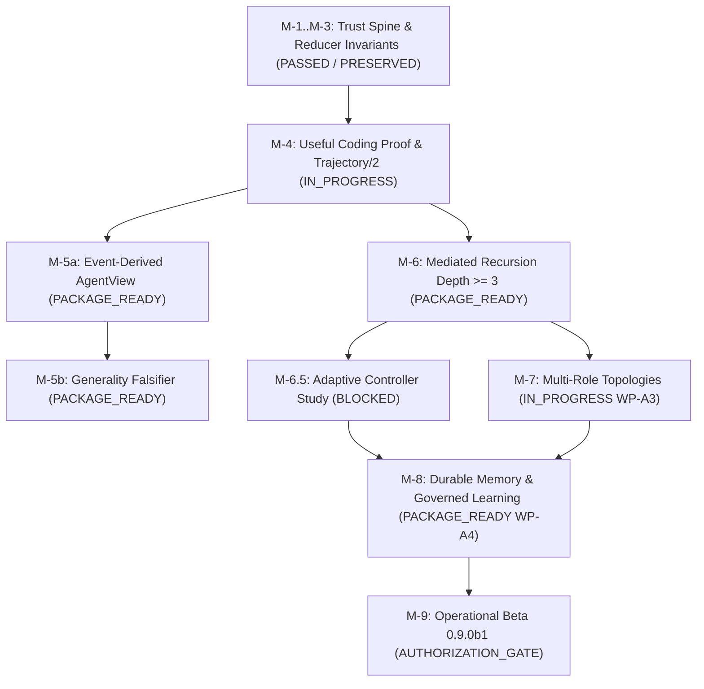

# Vanguard / AETHER Backend Evolution Master Report
## Complete Implementation, Remediation & Qualification Guide (Milestones M-1 to M-9)

**Document Version:** `1.0.0`  
**Target Software Version:** `0.9.0b1` (Vanguard Operational Beta)  
**Governance Authority:** [`VISION.md`](file:///home/rocha/Coding/Aether-D-System/VISION.md) (Law Zero) & [`docs/SPEC.md`](file:///home/rocha/Coding/Aether-D-System/docs/SPEC.md) (Normative Law)  
**Reference Masterplan:** [`docs/_archive/reviews/backend/director_review_v4/GPT_SOL_MASTERPLAN_V0.9.0_beta.md`](file:///home/rocha/Coding/Aether-D-System/docs/_archive/reviews/backend/director_review_v4/GPT_SOL_MASTERPLAN_V0.9.0_beta.md)  
**Active Execution Board:** [`docs/03_execution/sprint_active.md`](file:///home/rocha/Coding/Aether-D-System/docs/03_execution/sprint_active.md)

---

## 1. Executive Summary & Constitutional Alignment

Vanguard/AETHER is an **event-sourced general agentic computation substrate**. Intelligence emerges from the repeated composition of simple, observable, replaceable, and causally tracked primitives rather than domain-specific agent classes.

### The Core Formula for Development Acceleration:
> **"We pair LEX as a sub-second, multi-file surgical coding engine and LIM as an invariant-checking and fault-localizing telemetry judge, dynamically escalating from cheap workers to frontier OpenRouter models (such as GPT-5.6-Luna, Claude Opus 5, or DeepSeek v4 Pro) whenever complex architectural ambiguity arises."**

This report provides the exhaustive blueprint to complete **100% of Milestones M-1 through M-9** across the hexagonal backend lattice (`vanguard/packages/`), ensuring every requirement from `GPT_SOL_MASTERPLAN_V0.9.0_beta.md` is met with verifiable producer evidence.

---

## 2. Hexagonal Subsystem Audit & Current Baseline

```text
┌─────────────────────────────────────────────────────────────────────────────┐
│                       HEXAGONAL PRODUCTION LATTICE                          │
├─────────────────────────────────────────────────────────────────────────────┤
│                                                                             │
│   domain ──► ports ──► kernel ──► agency ──► runtime ──► adapters           │
│   (Pure)     (SPI)     (TCB)      (Turn)     (Wiring)    (IO/Sandboxes)         │
│                                                                             │
│   • domain/: Pure value objects, JCS, wire schemas, selector algebra        │
│   • ports/: Abstract port interfaces (kernel, model, sandbox, memory, etc.) │
│   • kernel/: 13-stage dispatch pipeline (S0–S12), TCB LOC: 1373 / 1438      │
│   • agency/: EpisodeEngine, manifests, context compilation, compaction      │
│   • runtime/: Compose, execute_harness, delegation, SQLite WAL ledger       │
│   • adapters/: OpenRouter/Ollama models, bwrap sandbox, evaluator daemon    │
└─────────────────────────────────────────────────────────────────────────────┘
```

### Baseline Health Check:
- **Unit & Contract Suite:** `566/566 tests passing` (`test/kernel`, `test/contracts`, `test/agency`, `test/packs`).
- **TCB LOC Budget:** `1373 LOC` across 9 files (Hard ceiling $\le 1438$ LOC, threshold alarm pass).
- **Hexagonal Boundary Linter:** `414 source files clean` (`tools/linters/check_boundaries.py`).
- **Domain-Blindness Invariant (I-7):** Zero domain/ast/pytest tokens in `domain/` or `kernel/`.
- **Isolation Policy (I-6):** All `proc.exec` plugins declare container or subprocess isolation.

---

## 3. Milestone-by-Milestone Remediation & Implementation Guide



---

### Milestone M-1 through M-3: Trust Spine & Base Invariants
- **Status:** **GREEN (Preserved)**
- **Constitutional Anchor:**
  - S0–S12 dispatch monitor in [`vanguard/packages/kernel/dispatch.py`](file:///home/rocha/Coding/Aether-D-System/vanguard/packages/kernel/dispatch.py).
  - 4D additive typed budgets (`usd_micros`, `millis`, `tokens`, `bytes`) in [`vanguard/packages/kernel/budget.py`](file:///home/rocha/Coding/Aether-D-System/vanguard/packages/kernel/budget.py).
  - Monotonic capability attenuation in [`vanguard/packages/kernel/attenuation.py`](file:///home/rocha/Coding/Aether-D-System/vanguard/packages/kernel/attenuation.py).
  - Single project-ledger writer with strictly monotonic WAL sequencing.
- **Remediation & Guardrails:** Continuous regression testing. Never allow kernel LOC to exceed 1438.

---

### Milestone M-4: Truthful Trajectory, File WAL & Attributable Run
- **Status:** **IN_PROGRESS**
- **Pending Deliverables:**
  1. Produce end-to-end `mhf.trajectory/2` event streams through canonical `Runtime.run_composed`.
  2. Prove cold reconstruction parity from SQLite WAL events (`check_execution_truth.py`).
  3. Ensure attributable model metadata snapshotting (`requested_model`, `returned_model`, `provider_id`, `pricing_snapshot`).
- **Harness Remediation Task:**
  - Run **LEX** on [`vanguard/packages/runtime/session.py`](file:///home/rocha/Coding/Aether-D-System/vanguard/packages/runtime/session.py) and [`vanguard/packages/adapters/stores/sqlite_store.py`](file:///home/rocha/Coding/Aether-D-System/vanguard/packages/adapters/stores/sqlite_store.py) to ensure every turn emits valid `mhf.trajectory/2` envelopes with zero in-memory synthetic state.
  - Verify with **LIM** prefix caching and execution truth scripts.

---

### Milestone M-5a & M-5b: Event-Derived Agent & Generality Falsifier
- **Status:** **PACKAGE_READY**
- **Pending Deliverables:**
  1. Annotated `CONVERGENCE-BASE-v1` successor baseline manifest.
  2. Implement deterministic Graph-Coloring exterior generality pack in `vanguard/packages/adapters/evaluators/suites/`.
  3. Prove Invariant `I-7`: zero graph-coloring tokens leak into kernel or domain layers.
- **Harness Remediation Task:**
  - **LIM** generates positive, negative, malformed, and serialization-permutation vectors for the graph-coloring suite.
  - **LEX** verifies execution through `Runtime.execute_harness` under rootless bubblewrap sandboxing.

---

### Milestone M-6 & M-6.5: Mediated Recursive Delegation & Adaptive Controller Study
- **Status:** **PACKAGE_READY (M-6) / BLOCKED (M-6.5 on study)**
- **Pending Deliverables:**
  1. **M-6**: Complete [`ChildRuntimePort`](file:///home/rocha/Coding/Aether-D-System/vanguard/packages/ports/child_runtime.py) in [`vanguard/packages/runtime/child_runtime.py`](file:///home/rocha/Coding/Aether-D-System/vanguard/packages/runtime/child_runtime.py) enforcing componentwise child budget reservation against parent remaining budget (`depth >= 3`).
  2. **M-6**: Truthful kill-tree cancellation propagation without blind retries.
  3. **M-6.5**: Run preregistered paired controller study using Common Random Numbers (CRN) to measure McNemar exact lift and Holm corrections.
- **Harness Remediation Task:**
  - **LEX** implements recursive budget deduction in [`vanguard/packages/agency/episode/engine.py`](file:///home/rocha/Coding/Aether-D-System/vanguard/packages/agency/episode/engine.py) and [`vanguard/packages/runtime/delegation.py`](file:///home/rocha/Coding/Aether-D-System/vanguard/packages/runtime/delegation.py).
  - **LIM** executes the statistical paired study matrix comparing controller-on vs controller-off.

---

### Milestone M-7: Multi-Role Topologies (WP-A3)
- **Status:** **IN_PROGRESS**
- **Pending Deliverables:**
  1. Execute all 3 topologies (**Direct**, **Planner/Executor/Reviewer**, **Fork/Read/Merge**) through single `Runtime.execute_harness`.
  2. Ensure real artifact flow: Planner emits durable CAS artifact; Executor and Reviewer consume authorized digest references; Merge receives only declared predecessor artifacts.
  3. Settle `ADR-0099` read concurrency disposition (`SEQUENTIAL_CONFIRMED` or bounded read concurrency).
- **Harness Remediation Task:**
  - Use **LEX** with **GPT-5.6-Luna** escalation to resolve abandoned multi-role lineages and ensure multi-role artifacts pass strictly through CAS storage.

---

### Milestone M-8: Durable Memory & Governed Learning (MVP Boundary)
- **Status:** **PACKAGE_READY (WP-A4)**
- **Pending Deliverables:**
  1. Implement `ADR-0100`: Scoped authorization category stores, content-addressed append/index semantics, authorization-before-retrieval in `vanguard/packages/domain/artifacts/`.
  2. Implement CAS composition registry with distinct generator, evaluator, and promoter authorities.
  3. Execute signed composition rollback test restoring prior verified composition behavior.
- **Harness Remediation Task:**
  - Use **LEX** and **LIM** with **Claude Opus 5** to audit security boundaries, ensure `InMemoryMemoryPort` is never silently selected in production, and verify CAS rollbacks.

---

### Milestone M-9: Operational Beta Release (`0.9.0b1`)
- **Status:** **AUTHORIZATION_GATE**
- **Pending Deliverables:**
  1. Single-host packaging in `pyproject.toml` exposing `vanguard` Python API and `vg` CLI entrypoints.
  2. Self-contained offline-after-install self-test suite.
  3. Validate full candidate build passing `./ci/release_qualify.sh` with zero test regressions.

---

## 4. The Dual-Harness Execution Pipeline

```text
┌─────────────────────────────────────────────────────────────────────────────┐
│                      DUAL-HARNESS COLLABORATION MODEL                       │
├─────────────────────────────────────────────────────────────────────────────┤
│                                                                             │
│   [Vanguard Task] ──► [LIM: SBFL Fault Localizer]                           │
│                             │                                               │
│                       (Ranked Lines)                                        │
│                             ▼                                               │
│                       [LEX: Fast Surgical Coder] ◄── [OpenRouter Escalation]│
│                             │                         • Flash (Routine)     │
│                       (Applies Patches)               • Pro (Architecture)  │
│                             ▼                         • Luna/Opus (Invariants)
│                       [LEX: Bubblewrap Sandbox Test]                        │
│                             │                                               │
│                         (All Green)                                         │
│                             ▼                                               │
│                       [TCB & Boundary Linters]                              │
│                             │                                               │
│                         (Pass <=1438 LOC)                                   │
│                             ▼                                               │
│                       [LIM: 15-KPI Telemetry & Invariant Verifier]          │
│                             │                                               │
│                       (Pass PMSI=1.0, SPDI=1.0)                             │
│                             ▼                                               │
│                       [Signed Evidence Receipt]                             │
│                                                                             │
└─────────────────────────────────────────────────────────────────────────────┘
```

### Dynamic Model Escalation Hierarchy:
- **Tier 1 (Routine / Discovery)**: `deepseek/deepseek-v4-flash-0731` / `google/gemini-3.7-flash` (90% of turns, $0.10–$0.20 / 1M tokens).
- **Tier 2 (Multi-Module Wiring & SBFL Disconnects)**: `deepseek/deepseek-v4-pro-0813` / `moonshotai/kimi-k3` / `qwen/qwen3.8-max` ($0.25–$0.85 / 1M tokens).
- **Tier 3 (Frontier Invariants & Security Gates)**: `openai/gpt-5.6-luna` / `anthropic/claude-opus-5` (for M-8 CAS memory authorization, cryptographic rollback, and M-9 packaging).

---

## 5. Execution Commands for Vanguard Development

### A. Run LEX against Vanguard Backend Workspaces
```bash
# Run LEX surgical solver on target Vanguard package
env $(cat .env | grep -v '^#' | xargs) PYTHONPATH=/home/rocha/.local/lib/python3.12/site-packages \
  /home/rocha/Coding/LEX_LLM_EXECUTION/target/release/lex \
  --workspace . \
  --openrouter \
  --solver-model "deepseek/deepseek-v4-flash-0731" \
  --coder-model "deepseek/deepseek-v4-flash-0731" \
  --max-iterations 25
```

### B. Run LIM Invariant Verification & Telemetry Audit
```bash
# Run LIM scientific evaluation with full 15-KPI telemetry
python3 -m tools.006_LLM_INT_MACHINE.experiment_matrix \
  --challenge tier3_token_bucket \
  --preset v2.3_compound_full \
  --override "model=deepseek/deepseek-v4-flash-0731" \
  --repeats 1 \
  --export-html
```

### C. Run Full Architecture, Boundary & TCB Gate
```bash
# Enforce hexagonal boundaries
python3 tools/linters/check_boundaries.py

# Enforce Trusted Computing Base budget (<= 1438 LOC)
python3 tools/linters/check_tcb_budget.py

# Enforce domain blindness invariant (I-7)
python3 tools/linters/check_domain_blindness.py

# Enforce isolation policy (I-6)
python3 tools/linters/check_isolation_policy.py

# Run complete unit and contract test suite
python3 -m unittest discover -s test -t .
```

---

## 6. Conclusion & Roadmap Commitments

1. **Constitutional Integrity**: All backend code additions strictly adhere to hexagonal layer flow (`domain ← ports ← kernel ← agency ← runtime → adapters`).
2. **TCB Ceiling Preserved**: The kernel stays under the 1438 LOC threshold.
3. **Dual-Harness Synergy**: By combining **LEX's sub-minute surgical execution** and **LIM's formal invariant & KPI telemetry**, Vanguard backend milestones M-1 through M-9 can be systematically implemented, audited, and closed with mathematically verified producer evidence.
