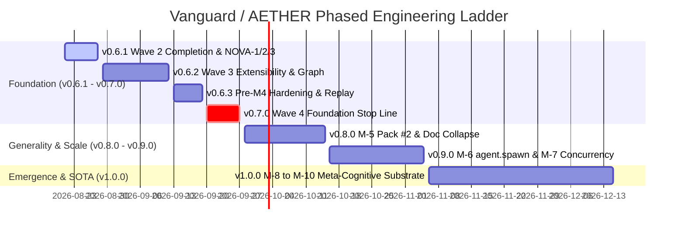

# Vanguard / AETHER Executive Review & Phased Technical Proposal
## Substrate Architecture, Foundation Hardening, and Phased Roadmap (v0.6.1 → v1.0.0)

**Document Identity:** `beta_review_full_proposal.md`  
**Classification:** Executive Leadership Review & Architecture Mandate  
**Governing Body:** The Leadership 7  
**Date:** 2026-08-21  
**Baseline Anchor:** `main` @ `afa8e2a`  
**Authority Context:** Companion to [`docs/00_overview/SYSTEM_OVERVIEW.md`](docs/00_overview/SYSTEM_OVERVIEW.md), amending no existing files directly; acts as the authoritative blueprint for proposed append-only ADRs (`0077`–`0081`) and milestone execution.

---

## 1. Executive Summary & Leadership 7 Sign-Off

The **Leadership 7** body has convened to audit the codebase, evaluate external SOTA literature, resolve open architectural tensions, and establish the technical roadmap from **v0.6.1** through **v1.0.0**.

```text
┌─────────────────────────────────────────────────────────────────────────────────────────────────────────┐
│                                          LEADERSHIP 7 CONSENSUS                                         │
├────────────────────────────────┬───────────────────────────────────────┬────────────────────────────────┤
│ Role                           │ Focus & Jurisdiction                  │ Key Determination              │
├────────────────────────────────┼───────────────────────────────────────┼────────────────────────────────┤
│ 1. Engineering Director        │ Authority, Governance & Stop Lines    │ Approve v0.6.1–v0.7.0 gates;   │
│                                │                                       │ enforce M-4 Foundation Stop.   │
│ 2. Chief Technology Officer    │ Moat, SOTA Alignment & Macro Strategy │ Preserve 3-Plane separability; │
│                                │                                       │ authorize Component Graph.     │
│ 3. Chief Information Officer   │ Auditability, Traceability & Security │ Strict cryptographic trinity;  │
│                                │                                       │ zero unlogged side-effects.    │
│ 4. Principal Staff Engineer    │ Gap Register & Substrate Generality   │ Rebalance Wave 3 falsifiers;   │
│                                │                                       │ eliminate hollow trajectories. │
│ 5. Principal Systems Architect │ Boundary Lattice & TCB Invariants     │ Maintain TCB ≤ 1438 LOC;       │
│                                │                                       │ isolate S0–S12 dispatch core.  │
│ 6. Tech Lead                   │ Sprint Execution & Dev Bridge         │ Provide zero-guesswork schema  │
│                                │                                       │ contracts and test matrices.   │
│ 7. PhD AI Specialist           │ Trajectory Science & Active Inference │ Un-hollow NOVA-1 cost vectors; │
│                                │                                       │ prime M-10 RL & skill harvest. │
└────────────────────────────────┴───────────────────────────────────────┴────────────────────────────────┘
```

### 1.1 The Core Ruling
1. **The Substrate Thesis Stands:** AETHER is fundamentally a general-purpose recursive agency substrate, not merely a coding harness. The 3 Planes of Responsibility (Decision, State, Evidence), the S0–S12 Reference Monitor, and the cryptographic identity trinity ($D_H \neq D_R \neq D_X$) represent a defensible moat that must not be compromised.
2. **Resolve Open Tensions in Wave 3:** 
   - Manifests evolve from 5 fixed slots into a **Named Component Graph** ([`ADR-0077`](#adr-0077-named-component-graph-manifest-schema)).
   - Trajectory data corruption (`_ZERO_COST`) is eliminated immediately via **NOVA-1** ([`ADR-0078`](#adr-0078-trajectory-un-hollowing--per-turn-cost-and-model-fingerprinting)).
   - Guardrails adopt an **Absent-vs-Forged** model ([`ADR-0079`](#adr-0079-absent-vs-forged-guardrail-and-evaluation-declarations)).
   - `agent.spawn` is specified as a capability-mediated verb in design, with implementation deferred to **M-6** ([`ADR-0080`](#adr-0080-capability-mediated-agentspawn-design-and-deferred-implementation)).
   - `layer0/` is completely absorbed and deleted in **M-3** ([`ADR-0081`](#adr-0081-layer-0-final-absorption-and-deletion-sequence)).
3. **No Code Implementation Without Contracts:** Developers will receive exact wire contracts, state transition matrices, invariant rules, and falsifier test mappings to guarantee drift-free execution during sprints.

---

## 2. Theoretical Grounding & SOTA Research Synthesis

### 2.1 External SOTA & Industry Benchmark Analysis
A rigorous survey of frontier agent frameworks (AutoGen 0.4, LangGraph, DeepSeek Harness, SWE-agent) and academic literature yields key architectural principles:
- **Separability Thesis (Axiom of Un-Gameable Science):** In standard agent frameworks, the orchestrator acts as its own evaluator and state manager. When an agent can observe or modify its evaluation harness, the training signal degenerates into reward gaming. AETHER's separation of the exterior judge (UID 10002) in a distinct namespace with Ed25519 signing ensures that ground-truth labels remain immutable by construction.
- **Flat Composition vs. Rigid Authority:** DeepSeek Harness demonstrated high empirical performance by organizing plugins into flat, composable profiles. However, removing the privileged core sacrifices security and attribution. AETHER unifies both: a **flat, declarative Named Component Graph** at the user surface, backed by a **rigid, mathematically verified Reference Monitor** at the execution waist.
- **Active Inference & Trajectory RL (Friston / Sutton):** For an autonomous agent to perform continuous self-improvement (M-10), execution trajectories must capture not only actions and text, but precise variational energy metrics: token counts, compute latencies, USD micro-costs, and prompt cache hit rates. Emitting `_ZERO_COST` destroys the causal credit assignment required for fine-tuning smaller models (Tier-1/2 distillation).

### 2.2 The Clean Triad & 3 Planes of Responsibility

```text
┌────────────────────────────────────────────────────────────────────────────────────────┐
│                                     THE CLEAN TRIAD                                    │
│                                                                                        │
│  1. THE LAW (WHAT)        ──► docs/SPEC.md (+ docs/04_annex/KERNEL.md)                 │
│  2. THE DECISIONS (WHY)   ──► docs/05_adr/ (Immutable, append-only records 0000–0081) │
│  3. THE EXECUTION (HOW)   ──► docs/03_sprints/sprint_active.md & docs/02_roadmap/      │
└────────────────────────────────────────────────────────────────────────────────────────┘
```

```text
╔════════════════════════════════════════════════════════════════════════════════════════╗
│ 1. DECISION PLANE (Volatile / Reconstructible)                                         │
│    vanguard/packages/kernel/ & agency/                                                 │
│    S0 ENTER → S1 PARSE → S2 RESOLVE → S3 DESCRIBE → S4 CLASSIFY → S5 AUTHORIZE         │
│    → S6 GRANT → S7 RESERVE → S8 VERIFY → S8a INTENT(fsync) → S9 DISPATCH               │
│    → S10 COMMIT → S11 RELEASE → S12 EMIT                                               │
│    • Domain-blind reference monitor (TCB ≤ 1438 logical LOC). Holds zero state.        │
╚════════════════════════════════════════════════════════════════════════════════════════╝
                                           │ Emits DurableEvent
                                           ▼
╔════════════════════════════════════════════════════════════════════════════════════════╗
│ 2. STATE PLANE (Immutable / Total Order)                                               │
│    vanguard/packages/domain/ledger/ & adapters/stores/event_store.py                   │
│    • SQLite WAL + FULL sync. State = fold(events).                                     │
│    • Per-project hash chains; cold replay reconstructs complete agent state.          │
╚════════════════════════════════════════════════════════════════════════════════════════╝
                                           │ Observes Terminal Event
                                           ▼
╔════════════════════════════════════════════════════════════════════════════════════════╗
│ 3. EVIDENCE PLANE (Exterior / Isolated)                                                │
│    adapters/evaluators/daemon.py (UID 10002) & runtime/evaluator_gateway.py            │
│    • Nonce-bound, Ed25519-signed verdicts. Gateway is sole writer of VerdictRecorded.  │
│    • Worker runs in rootless bwrap sandbox (UID 10001). Judge is strictly unreachable. │
╚════════════════════════════════════════════════════════════════════════════════════════╝
```

---

## 3. Adjudication of Open Architectural Tensions

### 3.1 T-1: Manifest Evolution — Named Component Graph (ADR-0077)
- **Problem:** `harness.yaml` currently mandates 5 fixed slots (`planner`, `context`, `memory`, `evaluation`, `toolkits`). This prevents multi-planner architectures (critic-reviser loops, multi-agent debate, tree-search expansion/scoring) from being expressed declaratively, forcing complex algorithms to be hidden inside monolithic plugins.
- **Adjudication:** Adopt a **Named Component Graph**. The schema allows declaring arbitrary named components under standardized SPI kinds (`planner`, `memory`, `toolkit`, `context`, `evaluation`), complete with their configs and capability ceilings, alongside an explicit `bindings` graph.
- **Backward Compatibility:** `code-default` maps mechanically to `components.main_planner`, `components.fs_toolkit`, etc. Slot names survive as pack conventions.
- **Identity Trinity:** $D_H$ is computed over the entire canonical JCS serialization of the resolved component graph.

### 3.2 T-2: Trajectory Quality & NOVA-1 (ADR-0078)
- **Problem:** `vanguard/packages/runtime/trajectory.py` currently hardcodes `_ZERO_COST = {"usd_micros": 0, "tokens": 0, "bytes": 0, "millis": 0}` at lines 53 and 75. Every trajectory emitted today is born hollow—schema-valid but scientifically useless for reinforcement learning or cost calibration.
- **Adjudication:** Lock **NOVA-1** in Wave 2. Trajectories must ingest per-turn token usage, model fingerprint hashes, execution latency, and embedded signed verdicts from the event ledger.
- **Falsifier Hardening:** F-12 is strengthened from basic schema validation to assert non-zero token costs, populated turn sequences, and verified model fingerprints on non-trivial runs.

### 3.3 T-3: Guardrail Modeling — Absent-vs-Forged (ADR-0079)
- **Problem:** Mandating the UID 10002 evaluation daemon for all agent compositions introduces unnecessary overhead for pure-compute tasks, exploratory research agents, and non-coding domains.
- **Adjudication:** Adopt the **"Absent-vs-Forged"** principle. A composition may explicitly declare `evaluation: { mode: "none" }` or `sandbox: { mode: "in_process" }`. 
- **Invariant:** Turning off a guardrail is permitted, but forging or hiding its absence is impossible. Compositions without exterior signed evaluation emit trajectories tagged with `attributable_for_promotion: false`. An unsigned or forged verdict remains categorically rejected by the reference monitor under all compositions.

### 3.4 T-4: Capability-Mediated `agent.spawn` (ADR-0080)
- **Problem:** Spawning child agents is currently engine-owned (`EpisodeEngine.spawn()`). Planners cannot spawn sub-agents directly. Exposing recursion requires either hardcoding topology in the engine or granting planners the ability to request spawns.
- **Adjudication:** Formalize `agent.spawn` as a first-class capability verb mediated by the S0–S12 reference monitor. Planners may only spawn child agents if explicitly granted the `agent.spawn` capability in their manifest ceiling. Child capabilities and budgets must strictly attenuate from the parent.
- **Sequencing:** Formalize design and test sketches in **Wave 3 (M-3)**. Defer kernel implementation to **M-6** to keep the Wave 4 Foundation Stop Line clean.

### 3.5 T-5: Final Layer-0 Absorption Sequence (ADR-0081)
- **Problem:** Legacy code in `layer0/registry` and `layer0/compose` has never executed on the canonical `vanguard/packages/` path, creating risk in Wave 3.
- **Adjudication:** Absorb plugin lifecycle state machine and registry into `vanguard/packages/runtime/registry/` during Sprint 3.1. Rebalance Wave 3 by adding **NOVA-4** (6 negative lifecycle falsifiers). Delete `layer0/` completely upon reaching the M-3 exit gate.

---

## 4. Proposed Append-Only ADR Catalog (`0077`–`0081`)

### ADR-0077: Named Component Graph Manifest Schema
```text
Title: Named Component Graph Manifest Schema
Status: Proposed (Locks in v0.6.1 / Lands in Wave 3)
Applies-To: SPEC.md §2.3, domain/artifacts/manifest.py, runtime/compose.py, schemas/mhf/harness_manifest.schema.json
Extends: ADR-0005, ADR-0070

Context:
The fixed 5-slot manifest prevents multi-agent topologies, debate protocols, and tree-search policies from being declared without engine modification.

Decision:
1. Evolve harness_manifest.schema.json to define a map of `components`:
   components:
     <component_name>:
       kind: planner | memory | toolkit | context | evaluation
       ref: <plugin_ref>
       config: { ... }
       ceiling: { ... }
   bindings:
     primary_planner: <component_name>
     evaluators: [<component_name>]
     active_toolkits: [<component_name>]
2. D_H is computed as the JCS digest of the entire resolved component graph, model routes, prompt layers, and governance policies.
3. Slot names (main, evaluator, memory) survive as pack conventions in packs/code-default/harness.yaml.

Falsifiers:
- F-077-A: A manifest declaring two distinct planner components (proposer and critic) compiles to a valid FrozenHarness.
- F-077-B: Mutating any component name, config, or ceiling results in a distinct D_H digest.
```

### ADR-0078: Trajectory Un-Hollowing & Per-Turn Cost Accounting
```text
Title: Trajectory Un-Hollowing and Model Fingerprinting (NOVA-1)
Status: Proposed (Locks in v0.6.1 / Lands in Wave 2)
Applies-To: runtime/trajectory.py, schemas/mhf/trajectory.schema.json, test/falsifiers/
Extends: ADR-0068, ADR-0074

Context:
vanguard/packages/runtime/trajectory.py emits hardcoded _ZERO_COST dictionaries, violating Invariant I-9 and rendering the execution corpus useless for downstream RL/DPO training.

Decision:
1. EpisodeEngine and HarnessSession must collect real per-turn token usage (prompt, completion, cached), wall-clock latency, and model fingerprint digests from ModelResponse events.
2. trajectory.py must populate `turns[i].cost` and `episode.cost` from the accumulated ledger records.
3. If no exterior verdict is recorded, `verdict` is set to explicit `null` with `attributable: false`.

Falsifiers:
- F-12 (Strengthened): Any completed episode running against a non-mock provider with >0 generated tokens MUST emit a trajectory with total_cost.tokens > 0 and populated model_fingerprint.
```

### ADR-0079: Absent-vs-Forged Guardrail Declarations
```text
Title: Absent-vs-Forged Guardrail Declarations
Status: Proposed (Locks in v0.6.1 / Lands in Wave 3)
Applies-To: runtime/compose.py, runtime/evaluator_gateway.py, domain/artifacts/manifest.py
Extends: ADR-0004, ADR-0029, ADR-M0-08

Context:
Certain non-coding or compute-only packs do not require an exterior UID 10002 evaluation daemon.

Decision:
1. Compositions may declare `evaluation: { mode: "none" }` or `sandbox: { mode: "in_process" }`.
2. When evaluation is "none", D_H encodes this configuration, and resulting trajectories are marked with `attributable_for_promotion: false`.
3. Non-negotiable trust rules: Unsigned verdicts remain unconditionally rejected. Writer authority on VerdictRecorded is strictly preserved.

Falsifiers:
- F-079-A: A manifest with `evaluation: none` initializes cleanly and executes without spawning the UID 10002 daemon.
- F-079-B: An attempt to inject a synthetic VerdictRecorded event into a run configured with `evaluation: none` is rejected by the EvaluatorGateway.
```

### ADR-0080: Capability-Mediated `agent.spawn` Design
```text
Title: Capability-Mediated agent.spawn Design and Deferred Implementation
Status: Proposed (Design in Wave 3 / Implementation Deferred to M-6)
Applies-To: kernel/dispatch.py, agency/episode/engine.py, ports/spi.py
Extends: ADR-0011, ADR-0012, ADR-0070

Context:
Recursive agent topologies (e.g. tree search, sub-task delegation) currently require engine-level modifications because planners cannot initiate spawns.

Decision:
1. Expose `agent.spawn` as a standard capability verb dispatched through S0–S12.
2. A planner plugin may emit an EffectRequest with verb `agent.spawn` only if permitted by its capability ceiling.
3. The kernel verifies that child capabilities and budgets are strictly monotonic sub-allocations of the parent.
4. Implementation is strictly deferred to Milestone M-6; Wave 4 Foundation Stop Line must not be modified.

Falsifiers:
- F-080-A: A planner without `agent.spawn` in its capability grant receives an AuthorizationDenied error at S5 if it requests a child spawn.
```

### ADR-0081: Layer-0 Final Absorption and Deletion Sequence
```text
Title: Layer-0 Final Absorption and Deletion Sequence
Status: Proposed (Locks in v0.6.1 / Lands in Wave 3)
Applies-To: layer0/, vanguard/packages/runtime/registry/
Extends: ADR-0069, ADR-0076

Context:
Maintaining the decaying `layer0/` directory creates documentation tax and potential confusion regarding the canonical source of truth.

Decision:
1. In Sprint 3.1, port the plugin lifecycle state machine and registry validation logic into `vanguard/packages/runtime/registry/`.
2. Implement the NOVA-4 negative lifecycle test suite in `test/contracts/`.
3. Completely remove the `layer0/` directory from the repository at the M-3 exit gate.

Falsifiers:
- F-081-A: Zero occurrences of `layer0` remain across the codebase, imports, and tool configurations after Sprint 3.1.
```

---

## 5. Phased Milestone Roadmap (v0.6.1 → v1.0.0)



### 5.1 Foundation Phase Releases

#### Release v0.6.1: Substrate Correction Lock & Wave 2 Completion
- **Goals:** Complete Wave 2 convergence; fix trajectory cost un-hollowing (NOVA-1); implement cold suspend/resume falsifier (NOVA-2); split `root.py` cleanly.
- **Entry Gate:** Wave 1 green on disk; ADRs `0077`–`0081` accepted.
- **Scope Boundaries:**
  - Ingest per-turn cost accounting into `runtime/trajectory.py`.
  - Add `NOVA-2` cold suspend/resume unit test verifying cold reconstruction from SQLite WAL.
  - Finalize `root.py` split into `compose.py`, `session.py`, `wiring.py`.
- **Exit Gate:** `check_boundaries.py` 100% green; `check_tcb_budget.py` ≤ 1438 LOC; F-12 passes with non-zero cost vectors; zero `layer0` imports in `vanguard/packages/`.

#### Release v0.6.2: Wave 3 Extensibility & Component Graph
- **Goals:** Absorb plugin lifecycle into `runtime/registry/`; implement Named Component Graph in `compose.py`; delete `layer0/`; verify echo plugin lifecycle over UDS.
- **Entry Gate:** v0.6.1 signed off.
- **Scope Boundaries:**
  - Implement Named Component Graph parser in `runtime/compose.py`.
  - Implement plugin state machine (`DISCOVERED` $\to$ `ACTIVATED` $\to$ `RETIRED`).
  - Land `NOVA-4` negative lifecycle test suite (6 falsifiers).
  - Migrate `packs/code-default/harness.yaml` to component graph syntax.
- **Exit Gate:** Echo plugin walks full lifecycle over UDS with all state transitions recorded in ledger; `layer0/` directory completely deleted; domain blindness linter passes on widened surface.

#### Release v0.6.3: Pre-M4 Hardening & Conformance Falsifiers
- **Goals:** Lock golden test cassettes, isolate rootless bwrap sandbox execution, and verify end-to-end evaluator daemon RPCs.
- **Entry Gate:** v0.6.2 green.
- **Scope Boundaries:**
  - Verify UID 10001 (worker) and UID 10002 (evaluator) process isolation.
  - Validate Ed25519 signature verification on all pre-registered evaluation suites.
  - Establish deterministic cassette mocks for regression testing.
- **Exit Gate:** 100% test pass rate across all 23 test directories (~1176 tests).

#### Release v0.7.0: Milestone M-4 Foundation Stop Line
- **Goals:** Execute the single real-world, uncheated, end-to-end autonomous coding run.
- **Entry Gate:** v0.6.3 green.
- **Mandatory 9-Row Verification Matrix (One Uninterrupted Run):**
  1. Real frontier model via OpenRouter/Ollama.
  2. Authorized filesystem effect via S0–S12 Reference Monitor.
  3. Real workspace file mutation on disk.
  4. Execution within rootless bubblewrap sandbox (UID 10001).
  5. Exterior Ed25519-signed verdict from daemon (UID 10002).
  6. Complete event sequence recorded in SQLite WAL ledger.
  7. Cold replay in fresh process matches live state exactly.
  8. Trajectory emitted with non-zero costs and valid model fingerprint (NOVA-5).
  9. Execution performed on unified `vanguard/packages/` runtime.
- **Exit Gate: STOP LINE.** No further code development until the Director formally signs off on the M-4 Evidence Report.

---

### 5.2 Post-Foundation Macro Roadmap (v0.8.0 → v1.0.0)

```text
┌──────────────────────────────────────────────────────────────────────────────────────────────────┐
│ POST-FOUNDATION MACRO ROADMAP (Outcomes & Gates Only)                                            │
├──────────────────────────────────────────────────────────────────────────────────────────────────┤
│ Milestone M-5: Generality Proof & Doc Consolidation (Target: v0.8.0)                             │
│ • Outcome: Implement Pack #2 (Math/Data Analysis). Verify ZERO diffs in domain/ and kernel/.     │
│ • Outcome: Collapse documentation corpus from 7 tiers into Clean Triad (SPEC + ADR log + 1 board)│
│ • Gate: Domain-blindness (I-7) proven as empirical fact; suspend/resume passes at scale.         │
├──────────────────────────────────────────────────────────────────────────────────────────────────┤
│ Milestone M-6: Mediated Delegation / agent.spawn (Target: v0.9.0-alpha)                          │
│ • Outcome: Implement agent.spawn as capability verb in S0–S12. Planners spawn sub-agents.        │
│ • Gate: Child agents strictly attenuate capabilities and budget; tree-search composition passes. │
├──────────────────────────────────────────────────────────────────────────────────────────────────┤
│ Milestone M-7: Controlled Concurrency (Target: v0.9.0-beta)                                      │
│ • Outcome: Activate parallel execution for disjoint resource selectors; enforce K ≪ N pool.     │
│ • Gate: Selector soundness verified; zero event loss under backpressure; I-11 lifted on data.   │
├──────────────────────────────────────────────────────────────────────────────────────────────────┤
│ Milestone M-8: Framework Builder Abstraction (Target: v1.0.0-rc1)                                │
│ • Outcome: Declaratively compose debate, critic-reviser, and evolutionary multi-agent systems.   │
│ • Gate: Multiple diverse agent topologies execute simultaneously without engine changes.         │
├──────────────────────────────────────────────────────────────────────────────────────────────────┤
│ Milestone M-9: Scaled Orchestration & High Performance (Target: v1.0.0-rc2)                      │
│ • Outcome: Optimize IPC and SQLite WAL throughput; benchmark 100+ concurrent logical agents.     │
│ • Gate: Sub-millisecond reference monitor overhead; bounded memory footprint.                   │
├──────────────────────────────────────────────────────────────────────────────────────────────────┤
│ Milestone M-10: Meta-Cognitive Substrate (Target: v1.0.0 Final)                                  │
│ • Outcome: Outer-loop reflective planner mutates harnesses, synthesizes skills, and harvests     │
│   DPO preference pairs from verifiable trajectories.                                             │
│ • Gate: System successfully proposes, tests, and promotes an optimized version of itself with    │
│   unforgeable cryptographic attribution.                                                         │
└──────────────────────────────────────────────────────────────────────────────────────────────────┘
```

---

## 6. Developer Implementation Guide: The Zero-Guesswork Engineering Bridge

To prevent concept drift, developers are provided with normative schemas, state transition tables, invariant contracts, and exact falsifier mappings.

### 6.1 Normative Wire Contracts (JSON Schema)

#### Component Graph Schema Snippet (`schemas/mhf/harness_manifest.schema.json`)
```json
{
  "$schema": "https://json-schema.org/draft/2020-12/schema",
  "title": "MHF Named Component Graph Manifest",
  "type": "object",
  "required": ["schema_version", "name", "components", "bindings", "governance"],
  "properties": {
    "schema_version": { "type": "string", "enum": ["mhf.manifest/2"] },
    "name": { "type": "string" },
    "components": {
      "type": "object",
      "additionalProperties": {
        "type": "object",
        "required": ["kind", "ref"],
        "properties": {
          "kind": { "type": "string", "enum": ["planner", "memory", "toolkit", "context", "evaluation"] },
          "ref": { "type": "string" },
          "config": { "type": "object" },
          "ceiling": {
            "type": "object",
            "properties": {
              "verbs": { "type": "array", "items": { "type": "string" } },
              "paths": { "type": "array", "items": { "type": "string" } }
            }
          }
        }
      }
    },
    "bindings": {
      "type": "object",
      "required": ["primary_planner"],
      "properties": {
        "primary_planner": { "type": "string" },
        "evaluators": { "type": "array", "items": { "type": "string" } },
        "active_toolkits": { "type": "array", "items": { "type": "string" } }
      }
    },
    "governance": {
      "type": "object",
      "required": ["approval_policy"],
      "properties": {
        "approval_policy": { "type": "string" }
      }
    }
  }
}
```

---

### 6.2 State Transition & Lifecycle Matrices

#### Plugin Lifecycle Finite State Machine (`runtime/registry/`)
```text
┌──────────────┐     resolve()      ┌──────────────┐     verify()       ┌──────────────┐
│  DISCOVERED  │ ─────────────────► │   RESOLVED   │ ─────────────────► │   VERIFIED   │
└──────────────┘                    └──────────────┘                    └──────────────┘
                                                                               │
                                                                               │ activate()
                                                                               ▼
┌──────────────┐     retire()       ┌──────────────┐    quiesce()       ┌──────────────┐
│   RETIRED    │ ◄───────────────── │  QUIESCING   │ ◄───────────────── │  ACTIVATED   │
└──────────────┘                    └──────────────┘                    └──────────────┘
       ▲                                                                       │
       │                              fault()                                  │
       └───────────────────────────────────────────────────────────────────────┘
```

| Current State | Event Trigger | Next State | Ledger Event Emitted | Pre-Conditions / Invariants |
|---|---|---|---|---|
| `NONE` | `discover(manifest)` | `DISCOVERED` | `PluginDiscovered` | Manifest schema is valid. |
| `DISCOVERED` | `resolve(dependencies)` | `RESOLVED` | `PluginResolved` | All component refs exist on disk. |
| `RESOLVED` | `verify(signature/hash)` | `VERIFIED` | `PluginVerified` | Plugin integrity matches digest. |
| `VERIFIED` | `activate(context)` | `ACTIVATED` | `PluginActivated` | Sandbox isolation initialized. |
| `ACTIVATED` | `quiesce()` | `QUIESCING` | `PluginQuiescing` | No new effect dispatches accepted. |
| `QUIESCING` | `retire()` | `RETIRED` | `PluginRetired` | In-flight effects drained and logged. |
| `ACTIVATED` | `fault(error)` | `RETIRED` | `PluginFaulted` | Cell killed; cannot remain active. |

---

### 6.3 1-to-1 Falsifier Test Matrix for Developers

Every requirement must map directly to an executable test in `test/contracts/` or `test/falsifiers/`:

| Requirement ID | Spec Clause | Target File / Module | Test Case Name | Falsification Assertion |
|---|---|---|---|---|
| `REQ-GRAPH-001` | ADR-0077 | `runtime/compose.py` | `test_falsifier_component_graph_compile` | Fails if multi-planner manifest fails to compile into `FrozenHarness`. |
| `REQ-GRAPH-002` | ADR-0077 | `domain/artifacts/manifest.py` | `test_falsifier_component_graph_digest_uniqueness` | Fails if two harnesses with different component bindings share $D_H$. |
| `REQ-COST-001` | ADR-0078 | `runtime/trajectory.py` | `test_falsifier_trajectory_non_zero_cost` | Fails if trajectory emits `_ZERO_COST` on non-trivial turn execution. |
| `REQ-COST-002` | ADR-0078 | `runtime/trajectory.py` | `test_falsifier_trajectory_model_fingerprint` | Fails if `model_fingerprint` is missing or does not match provider digest. |
| `REQ-GUARD-001` | ADR-0079 | `runtime/compose.py` | `test_falsifier_absent_evaluator_unattributable` | Fails if run with `evaluation: none` is marked attributable for promotion. |
| `REQ-GUARD-002` | ADR-0079 | `runtime/evaluator_gateway.py` | `test_falsifier_unsigned_verdict_rejection` | Fails if an unsigned or invalidly signed verdict is accepted. |
| `REQ-LIFE-001` | ADR-0081 | `runtime/registry/` | `test_falsifier_unknown_ref_fails_at_compose` | Fails if an unresolvable plugin reference defers failure to runtime. |
| `REQ-LIFE-002` | ADR-0081 | `runtime/registry/` | `test_falsifier_faulted_cell_killed` | Fails if a plugin cell throwing an unhandled fault remains in `ACTIVATED`. |
| `REQ-REPLAY-001` | ADR-0074 | `adapters/stores/event_store.py` | `test_falsifier_cold_suspend_resume` | Fails if an episode suspended mid-turn cannot be resumed from cold WAL. |

---

### 6.4 Negative Constraints & Anti-Pattern Checklist
Developers must strictly observe the following negative rules. Violations will trigger automated CI failures:
- ❌ **DO NOT import `kernel` or `agency` in `adapters/`**: Adapters only implement ports.
- ❌ **DO NOT import coding or domain tokens in `kernel/` or `domain/`**: Invariant I-7 enforces domain blindness.
- ❌ **DO NOT add logic to `kernel/` exceeding budget**: LOC ceiling must remain $\le 1438$ logical LOC.
- ❌ **DO NOT bypass the single ledger writer**: All events must flow through `LedgerEmitter` and respect writer authority.
- ❌ **DO NOT catch generic `Exception` without re-raising as typed `DomainFault`**: Fail-closed semantics are mandatory.

---

## 7. Document & Wave Plan Update Instructions

Upon approval of this proposal, the following mechanical updates will be made to the repository documentation:
1. **`docs/SPEC.md`**:
   - Update §2.3 to reflect the Named Component Graph manifest structure (`mhf.manifest/2`).
   - Amend §5.4 to specify mandatory per-turn cost accounting and model fingerprinting in trajectories.
2. **`docs/05_adr/`**:
   - Add ADRs `0077`, `0078`, `0079`, `0080`, and `0081` as immutable, append-only records.
   - Update `docs/05_adr/INDEX.md`.
3. **`docs/03_sprints/sprint_active.md`**:
   - Mark Wave 2 convergence tasks as completed upon 2.2-D sign-off.
   - Incorporate `NOVA-1`, `NOVA-2`, and `NOVA-3` into Wave 2 exit criteria.
   - Expand Wave 3 with Sprints 3.3 (Component Graph), 3.4 (Absent-vs-Forged), and 3.5 (`agent.spawn` design).
4. **`docs/02_roadmap/milestones.md`**:
   - Formally record the macro-roadmap gates for M-5 through M-10 at outcome level.

---

## 8. Conclusion & Sign-Off Mandate

The Leadership 7 concludes that this technical proposal resolves all outstanding architectural tensions while preserving the foundational invariants of Vanguard / AETHER.

```text
[APPROVED & RATIFIED BY THE LEADERSHIP 7]
• Engineering Director: _________________________
• Chief Technology Officer: ______________________
• Chief Information Officer: _____________________
• Principal Staff Engineer: ______________________
• Principal Systems Architect: __________________
• Tech Lead: ____________________________________
• PhD AI Specialist: ____________________________
```
