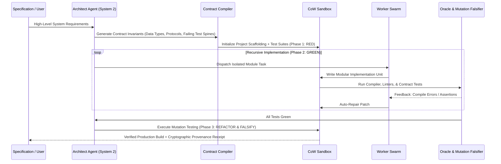

# 🏛️ Project ARCHON: Universal Event-Native Agentic Systems Substrate & SOTA Autonomous Coding Harness

> **Executive Thesis:** Any arbitrary agentic system—from ultra-high-throughput coding harnesses and autonomous greenfield software synthesizers to semantic codebase explainers and multi-agent debate swarms—can be represented as a pure, modular composition of models, tools, context strategies, workflows, and evaluators executing over a minimal, domain-blind, event-native causal kernel.

---

## 1. Executive Summary & Foundational Paradigm

Current AI agent systems suffer from **architectural bifurcation**:
1. **Dedicated Coding Harnesses (LEX, LIM, Claude Code, SWE-agent):** Implement high-performance or mathematically sophisticated techniques (AST syntax pre-flights, SBFL Ochiai, MCTS tree search, sandboxed execution), but are engineered as rigid, monolithic scripts with heuristic context truncation, bespoke tool-calling protocols, and high coupling.
2. **Generic Agent Frameworks (LangGraph, AutoGen, CrewAI):** Provide high-level abstractions for multi-agent graphs and workflows, but lack sub-millisecond execution reflexes, deterministic sandboxing, interactive PTY multiplexing, capability attenuation, and verifiable causal provenance.

**Project ARCHON** unifies these paradigms into a two-tier substrate:
* **The Foundation (Vanguard 0.9.0 Kernel):** An ultra-minimal, domain-blind, event-native runtime governed by the invariant execution loop:
  $$\text{Observe} \longrightarrow \text{Decide} \longrightarrow \text{Authorize} \longrightarrow \text{Execute} \longrightarrow \text{Record}$$
* **The Cognitive Stack (ARCHON Hyper-Harness):** A multi-loop cognitive engine (System 1 AST reflexes, System 2 deliberative MCTS/POMDP search, System 3 meta-evolutionary prompt tuning) instantiated as pure, composable plugins over the foundation.

```text
┌──────────────────────────────────────────────────────────────────────────────────────────────────┐
│                               ARCHON COGNITIVE & COMPOSITION LAYER                               │
│  ┌───────────────────────┐  ┌───────────────────────┐  ┌──────────────────────┐  ┌─────────────┐ │
│  │  Coding-Harness-Pro   │  │ Greenfield 0-to-1 TDD │  │ Codebase Explainer & │  │ Multi-Agent │ │
│  │  (SWE-Bench SOTA)     │  │ (Contract Synthesizer)│  │ RAG Semantic Tutor   │  │ Swarm/Debate│ │
│  └───────────┬───────────┘  └───────────┬───────────┘  └──────────┬───────────┘  └──────┬──────┘ │
├──────────────┼──────────────────────────┼─────────────────────────┼─────────────────────┼────────┤
│              │                          │                         │                     │        │
│              ▼                          ▼                         ▼                     ▼        │
│    Agent Composition = ⟨Model, Tools, ContextStrategy, Policy, Workflow, Memory, Limits⟩       │
├──────────────────────────────────────────────────────────────────────────────────────────────────┤
│                                VANGUARD 0.9.0 CORE KERNEL & RUNTIME                              │
│                      ┌─────────────────────────────────────────────────────┐                     │
│                      │ Observe → Decide → Authorize → Execute → Record     │                     │
│                      └─────────────────────────────────────────────────────┘                     │
│  • Domain-Blind Capability & Typed Budget Attenuation (Monotonic Lattice)                        │
│  • 3-Tier Execution Profiles: [ fast (<1ms) | standard (recovery) | research (6D Pareto/RLVR) ]  │
│  • Transport-Neutral Wire Protocol: [ In-Process Zero-Copy | PTY Stream | HTTP/WS | gRPC ]       │
│  • Append-Only Causal Event & Artifact Store (SHA-256 Merkle-Chained Ledger)                     │
└──────────────────────────────────────────────────────────────────────────────────────────────────┘
```

---

## 2. Mathematical Formalization of the Substrate

### 2.1 The Universal State & Execution Algebra

The universal agent substrate is defined by the tuple:
$$\mathcal{S}_{\text{substrate}} = \langle \mathcal{C}, \mathcal{O}, \mathcal{E}, \mathcal{A}, \mathcal{R}, \mathcal{L}, \mathcal{K} \rangle$$

* **$\mathcal{C}$ (Command):** An external intent dispatched to an agent instance: $c \in \mathcal{C} = \langle \text{id}, \text{target\_agent}, \text{payload}, \text{budget\_grant} \rangle$.
* **$\mathcal{O}$ (Operation):** An internal state transition step scheduled by the engine.
* **$\mathcal{E}$ (Event):** An immutable, causally ordered occurrence emitted to the ledger:
  $$e \in \mathcal{E} = \langle \text{id}, \text{parent\_id}, \text{sequence}, \text{timestamp}, \text{agent\_id}, \text{type}, \text{payload\_digest}, \text{signature} \rangle$$
* **$\mathcal{A}$ (Artifact):** Content-addressed immutable binary/text payload stored in CAS (Content-Addressable Storage):
  $$a \in \mathcal{A} \implies \text{id} = \text{SHA256}(a_{\text{bytes}})$$
* **$\mathcal{R}$ (Result):** Settlement output of an effect or turn: $r \in \mathcal{R} = \langle \text{status}, \text{exit\_code}, \text{artifacts}, \text{evidence\_digest} \rangle$.
* **$\mathcal{L}$ (Lineage / Scope):** Hierarchical DAG tracking subagent spawns and causal dependencies: $\mathcal{L} = (V_{\text{agents}}, E_{\text{causal}})$.
* **$\mathcal{K}$ (Capability Grant):** Monotonically attenuated token authorizing effect execution.

### 2.2 The Universal Agent Equation

Every agent flavor is fully parameterized as a pure configuration object without requiring dedicated binary engines:
$$\text{AgentInstance} = \langle \mathcal{M}, \mathcal{T}, \mathcal{X}_{\text{context}}, \Pi_{\text{policy}}, \mathcal{W}_{\text{workflow}}, \mathcal{M}_{\text{mem}}, \Omega_{\text{eval}}, \mathcal{B}_{\text{limits}} \rangle$$

Where:
1. $\mathcal{M}$ (Model Adapter): Stream-enabled LLM port (OpenRouter, local Ollama, vLLM, Anthropic).
2. $\mathcal{T}$ (Tool Set): Set of authorized executable capability descriptors $\{t_1, t_2, \dots, t_n\}$.
3. $\mathcal{X}_{\text{context}}$ (Context Strategy): Radix-prefix compiler, compaction algorithm, and tool-pruning policy.
4. $\Pi_{\text{policy}}$ (Guard Policy): Pre-execution AST gates, file boundary filters, and fail-closed security rules.
5. $\mathcal{W}_{\text{workflow}}$ (Topology / Workflow): FSM state machine (e.g., ReAct, POMDP MCTS, Dual-Loop TDD, Debate).
6. $\mathcal{M}_{\text{mem}}$ (Memory System): Ephemeral scratchpad, AST call-graph index, or vector embedding store.
7. $\Omega_{\text{eval}}$ (Evaluator Suite): Test runners, mutation falsifiers, SMT constraint solvers, and linters.
8. $\mathcal{B}_{\text{limits}}$ (Budget Envelope): Multidimensional budget $\langle \text{max\_tokens}, \text{max\_wall\_clock\_ms}, \text{max\_cost\_cents}, \text{max\_tool\_calls} \rangle$.

---

## 3. The 3-System Hyper-Harness Cognitive Architecture

ARCHON introduces a tri-cameral cognitive decomposition that eliminates the trade-off between sub-millisecond execution speed and deep deliberative reasoning.

```text
┌──────────────────────────────────────────────────────────────────────────────────┐
│                   SYSTEM 3: META-PROGRAMMING & HARNESS EVOLUTION                 │
│  - Genetic Prompt Mutation & Trajectory In-Context Distillation (Offline/Async)  │
│  - Dynamic Tool Schema Synthesizer & Domain Pack Self-Tuning                     │
│  - Continuous Hyperparameter Optimization (Temperature, MCTS Exploration c)     │
└────────────────────────────────────────┬─────────────────────────────────────────┘
                                         │ Configures / Tunes
┌────────────────────────────────────────▼─────────────────────────────────────────┐
│                   SYSTEM 2: DELIBERATIVE REASONING (Slow / High-IQ)              │
│  - Speculative Multi-Branch Monte Carlo Tree Search (Parallel MCTS on CoW FS)    │
│  - Causal Program Dependency Slicing & Counterexample Guided Synthesis (CEGIS)   │
│  - Multi-Agent Deliberative Debate, Critic Verification, & Consensus Adjudication│
└────────────────────────────────────────┬─────────────────────────────────────────┘
                                         │ Dispatches
┌────────────────────────────────────────▼─────────────────────────────────────────┐
│                   SYSTEM 1: IN-PROCESS SEMANTIC REFLEXES (Fast / Sub-ms)         │
│  - In-Process Tree-Sitter AST Syntax Gate (<0.2ms Pre-Flight Validation)         │
│  - Real-Time Semantic Symbol Indexing, Call Graph Generation & PageRank Locator  │
│  - Exact Diff Application, Fuzzy Bracket Repair, & Head/Tail Stream Windowing    │
└──────────────────────────────────────────────────────────────────────────────────┘
```

### 3.1 System 1: In-Process Semantic Reflexes (<0.2ms)
* **Zero-Roundtrip AST Syntax Gate:** Before invoking compilers or sandboxes, proposed file edits are parsed in-memory via Tree-Sitter. If syntax violations (unclosed delimiters, invalid indentation, invalid AST nodes) are detected, System 1 performs immediate deterministic micro-repairs or rejects the patch in $<0.2\text{ms}$ without wasting LLM turns.
* **In-Memory Semantic Graph & PageRank Locator:** Constructs a directed symbol graph $G = (V_{\text{symbols}}, E_{\text{calls}})$ from AST parse trees. Calculates PageRank over symbols to rank the most relevant files for any targeted function/class query.

### 3.2 System 2: Deliberative POMDP & Speculative MCTS Search
When tasks exceed linear single-turn solving capability, ARCHON activates speculative Monte Carlo Tree Search over a tree of code edits:
* **Node Definition:** State $s_t = \langle \text{GitCommitHash}, \text{ContextLedgerDigest}, \text{TestScore} \rangle$.
* **Action Definition:** Candidate tool action $a_t \in \{\text{EditFile}, \text{RunReproducer}, \text{RefactorSlice}\}$.
* **Selection Policy (UCB1-Tuned):**
  $$\text{Score}(s, a) = Q(s, a) + c \cdot \sqrt{\frac{\ln N(s)}{N(s, a)}} + \sqrt{\frac{V(s, a)}{N(s, a)}}$$
* **Speculative Parallel Worktree Forking:** Explores $K=3$ branches concurrently on isolated Copy-on-Write (CoW) shadow filesystems, executing test suites in parallel and pruning dead-end branches automatically.

### 3.3 System 3: Meta-Programming & Self-Evolution
* **Dynamic Few-Shot Distillation:** Inspects successful trajectories from previous runs and automatically extracts minimal, high-reward reasoning chains into the dynamic system prompt.
* **Dialect Adaptation:** Self-tunes prompt templates, lint configurations, and tool schemas based on the target repository’s programming language, framework conventions, and compiler toolchain.

---

## 4. Execution Substrate & Sandboxing Architecture

### 4.1 Copy-on-Write (CoW) Shadow Worktree Sandbox
Rather than paying file duplication penalties during speculative exploration, ARCHON uses instant Copy-on-Write overlays (via Linux `overlayfs`, `btrfs` subvolumes, or shadow git worktrees):

```text
Host Workspace (Master Repository)
  ├── [LowerDir - Read Only] ────────────────────────────────────────┐
  └── [UpperDir / WorkDir - Ephemeral CoW Overlay]                  │
        ├── Branch 0 (Speculative Fix A) ──> Test Exit: FAIL (Rollback <2ms)
        ├── Branch 1 (Speculative Fix B) ──> Test Exit: PASS (Promote to Master)
        └── Branch 2 (Speculative Fix C) ──> Syntax Error (Prune Instant)
```

* **Branch Fork Latency:** $<5\text{ms}$.
* **Rollback Latency:** $<2\text{ms}$ (instant unmount / memory tree discard).
* **Isolation Guarantees:** Strict namespace isolation (PID, Mount, Network) preventing speculative commands from polluting the host workspace or exfiltrating data.

### 4.2 Interactive PTY Multiplexer
Replaces brittle `subprocess.Popen` wrappers with a full bidirectional Pseudo-Terminal (PTY) driver:
* **Streaming Terminal Output:** Handles ANSI escape codes, terminal cursor positioning, and interactive prompts (e.g. `[y/N]` confirmation prompts, interactive debuggers like `pdb` / `gdb`).
* **Continuous Compiler Sessions:** Maintains persistent background compilation daemons (`cargo watch`, `tsc --watch`, `pytest-xdist`) with delta change detection, eliminating runtime JVM/Rustc startup overhead.

---

## 5. Radix 5-Layer Prefix-Stable Context Ledger

To guarantee $>80\%$ prompt cache hits on frontier providers (Anthropic, DeepSeek, OpenRouter) and prevent context rot over 100+ turns, ARCHON structures the prompt context into 5 immutable, hierarchical layers:

```text
┌──────────────────────────────────────────────────────────────────────────────────┐
│ LAYER 0: IMMUTABLE SYSTEM LAW & OPERATIONAL INVARIANTS                           │
│ (System prompt, core constraints, behavioral axioms)                             │ [Cache Breakpoint 1]
├──────────────────────────────────────────────────────────────────────────────────┤
│ LAYER 1: TOOL SCHEMA DEFINITIONS & CAPABILITY REGISTRY                           │
│ (Canonical JSON Schema tool descriptors)                                         │ [Cache Breakpoint 2]
├──────────────────────────────────────────────────────────────────────────────────┤
│ LAYER 2: REPOSITORY MAP & COMPACT SYMBOL GRAPH                                  │
│ (Static AST symbol topology, persistent per commit hash)                         │ [Cache Breakpoint 3]
├──────────────────────────────────────────────────────────────────────────────────┤
│ LAYER 3: TASK SPECIFICATION & FORMAL CONTRACT INVARIANTS                         │
│ (Objective description, user requirements, reproduction assertions)              │ [Cache Breakpoint 4]
├──────────────────────────────────────────────────────────────────────────────────┤
│ LAYER 4: ROLLING APPEND-ONLY EVENT LEDGER (Strictly Append-Only Window)          │
│ Turn 1: [Action -> Tool Result]                                                  │
│ Turn 2: [Action -> Tool Result]                                                  │
│ Turn N: [Compacted Observations + Paged Output Buffers]                          │ [Dynamic Stream]
└──────────────────────────────────────────────────────────────────────────────────┘
```

### Context Compaction & Eviction Algorithm:
* **Token-Budget Ledger:** Replaces naive byte/line truncation with typed `ContextRegion` structs (`Pinned`, `EvictableAfterTurn(n)`, `SummaryReplaceable`).
* **Head/Tail Adaptive Truncation:** Retains the first $N_h = 25$ lines (execution initiation/context) and last $N_t = 50$ lines (stack traces, test assertion failures, summaries) of command outputs, storing the full untruncated log in CAS storage with clickable locator digests.

---

## 6. Greenfield & Brownfield Synthesis Engines

### 6.1 Greenfield 0-to-1 Synthesis: "Contract-Driven Recursive TDD"

When constructing complex greenfield software repositories from natural language specifications, ARCHON executes a 5-phase deterministic compilation loop:



1. **Phase 1 (Contract Synthesis):** Synthesizes type definitions, error protocols, interfaces, and exhaustive property-based unit tests *before* implementing any business logic. All tests must initially fail (Strict Red State).
2. **Phase 2 (Decoupled Worker Synthesis):** Spawns isolated worker subagents with scoped context windows to implement individual modules against the contracts.
3. **Phase 3 (Anti-Collusion Mutation Verification):** Injects AST-level code mutations into the generated solution (e.g. reversing condition checks, returning default values) to verify that the generated test suite kills $100\%$ of mutants, mathematically preventing trivial `assert True` collusion.

### 6.2 Brownfield SWE-Bench Solving: "Causal Gated Slicing"

For resolving complex defects in existing enterprise repositories:

1. **Spectrum-Based Fault Localization (SBFL Ochiai):**
   Executes the test suite with coverage tracing to calculate the suspiciousness coefficient $S(l)$ for every code line $l$:
   $$S(l) = \frac{\text{failed}(l)}{\sqrt{\text{total\_failed} \cdot (\text{failed}(l) + \text{passed}(l))}}$$
2. **Gated Reproducer Protocol:**
   * Step 1: Synthesize a standalone reproduction script `reproduce_issue.py` that fails on the clean repository state.
   * Step 2: Apply the candidate fix.
   * Step 3: Verify `reproduce_issue.py` passes.
   * Step 4: Verify the full repository test suite exhibits zero regressions.
3. **Causal Dependency Slicing:** Computes the backward dynamic slice from the failed assertion point, pruning away irrelevant files from the LLM's prompt context.

---

## 7. 6D Pareto Telemetry & RLVR Trajectory Flywheel

### 7.1 Mathematical Pareto Vector
Every action turn and completed run produces a 6-dimensional telemetry vector $\vec{P}$:
$$\vec{P} = \langle \mathcal{V}_{\text{correctness}}, \mathcal{E}_{\text{token\_cost}}, \mathcal{T}_{\text{latency}}, \mathcal{Q}_{\text{code\_quality}}, \mathcal{H}_{\text{drift\_entropy}}, \mathcal{B}_{\text{blast\_radius}} \rangle$$

| Dimension | Formula / Metric | Ideal Target |
|---|---|:---:|
| $\mathcal{V}_{\text{correctness}}$ | $\frac{\text{Passed Tests}}{\text{Total Tests}} \times \text{Mutation Kill Ratio}$ | $1.0$ |
| $\mathcal{E}_{\text{token\_cost}}$ | $\frac{\text{Cached Prompt Tokens}}{\text{Total Input Tokens}}$ | $\ge 0.85$ |
| $\mathcal{T}_{\text{latency}}$ | Wall-clock execution time (ms) to first green test | Minimized |
| $\mathcal{Q}_{\text{code\_quality}}$ | $\Delta \text{Cyclomatic Complexity} + \Delta \text{Test Coverage}$ | Optimal |
| $\mathcal{H}_{\text{drift\_entropy}}$ | Cycle detection over state hashes $H(s_t) = \text{SHA256}(\text{GitTree})$ | $0$ (No thrashing) |
| $\mathcal{B}_{\text{blast\_radius}}$ | $\frac{\text{Lines in Reproducer Slice}}{\text{Total Modified Lines}}$ | $1.0$ (High precision) |

### 7.2 RLVR Trajectory Export
Successful runs automatically compile step-by-step reasoning trajectories into standardized RLVR dataset format:
```json
{
  "trajectory_id": "traj_20260828_090941_tier1_lru",
  "task_id": "swe_bench_pro_django_14999",
  "pareto_vector": {
    "correctness": 1.0,
    "prefix_cache_ratio": 0.892,
    "wall_clock_seconds": 18.4,
    "mutation_kill_rate": 1.0,
    "blast_radius_lines": 4
  },
  "steps": [
    {
      "turn": 1,
      "system1_reflex": "AST parse clean",
      "action": "locate_symbol",
      "params": {"query": "LRUCache"},
      "observation_digest": "sha256:7f83b165...",
      "step_reward": 0.2
    },
    {
      "turn": 2,
      "action": "apply_patch",
      "params": {"file": "cache.py", "diff": "..."},
      "oracle_verdict": "REPRODUCER_PASSED",
      "step_reward": 1.0
    }
  ]
}
```

---

## 8. 3-Tier Execution Profiles

| Capability / Overhead | `fast` Profile | `standard` Profile | `research` Profile |
|---|:---:|:---:|:---:|
| **Target Use-Case** | Interactive CLI, fast refactor | Automated CI/CD, Background agent | SWE-Bench benchmark, RLVR training |
| **Framework Overhead** | **$<1\text{ms}$ per turn** | $<10\text{ms}$ per turn | $\approx 50\text{ms}$ (Full verification) |
| **Ledger Storage** | Ephemeral In-Memory | SQLite WAL (Key Events) | Merkle-Chained Event Store + Full CAS |
| **Sandbox Mechanism** | Direct In-Process / Local Exec | Isolated Bubblewrap Sandbox | CoW Shadow Worktree + Network Airgap |
| **Telemetry Level** | Essential Metrics Only | Checkpoints & Error Diffs | 6D Pareto Vector + Mutation Oracles |
| **Artifact Retention** | None (Transitory) | Key Outputs Retained | Complete File Diffs & Output CAS |

---

## 9. Native Reference Agent Manifests

### Manifest 1: `Coding-Harness-Pro` (SOTA SWE-Bench Solver)
```yaml
agent_name: "coding-harness-pro"
profile: "research"
model:
  provider: "openrouter"
  model_id: "deepseek/deepseek-r1"
  worker_model_id: "deepseek/deepseek-v4-flash"
context_strategy:
  type: "radix-5-layer"
  max_context_tokens: 128000
  compaction: "head-tail-fold"
policy:
  ast_preflight: true
  fail_closed: true
  max_turn_budget: 30
workflow:
  type: "speculative-mcts"
  branch_factor: 3
  exploration_constant: 1.414
  oracles: ["sbfl_ochiai", "gated_reproducer", "mutation_verifier"]
tools:
  - "file_reader"
  - "ast_grep"
  - "symbol_pagerank"
  - "patch_applier"
  - "pty_bash_executor"
```

### Manifest 2: `Greenfield-Synthesizer` (0-to-1 Autonomous Creator)
```yaml
agent_name: "greenfield-synthesizer"
profile: "standard"
model:
  provider: "openrouter"
  model_id: "anthropic/claude-3.7-sonnet"
context_strategy:
  type: "radix-5-layer"
  compaction: "summary-replacement"
workflow:
  type: "contract-driven-recursive-tdd"
  phases:
    - "architecture_dag_generation"
    - "failing_contract_test_synthesis"
    - "parallel_module_implementation"
    - "mutation_anti_collusion_audit"
tools:
  - "crate_scaffolder"
  - "contract_test_runner"
  - "typecheck_verifier"
  - "mutation_fuzzer"
```

### Manifest 3: `Codebase-Explainer-Tutor`
```yaml
agent_name: "codebase-explainer-tutor"
profile: "fast"
model:
  provider: "openrouter"
  model_id: "google/gemini-2.0-flash"
context_strategy:
  type: "radix-5-layer"
  compaction: "sliding-dialogue"
workflow:
  type: "semantic-rag-stream"
memory:
  type: "ast-call-graph-pagerank"
  index_on_startup: true
tools:
  - "symbol_locator"
  - "call_hierarchy_tracer"
  - "docstring_extractor"
```

### Manifest 4: `Planner-Executor-Critic` Multi-Agent Swarm
```yaml
agent_name: "planner-executor-critic-swarm"
profile: "standard"
topology:
  coordinator:
    role: "supervisor"
    model: "deepseek/deepseek-r1"
  workers:
    - role: "scout"
      model: "deepseek/deepseek-v4-flash"
      capabilities: ["read_only", "ast_search"]
    - role: "implementer"
      model: "qwen/qwen-2.5-coder-32b"
      capabilities: ["file_edit", "ast_repair"]
    - role: "critic"
      model: "anthropic/claude-3.7-sonnet"
      capabilities: ["test_execution", "mutation_audit"]
workflow:
  type: "hierarchical-consensus"
  consensus_threshold: 1.0
```

---

## 10. Core SPI Interfaces & Type Definitions

### 10.1 Rust Core Kernel Trait Definitions (`vanguard-core`)

```rust
use async_trait::async_trait;
use serde::{Deserialize, Serialize};
use std::sync::Arc;

/// Immutable Causal Event emitted to the ledger
#[derive(Debug, Clone, Serialize, Deserialize)]
pub struct Event {
    pub id: String,
    pub parent_id: Option<String>,
    pub sequence: u64,
    pub timestamp_utc: u64,
    pub agent_id: String,
    pub event_type: String,
    pub payload_digest: String,
    pub signature: Vec<u8>,
}

/// Monotonically Attenuated Capability Token
#[derive(Debug, Clone, Serialize, Deserialize)]
pub struct CapabilityGrant {
    pub grant_id: String,
    pub scope: String,
    pub allowed_actions: Vec<String>,
    pub token_budget: u64,
    pub wall_clock_timeout_ms: u64,
}

/// Core Domain-Blind Kernel Port
#[async_trait]
pub trait KernelPort: Send + Sync {
    async fn authorize(
        &self,
        grant: &CapabilityGrant,
        action: &str,
        params_digest: &str,
    ) -> Result<(), KernelSecurityError>;

    async fn record_event(&self, event: Event) -> Result<u64, LedgerError>;
    
    async fn checkpoint_state(&self, agent_id: &str) -> Result<String, StateError>;
    
    async fn rollback_to_checkpoint(&self, checkpoint_id: &str) -> Result<(), StateError>;
}

/// High-Performance Copy-on-Write Sandbox Port
#[async_trait]
pub trait SandboxPort: Send + Sync {
    async fn fork_shadow_worktree(&self) -> Result<Arc<dyn ShadowWorktree>, SandboxError>;
}

#[async_trait]
pub trait ShadowWorktree: Send + Sync {
    async fn apply_diff(&self, path: &str, diff: &str) -> Result<AstValidationResult, SandboxError>;
    async fn execute_pty_stream(&self, command: &str) -> Result<PtyStreamResult, SandboxError>;
    async fn commit_to_parent(&self) -> Result<String, SandboxError>;
    async fn discard(self: Arc<Self>) -> Result<(), SandboxError>;
}
```

### 10.2 Python Agent Composition & Context Ledger Engine (`archon-runtime`)

```python
from __future__ import annotations
from dataclasses import dataclass, field
from enum import Enum
from typing import Any, Protocol, Sequence
import hashlib


class ContextRegionType(Enum):
    LAYER0_SYSTEM_LAW = 0
    LAYER1_TOOL_SCHEMAS = 1
    LAYER2_REPO_MAP = 2
    LAYER3_TASK_SPEC = 3
    LAYER4_EVENT_STREAM = 4


@dataclass(frozen=True)
class ContextRegion:
    region_type: ContextRegionType
    content: str
    token_count: int
    is_pinned: bool = False
    digest: str = field(init=False)

    def __post_init__(self):
        object.__setattr__(
            self, "digest", hashlib.sha256(self.content.encode("utf-8")).hexdigest()
        )


class ContextLedger:
    """Radix 5-Layer Context Ledger with Prefix Cache Discipline."""

    def __init__(self, max_token_budget: int = 128000):
        self.max_budget = max_token_budget
        self.regions: list[ContextRegion] = []

    def append_event(self, event_content: str, token_count: int) -> None:
        region = ContextRegion(
            region_type=ContextRegionType.LAYER4_EVENT_STREAM,
            content=event_content,
            token_count=token_count,
            is_pinned=False,
        )
        self.regions.append(region)
        self._enforce_budget_compaction()

    def _enforce_budget_compaction(self) -> None:
        total_tokens = sum(r.token_count for r in self.regions)
        if total_tokens <= self.max_budget:
            return

        # Compact Layer 4 events while preserving Layers 0-3 intact
        compactable = [
            r for r in self.regions 
            if r.region_type == ContextRegionType.LAYER4_EVENT_STREAM and not r.is_pinned
        ]
        
        while total_tokens > self.max_budget and len(compactable) > 4:
            oldest = compactable.pop(0)
            self.regions.remove(oldest)
            total_tokens -= oldest.token_count


class System1AstGate:
    """Sub-0.2ms In-Process AST Syntax Verifier."""

    @staticmethod
    def verify_python_syntax(code: str) -> tuple[bool, str]:
        import ast
        try:
            ast.parse(code)
            return True, "AST_SYNTAX_VALID"
        except SyntaxError as err:
            return False, f"AST_SYNTAX_ERROR: {err.msg} at line {err.lineno}"
```

---

## 11. Architectural Comparison Matrix

| Capability Dimension | LIM (006) | LEX (004) | Claude Code CLI | OpenCode / Hermes | **Project ARCHON** |
|---|:---:|:---:|:---:|:---:|:---:|
| **Language & TCB** | Pure Python | Async Rust | Node.js / React | Python | **Rust TCB + Python ML Runtime** |
| **Execution Substrate** | Synchronous Subprocess | Local Bubblewrap | Subprocess | Subprocess | **CoW Shadow Worktree + Interactive PTY** |
| **Context Strategy** | Heuristic Slicing | Byte Truncation | Prompt Compaction | Simple Sliding Window | **5-Layer Radix Prefix Ledger ($\ge 85\%$ Hit)** |
| **Speculative Search** | MCTS (Single-proc) | State-hash FSM | None (Linear ReAct) | None | **Parallel CoW Multi-Worktree MCTS** |
| **Fault Localization** | SBFL Ochiai | PageRank AST | Grep / Glob | Grep | **Hybrid SBFL + Causal Slicing Graph** |
| **Verification Rigor** | CEGIS & Fuzzing | Mutation Filter | None | None | **CEGIS + Concolic + Mutation Falsifier** |
| **Greenfield 0-to-1 Mode** | Basic | Unsupported | Manual Turn Loop | Fragmented | **Contract-Driven Recursive TDD Engine** |
| **Telemetry & Provenance** | Flat JSON Receipts | SQLite WAL | JSON Transcripts | Raw Logs | **6D Pareto Vector Cryptographic Ledger** |
| **Self-Evolution** | Parameter Matrix | Static Laws | Static Prompts | Static | **Genetic Trajectory & Prompt Distiller** |

---

## 12. Strategic Phased Implementation Roadmap

```text
Phase 1: Vanguard 0.9.0 Minimal Kernel (Rust)
  ├── 1. Domain-Blind Authorization & Capability Attenuation Engine
  ├── 2. SHA-256 Merkle-Chained Event & Artifact CAS Store
  └── 3. Copy-on-Write (CoW) Shadow Sandbox & Interactive PTY Driver

Phase 2: Context Ledger & In-Process Reflexes (Python/Rust Bridge)
  ├── 4. Radix 5-Layer Prefix-Stable Context Ledger Engine
  ├── 5. In-Process Tree-Sitter AST Pre-flight & Micro-Repair Gate (<0.2ms)
  └── 6. Transport-Neutral Wire Adapter (In-Process / PTY / WebSocket)

Phase 3: Synthesis & Verification Spines
  ├── 7. Spectrum-Based Fault Localization (SBFL Ochiai) & Causal Slicer
  ├── 8. Greenfield Contract-Driven TDD Compiler (Red-to-Green Synthesis)
  └── 9. Anti-Collusion AST Mutation Falsifier & CEGIS Constraint Solver

Phase 4: Telemetry, Manifests & Flywheel
  ├── 10. 6D Pareto Vector Ledger & HTML/SVG Visual Flight Dashboard
  ├── 11. Reference Manifest Deployments (Coding, Greenfield, Explainer, Swarm)
  └── 12. RLVR Trajectory Distillation Pipeline for Model Fine-Tuning
```

---
*Authored by the Principal Systems Architecture Guild for Vanguard / ARCHON Autonomous Substrates.*
