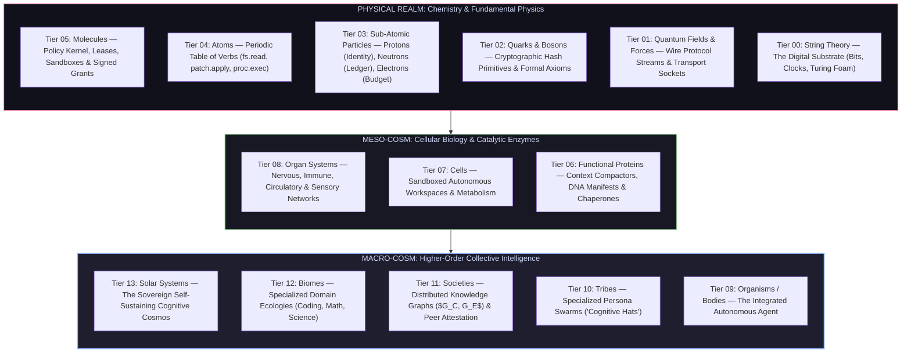

# Vanguard / GTS — The Architecture of Living Machine Intelligence

> *"True autonomous intelligence is not a monolithic program; it is an emergent property of the universe. It ascends from the fundamental strings of computation, bonds into cryptographic atoms and catalytic proteins, metabolizes inside cellular workspaces, and evolves through tribes, societies, and planetary biomes into a self-sustaining cognitive cosmos."*

---

## 1. The Cosmological & Biological Hierarchy of Competence

Contemporary AI frameworks treat autonomy as a brittle procedural loop: a model guessing tool calls inside an unconstrained shell. In nature, living intelligence is an **unbroken chain of emergent organization** spanning from fundamental physics to self-organizing societies.

Vanguard unifies computation, physics, biology, and cognitive science into a **14-tier cosmological continuum**:



---

## 2. Detailed Mapping: From Fundamental Strings to Cosmic Harmony

```text
┌─────────────────────────────────────────────────────────────────────────────────────────────┐
│ TIER 13: SOLAR SYSTEMS        ──▶ Self-Sustaining Universal Task-Solving Cosmos             │
│ TIER 12: BIOMES               ──▶ Multi-Domain Ecologies (Software, Math, Physics, Data)    │
│ TIER 11: SOCIETIES            ──▶ Distributed Knowledge Graphs ($G_C, G_E$) & Attestation  │
│ TIER 10: TRIBES               ──▶ Dynamic Specialized Role Swarms ("Cognitive Hats")        │
│ TIER 09: ORGANISMS / BODIES   ──▶ The Complete Unified Autonomous Agent Persona             │
│ TIER 08: ORGAN SYSTEMS        ──▶ Core Subsystems (Immune, Nervous, Circulatory Systems)    │
│ TIER 07: CELLS                ──▶ Sandboxed Agent Workspaces & Metabolic Lifecycle         │
│ TIER 06: FUNCTIONAL PROTEINS  ──▶ DNA Manifests, L1-L5 Compactors, Catalytic Translators   │
│ TIER 05: MOLECULES            ──▶ Policy Kernel, Budget Leases, Sandboxes & Signed Grants   │
│ TIER 04: ATOMS                ──▶ Periodic Table of Verbs (`fs.read`, `patch.apply`, etc.) │
│ TIER 03: SUB-ATOMIC PARTICLES ──▶ Protons (Keys/Identity), Neutrons (Ledger), Electrons ($) │
│ TIER 02: QUARKS & BOSONS      ──▶ SHA-256 Hashes, JSON Schemas, Formal Logic Axioms        │
│ TIER 01: QUANTUM FIELDS       ──▶ Socket Transports, Wire Protocol Feeds & Transport Sinks │
│ TIER 00: STRING THEORY        ──▶ Raw Binary, Clock Cycles & Universal Turing Substrate     │
└─────────────────────────────────────────────────────────────────────────────────────────────┘
```

---

### Phase I: The Physical Realm (Tiers 0 – 5)

#### Tier 00 — String Theory: The Digital Quantum Foam
* **Physics**: The vibrating 1-dimensional energy strings giving rise to all spacetime and matter.
* **Vanguard Reality**: The raw binary substrate, CPU clock cycles, bitstream entropy, and universal Turing machine substrate upon which all digital computation rests.

#### Tier 01 — Quantum Fields & Gauge Bosons: Transport & Interaction
* **Physics**: Electromagnetism, Strong and Weak nuclear force fields mediating interactions between particles.
* **Vanguard Reality**: Asynchronous socket streams, Unix domain socket NDJSON transports, protocol framing, and latency-bounded network conduits.

#### Tier 02 — Quarks & Elementary Bosons: Deterministic Integrity
* **Physics**: Fractional-charge quarks bound by gluons; immutable fundamental constants ($c, \hbar, G$).
* **Vanguard Reality**: SHA-256 cryptographic hashes, RFC 8785 byte-canonicalization rules, JSON Schema 2020-12 normative constraints, and immutable formal system axioms (`A-01`..`A-12`).

#### Tier 03 — Sub-Atomic Particles: Tripartite State Balance
* **Protons ($p^+$, Positive Core / Mass / Identity)**: The immutable Run ID, root principals, cryptographic Ed25519 public key authority, and non-repudiable origin identities.
* **Neutrons ($n^0$, Neutral Stability / Historical Mass)**: The immutable, append-only Event Ledger ($L$). It carries no active charge or bias, providing an incorruptible historical record of every event and receipt.
* **Electrons ($e^-$, Negative Charge / Volatile Dynamics / Energy Exchange)**: Transacting budget leases, volatile micro-dollar balances, in-flight execution tokens, and active telemetry signals.

#### Tier 04 — Atoms: The Periodic Table of Capability Valencies
Irreducible atomic action verbs characterized by their specific chemical valencies and bonding affinities:

| Element | Real Atom Nature | Vanguard Action Verb / Port | Functional Role in the Runtime |
|---|---|---|---|
| **Hydrogen ($H$)** | Lightest, universal exploratory probe | `fs.stat` / `fs.list` | Rapid existence verification and metadata scanning. |
| **Carbon ($C$)** | 4-valence backbone of organic structure | `fs.read` / `ports/index.py` | Structural ingestion of codebase topology and context. |
| **Oxygen ($O$)** | High-energy transformative combustor | `patch.apply` / `fs.write` | Energy-releasing modification of repository source trees. |
| **Phosphorus ($P$)**| Energy transfer & ATP backbone | `proc.exec` | Active subprocess execution and dynamic computation. |
| **Silicon ($Si$)** | Semiconductor crystal lattice | `fs.search` / AST RepoMap | High-precision symbol queries and syntax tree navigation. |
| **Nitrogen ($N$)** | Stable atmospheric binding matrix | `ports/` (`ModelPort`, `LedgerPort`) | Invariant interface contracts binding components. |

#### Tier 05 — Molecules: Bounded Chemical Compounds
* **Water ($H_2O$, The Universal Solvent)**: `Kernel.dispatch` — the fluid, deterministic stream through which all requests flow.
* **ATP (Adenosine Triphosphate, Cellular Energy Currency)**: `Governor.reserve` & `commit` — integer microdollar budget reservations fueling verified turns.
* **Lipid Bilayer (Hydrophobic Membrane Barrier)**: `adapters/sandbox/rootless.py` — rootless Bubblewrap container perimeter isolating untrusted workloads.
* **Salt Crystal Lattice ($NaCl$, Ionic Integrity)**: `AutonomousGrant` — signed, time-bounded cryptographic tokens guaranteeing non-repudiation.

---

### Phase II: The Meso-Cosm (Tiers 6 – 8)

#### Tier 06 — Functional Macromolecules & Catalytic Proteins
* **DNA / RNA (Genetic Information Macromolecule)**: Declarative Manifest Packs (`manifest.json`, `system-prompt.txt`, `AGENTS.md`) encoding the complete behavioral blueprint as pure data.
* **Catalytic Enzymes (L1–L5 Context Compactor)**: Active molecular scissors cleaving redundant dialogue while preserving the immutable brief and critical diagnostic receipts.
* **Ribosomes (Translation Machinery)**: `ProposalTranslator` converting unstructured model proposals into validated schema requests.
* **Chaperone Proteins (Quality Assurance)**: Automated verification receipt analyzers and failure fingerprint generators preventing misfolded code.

#### Tier 07 — Cells: Sandboxed Workspaces & Metabolism
* **The Living Cell**: The autonomous agent workspace (`HarnessSession`, `runtime/root.py`). It ingests task briefs, metabolizes token budgets into code transformations inside its lipid sandbox, and emits verifiable execution receipts.

#### Tier 08 — Organ Systems: Coordinated Internal Networks
* **Immune System**: The Attenuation Policy Kernel, continuously inspecting proposals and intercepting privilege escalation attempts.
* **Nervous System**: The Model Router and real-time Telemetry bus, routing cognitive signals to optimal specialized models.
* **Circulatory System**: The Event Ledger ($L$), pumping real-time state events across reducers, projections, and listeners.
* **Sensory System**: The Exterior Evaluator Daemon (UID 10002), observing environmental realities through un-gameable behavioral probes.

---

### Phase III: The Macro-Cosm (Tiers 9 – 13)

```
                            TIER 13: SOLAR SYSTEMS
                     (Universal Task-Solving Harmony)
                                     ▲
                                     │
                             TIER 12: BIOMES
                   (Software, Math, Physics, Simulation)
                                     ▲
                                     │
                            TIER 11: SOCIETIES
                   (Knowledge Graphs $G_C, G_E$ & Consensus)
                                     ▲
                                     │
                             TIER 10: TRIBES
                 (Specialized Cognitive Role Swarms / Hats)
                                     ▲
                                     │
                       TIER 09: ORGANISMS / BODIES
                     (Integrated Autonomous Agents)
```

#### Tier 09 — Organisms / Bodies: The Integrated Autonomous Agent
A self-contained sovereign intelligence with identity, task focus, boundary awareness, and self-preservation instincts (budget stewardship, error recovery).

#### Tier 10 — Tribes: Specialized Cognitive Role Swarms ("The Hats")
Rather than relying on an undifferentiated generalist model, the system dynamic switches into specialized cognitive archetypes:
* **The Architect (Strategic Planning)**: High-order decomposition, invariant mapping, and dependency sequencing.
* **The Executor (Precision Construction)**: Ultra-fast, localized in-place patch application with minimal token footprint.
* **The Adversarial Skeptic (Diagnostic & Falsification)**: Dedicated to finding boundary edge cases, security bypasses, and regression bugs.
* **The Synthesizer (Competence Distillation)**: Extracts generalized problem-solution patterns from completed runs.

#### Tier 11 — Societies: Shared Knowledge Graphs ($G_C, G_E$) & Mutual Attestation
A collective intelligence where individual agents contribute to a shared, persistent cognitive pool:
* **Competence Graph ($G_C$)**: Proven solutions crystallized as reusable polymers.
* **Evidence Graph ($G_E$)**: Negative failure fingerprints that vaccinate all future agents against repeating past mistakes.
* **Peer Attestation**: Independent agent verification without human bottleneck.

#### Tier 12 — Biomes: Specialized Domain Ecologies
Diverse operational environments with tailored evolutionary pressures:
* **The Software Engineering Biome**: Compilers, linters, tests, distributed repos.
* **The Formal Mathematics Biome**: Interactive theorem provers, proof assistants, Datalog logic.
* **The Scientific Research Biome**: Empirical simulation, hypothesis generation, data reduction.

#### Tier 13 — Solar Systems: The Sovereign Self-Sustaining Cognitive Cosmos
The culmination of our evolutionary trajectory: a self-stabilizing, closed-loop machine intelligence capable of **perpetual recursive self-improvement**. It uses its own verified competence to refine its tools, evolve its DNA packs, and solve multi-horizon scientific and engineering challenges with complete sovereignty.

---

## 3. The Recursive Engine: Self-Building & Evolutionary Distillation

Vanguard is explicitly designed to **use itself to build itself**:

$$\text{Next Generation Runtime} = \text{Distill}\Big(\text{Empirical Trials}(S_t) \;\cap\; \text{Exterior Proofs}(G_E)\Big)$$

1. **Autonomous Trial Exploration**: Across thousands of headless runs, Vanguard explores refactoring paths and architectural layouts against un-gameable oracles.
2. **Natural Selection**: Only trajectories achieving un-mocked `oracle_green` verification are retained.
3. **DNA Crystallization**: Verified workflows are compiled into permanent manifest packs, expanding the collective competence of the system for all future generations.

---

## 4. Phased Evolutionary Trajectory (v0.5.0 $\rightarrow$ v1.0.0+)

```
v0.5.0: The Empirical Seed (Working Greenfield Coding Harness)
   │
   ▼
v0.6.0: The Molecular Lattice (Decoupled Micro-Kernel Substrate)
   │
   ▼
v0.7.0: The Organism Benchmark (Comparative Topologies & Model Ensembles)
   │
   ▼
v0.8.0: The Cellular Cortex (Knowledge Graphs & Episodic Continuity)
   │
   ▼
v0.9.0: The Tribal Swarm (Emergent Meta-Cognitive Workflows & Hats)
   │
   ▼
v1.0.0: The Living Cosmic Intelligence (Unified Product & Self-Assembled Interface)
```

---

### Milestone 1 — v0.5.0: The Empirical Seed
* **Objective**: Lock the foundational primitives to deliver a real-world, functional agentic coding CLI.
* **Capabilities**: Multi-file repository exploration, in-place unified diff patching, test-driven validation, live model execution, and signed `AutonomousGrant` boundaries.
* **Success Metric**: Verifiable `oracle_green` execution on un-mocked greenfield applications with zero human code intervention.

### Milestone 2 — v0.6.0: The Molecular Lattice
* **Objective**: Decouple the micro-kernel from coding-specific logic into clean, interchangeable atomic plugins.
* **Capabilities**: Abstract environment ports (filesystem, database, OS, cloud) and declarative plugin composition.
* **Success Metric**: Zero-leakage hexagonal boundaries where new environments are bound purely through configuration.

### Milestone 3 — v0.7.0: The Organism Benchmark
* **Objective**: Systematically benchmark competing agent paradigms and multi-tier model topologies under identical experimental conditions.
* **Capabilities**: High-performance prompt caching, Tree-sitter AST maps, and Pareto-frontier optimization of model kits (planners, executors, diagnostic repair).
* **Success Metric**: Quantitative Pareto-frontier analysis mapping cost, latency, and task resolution rates across distinct configurations.

### Milestone 4 — v0.8.0: The Cellular Cortex
* **Objective**: Wrap the execution harness in persistent cognitive memory and knowledge graphs.
* **Capabilities**: Competence and Evidence Graphs ($G_C, G_E$), cross-session episodic continuity, and self-tuning context budgets.
* **Success Metric**: Measurable cross-task learning curve where subsequent tasks require fewer turns and lower token expenditure.

### Milestone 5 — v0.9.0: The Tribal Swarm
* **Objective**: Synthesize computer science, neuroscience, evolutionary biology, and formal mathematics into a universal task-solving engine.
* **Capabilities**: Dynamic persona archetypes ("Cognitive Hats"), evolutionary workflow polymers, dual-process System 1/System 2 reasoning, and epistemic uncertainty modeling.
* **Success Metric**: Autonomous resolution of high-ambiguity, multi-hour scientific and engineering challenges.

### Milestone 6 — v1.0.0: The Living Cosmic Intelligence
* **Objective**: Deliver the complete, commercial-grade product suite powered by the emergent backend intelligence.
* **Capabilities**: Lightning-fast Terminal UI, standalone Tauri-powered desktop IDE (`vanguard-gui`), and emergent self-assembly where the cognitive backend continuously optimizes the user interface.
* **Success Metric**: Seamless release of a unified, production-grade developer platform pairing cutting-edge scientific meta-cognition with an intuitive human interface.
