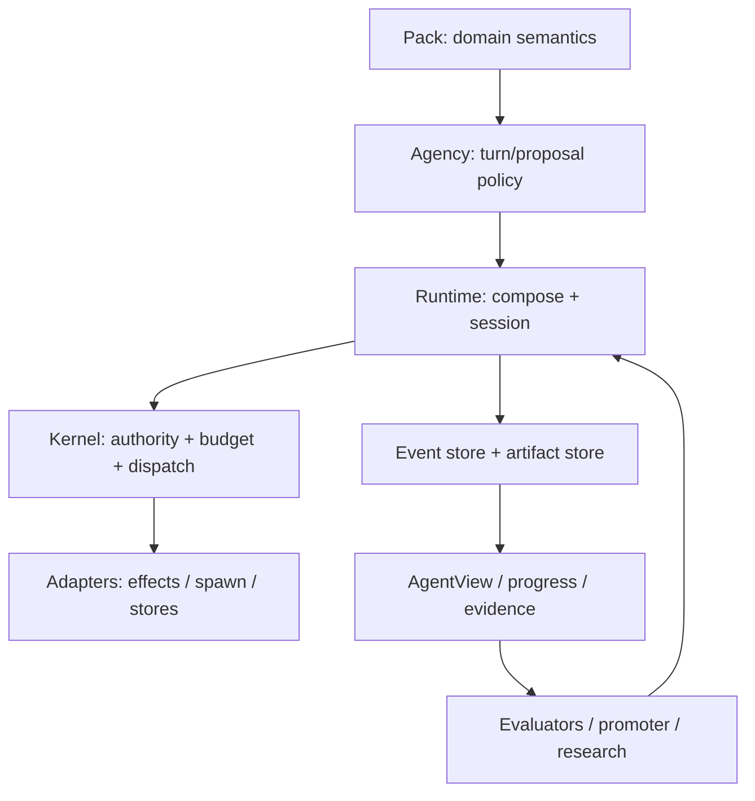
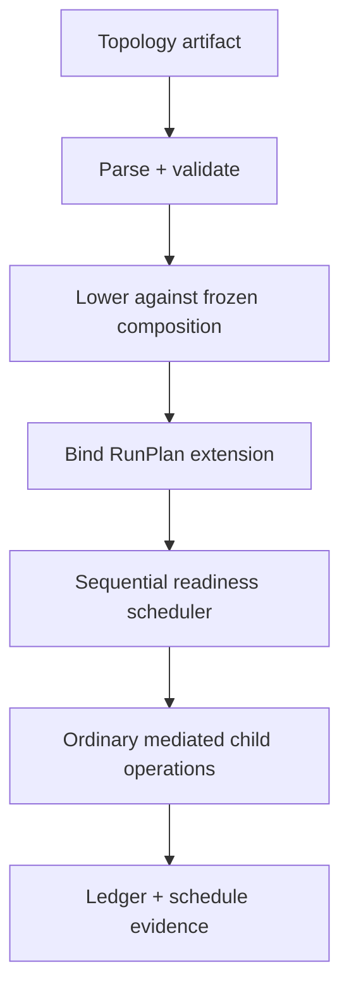
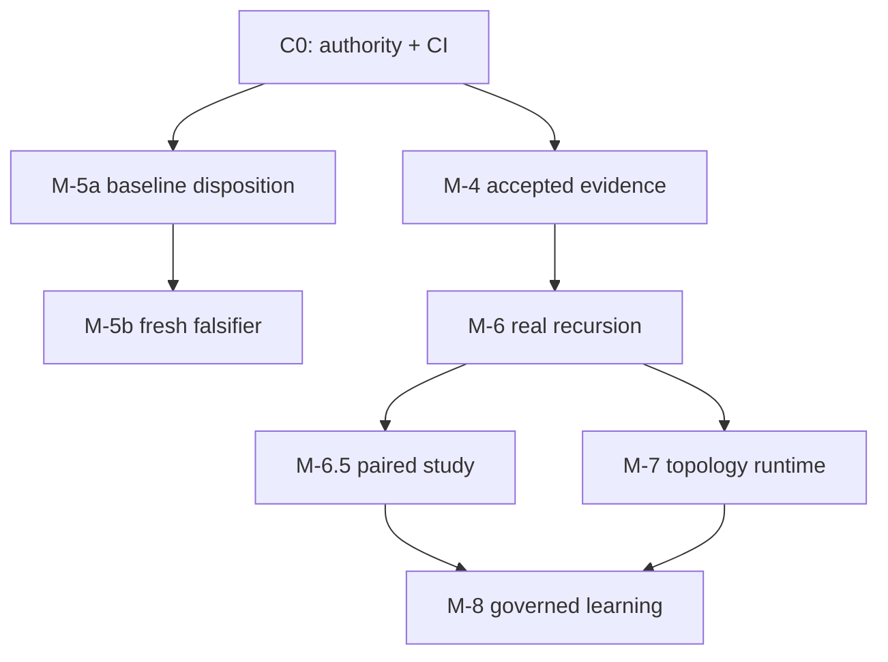

# AETHER Director Development Engineering Report

**Repository:** `brainopensource/cognitive-framework`  
**Branch audited:** `feat_higgs_M4_M8`  
**Remote and local HEAD:** `624d80fb428bee50a6610b18fd7736f6d316eb36`  
**Audit date:** 2026-08-26 (`America/Sao_Paulo`)  
**Delivery horizon:** convergence and implementation through M-8 (MVP); M-9/M-10 are non-authorizing outlooks  
**Role:** AETHER Engineering Leadership — Director / Principal Architect / Principal Engineer / Research Lead  
**Status of this document:** independent engineering decision record and execution plan. It becomes repository authority only after its decisions are ratified into the canonical Vision/Law/ADR/Execution chain.

---

## 0. Reading convention and epistemic discipline

This report does not equate code presence with integration, tests with release evidence, or a sprint checkbox with milestone closure. Statements are marked as follows:

- **[F] Fact:** directly observed in the audited commit, remote refs, executable gate output, or immutable source.
- **[I] Inference:** the strongest explanation supported by facts, but not itself directly observed.
- **[U] Uncertain:** missing or non-reproducible evidence prevents a conclusion.
- **[D] Director decision:** the implementation baseline selected here; it requires an ADR when it changes an accepted architectural or experimental contract.
- **[E] Experiment:** a question that must be answered empirically; the decision rule is fixed before the result.

Prior assessments, `masterplan_todo_rev1.md`, `sprint_doing_v2B.md`, milestone prose and commit messages were treated as evidence or proposals, never as conclusions. The order of authority remains:

`VISION.md → docs/SPEC.md + docs/01_law → accepted ADRs → schemas/contracts → docs/03_execution`

Lower documents may expose a gap but may not silently weaken a higher invariant.

---

## 1. Executive directive

The AETHER foundation is technically valuable and does **not** justify a rewrite. Preserve the dependency lattice:

`domain ← ports ← kernel ← agency ← runtime → adapters`

Preserve one public composition/activation path, a domain-blind Kernel, typed capability attenuation, four-dimensional additive budget accounting, append-only causal facts, content-addressed artifacts, deterministic projections, exterior evaluation, and fail-closed evidence. Do not create a second orchestrator, a second ledger, a privileged metacognition layer, a workflow-specific Kernel, or a parallel documentation constitution.

The branch is nevertheless not an M-4–M-8-complete product. It contains a mixture of strong primitives, partial runtime integrations, experimental harnesses, and unsupported completion claims. The principal problem is not only documentation drift: fresh inspection reveals material implementation gaps in M-6, M-7 and M-8.

### 1.1 Final status at the audited HEAD

| Milestone | Mechanism | Product integration | Accepted evidence | Director status |
|---|---|---|---|---|
| M-4 | Strong | Substantially present | Bundle/reviewer not repository-verifiable | **PROVISIONAL; gate open** |
| M-5a | Strong | Present | Required remote baseline absent | **IMPLEMENTED; promotion open** |
| M-5b | SAT pack/evaluator strong | Material run path exists | Historical zero-diff control unavailable/possibly contaminated | **DEMO COMPLETE; proof invalid** |
| M-6 | Attenuation/events/recovery components present | Default spawn may return synthetic success; no canonical recursive runner; identity/budget gaps | Unit/E2E tests use injected child callbacks | **PARTIAL; product gate open** |
| M-6.5 | Projection/controller/statistics present | Optional between-turn seam present | No non-degenerate attributable study | **IMPLEMENTED; experiment open** |
| M-7 | Parser/lowering/analyzer/reference scheduler present | `RunPlanExtension` is not consumed by public runtime | No three-topology execution or ADR-0099 evidence | **PARTIAL; integration and experiment open** |
| M-8 | Evaluation/signing prototypes strong; memory fake exists | No verified durable memory or atomic composition registry | No held-out lift | **PREPARATION; architecture and product open** |
| M-9/M-10 | Ideas only | None | None | **NOT AUTHORIZED** |

### 1.2 Program decision

- **GO** for convergence and bounded M-4–M-8 engineering.
- **NO-GO** for calling the current branch MVP-complete.
- **NO-GO** for starting M-9/M-10 feature implementation before M-8 acceptance.
- **NO-GO** for reusing or recreating the missing tag name `M-5A-BASE-v2`.
- **GO** for a successor baseline and a fresh generality falsifier if the original tag object cannot be recovered as a clean control.
- **GO** for M-6.5 to close on an honest negative result; capability improvement is not a precondition for scientific completion.
- **GO** for M-7 to close with sequential scheduling if the preregistered concurrency threshold is not met.

The shortest credible path to the MVP is:

`C0 authority/evidence convergence → C1 M-4/M-5/M-6 repair → C2 M-6.5 study → C3 M-7 integration/decision → C4 M-8 memory/learning MVP`

---

## 2. Audit scope, method and reproducibility

### 2.1 Sources inspected

The assessment covered production Python under `vanguard/packages`, MHF schemas, packs, falsifiers/contracts/integration tests, experimental instruments under `lab`, Git history, remote branches/tags, root Vision, Law, accepted ADRs, canonical milestones and sprint board, architecture/contracts documentation, all files under `docs/00_leadership_supersede_all`, `masterplan_todo_rev1.md`, and the latest `sprint_doing_v2B.md`.

The attached leadership documents match the repository copies byte-for-byte except the attached `VISION.md`, which is older than the repository root Vision. **[D]** The repository root Vision is constitutional; attachments remain review inputs.

### 2.2 Independently reconfirmed on 2026-08-26

| Observation | Result | Epistemic status |
|---|---|---|
| Remote `feat_higgs_M4_M8` | `624d80fb...` | [F] |
| Local checkout | same HEAD, clean | [F] |
| Remote `M-5A-BASE-v2` | absent | [F] |
| Remote `M-5-BASE` | present at tag object `1a7dcba...` | [F] |
| Boundary linter | PASS, 321 files | [F] |
| Kernel TCB | PASS, 1,373/1,438 logical LOC | [F] |
| Domain blindness | PASS; obsolete `layer0/` scan target warns | [F] |
| Isolation, duplication, links, stale paths, event coverage, RF IDs | PASS | [F] |
| RF-86 | FAIL-CLOSED because baseline ref does not resolve | [F] |
| Fresh test rerun in current runtime | not executable: `pytest` absent | [F] |

Earlier in this review session, before the current runtime image lost `pytest`, focused suites produced: Kernel 94/94, Agency 105/105, packs 39/39, M-5a 90/90, M-6 plus M-8 mechanisms 65/65, M-6.5 61/61, and M-7 33/33. These are **observed session evidence**, not a fresh clean-clone certification. The current report explicitly refuses to relabel them as a new full-suite pass.

Contract discovery also exposed a reproducible declaration defect: `test/contracts/test_m5a_schema_vectors.py` imports `jsonschema`, while the `dev` optional dependencies in `pyproject.toml` declare only `pytest`. Two Unix-domain-socket cases were blocked by the audit sandbox, so those results are **[U]** until rerun on qualified Linux.

### 2.3 Evidence limitations

The branch's claimed totals of 1,786 Python and 68 TypeScript checks were not independently reproduced from a clean environment in this audit. Provider credentials were unset, repository secret scanning passed, and the alleged provider-key incident in `sprint_doing_v2B.md` could not be reproduced. **[D]** Rotate a key only if actual key bytes reached a log, artifact or third party; independently add secret hygiene and log-redaction gates.

### 2.4 Why external engineering references are advisory

This architecture remains derived from AETHER's own invariants. External specifications are used only where they sharpen implementation choices: in-toto/SLSA-style subject/material attestations for evidence envelopes, OpenTelemetry-style correlated spans for non-authoritative duration observations, and SQLite WAL/FTS5 for the bounded single-host MVP adapter. These references do not supersede AETHER Law.

---

## 3. Code/document/claim reconciliation

### 3.1 Confirmed contradictions

1. `docs/03_execution/sprint_active.md` simultaneously says `M-5A-BASE-v2` is absent, says creation/push is DONE, says RF-86/RF-98 are DONE, says the gate is intentionally red, and instructs the team to create the tag next. **[F]**
2. `sprint_doing_v2B.md` reports an audit at `a92951d` while delivered at `624d80f`. Its D-5 says `EffectStarted` lacks a resource selector, but `kernel/dispatch.py` emits `resource`, `lab/m701_independence.py` reads it, and `test_m701_recorded_workload.py` expects useful independence. **[F]**
3. M-4 is called CLOSED while its independent review is waived for development only. **[F]**
4. `docs/00_leadership_supersede_all` contains duplicate reviews, proposed ADR material, specs, backlog, boards and a masterplan that itself says it must not become a parallel authority. **[F]**
5. README/AGENTS/traceability/contracts describe older milestone and schema states. **[F]**
6. Production/schema/test changes are hidden in several `docs(...)` commits. **[F]** Commit labels are therefore unreliable provenance.
7. `pyproject.toml` reports `0.7.0` while commit and planning prose use 0.7.2/0.7.3. **[F]**

### 3.2 Corrections to previous technical conclusions

#### M-7 selector and timing

The selector gap is false. The timing question is real but was framed incorrectly. Ledger envelope timestamps establish causal ordering and approximate wall time; they are not a monotonic performance clock. An append-only `EffectStarted` must never be mutated with settlement data. **[D]** Add correlated, non-authoritative start/end telemetry outside Kernel only if M7-01 needs duration; bind telemetry by `run_id`, `episode_id`, `operation_id`, `descriptor_digest` and `idempotency_key`.

#### M-6 completion claim

`runtime/delegation.py` correctly models spawn as an ordinary effect, emits `ChildSpawned` before execution, uses typed `DelegationResult`, and treats an orphan as `UNDETERMINABLE`. But `_spawn_effector` supplies a synthetic successful child result when `TaskContext.run_child` is absent. Tests inject callbacks; no canonical recursive `Runtime.run_composed` child executor is demonstrated. `_mint_child_id()` is an in-memory counter that can collide after restart for distinct new intents, and `_child_budget()` validates dimensions without proving componentwise attenuation against parent remaining budget. **[D]** M-6 is partial, not package-ready.

#### M-8 capability claim

`MemoryAccess.permitted()` verifies only nonempty strings plus a boolean `revoked`; tests pass the literal `"grant"`. The in-memory port is a useful contract fake, not capability mediation. The composition registry is also in-memory and rollback is pointer mutation, not durable atomic deployment. **[D]** Public M-8 APIs remain disabled until verified authorization and persistent CAS promotion exist.

### 3.3 Disposition of existing leadership artifacts

| Artifact | Useful content | Disposition |
|---|---|---|
| Phase-1 assessment / ADR-0097 review | constitutional lock, layer responsibilities | Extract accepted decisions; retain historical copy only |
| Architecture delta / milestone specs | implementation hypotheses and code map | Reconcile against this report; do not keep as parallel plan |
| BACKLOG / DEVELOPMENT_PLAN / sprint drafts | tasks and acceptance ideas | Replace by canonical execution rows |
| `masterplan_todo_rev1.md` | broad issue inventory, invariants, RF map | Archive after extracting decisions; never active authority |
| `sprint_doing_v2B.md` | missing-tag and experiment warnings | Correct false D-5 and M-6 status; archive as review input |
| root Vision/Law/accepted ADRs | constitutional/normative authority | Preserve; amend only through ADR process |
| `docs/03_execution/*` | sole current status/authorization | Rewrite from receipt-backed generated state |

---

## 4. Convergence decisions and concept lock

### 4.1 Ontology

1. **[D]** AETHER is a general event-sourced agentic computation substrate, not a coding workflow product with later generalization.
2. **[D]** An operation is a typed causal proposal/effect/settlement within a lineage. An agent is identity + policy + event-derived view + attenuated scope, not a mutable object holding truth.
3. **[D]** An event is an immutable fact; an artifact is immutable content; a projection is disposable derived state; telemetry is correlated observation; an attestation is a signed claim over immutable subjects/materials. None substitutes for another.
4. **[D]** Domain semantics live in packs and exterior evaluators. Kernel may know generic actions, selectors, grants, reservations, occurrence and settlement, never SAT, coding, research, memory categories, topology roles or learning strategies.
5. **[D]** Topology determines structural relations; scheduler determines temporal order; policy determines admissibility; Kernel enforces authority and accounting. No component may absorb the others.
6. **[D]** Metacognition proposes ordinary strategy operations between turns. It grants no authority, changes no ceiling, and is off by default until evidence supports a profile-specific enablement.

### 4.2 Resource and authority algebra

The conserved additive cost vector is fixed:

\[
\mathbf{c}=(c_{usd\_micros},c_{millis},c_{tokens},c_{bytes})\in\mathbb{N}_0^4
\]

For every parent with remaining budget \(\mathbf{B}_p\), child reservation \(\mathbf{R}_c\), actual child cost \(\mathbf{A}_c\), and refund \(\mathbf{F}_c\):

\[
0\leq \mathbf{A}_c\leq \mathbf{R}_c\leq \mathbf{B}_p,\qquad
\mathbf{F}_c=\mathbf{R}_c-\mathbf{A}_c
\]

All inequalities are componentwise. `depth` and `turns` are independent structural ceilings and can only decrease under delegation. Scope attenuation is conjunctive:

\[
Actions_c\subseteq Actions_p,\quad Resources_c\preceq Resources_p,\quad
depth_c\leq depth_p-1,\quad turns_c\leq turns_p
\]

Unknown selector relations, missing balances, negative values, overflow and unverified grants deny. A child cannot “borrow” one dimension by saving another.

### 4.3 Evidence state machine

Every milestone obligation has this monotonic state:

`ABSENT → PRODUCED → VERIFIED → INDEPENDENTLY_ACCEPTED`

Operational package state is separate:

`PLANNED → IMPLEMENTED → INTEGRATED → PACKAGE_READY`

A milestone is `CLOSED` only if every required obligation is `INDEPENDENTLY_ACCEPTED`. `WAIVED`, `BLOCKED`, `UNDETERMINABLE`, missing artifacts and missing remote refs are never aliases for pass.

### 4.4 Schema and compatibility lock

- `/1` serialized bytes remain immutable.
- Current writers emit `/2`; readers accept `/1|/2` and normalize into one internal value.
- Unknown event kinds are preserved by generic folds and rejected only where a projection requires understood semantics.
- Reducer/checkpoint/schema versions are pinned independently.
- A semantic reducer change bumps its reducer version even if the envelope does not change.
- Removal requires two released read cycles plus migration evidence; it is never bundled with a writer cutover.
- **[D]** Version source of truth is `pyproject.toml`; use a PEP 440 development version (recommended `0.7.3.dev0`) until the release gate chooses the final Higgs tag. Docs render this value; they do not invent it.

### 4.5 Decisions requiring ADRs

| ADR | Decision fixed by this report | Ratification timing |
|---|---|---|
| ADR-0101 “Graviton” | evidence-envelope methodology, hypothesis/falsifier/receipt lineage, positive and negative results | C0 |
| ADR-0102 Convergence & Baseline Succession | status reset, lost/contaminated tag disposition, successor baseline, document retirement | C0 |
| ADR-0099 Scheduler Disposition | sequential remains default; lift only under preregistered M7-01 rule | after M7-01 |
| ADR-0100 Memory & Learning Contract | five conceptual categories, four external ports, verified auth, typed lifecycle claims, durable CAS registry | before M-8 public wiring |

---

## 5. Target architecture through M-8



### 5.1 Layer responsibilities

| Layer | Owns | Must not own |
|---|---|---|
| Domain | immutable values, canonicalization, event/reducer semantics, selector algebra | I/O, model calls, store handles, scheduling |
| Ports | protocols and typed failures | implementations, ambient globals |
| Kernel | classify, authorize, reserve, dispatch, settle, occurrence | domain verbs, topology, memory, controller policy |
| Agency | generic context/turn/proposal policy | capabilities, durable truth, concrete adapters |
| Runtime | sole composition and activation seam, session lifecycle, projections, wiring | hidden authority or alternate ledgers |
| Adapters | environment/model/store/spawn/memory mechanics | policy decisions, self-issued grants |
| Packs | task semantics, manifests, prompts, exterior oracle definitions | substrate edits for ordinary extension |
| Lab/evidence | preregistration, experiments, reports, independent signatures | production authority, self-promotion |

### 5.2 Canonical control flow

1. Parse and freeze a manifest; compute composition digest \(D_H\).
2. Resolve the execution profile and optional authority-free plan extensions.
3. Validate environment/store/model/oracle/preregistration; compute run digest \(D_R\).
4. Append `EpisodeStarted`; every proposal/effect follows the existing Kernel path.
5. Artifacts are stored first; `ArtifactCreated` records only an addressable immutable fact.
6. Reducers derive `LedgerState`, `AgentView` and progress from events.
7. Optional controller consults a stable between-turn snapshot and returns an ordinary directive.
8. Terminal evaluation occurs through exterior authority and produces signed evidence.
9. Release mode derives a gate bundle, verifies cold reconstruction and records an independent acceptance receipt.

### 5.3 Dependency enforcement

Keep the existing boundary and TCB linters, and add AST/import-closure tests that reject:

- runtime/adapters imported by domain, ports, Kernel or Agency;
- pack identifiers in generic layers;
- new public execution loops outside `Runtime`/`HarnessSession`;
- direct event-store appends outside registered writer roles;
- memory/promoter signing keys available to generator/evaluator identities;
- topology objects carrying verbs, principals, grants or raw capability handles.

---

## 6. Cross-cutting contracts

### 6.1 Immutable evidence envelope

Adopt a small AETHER-native envelope compatible in spirit with the [in-toto Statement subject/predicate model](https://in-toto.io/Statement/v1) and [SLSA build provenance](https://slsa.dev/spec/draft/build-provenance), without importing a supply-chain framework into runtime code.

```json
{
  "schema": "aether.evidence/1",
  "evidenceId": "uuidv7",
  "claimType": "milestone-gate|experiment|replay|promotion|review",
  "subject": [{"name": "run|artifact|commit|composition", "digest": "sha256:..."}],
  "materials": [{"name": "task|dataset|baseline|protocol", "digest": "sha256:..."}],
  "run": {
    "projectId": "...", "runId": "...", "episodeId": "...",
    "compositionDigest": "...", "activationDigest": "...", "runDigest": "...",
    "profileDigest": "...", "topologyDigest": null
  },
  "pins": {"event": "mhf.event/2", "trajectory": "mhf.trajectory/2", "reducer": "v1.1.0"},
  "environment": {"codeCommit": "...", "treeDigest": "...", "imageDigest": "...", "dependencyLockDigest": "..."},
  "protocol": {"id": "...", "version": "...", "preregistrationDigest": "..."},
  "outcome": "PASS|FAIL|NEGATIVE|UNDETERMINABLE",
  "artifactRefs": ["sha256:..."],
  "createdAt": "RFC3339",
  "producer": {"id": "...", "role": "runner|evaluator|reviewer"},
  "signature": {"algorithm": "ed25519", "keyId": "...", "value": "..."}
}
```

Canonical JSON bytes determine the digest. Signatures cover every field except the signature itself. Producer and reviewer keys are distinct. A gate verifier checks subject/material existence, signature, pins, code/tree identity, remote ref reachability and outcome semantics.

### 6.2 Baseline manifest

An annotated tag alone is necessary but insufficient. Store a signed manifest beside release evidence:

```yaml
schema: aether.baseline/1
name: CONVERGENCE-BASE-v1
commit: <40-hex>
tree_digest: sha256:...
tag_object: <40-hex>
remote_ref: refs/tags/CONVERGENCE-BASE-v1
package_version: 0.7.3.dev0
schema_pins: {...}
reducer_pins: {...}
dependency_lock_digest: sha256:...
required_gate_receipts: [sha256:...]
prohibited_treatment_paths: [...]
created_by: <identity>
review_receipt: sha256:...
```

The baseline gate resolves the tag remotely, verifies tag-object and commit equality, recomputes the tree and manifest digests, and rejects treatment contamination.

### 6.3 Gate receipt and machine-readable board

```yaml
milestone: M-6
obligation: M6-RUNTIME-CHILD
package_state: INTEGRATED
evidence_state: VERIFIED
evidence_refs: [sha256:...]
review_ref: null
blocked_on: [independent_review]
last_verified_commit: 624d80f...
```

`sprint_active.md` is rendered from or validated against this single table. A linter rejects `DONE/CLOSED` without resolvable receipts, contradictory duplicates, waived mandatory gates, or named refs absent remotely.

### 6.4 Error and occurrence semantics

Use typed failures across ports; no string parsing in callers.

| Class | Meaning | Runtime action | Evidence action |
|---|---|---|---|
| `Denied` / `DID_NOT_OCCUR` | authorization/policy prevented execution | no retry unless inputs change | record refusal |
| `Failed` / `OCCURRED` | effect occurred and returned failure | settle actual cost; compensate if supported | record receipt |
| `Undeterminable` | occurrence cannot be established | no blind retry; reconcile/idempotency lookup | block pass claim |
| `RequiredEvidenceFailure` | required artifact/event/receipt could not persist | terminate evidentiary run | outcome FAIL |
| `OptionalEvidenceDegraded` | optional capture missing | continue only if profile allows | explicit degraded vector |
| `InvariantViolation` | reducer chain, authority, budget or signature invalid | fail closed; quarantine state | security incident |

Model/provider exceptions must map to typed occurrence only at the adapter boundary. `except Exception: success/empty` is forbidden. Unknown never becomes zero, empty artifact, completed child or PASS.

### 6.5 Checkpoint policy

**[D]** Checkpoints remain caches, never truth. Add a versioned `CheckpointPolicy` to `ExecutionProfile`:

```python
CheckpointPolicy(
    schema="aether.checkpoint-policy/1",
    max_events=256,
    max_turns=16,
    on_terminal=True,
    verify_on_release=True,
)
```

Capture at the first threshold reached and at terminal, only when retention permits. Threshold counters exclude the checkpoint's own artifact event. Every load verifies blob digest, reducer/event/schema pins, run/episode/branch identity and prefix sequence. Any failure cold-folds. Release verification cold-folds independently and compares state digests. Profile changes enter \(D_R\).

### 6.6 Observability and timing

Ledger timestamps are causal audit fields, not high-resolution duration authority. Implement a `TelemetrySink` port outside the TCB, following the [OpenTelemetry trace separation of span identity and start/end observations](https://opentelemetry.io/docs/specs/otel/trace/api/):

```python
SpanRef = (run_id, episode_id, operation_id, descriptor_digest, idempotency_key)
start = monotonic_ns()
... ordinary dispatch ...
sink.observe(Span(ref, start_ns=start, end_ns=monotonic_ns(), outcome=...))
```

Wall timestamps support cross-artifact correlation; monotonic duration supports within-process measurement. Cross-host comparison uses synchronized wall clocks plus uncertainty metadata; never subtract unrelated monotonic epochs. Missing telemetry lowers measurement completeness and cannot alter ledger truth. This follows the same conceptual separation used by the OpenTelemetry trace specification, where spans bind start/end observations and immutable span identity.

### 6.7 Security and capability boundary

- Verify signatures and expiry at use time, not only at construction.
- Bind grants to issuer, subject, actions, canonical selector, purpose digest, tenant/project, not-before/expiry, nonce and revocation epoch.
- Use constant-time signature verification where library primitives provide it.
- Signing keys never enter event/artifact payloads; only key IDs and signatures do.
- Artifact dereference performs authorization independently from knowledge of a digest.
- Secret scanning covers source, Git diff, generated evidence, stdout/stderr and trajectory payloads.
- Model inputs use redacted artifacts according to the resolved profile; raw goal text remains outside append-only ledger truth.
- Multi-tenant/project isolation begins in M-8, not M-9, because persistent memory creates the first durable cross-run disclosure surface.

### 6.8 Performance budgets

Correctness gates are hard; performance gates compare against digest-pinned baselines and use distributions, not a single run.

| Surface | MVP requirement |
|---|---|
| Kernel TCB | remain ≤1,438 logical LOC unless ADR changes budget |
| Event append | no >10% median regression and no >20% p95 regression vs accepted baseline |
| Cold fold | no >15% throughput regression; current ~42k events/s is prior benchmark evidence, not universal SLA |
| Checkpoint resume | p95 ≥5× faster than cold fold at 10k events; parity exact |
| Memory write | atomic commit; p95 <50 ms for 4 KiB record on reference local host |
| Lexical recall | p95 <100 ms at 100k records, limit≤20, warm local store |
| M-7 sequential disabled path | event/trajectory digest parity, excluding declared run-extension identity |
| Optional telemetry | <3% median runtime overhead on reference workload |

Hardware, OS, Python, SQLite and dataset identities must accompany every benchmark. A failure triggers profiling, not silent threshold relaxation.

---

## 7. Baseline recovery and convergence algorithm

### 7.1 Lost-tag decision

```text
obtain original M-5A-BASE-v2 tag object, annotation and target
  ├─ unavailable → record LOST_PROVENANCE; never recreate name
  └─ available
       ├─ target contains only reviewed M-5a substrate → push unchanged; verify manifest
       └─ target contains treatment code → record CONTAMINATED; never use as control
```

The Git history shows formal/delegation/meta-controller/topology/memory work in commits before the board's alleged tag-creation state. **[I]** A recovered tag is likely contaminated, but only the tag target can decide.

### 7.2 Successor strategy

If no clean original control exists:

1. Correct C0 defects and integrate only the agreed generic substrate repairs.
2. Obtain clean-clone green receipts and independent review.
3. Create and push immutable `CONVERGENCE-BASE-v1` with the manifest in §6.2.
4. After the tag, add a materially different deterministic formal pack (`formal-graph-coloring`).
5. Run RF-86/RF-98 against the successor baseline over the protected substrate path set.
6. Relabel the existing SAT result as a regression/demo, not historical proof.
7. Record this as M-5b requalification under ADR-0102; do not rewrite historical claims.

This proves the forward claim that a new non-coding domain extends AETHER without substrate semantics. It cannot retroactively prove what happened before the missing control, and the report will not pretend otherwise.

---

## 8. M-4 — Product coding proof and scientific capture

### 8.1 Preserve

- `mhf.execution-profile/2` and `mhf.trajectory/2` writer/reader strategy.
- exact provider input/output capture at `_LayeredOperator.propose`.
- `ArtifactWriter` content-first semantics and required/degraded error split.
- file-backed SQLite WAL release requirement.
- proof-honest reproducibility vector separating capability from verification.
- `CheckpointManager` pin/hash validation and cold fallback.
- `RunPlan` separation of composition identity \(D_H\), run identity \(D_R\), and exterior experiment identity \(D_X\).

### 8.2 Fix or complete

1. Declare/lock `jsonschema` and all test dependencies; clean bootstrap installs only declared dependencies.
2. Make foundation/gate bundle complete rather than a partial set of derived rows. `foundation_evidence.py` currently derives available rows and honestly leaves gaps; release closure needs an explicit required-row verifier.
3. Persist an RF-95 candidate bundle outside the executing episode and obtain an independent reviewer signature.
4. Add automatic terminal checkpoint under the policy in §6.5.
5. Make artifact index and retrieval authorization part of the release bundle; knowing a content digest must not grant read authority.
6. Normalize version and environment identity, including dependency lock and container/image digest.
7. Run qualified Linux UDS lifecycle and TypeScript gates.

### 8.3 RF-95 protocol

Exactly one candidate is created after preregistration. The task must require a real repository modification, test execution and durable proof. The gate verifies:

1. a non-empty, semantically correct diff;
2. preregistered tests pass through the mediated environment;
3. every privileged effect has `EffectStarted → settlement`, grant/lease/descriptor/resource binding and artifact provenance;
4. trajectory `/2` contains model route, prompt/context/compaction/cache, usage measurement status and per-turn costs;
5. WAL survives fresh process and cold reconstruction yields identical terminal state;
6. required artifacts dereference and hash correctly under reviewer authorization;
7. external reviewer recomputes the gate and signs ACCEPT/REJECT.

```python
def close_m4(bundle, reviewer_keyring):
    require(bundle.preregistration.precedes(bundle.first_event))
    require(bundle.run_plan.durable and bundle.trajectory.schema == "mhf.trajectory/2")
    require(verify_hash_chain(bundle.events))
    require(verify_artifacts(bundle.artifact_index))
    require(cold_fold(bundle.events).digest == bundle.terminal_state_digest)
    require(verify_external_oracle(bundle.verdict))
    return independent_review(bundle.digest, reviewer_keyring)
```

### 8.4 M-4 falsifiers

- missing prompt/model output, cache hit source or context-selection reason;
- required capture failure followed by continued release run;
- WAL configured in memory or on an unqualified network filesystem;
- checkpoint accepted with wrong pin/hash/prefix;
- “verified” reproducibility without an executed receipt;
- reviewer identity equal to run producer;
- provider usage unavailable but reported as zero measured tokens/cost.

### 8.5 M-4 Definition of Done

M-4 closes when clean-clone gates pass, one immutable RF-95 bundle is externally replayed/reviewed, the receipt resolves every subject/material, and the board points to that receipt. If the prior bundle is unavailable, execute one new preregistered candidate; do not manufacture provenance for the old claim.

---

## 9. M-5a — Event-derived agent

### 9.1 Preserve

- `/2` event envelope writer with dual-read compatibility.
- pure `AgentView` projection and explicit reducer version.
- immutable goal identity, plan revisions, attempts, effects, budgets, strategies, child lineage and terminal state derived from events.
- checkpoint cache distinct from event truth.
- transitive TCB closure rather than directory-only counting.

### 9.2 Projection contract

For ordered valid envelopes \(E=(e_1,\ldots,e_n)\), reducer \(R_v\) must satisfy:

\[
V_n=fold(R_v,V_0,E),\qquad
fold(R_v,fold(R_v,V_0,E_{1:k}),E_{k+1:n})=V_n
\]

and deterministic canonicalization:

\[
digest(V_n)=digest(fold(R_v,V_0,deserialize(serialize(E))))
\]

The reducer fails on broken sequence/hash relations, impossible state transitions and duplicate terminal settlement. Unknown kinds remain preserved by the generic state fold; `AgentView` may ignore explicitly irrelevant known facts but cannot invent defaults.

### 9.3 Required AgentView fields

`lineage_id`, parent/children, goal digest/artifact ref, current plan digest and revision chain, attempt records, open/settled effect map, additive consumed/remaining budget, depth/turn ceilings, current strategy and context epoch, artifact/provenance refs, terminal state/reason, last sequence and reducer/schema pins.

### 9.4 Complete the baseline gate

- Resolve the original tag decision under §7.
- If lost/contaminated, close implementation but record historical baseline as invalid and use `CONVERGENCE-BASE-v1` for later forward experiments.
- Add property tests for fold associativity by arbitrary event partition, fresh-process reconstruction, checkpoint parity, unknown-event preservation, and event `/1|/2` vector compatibility.
- Benchmark append, full cold fold, checkpoint resume and projection memory at 1k/10k/100k events.

### 9.5 Migration

Writers remain `/2`. `/1` readers normalize aliases without rewriting stored bytes. Checkpoints with previous reducer pins fail to cold fold. No data migration is required for ledger truth; optional offline checkpoint regeneration writes new artifacts and never edits events.

### 9.6 M-5a Definition of Done

All reconstruction/property/performance gates pass; the baseline disposition is independently accepted; the active successor baseline resolves remotely with signed metadata; no semantic state depends on a live Python object.

---

## 10. M-5b — Generality falsifier

### 10.1 Scientific claim

M-5b does not prove “generality”. It attempts to falsify this narrower claim:

> A materially non-coding domain can be introduced through pack, manifest, adapter-neutral task values and an exterior evaluator without changing protected substrate semantics.

The current SAT pack is valuable mechanism/regression evidence. It is not admissible historical proof because the required control tag is absent and may have contained treatment code.

### 10.2 Fresh witness: deterministic graph coloring

Use an undirected graph \(G=(V,E)\), fixed color bound \(k\), and candidate assignment \(f:V\to\{0,\ldots,k-1\}\). The oracle verifies completeness, range and:

\[
\forall (u,v)\in E,\quad f(u)\neq f(v)
\]

The evaluator performs verification only, not search. Include satisfiable, unsatisfiable-with-certificate-policy, malformed, incomplete, duplicate-vertex and adversarial-order vectors. Canonicalize vertices/edges before digesting; shuffle serialization order in metamorphic tests.

```python
def verify_coloring(instance, witness):
    if set(witness) != set(instance.vertices): return REJECT("incomplete")
    if any(type(c) is not int or not 0 <= c < instance.k for c in witness.values()):
        return REJECT("range")
    for u, v in canonical_edges(instance.edges):
        if witness[u] == witness[v]: return REJECT("edge", edge=(u, v))
    return ACCEPT(digest=canonical_digest(witness))
```

### 10.3 Protected diff surface

At minimum: `vanguard/packages/{domain,kernel,ports,agency,runtime}`, existing generic schemas, Kernel TCB closure, runtime public composition/activation seams and accepted Law. Allowed treatment: new pack files, pack-local oracle/fixtures, manifest entries, generated schema instances and test registration that does not change generic semantics.

### 10.4 Evidence protocol

1. Freeze `CONVERGENCE-BASE-v1` before the graph-coloring pack exists.
2. Preregister task vectors, oracle digest, allowed/protected paths and pass/fail expectations.
3. Execute through `Runtime.execute_harness`, never call oracle from the agent.
4. Verify signed positive and negative vectors externally.
5. RF-86 proves zero protected semantic diff; RF-98 proves Kernel neutrality/TCB.
6. Repeat with serialization permutations and fresh process.

### 10.5 M-5b Definition of Done

Successor baseline is valid; graph-coloring produces deterministic exterior witness results through the unchanged substrate; negative vectors reject; RF-86/RF-98 pass; independent reviewer accepts the evidence envelope. The SAT pack remains as a second regression domain.

---

## 11. M-6 — Mediated recursive delegation

### 11.1 What is correct

- Spawn is modeled as an ordinary `agent.spawn` effect; Kernel remains verb-blind.
- Child scope uses the existing attenuation algebra.
- `ChildSpawned` precedes execution and `ChildReturned` is a typed digest result.
- Orphans become `UNDETERMINABLE`; settled idempotency keys prevent blind duplicate execution.
- Child actual cost returns to the ordinary parent lease settlement path.
- Goal prose is excluded from the append-only ledger.

### 11.2 P0 implementation defects

1. **Synthetic success:** `_spawn_effector` defaults to a zero-digest completed result when no `run_child` is supplied. Production must fail composition or bind a real child executor.
2. **Volatile child identity:** `parent.cN` uses a process-local counter. After restart a new idempotency key can reuse an existing child ID.
3. **Budget attenuation incomplete:** child budget dimensions are validated but not componentwise bounded against parent remaining/reserved budget before `ChildSpawned`.
4. **Canonical recursion absent:** the public runtime does not demonstrate a child `HarnessSession` built from a declared target composition under the child's scope/budget/profile.
5. **Join/recovery policy incomplete:** open child reconciliation reports unknown, but the product needs an explicit resume/reconcile/abandon decision and kill-tree semantics.
6. **Emitter episode semantics require proof:** parent/child event partition and cross-lineage fold must be verified so the parent can rebuild joins without broad unscoped store reads.

### 11.3 Target interfaces

```python
@dataclass(frozen=True)
class SpawnIntent:
    target_composition_digest: str
    goal_digest: str
    goal_artifact: str | None
    requested_scope: ScopeValue
    requested_budget: CostVector
    max_turns: int
    idempotency_key: str

class ChildRuntimePort(Protocol):
    def execute_child(self, plan: ChildRunPlan, auth: VerifiedGrant) -> DelegationResult: ...

class ChildIdFactory(Protocol):
    def derive(self, parent_episode_id: str, idempotency_key: str) -> str: ...
```

Derive child ID deterministically, for example `child-<base32(sha256(parent_episode_id || 0x00 || idempotency_key))[:26]>`. Collision check is mandatory; a conflicting existing intent is `InvariantViolation`.

### 11.4 Spawn algorithm

```python
def execute_spawn(request, parent_state):
    require(request.idempotency_key)
    previous = lookup_intent(parent_state.run_id, request.idempotency_key)
    if previous.settled: return replay(previous.receipt)
    if previous.open: return UNDETERMINABLE(previous.child_id)

    child_id = durable_id(parent_state.episode_id, request.idempotency_key)
    scope = attenuate(parent_state.scope, request.requested_scope)       # fail closed
    budget = reserve_componentwise(parent_state.remaining, request.budget)
    turns = min(parent_state.remaining_turns, request.max_turns)
    depth = parent_state.depth + 1
    require(depth <= parent_state.max_depth and turns > 0)

    plan = bind_child_plan(target_digest, child_id, scope, budget, turns,
                           parent_run_digest=parent_state.run_digest)
    append_durable(ChildSpawned(plan.digest, child_id, ...))
    try:
        result = child_runtime.execute_child(plan, verified_grant(scope))
    except OccurrenceUnknown as err:
        return UNDETERMINABLE(child_id, err.receipt)
    append_durable(ChildReturned(child_id, result.digest, result.actual_cost, ...))
    return settle_parent_lease(result.actual_cost)
```

The child executor calls the same `Runtime.run_composed` path with a frozen target composition. It cannot inherit ambient ports; every port/capability is explicitly rebound under the attenuated grant. A child may spawn recursively only if its scope includes `agent.spawn` and depth/turn ceilings remain.

### 11.5 Recovery and concurrency

- Persist intent→child mapping before launch.
- On restart: settled→replay; spawned/open→query child ledger/environment receipts; provably not occurred→release; occurred→settle; uncertain→quarantine/manual reconciliation.
- Never automatically rerun an open privileged subtree.
- Cancellation propagates as a capability-mediated request; it does not erase facts.
- M-6 remains sequential. Parent waits for typed join. Parallel children belong to M-7 after scheduling evidence.
- Kill-tree tests must prove no orphan process/container/socket and budget leases are closed or explicitly quarantined.

### 11.6 M-6 tests and falsifiers

- production composition without `ChildRuntimePort` fails before first child fact;
- restart with a different intent never reuses a child ID;
- every budget dimension is bounded before spawn and conserved after settlement;
- requested resource/action widening denies without `ChildSpawned`;
- depth/turn widening denies independently of cost;
- child raw transcript/handle is rejected;
- nested depth ≥3 cold-reconstructs identical lineage, costs and terminal states;
- crash at each boundary (before spawn fact, after fact, mid-child, after result before settlement) yields the correct occurrence and no duplicate effect;
- cross-project/parent ledger lookup cannot satisfy idempotency;
- Kernel diff remains empty and TCB budget green.

### 11.7 M-6 Definition of Done

The synthetic fallback is removed; a real child runtime is wired through the sole public path; durable IDs, componentwise budget attenuation, nested recovery and kill-tree tests pass; one signed depth≥3 bundle is independently reviewed. Only then may M-6 close.

---

## 12. M-6.5 — Adaptive strategy without privilege

### 12.1 Preserve and correct

Preserve the pure `MetaController` SPI, between-turn consultation, output authority/budget guards, context-epoch confidence validation, deterministic directive check, `StrategyChanged` attribution, and controller-off baseline.

Correct the progress model before claiming science. The current `fold_progress` is deterministic but coarse: failure and assessment increments can conflate distinct causes; budget burn is a difference per assessment index rather than per causal unit/time; repeat signatures are accumulated without window/entropy; confidence digests are not folded into the returned view. **[D]** Keep it as compatibility projection, add a versioned `ProgressProjection/2` for experiments.

### 12.2 Progress vector

At semantic checkpoint \(t\), derive:

\[
P_t=(\Delta V_t, F_t, H_t, N_t, C_t, R_t, U_t)
\]

where \(\Delta V\) is change in externally verified objectives; \(F\) failed/undeterminable effect rate; \(H\) repeat-signature entropy; \(N\) artifact/state novelty; \(C\) normalized cost burn; \(R\) plan-revision effectiveness; and \(U\) calibrated uncertainty/disagreement. The projection is deterministic; thresholds are profile policy and enter \(D_R\).

Confidence rules:

- external verifier and behavioral signals may drive a directive;
- logprob/self-report are ancillary and never sole evidence;
- ensemble disagreement increases uncertainty rather than becoming “low confidence truth”;
- every record binds subject, basis artifact/event refs, calibration dataset/version and current context epoch;
- stale, uncalibrated or unknown-subject records fail closed.

### 12.3 Controller contract

Allowed directives remain ordinary proposals such as `revise_plan`, `retry_with_brief`, `delegate`, `request_more_context` or `stop`. The controller returns no verb, grant, principal, sink, approval, capability or enlarged budget. Every directive includes input digest, reason digest, confidence refs, controller identity/version and deterministic policy digest.

### 12.4 Causal experiment

For task/seed block \(i\), compare potential outcomes \(Y_i(1)\) (controller) and \(Y_i(0)\) (same profile without controller). Use common random numbers keyed to stable semantic barriers:

```python
noise_key = H(task_manifest_digest, environment_seed,
              semantic_checkpoint_id, attempt_ordinal, perturbation_kind)
```

Never key provider behavior only to raw turn index: treatment legitimately changes the trajectory, which would make later perturbations incomparable. The provider/environment must be attributable and stochastic but replayable from recorded seeds/cassettes. Tasks must contain preregistered, recoverable obstacles that trigger assessment without encoding the answer.

### 12.5 Preregistered decision rule

Pilot minimum: 60 paired episodes, at least 20 task instances across at least four blocked-task archetypes and three seeds. Increase sample size by power analysis from pilot discordance; do not stop early on favorable results.

Primary endpoint: signed external task pass. Require:

- absolute paired net improvement \(\hat p_{10}-\hat p_{01}\ge 0.10\), where `10` is treatment-only success;
- one-sided exact McNemar p-value surviving Holm correction at familywise \(\alpha=0.05\);
- 95% paired bootstrap CI lower bound >0 for pass-rate difference;
- no critical security/authority regression.

Non-inferiority constraints: median token/USD cost ≤10% worse, p95 wall time ≤15% worse, baseline-success regressions ≤5%, 100% directives attributable. A/A must show controlled false-positive rate and non-degenerate discordance; if deterministic, the study instrument is invalid rather than evidence of zero noise.

### 12.6 Possible outcomes

- `ENABLE_PROFILE_SCOPED`: primary and non-inferiority gates pass; enable only for the tested profile/task class.
- `KEEP_EXPERIMENTAL`: signal positive but uncertainty/secondary regression fails.
- `DISABLE_DEFAULT`: no lift or harm; M-6.5 still closes scientifically with a negative result.
- `UNDETERMINABLE`: comparability, attribution, A/A or evidence failure; milestone remains open.

### 12.7 M-6.5 Definition of Done

Projection `/2`, stochastic instrument and task suite are independently reviewed; preregistration precedes runs; A/A is valid; paired report is signed and reproducible; the resulting enable/disable policy is encoded in a profile and ADR evidence. No Kernel or authority change is allowed.

---

## 13. M-7 — Topologies and evidence-justified scheduling

### 13.1 Current truth

`mhf.topology/1`, fail-closed parser, authority rejection, sequential lowering, readiness analysis and `SequentialScheduler` are good value-level mechanisms. `EffectStarted.resource` already exists. But `RunPlanExtension` is not bound into `RunPlan`, `Runtime.run_composed` or `HarnessSession`, so fixture lowering is not runtime topology execution.

### 13.2 Generic run-plan extension

Avoid a topology-specific field explosion. Add a generic immutable extension reference:

```python
@dataclass(frozen=True)
class RunPlanExtensionRef:
    schema: str
    digest: str
    artifact_ref: str
    required: bool = True

RunPlan.extensions: tuple[RunPlanExtensionRef, ...]
```

Sorted canonical extension refs enter \(D_R\). `mhf.topology/1` is parsed/lowered before the first event; the lowering artifact binds topology, composition and scheduler policy digests. Unknown required extensions fail composition. Topology remains routing data and carries no authority.

### 13.3 Runtime integration flow



At each wave, derive ready operations from settled causal predecessors. Validate role→composition policy refs, artifact-flow schemas, allowed delegation edges, budget templates and scope templates. Runtime asks the scheduler for an order; Kernel still independently authorizes each resulting effect. A scheduler cannot make a forbidden operation admissible.

### 13.4 Three required topologies

1. **Single specialist:** one role; establishes parity with topology disabled.
2. **Planner→executor→reviewer:** causal chain and typed artifact flow.
3. **Planner→two independent readers→merger:** fork/join with disjoint read selectors; still executes sequentially before ADR-0099.

All use one runtime path and ordinary M-6 children. Event kinds, Kernel, episode loop and pack semantics remain unchanged. Topology-disabled behavior must match the current path except for explicitly declared extension identity.

### 13.5 M7-01 independence model

For operations \(a,b\), allow an independence candidate only when:

\[
a\not\prec b\land b\not\prec a
\land disjoint(selector_a,selector_b)
\land sinkCompatible(a,b)
\land idempotencySafe(a,b)
\]

Unknown selector, missing sink, shared privileged sink, causal relation, non-idempotent external effect or unresolved occurrence forces serialization. Measure eligible work fraction, critical-path lower bound, actual sequential makespan, selector-unknown rate, contention and recovery overhead.

### 13.6 ADR-0099 decision rule

I-11 remains sequential unless a qualified workload shows all of:

- ≥20% of effect duration lies in provably independent ready sets;
- simulated/controlled read-only parallelism reduces median makespan by ≥15% and the 95% CI lower bound is >5%;
- zero ledger/state/verdict divergence across stress seeds;
- zero duplicate privileged occurrence under injected crashes;
- p95 cost and resource usage no worse than 10%;
- selector-unknown rate <1% on the decision workload.

If all pass, authorize only bounded read-only concurrency (`max_parallelism=2`) first. Writes, shared sinks, spawn, promotion and unknown selectors remain sequential. If thresholds fail, ADR-0099 records `SEQUENTIAL_CONFIRMED`; M-7 still closes.

### 13.7 Scheduler recovery

Schedule decisions are derived and digest-recorded, not a second truth. A concurrent future executor would require durable claims/leases, deterministic idempotency keys, barrier settlement, cancellation propagation and cold reconstruction. This is deliberately excluded from the initial M-7 integration. Do not implement a distributed queue or consensus protocol for the single-host MVP.

### 13.8 M-7 Definition of Done

Three topologies execute through the sole runtime; topology-disabled parity passes; lowering/run-plan/schedule digests are captured; selectors and timing completeness are measured; fault/replay tests pass; M7-01 is independently reviewed; ADR-0099 records bounded read concurrency or sequential confirmation.

---

## 14. M-8 — Durable memory, skills and governed learning (MVP)

### 14.1 ADR-0100 decisions

1. Five conceptual categories remain distinct: session state, knowledge, experience, skills, project memory.
2. Session state remains event ledger + `AgentView`; it is not a fifth mutable memory store.
3. Four external ports are exposed: `KnowledgePort`, `ExperiencePort`, `SkillLibrary`, `ProjectMemoryPort`.
4. One durable engine may implement the ports physically, but category and authorization isolation are logical invariants.
5. Lifecycle facts use typed `ClaimRecorded` payload schemas through M-8; add dedicated event kinds only after evidence shows distinct legal writers/reducer transitions are required.
6. Promotion unit is a complete immutable composition manifest, not a loose prompt fragment or Python callback.
7. Generator ≠ evaluator ≠ promoter by identity, key and deployment boundary.
8. Retrieval/ranking cannot grant artifact access; authorization filters precede scoring and dereference.

### 14.2 Verified memory authorization

Replace string-shaped `MemoryAccess` on public paths with:

```python
@dataclass(frozen=True)
class AuthorizedMemoryContext:
    grant_digest: str
    issuer_id: str
    subject_id: str
    actions: frozenset[str]
    selector: ResourceSelector
    tenant_id: str
    project_id: str
    purpose_digest: str
    not_before: datetime
    expires_at: datetime
    revocation_epoch: int
    policy_digest: str
    verification_receipt: str

class MemoryAuthorizationPort(Protocol):
    def verify(self, wire_grant, *, action, category, tenant, project, now) \
        -> Result[AuthorizedMemoryContext]: ...
```

Read/write/invalidate revalidate expiry, revocation epoch, action and selector inclusion. The canonical resource selector is `memory://<tenant>/<project>/<category>/<record-or-prefix>`. A forged, expired, revoked, cross-category or cross-project request returns `Denied/DID_NOT_OCCUR` and emits an authorized audit refusal without leaking record existence.

### 14.3 Durable local adapter

Use one file-backed SQLite database in WAL mode for the MVP, with content bytes in the existing content-addressed blob store. [SQLite WAL](https://www.sqlite.org/wal.html) is appropriate for a single-host embedded system with concurrent readers and one writer; it must not be placed on a network filesystem. [FTS5](https://www.sqlite.org/fts5.html) provides the first deterministic lexical index. Vector/graph retrieval remains a plugin experiment, not a prerequisite.

```sql
CREATE TABLE memory_records (
  record_id TEXT PRIMARY KEY,
  content_digest TEXT NOT NULL,
  category TEXT NOT NULL CHECK(category IN ('knowledge','experience','skills','project')),
  tenant_id TEXT NOT NULL,
  project_id TEXT NOT NULL,
  metadata_jcs BLOB NOT NULL,
  source_trajectory_digest TEXT,
  source_event_digest TEXT,
  policy_digest TEXT NOT NULL,
  created_seq INTEGER NOT NULL,
  invalidated_seq INTEGER,
  supersedes_id TEXT,
  legal_hold INTEGER NOT NULL DEFAULT 0,
  UNIQUE(tenant_id, project_id, category, content_digest)
);
CREATE INDEX memory_scope ON memory_records(tenant_id, project_id, category, invalidated_seq);
CREATE VIRTUAL TABLE memory_fts USING fts5(record_id UNINDEXED, text, tokenize='unicode61');
CREATE TABLE retrieval_receipts (
  receipt_id TEXT PRIMARY KEY, query_digest TEXT NOT NULL,
  policy_digest TEXT NOT NULL, candidate_digest TEXT NOT NULL,
  selected_digest TEXT NOT NULL, created_at TEXT NOT NULL
);
```

Record write protocol: authorize → canonicalize/redact → blob `put` → SQLite transaction inserts metadata/index and provenance → commit → emit `ClaimRecorded(memory.recorded/1)` referencing record/content digests. If metadata commit fails, the unreferenced blob is garbage-collectable; no event is emitted.

### 14.4 Retrieval algorithm

```python
def recall(query, auth, category, limit, context_budget):
    verify(auth, action="memory.read", category=category)
    q = normalize_and_redact(query)
    candidates = fts5_bm25(scope=(auth.tenant_id, auth.project_id, category), q=q,
                           valid_only=True, k=min(5 * limit, 100))
    candidates = [c for c in candidates if selector_includes(auth.selector, c.resource)]
    ranked = sorted(candidates, key=lambda c: (-quantize(c.score), c.record_id))
    selected, dropped = budgeted_context_pack(ranked, context_budget)
    receipt = persist_retrieval_receipt(q, policy, ranked, selected, dropped)
    return RetrievalResult(selected_artifact_refs, receipt)
```

Tie-breaking and score quantization make lexical retrieval reproducible. The receipt binds query digest, policy/index/tokenizer versions, full candidate digest, selected/dropped IDs, source record/content digests, redactions, cache identity and context-selection digest. Raw unauthorized candidates never enter the receipt visible to the caller.

### 14.5 Memory lifecycle and GC

- Writes are append/supersede/invalidate; no in-place semantic mutation.
- Invalidation hides a record from new retrieval but preserves audit provenance.
- Retention projection computes roots from event/evidence manifests, active composition manifests, legal holds and non-expired policy roots.
- Mark-and-sweep deletes only blobs with no live reference after a quarantine interval; dry-run report and reviewer approval precede material deletion.
- Legal-hold records and artifacts are never swept.
- Tenant deletion is a governed policy operation with signed receipt, not a direct SQL cascade.
- Backup/restore must preserve database + WAL consistency and blob-address parity.

### 14.6 Skill candidate and composition manifest

```yaml
schema: aether.composition/1
version: skillset-<digest-prefix>
base_composition_digest: sha256:...
skills:
  - skill_id: ...
    body_digest: sha256:...
    manifest_digest: sha256:...
    source_trajectory_digests: [...]
retrieval_policy_digest: sha256:...
generator_id: ...
candidate_digest: sha256:...
```

Candidate generation reads only development trajectories and failure evidence. It cannot read held-out labels or promoter keys. Evaluation runs sealed development/held-out/adversarial/transfer splits and separately records `present`, `retrieved`, `invoked`, `grounded`, `verified`, and final outcome. Presence-only correlation is never lift.

### 14.7 Durable composition registry

Replace the in-memory registry for product paths with an atomic compare-and-swap registry:

```sql
CREATE TABLE composition_versions (
  version TEXT PRIMARY KEY, manifest_digest TEXT UNIQUE NOT NULL,
  state TEXT NOT NULL CHECK(state IN ('candidate','active','rolled_back','revoked')),
  evidence_digest TEXT, created_at TEXT NOT NULL
);
CREATE TABLE composition_head (
  channel TEXT PRIMARY KEY, version TEXT NOT NULL, generation INTEGER NOT NULL
);
```

Promotion transaction verifies evaluator report, promoter signature, candidate/base/head equality and expected generation; inserts immutable version; CAS-updates head; records previous head and receipt. Rollback is another signed CAS to the prior known-good manifest. A stale concurrent promoter loses the CAS and must reevaluate; last-writer-wins is forbidden.

### 14.8 Evaluation rule

Before candidate generation, seal workload digests and split membership. Recommended minimum for MVP: ≥50 held-out tasks across at least three task families plus adversarial and transfer sets. Require:

- absolute held-out pass lift ≥10 percentage points;
- paired 95% bootstrap CI lower bound >0;
- exact paired test with Holm-adjusted p≤0.05;
- regression rate ≤5% among baseline successes;
- every claimed gain has invocation + grounding + external verification;
- zero critical authority/security regression;
- transfer set is reported but not required for the first promotion unless preregistered.

After promotion, execute an injected-regression canary, detect it through the same evaluator/monitoring path, perform signed rollback, and prove the previous composition digest and behavior are restored. Unit mutation of an in-memory pointer is insufficient.

### 14.9 Failure and recovery

- Blob stored, metadata absent: orphan GC candidate; not a record.
- Metadata committed, event append fails in required profile: run fails; reconciliation emits the missing fact only through a dedicated idempotent recovery authority after verifying transaction receipt.
- Index corrupt/missing: rebuild from scoped records; retrieval is degraded/blocked according to profile, never silently empty.
- Promotion CAS committed, receipt append fails: registry remains quarantined and cannot serve new head until reconciliation proves/records the transition.
- Revocation service unavailable: fail closed for writes and sensitive reads; an explicitly signed offline lease may permit bounded read-only use.
- Retrieval timeout: return typed degraded/denied result; do not substitute cross-scope cache.

### 14.10 M-8 falsifiers

- literal/nonempty grant accepted without cryptographic/registry verification;
- cross-tenant/project/category query leaks count, ID, score or timing-sensitive existence;
- expired/revoked grant succeeds from cache;
- ranker sees unauthorized candidates before filtering;
- retrieval enters model context without a receipt;
- candidate sees held-out labels or shares identity/key with evaluator/promoter;
- presence-only skill receives credit;
- two promoters race and both become head;
- rollback changes registry pointer but not runtime composition;
- restart loses memory, promotion head or provenance;
- Kernel or generic episode loop gains memory/skill-specific branches.

### 14.11 M-8 Definition of Done (MVP)

ADR-0100 accepted; verified multi-project authorization and durable four-port adapter pass security/recovery/performance gates; retrieval provenance reaches trajectory/context evidence; one immutable composition achieves preregistered held-out lift under separated authorities; atomic promotion and real rollback execute; M-4 reproducibility and RF-98/TCB neutrality remain green. This is the MVP gate.

---

## 15. Development work breakdown and merge topology

Two senior developers are sufficient only with frozen contracts, separate ownership and short integration gates. “Parallel” means disjoint packages, not independent architecture.

### 15.1 C0 — Constitutional and build convergence

**Owner:** Tech Lead + Director. **Feature freeze:** yes.

| Work package | Deliverable | Gate |
|---|---|---|
| C0-01 | Record audit commit/tree/tag inventory; request original tag and evidence objects | immutable inventory |
| C0-02 | ADR-0101 and ADR-0102 | independent review/acceptance |
| C0-03 | Correct canonical milestone/active board; one receipt-backed status table | status linter |
| C0-04 | Archive/remove active `docs/00_leadership_supersede_all`, masterplan and sprint reports after extraction | no parallel authority |
| C0-05 | Add `jsonschema` and lock all Python/TS dependencies | clean bootstrap |
| C0-06 | version single source, secret/log hygiene, commit-scope linter | clean CI |
| C0-07 | qualified Linux full suite, UDS, TS, codegen, boundaries, TCB, RF gates | signed CI receipt |

Exit: no contradictory status, all dependencies declared, remote refs honest, feature work can resume from reviewed base.

### 15.2 C1 — Evidence restoration, M-5b requalification and M-6 repair

**Dev A (linear):**

1. M-4 release bundle verifier and terminal checkpoint policy.
2. Recover/verify or rerun exactly one RF-95 candidate; produce reviewer-ready bundle.
3. Replace spawn synthetic fallback with required `ChildRuntimePort`.
4. Durable child ID, budget reservation attenuation, standard child plan/runtime wiring.
5. Crash matrix, depth≥3 bundle, kill-tree and independent review.

**Dev B (linear):**

1. Baseline recovery forensics and manifest verifier.
2. If invalid, help freeze `CONVERGENCE-BASE-v1` after shared convergence.
3. Implement pack-local graph-coloring witness/oracle after the tag.
4. RF-86/RF-98, signed vectors and independent review.

**Merge order:** C0 → A-M4 verifier → M-4 evidence; C0 → M-6 contracts → M-6 runtime; baseline freeze only after shared substrate repairs; graph-coloring only after freeze. M-4, M-5a, M-5b and M-6 close separately.

### 15.3 C2 — M-6.5 measurement

**Dev A:** freeze controller runtime seam; add `ProgressProjection/2`, stable semantic checkpoint IDs and telemetry binding.  
**Dev B:** stochastic attributable provider/cassette instrument, blocked tasks, preregistration, A/A, paired analysis and report signer.  
**Merge order:** projection/telemetry → instrument → pilot/power analysis → frozen study → report → policy/ADR update.

Exit: accepted `ENABLE_PROFILE_SCOPED`, `KEEP_EXPERIMENTAL` or `DISABLE_DEFAULT`; `UNDETERMINABLE` does not close.

### 15.4 C3 — M-7 topology integration

**Dev A:** generic `RunPlanExtensionRef`, composition binding, sequential runtime consumer, three real topology executions, crash/replay.  
**Dev B:** M7-01 selector/sink/timing completeness, independence analysis, preregistered concurrency simulation/pilot.  
**Merge order:** extension schema/value → runtime sequential integration → topology packs → measurement → ADR-0099. Concurrency code is a later bounded package only if authorized.

Exit: M-7 closes on topology execution plus scheduler disposition, not necessarily parallel execution.

### 15.5 C4 — M-8 MVP

**Dev A:** authorization verifier, SQLite/blob adapter, scoped FTS5, retrieval receipts, GC/legal hold, backup/recovery.  
**Dev B:** sealed workloads, candidate generator boundary, evaluator/promoter services, durable composition CAS, lift study and rollback drill.  
**Merge order:** ADR-0100 → auth/value contracts → durable memory → context integration → registry CAS → evaluation pipeline → promotion/rollback study.

Exit: all M-8 conditions in §14.11; tag the MVP only after independent acceptance.

### 15.6 Effort ranges

Ranges assume two senior engineers, stable review availability and no provider procurement delay. They are planning intervals, not promises.

| Phase | Engineer-weeks | Critical uncertainty |
|---|---:|---|
| C0 | 1–2 | evidence/tag recovery and CI environment |
| C1 | 4–6 | canonical child runtime and RF-95 rerun |
| C2 | 3–5 | stochastic instrument, sample size and provider attribution |
| C3 | 3–5 | topology integration and workload representativeness |
| C4 | 6–9 | durable authorization, workload construction and measurable lift |
| Total to M-8 | 17–27 | experiments may conclude negatively without extending implementation indefinitely |

No date is derived until C0 resolves staffing, provider and review calendars.

---

## 16. Verification architecture

### 16.1 Test pyramid

| Level | Purpose | Examples |
|---|---|---|
| Pure value/property | algebra, canonicalization, reducers | attenuation transitivity, fold partition invariance |
| Contract/vector | serialized compatibility and port semantics | `/1|/2`, grant, topology, memory schemas |
| Component fault injection | store/adapter/controller failures | crash boundaries, corrupt index, stale CAS |
| Runtime integration | sole public path | RF-95, real child session, three topologies |
| Falsifier | disprove constitutional claims | Kernel domain branch, budget widening, self-promotion |
| Experiment | causal performance/capability claim | M-6.5 paired study, M7-01, M-8 lift |
| Independent acceptance | verify immutable bundle | external key/clean environment |

### 16.2 Required cross-milestone matrix

| Property | M-4 | M-5a | M-5b | M-6 | M-6.5 | M-7 | M-8 |
|---|:---:|:---:|:---:|:---:|:---:|:---:|:---:|
| Cold reconstruction | ✓ | ✓ | ✓ | ✓ tree | ✓ | ✓ | ✓ registry/memory refs |
| Exact provenance | ✓ | ✓ | ✓ | ✓ | ✓ | ✓ | ✓ |
| Capability attenuation | ✓ | ✓ | — | ✓ | controller no authority | scheduler no authority | ✓ memory |
| Independent evaluator | ✓ | — | ✓ | review | ✓ | review | ✓ |
| Negative/adversarial vectors | ✓ | ✓ | ✓ | ✓ | ✓ | ✓ | ✓ |
| Performance baseline | ✓ | ✓ | — | overhead | causal effect | makespan | recall/lift |
| Rollback/recovery | WAL | checkpoint | baseline | child crash | disable profile | sequential fallback | composition rollback |

### 16.3 Metamorphic and property checks

- Reordering independent serialized map keys does not change canonical digest.
- Partitioning the same event stream into checkpoint/tail boundaries yields identical state.
- Adding an irrelevant unknown event does not change understood AgentView fields but remains preserved.
- Narrowing a scope/budget twice cannot widen relative to narrowing once.
- Permuting graph vertices/edges changes neither oracle result nor canonical instance identity after normalization.
- Topological role order permutations with identical DAG semantics lower to the same canonical plan.
- Retrieval insertion order cannot change result ordering after quantized score and ID tie-break.
- Repeating promotion with the same expected generation is idempotent once; stale generation fails thereafter.

### 16.4 Clean-clone release command contract

CI must bootstrap a disposable environment from the lock, run Python and TS suites, qualified socket/container tests, schema generation/vectors, static architecture gates, secret/evidence scans, remote tag resolution, baseline diff, and artifact verification. The output is a signed CI evidence envelope; a green web UI alone is not the receipt.

---

## 17. Documentation convergence and governance

### 17.1 Canonical homes

- Vision: enduring purpose and constitutional invariants.
- Law: normative obligations and trust model.
- ADRs: irreversible/significant decisions, context, alternatives, falsifiers and supersession.
- Schemas/contracts: machine-readable wire semantics.
- `milestones.md`: stable goal/gate definitions.
- `sprint_active.md`: only current authorization/status board.
- Architecture/contracts docs: descriptive projections validated against code.
- Historical reviews: clearly marked non-authorizing archive.

### 17.2 Required document edits in C0

1. Reset milestone statuses to §1.1.
2. Correct M-7 selector claim and M-6 product claim.
3. Add ADR-0100/0101/0102; leave ADR-0099 pending evidence with fixed rule.
4. Update trajectory docs to `/2` writer and `/1|/2` reader semantics.
5. Correct budget documentation: four additive dimensions; depth/turn ceilings.
6. Update AGENTS/README/traceability to current status or remove volatile status from durable docs.
7. Remove `supersede_all` semantics and archive duplicate review documents.
8. Reconcile package version from `pyproject.toml`.
9. Generate status summaries from one machine-readable source.

### 17.3 PR and commit contract

Every PR declares starting baseline, owned paths, constitutional obligations, public interfaces, schema versions, migration, failure semantics, RF/falsifiers, evidence output and exclusions. Include a traceability row:

| Obligation | Production symbol | Test/falsifier | Evidence artifact |
|---|---|---|---|

Commits touching production or schemas cannot be labeled only `docs:`/`chore:`. Generated corpora/databases are not committed unless they are small canonical fixtures with generation provenance. One PR must not mix backend milestone work, frontend, experiment datasets and leadership prose.

---

## 18. Risk register

| Risk | Probability / impact | Mitigation | Falsifier/trigger |
|---|---|---|---|
| Lost/contaminated M-5a control | high / high | ADR-0102 + successor baseline + fresh pack | tag target contains treatment or is unavailable |
| Synthetic child success escapes | high / critical | fail composition without child runtime | spawn completes with zero-digest fallback |
| Budget/authority widening in recursion | medium / critical | pre-spawn componentwise reservation + nested properties | any child ceiling exceeds parent |
| Evidence self-certification | medium / high | separate producer/reviewer keys/services | identical authority IDs |
| M-6.5 false causal claim | high / high | semantic CRN, A/A, preregistration, paired tests | arms differ beyond controller or A/A invalid |
| Premature concurrency | medium / high | I-11 + quantitative ADR-0099 | divergence/duplicate occurrence |
| Memory cross-tenant leak | medium / critical | pre-rank auth filter, opaque denial, timing tests | unauthorized IDs/counts/scores leak |
| Skill benchmark contamination | high / high | sealed split digests and access logs | generator reads held-out material |
| SQLite misuse on network FS | medium / high | local-path/profile validation, backup protocol | WAL on remote filesystem |
| Documentation re-divergence | high / medium | single status source and semantic linter | duplicate CLOSED/open states |
| TCB growth | medium / high | transitive closure budget and Kernel-neutrality gate | >1,438 LOC or domain token branch |
| Negative experiments treated as delay | medium / medium | predeclare negative closure outcomes | threshold changed after result |

---

## 19. Milestone gates and final MVP Definition of Done

### 19.1 Gate dependency graph



M-5b and M-6 may execute in parallel after C0/M-5a baseline disposition, but they close independently. M-6.5 does not require positive improvement to feed M-7; it requires a valid disposition. M-8 requires M-7 topology/scheduler disposition and M-6 real delegation because promotion experiments may use composed roles.

### 19.2 MVP acceptance checklist

- [ ] One canonical authority tree; no active `supersede_all` plan.
- [ ] Clean-clone Python/TS/schema/socket/container/static gates from locked dependencies.
- [ ] Remote immutable baselines with signed manifests and review receipts.
- [ ] M-4 externally accepted RF-95 bundle and cold reconstruction.
- [ ] M-5a deterministic AgentView/checkpoint compatibility and accepted baseline disposition.
- [ ] M-5b fresh non-contaminated graph-coloring falsifier with zero substrate semantic diff.
- [ ] M-6 canonical recursive runtime, no synthetic success, durable IDs, conserved nested budgets and crash recovery.
- [ ] M-6.5 valid paired study and profile-scoped positive/negative disposition.
- [ ] M-7 three topologies through one runtime and ADR-0099 scheduling decision.
- [ ] M-8 verified durable scoped memory, retrieval receipts, atomic signed promotion and executed rollback.
- [ ] Kernel remains domain-blind and within TCB budget.
- [ ] Every milestone row points to independently accepted evidence; no waiver masquerades as closure.

### 19.3 Immediate Director orders

1. Freeze feature merges until C0 is accepted.
2. Request the exact original `M-5A-BASE-v2` tag object, target, annotation and evidence; never ask for recreation.
3. Request original RF-95/M-5b/M-6 artifacts by digest; verify or rerun, never backfill claims.
4. Correct the canonical board immediately to §1.1.
5. Ratify ADR-0101 and ADR-0102; prepare ADR-0100 before M-8 wiring.
6. Restore clean CI dependencies and qualified Linux/TypeScript execution.
7. Remove the M-6 synthetic fallback before any product run using `agent.spawn`.
8. Freeze successor baseline only after generic repairs and independent review.
9. Execute C1→C4 in order; keep M-9/M-10 code out of the MVP branch.

---

## 20. Forward assessment: M-9, M-10 and what logically follows

M-9 should be an integration and transfer release, not an excuse to add generalized computation machinery. After M-8, test whether the same frozen substrate, memory authorization, topology lowering and composition promotion transfer across coding, formal verification and research/scientific tasks under long-horizon budgets. Promote v1.0 only on cross-domain transfer, long-run recovery, security isolation, reproducible evidence and operational SLOs. Configurable/metamorphic architectures should remain typed composition/topology artifacts; topology search may enter as an exterior candidate generator evaluated against held-out workloads, never as runtime self-modification. Continuous learning should initially mean governed non-parametric memory and composition selection; model-weight training, meta-programming and automated algorithm discovery are justified only when ablations show that retrieval, skills and ordinary policy search have saturated and when rollback/reproducibility can cover the new state.

M-10 should investigate causal self-models and architecture evolution as falsifiable science: learn explicit predictions of how proposed policy/composition changes affect success, cost, risk and uncertainty; compare them with interventions; calibrate prediction error; and permit only signed, bounded proposals through the M-8 evaluator/promoter path. The strongest post-M-10 direction is therefore not an unbounded “self-improving AGI” layer but an exterior scientific design loop over immutable primitives, typed blueprints and constrained search spaces, with counterfactual evaluation, multi-objective/Pareto optimization, formal safety constraints and reversible deployment. If causal prediction does not outperform simpler contextual bandits, Bayesian optimization or human-authored compositions on held-out transfer, reject the causal/metaprogramming complexity; if it does, introduce one abstraction at a time as a new port/pack with an explicit falsifier, never by expanding Kernel authority.
