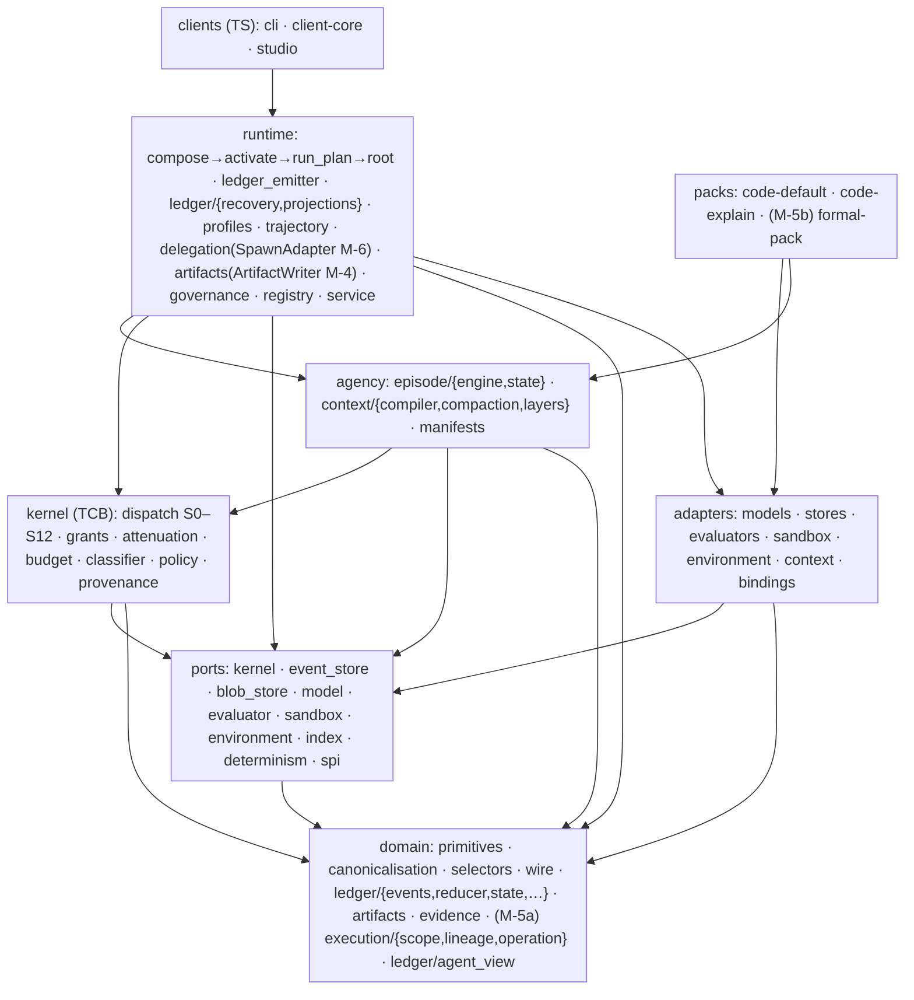
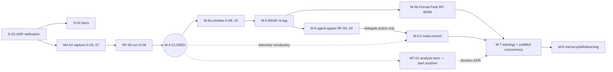

# DEVELOPMENT_PLAN — AETHER Phase 2 Engineering Bridge (v0.7 → v1.0 trajectory, planning horizon M-4 → M-8)

```text
authority: execution-planning (subordinate to VISION.md, SPEC.md, ADR-0095/0096-as-amended/0097)
baseline (as-built): brainopensource/cognitive-framework @ main, 2026-08-25
target (to-be):      Phase 1 leadership package (AETHER_PHASE1_ASSESSMENT.md + ADR-0097)
status: proposed for Director acceptance together with ADR-0097
```

This document is the single implementation bridge:
**Phase-1 decision → architectural contract → repository delta → target module/API → workstream → backlog task → sprint → tests/falsifier → milestone exit gate.**
It does not restate the Vision, law, or ADR rationale; it references them. Detailed contracts live in
`specs/`; the delta register lives in `ARCHITECTURE_DELTA.md`; work inventory in `BACKLOG.md`;
authorized execution in `SPRINT_ACTIVE.md` / `SPRINT_UPCOMING.md`.

---

## 1. The two baselines

### 1.A As-built (evidence, verified on `main`)

Packages (python LOC): `kernel` 1,737 (1,366 logical, budget 1,438 PASS) · `domain` 6,795 · `ports` 886 ·
`agency` 2,245 · `runtime` 10,660 · `adapters` 8,150 · packs `code-default`, `code-explain` ·
clients (TS) `cli`, `client-core`, `studio`.

Load-bearing as-built facts Phase 2 plans against:

| Area | Evidence |
|---|---|
| Production chain | `runtime/compose.py → activation.py → run_plan.py → root.Runtime.{execute_harness, execute_profiled, run_composed}` |
| Ledger | `runtime/ledger_emitter.LedgerEmitter` (mhf.event/1, per-project `prev_digest` chain, `append_intent` durable-or-raise, `emit` never raises) + `RoleScopedEmitter` with `PRIVILEGED_KIND_OWNERS` / `WRITER_ROLES` |
| Event vocabulary | `domain/wire/types_gen.EventKind` (42, generated from `schemas/mhf/event_envelope.schema.json`) ∪ `domain/ledger/events._V4_ONLY_KINDS` (16; 8 live-reduced, 8 normative-but-dead) |
| Reducer | `domain/ledger/reducer.{initial_state, reduce_event, reduce_batch, reconstruct_state, compute_state_digest}` — single canonical fold |
| Recovery | `runtime/ledger/recovery.{replay_ledger_state, RecoveryScanner.scan_and_recover_run, reconcile_open_intents}`; RF-25 fresh-process continuation green |
| Episode | `agency/episode/engine.EpisodeEngine.run` (unary sequential turn loop, I-11) and `EpisodeEngine.spawn` (in-process recursive child, S8-B-01) |
| Context | `agency/context/compiler.ContextCompiler.compile` + `compaction.{CompactionStrategy, COMPACTION_REGISTRY}` — produces `CompactionReport` in memory, **emits nothing durable** |
| Profiles | `runtime/profiles.ExecutionProfile` (containment/approval/persistence/evaluation/assurance/capture axes; **no `retention`, no reproducibility**), `resolve_profile` fail-closed (`SandboxUnavailable`), `to_dict()` = `profile_digest` preimage → `D_R` |
| Artifacts | `ports/blob_store.BlobStorePort` (put/get/has; store computes digest) + `adapters/stores/blob_store.{InMemoryBlobStore, FileBlobStore}` — **no production writer path**; `ArtifactCreated` kind never emitted |
| Trajectory | `runtime/trajectory.assemble_trajectory` (+ `DelayedTerminalEmitter`), `runtime/trajectory_reader.TrajectoryReader`, `schemas/mhf/trajectory.schema.json` |
| Kernel | `kernel/dispatch.Kernel.dispatch` S0–S12; imports `domain.canonicalisation.{digest,jcs}`, `domain.selectors.resource_selector`, `ports.kernel` only |
| Delegation seam | `runtime/delegation.{SpawnRequest, prepare_spawn, SpawnPreparationError}`; `ChildSpawned/ChildReturned` owned by writer role `spawn_adapter` (unimplemented role) |
| Governance | ADR-0095 accepted; **ADR-0096 `proposed` v0.3.0**; `EVIDENCE.md:53` still mandates singular reproducibility class; sprint M4-04 bullet 3 blocked on 0096 ratification |
| Gates | M-0…M-3C, W-3D COMPLETE; **M-4 ACTIVE, RF-95 NO-GO** (M4-04 1/4); M-5a+ PLANNED |

### 1.B Accepted target (Phase 1 package — binding for this plan)

ADR-0097 §1 (thesis, layers, roadmap confirmed unchanged) · §2 (ratify ADR-0096 with Amendment A —
reproducibility-vector value domains; Amendment B — trusted-import-closure TCB budget) · §3 (M-5a
single-shot substrate change set: envelope authority provenance / RF-99; vocabulary unification
folding 8 live kinds + deprecating 8 dead kinds; checkpointed fold) · §4 (concept lock) · §5 (no code
change authorized before ratification; RF-95 NO-GO upheld) · plus assessment findings F-1…F-9 and
open questions OQ-1…OQ-8. Where `main` conflicts with these, **`main` is outdated and migrates**.

---

## 2. Package/layer architecture (target = as-built structure, corrected semantics)



**Dependency law (unchanged, enforced by `test/governance` + linters):** arrows above are the only
legal directions. `domain`/`ports`/`kernel`/`agency` MUST NOT import `runtime`/`adapters`/`packs`.
`runtime` is the sole composition seam constructing concrete adapters. Kernel MUST NOT gain verbs,
domain semantics, or extension knowledge (RF-98). The trusted import closure = `kernel/*` +
`domain/canonicalisation/{digest,jcs}.py` + `domain/selectors/resource_selector.py` (ADR-0097 §2.2);
any change inside the closure triggers the RF-97 budget gate.

### Production execution path (as-built symbols; unchanged shape, extended instrumentation)

```text
client → runtime.compose (mhf.manifest/2 → CanonicalManifest → FrozenComposition ⇒ D_H)
       → runtime.activation (ActivationPlan; plugin registry lifecycle)
       → runtime.run_plan + profiles.resolve_profile (EffectiveExecutionProfile ⇒ D_R)
       → root.Runtime.run_composed
       → agency.episode.EpisodeEngine.run
            ↳ agency.context.ContextCompiler.compile  [M-4: + ProvenanceSink]
            ↳ model adapter via ports.model            [M-4: + cache provenance]
            ↳ Proposal → kernel.Kernel.dispatch (S0–S12) → EffectAdapter
       → runtime.ledger_emitter (mhf.event/1 chain) → adapters.stores.SqliteEventStore (WAL)
       → runtime.trajectory.assemble_trajectory ⇒ mhf.trajectory/1 [M-4: + provenance/repro]
       → domain.ledger.reducer fold ⇐ recovery / projections / (M-5a) AgentView
```

---

## 3. Architecture delta (summary — full register in `ARCHITECTURE_DELTA.md`)

| Δ | Title | Class | Milestone | Spec |
|---|---|---|---|---|
| D-01 | ADR-0096 ratification-as-amended + ADR-0097 acceptance | governance | pre-M-4 close | ADR plan §7 |
| D-02 | Documentation reconciliation (0096 §12 + §12.1 + glossary/AGENTS) | documentation-only | pre-M-4 close | §8 |
| D-03 | ArtifactWriter production path (`ArtifactCreated` + blob store) | new generic capability | M-4 | specs/SPEC_M4 §2 |
| D-04 | Context/compaction/cache provenance emission (`ClaimRecorded`/`mhf.provenance-claim/1` via ProvenanceSink) | contract change | M-4 | specs/SPEC_M4 §3–4 |
| D-05 | `ExecutionProfile.retention` axis → `D_R` | schema/contract change | M-4 | specs/SPEC_M4 §5 |
| D-06 | Reproducibility vector computed at run close (RF-100 capture) | new generic capability | M-4 | specs/SPEC_M4 §6 |
| D-07 | Trajectory schema additive provenance/repro sections | schema change (additive) | M-4 | specs/SPEC_M4 §7 |
| D-08 | RF-95 product proof execution | verification | M-4 exit | specs/SPEC_M4 §9 |
| D-09 | Envelope `mhf.event/2` authority provenance (RF-99) | foundational schema change | M-5a | specs/SPEC_M5A §3 |
| D-10 | Event vocabulary unification + 8-kind deprecation (F-2) | foundational correction | M-5a | specs/SPEC_M5A §4 |
| D-11 | `Operation`/`Lineage`/`ExecutionScope` contracts | contract (new) | M-5a | specs/SPEC_M5A §5 |
| D-12 | `AgentView` projection + semantic event kinds + RF-96 | foundational capability | M-5a | specs/SPEC_M5A §6 |
| D-13 | Checkpointed fold (`mhf.checkpoint/1`) | contract + runtime | M-5a | specs/SPEC_M5A §7 |
| D-14 | RF-97 multidimensional TCB budget tooling (F-3) | tooling/governance | M-5a | specs/SPEC_M5A §8 |
| D-15 | M-5-BASE re-tag + migration | migration | M-5a exit | specs/SPEC_M5A §9 |
| D-16 | Formal Pack #2 (RF-86 zero-semantic-diff, RF-52/53 witness) | domain capability | M-5b | specs/SPEC_M5B_M6 §1 |
| D-17 | `agent.spawn` mediated delegation (SpawnAdapter; RF-55–59) | generic capability | M-6 | specs/SPEC_M5B_M6 §2 |
| D-18 | Confidence/Uncertainty Measurement Protocol + ProgressProjection + meta-controller plugin | derived family | M-6.5 | specs/SPEC_M65_M7_M8 §1 |
| D-19 | M7-01 concurrency measurement → Director decision ADR; topology-as-data lowering; scheduler mechanism/policy split | derived family | M-7 | specs/SPEC_M65_M7_M8 §2 |
| D-20 | Memory taxonomy ports + skill lifecycle (composition-level promotion, 0096 §9–10; dead-kind reintroduction path) | derived family | M-8 | specs/SPEC_M65_M7_M8 §3 |

**Intentionally preserved (no delta):** kernel S0–S12 semantics; layer boundaries; production
chain; reducer/fold model; recovery model; profile fail-closed semantics; I-11 unary loop (until
M-7 lift); exterior signed evaluation; all architectural refusals.

---

## 4. Transition strategy: convergence → verification → capability

**Phase A — Foundation Convergence (SPRINT_ACTIVE):** ratify governance (D-01), reconcile docs
(D-02), implement the four M4-04 capture capabilities (D-03…D-07) *without any envelope or kind
change* (ADR-0096 §6.2bis constraint), land the append/fold micro-benchmark. Nothing here changes
substrate semantics; everything is additive payloads, one profile field, one new writer role.

**Phase B — Foundation Verification:** execute RF-95 (D-08) exactly once with a live provider;
independent review; Director closes M-4. This proves the corrected baseline before any substrate
change is permitted.

**Phase C — Substrate change window (SPRINT_UPCOMING = M-5a):** the single ADR-authorized window
(ADR-0097 §3) executes D-09…D-15 together; `M-5-BASE` re-tags once, after gates are green.

**Phase D — Capability development from the re-tagged baseline:** M-5b (D-16) may not begin until
M-5-BASE exists (RF-86 is measured against it). M-6…M-8 proceed per the dependency graph below.

**Safely parallel at all times (blocked only on their own named interface):** model/tool adapters
(`ports/`), CLI/studio (client request contract), indexing (`IndexPort`), context strategies
(agency-local), coding-pack tool loop (SPI), docs/linters, **M7-01 analysis lane** (reads settled
ledgers only; may start during Phase A), and M-5a *design* tasks (contracts on paper, RED tests).

---

## 5. Milestone dependency graph



Serial spine: D-01 → M4-04 → RF-95 → M-5a → {M-5b, M-6} → M-6.5 → M-7 → M-8.
M-5b and M-6 are mutually parallel post-M-5a (disjoint modules: pack vs. runtime/delegation).

---

## 6. Implementation-readiness matrix (through M-8)

Legend: C=Concept, A=Architecture, K=Contract, I=Impl designed, G=Migration designed, T=Task-ready.

| Capability | C | A | K | I | G | T | Gap to task-ready |
|---|---|---|---|---|---|---|---|
| ADR ratification + doc reconciliation | ✅ | ✅ | ✅ | ✅ | ✅ | **✅** | — (SPRINT_ACTIVE) |
| ArtifactWriter + ArtifactCreated path | ✅ | ✅ | ✅ | ✅ | ✅ | **✅** | — |
| Provenance claims (context/compaction/cache) | ✅ | ✅ | ✅ | ✅ | ✅ | **✅** | — |
| Profile retention axis + D_R | ✅ | ✅ | ✅ | ✅ | ✅ | **✅** | — |
| Reproducibility vector (capture) | ✅ | ✅ | ✅ | ✅ | ✅ | **✅** | — |
| RF-95 execution | ✅ | ✅ | ✅ | ✅ | n/a | gated | M4-04 completion |
| Envelope v2 authority provenance | ✅ | ✅ | ✅ | ✅ | ✅ | pending | ADR-0098 acceptance (drafted in SPRINT_UPCOMING) |
| Vocabulary unification/deprecation | ✅ | ✅ | ✅ | ✅ | ✅ | pending | ADR-0098 |
| Operation/Lineage/ExecutionScope contracts | ✅ | ✅ | draft | sketch | n/a | pending | M5A-01 contract review |
| AgentView + semantic kinds + RF-96 | ✅ | ✅ | draft | sketch | ✅ | pending | ADR-0098 kind roster sign-off |
| Checkpointed fold | ✅ | ✅ | draft | sketch | ✅ | pending | ADR-0098 |
| RF-97 TCB tooling | ✅ | ✅ | ✅ | ✅ | n/a | **✅** | may run parallel in Phase A (tooling-only) |
| Formal Pack #2 | ✅ | ✅ | K-level | open | n/a | no | M-5-BASE; oracle selection (OD-3) |
| SpawnAdapter mediated delegation | ✅ | ✅ (ADR-0080/0090/0091) | strong | partial | draft | no | M-5a lineage contracts |
| Confidence protocol + meta-controller | ✅ | ✅ | sketch | open | n/a | no | OD-4 protocol draft; M-4 telemetry |
| Topology lowering + scheduler split | ✅ | ✅ | sketch | open | n/a | no | M7-01 decision ADR |
| Memory ports + skill lifecycle | ✅ | ✅ | sketch (provisional) | open | n/a | no | M-7; promotion pipeline ADR |

A task enters `SPRINT_ACTIVE` only at T=✅; `SPRINT_UPCOMING` items are promoted when their listed
gap closes (all M-5a gaps close with one ADR-0098 acceptance — a scheduling decision, not design).

---

## 7. ADR plan

| Action | ADR | Content | Depends on | Unblocks |
|---|---|---|---|---|
| Ratify | **0096 → v0.4.0 accepted** | As proposed + Amendment A (repro value domains, ADR-0097 §2.1) + Amendment B (trusted-import-closure budget, §2.2); execute §12/§12.1 atomically | Director | M4-04 bullet 3 (D-05/06), D-02 |
| Accept | **0097** | Phase 1 record: adjudication, concept lock, M-5a change set | Director | Whole plan authority |
| Create | **0098 — M-5a substrate change set** (draft delivered in SPRINT_UPCOMING) | `mhf.event/2` fields; kind roster additions (`GoalDeclared`,`PlanRevised`,`StrategyChanged`,`ProgressAssessed`,`ContextCompacted`) with writer/reducer/schema/vector per kind; fold 8 live V4 kinds into schema; deprecate 8 dead kinds; `mhf.checkpoint/1`; dual-read/single-write migration; M-5-BASE re-tag criteria | 0096/0097 ratified; M-4 closed | All M-5a implementation |
| Create | **0099 — M7-01 decision** (reserved) | implement / simplify / cancel advanced scheduling; default cancel <~30% independence | M7-01 data | M-7 scope |
| Create | **0100 — M-8 skill promotion pipeline** (reserved) | Composition-level promotion realization per 0096 §9–10; possible un-deprecation of `CandidateBuilt/CandidateAttested/CanaryPromoted/RollbackTriggered` via full kind package | M-7 | M-8 |
| Immutable | 0069–0095 | Historical provenance; superseded only where 0096/0097 state | — | — |

---

## 8. Documentation reconciliation plan (executes with D-01; exact-edit level)

| Document (authority) | Current contradiction | Required edit | Consistency check |
|---|---|---|---|
| `VISION.md` (constitutional) | Lacks 0096 §12 amendments; `agent-first` posture; flat primitives; "future mandatory layers"; unscoped determinism language | Apply the fifteen §12 row edits verbatim scope (caps 1,2,3,4,5,6,9,14,16,17,18,19,20 + ladder rules 2–3); bump `version: 0.7.1`, `locked_by: ADR-0095+0096`; keep length/pt-BR prose | Vision-superseding ADR link present; ladder table regenerated |
| `docs/SPEC.md` (law index) | Ladder rules 2–3 lack falsification path | Amend rules 2–3 per 0096 §1; add RF-96…RF-100 to invariant/falsifier navigation | Anchor links stable |
| `docs/01_law/EVIDENCE.md` | Line 53: singular "reproducibility class" | Replace with §8.1 six-dimension vector + value domains (Amendment A); add `reproducibility_at_run_close` never-overwrite rule; add causal-record ≠ telemetry clause (§5) | RF-100 named |
| `docs/01_law/MEASUREMENT.md` | Net-improvement promotion | Bind §9.3 decomposition + §10 generator/evaluator/promoter separation | Links to 0096 |
| `docs/01_law/EXTENSIBILITY.md` | No neutrality gate | Record Kernel Neutrality Gate (§7.2) as milestone gate for foundational-contract changes | RF-98 named |
| `docs/02_decisions/INDEX.md` | RF-96…RF-100 unallocated | Append allocation rows per 0096 §13 | RF register unique |
| `docs/03_execution/milestones.md` | Gates missing RF-96…RF-100 attachment | Attach: RF-100→M-4(M4-04); RF-96/97/99→M-5a; RF-98→M-5b (re-run M-7/M-8) | Ladder unchanged otherwise |
| `docs/03_execution/sprint_active.md` | Pre-Phase-2 board | Replace with this package's `SPRINT_ACTIVE.md` (governance format preserved) | Sole authorization board rule kept |
| `docs/04_architecture/glossary.md` | v0.6.1 AS_BUILT; TCB = LOC-only; no closure note | Refresh to v0.7 lock terms (reference ADR-0097 §4 as canonical; do not duplicate table); note trusted-import-closure | One canonical definition rule |
| `docs/05_contracts/events.md` | No deprecated-kind register; no provenance payloads | Add `mhf.provenance-claim/1`, `mhf.artifact-created/1`, `mhf.checkpoint/1` (M-5a) payload contracts; add Deprecated Kinds register (8 kinds, reintroduction package requirement) | Schema files exist |
| `docs/05_contracts/trajectories.md` | No provenance/repro sections | Document additive trajectory fields (SPEC_M4 §7) | trajectory.schema.json diff |
| `AGENTS.md` / `README.md` | Point at stale sprint/concepts | Update orientation pointers only; no independent architecture | Ladder rule 6 |

No other document changes. `_archive/` untouched. One concept, one canonical home (0096 §12.1 rule).

---

## 9. Compatibility & migration strategy (global rules)

1. **Pre-M-5a: zero envelope/kind changes.** All M-4 capture uses existing kinds (`ArtifactCreated`
   — live reducer; `ClaimRecorded`) with new *payload* schemas. Payloads are forward-compatible by
   CT-44 (unknown payloads preserved). `profile_digest` changes because `retention` enters
   `to_dict()` — that is *intended identity change*, not incompatibility: new runs get new `D_R`;
   historical trajectories remain valid under their recorded `D_R`.
2. **M-5a: dual-read, single-write.** `parse_event_envelope` dispatches on `schema_version`
   (`mhf.event/1` read-only legacy, `mhf.event/2` read+write). The per-project `prev_digest` chain
   continues across the version boundary (digest computed over each event's own canonical form).
   Reducer accepts both; new kinds appear only in `/2` streams. Historical ledgers are never
   rewritten. `M-5-BASE` = tag + pinned reducer/schema versions recorded in `determinism.py` pins.
3. **Deprecated kinds:** write-path rejection (`LedgerEmitter` raises `DeprecatedKindError`),
   read-path acceptance for history. Reintroduction only via full kind package (ADR-0097 §3.2).
4. **Rollback:** every convergence change is additive or flag-guarded; D-03/04/06 sit behind
   `ExecutionProfile.capture_content`/retention resolution so `digests-only` runs degrade gracefully.

---

## 10. Verification strategy (global)

- **Unit/contract:** every new payload schema gets golden JCS vectors under `test/contracts/`
  (pattern: `test_event_coverage.py`); every new writer role exercised via `RoleScopedEmitter`
  authority tests; reducer round-trip per kind.
- **Falsifiers:** RF-95 (M-4), RF-100 capture (M-4), RF-96/97/99 (M-5a), RF-86 + RF-52/53 + RF-98
  (M-5b), RF-55–59 (M-6), paired-run improvement (M-6.5), 3-topology zero-diff + M7-01 ADR (M-7),
  held-out lift + rollback (M-8). Falsifier tests live in `test/falsifiers/` named `test_rf{NN}_*`.
- **Replay parity:** fresh-process reconstruction (not in-memory double fold) after every
  substrate-adjacent change — reuse `test/runtime/test_resume_from_ledger.py` pattern.
- **Perf baseline:** `lab/bench.py` gains `bench_append_fold` (events/s append; fold μs/event;
  checkpointed vs. cold fold) — run in Phase A to freeze the pre-M-5a baseline.
- **Zero-hidden-architecture audit:** each sprint task carries authority refs, current-code refs,
  target contract, tests, DoD; reviewer confirms a non-Phase-1 senior dev can execute (§19 of the
  mission — sampled per sprint).

---

## 11. Where things belong (developer boundary card)

| If you are building… | It belongs in… | It must use… | It must never… |
|---|---|---|---|
| A new tool/model/store binding | `adapters/` behind a `ports/` protocol | typed `Result`, capability declaration | import runtime internals; bypass kernel dispatch for effects |
| Context/compaction strategy | `agency/context/` registry entry | `CompactionStrategy` protocol; ProvenanceSink | import adapters; emit events directly |
| Domain behavior (coding/formal/research) | `packs/<pack>/` | SPI, manifests, policies | touch kernel/domain/ledger semantics (RF-98) |
| A new durable fact | payload on an existing kind (pre-M-5a) or ADR-0098 kind package (M-5a) | writer-role authority, schema, reducer, vector | invent a kind ad hoc; write via unauthorized role |
| Agent/meta behavior | policy/plugin/projection | ordinary proposals through S0–S12 | special authority; second engine |
| Large content | `ArtifactWriter` → blob store + `ArtifactCreated` | digest refs in events | inline blobs in the ledger |
