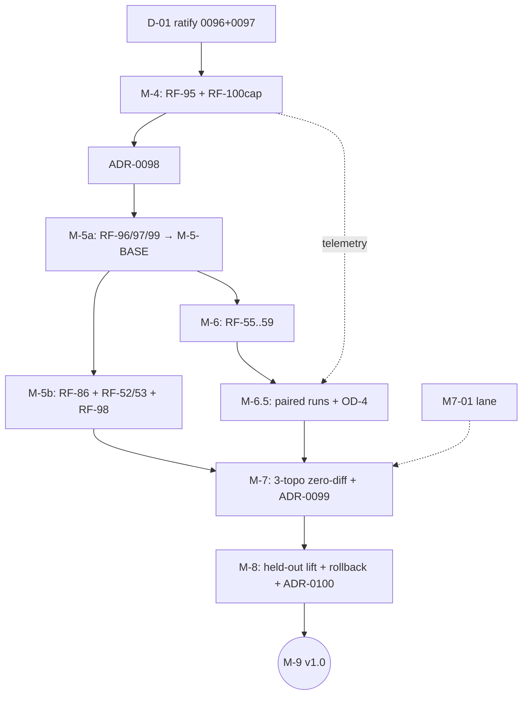

# MILESTONE_SPECS — M-4 → M-8 (engineering specifications)

Each milestone: purpose · baseline · target state · prerequisites · contracts introduced · modules
affected · workstreams (∥ parallel / → serial) · migrations · tests · falsifiers · acceptance ·
exit gate · artifacts · unlocks. Contract detail lives in `specs/`; this file owns sequencing.

---

## M-4 — Product Coding Proof + Scientific Trajectory Capture (v0.7.0, ACTIVE)

**Purpose.** One useful, durable, real-model coding run **and** the observability every later
milestone is measured with. **Baseline.** RF-95 runner dry-run qualified; M4-04 1/4; ADR-0096
proposed. **Target state.** Every run carries artifact index, context/compaction/cache provenance,
retention-bearing `D_R`, and a computed run-close reproducibility vector; RF-95 evidence accepted.
**Prerequisites.** D-01 ratification (defines repro semantics), D-02 docs.
**Contracts introduced.** `ArtifactWriter`; `ProvenanceSink`; `mhf.artifact-created/1`;
`mhf.provenance-claim/1`; `ExecutionProfile.retention`; `ReproducibilityVector`; trajectory
additive sections. (SPEC_M4 §2–§7.)
**Modules.** runtime/{artifacts,provenance,reproducibility,profiles,wiring,root,trajectory,
ledger_emitter}; agency/context/{provenance,compiler}; adapters/models/invocation; schemas/mhf;
lab/bench.
**Workstreams.** ∥ WS-A governance (D-01/D-02) · ∥ WS-B artifact path (D-03) · WS-C provenance
(D-04, → after D-03 lands writer) · ∥ WS-D profile+repro (D-05/D-06, → D-06 after D-01) ·
WS-E trajectory (D-07, → after C/D) · ∥ WS-F bench + M7-01 lane start · → WS-G RF-95 (D-08, last).
**Migrations.** None (additive; `profile_digest` change is intended identity).
**Tests/falsifiers.** SPEC_M4 §10 table; RF-100 (capture); RF-95.
**Acceptance/exit.** Sprint M4-04 bullets 1–4 flipped with evidence; RF-95 bundle passes
independent review; Director closes. **Artifacts.** RF-95 evidence bundle; bench baseline;
ratified constitution. **Unlocks.** M-5a window; M7-01 continues; M-6.5 measurement substrate.

## M-5a — Event-Derived Agent (v0.7.x)

**Purpose.** The agent becomes a projection; the substrate gains authority provenance; vocabulary
truth restored; O(suffix) reconstruction. **Baseline.** M-4 closed; ADR-0098 accepted.
**Target.** `mhf.event/2` written; 5 semantic kinds live; `_V4_ONLY_KINDS` deleted; 8 kinds
deprecated; AgentView + CheckpointManager in production path; RF-97 v2 gating CI; `M-5-BASE` tag.
**Contracts.** ExecutionScope/LineageRef/OperationRecord; AgentView(+Reducer);
`mhf.{goal,plan,strategy,progress,context-compacted,checkpoint}/1`. (SPEC_M5A.)
**Modules.** domain/{execution,ledger/{events,reducer,agent_view}}, wire codegen; runtime/
{ledger_emitter, ledger/checkpoints, reproducibility(current)}; tools/linters; schemas/mhf; docs.
**Workstreams.** → WS-A ADR-0098 sign-off · ∥ WS-B envelope v2 + codegen · ∥ WS-C vocabulary
unification · ∥ WS-D contracts (pure domain) · → WS-E kinds+reducer (after B/C) · → WS-F AgentView
(after D/E) · → WS-G checkpoints (after F) · ∥ WS-H RF-97 tooling (independent) · → WS-I gates +
re-tag. **Migrations.** Dual-read/single-write cutover (DEVELOPMENT_PLAN §9.2); deprecation
write-rejection. **Falsifiers.** RF-96, RF-97, RF-99, RF-100(computation); mixed-chain replay.
**Exit.** SPEC_M5A §9 all green → tag. **Artifacts.** ADR-0098-implemented; pin set; kind table +
deprecated register; bench comparison. **Unlocks.** M-5b, M-6 (parallel).

## M-5b — Generality Falsifier (v0.7.x)

**Purpose.** Try to break the abstraction with a non-coding domain. **Baseline.** M-5-BASE.
**Target.** `packs/formal-<oracle>/` complete run; RF-86 diff empty; RF-52/53 witness verdicts;
RF-98 report. **Prereqs.** OD-3 oracle decision. **Contracts.** none new (that is the point);
pack manifests + evaluator suite entries only. **Modules.** packs/formal-*, adapters/evaluators/
suites, benchmarks/, tests. **Workstreams.** ∥ pack scaffold ∥ solver toolkit ∥ witness evaluator →
integration run → falsifier suite. **Falsifiers.** RF-86, RF-52/53, RF-98. **Exit.** SPEC_M5B_M6
§1 acceptance. **Unlocks.** M-7 (with M-6.5); generality claim upgraded from thesis to evidence
(or counter-evidence → Vision review per 0096 §1).

## M-6 — Recursive Delegation (v0.8.0)

**Purpose.** `agent.spawn` as generic mediated effect creating nested lineages. **Baseline.**
M-5-BASE; ADR-0080/0090/0091 frozen design; seams present. **Target.** SpawnAdapter in production
chain; delegation contract returns; kill-tree recovery after real restart. **Contracts.**
`mhf.child-{spawned,returned}/1` payloads; delegation return contract
(result+evidence+confidence+artifacts+unresolved). **Modules.** runtime/delegation (SpawnAdapter),
wiring (sink-class binding), agency/episode (spawn demoted to adapter-invoked executor),
domain/ledger/reducer (children in AgentView — already M-5a), tests. **Workstreams.** → adapter
core → budget algebra tests ∥ recovery reconciliation → falsifier matrix → demo run.
**Migrations.** direct `engine.spawn` path restricted to lab/benchmark profiles (governance test).
**Falsifiers.** RF-55…RF-59 (matrix in SPEC_M5B_M6 §2). **Exit.** matrix green + nested-lineage
demo bundle with fresh-process reconstruction. **Unlocks.** M-6.5 delegate directive; M-7 roles.

## M-6.5 — Adaptive Strategy / Meta-Control (v0.8.x)

**Purpose.** Higher-order control as plugin, with measured benefit or disabled-by-default.
**Baseline.** M-4 telemetry + M-5a ProgressAssessed/AgentView (+M-6 for delegate). **Target.**
Confidence protocol doc+schema; ProgressProjection; MetaController plugin; paired-run harness +
report. **Contracts.** `mhf.confidence/1`; MetaController protocol; StrategyDirective mapping.
**Workstreams.** → OD-4 protocol · ∥ projection · ∥ plugin+engine hook · → harness → paired study.
**Falsifiers.** blocked-task observable strategy change; paired improvement w/o regression-budget
breach; RF-98 re-check. **Exit.** SPEC_M65_M7_M8 §1 gate. **Unlocks.** M-7 comparisons.

## M-7 — Topologies & Justified Concurrency (v0.9.0)

**Purpose.** Structure as versioned data; temporality as replaceable policy; concurrency only if
M7-01 justifies. **Baseline.** M-6/M-6.5; M7-01 report. **Target.** `mhf.topology/1` + lowering;
SchedulerPolicy split; ≥3 topologies zero-diff; ADR-0099 recorded; safe-parallel reads at most
unless authorized. **Falsifiers.** 3-topology zero kernel/episode diff; M7-01→ADR-0099; RF-98.
**Exit/Artifacts.** SPEC_M65_M7_M8 §2 gate; independence report; topology artifacts. **Unlocks.** M-8.

## M-8 — Memory, Skills, Learning (v0.9.x)

**Purpose.** Retrieval/memory as capability-mediated projections; versioned skills with
composition-level, regression-aware promotion and tested rollback. **Baseline.** M-7; trajectory
corpus since M-4. **Target.** category ports; skill lifecycle pipeline; ADR-0100 (incl. dead-kind
reintroduction decision); held-out lift demonstrated; rollback exercised. **Falsifiers.** held-out
lift with decomposed evidence; presence-only adversarial suite; rollback restoration test; RF-98 +
Kernel Neutrality evidence. **Exit.** SPEC_M65_M7_M8 §3 gate. **Unlocks.** M-9 v1.0 integration.

---

## Dependency/falsifier overview

