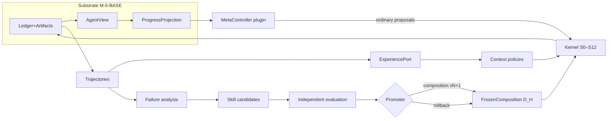

# SPEC_M65_M7_M8 — Meta-Control, Topology/Scheduler, Memory/Skills

Horizon rule (mission §Granularity): responsibilities, interfaces, extension contracts, data flows,
evaluation protocols, dependencies, invariants, falsifiers, integration points. Interface sketches
below marked **[provisional]** are implementation shapes, not constitutional APIs; changing them
needs a spec revision, not an ADR, unless they alter substrate contracts.

---

# §1 M-6.5 — Adaptive Strategy / Meta-Control (D-18)

**Constitutional bounds:** metacognition is policy/reducer/plugin, never kernel (SPEC refusal;
0096 §11.7); the controller holds no special authority and proposes through ordinary S0–S12;
reflection ≠ evidence; benefit is proven by paired runs or it is not claimed.

**Prerequisite gate (OQ-4): Confidence/Uncertainty Measurement Protocol** — deliverable
`docs/06_protocols/confidence.md` + `schemas/mhf/confidence.schema.json` (`mhf.confidence/1`):
`{signal ∈ {self_report, logprob, behavioral, external_verifier, ensemble_disagreement},
value: float[0,1] | domain-typed, calibration: {method, error?}, subjectRef, basis[]}`.
Comparability rule: every controller decision event references ≥1 confidence record; no single
signal constitutionalized. Owner: agency/runtime shared protocol doc; recorded via
`ClaimRecorded{claimKind:confidence}` (or ADR-0098-style kind if M-6.5 review demands — default no).

**Components.**

1. **ProgressProjection** — `domain/ledger/progress.py` [provisional]:
   fold over `ProgressAssessed`, `StrategyChanged`, `EffectFailed`, repeated-turn signatures
   (`Episode.repeats` signal re-derived from events), budget-consumption slope →
   `ProgressView{assessment, stall_count, repeat_signatures, budget_burn_rate, last_change}`.
   Pure reducer; deterministic; no authority.

2. **MetaControllerPlugin** — plugin SPI extension [provisional]:
   ```python
   class MetaController(Protocol):
       def assess(self, view: AgentView, progress: ProgressView,
                  confidence: Sequence[ConfidenceRecord]) -> StrategyDirective | None:
           """Pure decision. Returns None (no intervention) or a directive:
              revise_plan | request_context | abandon_hypothesis | change_verification |
              delegate(brief, scope_slice) | conclude(reason).
              Must not: touch stores, emit events, call models directly."""
   ```
   Runtime binding: engine consults the controller between turns; a non-None directive becomes an
   ordinary Proposal (kind mapped: delegate→agent.spawn effect; revise_plan→PlanRevised emission
   via orchestrator; conclude→terminal path). `StrategyChanged{controllerId}` records attribution.

3. **Paired-run harness** — `lab/paired.py` [provisional]: fixed task set, same `D_H` except
   controller plugin presence (two FrozenCompositions, two `D_H`), N seeds; metrics: success rate,
   wasted loops (repeat signatures), tool calls, cost, latency, recovery-from-failure rate;
   paired stats per MEASUREMENT.md; report artifact.

**Exit gate:** deliberately blocked fixture tasks show observable strategy change (event-level
evidence), and paired runs show measured improvement on ≥1 primary metric without regression
budget breach; otherwise the controller ships disabled-by-default and the negative result is
recorded (0096 §1 evidence path). RF-98 re-check: kernel diff == 0.

**Dependencies:** M-4 telemetry (measurement substrate); M-6 only for the delegate directive;
M-5a AgentView/ProgressAssessed kinds.

---

# §2 M-7 — Topologies & Justified Concurrency (D-19)

**Constitutional bounds:** topology is versioned data lowered to ordinary scheduling + mediated
spawn (SPEC refusal); scheduler mechanism ∈ runtime, policy substitutable, never a second kernel
(0096 §11.3); I-11 unary loop lifts only via Director ADR-0099 on M7-01 evidence (default: cancel
advanced scheduling below ~30% useful independence).

**M7-01 (analysis-only lane — may run any time from Phase A):** `lab/m701_independence.py`
[provisional]: over fixed-seed recorded workloads, extract `EffectStarted`/settlement pairs with
resolved resources, selectors, sinks, idempotency keys, timing, WAL contention, cache hits;
compute pairwise independence (disjoint sinks/resources, no causal edge) and the fraction of
wall-time serialized by dependency vs. by I-11. Output: independence report artifact → ADR-0099.

**Topology as data:** `schemas/mhf/topology.schema.json` (`mhf.topology/1`) [provisional]:
`{topologyId, version, roles:[{roleId, policyRef, scopeTemplate{budget-slice, maxDepth, maxTurns},
contextConfigRef}], edges:[{from,to, relation ∈ {may_delegate_to, reviews, merges_into}}],
artifactsFlow:[{edge, schemaId}], entry: roleId}` — versioned artifact in the blob store,
referenced by composition (enters `D_H`).

**Lowering compiler:** `runtime/topology.py::lower(topology, composition) → RunPlanExtension`
[provisional]: roles → lineage templates (ExecutionScope prototypes + policy bindings); edges →
allowed `agent.spawn` targets (enforced as capability attenuation sets, not new kernel checks);
no dynamic-DAG runtime authority (refusal preserved: trajectory remains emergent).

**Scheduler split:**
```python
class SchedulerPolicy(Protocol):   # substitutable policy
    def select(self, ready: Sequence[ReadyOperation]) -> Sequence[ScheduleDecision]: ...
# mechanism (runtime): readiness derivation from settled causal deps + claims with TTL/heartbeat
# (coordination metadata, never budget millis — SPEC refusal); at-least-once physical attempts;
# exactly-once durable settlement per command identity (existing recovery law).
```
Simple safe parallelism (independent read-only effects) is the only concurrency admitted without
ADR-0099; guarded by sink-class independence proof per pair.

**Exit gate:** ≥3 topologies (direct, planner/executor, critic/reviser) run through one runtime
with **zero kernel/episode-engine semantic diff**; M7-01 terminated in ADR-0099; concurrency
beyond safe-parallel only if the ADR authorizes. RF-98 re-run.

**Dependencies:** M-6 spawn (roles are lineages), M-6.5 (strategy attribution in comparisons).

---

# §3 M-8 — Memory, Retrieval, Skills, Learning (D-20)

**Constitutional bounds:** projections/plugins/policies over the same primitives — never kernel
semantics; memory access under capability + provenance + auditability + revocation (0096 §6.4);
promotion is composition-level and regression-aware with generator/evaluator/promoter separation
(0096 §9–10); locked five-category vocabulary (ADR-0097 §4) — one contract per category, never a
single storage blob.

**Category ports [all provisional sketches]:**
```python
class KnowledgePort(Protocol):        # persistent validated facts/artifacts
    def put(self, item: KnowledgeItem) -> str; ...
    def query(self, q: Query, *, grant: str) -> Sequence[KnowledgeItem]: ...
class ExperiencePort(Protocol):       # trajectory retrieval by similarity to current problem
    def similar(self, probe: TrajectoryProbe, k: int) -> Sequence[TrajectoryRef]: ...
class SkillLibrary(Protocol):         # versioned procedures/policies/fragments
    def candidates(self) -> Sequence[SkillRef]; ...
    def active_composition(self) -> CompositionVersion; ...
class ProjectMemoryPort(Protocol):    # user/org/repo long-lived context
    ...
# SessionState needs no new port: WAL + AgentView already are it (locked mapping).
```
Every retrieval that materially enters context flows through the M-4 ProvenanceSink path
(retrieval provenance = context_selection claims with policy identity) — no new telemetry design.

**Skill lifecycle (pipeline, exterior to the executing agent):**
```text
trajectories → failure clustering / pattern analysis → candidate skill (generator)
→ candidate evaluation (isolated; evaluator ≠ generator)             [0096 §10]
→ admission proposal ⇒ NEW composition version (library vN+1)        [0096 §9.2]
→ regression evaluation: held-out + affected-context + presence-only adversarial + grounding +
  verification suites; risk-based budget                             [0096 §9.3–9.4]
→ promotion by promoter authority with signed evidence  |  rollback
```
Event support: reintroduce `CandidateBuilt, CandidateAttested, CanaryPromoted, RollbackTriggered`
from the deprecated register **iff** ADR-0100 supplies the full kind package (writer role
`promotion_pipeline`, reducers, schemas, vectors) — the deprecation path was designed for exactly
this consumer. Otherwise represent lifecycle via `ClaimRecorded` payloads; decide in ADR-0100.

**Evaluation protocol:** promotion evidence decomposes gross gains / regressions / residual
failures / presence-only / invocation / grounding / verification / transfer / held-out; report is
a signed artifact; `reproducibility_current` recomputation runs on any promoted-composition replay.

**Exit gate:** measured lift on a held-out set for ≥1 promoted composition version, with recorded
provenance and a **tested rollback** (promote → detect injected regression → rollback → verify
pre-promotion behavior restored). RF-98 re-run; Kernel Neutrality evidence attached.

**Dependencies:** M-7 (topology/scheduling stable enough for comparable runs), M-4 trajectory
corpus, M-5a AgentView (experience indexing), ADR-0100.

---

## Cross-cutting integration diagram (M-6.5 → M-8 loop over the substrate)


