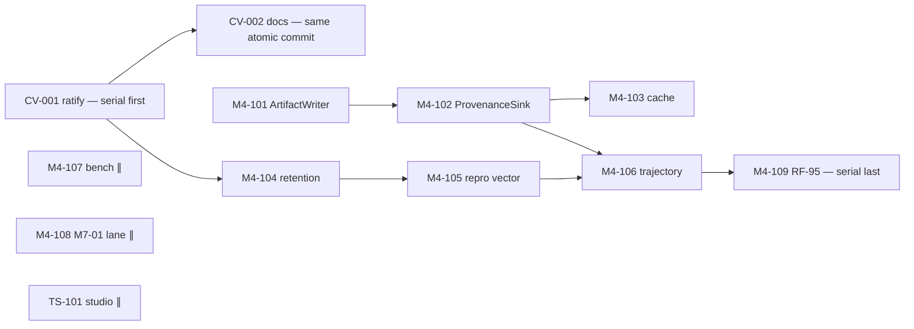

# SPRINT_ACTIVE — Foundation Convergence & M-4 Completion

```text
sprint: S-P2-01 "Converge and Prove"
authorizes: CV-001, CV-002, M4-101…M4-109, TS-101 (opportunistic)
rule: this board is the sole authorization for repository changes this sprint (governance law).
exit: M-4 CLOSED (RF-95 evidence accepted) + ADR-0098 draft delivered for review (from SPRINT_UPCOMING prep)
```

## Execution order



Serial spine: CV-001+CV-002 → (M4-104) → M4-105 → M4-106 → M4-109.
Parallel from day 1: M4-101 (→102→103 chain), M4-107, M4-108, TS-101, M5A-110 pre-work
(RF-97 tooling is authorized as tooling-only; gate flip stays in M-5a).

## Task cards

Each card: **What/Why(Phase-1 ref)/Where(current)/Target contract/Reuse/Keep unchanged/Tests/DoD.**
Full field detail: `BACKLOG.md §A`; contracts: `specs/SPEC_M4_TRAJECTORY_CAPTURE.md`.

### CV-001 — Ratify ADR-0096 (as amended) + ADR-0097 `owner: Director+GOV` `serial-first`
Why: ADR-0097 §2; unblocks retention/repro law. Where: `docs/02_decisions/0096… status: proposed`.
Target: statuses accepted; Amendments A/B in 0096 text; INDEX RF-96..100 rows.
Keep: 0069–0095 immutable. Tests: governance lints. DoD: BACKLOG CV-001.

### CV-002 — §12/§12.1 documentation reconciliation `owner: GOV` `same commit as CV-001`
Edit table: DEVELOPMENT_PLAN §8 (12 docs, row-exact). Tests: link lint, secret scan,
`pytest test/governance`. DoD: VISION `0.7.1`; EVIDENCE.md:53 replaced by vector; glossary refs
ADR-0097 §4; sprint/milestone boards updated.

### M4-101 — ArtifactWriter `owner: RT-dev-A` `parallel` — **developer package embedded below (P-1)**

### M4-102 — ProvenanceSink + LedgerProvenanceSink + schemas `owner: AG/RT-dev-B` `after M4-101` — **package P-2**

### M4-103 — Cache provenance `owner: RT-dev-B` `after M4-102`
Where: `adapters/models/{invocation,cassette}.py`. Target: SPEC_M4 §4 recorder at the runtime-side
invocation seam (wrapper in model routing path; do NOT make adapters import runtime). Tests:
cassette-hit claim; live-path silence. DoD: fixture claims validate.

### M4-104 — Profile retention axis `owner: RT-dev-C` `after CV-001`
Where: `runtime/profiles.py` (`ExecutionProfile`, `to_dict`, `PRESETS`, `_narrow`),
`schemas/mhf/execution_profile.schema.json`. Target: SPEC_M4 §5 verbatim. Keep unchanged:
fail-closed `resolve_profile` semantics; existing preset axes. Tests: SPEC_M4 §10 row 6 + RF-87
extension. DoD: golden `to_dict` vector; `D_R` includes retention.

### M4-105 — Reproducibility vector at run close `owner: RT-dev-C` `after M4-101/102/104`
Where: new `runtime/reproducibility.py`; hook in `root.run_composed` terminal path before
trajectory flush (`DelayedTerminalEmitter` region). Target: SPEC_M4 §6 derivation table exactly;
`ClaimRecorded{reproducibility_at_run_close}`. Must-not: let episode/policy author the vector.
Tests: `test_rf100_*`. DoD: falsifier green; vector visible in fixture trajectory.

### M4-106 — Trajectory sections `owner: RT-dev-A` `after 102+105`
Where: `runtime/trajectory.py::assemble_trajectory`, `schemas/mhf/trajectory.schema.json`,
`trajectory_reader.py`. Target: SPEC_M4 §7 additive members + reader extraction. Keep: existing
members byte-identical for legacy inputs. Tests: §10 row 8. DoD: `diff_trajectories` ablation on
provenance works.

### M4-107 — Bench baseline `owner: LB` `parallel` — `lab/bench.py::bench_append_fold`; artifact in
`benchmarks/`. DoD: JSON baseline committed.

### M4-108 — M7-01 lane `owner: LB` `parallel, analysis-only` — `lab/m701_independence.py`; law:
no concurrency mechanisms. DoD: first independence report artifact.

### M4-109 — RF-95 execution `owner: Tech Lead + reviewer` `serial-last` — **package P-3**

### TS-101 — Studio provenance rendering `owner: TS` `parallel, non-blocking`
Read-only render of new optional trajectory members. DoD: fixture renders.

---

## Embedded developer task packages (high-risk items)

### P-1 · M4-101 ArtifactWriter
1. **Authority:** SPEC_M4 §2; ADR-0096 §6 payload rule; EVIDENCE provenance rule.
2. **Phase-1 decision:** F-4 close — production artifact path with `ArtifactCreated` facts.
3. **Current code:** `ports/blob_store.py` (put/get/has; digest by store);
   `adapters/stores/blob_store.py::{InMemoryBlobStore,FileBlobStore}`;
   `runtime/ledger_emitter.py::{WRITER_ROLES, PRIVILEGED_KIND_OWNERS, RoleScopedEmitter}`;
   `runtime/wiring.py` (composition seam); `domain/ledger/events.py` (`ArtifactCreated` live kind).
4. **Target behavior:** SPEC_M4 §2 class contract + §2.1 payload; blob-first/event-second;
   retention modes; dedup by digest; `artifact_writer` role sole owner of `ArtifactCreated`.
5. **Boundaries:** runtime-only; no agency/kernel/domain edits except emitter role tables; no
   envelope/kind schema edits; no adapter changes.
6. **Interfaces:** `BlobStorePort`, `RoleScopedEmitter.append_intent/emit`, `digest_of` (JCS) for
   `write_json`.
7. **Dependencies:** co-land `schemas/mhf/artifact_created.schema.json` (coordinate with P-2 owner;
   schema file may land in this task).
8. **Invariants:** never accept caller digest; never inline content in payload; `stored:false`
   under digests-only; durability failure ⇒ `ArtifactWriteError` (never silent).
9. **Tests/falsifiers:** SPEC_M4 §10 rows 1–2 (ordering, dedup, digests-only, authority).
10. **DoD:** tests green; dry-run RF-95 trajectory lists prompt/model_output/context_bundle
    artifacts; no diff in `schemas/mhf/event_envelope.schema.json`.

### P-2 · M4-102 ProvenanceSink wiring
1. **Authority:** SPEC_M4 §3–4; layer law (agency never imports runtime).
2. **Decision:** F-4 close — durable context/compaction provenance with policy identity + digests.
3. **Current code:** `agency/context/compiler.py::ContextCompiler.{__init__,compile,_fit}`;
   `agency/context/compaction.py::{CompactionStrategy, COMPACTION_REGISTRY}` (+ `CompactionReport`
   wire type); `runtime/wiring.py`, `runtime/root.py::run_composed` (constructor path to engine).
4. **Target:** protocol + records in `agency/context/provenance.py` (SPEC_M4 §3 verbatim);
   compiler emits one selection record per compile + one compaction record per pass;
   `runtime/provenance.py::LedgerProvenanceSink` retention-mode behavior; `ClaimRecorded` payload
   `mhf.provenance-claim/1` + golden vectors.
5. **Boundaries:** compiler default `provenance=None` must keep byte-identical legacy behavior;
   sink exceptions swallowed-and-logged in agency, `append_intent` failures raise in runtime sink.
6. **Interfaces:** `ArtifactWriter` (P-1), `digest_of`, orchestrator `RoleScopedEmitter`.
7. **Dependencies:** P-1 merged.
8. **Invariants:** digests over JCS; no blob bytes cross the protocol unless retention stores them;
   claims carry `policy{id,version,paramsDigest}` — never inferred defaults.
9. **Tests:** SPEC_M4 §10 rows 3–5.
10. **DoD:** fixture episode ledger validates; sprint bullet b1 flip with evidence paths.

### P-3 · M4-109 RF-95 execution
1. **Authority:** SPEC_M4 §9; sprint law (one candidate; live provider; no repair).
2. **Decision:** ADR-0097 §5 — NO-GO lifts only when M4-04 lands; then execute once.
3. **Current code:** `tools/runners/run_rf95_product_proof.py`; `Runtime.run_composed`;
   `test/runtime/test_resume_from_ledger.py` (reconstruction pattern); `benchmarks/` prereg dir.
4. **Target:** evidence bundle = terminal trajectory (with new sections) + workspace diff +
   verifier receipt + WAL + fresh-process reconstruction transcript + reviewer checklist.
5. **Boundaries:** no code changes inside this task; environment/config only.
6. **Dependencies:** M4-101…106 green in CI; frozen task + preregistered verifier committed.
7. **Invariants:** `product` profile, `retention="standard"`; attributable provider; single
   candidate; failures preserved unrepaired.
8. **Verification commands:** `pytest test/falsifiers -k "rf100"` → green; runner with
   `--live`; reconstruction script against produced WAL.
9. **DoD:** independent reviewer signs checklist; Director flips M-4 COMPLETE; gate record links
   bundle digests.

---

## Definition of Done (sprint)
All §A tasks DoD met · full suite + governance/linters green · no envelope/kind diffs ·
bench baseline + first M7-01 report committed · M-4 COMPLETE · ADR-0098 draft (from
SPRINT_UPCOMING prep task U-000) submitted for Director review.
