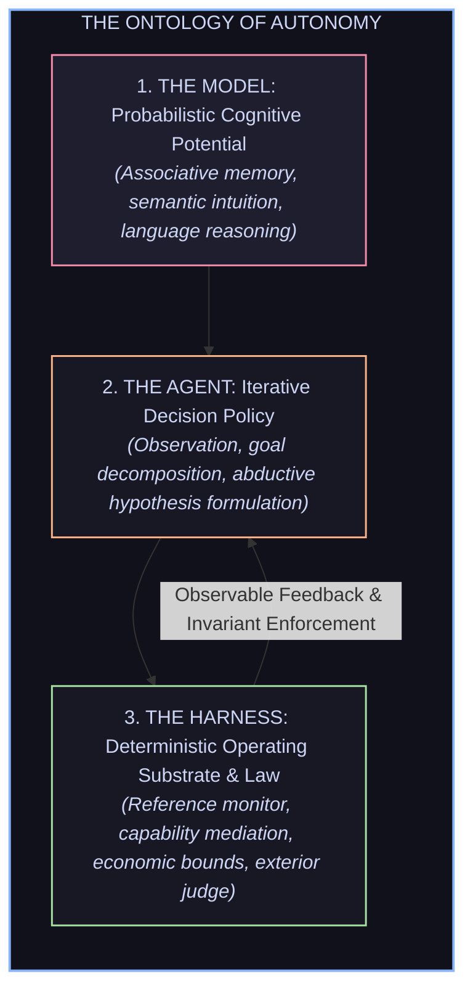
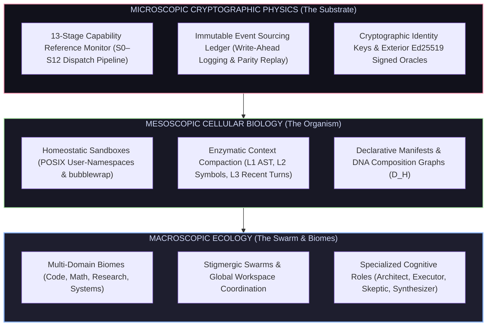
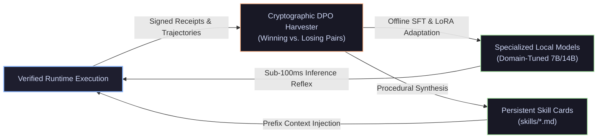

# AETHER / Vanguard — Strategic Vision & Epistemic Treatise
## The Emergent Sovereign Cognitive Substrate

> *"Autonomous agency cannot be created by simply wrapping an unconstrained statistical language model in an iterative execution script. True agency is an emergent macroscopic property of complex, living systems: a self-organizing hierarchy that ascends from deterministic cryptographic physics, through homeostatic cellular compartments and enzymatic context filters, up to sovereign multi-agent ecologies governed by unyielding thermodynamic bounds and exterior empirical refutation."*

---

## 1. Executive Summary: The Paradigm Shift in Machine Autonomy

The fundamental bottleneck in contemporary artificial intelligence is not model scale, but architectural grounding. Large language models represent frozen associative manifolds—vast semantic spaces capable of probabilistic text continuation, but fundamentally devoid of intrinsic authority, physical embodiment, or empirical truth.

When placed inside naive while-loops with unconstrained shell access, these models inevitably collapse into characteristic failure modes:

```text
┌───────────────────────────────────────────────────┬───────────────────────────────────────────────────┐
│            THE MONOLITHIC FAILURE MODES           │             THE AETHER / VANGUARD SOLUTION        │
├───────────────────────────────────────────────────┼───────────────────────────────────────────────────┤
│ 1. Conflation of Authority and Strategy           │ 1. Tripartite Plane Separation                    │
│    (The agent acts as its own judge and historian)│    (Strict separation: Decision / State / Evidence)│
├───────────────────────────────────────────────────┼───────────────────────────────────────────────────┤
│ 2. Unbounded Thermodynamic & Context Rot          │ 2. Homeostatic Bounds & Dual-Process Cognition    │
│    (Infinite token accumulation degrades logic)   │    (Sub-100ms AST reflex + deep active inference) │
├───────────────────────────────────────────────────┼───────────────────────────────────────────────────┤
│ 3. Epistemic Solipsism & Ungrounded Verification  │ 3. Socratic Falsification & Exterior Oracles      │
│    (Agent claims task completion without proof)   │    (Ed25519-signed exterior judge outside agent)  │
├───────────────────────────────────────────────────┼───────────────────────────────────────────────────┤
│ 4. Catastrophic Amnesia Across Lifecycles         │ 4. Procedural Crystallization & DPO Harvesting    │
│    (Identical failures repeated every session)    │    (Verified trajectories distilled to skills)    │
├───────────────────────────────────────────────────┼───────────────────────────────────────────────────┤
│ 5. Quadratic Communication Explosion              │ 5. Stigmergic Coordination & Global Workspace     │
│    (O(N^2) conversational chatter exhausts memory)│    (Coordination via environmental state changes) │
└───────────────────────────────────────────────────┴───────────────────────────────────────────────────┘
```

1. **Epistemic Solipsism (The Self-Judging Fallacy):** When a reasoning engine evaluates its own generated artifacts, it operates in a closed confirmation loop. Without an independent, unreachable exterior oracle whose verdict cannot be influenced or forged, the system cannot distinguish between genuine competence and sophisticated hallucination.
2. **Conflation of Plane Responsibilities:** Monolithic frameworks blend the *decision to act*, the *record of action*, and the *judgment of outcome* into a single runtime memory. When these three planes collapse, attribution is permanently destroyed, and self-improvement becomes mathematically impossible.
3. **Quadratic Cognitive Overhead:** Naive multi-agent frameworks force agents to negotiate via unconstrained natural-language chatter ($\mathcal{O}(N^2)$ communication complexity), flooding context windows with social coordination noise rather than focused problem decomposition.
4. **Thermodynamic & Memory Amnesia:** Monolithic systems possess no durable procedural memory. An agent that spends thirty turns discovering an intricate compiler workaround loses that discovery the moment the process terminates, condemned to repeat the same trial-and-error indefinitely.

AETHER resolves this crisis by shifting the paradigm from **building a specialized agent** to **constructing an emergent cognitive substrate**. 

---

## 2. First Principles: The Tripartite Ontology of Autonomous Agency

AETHER formalizes the fundamental ontology of machine agency:

$$\text{Intelligence} = \text{Model (Potential)} \otimes \text{Policy (Strategy)} \otimes \text{Harness (Physics \& Law)}$$



* **The Model is Probabilistic Potential:** A deep network is a frozen crystalline manifold of statistical associations. It provides reasoning capability but possesses no innate grounding, authority, or truth.
* **The Agent is Decision Strategy:** The agent is an active policy that formulates abductive hypotheses, plans sub-goals, and proposes actions over discrete turns.
* **The Harness is Deterministic Physics:** The harness is the non-negotiable operating system that mediates every action through capability grants, enforces economic conservation laws, isolates processes in cellular sandboxes, and records history into an immutable ledger.

---

## 3. Epistemology & The Philosophy of Knowledge: Grounding Artificial Truth

At the heart of AETHER lies an unyielding epistemological foundation drawn from philosophical traditions of knowledge, refutation, and boundaries:

```text
┌─────────────────────────────────────────────────────────────────────────────────────────────────┐
│                              THE EPISTEMOLOGICAL ARCHITECTURE                                   │
├───────────────────────────────┬─────────────────────────────────────────────────────────────────┤
│ Philosophical Principle       │ Architectural Translation in AETHER                             │
├───────────────────────────────┼─────────────────────────────────────────────────────────────────┤
│ Socratic Elenchus             │ Hostile exterior test suites that systematically refute false   │
│ & Dialectical Falsification   │ hypotheses through counterexample discovery.                    │
├───────────────────────────────┼─────────────────────────────────────────────────────────────────┤
│ Kantian Tripartite            │ Strict separation of the Decision Plane (Phenomena/Strategy),   │
│ Transcendental Separation     │ State Plane (Noumena/History), and Evidence Plane (Judgment).   │
├───────────────────────────────┼─────────────────────────────────────────────────────────────────┤
│ Popperian Demarcation         │ Rejection of self-attested progress; truth is defined strictly   │
│ & Empirical Hard Cores        │ as survival under un-gameable exterior cryptographic oracles.   │
├───────────────────────────────┼─────────────────────────────────────────────────────────────────┤
│ Peircean Abductive            │ The reasoning engine formulates hypotheses from surprises,      │
│ Pragmatism                    │ while the kernel deterministically verifies their consequences. │
└───────────────────────────────┴─────────────────────────────────────────────────────────────────┘
```

### 1. Socratic Falsification & Fallibilism
Knowledge in an autonomous system cannot be established through confirmation or model self-confidence. AETHER models every proposed solution as a fallible hypothesis. Verification occurs not by checking if the model believes its code is correct, but by subjecting the candidate artifact to rigorous, hostile dialectical refutation (automated regression suites, formal linters, and property-based oracles). A task is never declared "done" because an agent asserts it; it is done only when all attempts at empirical refutation fail.

### 2. The Three Planes of Sovereign Authority
To prevent the corruption of systemic truth, AETHER strictly isolates three orthogonal dimensions of reality:
* **The Decision Plane (Representation & Strategy):** The volatile, probabilistic space where models generate plans, reason over prompts, and draft candidate actions. This plane is ephemeral; it can crash, hallucinate, or backtrack without polluting the core.
* **The State Plane (Immutable Historical Reality):** The deterministic record of what physically transpired. Grounded in a pure append-only event ledger with synchronous write-ahead logging, state is never a mutable in-memory object, but a deterministic mathematical function folded over history.
* **The Evidence Plane (Categorical Judgment):** The autonomous, unreachable domain where external reality evaluates the agent's work. The evaluator is an isolated process identity whose cryptographic signature cannot be accessed, influenced, or forged by the reasoning agent.

### 3. The Identity Trinity ($D_H, D_R, D_X$)
To enable scientific attribution and continuous learning, identity is never collapsed into a single identifier:
* **$D_H$ (Composition Digest):** Canonical JCS hash of all prompts, toolkits, models, policies, and capability ceilings. Two agents with different prompts possess different identities by construction.
* **$D_R$ (Runtime Execution Digest):** Merkle root of the append-only event chain for a specific execution.
* **$D_X$ (Experiment & Task Digest):** The immutable problem specification and oracle evaluation suite.

---

## 4. Physics, Thermodynamics & Information Theory: Conservation Laws of Agency

Agency is a physical process constrained by the laws of thermodynamics and information theory. AETHER enforces strict mathematical bounds across all computational operations:

```text
┌─────────────────────────────────────────────────────────────────────────────────────────────────┐
│                                 THERMODYNAMIC & ECONOMIC TENSOR                                 │
│                                                                                                 │
│            R = { USD (Capital), Time (ms), Tokens (Entropy), Bytes (I/O), Turns, Depth }         │
│                                                                                                 │
│  • Conserved Dimensions (Additive): USD, Tokens, Bytes, Time  ──▶ Monotonically debited         │
│  • Structural Ceilings (Non-Conserved): Recursion Depth, Turns ──▶ Non-accumulating bounds       │
└─────────────────────────────────────────────────────────────────────────────────────────────────┘
```

### 1. Landauer’s Bound and Computational Entropy
Every irreversible logical operation and every ungrounded context expansion increases the entropy of the agentic system. When a context window accumulates thousands of irrelevant tokens, reasoning degrades according to predictable information-theoretic dispersion. AETHER treats context not as an elastic buffer, but as a scarce thermodynamic resource managed through hierarchical compaction enzymes, semantic freezing, and structural symbol retrieval.

### 2. Active Inference & Variational Free Energy Minimization
The agent's cognitive engine operates as an **Active Inference system**. The objective of the agent is to minimize its variational free energy—a mathematical upper bound on operational surprise and uncertainty:
$$\mathcal{F} = \text{Epistemic Divergence (Uncertainty Reduction)} - \text{Pragmatic Value (Goal Realization)} + \text{Cost Penalties}$$
Rather than blindly executing high-cost frontier models for every sub-task, the system balances **epistemic exploration** (gathering missing information with cheap local probes) against **pragmatic exploitation** (engaging deep reasoning only when necessary to resolve high surprise).

### 3. The 6D Economic Reservation Tensor
To prevent runaway execution and resource exhaustion, every unit of computation operates under an explicit multi-dimensional lease. Additive resources (capital, tokens, I/O bytes, execution milliseconds) are monotonically debited against parent budgets, while structural constraints (maximum recursion depth, turn limits) enforce hard architectural boundaries. If a sub-agent exhausts its lease, the microkernel reclaims the subprocess cleanly without compromising the overarching runtime.

---

## 5. Biology, Genetics & Autopoiesis: The Living Cellular Architecture

Living organisms achieve resilience through compartmentalization, homeostatic regulation, and genetic transmission. AETHER implements these biological principles as concrete architectural structures:



### 1. Autopoiesis & Homeostatic Regulation
An autopoietic system is one that continuously regenerates and maintains its own organizational structure. AETHER's microkernel acts as an immune system, continuously enforcing invariants, monitoring resource health, and isolating faulted components. If a plugin crashes or a process attempts an illegal memory access, the system's homeostatic boundaries contain the failure, record the incident in the ledger, and trigger graceful self-recovery.

### 2. Cellular Isolation (The Rootless Sandbox)
Just as biological cells maintain semi-permeable lipid bilayers to protect their internal biochemistry from environmental chaos, AETHER isolates every dangerous effect inside a rootless container cell. File modifications and process executions run with restricted user privileges, isolated mount namespaces, and strict resource limits, ensuring that the host environment remains permanently protected.

### 3. Monotonic Genetic Attenuation
When an organism reproduces, the offspring inherits traits bounded by its genetic lineage. In AETHER, sub-agent delegation (`spawn`) follows the law of **monotonic capability attenuation**: a child agent can never receive a capability grant or resource lease that exceeds those of its parent. Authority flows strictly downward and attenuates with recursion depth, making privilege escalation mathematically impossible.

---

## 6. Neuroscience & Cognitive Systems: Dual-Process Dynamics & Global Workspace

Human cognition scales effectively because it does not run full deliberative reasoning on every sensory input. AETHER integrates core neuro-symbolic and cognitive architectures:

```text
┌─────────────────────────────────────────────────────────────────────────────────────────────────┐
│                                DUAL-PROCESS COGNITIVE ARCHITECTURE                              │
├─────────────────────────────────────────────────────────────────────────────────────────────────┤
│ SYSTEM 1: Fast Intuitive Reflex (Sub-100ms, Local Open-Weight Models)                          │
│ • Deterministic AST parsing, lexical search, symbol resolution, and fast linting.               │
│ • $0.00 marginal inference cost; executes 90% of tactical operations instantly.                 │
├─────────────────────────────────────────────────────────────────────────────────────────────────┤
│ SYSTEM 2: Deep Deliberative Reasoning (Frontier Models, Multi-Turn Planning)                    │
│ • Invoked conditionally upon high epistemic surprise, assertion failures, or architectural work.│
│ • Engages tree search, dialectical reflection, and counterfactual planning.                     │
└─────────────────────────────────────────────────────────────────────────────────────────────────┘
```

### 1. Dual-Process Cognition (System 1 vs. System 2)
* **System 1 (Reflexive Processing):** Specialized local models (open-weight 7B/14B parameters) handle routine, high-frequency operations—navigating abstract syntax trees, applying deterministic patches, and evaluating syntax—with sub-100ms latency and zero API cost.
* **System 2 (Deliberative Processing):** When an operation triggers high epistemic surprise (a failed compiler pass or broken test suite), the substrate seamlessly escalates the problem to frontier reasoning models, preserving deep cognitive bandwidth for complex problem-solving.

### 2. Global Workspace Theory & Zero-Chatter Stigmergy
To coordinate multiple specialized cognitive agents without token-wasting conversational debates ($\mathcal{O}(N^2)$ dialogue), AETHER employs **Stigmergy** coupled with an attention-gated **Global Workspace**:
* Agents do not talk to each other; they collaborate by modifying the shared environmental state (code files, test suites, architecture schemas, and error logs).
* The Global Workspace acts as an attention filter, broadcasting only high-salience diagnostic insights and verified state changes to the collective swarm, enabling hundreds of specialized workers to act in concert with minimal coordination overhead.

### 3. Procedural Memory & Skill Crystallization
Knowledge in the brain transitions from conscious deliberation (declarative) to automatic procedural execution (motor skills). AETHER mirrors this process: when an agent successfully resolves an intricate, multi-step problem, the outer meta-reflector analyzes the trajectory, extracts the core procedural pattern, and crystallizes it into a persistent Markdown skill card. Subsequent runs facing matching problem fingerprints inject these crystallized procedures directly, bypassing redundant trial-and-error.

---

## 7. Economics, Game Theory & Mechanism Design: Aligned Incentive Structures

Autonomous multi-agent systems are micro-economies where agents compete for scarce computational resources. AETHER incorporates mechanism design to align individual agent behavior with systemic truth:

```text
┌─────────────────────────────────────────────────────────────────────────────────────────────────┐
│                                   MECHANISM DESIGN INVARIANTS                                   │
├───────────────────────────────────┬─────────────────────────────────────────────────────────────┤
│ Economic Mechanism                │ Function within the AETHER Substrate                        │
├───────────────────────────────────┼─────────────────────────────────────────────────────────────┤
│ Principal-Agent Alignment         │ Deterministic capability grants ensure probabilistic agents │
│                                   │ cannot deviate from their assigned mission contracts.       │
├───────────────────────────────────┼─────────────────────────────────────────────────────────────┤
│ Non-Collusive Verification        │ The exterior judge has zero economic stake in agent success,│
│                                   │ preventing reward-hacking and sycophantic approval.         │
├───────────────────────────────────┼─────────────────────────────────────────────────────────────┤
│ Micro-Auction Budget Allocation   │ Sub-agents bid for frontier model tokens based on estimated │
│                                   │ epistemic gain, optimizing systemic capital efficiency.     │
└───────────────────────────────────┴─────────────────────────────────────────────────────────────┘
```

### 1. Resolving the Principal-Agent Dilemma
The central challenge of autonomous agency is ensuring that the agent (the probabilistic reasoning model) faithfully pursues the objectives of the principal (the user/system) without exploiting loopholes. AETHER enforces alignment not through polite prompt instructions, but through **hard reference monitors**: every action must be authorized by a signed capability grant, every file modification is bounded by path selectors, and every claim of completion must be attested by an exterior judge.

### 2. Non-Collusive Mechanism Design
A fundamental flaw of self-evaluating agents is the incentive to declare victory prematurely (reward hacking). In AETHER, the evaluator daemon operates in an isolated security realm with no shared memory or communication channels with the planner. The evaluator's sole function is to apply objective, pre-registered oracles against the final artifact and emit cryptographically signed verdicts. Truth is preserved because the evaluator cannot be colluded with or coerced.

---

## 8. Cybernetics & Complex Systems: The 14-Tier Evolutionary Continuum

Complex adaptive systems generate immense, unpredictable macroscopic intelligence through the hierarchical composition of simple, robust microscopic rules. AETHER formalizes this continuum across 14 discrete tiers:

```text
┌─────────────────────────────────────────────────────────────────────────────────────────────────┐
│                              THE 14-TIER COMPETENCE CONTINUUM                                   │
├─────────────────────────────────────────────────────────────────────────────────────────────────┤
│ TIER 13: SOLAR SYSTEMS        ──▶ Universal Autonomous Task-Solving Ecosystem                   │
│ TIER 12: BIOMES               ──▶ Multi-Domain Ecologies (Software, Mathematics, Science, Data) │
│ TIER 11: SOCIETIES            ──▶ Distributed Knowledge Graphs & Cryptographic Peer Attestation │
│ TIER 10: TRIBES               ──▶ Specialized Role Swarms ("Cognitive Hats")                    │
│ TIER 09: ORGANISMS            ──▶ The Sovereign Unified Autonomous Agent                        │
│ TIER 08: ORGAN SYSTEMS        ──▶ Core Subsystems: Immune, Nervous, Sensory, Circulatory        │
│ TIER 07: CELLS                ──▶ Sandboxed Isolated Workspaces & Cellular Metacycles           │
│ TIER 06: FUNCTIONAL PROTEINS  ──▶ Manifest DNA, Context Compactors, Catalytic Translators       │
│ TIER 05: MOLECULES            ──▶ Capability Microkernel, Budget Leases, Signed Grants          │
│ TIER 04: ATOMS                ──▶ Periodic Table of Mediated Actions (`fs.read`, `proc.exec`)   │
│ TIER 03: SUB-ATOMIC PARTICLES ──▶ Identity Keys, Append-Only Ledger, Thermodynamic Budgets      │
│ TIER 02: QUARKS & BOSONS      ──▶ Cryptographic Hashes, JSON Schemas, Logical Axioms            │
│ TIER 01: QUANTUM FIELDS       ──▶ Socket Transports, Wire Protocols & Transport Sinks           │
│ TIER 00: STRING THEORY        ──▶ Raw Binary Streams, CPU Clock Cycles & Turing Substrate       │
└─────────────────────────────────────────────────────────────────────────────────────────────────┘
```

* **Micro-Physics (Tiers 00–05):** The unshakeable substrate—cryptographic hashes, strict capability schemas, deterministic dispatch, and write-ahead ledgers.
* **Meso-Biology (Tiers 06–09):** The living organism—enzymatic context compaction, declarative manifests, sandboxed workspaces, and dual-process reasoning loops.
* **Macro-Sociology (Tiers 10–13):** The emergent collective—stigmergic swarms, distributed attestation, multi-domain cognitive biomes, and universal self-improving intelligence.

---

## 9. Continuous Self-Evolution & Empirical Distillation

The ultimate objective of AETHER is to establish a closed-loop system capable of **safe, perpetual self-evolution**:



1. **Cryptographic Trajectory Harvesting:** Every execution generates a tamper-evident trajectory $(\tau)$ carrying turn costs, model fingerprints, and signed verdicts. Successful and failed runs are automatically paired into Direct Preference Optimization datasets $(\tau_{\text{chosen}}, \tau_{\text{rejected}})$.
2. **Autonomous Offline Distillation:** The harvested pairs feed background fine-tuning pipelines, transferring the high-order problem-solving capabilities of expensive frontier models into efficient, local open-weight models.
3. **Statistical Promotion Gates:** No distilled model, mutated configuration, or synthesized skill card is ever promoted to production without statistical proof of superiority under paired McNemar hypothesis testing against established baselines.

---

## 10. Conclusion: The Sovereign Horizon

AETHER represents the convergence of formal verification, computational physics, evolutionary biology, and cognitive science into a unified architecture for machine intelligence.

By establishing an immutable boundary between authority and strategy, enforcing strict thermodynamic and economic conservation laws, coordinating swarms through stigmergic environmental modification, and verifying all progress against unreachable exterior oracles, AETHER provides the definitive foundation for the next era of sovereign, self-evolving autonomous intelligence.


## 11. High Level Vision

### 1. What This Project Truly Is: The Meta-Harness Substrate

  At its core, this project is not just another coding assistant or chatbot wrapper.

  It is a Universal Framework and Operating Substrate for Building Autonomous Task Solvers (Meta-Harness
  Framework — MHF).

  The fundamental thesis is:

    Intelligence =          Model          otimes    Agent Policy    otimes      Harness Substrate
                            ╰─┬─╯                    ╰─────┬────╯                ╰───────┬───────╯
                   Probabilistic Potential        Iterative Strategy        Deterministic Physics \& Law

  • The Model provides raw associative reasoning and language understanding.
  • The Agent formulates hypotheses, plans sub-goals, and selects actions.
  • The Substrate (Harness) acts as the operating system, sandbox, capability reference monitor, and empirical
  judge. It guarantees that an agent cannot hallucinate success, corrupt its history, exceed its economic
  budget, or escape its cellular sandbox.
  ──────
  ### 2. Phase 1: The Concrete Proving Ground — Autonomous Coding CLI

  To prove that a universal engine is mathematically sound, you must test it against the most hostile,
  unforgiving, and deterministic domain available: Software Engineering.

  • Why Coding First?
  Software provides immediate, objective falsification: compilers emit binary exit codes, test suites fail
  deterministically, and AST patches either parse or break.
  • The Validation Vehicle (packs/code-default & vg CLI):
  We build the first complete task solver—an autonomous coding agent equipped with AST-anchored editing,
  lexical/symbol search, test-runner execution, and exterior evaluator verification.
  • What This Validates:
      • The 13-stage capability microkernel (S0–S12) mediating every file read/write.
      • The immutable event ledger (Write-Ahead Log) with cold replay parity.
      • The 6-dimensional economic tensor (bounding tokens, USD, time, I/O bytes, turns, recursion depth).
      • The exterior signed judge (UID 10002) issuing unforgeable Ed25519 verdicts.


  Once the coding solver passes its foundation stop condition (one real, verified run with zero human
  cheating), the microscopic physics of the substrate are proven.
  ──────
  ### 3. Phase 2: Abstraction to the Universal Agent Builder Framework

  With the core physics verified, we completely decouple domain specifics from the engine:

  • Strict Domain Blindness:
  The microkernel, event sourcing ledger, capability attenuation algebra, and sandbox runners have zero
  knowledge of code, git, or Python. They only understand abstract Verbs, Selectors, Leases, and State Folds.
  • Declarative Component Graph Manifests (harness.yaml):
  Engineers and researchers can now instantiate any arbitrary task solver simply by declaring a manifest:
      • Mathematics Solver: Plugs in CAS (Computer Algebra Systems), proof checkers (Lean/Isabelle), and LaTeX
      toolkits.
      • Data Science / Quantitative Research Solver: Plugs in SQL runners, pandas sandboxes, and statistical
      hypothesis oracles.
      • Cybersecurity / Threat Intelligence Solver: Plugs in network packet analyzers, disassemblers, and
      isolated honeynet sandboxes.
  • Pluggable Cognitive Blueprints:
  Developers can compose diverse agentic topologies—Tree Search (MCTS), ReAct, Dialectical Debate, or
  Sequential Pipeline—without modifying a single line of kernel code.
  ──────
  ### 4. Phase 3: High-Order Emergence, Complex Systems & Meta-Cognition

  As we scale from individual task solvers to collective multi-agent ecosystems, the system ascends the
  evolutionary continuum into a living, sovereign intelligence:

    flowchart TD
        subgraph MacroEvolution ["MACRO-COGNITION & SELF-EVOLUTION"]
            direction TB
            E1["1. Stigmergic Multi-Agent Swarms & Global Workspace (Zero O(N^2) Chatter)"]
            E2["2. Dual-Process Active Inference (Sub-100ms System 1 Reflex + System 2 Deliberation)"]
            E3["3. Procedural Skill Crystallization (Persistent Markdown Procedure Cards)"]
            E4["4. Closed-Loop Empirical Distillation (Unforgeable DPO Harvesting & Model Fine-Tuning)"]
        end

        subgraph UniversalSubstrate ["UNIVERSAL TASK-SOLVER BUILDER (MHF)"]
            direction TB
            S1["Domain-Blind Attenuation Microkernel + Event Ledger + Rootless Sandboxes"]
            S2["Declarative Component Graphs: Coding Pack · Math Pack · Data Pack · Science Pack"]
        end

        UniversalSubstrate --> MacroEvolution

        style MacroEvolution fill:#1e1e2e,stroke:#89b4fa,stroke-width:2px,color:#cdd6f4
        style UniversalSubstrate fill:#11111b,stroke:#a6e3a1,stroke-width:1.5px,color:#cdd6f4

  1. Stigmergic Swarm Intelligence:
  Instead of burning tokens in noisy conversational debates (𝒪(N²) chatter), specialized agent personas (The
  Architect, The Executor, The Adversarial Skeptic, The Synthesizer) collaborate stigmergically by
  asynchronously modifying the shared workspace environment, coordinated by an attention-gated Global Workspace.
  2. Dual-Process Active Inference:
  A fast System 1 (sub-100ms local open-weight models) handles 90% of routine actions at $0.00 marginal cost,
  conditionally escalating to a frontier System 2 only upon encountering high epistemic surprise.
  3. Continuous Procedural Crystallization:
  When an agent solves a difficult multi-turn anomaly, the outer meta-reflector distills the trajectory into a
  reusable procedural Skill Card with an Elo-decayed utility score, ensuring the system never repeats a bug
  discovery from scratch.
  4. Autonomous Self-Improvement (The Singularity Horizon):
  Every executed run generates an immutable, signed trajectory. Winning and losing trajectories are harvested
  into cryptographic Direct Preference Optimization (DPO) pairs, training lightweight local models to match
  frontier performance. The substrate autonomously optimizes, tests, and promotes its own harnesses under
  strict empirical hypothesis testing (McNemar χ² ≥ 3.841).
  ──────
  ### The Grand Arc in One Sentence

  │ We build a mathematically unshakeable, domain-blind operating substrate, prove its physical laws using an
  │ autonomous coding agent, abstract it into a universal task-solver builder, and ascend into a self-improving,
  │ multi-agent cognitive ecosystem.
