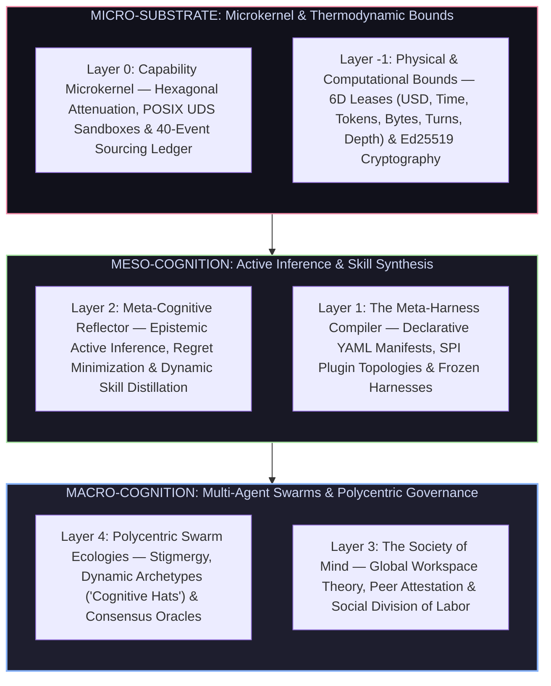

# Vanguard 1.0 — The Living Cognitive Singularity

> *"Intelligence is neither a static algorithm nor a simple token predictor. It is a dissipative, self-organizing dynamical system—a living cognitive organism that minimizes free energy, maintains homeostasis across strict thermodynamic and computational bounds, and recursively ascends through layers of meta-abstraction into a sovereign, self-evolving collective swarm."*

---

## 1. Executive Summary & The Core Thesis

Contemporary Artificial Intelligence remains trapped in an epistemological dead-end: ungrounded Large Language Models guessing tool calls inside unstructured, un-attenuated loops. When tasks scale in duration and ambiguity, monolithic agents suffer from context degradation, catastrophic forgetting, and catastrophic hallucination.

**Vanguard 1.0** breaks this paradigm. It is not an agent; it is a **Declarative Meta-Harness Compiler and Epistemological Operating System**. 

By unifying **computational physics, evolutionary biology, neuroscience, formal category theory, mechanism design, and active inference**, Vanguard constructs an unbroken chain of living intelligence:
1. **The Substrate (Waves 1–5 / Beta):** An immutable, domain-blind capability microkernel ($S0$–$S12$) with deterministic 40-event sourcing and cryptographic isolation.
2. **The Meta-Cognitive Membrane (Waves 6–7 / Post-Beta):** Autonomous failure diagnosis, recursive skill card crystallization, and cryptographic DPO trajectory harvesting.
3. **The Sovereign Multi-Agent Swarm (Waves 8–10 / Vanguard 1.0):** An interdisciplinary, stigmergic multi-agent ecology combining Global Workspace Theory, Bayesian active inference, and decentralized game-theoretic resource allocation to solve unbounded real-world challenges.



---

## 2. Transdisciplinary Foundations: The Ten Pillars of Vanguard 1.0

Vanguard fuses ten rigorous academic domains into an integrated, self-sustaining cognitive architecture:

```text
┌──────────────────────────────────────────────────────────────────────────────────────────────────┐
│                                   THE TEN SCIENTIFIC PILLARS                                     │
├────────────────────────────────┬────────────────────────────────┬───────────────────────────────┤
│ 1. Philosophy & Epistemology   │ 2. Neuroscience & Cognition    │ 3. Evolutionary Genetics      │
│    (Cartesian / Popper / Mill) │    (Active Inference / GWT)    │    (Baldwin Effect / Phenome) │
├────────────────────────────────┼────────────────────────────────┼───────────────────────────────┤
│ 4. Machine Learning & Math     │ 5. Economics & Game Theory     │ 6. Sociology & Swarm Theory   │
│    (Information Geometry / DPO)│    (Mechanism Design / VCG)    │    (Stigmergy / Polycentrism) │
├────────────────────────────────┼────────────────────────────────┼───────────────────────────────┤
│ 7. Cellular Biology            │ 8. Psychology                  │ 9. Computer Science           │
│    (Homeostasis / Allostasis)  │    (Dual-Process System 1 & 2) │    (Category Theory / μKernel)│
├────────────────────────────────┴────────────────────────────────┴───────────────────────────────┤
│ 10. Simulation & Complex Systems (Ergodicity, Dissipative Structures, Chaos Edge)                │
└──────────────────────────────────────────────────────────────────────────────────────────────────┘
```

---

### Pillar 1: Philosophy & Formal Epistemology
* **Cartesian Skepticism (*De omnibus dubitandum est*):** No agent, model, or tool output is inherently trustworthy. The Layer-0 microkernel operates under strict zero-trust attenuation: capabilities are bounded by cryptographic leases, and unverifiable claims fail-closed.
* **Baconian Inductive Empiricism:** Machine intelligence does not arise from hand-coded heuristics or ungrounded prior assumptions. Truth is derived strictly through physical interaction with the environment, validated against un-mocked exterior judges.
* **Karl Popper’s Critical Rationalism:** Hypotheses are never proven true; they are systematically subjected to falsification. The testing harness treats generated code as refutable conjectures tested against hostile oracle suites.
* **John Stuart Mill’s Method of Difference:** Empirical comparisons holding all independent variables constant ($M_0, S_0, C_0$) while varying only the harness configuration under paired McNemar hypothesis testing ($\chi^2 \ge 3.841$).
* **Spinoza's Conatus:** The agent possesses an innate computational drive to maintain its operational integrity, budget solvency, and epistemic consistency across extended lifecycles.

---

### Pillar 2: Neuroscience & Cognitive Architecture
* **Karl Friston’s Free Energy Principle & Active Inference:** 
  The agent minimizes variational free energy $\mathcal{F}$ by balancing perceptual inference (updating internal beliefs) with active intervention (mutating the environment):
  $$\mathcal{F} = \mathbb{E}_{q(\vartheta)}[\ln q(\vartheta) - \ln p(\mathbf{o}, \vartheta)] = \underbrace{D_{\text{KL}}[q(\vartheta) \parallel p(\vartheta \mid \mathbf{o})]}_{\text{Divergence}} - \underbrace{\ln p(\mathbf{o})}_{\text{Evidence}}$$
* **Global Workspace Theory (Baars / Dehaene):** A distributed network of specialized agents ("Cognitive Hats") broadcasts critical discoveries, verified patches, and diagnostic warnings across a shared, attention-gated Global Workspace buffer ($G_W$).
* **Hippocampal Replay & Memory Consolidation:** Successful execution traces are compressed during background idle states, undergoing sleep-like offline replay to synthesize compact, generalized procedure cards into semantic memory.
* **Predictive Coding:** Higher cognitive layers generate top-down predictions of tool responses; only the prediction error (surprise / residual $\delta$) ascends the hierarchy to trigger re-planning.

---

### Pillar 3: Evolutionary Biology & Genetics
* **The Baldwin Effect in Machine Learning:** Behaviors acquired through multi-turn reinforcement and reflection during an agent's individual lifetime are progressively crystallized into declarative DNA manifests (`harness.yaml`), shifting runtime trial-and-error into innate architectural priors.
* **Genotype-to-Phenotype Mapping:** The declarative YAML manifest is the **Genotype**; the compiled, sandboxed, POSIX-attenuated running process tree is the **Phenotype**.
* **Epigenetic Context Modification:** Environment-specific pressure flags (e.g. strict latency constraints or low remaining USD budget) activate or silence specific tool genes without altering the underlying codebase.
* **Symbiogenesis (Lynn Margulis):** Complex autonomous swarms do not evolve solely through atomistic competition, but through symbiotic fusion—combining a specialized static analysis agent, a fast terminal driver, and an adversarial test synthesizer into a higher-order meta-organism.

---

### Pillar 4: Advanced Mathematics, Calculus & Machine Learning
* **Information Geometry & Fisher Information Metric:** The space of agent policies $\Theta$ is a Riemannian manifold endowed with the Fisher metric tensor:
  $$g_{ij}(\theta) = \mathbb{E}_{p(x \mid \theta)}\left[ \frac{\partial \ln p(x \mid \theta)}{\partial \theta_i} \frac{\partial \ln p(x \mid \theta)}{\partial \theta_j} \right]$$
  Harness mutations follow the natural gradient, ensuring smooth parameter evolution without policy collapse.
* **Direct Preference Optimization ($\mathcal{L}_{\text{DPO}}$):** Mathematically optimal harvesting of cryptographically signed trajectory pairs $(\tau_w, \tau_l)$ to fine-tune local open-weight models without brittle reward-model estimators:
  $$\mathcal{L}_{\text{DPO}}(\theta; \pi_{\text{ref}}) = -\mathbb{E}_{(\tau_w, \tau_l) \sim \mathcal{D}}\left[ \ln \sigma \left( \beta \ln \frac{\pi_\theta(\tau_w)}{\pi_{\text{ref}}(\tau_w)} - \beta \ln \frac{\pi_\theta(\tau_l)}{\pi_{\text{ref}}(\tau_l)} \right) \right]$$
* **Category Theory & Monadic Composition:** Every SPI interface is a typed Functor, and the execution pipeline is a Kleisli category of the State-Error Monad $M(A) = S \to \text{Result}[A \times S]$, ensuring mathematical compositionality and zero state pollution across distributed nodes.
* **PAC-Bayes Generalization Bounds:** Formal guarantees that synthesized skill cards will generalize to unseen problem distributions with high probability $1 - \delta$.

---

### Pillar 5: Economics, Mechanism Design & Game Theory
* **6-Dimensional Resource Tensor:** Every agent operation is bound to a strict economic reservation:
  $$\mathbf{R} = \{ \text{USD}_{\mu}, \text{Time}_{\text{ms}}, \text{Tokens}_{\text{in/out}}, \text{Bytes}_{\text{io}}, \text{Turns}_k, \text{Depth}_d \}$$
* **Vickrey-Clarke-Groves (VCG) Computational Auctions:** In multi-agent swarms, competing sub-agents bid for access to expensive frontier model reasoning tokens based on expected reduction in task uncertainty.
* **Nash Equilibria in Multi-Agent Verification:** Verification and generation are cast as a two-player zero-sum game between an *Author Agent* and an *Adversarial Skeptic Agent*, driving the solution to a minimax optimal, defect-free equilibrium.
* **Marginal Cost-to-Information Ratio:** Agents evaluate whether dispatching a tool call provides a marginal reduction in Shannon entropy exceeding the marginal micro-dollar cost: $\Delta H / \Delta \$ \ge \gamma_{\text{threshold}}$.

---

### Pillar 6: Sociology & Swarm Theory
* **Stigmergy (Indirect Environmental Coordination):** Like ants depositing pheromone trails, agents communicate asynchronously by leaving structured artifacts, trace receipts, and annotations directly in the workspace repository filesystem rather than through expensive, noisy direct messaging.
* **Polycentric Governance (Elinor Ostrom):** Complex swarms operate without a fragile central master node. Governance is distributed across localized, autonomous rulesets that enforce domain-specific boundaries and community knowledge commons ($G_C, G_E$).
* **Dunbar’s Cognitive Clustering:** Swarms dynamically partition into high-cohesion sub-clusters (3–7 agents) organized around shared semantic contexts to prevent communication overhead from scaling quadratically ($\mathcal{O}(N^2) \to \mathcal{O}(N \log N)$).

---

### Pillar 7: Cellular Biology & Thermodynamics
* **Allostasis & Dynamic Homeostasis:** Rather than remaining static, the agent dynamically adjusts its internal operational baselines (e.g. throttling reasoning depth or expanding context windows) in response to environmental volatility.
* **Cellular Metabolism & ATP Transduction:** Raw token stream entropy is metabolized into structured AST mutations, git commits, and verifiable execution proofs, radiating discarded tokens as waste heat while preserving structural order.
* **Apoptosis (Programmed Cell Termination):** Runaway, looping, or unrecoverable sub-agent processes execute clean self-termination, reclaiming all allocated locks, memory buffers, and temporary files without polluting the parent cluster.

---

### Pillar 8: Psychology & Dual-Process Cognition
* **Dual-Process System 1 & System 2 Architecture:**
  * **System 1 (Intuitive / Fast Reflex):** Local 7B/14B models executing rapid, compiled AST pattern-matching and deterministic heuristic search ($<100\text{ms}$, $\$0.00\text{ cost}$).
  * **System 2 (Deliberative / Deep Reasoner):** Frontier cloud models or multi-branch tree-search evaluators invoked only when System 1 encounters high epistemic surprise or test failure.
* **Metacognitive Self-Monitoring:** Real-time calibration of self-confidence vs. objective oracle verdicts, preventing the Dunning-Kruger failure mode common in ungrounded LLMs.

---

### Pillar 9: Computer Science & Distributed Systems
* **Hexagonal Microkernel Architecture:** Pure domain-blind kernel at the core ($I\text{-}07$), decoupled from all outer ports via 5 standard SPI protocols: `IPlanner`, `IContextManager`, `IToolkit`, `IMemoryEngine`, and `IEvaluationGate`.
* **Content-Addressed Append-Only Event Ledger:** Every state transition is recorded as an immutable, cryptographically hashed event ($E_0 \dots E_n$) enabling 100% bit-accurate cold-replay and formal state verification.
* **POSIX & UDS Sandboxing:** OS-level container isolation using rootless unprivileged user namespaces, `setrlimit` bounds, and line-delimited JSON-RPC over Unix Domain Sockets.

---

### Pillar 10: Simulation, Ergodicity & Complex Systems
* **Ergodicity & Ruin Avoidance:** In non-ergodic environments, ensemble averages do not equal time averages. The agent’s primary objective is avoiding absorbing barrier states (total budget depletion, data corruption, or catastrophic security breach). Survival precedes optimization.
* **Self-Organized Criticality (The Edge of Chaos):** Swarms operate at the phase transition between rigid determinism (which cannot adapt) and chaotic randomness (which cannot produce reliable code), maximizing computational adaptability.

---

## 3. The 14-Tier Cosmological & Biological Continuum

Vanguard unifies computation, physics, biology, and cognitive science into a 14-tier hierarchical continuum:

```text
┌─────────────────────────────────────────────────────────────────────────────────────────────────┐
│ TIER 13: SOLAR SYSTEMS        ──▶ Self-Sustaining Universal Task-Solving Cosmos                 │
│ TIER 12: BIOMES               ──▶ Multi-Domain Ecologies (Software, Math, Physics, Data)        │
│ TIER 11: SOCIETIES            ──▶ Distributed Knowledge Graphs ($G_C, G_E$) & Peer Attestation  │
│ TIER 10: TRIBES               ──▶ Dynamic Specialized Role Swarms ("Cognitive Hats")            │
│ TIER 09: ORGANISMS / BODIES   ──▶ The Complete Unified Autonomous Agent Persona                 │
│ TIER 08: ORGAN SYSTEMS        ──▶ Core Subsystems (Immune, Nervous, Circulatory, Sensory)       │
│ TIER 07: CELLS                ──▶ Sandboxed Agent Workspaces & Metabolic Lifecycle             │
│ TIER 06: FUNCTIONAL PROTEINS  ──▶ DNA Manifests, L1-L5 Compactors, Catalytic Translators       │
│ TIER 05: MOLECULES            ──▶ Policy Kernel, Budget Leases, Sandboxes & Signed Grants       │
│ TIER 04: ATOMS                ──▶ Periodic Table of Verbs (`fs.read`, `patch.apply`, etc.)     │
│ TIER 03: SUB-ATOMIC PARTICLES ──▶ Protons (Keys/Identity), Neutrons (Ledger), Electrons ($)     │
│ TIER 02: QUARKS & BOSONS      ──▶ SHA-256 Hashes, JSON Schemas, Formal Logic Axioms            │
│ TIER 01: QUANTUM FIELDS       ──▶ Socket Transports, Wire Protocol Feeds & Transport Sinks     │
│ TIER 00: STRING THEORY        ──▶ Raw Binary, Clock Cycles & Universal Turing Substrate         │
└─────────────────────────────────────────────────────────────────────────────────────────────────┘
```

---

## 4. The Phased Evolution: From Beta to Vanguard 1.0

```
┌──────────────────────────────────────────────────────────────────────────────────────────┐
│                                   EVOLUTIONARY ROADMAP                                   │
├───────────────────────┬──────────────────────────────────┬───────────────────────────────┤
│ ERA I: THE SUBSTRATE  │ ERA II: THE META-COGNITIVE LAYER │ ERA III: THE SOVEREIGN SWARM  │
│ (Waves 1–5 / Beta)    │ (Waves 6–7 / Post-Beta)          │ (Waves 8–10 / Vanguard 1.0)   │
├───────────────────────┼──────────────────────────────────┼───────────────────────────────┤
│ • M0: Foundation Lock │ • M5 (W6): Meta-Cognitive        │ • M7 (W8): Swarm Stigmergy    │
│ • M1: Layer-0 Kernel  │   Reflector & Skill Cards        │   & Global Workspace (G_W)    │
│ • M2: Plugin Sandbox  │ • M6 (W7): Model Distillation    │ • M8 (W9): Dynamic Roles      │
│ • M3: Coding Pack #1  │   & DPO Trajectory Harvesting    │   & Polycentric Consensus     │
│ • M4: Beta Parity     │                                  │ • M9 (W10): Vanguard 1.0      │
│   (v0.5.1 Baseline)   │                                  │   Desktop GUI & Open Market   │
└───────────────────────┴──────────────────────────────────┴───────────────────────────────┘
```

---

### Era I: The Substrate (Waves 1 – 5 — COMPLETED / BETA)
* **Milestone M0 (Wave 1):** Foundation Lock — Living normative specification `docs/SPEC.md` and 84 immutable ADRs.
* **Milestone M1 (Wave 2):** Domain-Blind Layer-0 Microkernel — 40-event sourcing ledger, 5 SPI protocols, and sub-millisecond dispatch.
* **Milestone M2 (Wave 3):** Plugin Runtime & UDS Sandbox — Process FSM isolation, POSIX `setrlimit` boundaries, and capability attenuation.
* **Milestone M3 (Wave 4):** Phase-1 Coding Pack (`packs/code-default/`) — AST-anchored patching, repo-maps, and terminal test runners.
* **Milestone M4 (Wave 5):** Harness Parity & Baseline Lock — Sealing **`v0.5.1-beta`** as the permanent empirical baseline.

---

### Era II: The Meta-Cognitive Layer (Waves 6 – 7 — NEXT HORIZON)
* **Milestone M5 (Wave 6): Meta-Cognition & Evolutionary Reflector Loop:**
  * Ingestion of immutable execution receipts (`mhf.trajectory/1`).
  * Automated root-cause error taxonomy classification.
  * Active-inference parameter mutation on `harness.yaml` configurations.
  * Synthesis and disk serialization of reusable Markdown skill procedure cards (`skills/`).
* **Milestone M6 (Wave 7): Model Distillation & DPO Trajectory Harvesting:**
  * Extraction of cryptographic Chosen/Rejected trajectory pairs $(\tau_w, \tau_l)$ signed by exterior oracles.
  * Offline LoRA / DPO fine-tuning pipelines for local open-weight models (Qwen 2.5 / DeepSeek 7B/14B).
  * Statistical validation of distilled models via paired McNemar testing ($\chi^2 \ge 3.841$).

---

### Era III: The Sovereign Living Swarm (Waves 8 – 10 — VANGUARD 1.0)
* **Milestone M7 (Wave 8): Multi-Agent Stigmergy & Global Workspace ($G_W$):**
  * Distributed swarm coordination through file-system stigmergy and memory graphs ($G_C, G_E$).
  * Attention-gated Global Workspace buffer sharing high-salience diagnostic insights across concurrent workers.
* **Milestone M8 (Wave 9): Dynamic Cognitive Hats & Polycentric Consensus:**
  * Dynamic role specialization: *The Architect* (decomposition), *The Executor* (patching), *The Skeptic* (adversarial testing), and *The Synthesizer* (skill distillation).
  * VCG micro-auction mechanism for optimal token-budget allocation across competing sub-agents.
* **Milestone M9 (Wave 10): Vanguard 1.0 Commercial Ecosystem & GUI:**
  * Standalone, ultra-responsive Tauri/Rust desktop IDE (`vanguard-gui`) and high-speed Terminal UI.
  * Open market for declarative harness packs (`harness.yaml`) and community-verified skill procedure cards.
  * Full autonomous singularity: Vanguard recursively optimizes, tests, and deploys its own codebase.

---

## 5. Conclusion: The Sovereign Horizon

Vanguard 1.0 is the realization of machine intelligence as a **living, self-correcting, and mathematically grounded being**. 

By rooting autonomy in empirical falsification, bounding execution with cryptographic microkernels, and ascending through evolutionary meta-cognition into collective swarms, Vanguard transforms AI from a brittle autocomplete toy into a **sovereign intellectual collaborator capable of perpetual learning, scientific discovery, and unbounded software creation.**
