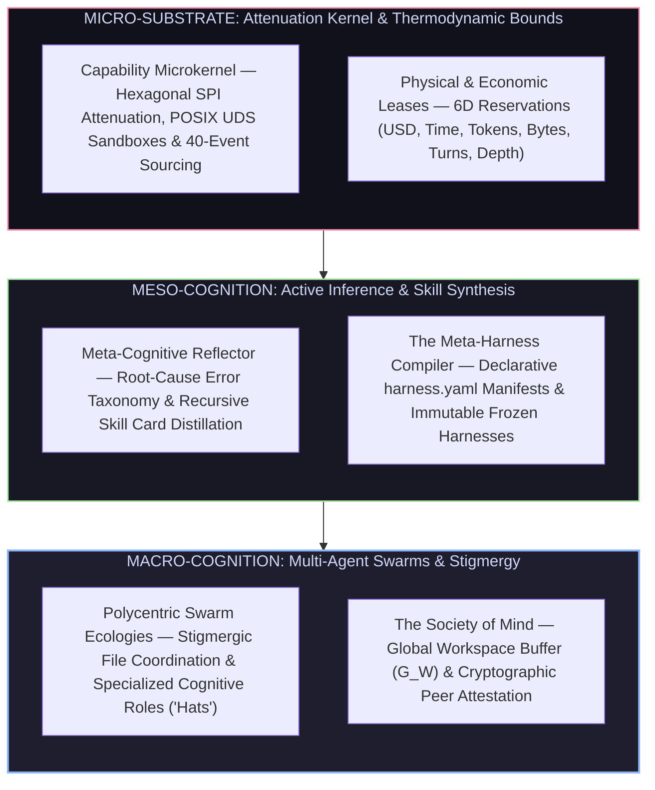
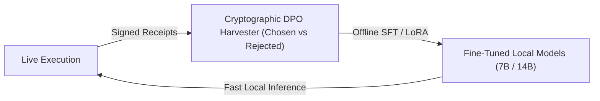

# Vanguard 1.0 — Strategic Evolutionary Vision

> *"Autonomous intelligence is not a monolithic prompt looping in a shell. It is a bounded, self-correcting organism—an architecture that minimizes uncertainty, maintains strict thermodynamic and computational constraints, and recursively ascends through layers of meta-abstraction into a sovereign, self-evolving swarm."*

---

## 1. The Autonomous Bottleneck: Why Modern Agents Fail

Contemporary AI frameworks suffer from fatal architectural flaws that prevent them from scaling beyond toy demos:

```text
┌───────────────────────────────────────────────┬───────────────────────────────────────────────┐
│              THE CURRENT FAILURE MODES        │          THE VANGUARD 1.0 SOLUTION            │
├───────────────────────────────────────────────┼───────────────────────────────────────────────┤
│ 1. Brittle Monolithic Loops                   │ 1. Decoupled Meta-Harness Compiler            │
│    (Unconstrained LLM guessing bash commands) │    (Declarative YAML manifests & 5 SPI ports) │
├───────────────────────────────────────────────┼───────────────────────────────────────────────┤
│ 2. Context Window Rot & Token Overflow        │ 2. Dual-Process Reflex & Dynamic Compaction   │
│    (Long trajectories degrade reasoning)      │    (Sub-100ms AST search + semantic freezing) │
├───────────────────────────────────────────────┼───────────────────────────────────────────────┤
│ 3. Ungrounded Hallucination & Fake Progress   │ 3. Hostile Exterior Oracles & Invariant Proof │
│    (Agent claims task is fixed without proof) │    (Falsification against cryptographic gates)│
├───────────────────────────────────────────────┼───────────────────────────────────────────────┤
│ 4. Catastrophic Amnesia Between Runs          │ 4. Recursive Skill Cards & Trajectory Harvest │
│    (Agent repeats identical bugs next session)│    (Automatic crystallization into skills/)   │
├───────────────────────────────────────────────┼───────────────────────────────────────────────┤
│ 5. Quadratic Communication Overhead           │ 5. Stigmergic Swarm & Global Workspace ($G_W$)│
│    (Multi-agent chatter consumes all tokens)  │    (Direct repo artifacts & asynchronous sync)│
└───────────────────────────────────────────────┴───────────────────────────────────────────────┘
```

1. **The Brittle Monolithic Loop:** Putting a frontier model in a while-loop with arbitrary bash access yields fragile behavior. When a tool fails, the model hallucinates repairs rather than diagnosing root causes.
2. **Context Degradation & Token Waste:** Ingesting entire codebases exhausts context windows, slows inference, and drives token costs exponentially higher without improving task accuracy.
3. **Ungrounded Evaluation:** An agent assessing its own code is prone to confirmation bias. Without independent, un-gameable exterior verification, code remains untested and broken.
4. **Catastrophic Amnesia:** Monolithic systems possess zero episodic memory across lifecycles. An agent that spends 30 turns discovering a complex compiler workaround will repeat the same discovery process from scratch on the next invocation.
5. **Multi-Agent Chatter Explosion:** Naive multi-agent frameworks overwhelm context limits with redundant natural-language dialogue ($\mathcal{O}(N^2)$ chatter) rather than coordinating through shared environmental state.

---

## 2. The Architectural Solution: Bounded, Living Meta-Harnesses

Vanguard 1.0 eliminates these bottlenecks through an integrated, multi-layered architecture:



### 1. The Attenuation Microkernel & 6D Economic Tensor
Every action is mediated through a domain-blind capability kernel ($S0$–$S12$). Agents operate inside strictly bounded POSIX user-namespace sandboxes under explicit 6-dimensional resource leases:
$$\mathbf{R} = \{ \text{USD}_{\mu}, \text{Time}_{\text{ms}}, \text{Tokens}_{\text{in/out}}, \text{Bytes}_{\text{io}}, \text{Turns}_k, \text{Depth}_d \}$$
If a process faults or exceeds its lease, the microkernel reaps the subprocess cleanly without taking down the runtime.

### 2. Active Inference & Dual-Process Cognition
* **System 1 (Sub-100ms Intuitive Reflex):** Local open-weight models (Qwen / DeepSeek 7B) execute rapid AST navigation, static linting, and greedy patch applications at $\$0.00$ API cost.
* **System 2 (Deep Deliberative Reasoning):** Frontier reasoning models are invoked conditionally only when System 1 encounters high epistemic surprise or test assertion failures.
* **Active Inference Optimization:** The agent minimizes operational surprise (variational free energy $\mathcal{F}$) by systematically trading off fast local actions against high-certainty deep deliberation.

### 3. Stigmergic Swarm Coordination (Zero-Chatter Multi-Agent)
Rather than wasting tokens on conversational debates, Vanguard agents coordinate via **Stigmergy**—communicating asynchronously through concrete artifacts left directly in the repository filesystem:
* **The Architect:** Decomposes dependencies and drafts contractual interfaces.
* **The Executor:** Implements precision AST patches in isolated workspace branches.
* **The Adversarial Skeptic:** Synthesizes hostile regression suites to falsify candidate patches.
* **The Synthesizer:** Harvests verified trajectories into shared procedure cards.

### 4. Recursive Skill Crystallization & Trajectory Distillation
When an agent resolves a complex multi-turn bug, the solution is not lost. The outer reflector synthesizes the trajectory into a standalone, human-readable Markdown procedure card (`skills/<slug>.md`). Subsequent runs match problem patterns against the skill library, injecting verified solutions into the prompt prefix to eliminate redundant trial-and-error.

---

## 3. The 14-Tier Competence Continuum

From fundamental bitstreams to sovereign multi-agent ecologies, Vanguard maps machine intelligence across 14 discrete tiers:

```text
┌─────────────────────────────────────────────────────────────────────────────────────────────────┐
│ TIER 13: SOLAR SYSTEMS        ──▶ Self-Sustaining Universal Task-Solving Cosmos                 │
│ TIER 12: BIOMES               ──▶ Multi-Domain Ecologies (Software, Math, Science, Systems)     │
│ TIER 11: SOCIETIES            ──▶ Distributed Knowledge Graphs ($G_C, G_E$) & Peer Attestation  │
│ TIER 10: TRIBES               ──▶ Dynamic Specialized Role Swarms ("Cognitive Hats")            │
│ TIER 09: ORGANISMS / BODIES   ──▶ The Complete Unified Autonomous Agent Persona                 │
│ TIER 08: ORGAN SYSTEMS        ──▶ Core Subsystems (Immune, Nervous, Circulatory, Sensory)       │
│ TIER 07: CELLS                ──▶ Sandboxed Agent Workspaces & Metabolic Lifecycle             │
│ TIER 06: FUNCTIONAL PROTEINS  ──▶ Declarative Manifests, Context Compactors, AST Translators    │
│ TIER 05: MOLECULES            ──▶ Policy Kernel, Budget Leases, Sandboxes & Signed Grants       │
│ TIER 04: ATOMS                ──▶ Periodic Table of Verbs (`fs.read`, `patch.apply`, etc.)     │
│ TIER 03: SUB-ATOMIC PARTICLES ──▶ Identity Keys ($p^+$), Event Ledger ($n^0$), Budget ($e^-$)   │
│ TIER 02: QUARKS & BOSONS      ──▶ SHA-256 Hashes, JSON Schemas, Formal Axioms                  │
│ TIER 01: QUANTUM FIELDS       ──▶ Socket Transports, Wire Protocol Feeds & Transport Sinks     │
│ TIER 00: STRING THEORY        ──▶ Raw Binary, CPU Clocks & Universal Turing Substrate           │
└─────────────────────────────────────────────────────────────────────────────────────────────────┘
```

---

## 4. Self-Building & Empirical Distillation

Vanguard is engineered to **use its own verified execution to train its next-generation models**:



1. **Cryptographic Trajectory Harvesting:** Every execution generates an immutable event ledger signed by an independent exterior oracle. Winning trajectories are paired with rejected attempts $(\tau_w, \tau_l)$.
2. **Offline Local Distillation:** Harvested pairs are fed into offline LoRA / DPO fine-tuning pipelines, bootstrapping local 7B open-weight models to match frontier-tier coding pass rates on specialized domain tasks.
3. **Statistical Verification:** Promoting a distilled model or synthesized skill card requires statistical proof under paired McNemar hypothesis testing ($\chi^2 \ge 3.841, p < 0.05$) against the `v0.5.1-beta` baseline before merging into production.

---

## 5. The Phased Evolution: From Beta to Vanguard 1.0

```text
┌──────────────────────────────────────────────────────────────────────────────────────────┐
│                                   EVOLUTIONARY ROADMAP                                   │
├───────────────────────┬──────────────────────────────────┬───────────────────────────────┤
│ ERA I: THE SUBSTRATE  │ ERA II: THE META-COGNITIVE LAYER │ ERA III: THE SOVEREIGN SWARM  │
│ (Waves 1–5 / Beta)    │ (Waves 6–7 / Post-Beta)          │ (Waves 8–10 / Vanguard 1.0)   │
├───────────────────────┼──────────────────────────────────┼───────────────────────────────┤
│ • M0: Foundation Lock │ • M5 (W6): Meta-Cognitive        │ • M7 (W8): Swarm Stigmergy    │
│ • M1: Layer-0 Kernel  │   Reflector & Skill Cards        │   & Global Workspace ($G_W$)  │
│ • M2: Plugin Sandbox  │ • M6 (W7): Model Distillation    │ • M8 (W9): Dynamic Roles      │
│ • M3: Coding Pack #1  │   & DPO Trajectory Harvesting    │   & Polycentric Consensus     │
│ • M4: Beta Parity     │                                  │ • M9 (W10): Vanguard 1.0      │
│   (v0.5.1 Baseline)   │                                  │   Desktop GUI & Open Market   │
└───────────────────────┴──────────────────────────────────┴───────────────────────────────┘
```

---

### Era I: The Substrate (Waves 1 – 5 — COMPLETED / BETA)
* **Milestone M0 (Wave 1):** Foundation Lock — Living normative specification [`docs/SPEC.md`](SPEC.md) and 84 immutable ADRs.
* **Milestone M1 (Wave 2):** Domain-Blind Layer-0 Microkernel — 40-event sourcing ledger, 5 SPI protocols, and sub-millisecond dispatch.
* **Milestone M2 (Wave 3):** Plugin Runtime & UDS Sandbox — Process FSM isolation, POSIX `setrlimit` boundaries, and capability attenuation.
* **Milestone M3 (Wave 4):** Phase-1 Coding Pack (`packs/code-default/`) — AST-anchored patching, repo-maps, and terminal test runners.
* **Milestone M4 (Wave 5):** Harness Parity & Baseline Lock — Sealing **`v0.5.1-beta`** as the permanent empirical baseline.

---

### Era II: The Meta-Cognitive Layer (Waves 6 – 7 — NEXT HORIZON)
* **Milestone M5 (Wave 6): Meta-Cognition & Evolutionary Reflector Loop:**
  * Ingestion of immutable execution receipts (`mhf.trajectory/1`).
  * Automated root-cause error taxonomy classification.
  * Active-inference parameter mutation on `harness.yaml` configurations.
  * Synthesis and disk serialization of reusable Markdown skill procedure cards (`skills/`).
* **Milestone M6 (Wave 7): Model Distillation & DPO Trajectory Harvesting:**
  * Extraction of cryptographic Chosen/Rejected trajectory pairs $(\tau_w, \tau_l)$ signed by exterior oracles.
  * Offline LoRA / DPO fine-tuning pipelines for local open-weight models (Qwen 2.5 / DeepSeek 7B/14B).
  * Statistical validation of distilled models via paired McNemar testing ($\chi^2 \ge 3.841$).

---

### Era III: The Sovereign Living Swarm (Waves 8 – 10 — VANGUARD 1.0)
* **Milestone M7 (Wave 8): Multi-Agent Stigmergy & Global Workspace ($G_W$):**
  * Distributed swarm coordination through file-system stigmergy and memory graphs ($G_C, G_E$).
  * Attention-gated Global Workspace buffer sharing high-salience diagnostic insights across concurrent workers.
* **Milestone M8 (Wave 9): Dynamic Cognitive Hats & Polycentric Consensus:**
  * Dynamic role specialization: *The Architect* (decomposition), *The Executor* (patching), *The Skeptic* (adversarial testing), and *The Synthesizer* (skill distillation).
  * VCG micro-auction mechanism for optimal token-budget allocation across competing sub-agents.
* **Milestone M9 (Wave 10): Vanguard 1.0 Commercial Ecosystem & GUI:**
  * Standalone, ultra-responsive Tauri/Rust desktop IDE (`vanguard-gui`) and high-speed Terminal UI.
  * Open market for declarative harness packs (`harness.yaml`) and community-verified skill procedure cards.
  * Full autonomous singularity: Vanguard recursively optimizes, tests, and deploys its own codebase.

---

## 6. Conclusion: The Sovereign Horizon

Vanguard 1.0 transforms autonomous AI from a brittle autocomplete toy into a **sovereign, self-correcting intellectual collaborator**. 

By grounding execution in cryptographic microkernels, eliminating multi-agent chatter through stigmergic repository coordination, and continuously distilling runtime discoveries into permanent skill cards, Vanguard delivers an enterprise-grade platform capable of perpetual learning, scientific exploration, and unbounded software creation.
