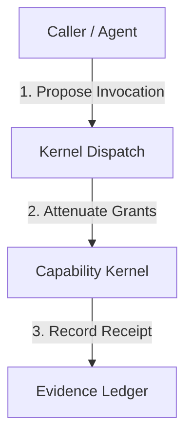

# Specification Title Template (`[SPEC-VG-XX]`)

> **Executive Summary**: One-sentence core statement defining the responsibility of this specification.
> **Audience**: Tech Lead, Developers, and AI Agents.
> **Traceability**: All tasks implementing this spec MUST be logged in [`docs/02_roadmap/backlog.md`](file:///home/rocha/Coding/Aether-D-System/docs/02_roadmap/backlog.md) referencing the explicit Requirement IDs (`[REQ-XXX]`) defined below.

---

## 1. System Invariants & Core Rules

| Invariant ID | Rule Description | Enforcement Mechanism / Location |
|---|---|---|
| `[REQ-SYS-001]` | Description of normative requirement 1. | `vanguard/packages/domain/` / `check_boundaries.py` |
| `[REQ-SYS-002]` | Description of normative requirement 2. | `vanguard/packages/kernel/` / TCB Budget |

---

## 2. Theoretical Architecture & Flow

### 2.1 Component Topology



### 2.2 Invariant Statements

- **`[REQ-SYS-001]` Detail**: Detailed explanation of rule 1.
- **`[REQ-SYS-002]` Detail**: Detailed explanation of rule 2.

---

## 3. Interface & Contract Signatures

```python
# Pure interface / contract definition (domain or ports level)
class TargetPort(Protocol):
    def execute(self, payload: Dict[str, Any]) -> Receipt:
        """Executes operation adhering to [REQ-SYS-001]."""
        ...
```

---

## 4. Traceability & Backlog Mapping

This specification feeds into the following product milestones and backlog tasks:

- **Milestone Target**: [`[MS-0.5.0]`](file:///home/rocha/Coding/Aether-D-System/docs/02_roadmap/milestones.md)
- **Associated Backlog Tasks**:
  - `[TASK-M050-XXX]` — Implements `[REQ-SYS-001]`
  - `[TASK-M050-YYY]` — Implements `[REQ-SYS-002]`
