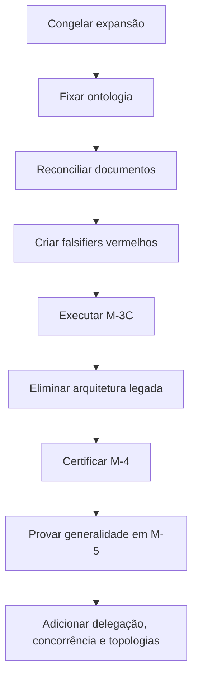

# TODO LIST - Plano definitivo de correção e evolução do AETHER — M-3C a M-8

## Veredito

A abordagem sugerida está essencialmente correta, mas precisa ser transformada em um programa de convergência arquitetural governado por evidências.

A decisão adequada é:

> Não reescrever o AETHER. Preservar o Trust Spine e substituir cirurgicamente a fronteira Composition → Activation → Runtime antes de executar M-4.

O projeto já possui uma fundação valiosa:

* Kernel domain-blind e S0–S12.
* Capability attenuation.
* Reservation/settlement tipados.
* JCS e identidades `D_H`, `D_R`, `D_X`.
* Ledger append-only e reducer.
* Persistência, recuperação e continuidade.
* Avaliador externo assinado.
* Sandboxing rootless.
* Cultura de falsifiers e contratos executáveis.

O problema estrutural está na existência de duas arquiteturas:

1. A arquitetura nova, baseada em `mhf.manifest/2`, named component graph e registry.
2. O caminho realmente executado, ainda baseado no `HarnessManifest` legado, `DEFAULT_BINDINGS` e composição coding-specific.

Portanto, a fundação não precisa ser descartada. O seam de composição precisa ser refundado.

---

# 1. O que fazer agora

A ordem SOTA é:



Não se deve começar reescrevendo roadmap, código e backlog simultaneamente sem estabelecer primeiro a nova autoridade conceitual. Isso apenas substituiria uma inconsistência por outra.

A sequência correta é:

1. Congelar M-4 e novas features.
2. Produzir um Architecture Baseline curto e normativo.
3. Congelar ou reabrir explicitamente cada conceito.
4. Reescrever roadmap e backlog.
5. Preparar os contratos de aceitação de M-3C.
6. Executar o refactor cirúrgico.
7. Remover o caminho legado.
8. Certificar M-4.
9. Só então avançar para M-5–M-8.

---

# 2. Ontologia que deve ser congelada

A arquitetura conceitual deve adotar cinco planos, sem transformá-los necessariamente em cinco pacotes físicos.

| Plano                              | Responsabilidade                                                            |
| ---------------------------------- | --------------------------------------------------------------------------- |
| Kernel / Trust Spine               | Autoridade, capabilities, budgets, effects, reservation/settlement          |
| Runtime / Execution Plane          | Ativação, lifecycle, execução, persistência, recovery                       |
| Meta-Framework / Composition Plane | Componentes, bindings, manifests, packs, políticas substituíveis            |
| Meta-Harness / Experiment Plane    | Benchmarks, comparação de candidatos, atribuição, promoção e rollback       |
| Meta-Cognition / Adaptation Plane  | Proposição e avaliação experimental de mudanças em políticas e conhecimento |

A separação fundamental é:

* O Kernel governa efeitos.
* O Runtime executa transições.
* O Meta-Framework declara e compõe sistemas.
* O Meta-Harness experimenta e compara sistemas.
* A Meta-Cognição propõe adaptações sob controle experimental.

Coding Harness deve ser formalmente definido como:

> Pack #1 e laboratório principal do framework, nunca como semântica embutida no substrate.

## Conceitos que devem permanecer congelados

* Kernel domain-blind.
* Pipeline S0–S12.
* Atenuação monotônica de autoridade e orçamento.
* Reservation/settlement.
* Um único writer da trajetória.
* Ledger append-only.
* Avaliação externa e assinada.
* JCS e separação `D_H`, `D_R`, `D_X`.
* Ausência de evidência significa unknown/absent, nunca pass.
* Execução sequencial como baseline de referência.
* Python como implementação normativa inicial.
* Proibição de mocks, cassettes e evidências remontadas em M-4.
* Nenhuma promoção baseada apenas em autoavaliação.

## Conceitos que devem ser reabertos

* Status de M-3.
* Interpretação de “universal loop”.
* Taxonomia fixa dos SPIs.
* `DEFAULT_BINDINGS`.
* Duração da compatibilidade legacy.
* Defaults de persistência do runner.
* Significado operacional de v1.0.
* Semântica executável de profiles.
* Uso isolado da contagem de LOC como garantia do TCB.

A interpretação correta do universal loop deve ser:

> Universalidade do protocolo de efeitos e evidências, não obrigatoriamente universalidade da topologia de controle.

---

# 3. Como corrigir a documentação

Não edite documentos isoladamente. Crie uma cadeia de autoridade documental.

## Ordem de atualização

### 3.1 Architecture Baseline

Criar um documento normativo curto contendo:

* definição atual do produto;
* ontologia dos cinco planos;
* fronteiras de confiança;
* invariantes congelados;
* conceitos reabertos;
* arquitetura atual versus arquitetura-alvo;
* critérios operacionais para cada milestone;
* definição de v1.0.

Esse documento passa a ser a referência da revisão.

### 3.2 SPEC

Atualizar a SPEC para registrar:

* M-3 como contratualmente implementado, mas operacionalmente incompleto;
* M-3C como milestone corretivo;
* uma única cadeia canônica:

```text
Canonical Manifest
→ Normalized ComponentGraph
→ FrozenComposition
→ ActivationPlan
→ RunPlan
→ Episode ou Scheduler
```

* diferença entre composição, ativação e execução;
* diferença entre episódio, topologia, scheduler e worker;
* Coding Harness como pack;
* metacognição como sistema experimental governado.

### 3.3 ADRs

Cada decisão deve receber um estado explícito:

* `FROZEN`
* `ACCEPTED`
* `REOPENED`
* `SUPERSEDED`
* `DEPRECATED`
* `RESEARCH_ONLY`

ADRs não devem ser silenciosamente reescritos. Quando uma decisão mudou, criar um ADR sucessor e marcar o anterior como superseded.

ADRs prioritários:

1. Canonical composition authority.
2. `FrozenComposition` e identidade `D_H`.
3. `ActivationPlan` runtime-owned.
4. Episode protocol versus topology.
5. Domain-specific binding providers.
6. Plugin lifecycle ownership.
7. Durable release runner.
8. Evidence derivation and binding.
9. Delegation as mediated effect.
10. Scheduler and delivery semantics.

### 3.4 Roadmap e milestones

Substituir descrições baseadas em features por outcomes falsificáveis.

Um milestone só pode estar concluído se houver:

* capacidade executável;
* evidência reproduzível;
* falsifier correspondente;
* documentação consistente;
* ausência de caminho de produção concorrente.

### 3.5 Backlog

Reclassificar todos os itens:

| Classe      | Tratamento                                 |
| ----------- | ------------------------------------------ |
| Preservar   | Continua sem alteração semântica           |
| Convergir   | Migrar para o caminho canônico             |
| Substituir  | Remover após parity                        |
| Generalizar | Retirar conhecimento de domínio do runtime |
| Deferir     | Manter fora do horizonte atual             |
| Rejeitar    | Remover do roadmap                         |
| Pesquisar   | Não tratar como compromisso de produto     |

Cada item deve conter:

* milestone;
* dependências;
* owner;
* módulos afetados;
* risco arquitetural;
* acceptance gate;
* falsifier;
* evidência esperada;
* definição de pronto.

### 3.6 Status e releases

Alinhar:

* `pyproject`;
* README;
* AGENTS;
* SPEC;
* `milestones.md`;
* `sprint_active.md`;
* changelog;
* tags e release metadata.

Adicionar CI que falhe quando milestone, versão e documentos normativos divergirem.

---

# 4. Preparação dos Sprints

Não reescrever os sprints históricos. Eles devem permanecer como registro factual.

Faça apenas:

* registrar o delta entre intenção e implementação;
* marcar M-3 como “contract complete / runtime convergence pending”;
* abrir M-3C;
* replanejar todos os sprints futuros;
* impedir trabalho de M-5+ antes dos gates correspondentes.

Cada sprint deve terminar com um incremento executável, não apenas novos tipos, schemas ou testes unitários.

---

# 5. Waves e roadmap definitivo

## Wave 0 — Governance and Architectural Lock

Objetivo: eliminar ambiguidade antes de alterar o código.

### Todo

* [ ] Congelar implementação de M-4 e features posteriores.
* [ ] Aprovar formalmente M-3C.
* [ ] Criar Architecture Baseline.
* [ ] Definir os cinco planos arquiteturais.
* [ ] Congelar Trust Spine e invariantes.
* [ ] Reabrir decisões problemáticas.
* [ ] Revisar SPEC e ADRs.
* [ ] Reescrever roadmap M-3C→M-8.
* [ ] Reestruturar backlog por dependências e gates.
* [ ] Atualizar status/versionamento.
* [ ] Criar verificador automático de consistência documental.
* [ ] Definir matriz claim → implementation → test → evidence.

Gate: uma única narrativa arquitetural em todos os documentos normativos.

---

# 6. M-3C / v0.6.2 — Canonical Composition Convergence

Esta é a correção da fundação.

## Sprint M-3C.1 — Canonical Contract

### Todo

* [ ] Criar um E2E vermelho para `vg-code-default`.
* [ ] Criar um E2E vermelho para `vg-table-default`.
* [ ] Exigir que ambos usem `Runtime.compose()`.
* [ ] Selecionar uma única forma autoral de `mhf.manifest/2`.
* [ ] Normalizar qualquer ingresso legado imediatamente.
* [ ] Definir `FrozenComposition` imutável.
* [ ] Definir `ActivationPlan` imutável.
* [ ] Definir separação entre `D_H` e `D_R`.
* [ ] Rejeitar campos desconhecidos ou não consumidos.
* [ ] Criar golden vectors de identidade.
* [ ] Definir compatibilidade e deadline de remoção legacy.

Gate: os contratos canônicos existem e os testes demonstram que `main` ainda não os atende.

## Sprint M-3C.2 — Runtime Activation

### Todo

* [ ] Fazer `Runtime.compose()` consumir apenas a representação canônica.
* [ ] Integrar `runtime/registry/*` ao caminho público.
* [ ] Resolver implementação, interface, versão e configuração.
* [ ] Resolver isolation mode e authority ceiling.
* [ ] Calcular dependências e ordem de inicialização.
* [ ] Implementar cleanup topológico reverso.
* [ ] Garantir start/stop exatamente uma vez.
* [ ] Unificar lifecycle events e episode events na mesma lineage.
* [ ] Garantir cleanup em compose failure, crash, cancelamento e evaluator failure.
* [ ] Remover wiring implícito da sessão.

Gate: o component graph controla ativação, lifecycle, falhas e evidências reais.

## Sprint M-3C.3 — Pack Convergence

### Todo

* [ ] Migrar `vg-code-default` para v2.
* [ ] Migrar `vg-table-default` ou probe determinístico equivalente.
* [ ] Mover verbs de código para o pack/adapter bundle.
* [ ] Remover dependência do runtime em `fs.*`, `patch.apply` e `proc.exec`.
* [ ] Generalizar os binding providers por namespace e port.
* [ ] Consolidar as superfícies duplicadas de packs.
* [ ] Executar differential parity entre legacy e v2.
* [ ] Remover manifests autorais legados.
* [ ] Remover imports de produção da autoridade legacy.
* [ ] Adicionar linter contra composição duplicada.

Gate: coding e non-coding executam pelo mesmo runtime sem mudanças em domain, kernel ou episode engine.

## Sprint M-3C.4 — Durability and Release Readiness

### Todo

* [ ] Separar defaults de testes e defaults de release.
* [ ] Tornar SQLite file-backed obrigatório no runner E2E.
* [ ] Validar WAL e cold reconstruction.
* [ ] Reabrir execução em processo novo.
* [ ] Preservar composição, run identity e trajetória.
* [ ] Derivar evidências de registros canônicos.
* [ ] Remover booleans autoafirmados do evidence bundle.
* [ ] Bindar digests entre todas as linhas de evidência.
* [ ] Executar fault injection em todas as transições de lifecycle.
* [ ] Rodar clean-clone gate em Linux com UDS, namespaces e Bubblewrap.

Gate final de M-3C:

* um runtime;
* um manifest canônico;
* uma `FrozenComposition`;
* um `ActivationPlan`;
* um registry lifecycle;
* coding e non-coding;
* nenhum caminho legacy produtivo;
* durable recovery;
* documentação e versão coerentes.

---

# 7. M-4 / v0.6.3 — Honest Coding Foundation E2E

M-4 não deve adicionar arquitetura. Ele deve provar a fundação em condições reais.

## Todo

* [ ] Provisionar provider/model real.
* [ ] Provisionar evaluator externo e identidade separada.
* [ ] Executar Coding Pack v2 pela composição canônica.
* [ ] Usar store persistente.
* [ ] Produzir uma única lineage ininterrupta.
* [ ] Produzir as nove linhas de evidência existentes.
* [ ] Derivar cada linha de artefatos imutáveis.
* [ ] Verificar assinaturas e cross-digests.
* [ ] Demonstrar point-of-effect enforcement.
* [ ] Demonstrar sandbox sem host fallback.
* [ ] Demonstrar cold restart.
* [ ] Demonstrar ausência de efeitos duplicados.
* [ ] Realizar auditoria independente do bundle.
* [ ] Rodar property tests de selectors e budgets.
* [ ] Estabelecer mutation-score mínimo para Trust Spine.
* [ ] Publicar performance baseline: latência, tokens, custos, I/O, evaluator e recovery.

Gate: um run real e auditável prova o caminho canônico completo, sem mock, cassette, trace stitching ou reparo manual.

---

# 8. M-5 / v0.7.0 — Second-Domain Generality Proof

Não basta o table probe de M-3C. M-5 deve provar um domínio formal substancial.

## Todo

* [ ] Selecionar matemática formal, SMT ou domínio equivalente.
* [ ] Criar Formal Pack #2.
* [ ] Criar environment adapter próprio.
* [ ] Criar evaluator/checker determinístico externo.
* [ ] Bindar witness ao input, toolchain e policy.
* [ ] Usar a mesma composição, ativação e runtime.
* [ ] Proibir mudanças em domain, kernel e episode protocol.
* [ ] Produzir parity matrix Coding × Formal.
* [ ] Demonstrar substituição independente de model e evaluator.
* [ ] Demonstrar recovery e evidence lineage no novo domínio.
* [ ] Medir domínio-specific logic leakage.
* [ ] Validar que novos bindings pertencem ao pack/adapters.
* [ ] Formalizar o mínimo contrato de Pack SDK.

Gate: dois domínios reais utilizam o mesmo substrate sem special cases confiáveis.

Esse é o ponto no qual o projeto pode reivindicar generalidade inicial.

---

# 9. M-6 / v0.8.0 — Mediated Delegation

`agent.spawn` deve ser um efeito governado, não uma chamada interna privilegiada.

## Todo

* [ ] Especificar `agent.spawn` no effect algebra.
* [ ] Criar identidade pai-filho.
* [ ] Implementar authority attenuation obrigatória.
* [ ] Implementar budget attenuation.
* [ ] Definir limite de profundidade e fan-out.
* [ ] Criar child `RunPlan` atribuível.
* [ ] Propagar composition e policy identities.
* [ ] Definir cancellation tree.
* [ ] Definir settlement de recursos do filho.
* [ ] Impedir ampliação de autoridade.
* [ ] Persistir lineage pai-filho no ledger.
* [ ] Recuperar árvores parcialmente executadas.
* [ ] Testar kill do pai, filho e worker.
* [ ] Testar crash antes/depois do settlement.
* [ ] Testar delegation cycle e spawn storm.
* [ ] Criar quotas e backpressure iniciais.
* [ ] Provar que nenhum filho contorna S0–S12.

Gate: delegação recuperável, atribuível, limitada e monotonicamente atenuada.

---

# 10. M-7 / v0.9.0 — Scheduler and Bounded Concurrency

O scheduler não pertence ao Kernel nem deve ficar escondido num planner plugin.

## Todo

* [ ] Definir contrato de work item.
* [ ] Definir ready-set e dependency state.
* [ ] Implementar claims e leases.
* [ ] Implementar lease expiry e reclaim.
* [ ] Definir idempotency keys.
* [ ] Garantir exactly-once settlement.
* [ ] Assumir at-least-once physical execution.
* [ ] Implementar bounded worker pool.
* [ ] Implementar cancellation e deadlines.
* [ ] Implementar backpressure.
* [ ] Definir fairness policy.
* [ ] Separar logical agent de worker.
* [ ] Persistir scheduler decisions.
* [ ] Tornar queue e wait latency observáveis.
* [ ] Testar kill/fuzz durante claims e settlement.
* [ ] Comparar execução sequencial e concorrente.
* [ ] Demonstrar equivalência de resultado.
* [ ] Medir WAL contention.
* [ ] Definir limites operacionais do SQLite.
* [ ] Produzir curva qualidade × custo × latência.
* [ ] Exigir ganho Pareto antes de promover concorrência como default.

Gate: concorrência limitada produz benefício medido sem duplicar efeitos nem degradar evidência e recovery.

---

# 11. M-8 / v0.9.x — Explicit Topology Layer

M-8 transforma o AETHER de runtime extensível em meta-framework operacionalmente composicional.

## Todo

* [ ] Definir `TopologySpec`.
* [ ] Separar topologia, scheduler, episode protocol e worker.
* [ ] Definir estado explícito dos nós e edges.
* [ ] Persistir topology state.
* [ ] Criar topologia Direct.
* [ ] Criar Critic/Reviser.
* [ ] Criar Planner/Executor/Verifier.
* [ ] Criar Debate/Aggregation.
* [ ] Criar bounded tree search.
* [ ] Definir termination policies.
* [ ] Definir aggregation policies.
* [ ] Atribuir custos e eventos por papel/nó.
* [ ] Impedir planners opacos de esconder scheduling.
* [ ] Fazer topologias serem selecionadas por composição/policy.
* [ ] Proibir alteração do Kernel por topologia.
* [ ] Proibir novo engine privilegiado por algoritmo.
* [ ] Testar recovery de topology state.
* [ ] Testar cancellation de subgraphs.
* [ ] Comparar ao menos três topologias no mesmo benchmark.
* [ ] Medir qualidade, custo, latência e failure strata.
* [ ] Demonstrar substituição independente de modelo.
* [ ] Demonstrar substituição independente de evaluator.
* [ ] Registrar topology identity em `D_H` ou policy identity correspondente.

Gate: pelo menos três topologias executam sobre o mesmo protocolo de efeitos, runtime e trust spine, sem engines privilegiados adicionais.

---

# 12. Como manter M-9 e M-10 no horizonte sem projetá-los agora

M-9 e M-10 devem existir somente como constraints de compatibilidade.

## M-9 — horizonte v1.0 RC

Manter em mente:

* retrieval e skills com provenance;
* índices reproduzíveis;
* conformance polyglot;
* experiment service;
* candidate archive;
* promotion e rollback;
* stable public schemas;
* independent-user operability.

O trabalho atual deve apenas garantir que:

* protocolos sejam versionados;
* identidades sejam portáveis;
* eventos sejam language-neutral;
* nenhuma referência mutável entre em runs atribuíveis;
* componentes possam futuramente ter implementações Rust/Go.

## M-10 — pesquisa pós-v1

Manter em mente:

* adaptação governada;
* candidate generation;
* causal attribution;
* calibration;
* policy learning;
* self-refinement;
* metacognitive controllers;
* canary e rollback.

Não implementar agora:

* VFE/EFE como lei arquitetural;
* DPO;
* evolutionary search produtivo;
* autopromotion;
* self-modification irreversível;
* agentes que sejam simultaneamente generator, evaluator e promoter.

---

# 13. Estrutura correta do backlog

Organize o backlog em seis trilhas:

1. Architecture and contracts.
2. Runtime and lifecycle.
3. Trust, evidence and recovery.
4. Packs and domain generality.
5. Verification and falsification.
6. Release, documentation and operations.

Use esta estrutura para cada item:

```text
ID:
Milestone:
Outcome:
Architectural invariant:
Affected modules:
Dependencies:
Non-scope:
Acceptance test:
Failure-path tests:
Evidence artifact:
Owner:
Independent reviewer:
Removal/migration obligation:
```

Não aceite itens como “implementar scheduler” ou “adicionar metacognição”. Eles não são unidades verificáveis.

Prefira:

> Após crash entre effect completion e settlement, o scheduler recupera o claim, não duplica o settlement e preserva a lineage, comprovado por fault injection determinístico.

---

# 14. Regras de governança para evitar outro reset

* Nenhum milestone termina apenas porque seus tipos e testes unitários existem.
* Nenhum caminho lateral pode sustentar uma claim de produto.
* Toda abstração importante precisa ser exercida pelo public runtime.
* Nenhuma feature posterior pode contornar o caminho canônico.
* Toda abstração nova deve ser provada em pelo menos dois usos.
* Toda generalidade declarada precisa de um contraexemplo non-coding.
* Todo caminho legacy recebe prazo explícito de remoção.
* Cada claim arquitetural recebe um falsifier.
* Nenhum desenvolvedor deve ser o único autor do componente e de seu acceptance oracle.
* Mudanças no Kernel exigem demonstração de authority gap.
* Otimizações de concorrência exigem benefício medido contra o baseline sequencial.
* Meta-cognição permanece fora do TCB e sem autoridade de autopromoção.

---

# Próximo passo exato

Abra agora uma única Wave corretiva chamada:

> **M-3C / v0.6.2 — Canonical Composition Convergence**

A primeira tarefa deve ser criar um teste E2E inicialmente vermelho exigindo que `vg-code-default` e `vg-table-default`, ambos em `mhf.manifest/2`, sejam compostos e ativados pelo `Runtime` público, usando uma única `FrozenComposition`, um único `ActivationPlan`, um único registry lifecycle e nenhuma modificação em `domain/`, `kernel/` ou `agency/episode/`.

Até esse gate ficar verde:

* não executar M-4;
* não iniciar M-5;
* não implementar spawn;
* não adicionar concorrência;
* não construir topologias;
* não iniciar metacognição.

Em síntese: reescreva a documentação normativa, o roadmap e o backlog; reprograme apenas os sprints futuros; preserve o Trust Spine; refatore cirurgicamente a composição e ativação; elimine a arquitetura legacy; prove M-4; use M-5 para validar generalidade; e somente então avance para delegação, concorrência e topologias em M-6–M-8.
