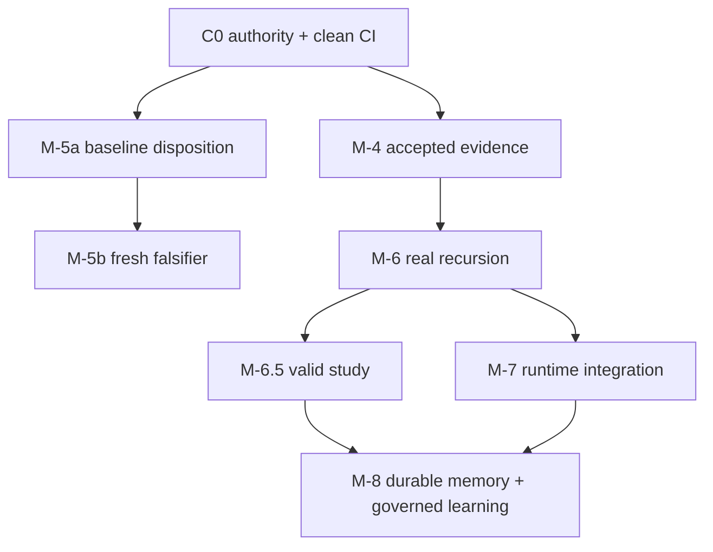

# Macro Milestones — AETHER M-4 through M-8

This file owns stable outcomes, dependencies, and acceptance gates. Current authorization and status
live only in [`sprint_active.md`](sprint_active.md); stable work-package detail lives in
[`backlog.md`](backlog.md). Historical reviews and archived sprint reports are non-authorizing.

## State model

Mechanism and acceptance are deliberately separate. Packages use:

`NOT_STARTED -> IN_PROGRESS -> PACKAGE_READY -> EVIDENCE_READY -> ACCEPTED`

`BLOCKED` means a named dependency prevents progress. `PACKAGE_READY` means isolated contract
readiness; `EVIDENCE_READY` means the immutable bundle verifies; only `ACCEPTED` closes the gate.
Tests, merge state, prose, or waiver alone never close a milestone.

## Status ownership

Current mechanism, integration, package, evidence, review, and blocker state lives in the single
machine-checked table in [`sprint_active.md`](sprint_active.md). This file owns stable gates and must
not duplicate that volatile snapshot.

## Dependency and merge order

Within a window, each developer reaches `PACKAGE_READY` against frozen contracts and fixtures.
Integration follows the producer-before-consumer order in the backlog; acceptance follows only after
the integrated evidence bundle and independent review.

## Stable milestone contracts

### M-4 — useful coding proof and scientific capture

One preregistered candidate must execute through canonical composition and mediated tools using a
live attributable provider; produce a non-empty correct diff and passing task verifier; persist a
file-backed WAL and complete `mhf.trajectory/2`; cold-reconstruct the same terminal state; resolve
every required artifact; and receive independent review. If the reported historical bundle cannot
be recovered, execute exactly one new candidate under a new preregistration. No stitched traces,
manual repairs, fake/cassette replacement, or retrospective evidence creation qualify.

### M-5a — event-derived agent and accepted control

`mhf.event/2` remains the writer format and `/1|/2` remain readable. AgentView, authority
provenance, checkpoint verification, unknown-event preservation, and cold reconstruction must pass.
The contaminated unpublished tag is retained only as history. Acceptance additionally requires the
annotated remote `CONVERGENCE-BASE-v1` and signed baseline manifest defined by ADR-0102.

### M-5b — non-contaminated generality falsifier

After the successor baseline, add a deterministic graph-coloring pack and exterior verifier without
protected substrate semantic changes. Positive, negative, malformed, incomplete, range, and
serialization-permutation vectors run through `Runtime.execute_harness`. RF-86/RF-98 compare the
post-baseline treatment to `CONVERGENCE-BASE-v1`; an independent reviewer accepts the bundle. The
existing SAT path remains regression evidence and cannot substitute for the fresh control.

### M-6 — mediated recursive delegation

Remove synthetic success; require a real `ChildRuntimePort` bound to the sole public run path. Derive
child identity durably from parent episode plus idempotency key; enforce componentwise child budget
reservation against parent remaining budget and independently attenuate scope/depth/turns; persist
intent before launch; reconcile open subtrees without blind retry; and prove cancellation/kill-tree
behavior. A depth>=3 cold-reconstructible signed bundle and independent review are required.

### M-6.5 — measured adaptive strategy

Controller presence is the sole treatment axis. Common random numbers bind perturbations to stable
semantic checkpoints, not raw turn index. A/A must be non-degenerate; tasks deliberately exercise
recoverable blocks; the preregistered paired study reports McNemar exact, Holm correction, paired
interval, attribution, and regression budgets. An accepted positive or negative result closes the
experiment; invalid comparability or instrumentation leaves it blocked. The controller stays off by
default unless the accepted result authorizes a profile-specific enablement.

### M-7 — topologies through one runtime and explicit scheduler disposition

Bind digest-pinned, authority-free run-plan extensions into the existing runtime while retaining the
sequential reference scheduler and ordinary M-6 spawn. Direct, planner/executor/reviewer, and
fork/read/merge topologies execute through one public path; disabled topology preserves declared
parity. Existing causal selectors are used. Correlated monotonic timing is telemetry, never a
mutated event or budget dimension. M7-01 measures independence/completeness, then ADR-0099 records
bounded read concurrency or `SEQUENTIAL_CONFIRMED`. Concurrency is optional; the decision is not.

### M-8 — durable memory and governed learning MVP

Implement ADR-0100: verified scoped authorization, durable category stores, content-addressed
append/index semantics, authorization-before-ranking, retrieval provenance reaching model context,
revocation, recovery, retention/GC/legal hold, and isolation. Use a durable CAS composition registry
with distinct generator/evaluator/promoter authorities, sealed workloads, measured held-out lift,
and an executed rollback restoring the prior composition behavior. Acceptance requires security,
recovery, performance, RF-98, TCB, and independent evidence gates. M-8 is the MVP boundary.

## M-1 through M-3 compatibility anchors

All new work preserves S0–S12 authority, typed four-dimensional additive budgets, depth/turn
ceilings, JCS, `D_H/D_R/D_X`, one ledger writer, `/1` byte immutability, fresh-process continuation,
one compose/activate/run seam, and optional identity-bearing assurance profiles. A required change to
one of these anchors needs an explicit successor ADR and falsifier; implementation inconvenience is
not authority.

## M-9/M-10 compatibility boundary

Reserve only low-cost seams: immutable run-plan extensions, authorized memory ports, immutable
composition manifests, evidence envelopes, and exterior candidate generators. Do not implement
distributed scheduling, topology search, continuous-learning services, model training, causal
self-model frameworks, or a second runtime before M-8 acceptance and measured need.
