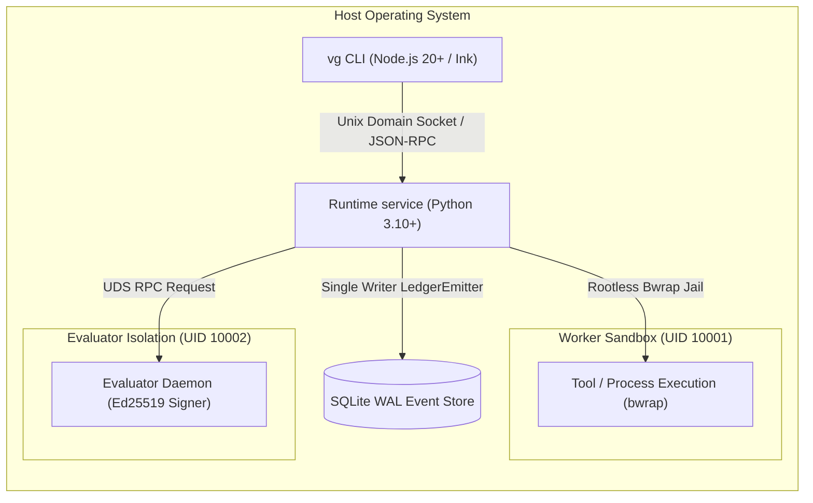

# C4 Container View

> **Status:** `AS_BUILT` · Descriptive View.

## Containers & Process Identities

| Container / Process | Runtime / Image | UID | Security Boundary & Isolation |
|---|---|---|---|
| **CLI Client (`vg`)** | Node.js 20+ / Ink | Current User | Presentation client only; no domain or kernel imports |
| **Control Plane Substrate** | Python 3.10+ | Current User | Hexagonal core, manages session lifecycle and ledger emissions |
| **Worker Sandbox** | `containers/worker.Dockerfile` / bwrap adapter | `10001` target identity | Rootless isolation whose actual containment is reported by probes; do not infer every mount/network property from this diagram |
| **Evaluator Daemon** | `containers/evaluator.Dockerfile` | `10002` | Independent process/mounts; possesses Ed25519 signing key |
| **Storage Engine** | SQLite WAL | Current User | Embedded transactional append-only log with WAL mode |
