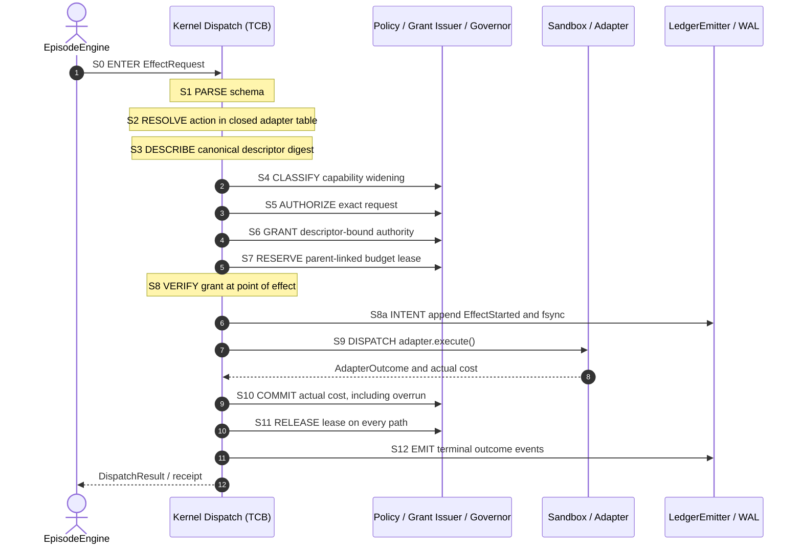
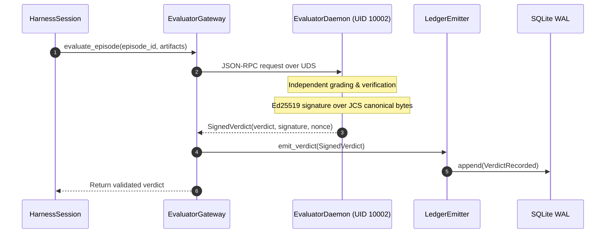
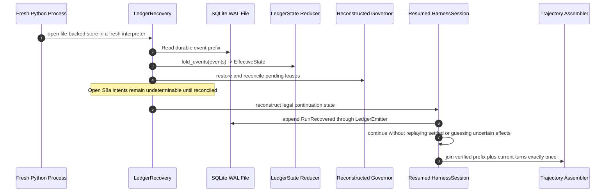

# Subsystem Sequence Flows

> **Status:** Mixed descriptive view. Sections 1–3 are `AS_BUILT`; section 3 records the
> fresh-process continuation behavior proven by RF-25.

---

## 1. 13-Stage Kernel Effect Dispatch Pipeline (S0–S12)

Governed by [`docs/01_law/DISPATCH.md`](../01_law/DISPATCH.md) and implemented in [`dispatch.py`](../../vanguard/packages/kernel/dispatch.py):

---

## 2. Exterior Signed Evaluation Flow

---

## 3. Cold Replay & Continuation (NOVA-2 / RF-25 — `AS_BUILT`)

RF-25 remains red. Current `runtime/ledger/recovery.py` can fold and scan durable events, but the
complete fresh-interpreter reconciliation and continuation contract above is the M-2 proof target.
