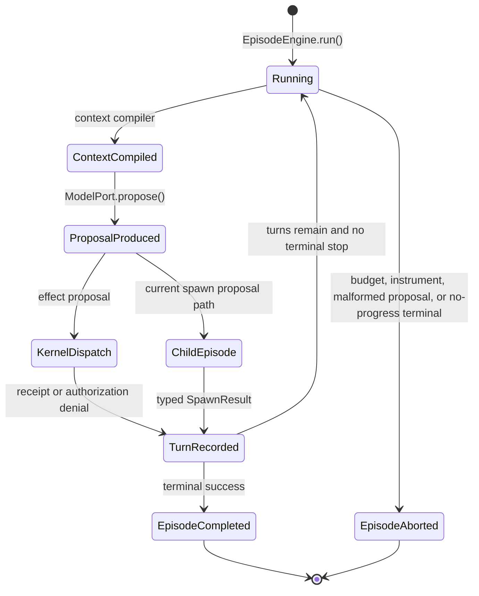
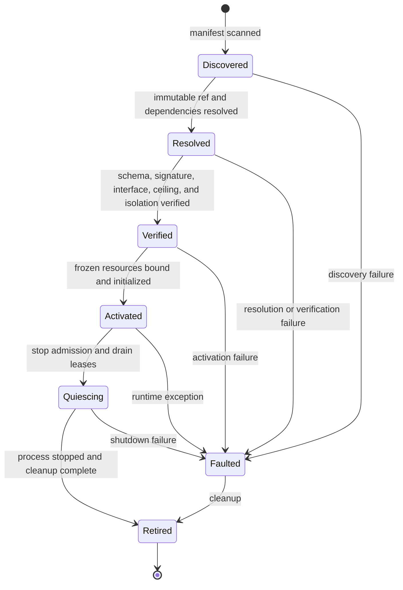

# State Machines & Lifecycle FSMs

> **Status:** Mixed descriptive view. The episode mechanism and packages-path seven-state plugin
> FSM are implemented; M-3 remains open for final falsifier and convergence closure.

---

## 1. Episode turn mechanism (`AS_BUILT` conceptual projection)

Implemented in [`EpisodeEngine`](../../vanguard/packages/agency/episode/engine.py):

This is an explanatory projection of control flow, not a claim that these labels are a persisted
enum. Persisted truth is the event catalog and reducer.

---

## 2. Plugin Lifecycle Finite State Machine (ADR-0081 — `AS_BUILT`, M-3 closure active)

| State | Entering Event | Description & Guarantees |
|---|---|---|
| `Discovered` | `PluginDiscovered` | Target event; not yet present in the current event catalog |
| `Resolved` | `PluginResolved` | Dependencies, capabilities, and port bindings resolved |
| `Verified` | `PluginVerified` | Target event; schema, signature, interface, ceiling, and isolation evidence recorded |
| `Activated` | `PluginActivated` | Plugin loaded into memory, UDS socket opened |
| `Quiescing` | `PluginQuiesced` | New work denied while in-flight leases drain; no transition back to active |
| `Faulted` | `PluginFaulted` | Failure recorded in ledger; isolated |
| `Retired` | `PluginRetired` | Sockets closed, tmpfs workspace unmounted |
