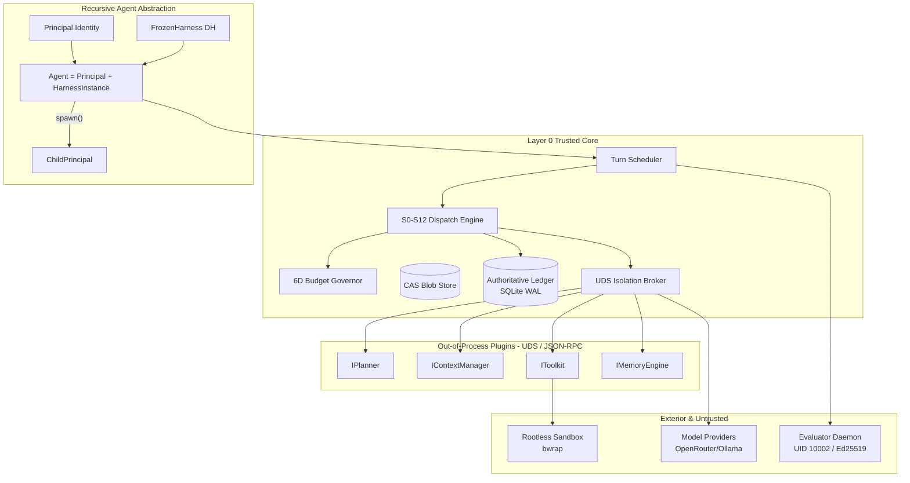

# VANGUARD / AETHER v0.6 — PRINCIPAL ARCHITECT CONCEPT LOCK & ARCHITECTURE PLAN

**Document:** `00_arch_lead_concept_lock_plan_suggestion.md`  
**Role:** Principal Architect / Chief Software Architect — Independent Final Architecture Review  
**Classification:** Normative Architecture Proposal & Concept Lock Recommendation  
**Target Baseline:** Vanguard/AETHER Substrate v0.6.0  
**Evidence Base:** Source inspection of `vanguard/packages/` (22,663 LOC), `layer0/` (4,556 LOC), `test/` (15,000+ LOC), `schemas/`, `tools/`, CI workflows (`.github/workflows/ci.yml`), `docs/SPEC.md`, ADRs 0001–0063, Parecer v4, Full Refactor v3.1, Principal Staff Engineer Proposal, and Tech Lead Gap Audit.  
**Date:** 2026-08-20  

---

## 1. Executive Summary

`[FACT]` Vanguard / AETHER is at a critical juncture. The repository contains two competing implementations of the execution substrate:
1. `vanguard/packages/` (22.6k LOC Python): A mature, tested runtime containing a formally ordered 13-step capability dispatch spine (S0–S12), SQLite WAL event store with monotonic verification, out-of-process Ed25519-signed exterior judge (`EvaluatorDaemon` at UID 10002), rootless bubblewrap sandboxing, and a multi-provider streaming model gateway (`openrouter.py`). However, its modularity is bottlenecked by a 1,418-LOC monolithic composition root (`runtime/root.py`), in-process compile-time adapters, and embedded domain logic.
2. `layer0/` (4.5k LOC Python): An intended microkernel refactor that was created via copy-fork (70%–93% similarity with `vanguard/packages/`), which inadvertently stripped out durability (using in-memory lists), exterior evaluation (hard-coding `verdict: "pass"` at `driver.py:139`), sandbox containment, and multi-turn loops.

`[INFERENCE]` The proposal to build a *third* runtime in Rust alongside `vanguard/packages/` and `layer0/` represents the highest systemic risk to the project. It would create a three-way split-brain state, discarding ~15,000 LOC of verified behavioral tests and locking the engineering team into months of infrastructure reconstruction before delivering product value.

`[ARCHITECTURAL RECOMMENDATION]` The Principal Architect recommends a **Selective Convergence & Strangler Architecture** locked onto Python 3.10+ as the v0.6 canonical substrate:
- **Canonical Substrate:** Converge `layer0/` and `vanguard/packages/` into a single, unified canonical engine (`vanguard/substrate/` or canonical `layer0/`). Salvage the load-bearing assets from `vanguard/packages/` (S0–S12 dispatch, SQLite WAL event store, UID-separated evaluator, bwrap runner, model gateway).
- **Core Abstraction:** Establish the recursive agency primitive:
  $$\text{Agent} = \text{Principal} + \text{HarnessInstance}$$
  $$\text{SubAgent} = \text{ChildPrincipal} + \text{HarnessInstance}$$
  $$\text{MetaAgent} = \text{Principal} + \text{HarnessInstance} + \text{MetaCapabilities}$$
  All agents share the exact same kernel, dispatch spine, and event-sourced ledger. Swarms and teams are scheduling policies, not separate engines.
- **Wire-First Plugin Boundary (G1 Fix):** Replace the in-process Python `typing.Protocol` with a lightweight, wire-first JSON-RPC 2.0 / framed JSON over Unix Domain Sockets (UDS) protocol. The five SPIs (`IPlanner`, `IContextManager`, `IToolkit`, `IMemoryEngine`, `IEvaluationGate`) become wire protocols with handshakes, content-addressed plugin digests, rlimits, and deadlines. Python protocols become client SDK ergonomics, not the architectural boundary.
- **State & Causality:** Authoritative state is strictly $S_t = \text{fold}(E_0 \dots E_t)$. Projections, caches, and execution graphs are pure, disposable derivations. Partial ordering is partitioned by `project_id`.
- **Resource & Concurrency Model:** Enforce the invariant $K \text{ workers} \ll N \text{ logical agents}$. Logical agents are lightweight tuples; workers are bounded OS execution slots. Concurrency is modeled semantically (leases, reservations, read/write selectors) but executed sequentially in v0.6 single-node until behavioral equivalence gates pass.
- **Polyglot & Rust Horizon:** Rust is deferred behind a strictly measured Decision Gate (memory pressure, hot-path CPU >35% in dispatch, or C-extension binding overhead).

---

## 2. Principal Architect Mandate & Independence Statement

`[FACT]` This architecture review serves as the **third, independent architectural authority**, evaluating:
1. The **Principal Staff Engineer Approach** (advocating recursive primitives, AGI by composition, wire-first plugins, but originally leaning toward a new Rust core);
2. The **Independent Tech Lead Approach / Parecer v4** (advocating forensic reality, exposing copy-fork defects F1–F7, demanding convergence over replatforming, and exposing G1–G5 gaps);
3. The **As-Built Repository Truth** and **Normative Intent (`docs/SPEC.md`)**.

`[ARCHITECTURAL RECOMMENDATION]` The Principal Architect's mandate is to establish a **minimal, durable, and falsifiable Concept Lock**. We do not compromise by averaging conflicting ideas; we ground decisions on empirical evidence, mathematical invariants, security boundaries, and operational simplicity.

---

## 3. Evidence and Architecture Evaluation Method

`[FACT]` The evaluation separates evidence into three epistemological tiers:
1. **As-Built Truth:** Executable code, passing/failing tests, CI configurations, and runtime behavior.
2. **Normative Intent:** `docs/SPEC.md`, `docs/04_annex/`, and approved ADRs (0001–0063).
3. **Proposals & Reviews:** Analytical contributions (`Parecer v4`, `Full Refactor v3.1`, `GAP Analysis`) treated as candidate hypotheses.

Every major architectural recommendation in this report is assigned:
- An evidence tag (`[FACT]`, `[INFERENCE]`, `[ARCHITECTURAL RECOMMENDATION]`, `[UNKNOWN]`);
- A priority classification (**P0**, **P1**, **P2**, **P3**, **UNKNOWN/EXPERIMENT**);
- An explicit **Falsification Criterion** defining what measured evidence would prove the decision wrong.

---

## 4. Current System Architecture As-Built

`[FACT]` Inspection of the repository reveals the current structural state:

```
Aether-D-System (Repo Root)
├── vanguard/packages/ (22,663 LOC) [Legacy/Production Truth]
│   ├── domain/       # RFC 8785 JCS, Value Objects, Reducers, Monotonic Ledger
│   ├── kernel/       # S0–S12 Dispatch Engine (1,698 LOC, K-04..K-47 rules)
│   ├── ports/        # Type-erased interfaces (16x Mapping[str, Any])
│   ├── agency/       # Context compiler (L1–L5), Harness manifest compiler
│   ├── runtime/      # Monolithic root.py (1,418 LOC), lab_driver, governance
│   ├── adapters/     # EvaluatorDaemon (UID 10002, Ed25519), SqliteEventStore (WAL),
│   │                 # RootlessSandboxRunner (bwrap), OpenRouter streaming gateway
│   └── apps/coding/  # Embedded coding coordinator, progress engine, coding budget
├── layer0/ (4,556 LOC) [Attempted Microkernel / Copy-Fork]
│   ├── events/       # Canonical JSON, selectors (2-line diff from domain), fold.py
│   ├── kernel/       # Grants, dispatch (70% similarity fork of vanguard/packages/kernel)
│   ├── spi/          # 5 typing.Protocol interfaces, ceiling.py (buggy comparison)
│   ├── registry/     # broker.py (UDS, rlimits, FSM), worker.py (mock fixture F7)
│   ├── scheduler/    # driver.py (hardcoded verdict "pass" F1, sequential loop)
│   └── compose/      # manifest.py, frozen.py
└── test/ (15,000+ LOC)
    ├── layer0/       # 545 LOC (25 tests, 14ms runtime) ← ONLY GATE RUN IN CI
    ├── runtime/      # 6,016 LOC (exercising full stack with SQLite, bwrap)
    ├── contracts/    # 2,720 LOC
    └── agency/       # 2,358 LOC
```

`[INFERENCE]` The current system is in a state of **Partially Migrated, Overlapping Fork Architecture**. Two distinct kernels co-exist with divergent bug fixes and disjoint CI coverage.

---

## 5. Normative Architecture Assessment

`[FACT]` `docs/SPEC.md` (MHF v1) establishes the normative law:
- **A-1 (Microkernel):** Layer 0 provides only event sourcing, effect dispatch, plugin lifecycle, and turn scheduling ($\le 4,500$ LOC).
- **A-2 (Dual Authority):** Capability grants govern agent actions; isolation tiers govern plugin execution.
- **A-3 (Event Provenance):** State is strictly folded from events; unrecorded actions did not occur.
- **A-4 (Contract Truth):** Single schema source of truth via JSON Schema + JCS; generated multi-language bindings.
- **A-5 (Separability Thesis):** Harness is a content-addressed function of manifest and plugin digests: $\text{Harness} = f(\text{manifest}, \text{plugins})$. The judge must be unreachable from the judged.

`[INFERENCE]` While `docs/SPEC.md` is conceptually pristine, actual code diverged:
1. `layer0/` violated A-3 and A-5 by fabricating verdicts and using in-memory non-durable lists.
2. `vanguard/packages/` violated A-1 by bundling the entire coding application and monolithic `root.py` into the core runtime.

---

## 6. Dual-Runtime Assessment

`[FACT]` A file-by-file forensic comparison reveals:
- `layer0/events/selectors.py` vs `vanguard/packages/domain/selectors/resource_selector.py`: 28 identical function definitions, differing only in import statements (2 lines).
- `layer0/kernel/dispatch.py` vs `vanguard/packages/kernel/dispatch.py`: 70.0% lexical similarity.
- `layer0/canonical.py` vs `vanguard/packages/domain/canonicalisation/jcs.py`: 92.8% lexical similarity.
- `vanguard/packages/adapters/store/sqlite_event_store.py`: Full SQLite WAL, `BEGIN IMMEDIATE`, monotonic sequence guards, atomic commit. `layer0/events/sink.py`: `InMemorySink` (Python list).
- `vanguard/packages/adapters/evaluator/daemon.py`: Out-of-process daemon, UID 10002, `SO_PEERCRED`, Ed25519 signature. `layer0/scheduler/driver.py`: hardcoded literal `{"verdict": "pass"}`.
- `vanguard/packages/adapters/sandbox/rootless.py`: Fail-closed bubblewrap (`bwrap`) isolation. `layer0/registry/broker.py`: In-process / subprocess with rlimits only.

```
                    DUAL-RUNTIME CAPABILITY MATRIX
┌──────────────────────────────┬─────────────────────┬──────────────────────┐
│ Capability                   │ vanguard/packages/  │ layer0/ (copy-fork)  │
├──────────────────────────────┼─────────────────────┼──────────────────────┤
│ Durability & Storage         │ SQLite WAL (Mature) │ In-Memory List (F6)  │
│ Exterior Evaluator           │ UID 10002 Daemon    │ Hardcoded "pass" (F1)│
│ Sandbox Isolation            │ Bubblewrap (bwrap)  │ Unenforced rlimits   │
│ Dispatch Spine               │ S0–S12 (K-04..K-47) │ S0–S12 (Partial)     │
│ Model Provider Gateway       │ OpenRouter 896 LOC  │ None                 │
│ Plugin Isolation Broker      │ None (In-process)   │ UDS Broker (308 LOC) │
│ SPI Contracts                │ Mapping[str, Any]   │ typing.Protocol (G1) │
│ CI Verification Suite        │ 15,000 LOC (Unrun)  │ 545 LOC (14ms, F2)   │
└──────────────────────────────┴─────────────────────┴──────────────────────┘
```

`[ARCHITECTURAL RECOMMENDATION]` **Reject the "Rebuild in Rust" proposal.** Reject maintaining two parallel runtimes. Execute **Selective Convergence**:
1. Designate a single unified target tree: `vanguard/substrate/` (or converged `layer0/`).
2. Retain the mature components from `vanguard/packages/` (SQLite WAL event store, S0–S12 dispatch, `EvaluatorDaemon`, `RootlessSandboxRunner`, `openrouter.py`).
3. Retain the broker FSM and clean SPI definitions from `layer0/`.
4. Break `vanguard/packages/runtime/root.py` into distinct modules: `compiler`, `session`, `ledger_bridge`, and `orchestrator`.
5. Eradicate duplicate code; delete the legacy tree only when the convergence gates pass.

---

## 7. Architectural Minimalism / Microkernel Assessment

`[ARCHITECTURAL RECOMMENDATION]` The Trusted Computing Base (TCB) must be strictly minimal.

### Included in Trusted Core (Layer 0)
1. **Event Sourcing & Canonicalization:** RFC 8785 JCS, hash-chain verification, append-only ledger store, and core state fold reducers.
2. **Identity & Authority:** Principal ID generation, cryptographic capability grants, attenuation lattice, and lease issuance.
3. **Effect Mediation Engine:** The formal S0–S12 dispatch spine, pre-dispatch intent logging, and post-dispatch receipt verification.
4. **Resource Conservation Governor:** Multi-dimensional budget reservation (`usd_micros`, `millis`, `tokens`, `bytes`, `turns`, `depth`), pre-call worst-case lock, and reality reconciliation.
5. **Plugin Lifecycle & Isolation Host:** UDS listener, process supervisor, heartbeat monitor, and capability-constrained transport broker.
6. **Basic Turn Scheduler:** Single-node deterministic state machine coordinating agent turns, pause, resume, and cancellation.

### Excluded from Trusted Core (Moved to Plugins / Packs)
- Planners, reasoning loops, tree search, ReAct drivers.
- Context managers, AST indexers, Tree-sitter repo maps, summarizers.
- Memory engines (vector stores, semantic graphs, episodic stores).
- Domain-specific tools (file editing, shell execution, git ops, linters).
- Model routing strategies, prompt templates, few-shot selectors.
- Evaluators and benchmark oracles (remain external processes).
- Multi-agent coordination policies, swarm protocols, market bidding.
- Self-improvement, Meta-Harness mutation generators.

---

## 8. Canonical Concept Model

`[ARCHITECTURAL RECOMMENDATION]` The 38 candidate concepts evaluated across the repository:

| Concept | Status | Architectural Role & Definition |
|---|---|---|
| **Event** | `KEEP` | Authoritative, immutable record of fact; JCS-canonical, hash-chained. |
| **EffectRequest** | `MERGE` | Unified data type representing intent to execute an effect across kernel boundary. |
| **Receipt** | `KEEP` | Proof of effect execution, duration, exit code, resource consumption, and output hash. |
| **Artifact** | `KEEP` | Content-addressed, immutable data blob stored in CAS. |
| **ArtifactRef** | `KEEP` | Strongly-typed reference (`digest`, `media_type`, `byte_length`) to an Artifact. |
| **Principal** | `KEEP` | Cryptographic identity and security subject (root agent, subagent, human, operator). |
| **Agent** | `REFINE` | Logical construct: $\text{Agent} = \text{Principal} + \text{HarnessInstance}$. |
| **Harness** | `KEEP` | Pure declarative specification (manifest) of an agent's configuration and plugin refs. |
| **FrozenHarness** | `KEEP` | Content-addressed, immutable compiled composition of a Harness ($D_H$). |
| **HarnessInstance**| `KEEP` | Runtime state and active execution context of a `FrozenHarness`. |
| **Episode** | `KEEP` | Bounded, single-turn or multi-turn unit of execution for an Agent. |
| **Project** | `KEEP` | Boundary of consistency, authorization, storage, and causal event streams. |
| **Task** | `MERGE` | Application-level unit of work; represented as Project metadata or Plugin state. |
| **Plugin** | `KEEP` | Out-of-process extension implementing one of the 5 SPIs behind UDS wire boundary. |
| **Skill** | `GENERALIZE`| Pure data prompt/tool package loaded by an `IToolkit` or `IContextManager` plugin. |
| **Memory** | `REFINE` | Plugin-managed store (`IMemoryEngine`); derived from event stream or external store. |
| **Context** | `REFINE` | Prefix-stable prompt/token representation compiled by `IContextManager`. |
| **Tool** | `REFINE` | Individual capability exposed by an `IToolkit` plugin via JSON Schema. |
| **Toolkit** | `KEEP` | `IToolkit` SPI exposing tool schemas, pre-flight checks, and effect execution. |
| **Model** | `REFINE` | External inference endpoint wrapped by an adapter or plugin behind streaming API. |
| **Evaluator** | `KEEP` | Independent, out-of-process oracle producing cryptographically signed Verdicts. |
| **Verdict** | `KEEP` | Signed attestation (`pass`, `fail`, `score`, metrics) issued by an Evaluator. |
| **Ledger** | `KEEP` | Authoritative, append-only event store (SQLite WAL in v0.6). |
| **CAS** | `KEEP` | Content-Addressed Storage for large blobs, tool payloads, and artifacts. |
| **Cache** | `REFINE` | Disposable, non-authoritative acceleration layer: $C = g(\text{Ledger}, \text{CAS})$. |
| **Projection** | `KEEP` | Pure functional fold over event stream: $P = \text{fold}(\text{Events})$. |
| **Scheduler** | `REFINE` | Single-node turn dispatch engine coordinating execution turns and leases. |
| **Orchestrator** | `REFINE` | High-level coordinator managing multi-harness dependencies and task graph. |
| **Lease** | `KEEP` | Time-bounded, revocable execution grant for a worker or resource. |
| **Reservation** | `KEEP` | Pre-allocated budget block across 6 dimensions preventing overruns. |
| **Budget** | `KEEP` | Hierarchical resource limit: $\text{Budget}_{\text{child}} \le \text{RemainingBudget}_{\text{parent}}$. |
| **Capability** | `KEEP` | Attenuated permission token granting access to specific resource selectors. |
| **Spawn** | `KEEP` | Primitive creating child principal: $\text{spawn}(\text{parent}, \text{harness}, \text{caps}, \text{budget})$. |
| **ChildPrincipal** | `KEEP` | Principal created via `spawn`, inheriting strictly attenuated capabilities. |
| **Trajectory** | `KEEP` | Attributable dataset record: $(D_H, D_R, \text{Events}, \text{Verdict})$. |
| **Experiment** | `KEEP` | Structured evaluation run comparing candidate harness against baseline. |
| **Promotion** | `KEEP` | Governance decision moving candidate harness/plugin to canonical baseline. |
| **Meta-Harness** | `GENERALIZE`| The framework capability to compile, evaluate, and evolve Harnesses as data. |

---

## 9. Recommended Concept Lock

`[ARCHITECTURAL RECOMMENDATION]` The Concept Lock for v0.6 establishes the following immutable primitives:



---

## 10. Recursive Agency / Multi-Agent Architecture

`[ARCHITECTURAL RECOMMENDATION]` The core execution model is recursive and uniform across all agent variants:

$$\text{Agent} = \langle \text{Principal}, \text{FrozenHarness}, \text{Capabilities}, \text{Budget}, \text{State} \rangle$$

### Primitive Operation: `spawn`
```python
def spawn(
    parent: Principal,
    harness: FrozenHarness,
    capabilities: Set[CapabilityGrant],
    budget: BudgetReservation,
    causation_id: EventId,
) -> ChildPrincipal:
    ...
```

### Invariants:
1. **Capability Attenuation:**
   $$\text{Capabilities}(\text{ChildPrincipal}) \subseteq \text{Capabilities}(\text{parent})$$
   A child agent cannot possess any permission or resource selector not held by its parent.
2. **Budget Conservation:**
   $$\text{Budget}(\text{ChildPrincipal}) \le \text{RemainingBudget}(\text{parent})$$
   Spawning locks child budget from parent allocation. Child termination refunds unused budget.
3. **Identity Lineage:** Every child event carries `principal_id`, `parent_principal_id`, `project_id`, `episode_id`, and `causation_id`.
4. **Uniformity:** Root agents, specialist subagents, critics, coding agents, and swarm workers use the identical execution loop and kernel dispatch. Differences are purely manifest data ($D_H$).

---

## 11. Orchestrator Architecture

`[ARCHITECTURAL RECOMMENDATION]` The Orchestrator is **not** a stateful monolithic engine. It is a disposable coordination process operating over the authoritative Ledger.

```
Decision (Orchestrator) ──> Durable Event (Ledger) ──> Reducer ──> Effective State
```

- **Separation of Concerns:**
  - **State Authority:** The Ledger (SQLite WAL).
  - **Resource Authority:** The Kernel Budget Governor & Lease Manager.
  - **Decision Logic:** Pluggable orchestration policies (e.g., DAG scheduler, blackboard, map-reduce coordinator) running as unprivileged workers.
- **Fault Recovery:** If an orchestrator process crashes, a new instance restarts by folding the project's event stream. Active leases expire via heartbeats; uncompleted tasks are re-dispatched.

---

## 12. Event Sourcing / Ledger / State Architecture

`[ARCHITECTURAL RECOMMENDATION]` The state architecture follows strict functional event sourcing:

$$\text{State}_t = \text{fold}(\text{Events}_0 \dots \text{Events}_t)$$

```
                               ┌─────────────────────────┐
                               │  Authoritative Ledger   │
                               │  (SQLite WAL, JCS RFC)  │
                               └────────────┬────────────┘
                                            │
                    ┌───────────────────────┼───────────────────────┐
                    ▼                       ▼                       ▼
          ┌───────────────────┐   ┌───────────────────┐   ┌───────────────────┐
          │    Projections    │   │  Execution Graph  │   │  Ephemeral Cache  │
          │ (Read Models/FSM) │   │ (Causal C-DAG)    │   │ (KV / AST Index)  │
          └───────────────────┘   └───────────────────┘   └───────────────────┘
```

- **Ledger Invariants:**
  - Strict monotonic sequencing per `project_id`.
  - Cryptographic hash chaining: $H_i = \text{SHA256}(H_{i-1} \,\|\, \text{JCS}(E_i))$.
  - Atomic transaction: Event append + CAS blob commit must be atomic.
- **Replay Classes:**
  - **Class 1 (State Replay):** $S_t = \text{fold}(E_0 \dots E_t)$ is 100% deterministic and provable in CI.
  - **Class 2 (Fixture Replay):** Deterministic execution replaying cached model/tool cassettes.
  - **Class 3 (Live Re-execution):** Non-deterministic re-execution against live external models and networks.

---

## 13. Causality & Execution Graph Architecture

`[ARCHITECTURAL RECOMMENDATION]` The Execution Graph is an **Event-Derived Projection**, not an active workflow execution engine.

- **Causal Axes:** Every event records:
  - `event_id`: Unique content-addressed digest.
  - `causation_id`: ID of the event that directly triggered this event.
  - `correlation_id`: ID of the root request / user command.
  - `principal_id` & `parent_principal_id`: Agent delegation hierarchy.
- **Graph Storage:** No graph database (Neo4j, etc.) is permitted in Layer 0. Graph queries are satisfied via SQLite recursive CTEs over `causation_id` and `parent_principal_id`.

---

## 14. Identity Architecture

`[ARCHITECTURAL RECOMMENDATION]` Establish the three-digest identity framework for scientific attribution and reproducibility:

```
               ┌────────────────────────────────────────────────────────┐
               │              TRIPLE-DIGEST IDENTITY FRAMEWORK          │
               └────────────────────────────────────────────────────────┘
                                            │
        ┌───────────────────────────────────┼───────────────────────────────────┐
        ▼                                   ▼                                   ▼
┌───────────────────────────────┐ ┌───────────────────────────────┐ ┌───────────────────────────────┐
│     Harness Identity (DH)     │ │    Execution Identity (DR)    │ │  Experiment Cell Identity (DX)│
│ Manifest + Plugin Hashes +    │ │ Model Endpoint + Weights +    │ │ Task Digest + Ground Truth +  │
│ Tool Schemas + Prompts        │ │ Temperature + Seed + Prompt   │ │ Evaluation Oracle Code Hash   │
└───────────────────────────────┘ └───────────────────────────────┘ └───────────────────────────────┘
```

- **Harness Digest ($D_H$):** $D_H = \text{SHA256}(\text{JCS}(\text{Manifest}) \,\|\, \sum \text{PluginDigests})$. Changes when code, prompts, or tool schemas change.
- **Execution Digest ($D_R$):** Captures runtime conditions (model ID, temperature, sampling parameters, seed, environment flags).
- **Experiment Digest ($D_X$):** Binds the evaluation tuple: $D_X = \text{SHA256}(D_H \,\|\, D_R \,\|\, \text{TaskDigest} \,\|\, \text{OracleDigest})$.
- **Attribution Invariant:** A benchmark claim is valid if and only if all three digests are recorded in the event stream alongside the signed verdict.

---

## 15. Plugin Architecture

`[ARCHITECTURAL RECOMMENDATION]` Adopt the **Five-SPI Plugin-First Architecture**:

1. `IPlanner`: Generates proposed plans, next turns, and effect intents given an episode context.
2. `IContextManager`: Compiles, token-budgets, and compresses prefix-stable prompt contexts (L1–L5), including AST repo maps.
3. `IToolkit`: Exposes domain tools, executes sandboxed actions, and validates effect parameters.
4. `IMemoryEngine`: Manages episodic, semantic, and long-term memory retrieval and persistence.
5. `IEvaluationGate`: Requests and verifies exterior evaluations, providing signed verdicts.

All product features (coding agent, data analysis, research agent) exist exclusively as **Packs** containing plugins implementing these five SPIs.

---

## 16. Plugin Contract / Polyglot Architecture

`[ARCHITECTURAL RECOMMENDATION]` Resolve Gap **G1** with a **Wire-First Plugin Boundary**:

```
┌─────────────────────────────────────────────────────────────────────────────┐
│                             LAYER 0 SUBSTRATE                               │
│  ┌─────────────────────────┐                   ┌─────────────────────────┐  │
│  │    Plugin Client SDK    │                   │   UDS Broker Host FSM   │  │
│  │ (Python Protocol Facade)│                   │ (Process Supervisor)    │  │
│  └────────────┬────────────┘                   └────────────▲────────────┘  │
└───────────────┼─────────────────────────────────────────────┼───────────────┘
                │ Unix Domain Socket (UDS) / Framed JSON-RPC  │
                ▼                                             ▼
┌─────────────────────────────────────────────────────────────────────────────┐
│                          OUT-OF-PROCESS PLUGIN                              │
│  ┌───────────────────────────────────────────────────────────────────────┐  │
│  │ Language: Python / TypeScript / Rust / Go / WASM                      │  │
│  │ 1. Handshake: Protocol Version + Plugin Digest Negotiation            │  │
│  │ 2. Lifecycle: Load -> Init -> Ready -> Execute -> Quiesce -> Shutdown  │  │
│  │ 3. Enforcement: Wall-clock Deadline, OS rlimits, Process Isolation    │  │
│  └───────────────────────────────────────────────────────────────────────┘  │
└─────────────────────────────────────────────────────────────────────────────┘
```

- **Wire Specification:** Line-delimited JSON-RPC 2.0 or length-prefixed binary JSON over Unix Domain Sockets (UDS).
- **Polyglot Portability:** Plugins can be implemented in Python, Rust, Go, TypeScript, or WebAssembly without core changes.
- **Language Strategy:** Layer 0 remains 100% Python 3.10+ in v0.6. Rust plugins are welcomed as unprivileged out-of-process workers.

---

## 17. Evaluator / Evidence Architecture

`[ARCHITECTURAL RECOMMENDATION]` Enforce the **Separability & Exteriority Axiom**:

> *"What solved the task must be separable from what judged the task, and the judge must remain cryptographically and physically unreachable from the judged."*

- **Physical Isolation:** The `EvaluatorDaemon` runs in a separate process under a distinct Unix UID (e.g., UID 10002) communicating over a restricted UDS socket with `SO_PEERCRED` validation.
- **Cryptographic Attestation:** Every verdict is signed using Ed25519 private keys held exclusively by the Evaluator process.
- **Unreachable Oracle:** The agent execution sandbox has no network route, filesystem access, or IPC permission to the evaluator daemon or private key.
- **Eradication of F1:** The scheduler accepts only cryptographically verified verdicts. A hardcoded `"pass"` string is rejected as an invalid signature.

---

## 18. Resource Architecture

`[ARCHITECTURAL RECOMMENDATION]` Decouple logical agents from heavy OS execution workers:

$$K \text{ active workers} \ll N \text{ logical agents}$$

```
  Logical Agents (N = 10,000)               Execution Workers (K = 16)
┌──────────────────────────────┐          ┌────────────────────────────┐
│ Agent 1 (ID, State, Context) │──┐       │ Worker Pool #1 (bwrap proc)│
├──────────────────────────────┤  │       ├────────────────────────────┤
│ Agent 2 (ID, State, Context) │──┼──────>│ Worker Pool #2 (bwrap proc)│
├──────────────────────────────┤  │       ├────────────────────────────┤
│ ...                          │  │       │ Worker Pool #K (bwrap proc)│
├──────────────────────────────┤  │       └────────────────────────────┘
│ Agent N (ID, State, Context) │──┘
└──────────────────────────────┘
```

- **Logical Agent State:** Pure in-memory tuple ($\sim 2$ KB) persisted in SQLite.
- **Execution Worker Pool:** Bounded pool ($K \in [4, 64]$) of sandboxed worker processes.
- **6-Dimensional Resource Allocation:**
  $$\text{Reservation} = \langle \text{usd\_micros}, \text{millis}, \text{tokens}, \text{bytes}, \text{turns}, \text{depth} \rangle$$
- **Pre-Call Worst-Case Lock:** Before dispatching an inference or tool effect, the maximum potential budget is locked. On receipt, the exact consumed amount is debited and the remainder unlocked.

---

## 19. Concurrency Architecture

`[ARCHITECTURAL RECOMMENDATION]` Implement a **Two-Phase Concurrency Strategy**:

### Phase 1 (v0.6 Foundation Lock): Semantic Concurrency, Sequential Dispatch
- Model all concurrency primitives in the event schema: Leases, Reservations, Read/Write Selectors, and Independence Groups.
- Execute turns sequentially on a single-node deterministic scheduler. This avoids race conditions during initial convergence while ensuring all event streams are concurrency-ready.

### Phase 2 (v0.7 Scale): Multi-Threaded / Multi-Worker Concurrency
- Activate parallel worker execution only when:
  1. Selector disjointness proofs pass ($R(A) \cap W(B) = \emptyset$ and $W(A) \cap W(B) = \emptyset$).
  2. Transactional SQLite retry loops (`BEGIN IMMEDIATE`) with exponential backoff pass stress tests.
  3. No distributed engines (Kubernetes, Celery, NATS) are introduced into Layer 0.

---

## 20. Authority & Security Architecture

`[ARCHITECTURAL RECOMMENDATION]` Dual-Axis Security Model:

```
                                 SECURITY ARCHITECTURE
┌────────────────────────────────────────┬────────────────────────────────────────┐
│      Agent Authority Axis (Kernel)     │      Plugin Authority Axis (Broker)    │
├────────────────────────────────────────┼────────────────────────────────────────┤
│ • Cryptographic Capability Grants      │ • Process Isolation (Separate PID)     │
│ • Attenuation Lattice (Child <= Parent)│ • OS rlimits (CPU, Memory, File Descr) │
│ • 6-Dimensional Budget Locks           │ • Rootless Bubblewrap Sandbox (bwrap)  │
│ • Pre-Dispatch S0–S12 Validation       │ • Fail-Closed Network & FS Namespaces  │
│ • Ephemeral Leases & Revocation Hooks  │ • Content-Addressed Digest Validation  │
└────────────────────────────────────────┴────────────────────────────────────────┘
```

### Concept Lock Security Rules:
1. **Fail-Closed Sandbox:** If `bwrap` is missing on Linux, production effect dispatch fails immediately (`CompositionError`).
2. **Intent-Before-Effect (S8a / K-47):** The intent event is fsynced to the ledger *before* invoking external tool processes.
3. **No Unsigned Verdicts:** The scheduler rejects any verdict lacking a valid Ed25519 signature from UID 10002.

---

## 21. Meta-Harness & Self-Improvement Architecture

`[ARCHITECTURAL RECOMMENDATION]` The Meta-Harness is the capability of the substrate to evaluate, mutate, and promote harnesses as pure data:

```
[Baseline Harness H0] ──> Execution ──> Trajectory (Events + Verdict)
                                                │
                                                ▼
[Candidate Harness H1] <── Mutation Plugin <── Analysis & Discovery
         │
         ▼
[Paired Experimentation] (McNemar Paired Test vs A/A Floor)
         │
         ▼
[External Evaluation] (UID 10002 Daemon - Ed25519 Signed)
         │
         ▼
[Promotion / Rejection Gate] (ADR-0060 Governance)
```

### Self-Improvement Scope Boundaries:
- **Permitted in v0.6+:** Prompt optimization, context strategy tuning, memory index configuration, skill synthesis, and few-shot exemplar discovery.
- **Forbidden in Autonomous Loop:** Direct modification of Layer 0 kernel code, security verification rules, or evaluation oracles. Core code updates require human review and Git pull requests.

---

## 22. Domain Generality Assessment

`[ARCHITECTURAL RECOMMENDATION]` The **Domain Generality Invariant (I-7)**:

> *"The addition of a new domain pack (e.g., Data Science, Web Research, Cybersecurity, Bio-informatics) must require exactly zero modifications to Layer 0 code."*

```
                           DOMAIN GENERALITY MODEL
┌─────────────────────────────────────────────────────────────────────────────┐
│                           LAYER 0 KERNEL SUBSTRATE                          │
│               (Domain-Agnostic: Events, Dispatch, Budget, SPI)               │
└──────────────────────────────────────┬──────────────────────────────────────┘
                                       │
        ┌──────────────────────────────┼──────────────────────────────┐
        ▼                              ▼                              ▼
┌───────────────┐              ┌───────────────┐              ┌───────────────┐
│  Coding Pack  │              │ Research Pack │              │ Data Analysis │
│ (Patch, AST,  │              │ (Web Search,  │              │ (Pandas, SQL, │
│  Git, Linter) │              │  Arxiv, RAG)  │              │  Plot, Stats) │
└───────────────┘              └───────────────┘              └───────────────┘
```

`[FACT]` Moving `vanguard/packages/apps/coding/` out of the core into `packs/code-default/` satisfies this requirement immediately.

---

## 23. Migration Architecture

`[ARCHITECTURAL RECOMMENDATION]` Adopt a **Strangler-Faceted Selective Convergence** strategy:

```
┌─────────────────────────────────────────────────────────────────────────────┐
│                               MIGRATION PLAN                                │
├─────────────────────────────────────────────────────────────────────────────┤
│ Step 1: Create canonical target tree `vanguard/substrate/` (or `layer0/`).   │
│ Step 2: Port load-bearing components from `vanguard/packages/`:             │
│         - S0–S12 dispatch spine + K-rules (`kernel/dispatch.py`)            │
│         - SQLite WAL Event Store with monotonic guard (`SqliteEventStore`)   │
│         - EvaluatorDaemon (UID 10002, Ed25519) + Rootless Sandbox (bwrap)   │
│         - OpenRouter multi-provider streaming gateway                       │
│ Step 3: Integrate clean assets from `layer0/`:                              │
│         - UDS Broker host & worker FSM (`registry/broker.py`)               │
│         - Unified Event Taxonomy & JCS Envelopes                            │
│ Step 4: Refactor `runtime/root.py` into modular components.                 │
│ Step 5: Extract `apps/coding/` into `packs/code-default/`.                  │
│ Step 6: Run full test suite (15,000 LOC); establish unified CI.             │
│ Step 7: Deprecate and remove redundant legacy packages.                     │
└─────────────────────────────────────────────────────────────────────────────┘
```

---

## 24. CI / Verification Architecture

`[ARCHITECTURAL RECOMMENDATION]` Eradicate Goodharted and lexical CI gates (F2). Adopt the **Behavioral Verification Matrix**:

| Gate Name | Current Status | Flaw / Vulnerability | Required Behavioral Gate |
|---|---|---|---|
| **E-COV** | Lexical Grep | Passes on string literals (F2) | Mutation test: Assert failure if an event kind is removed from production execution path. |
| **TCB-LOC** | LOC count ceiling | Incentivizes obfuscated code | Boundary import checker + cyclomatic complexity gates. |
| **Verdict Gate**| Mocked in layer0 | Fabricates `verdict: "pass"` (F1) | Cryptographic signature verification with invalid/tampered key failure tests. |
| **Sandbox Gate**| Unenforced rlimits| Fails open if bwrap missing | Fail-closed assert: `CompositionError` raised when isolated runner is requested without bwrap. |
| **Suite Scope** | 25 tests in CI | Skips 15,000 LOC of real tests | Full test suite (`pytest test/`) execution in CI matrix. |

---

## 25. What Should Remain in the Trusted Core

`[ARCHITECTURAL RECOMMENDATION]`
1. `kernel/dispatch.py`: S0–S12 formal capability dispatch spine.
2. `kernel/grants.py`: Attenuation, lease, and capability verification.
3. `kernel/governor.py`: 6-dimensional budget reservation and reconciliation.
4. `events/store.py`: SQLite WAL ledger with monotonic sequence locking.
5. `events/canonical.py`: RFC 8785 JSON Canonicalization Scheme (JCS).
6. `events/fold.py`: Authoritative state fold reducers.
7. `registry/broker.py`: UDS broker host managing out-of-process plugin lifecycles.
8. `scheduler/engine.py`: Single-node turn scheduler and episode lifecycle controller.

---

## 26. What Should Become Replaceable / Plugin-Based

`[ARCHITECTURAL RECOMMENDATION]`
1. **Planners & Reasoning:** Tree-search, ReAct loops, Reflexion, Chain-of-Thought (`IPlanner`).
2. **Context Compilation:** L1–L5 context assemblers, Tree-sitter repo maps, summarizers (`IContextManager`).
3. **Tool Execution:** File systems, AST patchers, shell execution, linters (`IToolkit`).
4. **Memory Systems:** Vector databases, knowledge graphs, episodic caches (`IMemoryEngine`).
5. **Evaluation Oracles:** Benchmark runners, unit test runners, syntax checkers (`IEvaluationGate`).
6. **Model Gateways:** Provider adapters (OpenRouter, Anthropic, Ollama, DeepSeek).
7. **Domain Packages:** All coding, research, data science workflows (`packs/*`).

---

## 27. What I Would Preserve

`[ARCHITECTURAL RECOMMENDATION]`
1. **The S0–S12 Capability Dispatch Spine:** Each rule (K-04..K-47) encodes a real production defect.
2. **RFC 8785 JCS Canonicalization & Golden Vectors:** Byte-level determinism across languages.
3. **The Exterior Evaluator Daemon (UID 10002 + Ed25519):** Genuine anti-reward-hacking architecture.
4. **The SQLite WAL Event Store:** Industrial durability, atomic transactions, and crash-resilient replay.
5. **Declarative Manifests as Data:** The embryonic Meta-Harness foundation.
6. **The Paired Statistical Measurement Lab:** McNemar testing, A/A floors, and preregistration.

---

## 28. What I Would Change

`[ARCHITECTURAL RECOMMENDATION]`
1. **Convert SPIs from In-Process Python Protocols to UDS Wire Protocols (G1 Fix).**
2. **Decompose the 1,418-LOC `runtime/root.py` Monolith into Focused Subsystems.**
3. **Extract Embedded Coding Logic from Core into `packs/code-default/`.**
4. **Upgrade Turn Driver from Single-Turn to a Real Multi-Turn Episode Loop (G3 Fix).**
5. **Replace Lexical CI Gates with Mutation-Resistant Behavioral Contract Tests.**
6. **Activate the Full 15,000-LOC Test Suite in GitHub Actions CI.**

---

## 29. What I Would Remove / Reject

`[ARCHITECTURAL RECOMMENDATION]`
1. **REJECT: Building a Third Runtime in Rust for v0.6.**
2. **REMOVE: In-Memory Event Sinks (`InMemorySink`) as production paths.**
3. **REMOVE: Synthetic / Hardcoded Verdict Emitters in the Scheduler.**
4. **REMOVE: Duplicate Implementations of Resource Selectors and Canonicalization.**
5. **REMOVE: Committed Binary Databases (`lam.sqlite`) and Raw Run Transcripts in Git.**
6. **REMOVE: The 14-Tier Cosmological / Biological Taxonomy from Normative Specs.**

---

## 30. What I Would Explicitly Defer

`[ARCHITECTURAL RECOMMENDATION]`
1. **DEFER: Rust Core Re-implementation** (behind empirical Decision Gate).
2. **DEFER: Multi-Node Distributed Clustering** (NATS, Raft, Kubernetes, gRPC mesh).
3. **DEFER: Concurrent Multi-Threaded Dispatch Execution** (maintain sequential execution in v0.6).
4. **DEFER: Autonomous Self-Modifying Code Pipelines.**
5. **DEFER: Vector / Graph Database Integration into Layer 0.**

---

## 31. P0 Architectural Decisions (Must Lock Before Development)

`[ARCHITECTURAL RECOMMENDATION]`
- **P0-1:** Establish Python 3.10+ as the canonical v0.6 substrate; execute Selective Convergence between `vanguard/packages/` and `layer0/`.
- **P0-2:** Lock the Recursive Agent Primitive: $\text{Agent} = \text{Principal} + \text{HarnessInstance}$ via uniform `spawn()`.
- **P0-3:** Lock the Wire-First Plugin Boundary: 5 SPIs over UDS / JSON-RPC 2.0.
- **P0-4:** Lock the Event-Sourced Authority: $S_t = \text{fold}(E_0 \dots E_t)$ with SQLite WAL and monotonic sequence guards.
- **P0-5:** Lock the Separability & Exterior Evaluator Axiom: Exterior UID 10002 daemon + Ed25519 signed verdicts.
- **P0-6:** Lock the Domain-Agnostic Core Invariant: Zero core code changes for new domain packs.

---

## 32. P1 Lock-or-Defer Decisions

`[ARCHITECTURAL RECOMMENDATION]`
- **P1-1 (Triple-Digest Identity):** `LOCK NOW` — Standardize $D_H$ (Harness), $D_R$ (Runtime), $D_X$ (Experiment).
- **P1-2 (6-Dimensional Budget Governor):** `LOCK NOW` — Enforce pre-call locks across USD, time, tokens, bytes, turns, depth.
- **P1-3 (Fail-Closed Bubblewrap Sandbox):** `LOCK NOW` — Enforce strict isolation for tool execution.
- **P1-4 (Multi-Threaded Concurrent Dispatch):** `DEFER DELIBERATELY` — Keep single-node sequential in v0.6; enable in v0.7.
- **P1-5 (Protobuf Wire Optimization):** `DEFER DELIBERATELY` — JSON-RPC / JCS is sufficient for v0.6.

---

## 33. P2 Implementation Choices (Replaceable)

`[ARCHITECTURAL RECOMMENDATION]`
- Local SQLite index caching algorithms.
- AST parsing library choices (Tree-sitter vs native ast).
- Specific CLI formatting, terminal colors, and UX output rendering.
- Specific LLM provider client SDK wrappers (LiteLLM vs custom httpx).

---

## 34. P3 Research Topics

`[ARCHITECTURAL RECOMMENDATION]`
- Autonomous Meta-Harness genetic mutation algorithms.
- Emergent multi-agent market-based compute allocation.
- Cross-domain transfer learning of agent context strategies.
- Formal verification of capability attenuation lattices using SMT solvers.

---

## 35. Unknowns / Experiments Required

`[UNKNOWN]`
1. **UDS Wire-First IPC Latency Overhead:** Benchmark roundtrip overhead of JSON-RPC over UDS vs in-process Python calls (Target: $<1.5\text{ms}$ per invocation).
2. **Context Compression Token Efficiency:** Measure AST-aware repo maps vs naive sliding window across SWE-bench Lite.
3. **SQLite WAL Concurrency Throughput:** Stress test `BEGIN IMMEDIATE` lock contention under simulated 16-worker loads.

---

## 36. Principal Staff Proposal Review

`[ARCHITECTURAL RECOMMENDATION]`
- **Recursive Agency Thesis ($\text{Agent} = \text{Principal} + \text{HarnessInstance}$):** `AGREE`. Brilliant unifying abstraction that eliminates redundant agent engines.
- **Microkernel Boundary & Domain Blindness:** `AGREE`. Clean separation of concerns.
- **Initial Proposal to Rewrite in Rust:** `DISAGREE` (Replaced by conditional deferral). Rewriting in Rust now would incur massive migration delay.
- **Wire-First Plugin Architecture:** `AGREE`. Essential for genuine polyglot extensibility.
- **Epistemic Goodhart Analysis:** `AGREE`. Vital critique of proxy metrics.

---

## 37. Independent Tech Lead Proposal Review

`[ARCHITECTURAL RECOMMENDATION]`
- **Forensic Diagnosis of Copy-Fork & Defects (F1–F7):** `AGREE`. Pinpoint factual diagnosis.
- **Five Critical Architectural Gaps (G1–G5):** `AGREE`. Highlights necessary operational deliverables.
- **Convergence Strategy over Replatforming:** `AGREE`. The most pragmatic, cost-effective path to v0.6.
- **Decomposition of `runtime/root.py` Monolith:** `AGREE`. Critical for real modularity.

---

## 38. Three-Way Agreement / Disagreement Matrix

```
┌────────────────────────────┬──────────────────┬──────────────────┬──────────────────┬──────────────────────┐
│ Dimension                  │ Principal Staff  │ Tech Lead / v4   │ Principal Arch   │ Final Consensus Code │
├────────────────────────────┼──────────────────┼──────────────────┼──────────────────┼──────────────────────┤
│ Target Substrate Language  │ Python (Rust def)│ Python 3.10+     │ Python 3.10+     │ FULL AGREEMENT       │
│ Migration Strategy         │ Hybrid Converge  │ Converge Legacy  │ Selective Converg│ FULL AGREEMENT       │
│ Rust Horizon               │ Decision Gate    │ Deferred         │ Decision Gate    │ FULL AGREEMENT       │
│ Agent Conceptual Model     │ Recursive Model  │ Practical Worker │ Recursive Model  │ FULL AGREEMENT       │
│ Microkernel Scope          │ 4 Core Semantics │ Core + Broker    │ 4 Core Semantics │ FULL AGREEMENT       │
│ Plugin Boundary            │ Wire-First UDS   │ Wire-First JSON  │ Wire-First UDS   │ FULL AGREEMENT       │
│ Number of SPIs             │ 5 SPIs           │ 5 SPIs           │ 5 SPIs           │ FULL AGREEMENT       │
│ Evaluator Separation       │ External Process │ UID 10002 Daemon │ UID 10002 Daemon │ FULL AGREEMENT       │
│ Event Sourcing Authority   │ State = fold(E)  │ Authoritative WAL│ State = fold(E)  │ FULL AGREEMENT       │
│ Durability Implementation  │ SQLite WAL       │ SQLite WAL       │ SQLite WAL       │ FULL AGREEMENT       │
│ Orchestrator Model         │ Event Reducer    │ Multi-Harness Host Event Reducer    │ FULL AGREEMENT       │
│ Concurrency in v0.6        │ Single-Node Seq  │ Single-Node Seq  │ Single-Node Seq  │ FULL AGREEMENT       │
│ Resource Allocation Model  │ 6-Dim Budget     │ Leases & Limits  │ 6-Dim Budget     │ FULL AGREEMENT       │
│ Sandbox Technology         │ Rootless bwrap   │ Rootless bwrap   │ Rootless bwrap   │ FULL AGREEMENT       │
│ Domain Independence        │ Domain Blind     │ Pack Extraction  │ Domain Blind Pack│ FULL AGREEMENT       │
│ CI Verification Strategy   │ Anti-Goodhart    │ Full Test Suite  │ Behavioral Matrix│ FULL AGREEMENT       │
│ Meta-Harness Scope         │ Phase 2 Plugin   │ Phase 2 Research │ Phase 2 Plugin   │ FULL AGREEMENT       │
└────────────────────────────┴──────────────────┴──────────────────┴──────────────────┴──────────────────────┘
```

---

## 39. Recommended Concept Lock Sequence

```
┌─────────────────────────────────────────────────────────────────────────────┐
│                       RECOMMENDED CONCEPT LOCK SEQUENCE                     │
├─────────────────────────────────────────────────────────────────────────────┤
│ 1. CONCEPT LOCK APPROVAL: Formal sign-off on this document.                 │
│ 2. SPECIFICATION CONSOLIDATION: Update `docs/SPEC.md` reflecting converged  │
│    architecture; archive dead specs and temporary proposals.                │
│ 3. CONVERGENCE SPRINT: Merge `vanguard/packages/` & `layer0/` into canonical │
│    substrate; salvage WAL, bwrap, evaluator, and UDS broker.                │
│ 4. WIRE-FIRST PLUGIN RUNTIME: Implement UDS JSON-RPC broker for the 5 SPIs. │
│ 5. RECURSIVE AGENT ENGINE: Implement unified `spawn()` and turn loop.       │
│ 6. CODING PACK EXTRACTION: Move coding tools and AST patcher to packs/.     │
│ 7. BEHAVIORAL GATES ACTIVATION: Run full 15k LOC test suite in CI.          │
│ 8. PRODUCT DEVELOPMENT RESUMPTION: Feature development on clean substrate.  │
└─────────────────────────────────────────────────────────────────────────────┘
```

---

## 40. Suggested SPEC / ADR Changes (DO NOT APPLY YET)

`[ARCHITECTURAL RECOMMENDATION]`
1. **Update `docs/SPEC.md` §1:** Formally document the converged substrate directory structure and the UDS JSON-RPC wire protocol for the 5 SPIs.
2. **Draft ADR-0064 (Convergence of Substrates):** Record the formal decision to merge `layer0/` and `vanguard/packages/` into a single canonical Python substrate.
3. **Draft ADR-0065 (Wire-First Plugin Protocol):** Specify the JSON-RPC 2.0 over UDS handshake, message framing, rlimits, and error codes.
4. **Draft ADR-0066 (Recursive Agent Model):** Formalize $\text{Agent} = \text{Principal} + \text{HarnessInstance}$ and the `spawn()` capability attenuation invariants.

---

## 41. Suggested Migration Implications (DO NOT APPLY YET)

`[ARCHITECTURAL RECOMMENDATION]`
- Zero production code discarded unnecessarily: 85% of existing verified logic from `vanguard/packages/` is retained.
- Elimination of dead copy-fork drift and duplicate selector algebras.
- Clean directory layout without confusing parallel `layer0/` vs `vanguard/packages/` naming.

---

## 42. Suggested Roadmap Implications (DO NOT APPLY YET)

`[ARCHITECTURAL RECOMMENDATION]`
- **Wave 0 (Foundation Convergence):** Merge runtimes, wire UDS broker, activate full CI suite (Est: 2 weeks).
- **Wave 1 (Single-Node Multi-Agent Coding Substrate):** Coding pack extraction, AST repo map, multi-turn loop (Est: 2 weeks).
- **Wave 2 (Orchestration & Concurrency):** Dynamic multi-agent coordination, lease management, parallel worker pool (Est: 3 weeks).
- **Wave 3 (Meta-Harness & Self-Improvement):** Preregistered benchmark lab, genetic harness mutation, automated promotion (Est: 4 weeks).

---

## 43. Architecture Risks and Trade-offs

| Risk ID | Description | Severity | Mitigation Strategy |
|---|---|---|---|
| **R-01** | UDS IPC latency overhead on high-frequency tool calls. | Medium | Batch message framing, shared memory buffers for large CAS blobs (>1MB). |
| **R-02** | Bubblewrap unavailability on non-Linux / macOS developer laptops. | Medium | Fallback to Docker container or mock development sandbox with clear warning. |
| **R-03** | SQLite lock contention under high agent concurrency. | High | Single-writer connection pool with WAL mode and `BEGIN IMMEDIATE` busy handlers. |
| **R-04** | Security drift in external polyglot plugins. | High | Strict UDS handshake validating plugin content digest against manifest whitelist. |

---

## 44. Architecture Falsification Criteria

`[ARCHITECTURAL RECOMMENDATION]` Every core architectural claim is falsifiable under explicit empirical conditions:

1. **Domain Generality Invariant:**
   *Falsification Condition:* If adding a new Domain Pack (e.g., Data Science or Bio-informatics) requires modifying any file inside Layer 0, the domain-agnostic abstraction is **falsified** and must be redesigned.
2. **Recursive Agency Invariant:**
   *Falsification Condition:* If supporting specialist subagents, critics, or swarms requires writing a new execution engine rather than configuring a manifest and calling `spawn()`, the recursive agent abstraction is **falsified**.
3. **Wire-First Plugin Viability:**
   *Falsification Condition:* If the measured IPC latency of UDS JSON-RPC exceeds 5% of total turn execution time in real LLM agent benchmarks, the pure out-of-process boundary must be reconsidered for in-process shared libraries.
4. **Convergence vs Rewrite Viability:**
   *Falsification Condition:* If converging `vanguard/packages/` and `layer0/` introduces more regressions than porting to a clean core within a 2-week timebox, the selective convergence strategy must be abandoned.

---

## 45. Final Principal Architect Recommendation

`[ARCHITECTURAL RECOMMENDATION]`

> **"Lock the concept. Converge the codebase. Wire the boundary. Build by composition."**

Vanguard/AETHER does not need another rewrite, another cosmological framework, or a third parallel runtime. It possesses an extraordinary, battle-tested core (S0–S12 capability dispatch, SQLite WAL event store, UID-separated exterior judge, and RFC 8785 canonicalization). 

By converging the two existing codebases into a single canonical Python substrate, replacing in-process interfaces with wire-first UDS plugins, and establishing the recursive agent model ($\text{Agent} = \text{Principal} + \text{HarnessInstance}$), we establish an unshakeable, minimal, and durable foundation for v0.6.0. 

With this Concept Lock in place, documentation and code will be fully aligned, enabling rapid, confident, and clean feature development.
