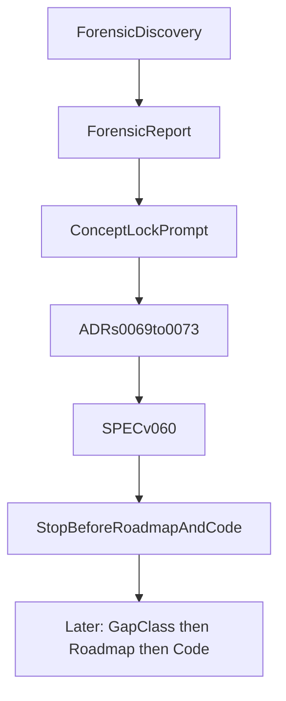

> **Procedure history.** Executed. Surviving law is `docs/SPEC.md` + ADRs `0069`–`0074`. GAMMA is the
> lock plan; `002_V060_FOUNDATION_ROADMAP_AND_GAP_REGISTER.md` is the living roadmap. This file must
> not be cited as a requirement.

# Vanguard v0.6 Forensic Discovery + Concept Lock

> **For agentic workers:** This is a **docs-and-evidence** engagement. Do not migrate runtimes, rewrite `layer0/` or `vanguard/packages/`, add Rust, or change CI behavior except as explicitly listed under hygiene. Do not commit unless the user asks.

**Goal:** Restore a single engineering authority for Substrate v0.6 so the *next* phase (as-built gap / migration classification, then roadmap, then code) can start without reopening settled concepts.

**Architecture:** One recursive Python substrate. Production lattice stays [`vanguard/packages/`](vanguard/packages/) until convergence is proven. [`layer0/`](layer0/) is a copy-fork to absorb, not a destination rewrite. Ledger is authoritative state; scheduler/orchestrator are the decision plane.

**Tech stack (locked):** Python 3.10+ stdlib core, JSON Schema + JCS identity, JSON-RPC/UDS plugin wire, SQLite WAL ledger, exterior Ed25519 evaluator. Rust/WASM/gRPC/distributed infra remain behind evidence gates.

## Authority for this engagement

| Rank | Source | Role |
|---|---|---|
| 1 | [TODO_DONT_COMMIT_BEFORE_DOING_IT_v2.md](docs/07_reviews/TODO_DONT_COMMIT_BEFORE_DOING_IT_v2.md) | Procedure for forensic discovery (phases, labels, two TODO deliverables) |
| 2 | User scope choice | After forensic, **do Concept Lock in this engagement**; stop before roadmap/code |
| 3 | [principal_engineer_proposal.md](docs/07_reviews/PRINCIPAL_STAFF_ENGINEER_REVIEW/principal_engineer_proposal.md) | Conceptual north star |
| 4 | Current [SPEC.md](docs/SPEC.md) + active ADRs | Law until explicitly superseded by new ADRs |
| 5 | Supporting reviews | Evidence and patterns only if compatible |

**Conflict rule:** If a supporting review disagrees with (1)–(3), record the conflict and keep the locked direction. Do not silently merge.

Already-known conflicts (will be written into the forensic report, not “fixed in code”):

- **Full Refactor v3.1** wants a Rust core beside both Python trees → **rejected**.
- **Execution Plan** treats `layer0/` as the v0.6 production target and `vanguard/packages/` as legacy with an exit date → **overridden**: packages is the production lattice; layer0 is absorbed.
- **Parecer v4** wants a new top-level `core/` tree → **rejected as a third identity**; extract modules *in place* under packages.
- **Parecer v4 Anel 2** lists Evaluator as a product plugin → **rejected**; evaluator stays exterior ([ADR-0004](docs/05_adr/0004-the-verifier-is-immutable-and-unreachable-from-every.md), [ADR-M0-08](docs/05_adr/ADR-M0-08-k40-invert.md)).
- **SPEC §1** calls `layer0/` the M1 destination → **reversed by ADR** (as-built packages is canonical until convergence).
- **SPEC §2 hot-swap** vs **ADR-0005** freeze-at-composition → **ADR-0005 wins** for v0.6.
- **aether-v1-roadmap-waves.md** is a roadmap → **out of scope** (next major phase after this exit gate).

## Out of scope (hard)

No production implementation, no `root.py` split, no plugin supervisor rewrite, no CI workflow edit (decision is locked; wiring is the next code phase), no roadmap/milestones/waves/backlog/sprints, no git commit unless requested.

---

## Locked P0 decisions (approve with this plan)

These are the Staff Engineer locks. Concept Lock will cite them in ADRs. They are **not** reopenable during implementation without a new ADR and reversal condition.

**P0-1 Runtime target.** Python-first. One production lattice: `vanguard/packages/` (`domain → ports → kernel → agency → runtime → adapters`). Composition root remains [`vanguard/packages/runtime/root.py`](vanguard/packages/runtime/root.py). Rust only if a later measured gate fires on a named TCB hot path. No `aether-rust/` tree.

**P0-2 Dual-tree strategy.** `layer0/` is a copy-fork (selectors differ from [`vanguard/packages/domain/selectors/resource_selector.py`](vanguard/packages/domain/selectors/resource_selector.py) by import path; kernel is a diverging port; scheduler fabricates `verdict: "pass"` at [`layer0/scheduler/driver.py:138-139`](layer0/scheduler/driver.py); `spawn()` emits `CHILD_SPAWNED` then immediate `CHILD_RETURNED` with `spans: []` at [`layer0/scheduler/driver.py:170-192`](layer0/scheduler/driver.py)). **Converge, do not rebuild.** Keep from packages: kernel, JCS, WAL ledger, exterior evaluator, sandbox, stores, models, episode engine. Promote from layer0: SPI protocols, `jsonrpc.py`, broker/sandbox cell, generated types. Delete duplicated layer0 modules only after a later parity gate. Do not create a third `core/` tree.

**P0-3 Authority.** Decision plane (scheduler / future orchestrator / kernel) decides *who/when/lease/budget/capability*. Authoritative state plane (ledger + pure reducers) decides *what happened*. `Decision → DurableEvent → fold → EffectiveState`. Orchestrator memory is never source of truth.

**P0-4 Recursive machine.** `Agent = Principal + HarnessInstance`. `SubAgent = ChildPrincipal + HarnessInstance` via `spawn`. Swarm = agents + coordination **policy**, not a new engine. Graph relations (`spawned_by`, `caused_by`, …) are **projections of events** ([ADR-0003](docs/05_adr/0003-agent-loop-primary-no-runtime-workflow-graph.md) stands). No workflow DAG engine, no graph database.

**P0-5 Spawn invariants (semantics now, engine later).** `Capabilities(child) ⊆ Capabilities(parent)`; `Budget(child) ≼ remaining(parent)` component-wise on the six-dim reservation ([ADR-M0-07](docs/05_adr/ADR-M0-07-six-dimension-reservation.md)). Envelope fields required on every new event kind: `project_id`, `principal_id`, `parent_principal_id?`, `episode_id`, `parent_episode_id?`, `harness_digest`, `causation_id`, `correlation_id`. Existing packages already tag `causationId` in [`agency/episode/engine.py`](vanguard/packages/agency/episode/engine.py); v0.6 makes the set mandatory rather than inventing a second identity scheme.

**P0-6 Identity trinity.** `D_H` harness composition, `D_R` execution (runtime+env+model+oracle), `D_X` experiment cell. FrozenHarness digest is `D_H` only. A/B measurement must not collapse these.

**P0-7 Ledger / CAS / replay.** Hybrid event sourcing: `State = fold(Events)`; snapshots are optimization; CAS holds bytes; events hold refs. Distinguish **state replay** (must be deterministic), **schedule replay** (needs recorded nondeterminism), **real-world re-execution** (not required to match), **byte-identical fixtures** (only fully controlled inputs). Consistency unit is `project_id` (no global total order requirement). Keep SQLite WAL ([ADR-0010](docs/05_adr/0010-a-transactional-embedded-store-with-write-ahead-logging.md)).

**P0-8 Plugin boundary.** Wire-first: line-delimited JSON-RPC 2.0 over UDS ([ADR-0002](docs/05_adr/0002-subprocess-with-line-delimited-json-as-the-seam.md), [ADR-0059](docs/05_adr/0059-polyglot-plugin-and-port-decoupling-via-standard-wire.md), existing [`layer0/spi/jsonrpc.py`](layer0/spi/jsonrpc.py)). Five SPIs stay ([ADR-M0-03](docs/05_adr/ADR-M0-03-five-spis.md)): Planner, Memory, Toolkit, Context, EvaluationGate. Python `Protocol` is a client convenience, not the contract. `in_process` is an isolation **privilege** that still speaks the same wire (loopback), not a second SPI. **ADR-0005 stands:** registries freeze at composition; mid-run composition change is forbidden in v0.6; quiesce/checkpoint is for restart, not hot-swap. Below the plugin line: identity, authority, effect mediation, event semantics, resource conservation, plugin lifecycle, scheduling mechanism. Above: planner, memory, context, compression, cache strategy, indexing, AST, heuristics, tools, skills, model routing, reflection, Meta-Harness strategies.

**P0-9 Evaluator.** Exterior signed judge remains TCB-adjacent and unreachable from the judged. `IEvaluationGate` only *requests* judgment. Scheduler must **read** the signed verdict; fabricating `"pass"` is a defect (F1), not a plugin strategy. Model gateway and sandbox stay first-party ports until a later wave moves them behind the same wire.

**P0-10 Concurrency.** Semantic fields and independence-via-selectors are locked now. Execution stays sequential (`MAX_CONCURRENCY = 1`, SPEC I-11 / [ADR-0007](docs/05_adr/0007-parallel-independent-execution-from-the-first-loop-commit.md) deferred). Logical agents are cheap; workers are bounded. No vector clocks / Merkle DAG / NATS / k8s.

**P0-11 CI subject of record.** Living CI ([`.github/workflows/ci.yml`](.github/workflows/ci.yml)) currently gates `test/layer0` + `test/packs` + lexical tools and **does not** run `test/kernel|runtime|agency|adapters` or CLI. That is a **false-confidence gate**, not a v0.6 architecture. Concept Lock requires: the production lattice is the CI subject of record; E-COV lexical grep ([`tools/check_event_coverage.py`](tools/check_event_coverage.py)) is not behavioral proof. **Implementing** the CI change is the first code-phase task, not this phase.

**P0-12 Deferred by design (P3 / research).** Meta-Harness promotion, self-updating release pipeline, WASM default isolation, remote attestation, multi-host distribution, graph DB, third control-plane language, pytest-as-universal-runner, competence-graph revival.

---

## Phase A — Forensic evidence (TODO Phases 0–6, no architecture docs yet)

Status start: all items `TODO`. Mark `DONE` only with command output or `file:line`.

**A1. Run the truth commands** (record exit code + relevant counts; do not “fix” failures):

- `python3 -m unittest discover -s test/layer0 -t .`
- `python3 -m unittest discover -s test/packs -t .`
- `python3 -m unittest discover -s test -t .` (expect red; CLAUDE.md already warns not-green)
- living gates: `check_boundaries.py`, `check_tcb_budget.py`, `check_domain_blindness.py`, `check_isolation_policy.py`, `check_stale_paths.py`, `scan_secrets.py`
- optional: `npm --prefix vanguard/clients/cli test` / `typecheck` (document as not-in-CI)

**A2. Re-verify parecer claims on this tree** (do not inherit commit `99d1e0b` numbers):

- selector diff packages vs `layer0/events/selectors.py`
- kernel similarity / import retarget (`types_gen` vs packages domain)
- F1/F7 still present in `layer0/scheduler/driver.py` and `layer0/registry/worker.py`
- `root.py` size and mixed responsibilities
- whether `SqliteEventStore` / evaluator daemon / bwrap still exist and are tested

**A3. Fill the TODO matrices** (facts only): subsystem EXISTS/PARTIAL/MOCK/… map; packages vs layer0 equivalence table; SPEC × ADR × code × tests × proposals table; concept inventory (Event, EffectRequest, Principal, Harness, Episode, Plugin, Ledger, CAS, spawn, …); gate Goodhart audit.

**A4. Classify P1 leftovers** as `LOCK NOW` or `DEFER DELIBERATELY` (examples already decided above: envelope attribution fields LOCK NOW; plugin TS conformance suite DEFER to implementation; pytest migration DEFER).

---

## Phase B — TODO Deliverable 1

Write [`docs/07_reviews/VANGUARD_V060_FORENSIC_DISCOVERY.md`](docs/07_reviews/VANGUARD_V060_FORENSIC_DISCOVERY.md) with the 25-section structure from the TODO. Every material claim tagged `[FACT]` / `[INFERENCE]` / `[PROPOSAL]` / `[UNKNOWN]` with `file:line` or command evidence.

This file is **investigation**, not law.

---

## Phase C — TODO Deliverable 2 (then execute it)

Write [`docs/07_reviews/PROMPT_ARCHITECTURE_CONCEPT_LOCK_V060.md`](docs/07_reviews/PROMPT_ARCHITECTURE_CONCEPT_LOCK_V060.md) as the recorded instruction the Concept Lock followed. It must tell the lock phase to resolve every P0, mark every P1 LOCK/DEFER, update ADRs + SPEC v0.6, and **must not** ask for roadmap/code.

Immediately execute that prompt as Phase D (user-selected scope). Do not stop after the prompt file.

---

## Phase D — Concept Lock (normative)

### D1. ADR cluster (append-only, next numbers `0069+`; `0067` remains a documented hole)

Follow [ADR-0045](docs/05_adr/0045-new-decisions-use-the-expanded-fields-required-by.md) fields: context, decision, alternatives rejected, evidence/bound test, reversal condition, owner/status.

| ADR | Decision |
|---|---|
| **0069** | Runtime convergence: Python-first; packages canonical; layer0 absorb-and-delete; no third tree; no Rust rewrite (reverses SPEC §1 “layer0 is M1 destination”; records rejection of Full Refactor Rust core) |
| **0070** | Recursive substrate: Agent/spawn/swarm-as-policy; graph is event projection; spawn subset invariants |
| **0071** | Authority + state: decision plane vs ledger; hybrid ES; CAS for bytes; identity `D_H/D_R/D_X`; required causal envelope fields; replay taxonomy |
| **0072** | Plugin boundary: wire-first JSON-RPC/UDS; Protocol is client; `in_process` privilege; ADR-0005 freeze stands (SPEC hot-swap struck for v0.6); five SPIs; evaluator not a product plugin; mechanism vs strategy split |
| **0073** | v0.6 lock vs defer: concurrency modeled/disabled; CI subject-of-record requirement; Meta-Harness / distribution / WASM / graph DB / pytest-runner deferred |

Update [`docs/05_adr/INDEX.md`](docs/05_adr/INDEX.md): add `0069–0073` **and** the missing `ADR-M0-01…13` rows (index hole is a [FACT] from forensic).

### D2. SPEC v0.6

Edit [`docs/SPEC.md`](docs/SPEC.md) in place (it remains the only living normative spec):

- Version anchor: **v0.6.0 Concept Lock**. Note pyproject still `0.4.5b1` as as-built package version until a later release cut.
- Authority line: newer ADR wins by citation; `0069–0073` now sit above the M1-destination story.
- Preamble: recursive agency substrate; coding pack remains the first *domain*, not the architecture.
- Rewrite §1 dual-lattice paragraph: packages = production implementation of Layer 0 concerns; `layer0/` = fork under convergence, not destination rewrite.
- Add a short § on Agent/spawn/identity trinity and decision vs state planes.
- §2: wire-first plugin contract; strike mid-run hot-swap; keep isolation tiers; `IEvaluationGate` does not host the judge.
- Honour table / invariants: keep I-1…I-11; add explicit bans (no third runtime, no swarm engine, no byte-identical concurrent ledger requirement).
- §8 migration: invert direction (recover mature packages semantics; promote layer0 SPI/broker; do not rebuild WAL/evaluator/sandbox).
- Self-review: no TBD, no contradiction with `0069–0073`.

Annexes: only amend [`docs/04_annex/KERNEL.md`](docs/04_annex/KERNEL.md) / [`MEASUREMENT.md`](docs/04_annex/MEASUREMENT.md) if a v0.6 sentence would otherwise contradict them; otherwise cite ADRs. Do not silently rewrite KERNEL S0–S12.

### D3. Hygiene that is part of the lock (not a sprint)

- [`CLAUDE.md`](CLAUDE.md): replace `v0.4.5-beta` with v0.6.0 concept-lock pointer; keep packages lattice as as-built.
- [`docs/03_sprints/sprint_active.md`](docs/03_sprints/sprint_active.md): one status note that M0 docs lock is **superseded by v0.6 Concept Lock**; next *authorized* phase is as-built gap/migration classification — **no new sprint tasks, waves, or dates**.
- Do **not** rewrite [`docs/02_roadmap/milestones.md`](docs/02_roadmap/milestones.md) (that is the following major phase).

---

## Phase E — Exit gate (must all be true before any code phase)

1. Forensic report exists, 25 sections, claims labeled, live command evidence for CI/tests (not review-doc numbers).
2. Concept-lock prompt exists and Phase D followed it.
3. Every P0 above has an ADR citation in SPEC.
4. Every P1 is marked LOCK NOW or DEFER DELIBERATELY in the forensic P1 registry.
5. SPEC v0.6 has no TBD and does not still say `layer0/` is the M1 destination.
6. INDEX lists `0069–0073` and `ADR-M0-*`.
7. Conflict log lists rejected supporting-doc items (Rust core, third `core/` tree, evaluator-as-plugin, hot-swap, rebuild-WAL-in-layer0).
8. Working tree contains **no** runtime/CI implementation of the next wave.
9. No git commit unless the user explicitly asks after reviewing the docs.

**Next major phase (not this engagement):** as-built gap / migration classification, then a single operational execution plan, then code starting with CI-subject-of-record (packages suite + bwrap) and duplication/F1 wiring — not a Rust rewrite and not a third runtime.

