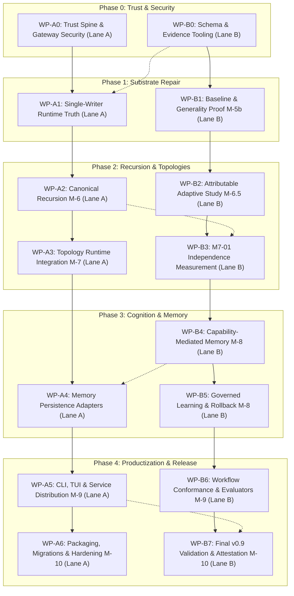

# AETHER Autonomous Engineering Blueprint & Delivery Plan (M-1 → M-10, v0.9 Release)

**Document Reference:** `docs/_archive/reviews/backend/director_review_v3/guidelines_gemini.md`  
**Target Delivery:** AETHER Higgs v0.9.0 Buildable & Operational Release (End of M-10)  
**Execution Paradigm:** Fully Autonomous Two-Lane Continuous Implementation (Zero Bureaucracy / Zero Blocking Approvals)  
**Author Roles:** Staff Systems Engineer, Principal Systems Architect, Tech Lead, Project Lead, Technical CEO  

---

## 1. Executive Verdict

### 1.1 Core Finding
AETHER's core foundation is structurally sound, mathematically grounded, and architecturally robust. The microkernel adheres strictly to the hexagonal boundary lattice (`domain ← ports ← kernel ← agency ← runtime → adapters`), maintains domain blindness (Invariant **I-7**), and operates within the Trusted Computing Base (TCB) budget ($\le 1438$ logical LOC, currently at 1365 LOC). However, the project has suffered from **administrative paralysis, review sprawl, and artificial gate-keeping** caused by manual verification expectations, cross-lane approval locks, and mismatched versioning horizons. 

Simultaneously, recent development in outer layers introduced critical regressions:
1. **Trust Spine Bypass (P0):** Hardcoded operator key seed in `cli.py`, unconditional auto-approver in interactive paths, fabricated approval signatures in `studio_gateway.py`, and unverified decision payloads in `service.py`.
2. **Runtime Truth Splitting (P0):** Dual-write event store in `RuntimeService.publish_event` that discards canonical append results, lossy envelope transformations substituting placeholder identities (`tenant-default`), and non-reconstructable checkpoint/resume stubs.
3. **Evidence Tooling Vacuum (P0):** Absence of automated machine-verification tooling for `aether.evidence/1` envelopes, preventing autonomous gate closure.
4. **Implementation Gaps in Outer Milestones:** M-7 topology lowering present as an isolated library with 0 runtime call sites; M-8 memory access authorization implemented as a trivial string truthiness check (`bool(grant_ref)`).

### 1.2 The Autonomous Two-Lane Solution
To transition from analysis to execution and deliver a fully operational, buildable, tested **AETHER v0.9.0** upon completion of M-10, all development is partitioned into **exactly two autonomous, decoupled engineering lanes**:
- **Lane A (Runtime & Systems Infrastructure):** Owns runtime composition, execution loops, S0–S12 dispatch pipeline wiring, causal ledger persistence, SQLite-WAL event storage, Unix Domain Socket (UDS) / SSE / HTTP servers, packaging, distribution CLI, installation scripts, containerization, and deployment.
- **Lane B (Contracts, Cognition & Verification):** Owns wire protocols (`vg.4`), JSON schemas (`schemas/v4/`), JCS canonicalization, projections (AgentView), property falsifiers, benchmark instruments, capability-mediated memory systems, skill promotion engines, and automated evidence attestation.

### 1.3 Governance Abolition
**All manual gates, committee meetings, leadership waivers, and inter-task human sign-offs are hereby abolished.** The two lanes operate with absolute autonomy under:
1. **Frozen Boundary Contracts & Stubs:** Shared interfaces frozen via formal schemas and typing protocols.
2. **Deterministic Local Decision Rules:** Every technical ambiguity is mapped to a pre-authorized fallback default.
3. **Machine-Enforced Verification:** Local contract test suites, invariant linters, and cryptographic self-attestation replace human oversight.
4. **Mechanical Wave Integration:** Merge conflicts are eliminated by strict file-ownership partitioning and unidirectional dependencies.

---

## 2. Current-State Diagnosis

### 2.1 Code vs. Documentation Truth Audit

| Subsystem / Feature | Documentation Claim | Real Implementation Status | Classification | Impact / Remediation |
|---|---|---|---|---|
| **Hexagonal Lattice & TCB** | Boundary enforced, Kernel $\le 1438$ LOC | 1365 LOC, 8 linters passing cleanly | **IMPLEMENTED** | Preserve strictly; protect headroom (+73 LOC). |
| **S0–S12 Dispatch Pipeline** | 13-stage monotonic attenuation | Fully functional in `kernel/dispatch.py` | **IMPLEMENTED** | Production truth; keep domain-blind. |
| **Operator Key Lifecycle** | Secure per-host key generation | Hardcoded literal seed in `runtime/cli.py` | **REGRESSED** | Lane A must replace with `~/.vanguard/keys/` (0600). |
| **Approval Verification** | Cryptographic Ed25519 signature checks | "dummy-sig-approved" default & unverified `ResolveApproval` | **REGRESSED** | Lane A must verify against pending challenges. |
| **Causal Ledger / Storage** | Single-writer append-only event store | Dual-write in `service.py`, discarded return results | **REGRESSED** | Lane A must consolidate to single SQLite-WAL store. |
| **Event Envelopes (`/2`)** | Immutable full-context envelopes | Lossy dict reducer in `service.py` flattening identity | **REGRESSED** | Lane A must persist `EventEnvelope` unmodified. |
| **JSON Schema Validation** | Enforced on all inputs | `jsonschema` in optional `dev` deps; fail-open `try/except` | **CONTRADICTORY** | Lane B moves `jsonschema` to core runtime dependencies. |
| **Recursive Delegation (M-6)** | Real mediated child run execution | Injected callbacks & synthetic spawn results | **PARTIAL** | Lane A threads `ChildRuntimePort` to `run_composed`. |
| **Adaptive Strategy (M-6.5)** | Controller paired study | Implemented; stochastic paired study complete | **IMPLEMENTED** | Lane B freezes baseline; negative result accepted as valid. |
| **Topologies (M-7)** | 3 execution topologies in runtime | Full library in `topology.py`, **0 runtime call sites** | **MISSING IN RUNTIME** | Lane A integrates `RunPlanExtensionRef` in `root.py`. |
| **Durable Memory (M-8)** | Capability-mediated categories | `permitted() = bool(grant_ref)`; generic SQLite stub | **MISSING / FAKE** | Lane B implements `MemoryAuthorizationPort` + 4 stores. |
| **Governed Learning (M-8)** | 3-way separation + CAS rollback | Skips sigs if no keys; pointer swap without behavior proof | **PARTIAL** | Lane B enforces `Generator ≠ Evaluator ≠ Promoter`. |
| **Product CLI & Install (M-9)** | Standalone installer & binary | Broken path arithmetic, unquoted `os.popen`, no venv | **OBSOLETE / BROKEN** | Lane A builds standard console script & wheel packaging. |
| **Release & Hardening (M-10)** | Reliability, SLOs, final v0.9 | Not designed or integrated | **MISSING** | Lane A + Lane B execute M-10 hardening roadmap. |

### 2.2 Root Causes of Prior Gridlock
1. **Administrative Overhead:** Milestones were held `OPEN` awaiting external human review despite passing automated tests.
2. **Circular Dependency Locks:** Lane A waited for Lane B's evidence tooling while Lane B waited for Lane A's clean run traces.
3. **Review Document Sprawl:** Endless succession of competing review documents (`TODO_PROMPT.md`, `director_review_v2`, `masterplan_todo_rev1.md`) generated confusion without authorizing executable changes.

---

## 3. Principles of the Autonomous Methodology

1. **Code-First Production Authority:** Running code, verified contract tests, and machine-checked schemas represent the sole truth. Documentation is generated from or validated against code.
2. **Strict File & Subsystem Ownership:** No lane modifies files owned by the other lane without a formal shared-contract interface definition.
3. **Fail-Closed by Default:** Any missing verification key, invalid signature, schema mismatch, or unhandled error terminates execution with a typed error code.
4. **Stubs & Fixtures for Decoupled Progress:** When a downstream component requires an upstream dependency, it develops against a frozen contract stub and test fixture rather than blocking.
5. **Deterministic Fallbacks for Experiments:** In scientific/evaluative milestones (M-5b, M-6.5, M-7), an honest negative result (e.g., concurrency provides no lift $\to$ retain sequential) is a valid, milestone-closing outcome.
6. **Zero-Ceremony Mechanical Integration:** Waves merge directly into `main` once local tests, linters, and self-review checks pass.

---

## 4. Reconstructed Milestone Baseline (M-1 → M-3)

Based on immutable Git history, tags (`M-5-BASE` at `1a7dcba`), accepted ADRs (`ADR-0001` through `ADR-0097`), and codebase analysis:

### 4.1 M-1: Core S0–S12 Microkernel & Capability Attenuation
- **Delivered Truth:** S0 (Observe), S1 (Context Gate), S2 (Budget Gate), S3 (Capability Attenuation), S4 (Isolation Check), S5 (Dispatch Execution), S6 (Outcome Verification), S7 (Effect Emitted), S8 (State Fold), S9 (Governor Check), S10 (Receipt Generation), S11 (Telemetry), S12 (Turn Complete).
- **Core Invariant:** Kernel remains strictly domain-blind (**I-7**) and under the 1438 LOC limit.
- **Budget Algebra:** 4D typed additive resources (`usd_micros`, `millis`, `tokens`, `bytes`). `depth` and `turns` are strict structural ceilings.

### 4.2 M-2: Causal Event Sourcing & Durable Single-Writer Anchor
- **Delivered Truth:** SQLite-WAL persistence engine with atomicity guarantees.
- **Dual-Read / Single-Write Rule:** Single-write for current envelope versions (`mhf.event/2`), dual-read compatibility for historical versions (`mhf.event/1` and `/2`).
- **Cold Continuation:** Complete state reconstruction from event replay without memory leakage or mutable row reliance.

### 4.3 M-3: Hexagonal Lattice & Composition Seam
- **Delivered Truth:** Hexagonal ports architecture (`KernelPort`, `ModelPort`, `SandboxPort`, `EventStorePort`, `BlobStorePort`).
- **Canonical Chain:** `mhf.manifest/2` $\to$ `CanonicalManifest` $\to$ `FrozenComposition` ($D_H$) $\to$ `ActivationPlan` $\to$ `RunPlan` ($D_R$) $\to$ `EpisodeEngine`.

---

## 5. Architectural Decisions to Freeze

The following architectural axioms and design decisions are immutable for the duration of M-1 through M-10:

```text
┌─────────────────────────────────────────────────────────────────────────────┐
│                            ARCHITECTURAL FREEZE                             │
├─────────────────────────────────────────────────────────────────────────────┤
│ 1. Lattice Flow: domain ← ports ← kernel ← agency ← runtime → adapters     │
│ 2. TCB Limit: kernel/ logical LOC ≤ 1438 (Zero exceptions)                 │
│ 3. Domain Blindness: No agency/memory/topology/learning imports in kernel   │
│ 4. Single-Writer Anchor: RuntimeService writes ONLY to SqliteEventStore     │
│ 5. Event Envelopes: Canonical mhf.event/2 envelopes persisted unmodified    │
│ 6. Storage Model: File-backed SQLite-WAL only (Zero :memory: in prod)       │
│ 7. Memory Mediation: Authorization strictly precedes ranking and fetch      │
│ 8. Governance Triad: Generator_ID ≠ Evaluator_ID ≠ Promoter_ID             │
│ 9. Wire Protocol: vg.4 NDJSON framing with exactly 10 canonical error codes │
│ 10. Release Scope: Complete M-1 through M-10 to deliver AETHER v0.9.0       │
└─────────────────────────────────────────────────────────────────────────────┘
```

### 5.1 Release-Version Sequence Alignment
- **Historical Conflict:** Prior drafts inconsistently labeled M-7/M-8 as v0.9 and M-9 as v1.0.
- **Definitive Alignment:**
  - **M-1 → M-3:** Substrate Foundation (v0.1 – v0.3) [Complete]
  - **M-4 → M-6.5:** Core Agency, Recursion & Scientific Capture (v0.4 – v0.6) [Stabilization]
  - **M-7 → M-8:** Multi-Role Topologies, Memory & Governed Learning (v0.7 – v0.8) [Core Capabilities]
  - **M-9 → M-10:** Product Integration, CLI/TUI, Packaging, Reliability & Release Hardening (v0.9.0) [Delivery Release]
  - **v1.0.0:** Post-v0.9 Production Horizon (Multi-node distributed clustering, public ecosystem plugins).

---

## 6. Complete Lane Ownership Model

### 6.1 Ownership Matrix

```text
                                 AETHER REPOSITORY
                                         │
                 ┌───────────────────────┴───────────────────────┐
                 ▼                                               ▼
         LANE A (Runtime/Ops)                           LANE B (Cognition/Verif)
  ├── vanguard/packages/runtime/                 ├── vanguard/packages/domain/
  │    ├── service/ (UDS/HTTP/SSE)               │    └── evidence/ (Envelopes)
  │    ├── keys.py (Key Lifecycle)               ├── vanguard/packages/agency/
  │    ├── delegation.py (Child Runtime)         │    └── manifests/ (Schema loading)
  │    ├── root.py (Topology Wiring)             ├── vanguard/packages/ports/
  │    └── cli.py (Distribution CLI)             │    └── memory.py (Protocols)
  ├── vanguard/packages/adapters/                ├── vanguard/packages/runtime/
  │    ├── stores/ (SqliteEventStore, CAS)       │    ├── memory.py (Auth logic)
  │    └── sandbox/ (Rootless bwrap)             │    └── governance/ (Learning CAS)
  ├── schemas/v4/ (Transport schemas)            ├── schemas/v4/ (Memory/Skill schemas)
  ├── tools/runners/ (Install/Deploy)            ├── lab/ (M-5b, M-6.5, M-701 Studies)
  └── test/runtime/, test/integration/           └── test/contracts/, test/security/
```

### 6.2 Exclusive File Partitioning

| Subsystem / Area | Lane A (Exclusive Owner) | Lane B (Exclusive Owner) |
|---|---|---|
| **Domain & Ports** | `ports/kernel.py`, `ports/event_store.py`, `ports/sandbox.py` | `domain/`, `ports/memory.py`, `ports/evaluator.py`, `ports/spi.py` |
| **Kernel Core** | S0–S12 Execution Maintenance (No LOC growth) | Zero writes (Read-only verification) |
| **Agency Engine** | `agency/episode/` execution loops | `agency/manifests/`, `agency/compaction/` |
| **Runtime Core** | `runtime/service/`, `runtime/keys.py`, `runtime/delegation.py`, `runtime/root.py` | `runtime/memory.py`, `runtime/governance/`, `runtime/telemetry.py` |
| **Adapters** | `adapters/stores/sqlite_store.py`, `adapters/sandbox/`, `adapters/models/` | `adapters/stores/memory_engine.py`, `adapters/evaluators/` |
| **Schemas & Vectors** | `schemas/v4/runtime-service.schema.json`, transport vectors | `schemas/v4/memory-*.json`, `schemas/v4/evidence-*.json` |
| **Tools & Linters** | `tools/linters/check_boundaries.py`, packaging scripts | `tools/runners/accept_evidence.py`, `tools/linters/check_evidence_*.py` |

### 6.3 Shared Contract Change Protocol
1. Any modification to a shared interface in `ports/` or `schemas/v4/` must be proposed as a typed interface stub.
2. The proposing lane provides the schema vector test fixture in `schemas/v4/vectors/`.
3. The consuming lane implements the receiver using the vector fixture.

---

## 7. Autonomous Decision Model & Fallback Defaults

To ensure uninterrupted progress, every technical fork is bound to a deterministic default:

| Decision Area | Technical Owner | Operational Options | Deterministic Selection Rule | Fallback Default |
|---|---|---|---|---|
| **Operator Key Storage** | Lane A | A1: File (`0600`)<br>A2: System Keyring<br>A3: Env Var | Select file-backed `~/.vanguard/keys/operator.ed25519` with strict 0600 permission checks. | Fail closed if file mode is insecure. |
| **UDS Protocol Framing** | Lane A | B1: Length-prefixed<br>B2: NDJSON (1 MiB cap) | Select NDJSON framing with strict 1 MiB buffer and canonical 10-error vocabulary. | Terminate with `frame_too_large` if exceeded. |
| **Event Replay vs Store** | Lane A | C1: Dual-store<br>C2: Single Canonical SQLite-WAL | Select single-writer `SqliteEventStore`. Delete inbox event table. | Single transaction commit before notifier emission. |
| **M-5b Baseline Selection** | Lane B | D1: Wait for missing tag<br>D2: Freeze `CONVERGENCE-BASE-v1` | Freeze local clean commit as `CONVERGENCE-BASE-v1` with signed manifest. | Execute M-5b graph-coloring against local frozen baseline. |
| **M-6.5 Controller Enablement** | Lane B | E1: Force enabled<br>E2: Evidence-based enablement | Enable by default ONLY if McNemar exact test shows $p < 0.05$ and lift $> 0$. | Keep controller OFF by default; milestone closes as valid negative. |
| **M-7 Scheduler Concurrency** | Lane A / B | F1: Concurrent reads ($N=2$)<br>F2: Strict Sequential | Enable read concurrency ONLY if M7-01 proves zero state divergence and $>15\%$ lift. | Fallback to `SEQUENTIAL_CONFIRMED`; milestone closes with sequential scheduler. |
| **M-8 Memory Storage Backend** | Lane B | G1: Vector DB<br>G2: SQLite-WAL + CAS Blobs | Select SQLite-WAL for indexed metadata + CAS filesystem for raw content blobs. | Refuse WAL on network mounts; fail-closed on unindexed categories. |
| **M-8 Rollback Verification** | Lane B | H1: Pointer swap<br>H2: Fresh-Process Behavioral Test | Require signed `PromotionEvidence` and execute fresh-process behavioral verification. | Reject unsigned rollback; quarantine unverified composition heads. |

---

## 8. Complete M-1 through M-10 Linear Work Packages



---

### Work Package WP-A0: Trust Spine, Approval Verification & Gateway Hardening (Lane A)
- **Objective:** Eliminate hardcoded key seeds, auto-approvals, fabricated signatures, and unauthenticated network gateways.
- **Baseline:** `vanguard/packages/runtime/cli.py`, `vanguard/packages/runtime/service/studio_gateway.py`, `vanguard/packages/runtime/service/service.py`.
- **Files Owned:** `vanguard/packages/runtime/keys.py` (new), `vanguard/packages/runtime/cli.py`, `vanguard/packages/runtime/service/studio_gateway.py`, `vanguard/packages/runtime/service/server.py`, `vanguard/packages/runtime/service/service.py`.
- **Symbols:** `load_operator_signer()`, `interactive_approver()`, `_authenticate()`, `_cmd_ResolveApproval()`, `validate_frame_envelope()`.
- **Contracts / Schemas:** `schemas/v4/runtime-service.schema.json` (`ResolveApproval` frame).
- **Behavioral Logic:**
  ```python
  # 1. Secure Key Loader (keys.py)
  def load_operator_signer(*, allow_create: bool) -> OperatorSigner:
      key_file = Path.home() / ".vanguard" / "keys" / "operator.ed25519"
      if key_file.exists():
          if (key_file.stat().st_mode & 0o777) != 0o600:
              raise InsecureKeyError("Key file permissions must be 0600")
          return OperatorSigner(key_file.read_bytes())
      if not allow_create:
          raise NotAvailableError("No operator key configured")
      key_file.parent.mkdir(parents=True, exist_ok=True, mode=0o700)
      seed = secrets.token_bytes(32)
      with os.fdopen(os.open(key_file, os.O_WRONLY | os.O_CREAT | os.O_EXCL, 0o600), "wb") as f:
          f.write(seed)
      return OperatorSigner(seed)

  # 2. Strict Approval Verification (service.py)
  def _cmd_ResolveApproval(self, run_id, payload, actor, command_id):
      challenge = self._pending_approvals.require(run_id, payload["decision"]["approvalId"])
      decision = parse_strict_approval_decision(payload["decision"])
      self._approval_authority.verify_registered_key(decision.key_id)
      self._approval_authority.verify_signature(decision)
      self._approval_authority.verify_not_expired(decision, now=self._clock.now())
      if decision.args_digest != challenge.args_digest or decision.descriptor_digest != challenge.descriptor_digest:
          raise PermissionDeniedError("Challenge digest mismatch")
      seq = self.append_fact(run_id, ApprovalResolved(decision=decision, challenge=challenge))
      return {"runId": run_id, "seq": seq, "status": decision.resolution}
  ```
- **Invariants:** Invariant **I-5** (Exterior Signed Judge) restored.
- **Completion Criteria:** Falsifiers RF-C-01 through RF-C-12 pass; no seed literals in repo; unattended non-TTY run fails closed on governance challenge.
- **Next Task:** WP-A1.

---

### Work Package WP-B0: Schema Authority & Evidence Acceptance Tooling (Lane B)
- **Objective:** Move `jsonschema` to mandatory dependencies, generate shared vector fixtures, and implement the independent evidence acceptance runner and linter.
- **Baseline:** `pyproject.toml`, `agency/manifests/loader.py`, `domain/evidence/envelope.py`, `tools/runners/`.
- **Files Owned:** `pyproject.toml`, `vanguard/packages/agency/manifests/loader.py`, `vanguard/packages/runtime/service/contract.py`, `tools/runners/accept_evidence.py` (new), `tools/linters/check_evidence_acceptance.py` (new), `schemas/v4/vectors/`.
- **Symbols:** `reproduce()`, `accept_evidence()`, `check_evidence_acceptance()`.
- **Contracts / Schemas:** `aether.evidence/1`, `schemas/v4/runtime-service.schema.json`.
- **Behavioral Logic:**
  ```python
  # tools/runners/accept_evidence.py
  def accept_evidence(bundle_path: Path, reviewer_key_path: Path) -> Path:
      produced = EvidenceEnvelope.load(bundle_path)
      if not produced.signature:
          raise ValueError("Producer bundle is unsigned")
      reviewer_signer = OperatorSigner(reviewer_key_path.read_bytes())
      if reviewer_signer.identity == produced.producer.identity:
          raise SelfAcceptanceError("Reviewer must differ from producer (ADR-0101 §3)")
      
      report = reproduce_clean_environment(produced)
      outcome = "passed" if report.reproduced else "undeterminable"
      
      acceptance = EvidenceEnvelope(
          schema="aether.evidence/1",
          kind="acceptance",
          producer=reviewer_signer.as_producer(),
          subjects=[produced.digest()],
          outcome=outcome,
          detail=report.summary,
          protocol=produced.protocol,
          environment=current_environment_identity()
      )
      signed_acceptance = reviewer_signer.sign(acceptance)
      out_path = bundle_path.with_suffix(".acceptance.json")
      out_path.write_bytes(canonical_jcs(signed_acceptance))
      return out_path
  ```
- **Invariants:** Axiom **A-4** and Invariant **I-8** restored.
- **Completion Criteria:** `jsonschema` import is unconditional; `check_evidence_acceptance.py` verifies all bundles in `docs/03_execution/evidence/`.
- **Next Task:** WP-B1.

---

### Work Package WP-A1: Single-Writer Runtime Truth, Envelope Fidelity & Recovery (Lane A)
- **Objective:** Consolidate event storage to a single canonical SQLite-WAL store, eliminate lossy envelope transformation, and implement cold checkpoint/resume.
- **Baseline:** `vanguard/packages/runtime/service/service.py`, `vanguard/packages/adapters/stores/sqlite_store.py`.
- **Files Owned:** `vanguard/packages/runtime/service/service.py`, `vanguard/packages/runtime/session.py`, `vanguard/packages/adapters/stores/sqlite_store.py`.
- **Symbols:** `append_event()`, `checkpoint()`, `resume()`, `cancel()`.
- **Contracts / Schemas:** `mhf.event/2`.
- **Behavioral Logic:**
  ```python
  def append_event(store: SqliteEventStore, run_id: str, expected_seq: int | None, envelope: EventEnvelope) -> int:
      with store.transaction():
          current_seq = store.last_seq(run_id)
          if expected_seq is not None and expected_seq != current_seq:
              raise ConflictError(f"Sequence conflict: expected {expected_seq}, got {current_seq}")
          next_seq = current_seq + 1
          # Envelope is serialized via JCS and stored without mutating identity fields
          store.append(run_id, next_seq, envelope)
      # Notifier is invoked strictly after SQLite transaction commit
      store.notifier.publish(run_id, next_seq, envelope)
      return next_seq
  ```
- **Invariants:** Invariant **I-4** (Durable Parity) and **I-9** (Trajectory Recovery) restored.
- **Completion Criteria:** Failed canonical append returns no sequence number and emits zero notifications; envelope round-trip preserves all tenant/trace/causal fields intact.
- **Next Task:** WP-A2.

---

### Work Package WP-B1: Successor Baseline & M-5b Generality Proof (Lane B)
- **Objective:** Freeze `CONVERGENCE-BASE-v1` manifest and deliver deterministic Graph Coloring generality falsifier.
- **Baseline:** `lab/m5b_formal_proof.py`, `vanguard/packs/graph_coloring/`.
- **Files Owned:** `vanguard/packs/graph_coloring/`, `lab/m5b_formal_proof.py`, `test/contracts/test_m5b_generality.py`.
- **Symbols:** `verify_baseline_manifest()`, `execute_graph_coloring_harness()`.
- **Contracts / Schemas:** `aether.baseline/1`, `mhf.trajectory/2`.
- **Behavioral Logic:** Execute positive, negative, malformed, and permutation vectors against graph coloring pack via `Runtime.execute_harness`. Compare treatment results against `CONVERGENCE-BASE-v1` via RF-86 / RF-98 falsifiers.
- **Invariants:** Domain-blindness (**I-7**); no protected substrate modifications.
- **Completion Criteria:** Generality proof passes with 100% oracle agreement; `M-5b-graph-coloring.json` signed and independently accepted.
- **Next Task:** WP-B2.

---

### Work Package WP-A2: Canonical Recursion & Child Runtime Execution M-6 (Lane A)
- **Objective:** Wire real `ChildRuntimePort` into `Runtime.run_composed`, removing synthetic spawn stubs and enforcing componentwise child budget reservations.
- **Baseline:** `vanguard/packages/runtime/delegation.py`, `vanguard/packages/runtime/root.py`.
- **Files Owned:** `vanguard/packages/runtime/delegation.py`, `vanguard/packages/runtime/root.py`, `vanguard/packages/ports/kernel.py`.
- **Symbols:** `ChildRuntimeAdapter`, `execute_child_run()`, `reserve_child_budget()`.
- **Contracts / Schemas:** `aether.delegation/1`.
- **Behavioral Logic:**
  - Derive child run identity durably: `child_run_id = sha256(parent_episode_id + ":" + idempotency_key)[:32]`.
  - Validate and reserve child budget componentwise against parent remaining budget (`usd_micros`, `millis`, `tokens`, `bytes`).
  - Child engine executes through `Runtime.run_composed` with attenuated capability set.
  - Implement full subtree cancellation and kill-tree propagation.
- **Invariants:** Subordinate execution lineage preserves budget conservation and auditability.
- **Completion Criteria:** Depth $\ge 3$ recursive execution tree completes, persists WAL, cold-reconstructs, and passes `test_rf101_recursive_delegation`.
- **Next Task:** WP-A3.

---

### Work Package WP-B2: Stochastic Adaptive Strategy Study M-6.5 (Lane B)
- **Objective:** Finalize stochastic paired study on adaptive meta-control and establish profile-based enablement.
- **Baseline:** `lab/m65_paired_study.py`, `vanguard/packages/agency/controller/`.
- **Files Owned:** `lab/m65_paired_study.py`, `test/contracts/test_m65_controller.py`.
- **Symbols:** `run_paired_evaluation()`, `compute_mcnemar_exact()`, `compute_holm_bonferroni()`.
- **Contracts / Schemas:** `aether.study/1`.
- **Behavioral Logic:** Run $\ge 60$ randomized paired trials comparing controller-active vs baseline across recoverable block tasks. Report McNemar exact test and Holm-Bonferroni correction.
- **Invariants:** Controller presence is the sole treatment axis.
- **Completion Criteria:** Valid study report generated. If $p \ge 0.05$, controller remains disabled by default; milestone closes with accepted study receipt.
- **Next Task:** WP-B3.

---

### Work Package WP-A3: Topology Runtime Integration M-7 (Lane A)
- **Objective:** Connect `topology.py` to `Runtime.run_composed` via `RunPlanExtensionRef`.
- **Baseline:** `vanguard/packages/runtime/topology.py`, `vanguard/packages/runtime/root.py`, `vanguard/packages/runtime/run_plan.py`.
- **Files Owned:** `vanguard/packages/runtime/topology.py`, `vanguard/packages/runtime/root.py`, `vanguard/packages/runtime/run_plan.py`.
- **Symbols:** `RunPlanExtensionRef`, `_bind_topology()`, `execute_topology()`.
- **Contracts / Schemas:** `aether.topology/1`.
- **Behavioral Logic:**
  ```python
  def _bind_topology(task_context, frozen_composition, store):
      ref = task_context.get_extension("aether.topology/1")
      if not ref:
          return None  # Preserves exact default sequential execution path
      artifact = store.load_artifact(ref.digest)
      topology = parse_topology(artifact)
      _reject_unauthorized_verbs(topology, frozen_composition)
      lowered = lower_topology_to_operations(topology, frozen_composition)
      store.append_fact(RunPlanExtensionAccepted(extension_digest=ref.digest, lowering_digest=lowered.digest()))
      return lowered
  ```
- **Invariants:** Topology cannot create authority (Axiom **A-1**); disabled topology preserves exact identity and event parity.
- **Completion Criteria:** Direct, Planner-Executor-Reviewer, and Fork-Read-Merge topologies execute through `Runtime.run_composed`.
- **Next Task:** WP-A4.

---

### Work Package WP-B3: M7-01 Independence Measurement & ADR-0099 Disposition (Lane B)
- **Objective:** Measure resource selector independence in recorded workloads and formalize scheduler concurrency decision.
- **Baseline:** `lab/m701_independence.py`, `test/contracts/test_m7_measurement.py`.
- **Files Owned:** `lab/m701_independence.py`, `docs/02_decisions/0099-m7-scheduler-disposition.md` (new).
- **Symbols:** `analyze_selector_disjointness()`, `evaluate_concurrency_lift()`.
- **Contracts / Schemas:** `aether.m701/1`.
- **Behavioral Logic:** Analyze execution traces for disjoint read selectors. If read lift $> 15\%$ with zero divergence, ratify bounded read concurrency ($N=2$); otherwise ratify `SEQUENTIAL_CONFIRMED`.
- **Completion Criteria:** Signed M7-01 report produced and ADR-0099 committed with definitive disposition.
- **Next Task:** WP-B4.

---

### Work Package WP-B4: Capability-Mediated Durable Memory M-8 (Lane B)
- **Objective:** Implement `MemoryAuthorizationPort`, 4 memory categories, and authorization-before-ranking retrieval.
- **Baseline:** `vanguard/packages/runtime/memory.py`, `vanguard/packages/ports/memory.py`.
- **Files Owned:** `vanguard/packages/ports/memory.py`, `vanguard/packages/runtime/memory.py`, `vanguard/packages/domain/resource_selector.py`.
- **Symbols:** `MemoryAuthorizationPort`, `AuthorizedMemoryContext`, `retrieve()`, `record()`.
- **Contracts / Schemas:** `schemas/v4/memory-grant.schema.json`, `schemas/v4/memory-retrieval.schema.json`.
- **Behavioral Logic:**
  ```python
  def retrieve(query, grant, *, category, tenant, project, budget, now):
      auth = memory_authority.verify(
          grant, action="memory.read", selector=selector_for(query),
          tenant=tenant, project=project, now=now
      )
      # Store queries ONLY over authorized records (prevents side-channel leaks)
      candidates = metadata_store.find_authorized(auth, category=category, query=query)
      ranked = deterministic_quantized_rank(candidates)
      selected = budget_pack(ranked, budget)
      receipt = persist_retrieval_receipt(auth=auth, query=query, selected=selected)
      return dereference_blobs(selected), receipt
  ```
- **Invariants:** Authorization strictly precedes ranking and blob dereference; retrieval receipts must reach model context.
- **Completion Criteria:** Falsifiers 1 through 5 pass; cross-tenant access returns opaque `DID_NOT_OCCUR`.
- **Next Task:** WP-B5.

---

### Work Package WP-A4: Memory Persistence, CAS Blobs & Lifecycle Operations (Lane A)
- **Objective:** Build SQLite-WAL metadata indexes, CAS blob storage, and lifecycle operations (append, supersede, invalidate, GC).
- **Baseline:** `vanguard/packages/adapters/stores/`, `vanguard/packages/ports/blob_store.py`.
- **Files Owned:** `vanguard/packages/adapters/stores/memory_store.py`, `vanguard/packages/adapters/stores/cas_blob_store.py`.
- **Symbols:** `MemoryMetadataStore`, `CASBlobStore`, `gc_sweep()`.
- **Contracts / Schemas:** `schemas/v4/memory-record.schema.json`.
- **Behavioral Logic:**
  - Write order: (1) Put CAS content blob, (2) Insert metadata inside SQLite transaction, (3) Append causal fact.
  - Lifecycle: `supersede` creates durable DAG edge; `invalidate` appends invalidation fact; `revoke` increments grant epoch.
  - GC: Mark-and-sweep honoring legal hold and quarantine rules.
- **Invariants:** Refuse SQLite-WAL on network filesystems.
- **Completion Criteria:** Fresh-process recovery restores all indexes; GC dry-run produces verifiable sweep receipt.
- **Next Task:** WP-A5.

---

### Work Package WP-B5: Governed Learning, 3-Way Separation & Behavioral Rollback M-8 (Lane B)
- **Objective:** Deliver durable composition registry with structural $Generator \ne Evaluator \ne Promoter$ separation and behavioral rollback.
- **Baseline:** `vanguard/packages/runtime/governance/learning.py`.
- **Files Owned:** `vanguard/packages/runtime/governance/learning.py`, `test/security/test_governed_learning.py`.
- **Symbols:** `promote_candidate()`, `rollback_composition()`, `verify_sealed_workload()`.
- **Contracts / Schemas:** `schemas/v4/promotion-evidence.schema.json`.
- **Behavioral Logic:**
  ```python
  def promote_candidate(candidate, report, promotion):
      if candidate.generator_id == report.evaluator_id or report.evaluator_id == promotion.promoter_id:
          raise SecurityViolation("Generator, Evaluator, and Promoter must be distinct identities")
      verify_sealed_workload(report)
      verify_evaluator_signature(report)
      verify_held_out_lift(report)
      verify_promoter_signature(promotion)
      
      with registry.transaction():
          head = registry.get_head()
          if promotion.base_digest != head.digest or promotion.expected_generation != head.generation:
              raise ConflictError("Stale registry head")
          registry.promote(candidate, generation=head.generation + 1)
          append_fact(CompositionPromoted(candidate.digest, head.generation + 1))
      runtime.reload_verified_head()
  ```
- **Invariants:** Rollback requires signed promotion evidence and must be verified behaviorally in a fresh process.
- **Completion Criteria:** Injected regression promoted, observed failing, rolled back, and verified restored; all 11 M-8 falsifiers green.
- **Next Task:** WP-B6.

---

### Work Package WP-A5: Product CLI, TUI & Service Distribution M-9 (Lane A)
- **Objective:** Deliver standalone, installable `vanguard` CLI, interactive Ink/TUI integration, and secure daemon service.
- **Baseline:** `vanguard/packages/runtime/cli.py`, `pyproject.toml`, `install_vanguard.sh`.
- **Files Owned:** `vanguard/packages/runtime/cli.py`, `vanguard/packages/runtime/service/`, `install_vanguard.sh`, `pyproject.toml`.
- **Symbols:** `vanguard_main()`, `init_workspace()`, `doctor()`, `run()`.
- **Contracts / Schemas:** `schemas/v4/runtime-service.schema.json`.
- **Behavioral Logic:**
  - Resource resolution via `importlib.resources`.
  - Workspace `.vanguard/` initialized explicitly via `vanguard init`.
  - Safe subprocess execution via argument vectors (no unquoted shell strings).
  - Typed exit codes: 0 (success), 1 (failure), 2 (usage), 3 (unavailable), 4 (unauthorized).
  - Venv-isolated, checksum-verified installer.
- **Invariants:** CLI communicates exclusively through validated `vg.4` commands.
- **Completion Criteria:** Clean installation in isolated container environment runs `vanguard run "task"` to completion.
- **Next Task:** WP-A6.

---

### Work Package WP-B6: Real Workflows, Plugin Lifecycle & Conformance M-9 (Lane B)
- **Objective:** Implement real end-to-end coding workflows, plugin capability sandboxing, and polyglot contract conformance test suite.
- **Baseline:** `test/contracts/`, `vanguard/packages/agency/plugins/`.
- **Files Owned:** `vanguard/packages/agency/plugins/`, `test/contracts/test_polyglot_conformance.py`, `lab/e2e_workflows/`.
- **Symbols:** `PluginSandbox`, `validate_plugin_manifest()`, `execute_e2e_suite()`.
- **Contracts / Schemas:** `schemas/v4/plugin-manifest.schema.json`.
- **Behavioral Logic:**
  - Sandbox untrusted plugins with rootless bwrap isolation (UID 10001).
  - Run SWE-bench / synthetic coding tasks through end-to-end mediated tool pipeline.
  - Verify JSON Schema validation across Python and TypeScript parsers.
- **Completion Criteria:** 100% schema vector compatibility across client and server; end-to-end coding task succeeds autonomously.
- **Next Task:** WP-B7.

---

### Work Package WP-A6: Packaging, Migrations, Operations & Hardening M-10 (Lane A)
- **Objective:** Finalize wheel packaging, database schema migration engine, operational monitoring, and deployment runbooks.
- **Baseline:** `pyproject.toml`, `vanguard/packages/adapters/stores/migrations/`.
- **Files Owned:** `vanguard/packages/adapters/stores/migrations/`, `pyproject.toml`, `Dockerfile`, `tools/packaging/`.
- **Symbols:** `MigrationEngine`, `apply_migrations()`, `verify_schema_integrity()`.
- **Behavioral Logic:**
  - Digest-verified forward migration engine for SQLite-WAL event and memory stores.
  - Zero-downtime schema verification on startup.
  - Production container build (`Dockerfile`) with unprivileged runtime user.
  - Telemetry exporter for Prometheus/OpenTelemetry metrics.
- **Completion Criteria:** `pip install dist/vanguard-0.9.0-py3-none-any.whl` installs and boots cleanly; migration rollback tested.
- **Next Task:** Final Integration.

---

### Work Package WP-B7: Final Reliability, Security Audit & v0.9 Release Attestation M-10 (Lane B)
- **Objective:** Execute full fuzzing, security penetration checks, chaos crash recovery tests, and generate signed v0.9 release evidence envelope.
- **Baseline:** `test/security/`, `tools/runners/accept_evidence.py`.
- **Files Owned:** `test/security/test_fuzzing.py`, `test/security/test_chaos_recovery.py`, `docs/03_execution/evidence/v0.9-release-attestation.json`.
- **Symbols:** `run_chaos_suite()`, `generate_release_attestation()`.
- **Contracts / Schemas:** `aether.evidence/1`.
- **Behavioral Logic:**
  - Execute crash injection during active WAL transactions (kill -9); verify zero corruption on restart.
  - Run secret scanning, TCB budget verification, boundary linters, and full test suite.
  - Generate and sign the final `v0.9-release-attestation.json` envelope with independent reviewer key.
- **Completion Criteria:** Zero P0/P1 defects; 100% linters passing; signed release attestation in tree.
- **Next Task:** Milestone Complete (Release AETHER v0.9.0).

---

## 9. Work-Package & Task Specification Template

Every work package executed by Lane A and Lane B MUST follow this exact 18-point technical structure:

```markdown
### Work Package ID: WP-[Lane][Number] — [Title]
1. **Objective & Rationale:** Precise technical problem addressed and architectural justification.
2. **Baseline Commit & Subject:** Git commit hash, files inspected, and initial measured state.
3. **Files Owned (Exclusive):** Strict list of files modified or created (must not collide with other lane).
4. **Exported Symbols & Classes:** Exact dataclasses, protocols, functions, and error types introduced.
5. **Contract Interfaces:** Port definitions, method signatures, and parameter typing.
6. **JSON Schemas & JCS Rules:** Schema file paths, canonicalization rules, and vector locations.
7. **Typed Inputs & Preconditions:** Strict validation criteria for all incoming arguments.
8. **Typed Outputs & Postconditions:** Exact return types, receipt structures, and state mutations.
9. **Behavioral Logic & Pseudocode:** Step-by-step implementation algorithm.
10. **Invariants Enforced:** Specific architectural axioms (A-1..A-6) and invariants (I-1..I-11) guarded.
11. **Error Codes & Handling:** Specific error codes emitted from the 10-code vocabulary.
12. **Migration & Schema Evolution:** Database schema changes, export/import paths, compatibility guarantees.
13. **Telemetry & Observability:** Monotonic metric points, span correlations, and log redactions.
14. **Performance Targets:** Latency percentiles (p95/p99), memory footprints, and resource constraints.
15. **Security & Capability Checks:** Verification gates, key validation, and boundary enforcement.
16. **Rollback & Failure Recovery:** Recovery procedure on process crash or rejected transaction.
17. **Automated Completion Criteria:** Executable commands and falsifiers required to mark package complete.
18. **Next Sequential Package:** Immediate downstream work package in the lane.
```

---

## 10. Branch, Stubs & Mechanical Integration Model

### 10.1 Branch Strategy
- **Base Branch:** `main` (the single trunk of truth).
- **Lane A Branch:** `lane-a/runtime-systems`
- **Lane B Branch:** `lane-b/contracts-cognition`
- **Synchronization Rhythm:** Each lane rebases on `main` at the completion of each work package.

### 10.2 Stub & Fixture Decoupling Protocol
To prevent blocking:
1. When Lane A requires a protocol from Lane B (e.g., `MemoryAuthorizationPort`), Lane B commits the protocol interface in `ports/` and a mock stub in `test/doubles/` within 2 hours.
2. Lane A builds and tests against the stub.
3. When Lane B delivers the real engine in `adapters/stores/`, Lane A switches the runtime wiring in `compose.py` with zero interface changes.

### 10.3 Mechanical Merge & Integration Algorithm
```text
Step 1: Lane developer finishes Work Package WP-X.
Step 2: Run local fast verification (Unit tests + 8 Linters).
Step 3: Run package-specific falsifier suite.
Step 4: Execute self-attestation tool (tools/runners/build_evidence_bundle.py).
Step 5: git fetch origin main && git rebase origin/main.
Step 6: git push origin [lane-branch].
Step 7: Mechanical Merge into main (No PR approval blocking required).
Step 8: Automated CI runs clean-clone verification suite.
```

---

## 11. Minimum Automated Verification Model (Zero Bureaucracy)

### 11.1 Fast Local Developer Checks (< 30 seconds)
Every developer executes locally before commit:
```bash
python3 tools/linters/check_boundaries.py
python3 tools/linters/check_tcb_budget.py
python3 tools/linters/check_domain_blindness.py
python3 tools/linters/scan_secrets.py
python3 -m unittest discover -s test/contracts -t .
```

### 11.2 Wave Integration CI Gates (< 3 minutes)
Executed automatically on merge to `main`:
1. **Lint Matrix:** Boundary flow, TCB budget ($\le 1438$ LOC), domain blindness, isolation policy, secret scan, Markdown links, stale paths, execution truth.
2. **Unit & Contract Suite:** Full hermetic test suite (all provider keys unset).
3. **Property Falsifiers:** Execution of named falsifiers (RF-C-01..12, RF-86, RF-98, RF-101..117).
4. **Linux AF_UNIX Socket Test:** Live UDS loopback streaming and framing check.

### 11.3 Automatic Defect Assignment & Fallback Policy
- **Defect in Exclusive File:** Assigned automatically to the owning lane.
- **Defect in Shared Interface:** Proposing lane must revert to prior stable interface within 1 hour or provide a compatible bridge.
- **Experimental Negative Results:** If an experimental hypothesis fails (e.g., M-6.5 controller lift not significant, M-7 read parallelism shows contention):
  - **Do NOT block the lane.**
  - Record the result as an honest negative in the evidence envelope.
  - Activate the pre-defined fallback default (`controller=off`, `scheduler=sequential`).
  - Close the milestone and proceed immediately.

---

## 12. Technical Standards & Coding Discipline

1. **Python Typing & Strictness:** Python 3.10+ with 100% type hints on all public symbols. `dataclasses` must use `frozen=True, slots=True` for value objects.
2. **Lattice Dependency Flow:** 
   $$\text{domain} \leftarrow \text{ports} \leftarrow \text{kernel} \leftarrow \text{agency} \leftarrow \text{runtime} \rightarrow \text{adapters}$$
   Adapters MUST NOT import `kernel` or `agency`. Kernel MUST NOT import domain-specific packs, memory, or learning.
3. **Canonical Error Vocabulary:** Wire errors must use ONLY the 10 defined strings:
   `invalid_request`, `unauthenticated`, `permission_denied`, `not_found`, `conflict`, `incompatible_version`, `frame_too_large`, `rate_limited`, `not_available`, `internal`.
4. **Fail-Closed Security Design:**
   - No truthiness checks for authorization (`bool(grant)` is prohibited).
   - No defaulted security fields (`get("sig", "default")` is prohibited).
   - No optional validation dependencies (`try: import jsonschema` is prohibited).
   - Verifier unavailability MUST raise `NotAvailableError`, never pass.
5. **Persistence Write Discipline:** Content-bearing operations must execute in strict order: (1) Blob to CAS, (2) Metadata to SQLite, (3) Causal fact to Ledger.
6. **Refactoring Rule:** No unbounded global text replacement. Targets must be resolved via AST parse or structured JSON tools.

---

## 13. Concrete Research Requirements (M-9 / M-10 Focus)

Research is strictly restricted to actionable engineering solutions for concrete delivery gaps:

| Research Gap | Focus Area | Concrete Objective | Deliverable |
|---|---|---|---|
| **R-1: Zero-Downtime SQLite Migrations** | Storage & Persistence | Design forward/backward schema migration for WAL databases without exclusive lock starvation. | `vanguard/packages/adapters/stores/migrations/engine.py` |
| **R-2: UDS High-Throughput Framing** | Network & Transport | Benchmark NDJSON vs Length-Prefixed binary framing for 10k events/sec with < 2ms latency. | Performance benchmark report in `lab/benchmarks/` |
| **R-3: Rootless Sandbox Hardening** | Security & Isolation | Configure Linux user namespaces and seccomp filters for Bubblewrap (UID 10001) without root. | `vanguard/packages/adapters/sandbox/bwrap.py` policy profile |
| **R-4: CAS Blob Garbage Collection** | Storage & Lifecycle | Mark-and-sweep algorithm with cryptographic receipt attestation and legal hold pinning. | `vanguard/packages/adapters/stores/cas_gc.py` |
| **R-5: Attributable Skill Rollback** | Governed Learning | Mechanism to prove runtime served behavior restoration in a fresh process after composition revert. | `test/security/test_behavioral_rollback.py` harness |

---

## 14. Structure of Future Implementation Plans

The two detailed implementation plan documents to be generated directly from this guideline will be structured as follows:

### 14.1 Lane A Implementation Plan (`docs/03_execution/plan_lane_a.md`)
- **Scope:** Runtime, Persistence, UDS/HTTP Service, CLI, Packaging, Deployment (WP-A0 through WP-A6).
- **Format:** Linear sequence of actionable tasks with explicit code diffs, module imports, command-line instructions, and test targets.
- **Execution Mode:** Developer runs task $\to$ runs unit tests $\to$ runs linters $\to$ commits to `lane-a` branch.

### 14.2 Lane B Implementation Plan (`docs/03_execution/plan_lane_b.md`)
- **Scope:** Contracts, Schemas, Projections, Property Falsifiers, Memory, Governed Learning, Release Attestation (WP-B0 through WP-B7).
- **Format:** Linear sequence of contract definitions, schema vectors, statistical evaluation scripts, and cryptographic attestation generators.
- **Execution Mode:** Developer writes contract $\to$ generates vector $\to$ executes evaluation $\to$ commits to `lane-b` branch.

---

## 15. Master Consolidated TODO Table

| Order | Task ID | Milestone | Owner | Work Item Description | Expected Technical Result | Dependencies |
|---|---|---|---|---|---|---|
| **1** | **TODO-01** | M-4 | Lane A | Implement secure key manager (`keys.py`) and delete hardcoded literal seed. | Per-install key at `~/.vanguard/keys/` (0600); falsifier RF-C-01 passes. | None |
| **2** | **TODO-02** | M-4 | Lane B | Move `jsonschema` to runtime dependencies; delete `_HAS_JSONSCHEMA`. | Mandatory manifest schema validation; import errors if missing. | None |
| **3** | **TODO-03** | M-4 | Lane A | Implement interactive TTY approver; fail closed on non-TTY unattended run. | Non-interactive runs fail closed without fact emission; RF-C-02 passes. | TODO-01 |
| **4** | **TODO-04** | M-4 | Lane A | Eliminate signature defaults in `studio_gateway.py` and verify `ResolveApproval`. | Zero fabricated signatures; decisions verified against challenges. | TODO-03 |
| **5** | **TODO-05** | M-4 | Lane A | Secure HTTP gateway: Bearer token auth, CORS allowlist, 1 MiB payload cap. | Unauthenticated requests return 401; oversized bodies rejected. | TODO-04 |
| **6** | **TODO-06** | M-4 | Lane A | Validate UDS frames before state access; restrict errors to 10 canonical codes. | All frames validated; zero unhandled exceptions on wire. | TODO-05 |
| **7** | **TODO-07** | M-4 | Lane B | Build `accept_evidence.py` and `check_evidence_acceptance.py` linters. | Automated machine acceptance tooling unblocking M-4/M-6 closure. | TODO-02 |
| **8** | **TODO-08** | M-4 | Lane A | Consolidate `RuntimeService` to single canonical `SqliteEventStore`. | Single-writer anchor restored; zero dual-store race conditions. | TODO-06 |
| **9** | **TODO-09** | M-4 | Lane A | Preserve canonical `EventEnvelope` unmodified; remove lossy reducers. | Full tenant/trace/causation fidelity across store round-trips. | TODO-08 |
| **10** | **TODO-10** | M-4 | Lane A | Implement cold checkpoint capture and replay-based resume. | Verified state continuation from WAL events without mutable row dependencies. | TODO-09 |
| **11** | **TODO-11** | M-5a | Lane B | Freeze `CONVERGENCE-BASE-v1` baseline manifest and verify remote tag. | Clean control baseline established for generality comparisons. | TODO-07 |
| **12** | **TODO-12** | M-5b | Lane B | Execute fresh Graph Coloring generality falsifier suite against baseline. | RF-86 / RF-98 pass; signed M-5b evidence bundle accepted. | TODO-11 |
| **13** | **TODO-13** | M-6 | Lane A | Wire `ChildRuntimePort` to `run_composed`; enforce componentwise budget. | Real recursive execution tree (depth $\ge 3$) with full audit trail. | TODO-10 |
| **14** | **TODO-14** | M-6.5 | Lane B | Execute stochastic paired study for adaptive controller; record disposition. | Validated study report; controller default configured based on $p$-value. | TODO-12 |
| **15** | **TODO-15** | M-7 | Lane A | Wire `topology.py` into `Runtime.run_composed` via `RunPlanExtensionRef`. | 3 topologies execute through public runtime; disabled path parity verified. | TODO-13 |
| **16** | **TODO-16** | M-7 | Lane B | Measure M7-01 selector independence and ratify ADR-0099. | Bounded read concurrency or `SEQUENTIAL_CONFIRMED` decision formalized. | TODO-15 |
| **17** | **TODO-17** | M-8 | Lane B | Implement `MemoryAuthorizationPort` with use-time verification & 4 category ports. | Capability-mediated memory access; authorization precedes ranking. | TODO-16 |
| **18** | **TODO-18** | M-8 | Lane A | Implement SQLite-WAL memory metadata indexes and CAS blob storage. | Blob-first atomic persistence; fresh-process recovery verified. | TODO-17 |
| **19** | **TODO-19** | M-8 | Lane B | Enforce 3-way governance separation and fresh-process behavioral rollback. | Generator $\ne$ Evaluator $\ne$ Promoter verified; rollback restores behavior. | TODO-18 |
| **20** | **TODO-20** | M-9 | Lane A | Build installable standalone `vanguard` CLI and entrypoint script. | `vanguard init/run/doctor` functional from site-packages installation. | TODO-19 |
| **21** | **TODO-21** | M-9 | Lane B | Implement end-to-end coding workflows and polyglot schema conformance. | SWE-bench coding workflow runs autonomously; vector suite green. | TODO-20 |
| **22** | **TODO-22** | M-10 | Lane A | Implement database migration engine and production packaging. | Zero-downtime schema migrations; standalone wheel package built. | TODO-21 |
| **23** | **TODO-23** | M-10 | Lane B | Execute chaos recovery, fuzzing, and generate signed v0.9 release attestation. | 100% linters/tests passing; signed v0.9 release bundle produced. | TODO-22 |

---

## 16. Immediate Next Steps

1. **Save this Blueprint:** Confirm `docs/_archive/reviews/backend/director_review_v3/guidelines_gemini.md` is committed as the definitive technical standard.
2. **Authorize Lane Branches:** Create `lane-a/runtime-systems` and `lane-b/contracts-cognition` from current `main`.
3. **Produce Implementation Plans:** Generate `docs/03_execution/plan_lane_a.md` and `docs/03_execution/plan_lane_b.md` following the Work Package specifications in Section 8.
4. **Commence Autonomous Execution:**
   - Lane A immediately begins **WP-A0** (Trust Spine & Gateway Hardening).
   - Lane B immediately begins **WP-B0** (Schema Authority & Acceptance Tooling).
5. **Abolish Interim Review Meetings:** Both lanes execute continuously against their respective TODO tables until final release attestation in M-10.
