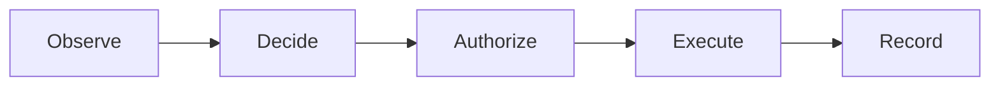

AETHER Documentation Bootstrap Alpha
Technical Report — Legacy Documentation Convergence, Machine-Readable Structure, and Atlas-Compatible Migration
Status: Proposed implementation guideline  
Scope: AETHER / ELECTROWEAK documentation reset before the next major development wave  
Primary objective: Deliver a clean, usable, machine-friendly documentation system now, while using the migration itself as the first real-world experiment for future AETHER Atlas / Project Knowledge Map concepts.  
Non-goal: Build Atlas as a production system during this migration.
---
Executive Summary
AETHER currently has a real and functioning codebase, but its documentation accumulated across multiple architectural generations, reviews, milestones, ADR sets, research notes, execution plans, diagrams, and partially superseded specifications. The problem is no longer lack of documentation; it is excess, duplication, mixed authority, stale knowledge, oversized documents, weak indexing, and poor machine locality.
The correct next step is not to manually reorganize every legacy Markdown file and not to wait for Atlas. Instead, AETHER should perform a Documentation Bootstrap Alpha: a constrained, evidence-driven migration that uses existing open-source parsers/indexers plus modern coding agents to perform most classification, reconciliation, synthesis, linking, and migration work.
The alpha must produce two things simultaneously:
A finished active documentation surface that is easy for Senior Engineers and AI coding agents to navigate today.
Empirical evidence for Atlas: which metadata, indexes, graph relations, extraction methods, prompts, heuristics, and machine-readable artifacts actually reduce reading time and token consumption in a real legacy repository.
The operational principle is:
> **Humans author canonical knowledge in ordinary Markdown; deterministic scripts extract structure; AI resolves semantic ambiguity; generated indexes make the repository machine-navigable; future Atlas can replace the bootstrap machinery without requiring another documentation rewrite.**
The migration should therefore optimize for compatibility with a future knowledge compiler, but remain deliberately simple enough to complete immediately.
---
1. Problem Statement
The current AETHER documentation tree contains valuable knowledge but exhibits several failure modes typical of mature or rapidly evolving repositories:
legacy taxonomies from previous project generations;
multiple documents describing the same subsystem;
historical architecture mixed with current architecture;
target architecture mixed with `AS_BUILT` behavior;
ADRs used as specifications, research papers, plans, or diaries;
project-management state preserved after becoming obsolete;
large documents that consume excessive agent context;
weak document-level machine identity;
references based mainly on paths rather than stable semantic identifiers;
inconsistent metadata;
repeated concepts with different names;
code symbols and tests insufficiently linked to the documents that describe them;
indexes designed primarily for humans rather than automated retrieval;
archived material still discoverable by naive semantic search;
no compact machine catalog that allows an agent to decide what not to read.
The existing repository already contains useful foundations. `docs/README.md` defines authority and role-based reading paths, while `docs/07_engineering/documentation.md` defines metadata and automated linting. The Director Review v5 additionally recommends treating the current numbered documentation taxonomy as legacy, extracting only still-valid information, rebuilding a smaller active tree, and relying on Git for historical recovery.
The Bootstrap Alpha should preserve those useful principles while simplifying their implementation.
---
2. Success Definition
The migration is complete when all of the following are true.
2.1 Human usability
A new Senior Engineer can answer, without reading historical material:
What is AETHER?
How is the system architected?
How does execution proceed?
What are the kernel boundaries and invariants?
How are agents configured and executed?
What are the exact contracts, schemas, protocols, and events?
How do I add an agent, plugin, tool, model, adapter, or workflow?
How do persistence, replay, recovery, artifacts, and provenance work?
What work remains active?
Why do the small set of non-obvious architectural decisions exist?
2.2 Machine usability
A coding agent can:
list all active documents without scanning the full tree;
identify a document by stable ID;
retrieve a 1–3 sentence summary before loading the body;
distinguish architecture, reference, guide, decision, theory, and execution material;
distinguish `IMPLEMENTED`, `PARTIAL`, `PLANNED`, `EXPERIMENTAL`, and `OBSOLETE`;
determine authority and freshness;
locate related code, tests, schemas, and other documents;
obtain a bounded task-oriented context bundle;
exclude historical documentation by default.
2.3 Migration quality
The reset must:
preserve every currently required invariant and contract;
avoid silently promoting theory to implementation;
avoid silently deleting unresolved knowledge;
remove duplicate canonical ownership;
remove obsolete active documentation;
leave historical material recoverable through Git;
pass automated metadata and link validation;
produce a machine-readable catalog and relation index.
2.4 Atlas experiment success
The alpha should collect at least:
number of legacy files inspected;
number of documents retained, rewritten, merged, or removed;
number of semantic conflicts detected;
percentage automatically classified;
percentage requiring AI reconciliation;
percentage requiring human intervention;
tokens used by baseline "read broadly" workflows;
tokens used after indexed routing;
retrieval/navigation steps before and after;
stale links and stale code references detected;
code↔documentation relation coverage.
These results become direct design input for Atlas.
---
3. Governing Principle: Clean Active Surface, Rich Generated Index
The active repository should have two layers:
```text
AUTHOR-MAINTAINED KNOWLEDGE
Markdown + schemas + code + tests
            │
            ▼
GENERATED MACHINE INDEX
catalog + relations + summaries + context manifests
```
Do not create a manually maintained knowledge graph.
Do not require Obsidian.
Do not require a graph database.
Do not make generated JSON the primary documentation.
Markdown remains the human source of knowledge. Machine-oriented representations are generated from it and from the repository.
This gives the migration a clean upgrade path:
```text
Bootstrap scripts today
        │
        ▼
same document metadata contract
        │
        ▼
Atlas Knowledge Compiler later
```
No second documentation migration should be required merely because Atlas becomes available.
---
4. Target Active Documentation Tree
Use a small information architecture organized by purpose, not by historical authority tier and not by source-code package.
```text
/
├── README.md
├── VISION.md
├── AGENTS.md
│
├── docs/
│   ├── README.md
│   ├── SPEC.md
│   │
│   ├── architecture/
│   │   ├── overview.md
│   │   ├── system-context.md
│   │   ├── components.md
│   │   │
│   │   ├── runtime/
│   │   │   ├── execution-model.md
│   │   │   ├── kernel.md
│   │   │   ├── agency.md
│   │   │   ├── orchestration.md
│   │   │   ├── events-ledger.md
│   │   │   ├── artifacts.md
│   │   │   ├── persistence-recovery.md
│   │   │   └── concurrency.md
│   │   │
│   │   ├── extensibility/
│   │   │   ├── agents.md
│   │   │   ├── manifests.md
│   │   │   ├── plugins.md
│   │   │   ├── packs.md
│   │   │   ├── tools.md
│   │   │   ├── models.md
│   │   │   ├── evaluators.md
│   │   │   └── adapters.md
│   │   │
│   │   ├── state/
│   │   │   ├── identity-lineage.md
│   │   │   ├── memory-context.md
│   │   │   ├── persistence.md
│   │   │   └── configuration.md
│   │   │
│   │   └── diagrams/
│   │       ├── system.md
│   │       ├── execution.md
│   │       ├── agent-lifecycle.md
│   │       └── recovery.md
│   │
│   ├── reference/
│   │   ├── README.md
│   │   ├── contracts/
│   │   ├── protocols/
│   │   ├── events.md
│   │   ├── schemas.md
│   │   ├── configuration.md
│   │   ├── cli.md
│   │   └── service-api.md
│   │
│   ├── guides/
│   │   ├── README.md
│   │   ├── development.md
│   │   ├── testing.md
│   │   ├── debugging.md
│   │   ├── add-agent.md
│   │   ├── add-plugin.md
│   │   ├── add-pack.md
│   │   ├── add-tool.md
│   │   ├── add-model.md
│   │   ├── add-adapter.md
│   │   ├── create-workflow.md
│   │   ├── benchmarking.md
│   │   └── release.md
│   │
│   ├── decisions/
│   │   ├── README.md
│   │   └── ADR-xxxx-*.md
│   │
│   ├── execution/
│   │   ├── milestones.md
│   │   ├── backlog.md
│   │   ├── sprint_active.md
│   │   └── sprint_upcoming.md
│   │
│   └── theory/
│       ├── README.md
│       ├── causal-computation.md
│       ├── resource-model.md
│       ├── agent-composition.md
│       ├── evaluation-and-learning.md
│       └── self-improvement.md
│
├── benchmarks/
│   ├── README.md
│   ├── suites/
│   └── reports/
│
├── schemas/
├── tools/
├── vanguard/
└── test/
```
The exact leaf names may change when the real inventory shows a better grouping. The top-level semantic categories should remain stable.
---
5. Information Ownership Rules
Every durable fact must have one canonical owner.
Question	Canonical location
What is AETHER?	`VISION.md`, `docs/SPEC.md`
How is it structured?	`docs/architecture/`
What is the exact shape/interface/event/config?	`docs/reference/`, `schemas/`
How do I perform a task?	`docs/guides/`
Why was a non-obvious choice made?	`docs/decisions/`
What are we working on now?	`docs/execution/`
What is conceptual/research/future theory?	`docs/theory/`
What happened in a benchmark?	`benchmarks/reports/`
What does production actually do?	code + executable tests
Anti-duplication rule
> **One fact → one canonical owner → other documents link to it.**
Architecture documents should not reproduce full event catalogs.  
Guides should not redefine contracts.  
ADRs should not become specifications.  
Execution documents should not preserve architecture history.  
Theory should not imply production status.
---
6. Minimal Machine-Readable Document Contract
Every active Markdown document should have standardized YAML frontmatter.
The alpha should intentionally keep the mandatory schema small.
6.1 Required metadata
```yaml
---
id: arch.runtime.kernel
type: architecture
status: implemented
title: Kernel
summary: Domain-blind authority, capability, budget, and effect mediation boundary.
area: runtime
authority: descriptive
last_verified: 2026-08-29
---
```
Required fields
Field	Meaning
`id`	Stable semantic identifier independent of file path
`type`	Information category
`status`	Implementation/maturity state
`title`	Human title
`summary`	Short routing summary
`area`	Project subsystem
`authority`	Normative role
`last_verified`	Last explicit reconciliation against current repository
6.2 Controlled values
`type`
```text
vision
spec
architecture
reference
guide
decision
execution
theory
navigation
```
`status`
```text
implemented
partial
planned
experimental
obsolete
```
`authority`
```text
constitutional
normative
binding-decision
reference
descriptive
operational
research
```
Do not introduce new enum values casually. A controlled vocabulary is essential for machine filtering.
---
7. Optional Semantic Relations
Only relationships that add real routing value should be authored manually.
Example:
```yaml
---
id: arch.runtime.kernel
type: architecture
status: implemented
title: Kernel
summary: Domain-blind authority and effect mediation layer.
area: runtime
authority: descriptive
last_verified: 2026-08-29

relates_to:
  - concept.capability
  - concept.budget
  - arch.runtime.events-ledger

code:
  - vanguard/packages/kernel/

tests:
  - test/kernel/

schemas:
  - schemas/events/

decisions:
  - decision.domain-blind-kernel
---
```
Important
Do not manually encode:
every import;
every function;
every caller;
every Git relation;
every symbol;
every heading;
every code reference.
Those should be extracted later by scripts or Atlas.
Manual metadata should represent semantic intent, not repository topology.
---
8. Stable IDs
Paths change. Concepts should not.
Use stable IDs with a namespace-like pattern:
```text
arch.runtime.kernel
arch.runtime.agency
arch.ext.plugins
ref.events
ref.protocol.model
guide.add-agent
decision.domain-blind-kernel
theory.causal-computation
exec.milestones
```
Rules
IDs are lowercase.
IDs are semantic, not path hashes.
Renaming a file does not require changing the ID.
Moving a file does not require changing the ID.
IDs must be globally unique.
IDs should not encode version numbers unless the version is semantically part of the entity.
Generated indexes map ID → path.
This is the first Atlas-compatible abstraction worth preserving permanently.
---
9. Document Size and Progressive Disclosure
Large Markdown documents are expensive for both humans and agents.
Adopt a simple rule:
> A document should represent one coherent information unit and should be small enough that an agent can load it without ingesting unrelated subsystems.
Avoid arbitrary hard limits, but track:
```text
bytes
lines
headings
estimated_tokens
```
Generated catalog example:
```json
{
  "id": "arch.runtime.kernel",
  "path": "docs/architecture/runtime/kernel.md",
  "summary": "Domain-blind authority and effect mediation layer.",
  "estimated_tokens": 1830
}
```
This enables context budgeting later.
Progressive reading levels
Each document effectively exposes:
```text
L0: ID + title
L1: summary/frontmatter
L2: table of contents/headings
L3: selected sections
L4: full document
```
Agents should not default to L4.
---
10. Required Document Shape
Architecture pages should follow a predictable structure.
10.1 Architecture template
```markdown
# Kernel

## Purpose
## Responsibilities
## Non-responsibilities
## Boundaries
## Inputs and outputs
## Execution flow
## State and lifecycle
## Invariants
## Failure semantics
## Extension points
## Code map
## Tests and evidence
## Related documentation
```
10.2 Reference template
```markdown
# Effect Request

## Definition
## Fields
## Constraints
## Producers
## Consumers
## Failure cases
## Schema/source
## Tests
```
10.3 Guide template
```markdown
# Add a Tool

## Goal
## Preconditions
## Files/components involved
## Procedure
## Verification
## Common failures
## Related reference
```
10.4 ADR template
```markdown
# ADR-XXXX — Domain-Blind Kernel

## Decision
## Context
## Why
## Consequences
## Relevant code/contracts
## Reversal condition
```
10.5 Theory template
```markdown
# Resource Model

## Motivation
## Formal model
## Relationship to AETHER
## Current implementation status
## Open questions
## References
```
The purpose of templates is not bureaucracy. It gives humans predictable navigation and gives machines predictable section semantics.
---
11. Generated Machine Catalog
Create a disposable alpha tool, for example:
```text
tools/docs_alpha/
```
It should generate:
```text
.generated/docs/
├── catalog.jsonl
├── relations.jsonl
├── headings.jsonl
├── code-links.jsonl
├── unresolved.jsonl
├── context-bundles/
└── report.md
```
These artifacts are generated and must never become another manually maintained documentation layer.
11.1 `catalog.jsonl`
One line per active document:
```json
{"id":"arch.runtime.kernel","type":"architecture","status":"implemented","path":"docs/architecture/runtime/kernel.md","summary":"Domain-blind authority and effect mediation layer.","tokens":1830}
```
11.2 `headings.jsonl`
```json
{"doc":"arch.runtime.kernel","anchor":"invariants","title":"Invariants","level":2,"line":91}
```
11.3 `relations.jsonl`
```json
{"source":"arch.runtime.kernel","relation":"relates_to","target":"concept.capability","origin":"frontmatter"}
```
11.4 `code-links.jsonl`
Initially this can be explicit references extracted from Markdown:
```json
{"doc":"arch.runtime.kernel","path":"vanguard/packages/kernel/","kind":"code"}
```
Later Tree-sitter, SCIP, ast-grep, or Atlas can enrich this automatically.
---
12. Alpha Toolchain: Frankenstein by Design
The migration should deliberately use existing tools rather than build production infrastructure.
The goal is to learn what works.
12.1 Baseline deterministic layer
Use normal filesystem/Git tooling for:
enumerate files;
respect `.gitignore`;
compute hashes;
obtain Git modification history;
detect renamed files;
validate paths;
count tokens approximately;
identify Markdown documents.
12.2 Markdown parsing
Use an existing parser rather than regex for structural extraction.
Possible implementation choices:
`pulldown-cmark`;
`comrak`;
Python Markdown tooling for the temporary alpha.
Required extraction:
YAML frontmatter;
title;
headings;
links;
code fences;
referenced paths;
anchors.
12.3 Legacy format normalization
If non-Markdown documentation exists:
```text
HTML / RST / DOCX / Org / AsciiDoc / LaTeX
        │
        ▼
      Pandoc
        │
        ▼
normalized Markdown candidate
```
Do not write document converters.
12.4 Code structure
For the alpha, start cheap:
path and module heuristics;
explicit symbol names mentioned in docs;
`rg` / static search;
ast-grep or Tree-sitter for selected languages;
SCIP if available and useful.
The alpha does not need perfect cross-language code intelligence to finish the documentation reset.
12.5 Search
For temporary migration workflows:
`rg` for exact text;
filename/path matching;
headings/ID catalog;
optional BM25/indexing if useful.
Do not build a search engine merely to migrate the docs.
---
13. AI Role: Semantic Reconciliation, Not Repository Crawling
A modern coding agent such as Claude Code or Codex should not be asked:
> Read all documentation and reorganize it.
That wastes context and produces unstable global judgments.
Instead:
```text
deterministic inventory
        ↓
cluster/topic packet
        ↓
coding agent
        ↓
structured reconciliation
        ↓
deterministic validation
```
AI should handle:
whether two differently named concepts represent the same thing;
whether a legacy statement still describes current behavior;
which of several conflicting descriptions is consistent with code/tests;
whether content is architecture, reference, guide, decision, theory, or obsolete;
synthesizing canonical prose from verified facts;
proposing semantic links;
identifying unresolved conflicts.
AI should not be used for:
enumerating files;
parsing headings;
checking whether a file exists;
verifying links;
counting tokens;
moving files deterministically;
finding exact code strings;
reading Git timestamps;
validating metadata enums.
---
14. Migration Work Packets
The key productivity mechanism is to convert the legacy tree into small, bounded AI tasks.
Example:
```yaml
task_id: docs-reconcile-kernel
topic: kernel
objective: >
  Produce the canonical current-state Kernel architecture page from the
  supplied legacy documents and implementation evidence.

legacy_sources:
  - docs/01_law/SECURITY.md
  - docs/04_architecture/...
  - docs/_archive/.../review_v4/...
  - docs/_archive/.../review_v5/...

current_evidence:
  code:
    - vanguard/packages/kernel/
  tests:
    - test/...
  schemas:
    - schemas/...

target:
  path: docs/architecture/runtime/kernel.md
  id: arch.runtime.kernel

constraints:
  - describe AS_BUILT behavior as implemented
  - label missing Vision behavior as gap/planned
  - do not preserve historical narrative
  - do not duplicate exact schema tables
  - cite code/test paths for non-obvious claims
  - list unresolved contradictions explicitly
```
A packet is small enough that a coding agent can reason deeply without reading the entire repository.
---
15. Recommended AI Passes
Do not combine every task into one mega-prompt.
Pass 1 — Inventory classification
For each legacy file:
```text
KEEP
MERGE
REWRITE
SPLIT
OBSOLETE
RESEARCH_ONLY
UNRESOLVED
```
Also assign:
```text
architecture
reference
guide
decision
execution
theory
```
Output should be machine-readable JSON or YAML.
Pass 2 — Topic clustering
Group files around concepts such as:
```text
kernel
events
ledger
artifacts
agents
manifests
orchestration
plugins
tools
models
evaluation
memory
recovery
configuration
```
Use deterministic keyword/path hints first; ask AI only for ambiguous placement.
Pass 3 — Evidence reconciliation
For each cluster:
```text
legacy claims
    +
current code
    +
tests
    +
schemas
    +
Vision/SPEC obligations
        ↓
implemented facts
partial facts
planned obligations
obsolete statements
conflicts
```
Pass 4 — Canonical synthesis
Generate the target document using the appropriate template.
Pass 5 — Cross-document review
Check:
duplication;
conflicting status;
duplicated authority;
missing links;
claims without evidence;
oversized documents;
theory presented as implementation.
Pass 6 — Human exception review
Humans review:
unresolved contradictions;
constitutional changes;
important ADR decisions;
uncertain deletions;
architecture claims not evidenced by tests/code.
Humans should not manually review every moved paragraph.
---
16. Authority Model During Migration
Use an explicit evidence hierarchy, but do not collapse target requirements into current implementation.
Recommended reasoning:
```text
VISION
  defines identity/direction
      │
SPEC / accepted current decisions
  define normative obligations
      │
schemas/contracts
  define executable interface truth
      │
production code
  defines implemented behavior
      │
tests/benchmarks
  provide executable evidence
      │
descriptive docs
  explain the above
      │
historical reviews/plans
  candidate evidence only
```
A conflict must be represented rather than silently resolved incorrectly.
Example:
```text
VISION/SPEC: feature required
CODE:        feature absent
TEST:        feature absent
```
Correct result:
```text
status = planned / gap
```
Not:
```text
delete Vision requirement
```
And not:
```text
claim implemented
```
---
17. Legacy Knowledge Ledger
Before deleting legacy documentation, produce one temporary reconciliation ledger.
Suggested file:
```text
.generated/docs/migration-ledger.jsonl
```
Example:
```json
{
  "source": "docs/04_architecture/old_kernel.md",
  "classification": "merge",
  "targets": ["arch.runtime.kernel"],
  "valid_claims": 12,
  "obsolete_claims": 7,
  "unresolved_claims": 1
}
```
This is not permanent project documentation.
It is migration evidence.
After the reset is validated, Git remains the historical archive.
---
18. Migration Matrix
For operational work, generate a compact table:
Legacy source	Topic	Status	Canonical target	Evidence checked	Action
old kernel architecture	Kernel	mixed	`arch.runtime.kernel`	code/tests/SPEC	merge
historical Director review	multiple	historical	none	current docs/code	delete active
old tool guide	Tools	current	`guide.add-tool`	code/tests	rewrite
active inference paper	Theory	research	`theory.*`	implementation scan	retain as theory
obsolete sprint	Execution	obsolete	none	current board	delete
This becomes the project board for the Documentation Engineer.
---
19. Link Code and Documentation Now, Without Atlas
Do not wait for symbol-level graph infrastructure.
Add lightweight explicit links at the architecture/reference level.
Example:
```markdown
## Code map

- Kernel package: `vanguard/packages/kernel/`
- Runtime composition: `vanguard/...`
- Event definitions: `vanguard/...`
- Schemas: `schemas/...`

## Verification

- `test/...`
- `test/...`
```
This gives immediate value to humans and agents.
Later, Atlas can resolve these into symbol-level relations.
Rule
Use directory/module-level links where they are stable.
Do not manually maintain hundreds of line-number references.
---
20. Generated Reverse Code Map
A simple script can scan frontmatter `code:` and `tests:` fields and generate:
```text
.generated/docs/code-map.jsonl
```
Example:
```json
{"path":"vanguard/packages/kernel/","documents":["arch.runtime.kernel","decision.domain-blind-kernel"]}
```
This immediately supports:
> Which documentation should I inspect before modifying this package?
No graph database required.
---
21. Human Navigation Index
`docs/README.md` should become a short catalog, not another architecture document.
Recommended structure:
```markdown
# AETHER Documentation

## Start here
- Product / Vision
- Architecture overview
- Development guide
- Active execution

## By information type
- Architecture
- Reference
- Guides
- Decisions
- Execution
- Theory

## By subsystem
- Kernel
- Agency
- Runtime
- Events
- Artifacts
- Persistence
- Agents
- Workflows
- Plugins
- Tools
- Models
- Evaluation

## Machine index
Generated catalog: `.generated/docs/catalog.jsonl`
```
Humans navigate semantically; agents can load the generated catalog first.
---
22. Context Bundles Before Atlas
One of the most valuable Atlas hypotheses can be tested immediately.
Create declarative context manifests, preferably generated under:
```text
.generated/docs/context-bundles/
```
Example:
```yaml
id: context.kernel-change
summary: Minimum documentation set for kernel-sensitive changes.

include:
  - docs/SPEC.md
  - arch.runtime.kernel
  - ref.events
  - guide.testing

code:
  - vanguard/packages/kernel/

tests:
  - test/kernel/
```
Then a small script:
```bash
python tools/docs_alpha/context.py kernel-change
```
prints resolved files and estimated token cost.
Later:
```bash
atlas context "change capability attenuation"
```
can replace this mechanism.
The experiment directly measures whether precompiled context reduces token usage.
---
23. AI Agent Instructions
Add a compact machine-operating contract to `AGENTS.md`.
Example:
```markdown
## Documentation retrieval

1. Do not recursively read all of `docs/`.
2. Read `docs/README.md` or the generated catalog first.
3. Resolve the subsystem/task.
4. Load architecture before exact reference only when conceptual context is needed.
5. Load exact contracts/schemas before modifying interfaces.
6. Treat `theory/` as non-production unless status says otherwise.
7. Ignore historical material unless explicitly requested.
8. Prefer code/tests as evidence of current implementation behavior.
9. Do not create a new document when an existing canonical owner exists.
10. Update `last_verified` only after checking the relevant implementation/evidence.
```
This alone can materially reduce agent context waste.
---
24. Automation Scripts
The alpha needs only a small suite.
```text
tools/docs_alpha/
├── inventory.py
├── validate_metadata.py
├── build_catalog.py
├── build_relations.py
├── build_code_map.py
├── estimate_tokens.py
├── find_duplicates.py
├── find_stale_paths.py
├── build_packets.py
├── validate_migration.py
└── report.py
```
Existing AETHER linters should be reused or adapted instead of duplicated where possible.
24.1 `inventory`
Outputs every Markdown file, size, metadata, status, title, headings, links, age, and rough token count.
24.2 `validate_metadata`
Checks:
required fields;
enum values;
unique IDs;
valid dates;
duplicate canonical IDs.
24.3 `build_catalog`
Generates compact JSONL for agents.
24.4 `build_relations`
Extracts explicit semantic relations and document links.
24.5 `build_code_map`
Validates `code`, `tests`, and `schemas` paths and generates reverse mappings.
24.6 `find_duplicates`
Start with cheap signals:
identical hashes;
near-identical titles;
repeated headings;
high lexical similarity;
repeated canonical IDs;
duplicate summaries.
AI can review ambiguous semantic duplicates.
24.7 `build_packets`
Creates bounded files for Claude/Codex reconciliation.
24.8 `validate_migration`
Ensures:
no unresolved critical claims;
no duplicate IDs;
no broken paths;
no orphan target docs;
active docs have required metadata;
no active link points into deleted legacy content unless explicitly historical.
---
25. Example Inventory Record
```json
{
  "path": "docs/04_architecture/c4_component.md",
  "title": "C4 Component Architecture",
  "metadata": {
    "status": "living",
    "implementation_status": "AS_BUILT"
  },
  "bytes": 18420,
  "estimated_tokens": 4510,
  "headings": [
    "Runtime",
    "Kernel",
    "Agency"
  ],
  "code_refs": [
    "vanguard/..."
  ],
  "links": 17,
  "git_last_change": "2026-08-26"
}
```
The agent can inspect this record before deciding whether the full file is worth reading.
---
26. Example Reconciliation Output
Require structured agent output.
```json
{
  "topic": "kernel",
  "canonical_target": "docs/architecture/runtime/kernel.md",
  "canonical_id": "arch.runtime.kernel",
  "sources": [
    {
      "path": "docs/04_architecture/old_kernel.md",
      "action": "merge"
    },
    {
      "path": "docs/_archive/reviews/.../kernel_notes.md",
      "action": "historical-only"
    }
  ],
  "facts": [
    {
      "statement": "The kernel remains domain blind.",
      "status": "implemented",
      "evidence": [
        "vanguard/...",
        "test/..."
      ]
    }
  ],
  "conflicts": [],
  "unresolved": []
}
```
Rust/Go/Python does not matter for this alpha. The schema does.
---
27. Mermaid and Visual Documentation
Visuals should be treated as derived or semi-derived views of canonical architecture, not independent sources of truth.
For each major architecture page, allow a small Mermaid block when it improves comprehension:

Recommended visual categories:
system context;
container/component topology;
execution sequence;
state machine;
event/ledger flow;
agent lifecycle;
recovery/replay;
plugin/tool extension path;
context/memory flow.
Rules
Diagram nodes should use stable terminology from the docs.
Diagram text should not introduce new architectural claims.
Exact contracts remain in reference/schema documentation.
SVG may be generated from Mermaid for static uses.
Future Atlas should generate richer graphs from the knowledge model.
---
28. What Not to Build During the Alpha
Do not block documentation delivery on:
Neo4j;
Glean;
Joern;
vector database;
production GraphRAG;
custom embeddings pipeline;
custom LSP client;
distributed indexer;
interactive graph frontend;
Atlas MCP server;
proprietary parser;
custom static-analysis framework;
fully automatic ontology inference.
These are Atlas research topics, not prerequisites for a good documentation reset.
---
29. What to Experiment With
Use the migration to test candidate Atlas components only where they directly reduce work.
Experiment A — Markdown frontmatter
Question:
> Does stable metadata materially improve automated routing and migration?
Experiment B — AST/symbol enrichment
Question:
> Does ast-grep / Tree-sitter / SCIP improve code↔docs linking enough to justify integration complexity?
Experiment C — AI packetization
Question:
> Does giving Claude/Codex small evidence packets outperform repository-wide prompts in correctness, cost, and consistency?
Experiment D — Hierarchical retrieval
Question:
> How many tokens are saved by catalog → summary → heading → section → full-document progressive retrieval?
Experiment E — Context bundles
Question:
> Can a task-oriented manifest preserve answer quality while reducing context by an order of magnitude?
Experiment F — Generated graph
Question:
> Are the explicit metadata links plus code relations sufficient to generate useful Mermaid/Cytoscape views?
Experiments must never block the canonical documentation delivery.
---
30. Migration Execution Plan
D0 — Freeze and inventory
Establish the migration baseline:
```text
main commit
docs tree
source tree
schemas
tests
benchmark state
```
Generate inventory.
Do not move files yet.
Output:
```text
inventory.jsonl
baseline-report.md
```
D1 — Define target taxonomy and metadata
Create empty/new target directories.
Lock:
ID format;
metadata schema;
controlled vocabularies;
document templates;
canonical ownership rules.
Output:
```text
docs structure
metadata schema
templates
```
D2 — Classify legacy files
Run deterministic classification, then AI-assisted classification for ambiguous files.
Every legacy document receives:
```text
keep / merge / rewrite / split / obsolete / unresolved
```
and a target topic.
Output:
```text
migration-matrix.jsonl
migration-matrix.md
```
D3 — Build topic packets
Create one packet per major subsystem.
Suggested first wave:
```text
system overview
kernel
events/ledger
agency
runtime/orchestration
artifacts
persistence/recovery
agents/manifests
plugins/packs/tools
models
evaluation
memory/context
```
D4 — Reconcile current truth
For each topic:
```text
legacy docs
+
VISION/SPEC
+
code
+
tests
+
schemas
        ↓
reconciliation result
```
Do not write final prose until contradictions are resolved or explicitly labeled.
D5 — Synthesize canonical docs
The Documentation Engineer and AI produce new documents using the standardized templates.
Each page must:
have metadata;
use current terminology;
separate implemented vs planned;
include code/test pointers;
link rather than duplicate exact reference material;
omit historical narrative.
D6 — Build reference and guides
Extract exact interfaces separately.
Create task-oriented guides from real developer workflows.
This avoids turning architecture pages into giant all-purpose documents.
D7 — Rebuild decisions
Review old ADRs aggressively.
Only retain decisions that a current engineer genuinely needs.
Rewrite retained decisions concisely.
Do not mechanically preserve old numbering if a reset is intentionally adopted.
D8 — Build indexes and context bundles
Generate:
```text
catalog.jsonl
relations.jsonl
code-map.jsonl
context-bundles/*
```
Update `docs/README.md` and `AGENTS.md`.
D9 — Visual pass
Generate the minimum high-value Mermaid diagrams.
Do this after terminology and topology stabilize, not before.
D10 — Validation
Run:
```text
metadata validation
link validation
path validation
duplicate ownership scan
code path validation
unresolved conflict check
machine catalog build
context bundle resolution
```
Ask independent coding agents representative questions and measure retrieval.
D11 — Legacy removal
Only after validation:
delete superseded active docs;
remove historical reviews/plans from the normal active surface;
do not rebuild another `_archive` containing the same clutter;
rely on Git history for removed historical material.
---
31. Representative Validation Questions
The documentation is not done merely because Markdown renders.
Use a fixed evaluation suite.
Architecture
Explain the complete `Observe → Decide → Authorize → Execute → Record` path.
What belongs inside the kernel and what must remain outside it?
How does an Agent Manifest become a running agent?
How are subagents scoped and how is authority attenuated?
What is authoritative state and how is it reconstructed?
Implementation
Add a new tool.
Add a new model provider.
Add a plugin.
Add an evaluator.
Create a new workflow.
Modify event handling.
Change persistence/recovery behavior.
Diagnosis
Where would I inspect a failed effect authorization?
Which tests protect the kernel boundary?
Which docs are affected by changing an event schema?
Is concept X implemented, partial, planned, or experimental?
Retrieval
For each question measure:
```text
documents opened
tokens consumed
time/steps to first correct source
answer correctness
irrelevant context loaded
```
This becomes the initial Atlas benchmark.
---
32. Token-Efficiency Benchmark
Use two retrieval modes.
Baseline
Agent receives instructions similar to:
```text
Read the relevant repository documentation and source files and answer...
```
Structured
Agent receives:
```text
1. catalog.jsonl
2. task query
3. permission to request specific IDs/sections
```
Measure:
```text
context tokens
retrieval calls
documents opened
answer accuracy
missed evidence
latency
```
Target principle:
> Structured routing must reduce context substantially without reducing answer correctness.
Do not optimize token usage at the cost of missing governing constraints.
---
33. Documentation Freshness
Without Atlas, use simple freshness semantics.
`last_verified` means:
> A human or agent explicitly checked this document against its listed relevant code/contracts/tests at this date.
It does not mean "file was edited."
Later, a script can mark candidates stale when related paths change after `last_verified`.
Example generated warning:
```text
POSSIBLY STALE:
arch.runtime.kernel

Reason:
vanguard/packages/kernel/ changed after 2026-08-29.
```
This is a useful Atlas concept that can be validated cheaply.
---
34. Documentation Change Contract
After the reset, every code PR should answer:
```text
Does this change alter:
[ ] architecture
[ ] public contract
[ ] protocol/event/schema
[ ] developer workflow
[ ] non-obvious decision
[ ] none
```
If yes, update the canonical owner.
Do not create a new document unless no owner exists.
This prevents the migration from immediately degrading again.
---
35. Documentation Engineer Operating Model
The Senior Documentation / Frontend / UIUX Engineer should own:
information architecture;
document templates;
metadata quality;
canonical ownership;
navigation;
visual architecture;
AI migration prompts;
generated indexes;
documentation UX;
retrieval experiments;
Atlas hypotheses discovered during migration.
They should not become the sole authority for backend truth.
For technical claims:
```text
documentation engineer
       +
production code
       +
tests/schemas
       +
responsible backend engineer when ambiguous
```
The role is knowledge architecture and synthesis, not invention of runtime behavior.
---
36. Coding Agent Operating Model
Claude Code, Codex, or another harness can perform the bulk migration.
Recommended loop:
```text
GET PACKET
   ↓
inspect only supplied/current evidence
   ↓
classify claims
   ↓
resolve terminology
   ↓
draft canonical page
   ↓
run linters/tests/path checks
   ↓
return unresolved items
```
Prompts should prohibit:
reading `_archive` indiscriminately;
treating old reviews as authority;
inventing missing behavior;
moving unrelated files;
changing production code during documentation reconciliation unless explicitly authorized;
silently resolving normative conflicts.
---
37. Suggested Prompt — Documentation Reconciler
```text
You are reconciling one bounded AETHER documentation topic.

Your goal is to produce current, concise, machine-readable documentation,
not to preserve project history.

Use the supplied evidence hierarchy:
1. VISION for identity/direction.
2. SPEC/current binding decisions for normative requirements.
3. schemas/contracts for executable interface facts.
4. production code for implemented behavior.
5. tests/benchmarks for behavioral evidence.
6. existing descriptive documentation as candidate explanation.
7. archived reviews/plans only as historical candidate knowledge.

For every important claim classify it as:
IMPLEMENTED, PARTIAL, PLANNED, EXPERIMENTAL, OBSOLETE, or UNRESOLVED.

Do not infer that a planned feature is implemented.
Do not delete a normative requirement merely because implementation is missing.
Do not copy historical narrative into the canonical page.
Do not duplicate exact schemas or contracts when a reference page can own them.

Produce:
1. structured reconciliation result;
2. list of conflicts/unresolved claims;
3. proposed canonical document;
4. code/tests/schemas that substantiate the document;
5. legacy sources safe to remove after validation.
```
---
38. Suggested Prompt — Independent Documentation Reviewer
```text
Review the proposed canonical AETHER documentation for this topic against
the supplied current code, tests, schemas, VISION, SPEC, and migration ledger.

Find:
- claims not supported by evidence;
- implemented behavior omitted from the document;
- planned/theoretical behavior described as implemented;
- duplicated canonical ownership;
- stale terminology;
- missing code/test links;
- contradictions with higher-authority material;
- unnecessary historical narrative;
- sections too broad for efficient machine retrieval.

Return only actionable findings with evidence.
```
---
39. Acceptance Gates
Gate A — Structure
target tree exists;
each top-level category has one purpose;
no parallel legacy taxonomy remains active.
Gate B — Metadata
100% of active docs have valid IDs;
IDs are unique;
required metadata exists;
controlled vocabularies validate.
Gate C — Truth
major architecture pages verified against current code/tests;
no critical unresolved contradiction is hidden;
implementation status explicitly distinguishes current vs future.
Gate D — Ownership
no important fact has multiple canonical owners;
reference information is not duplicated across architecture/guides;
theory is separated from runtime description.
Gate E — Machine navigation
The machine catalog can answer:
list active docs;
find by ID;
filter by type/status/area;
locate related code/tests;
estimate context cost.
Gate F — Human navigation
A Senior Engineer can navigate from `docs/README.md` to the relevant material without consulting history.
Gate G — Agent retrieval
Representative agent tasks use the catalog/context routing successfully and consume materially less irrelevant context than baseline.
Gate H — Legacy deletion
No required invariant, contract, protocol, security rule, compatibility requirement, or non-obvious current decision exists only in a file being removed.
---
40. Definition of Done
The Documentation Bootstrap Alpha is complete when:
```text
AETHER CURRENT CODE
        ║
        ║ consistent
        ▼
AETHER ACTIVE DOCS
        │
        ├── human-readable
        ├── machine-addressable
        ├── indexed
        ├── status-labelled
        ├── code-linked
        ├── test-linked
        └── low-duplication
        │
        ▼
GENERATED KNOWLEDGE INDEX
        │
        ├── catalog
        ├── relations
        ├── code map
        └── context bundles
```
and historical clutter is no longer required for ordinary development.
---
41. Future Atlas Compatibility
The alpha should deliberately preserve concepts likely to survive into Atlas:
```text
Document ID
Entity ID
Type
Status
Summary
Area
Authority
Locator
Relation
Evidence link
Revision/freshness
```
Future Atlas can enrich this with:
```text
AST symbols
SCIP identities
call/reference graphs
Git co-change
BM25
embeddings
semantic clusters
claims
evidence scoring
GraphRAG
context compilation
interactive visualization
drift detection
cross-repository knowledge
```
The canonical Markdown should not need to change substantially.
This is the key architectural constraint:
> **The Bootstrap Alpha should be replaceable by Atlas, while the documentation authored during the alpha should remain valid input to Atlas.**
---
42. Recommended Immediate Implementation
Start with the minimum system that delivers value:
```text
Markdown
+
minimal YAML metadata
+
existing AETHER linters
+
new inventory/catalog scripts
+
Git/rg
+
optional Markdown parser
+
Claude Code or Codex work packets
+
human exception review
```
Then experimentally introduce:
```text
ast-grep / Tree-sitter
SCIP
Pandoc
generated Mermaid
simple graph visualization
```
only where the migration demonstrates measurable benefit.
Do not let tooling experiments delay completion of the canonical docs.
---
43. Final Architecture of the Alpha
```text
                   AETHER REPOSITORY
                         │
             ┌───────────┴───────────┐
             │                       │
         LEGACY DOCS              CODE/EVIDENCE
             │                       │
             └───────────┬───────────┘
                         ▼
               DETERMINISTIC INVENTORY
                         │
                         ▼
               CLASSIFICATION / CLUSTER
                         │
              ┌──────────┴──────────┐
              │                     │
        deterministic           ambiguous
              │                     │
              │                     ▼
              │              CLAUDE / CODEX
              │                     │
              └──────────┬──────────┘
                         ▼
                 RECONCILIATION
                         │
                         ▼
                 CANONICAL MARKDOWN
                         │
               ┌─────────┼─────────┐
               ▼         ▼         ▼
             humans    catalog    diagrams
                         │
                         ▼
                  agent retrieval
                         │
                         ▼
                 future ATLAS input
```
---
44. Core Decision
AETHER should not manually migrate from a messy documentation repository directly into a hypothetical final Atlas representation.
Instead, it should perform a deliberately pragmatic intermediate step:
> **Normalize the active knowledge into small canonical Markdown documents with stable semantic IDs, minimal metadata, explicit implementation status, clear ownership, and lightweight code/evidence links; generate all indexes automatically; use AI only to reconcile ambiguity; use the migration as the first benchmark for Atlas.**
This gives the project the documentation it needs immediately while producing the exact empirical evidence required to design Atlas correctly later.
---
Appendix A — Minimal Frontmatter Schema
```yaml
---
id: arch.runtime.kernel
type: architecture
status: implemented
title: Kernel
summary: Domain-blind authority and effect mediation layer.
area: runtime
authority: descriptive
last_verified: 2026-08-29

relates_to:
  - arch.runtime.events-ledger

code:
  - vanguard/packages/kernel/

tests:
  - test/kernel/

schemas: []
decisions: []
---
```
Only the first seven semantic fields plus `last_verified` should be mandatory during the alpha.
---
Appendix B — Minimal Catalog Schema
```json
{
  "id": "arch.runtime.kernel",
  "path": "docs/architecture/runtime/kernel.md",
  "type": "architecture",
  "status": "implemented",
  "area": "runtime",
  "authority": "descriptive",
  "summary": "Domain-blind authority and effect mediation layer.",
  "last_verified": "2026-08-29",
  "estimated_tokens": 1830,
  "code": ["vanguard/packages/kernel/"],
  "tests": ["test/kernel/"]
}
```
---
Appendix C — Migration Actions
```text
KEEP
    Content and ownership are already appropriate.

MOVE
    Content is valid and already canonical; only location changes.

REWRITE
    Knowledge remains valid but structure/terminology is unsuitable.

MERGE
    Multiple documents share one canonical owner.

SPLIT
    One oversized document contains multiple independently retrievable units.

REFERENCE
    Exact technical material should move to reference/schema ownership.

THEORY
    Valid idea, but not current implementation.

OBSOLETE
    No current engineering value; Git preserves history.

UNRESOLVED
    Conflicting or insufficient evidence; requires explicit review.
```
---
Appendix D — Machine Retrieval Algorithm for the Alpha
A simple retrieval flow can already test Atlas assumptions:
```text
query
  ↓
exact ID / path / title
  ↓
filter active docs
  ↓
filter type + area + status
  ↓
rank title/summary match
  ↓
inspect headings
  ↓
load selected sections
  ↓
follow explicit code/test/reference links
```
Optional enrichment:
```text
BM25
AST/symbol match
graph neighbors
semantic embeddings
```
should only be added after baseline measurement.
---
Appendix E — Repository-Specific Inputs
This report should be reconciled against the following current AETHER sources before execution:
`VISION.md`
`AGENTS.md`
`docs/README.md`
`docs/SPEC.md`
`docs/07_engineering/documentation.md`
`docs/_archive/reviews/backend/director_review_v5/TODO_V090_MASTERPLAN_GUIDELINE.md`
current `docs/` tree
current production source tree
`schemas/`
`test/`
current benchmark reports
The v5 guideline is particularly important because it already establishes the desired hard reset principle: extract still-valid knowledge, rebuild the active documentation surface, verify that no required rule exists only in a document scheduled for removal, and rely on Git rather than reconstructing a second archive.
---
Appendix F — One-Page Operating Rule
```text
WRITE FOR HUMANS
PARAMETERIZE FOR MACHINES
GENERATE INDEXES
LINK TO EVIDENCE
USE AI FOR AMBIGUITY
KEEP ONE CANONICAL OWNER
SEPARATE CURRENT FROM FUTURE
DELETE HISTORICAL CLUTTER AFTER VALIDATION
MEASURE TOKEN / RETRIEVAL IMPROVEMENT
DESIGN THE OUTPUT SO ATLAS CAN INGEST IT LATER
```