# C4 Context View (System Perimeter)

> **Status:** `AS_BUILT` · Descriptive View. Governing normative law: [`docs/SPEC.md`](../SPEC.md).

```mermaid
flowchart TD
    Operator["Human Operator / Developer"] -->|Issues prompts & approves privileged effects| CLI["TypeScript / Ink CLI (vg)"]
    CLI -->|UDS JSON-RPC 2.0 / Stream Protocol| Runtime["Vanguard Substrate (Python)"]
    
    Runtime -->|Evaluates prompts| Models["Model Providers (OpenRouter / Ollama / Fake)"]
    Runtime -->|Executes tool side-effects in UID 10001| Sandbox["Rootless Bubblewrap Sandbox"]
    Runtime -->|Requests signed grading from UID 10002| Evaluator["Exterior Evaluator Daemon"]
    
    Evaluator -->|Returns Ed25519-signed verdicts| Runtime
    Runtime -->|Appends immutable envelopes| WAL["SQLite WAL Event Store"]
```

## System Boundaries & Separation

1. **Separability Thesis**: The solution and execution traces are strictly separable from the agent itself.
2. **Evaluator Isolation (Invariant I-5)**: The grading judge runs as an independent exterior process (UID `10002`) and communicates exclusively via cryptographic Ed25519-signed verdicts over UDS.
3. **Execution Sandbox (Invariant I-6)**: Untrusted process execution is contained inside a rootless bubblewrap container (UID `10001`) with read-only root mounts and ephemeral tmpfs workspaces.
