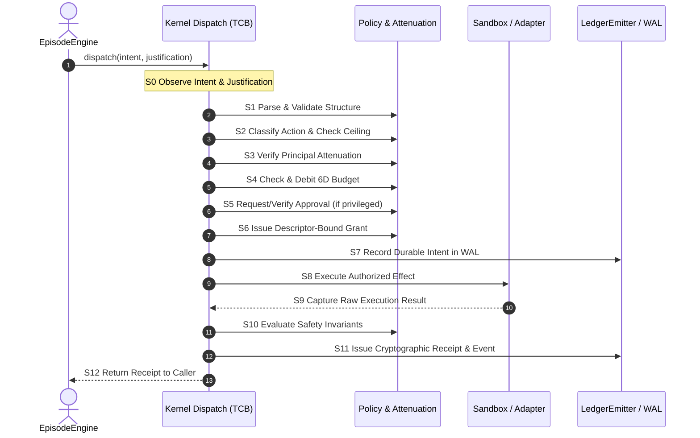
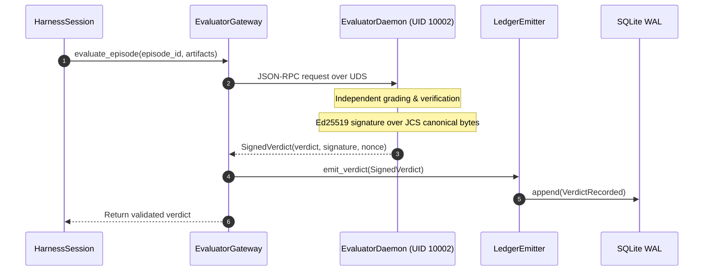
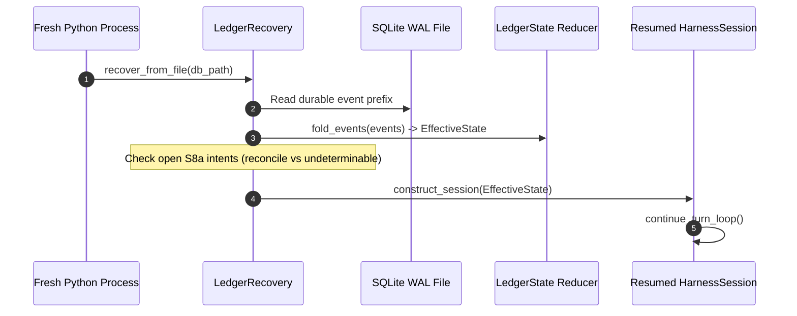

# Subsystem Sequence Flows

> **Status:** `AS_BUILT` · Descriptive View.

---

## 1. 13-Stage Kernel Effect Dispatch Pipeline (S0–S12)

Governed by [`docs/04_annex/KERNEL.md`](../04_annex/KERNEL.md) and implemented in [`dispatch.py`](../../vanguard/packages/kernel/dispatch.py):

---

## 2. Exterior Signed Evaluation Flow

---

## 3. Cold Replay & Continuation Flow (NOVA-2 / RF-25)

