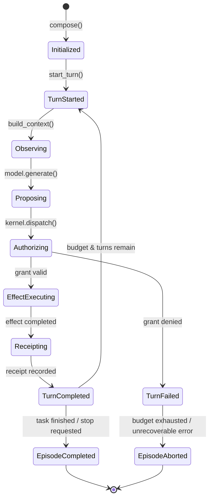
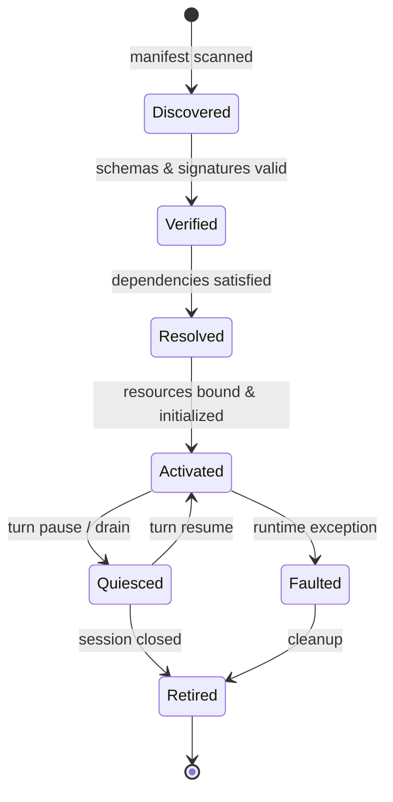

# State Machines & Lifecycle FSMs

> **Status:** `AS_BUILT` · Descriptive View.

---

## 1. Episode Turn Engine Lifecycle

Implemented in [`EpisodeEngine`](../../vanguard/packages/agency/episode/engine.py):

---

## 2. Plugin Lifecycle Finite State Machine (ADR-0081)

| State | Entering Event | Description & Guarantees |
|---|---|---|
| `Discovered` | `PluginDiscovered` | Plugin manifest parsed from disk; paths validated |
| `Verified` | `PluginVerified` | Schema and signature verification passed |
| `Resolved` | `PluginResolved` | Dependencies, capabilities, and port bindings resolved |
| `Activated` | `PluginActivated` | Plugin loaded into memory, UDS socket opened |
| `Quiesced` | `PluginQuiesced` | In-flight effects drained; safely paused |
| `Faulted` | `PluginFaulted` | Failure recorded in ledger; isolated |
| `Retired` | `PluginRetired` | Sockets closed, tmpfs workspace unmounted |
