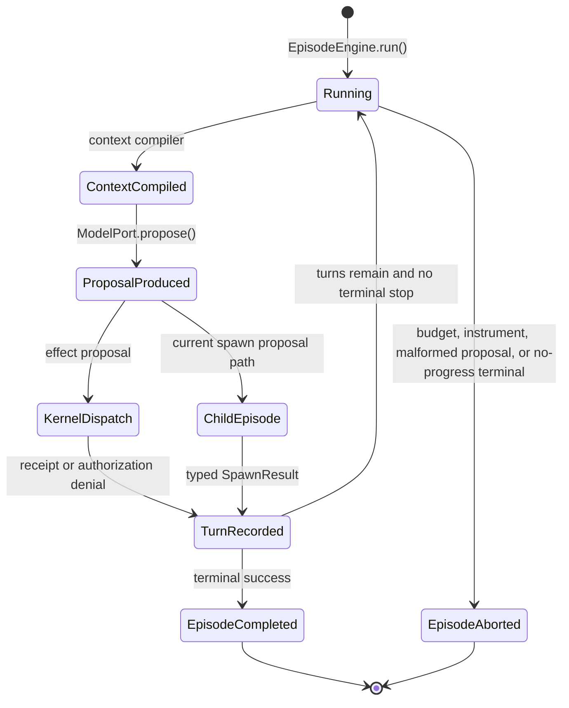
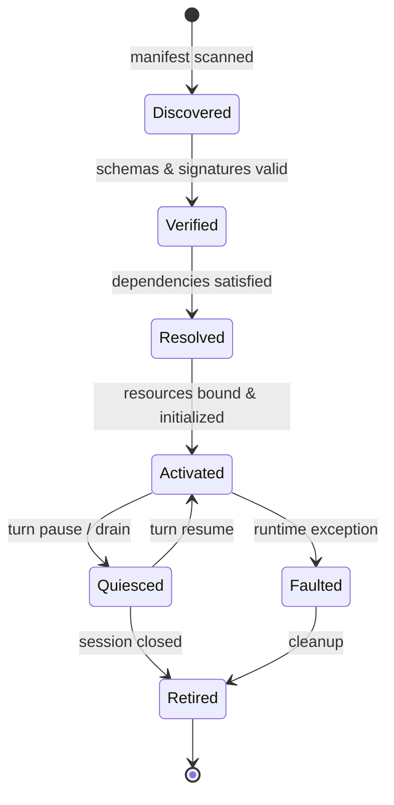

# State Machines & Lifecycle FSMs

> **Status:** Mixed descriptive view. The episode mechanism is current; the seven-state plugin FSM
> is `RATIFIED_NOT_IMPLEMENTED` until ADR-0081 lands in M-3.

---

## 1. Episode turn mechanism (`AS_BUILT` conceptual projection)

Implemented in [`EpisodeEngine`](../../vanguard/packages/agency/episode/engine.py):

This is an explanatory projection of control flow, not a claim that these labels are a persisted
enum. Persisted truth is the event catalog and reducer.

---

## 2. Plugin Lifecycle Finite State Machine (ADR-0081 — `RATIFIED_NOT_IMPLEMENTED`)

| State | Entering Event | Description & Guarantees |
|---|---|---|
| `Discovered` | `PluginDiscovered` | Target event; not yet present in the current event catalog |
| `Verified` | `PluginVerified` | Target event; not yet present in the current event catalog |
| `Resolved` | `PluginResolved` | Dependencies, capabilities, and port bindings resolved |
| `Activated` | `PluginActivated` | Plugin loaded into memory, UDS socket opened |
| `Quiesced` | `PluginQuiesced` | In-flight effects drained; safely paused |
| `Faulted` | `PluginFaulted` | Failure recorded in ledger; isolated |
| `Retired` | `PluginRetired` | Sockets closed, tmpfs workspace unmounted |
