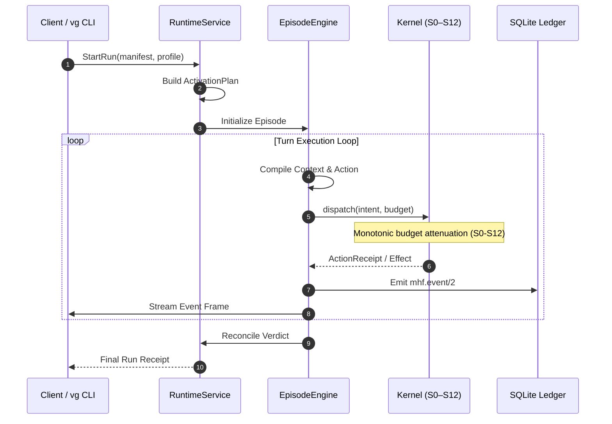

# End-to-End Execution Workflow

This page provides the canonical explanatory diagram and sequence for an end-to-end Vanguard run, from composition through S0–S12 microkernel dispatch, ledger emission, and evaluator reconciliation.

## Flow Diagram

## Canonical Components & Owners
- **System Overview & Boundaries**: [`docs/architecture/overview.md`](../overview.md)
- **Data Flow & Boundaries**: [`docs/architecture/boundaries.md`](../boundaries.md)
- **Normative Contract**: [`docs/execution/spec.md`](../../execution/spec.md)
