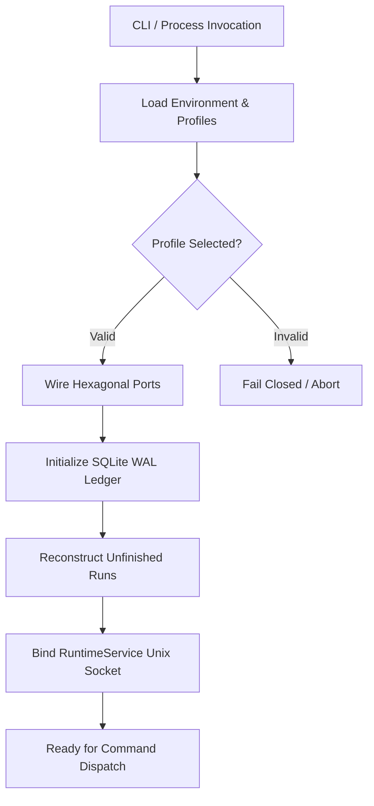

# System Bootstrap Workflow

This page details the initialization sequence of the Vanguard substrate, from environment loading through port wiring, SQLite WAL initialization, and daemon startup.

## Flow Diagram

## Canonical Components & Owners
- **System Overview**: [`docs/architecture/overview.md`](../overview.md)
- **Data Flow**: [`docs/architecture/data-flow.md`](../data-flow.md)
