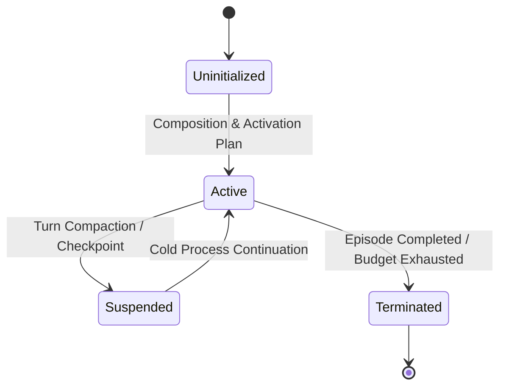

# Agent Lifecycle Workflow

This page documents the lifecycle state transitions of an agent projection over causal lineage.

## Flow Diagram

## Canonical Components & Owners
- **Delegation & Topology**: [`docs/backend/architecture/delegation-topology.md`](../delegation-topology.md)
- **Agent Substrate Theory**: [`docs/theory/agent-substrate.md`](../../../theory/agent-substrate.md)
