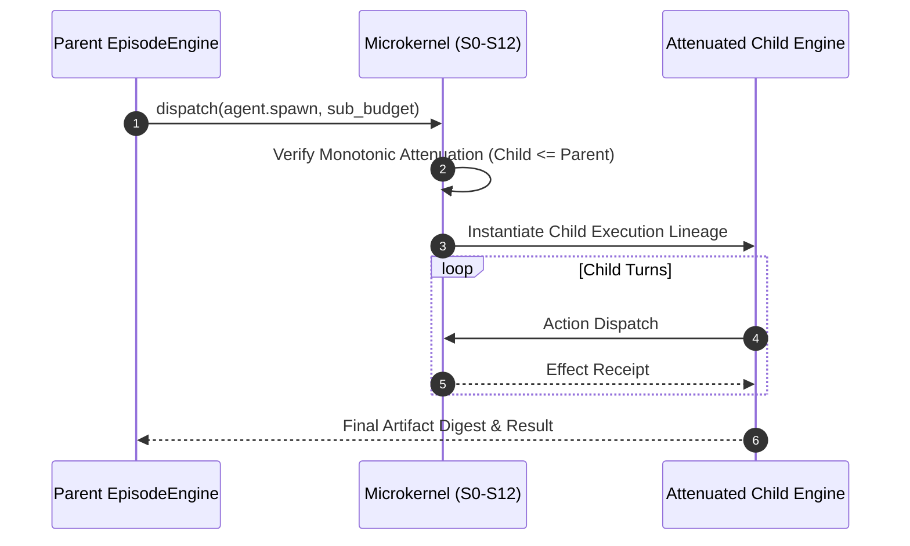

# Recursive Delegation Workflow

This page details how `agent.spawn` executes recursive delegation under strict monotonic capability attenuation.

## Flow Diagram

## Canonical Components & Owners
- **Delegation Architecture**: [`docs/backend/architecture/delegation-topology.md`](../delegation-topology.md)
- **Port Contracts**: [`docs/backend/reference/ports.md`](../../reference/ports.md)
