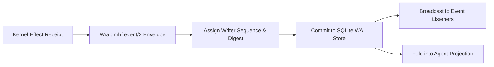

# Event Lifecycle Workflow

This page tracks the creation, serialization, emission, and persistence of immutable `mhf.event/2` envelopes in the backend event store.

## Flow Diagram

## Canonical Components & Owners
- **Events Reference**: [`docs/backend/reference/events.md`](../../reference/events.md)
- **Schemas Reference**: [`docs/backend/reference/schemas.md`](../../reference/schemas.md)
