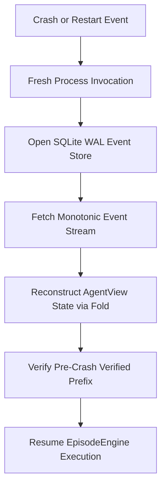

# Recovery & Resume Workflow

This page documents fresh-process cold recovery (RF-25) by folding causal events from the SQLite WAL store.

## Flow Diagram

## Canonical Components & Owners
- **Events Reference**: [`docs/backend/reference/events.md`](../../reference/events.md)
- **Data Flow**: [`docs/architecture/data-flow.md`](../../../architecture/data-flow.md)
