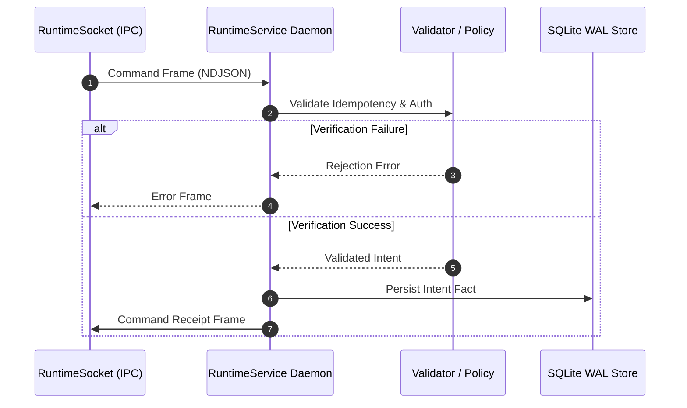

# Request Execution Workflow

This workflow illustrates how a single client command (`StartRun`, `Checkpoint`, `Resume`) is validated and dispatched across backend service boundaries.

## Flow Diagram

## Canonical Components & Owners
- **Runtime Service Reference**: [`docs/backend/reference/runtime-service.md`](../../reference/runtime-service.md)
- **Delegation & Topology**: [`docs/backend/architecture/delegation-topology.md`](../delegation-topology.md)
