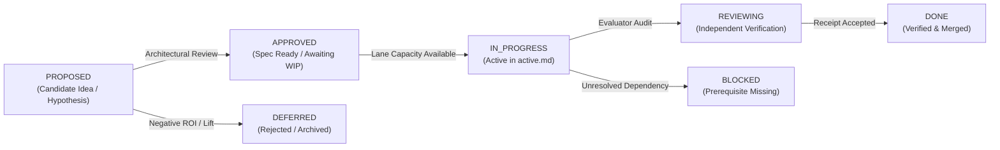

# AETHER / Vanguard: Feature & Capability Backlog

```text
====================================================================================================
Authority: Execution (Sequencing & Lifecycle Tracking)
Scope:     Capability Packages, Substrate Evolution, Tooling & Benchmarking Backlog
Lanes:     Lane A (Dev A — Senior Principal) | Lane B (Dev B — Independent Evaluator)
Invariant: Mechanism presence is not closure; state transitions require empirical receipts.
====================================================================================================
```

## 1. Lifecycle State Definitions

Every item in this backlog is managed through a strict predicate-driven lifecycle:



* **`PROPOSED`**: Candidate hypothesis, architectural proposal, or product feature under technical evaluation.
* **`APPROVED`**: Specification and falsifiers ratified; queued for active sprint execution once lane capacity (`WIP=1`) opens.
* **`IN_PROGRESS`**: Actively under implementation by the assigned lane owner in [`active.md`](active.md).
* **`REVIEWING`**: Code implemented; awaiting independent empirical evaluation and receipt production.
* **`BLOCKED`**: Execution halted due to prerequisite milestone gates (e.g., M-9 blocked on M-8).
* **`DONE`**: Implementation verified by passing tests, boundary checks, and frozen evidence receipts.
* **`DEFERRED`**: Candidate rejected or postponed due to lack of measured lift or architectural misalignment.

---

## 2. Capability Family Backlog

### 2.1 Substrate, Kernel & Event Sourcing (VISION.md §1–6)

| ID | Title & Focus | Subsystem | Lane | Status | Target Milestone | Description & Acceptance Gate |
|---|---|---|---|---|---|---|
| **SUB-01** | S0–S12 Monotonic Dispatch Pipeline | `kernel` | Lane A | `DONE` | M-0–M-3C | 13-stage dispatch pipeline, Typed Budget Governor, $\le 1438$ LOC budget. |
| **SUB-02** | Append-Only Event Store & JCS Ledger | `domain` / `runtime` | Lane A | `DONE` | M-5a | RFC 8785 JCS canonicalization, SQLite WAL ledger emitter, `mhf.event/2`. |
| **SUB-03** | Partial-Order Causal Graph & Concurrency | `runtime` | Lane A | `PROPOSED` | M-7+ | Transition physical sequence numbers to causal DAG dependency tracking. |
| **SUB-04** | Subprocess Sandbox PTY ShellPort | `adapters` | Lane A | `APPROVED` | M-9 | Persistent pseudo-terminal inside Bubblewrap with streaming and sub-200ms SIGINT. |

### 2.2 Memory, Learning & Metacognition (VISION.md §14, §18)

| ID | Title & Focus | Subsystem | Lane | Status | Target Milestone | Description & Acceptance Gate |
|---|---|---|---|---|---|---|
| **MEM-01** | Governed Memory & Rollback Mechanisms | `runtime` | Lane A | `REVIEWING` | M-8 | Authorization, recovery, and rollback receipts in `governance/learning.py`. |
| **MEM-02** | M-8 Empirical Held-Out Canary Proof | `benchmarks` | Lane B | `BLOCKED` | M-8 | Held-out real-model canary demonstrating $\ge 0.05$ lift without synthetic metrics. |
| **MEM-03** | Adaptive Strategy & Meta-Controller | `agency` / `runtime` | Lane A | `APPROVED` | M-6.5 | Higher-order policy adjusting strategy upon failure without modifying history. |
| **MEM-04** | Trajectory-to-Skill Promotion Pipeline | `runtime` | Lane A | `PROPOSED` | M-8+ | Mining verified traces to propose reusable skills with explicit promotion receipts. |

### 2.3 Recursive Delegation & Topologies (VISION.md §12, §16)

| ID | Title & Focus | Subsystem | Lane | Status | Target Milestone | Description & Acceptance Gate |
|---|---|---|---|---|---|---|
| **DEL-01** | Monotonic Capability Attenuation | `kernel` / `agency` | Lane A | `DONE` | M-6 | Recursive budget attenuation $\mathcal{A}(B_{\text{parent}}, B_{\text{child}})$ and child spawning. |
| **DEL-02** | Multi-Role Topology Declarations | `runtime` | Lane A | `APPROVED` | M-7 | Declarative multi-agent topologies (debate, critic, swarm) through single runtime. |
| **DEL-03** | Hardware-Aware Swarm Scheduler | `runtime` | Lane A | `PROPOSED` | M-7+ | VRAM drain scheduling between Architect (DeepSeek) and Worker (Qwen) models. |

### 2.4 Code Intelligence, Verification & SOTA Tools (VISION.md §5, §8)

| ID | Title & Focus | Subsystem | Lane | Status | Target Milestone | Description & Acceptance Gate |
|---|---|---|---|---|---|---|
| **TLS-01** | AdmissionGate Closed-Loop Validation | `agency` | Lane A | `DONE` | W-092-2 | Fail-closed patch requirement and fresh workspace verification enforcement. |
| **TLS-02** | DeepSeek DSML / JSON Normalization | `agency` | Lane A | `DONE` | W-092-4 | Protocol recovery for malformed markdown tool calls and stream truncations. |
| **TLS-03** | Tree-Sitter & SBFL Fault Localization | `ports` / `adapters`| Lane B | `IN_PROGRESS` | Ochiai suspiciousness ranking scoring failing test statements via `IndexPort`. |
| **TLS-04** | AST Syntax Pre-Flight Gate (<0.2ms) | `adapters` | Lane A | `IN_PROGRESS` | In-process parse gate returning line-level syntax errors with zero turn penalty. |
| **TLS-05** | Speculative Git Checkpoint Engine | `adapters` | Lane A | `APPROVED` | W-092-4 | In-memory CoW git checkpoints with automatic rollback on test regression. |
| **TLS-06** | AST Mutation Verification (Anti-Collusion)| `adapters` | Lane B | `PROPOSED` | M-8+ | Injects AST mutants to falsify ungrounded or no-op candidate test suites. |
| **TLS-07** | Composable Web Research Port (SSRF-Safe)| `ports` / `adapters`| Lane A | `PROPOSED` | M-9 | Egress-controlled web search and fetch tools with domain allowlists. |

### 2.5 Documentation Plane & Developer Tools

| ID | Title & Focus | Subsystem | Lane | Status | Target Milestone | Description & Acceptance Gate |
|---|---|---|---|---|---|---|
| **DOC-01** | MkDocs + Native Mermaid + Strict Gate | `docs` | Lane A | `DONE` | P0 | `pymdownx.superfences` Mermaid rendering and MkDocs strict build. |
| **DOC-02** | Deterministic Knowledge Base (.jsonl) | `tools` | Lane A | `DONE` | P0 | Machine-generated `catalog`, `code-map`, `symbols`, and `ownership` files. |
| **DOC-03** | Structured RAG V0 (Deterministic) | `tools` | Lane A | `DONE` | P0 | Exact-ID and authority-weighted context query tool (`tools/docs_rag_v0.py`). |
| **DOC-04** | Griffe & mkdocstrings Python API Docs | `docs` / `tools` | Lane A | `APPROVED` | P1 | Auto-generated API documentation for ports and public runtime contracts. |
| **DOC-05** | AST-Grep Structural Repository Indexer | `tools` | Lane B | `PROPOSED` | P1 | Structural AST queries for callers, adapters, and deprecated APIs. |
| **DOC-06** | SCIP Language-Agnostic Symbol Index | `tools` | Lane B | `PROPOSED` | P1 | SCIP indexer generating full cross-language symbol maps for Python & TS. |

### 2.6 Beta Delivery, SWE-Bench & Release Hardening (VISION.md §20)

| ID | Title & Focus | Subsystem | Lane | Status | Target Milestone | Description & Acceptance Gate |
|---|---|---|---|---|---|---|
| **REL-01** | Wave H0: Tooling Integrity & Exact Subject | `benchmarks` | Lane B | `IN_PROGRESS` | M-8 | Remove synthetic metrics from runner; ensure official adapter path. |
| **REL-02** | Wave H1: 10-Task Canary Validation | `benchmarks` | Both | `BLOCKED` (on H0) | 10 valid tasks, $\ge 8/10$ patches, $\ge 6/10$ external evaluator passes. |
| **REL-03** | Wave H2: Official SWE-Bench Container Bridge| `benchmarks` | Lane B | `APPROVED` | M-9 | Isolated official evaluation container passing pure unified diffs. |
| **REL-04** | Wave H3: Preregistered Hypothesis Ablations | `runtime` / `bench` | Both | `PROPOSED` | M-9 | Controlled A/B trials with $\ge 0.05$ lift threshold per treatment. |
| **REL-05** | Wave H4: Release Qualification & Signed Envelope| `ci` / `release` | Both | `BLOCKED` (on M-9) | Full 2348+ test suite, clean out-of-tree install, signed Ed25519 envelope. |

### 2.7 Specialized CLI Product Family (PRD Candidate Proposals)

| ID | Title & Focus | Subsystem | Lane | Status | Target Milestone | Description & Acceptance Gate |
|---|---|---|---|---|---|---|
| **CLI-01** | `vg-code` (Autonomous SWE Problem Solver) | `packs/code-default` | Lane A | `DONE` | M-4 | Autonomous bug fixing: Ingestion $\to$ Reproducer $\to$ Surgical Patch $\to$ Verification. |
| **CLI-02** | `vg-swarm` (Tiered Multi-Model Coding Swarm) | `agency/spawn` | Lane A | `PROPOSED` | M-7+ | Tiered swarm: DeepSeek/Claude Architect plans $\to$ Qwen/Haiku workers execute diffs. |
| **CLI-03** | `vg-fuzz` / `vg-verifier` (Formal CEGIS & SMT Falsifier) | `ports/evaluator` | Lane B | `PROPOSED` | M-5b+ | Formal verification: SMT spec $\to$ CEGIS inductive synthesis $\to$ Concolic fuzzing. |
| **CLI-04** | `vg-refactor` (Causal Slicing & Modernizer) | `ports/index` | Lane A | `PROPOSED` | M-9+ | AST call-graph causal slicing for atomic, regression-free codebase refactoring. |
| **CLI-05** | `vg-review` / `vg-arena` (Adversarial Multi-Model Reviewer)| `agency/spawn` | Lane A | `PROPOSED` | M-7+ | Zero-trust PR review: Competing reviewer personas (Security, Performance, Style) debate. |
| **CLI-06** | `vg-tutor` (Evidence-Graph Codebase Guide) | `packs/tutor` | Lane A | `DONE` | M-5a | Dynamic AST traversal $\to$ Socratic interactive codebase explanations with clickable proofs. |
| **CLI-07** | `vg-research` (Bounded Technical RFC & Web Corroborator)| `packs/research` | Lane A | `PROPOSED` | M-9 | Egress-controlled technical search $\to$ SSRF-safe fetch $\to$ Triangulated RFC generation. |
| **CLI-08** | `vg-rlvr` (Verifiable Trajectory & Dataset Generator) | `domain/evidence` | Lane B | `PROPOSED` | M-8+ | Mining verified traces (State, Action, Reward, Trace) for RL fine-tuning. |

### 2.8 Formal Reasoning & Algorithmic Engines (LIM Integration Proposals)

| ID | Title & Focus | Subsystem | Lane | Status | Target Milestone | Description & Acceptance Gate |
|---|---|---|---|---|---|---|
| **ALG-01** | SMT-Guided CEGIS Synthesis Loop | `ports/evaluator` | Lane B | `PROPOSED` | M-5b+ | Iterative counterexample synthesis loop: $\Phi(x, y) \to P \in \mathcal{L} \to \text{Z3 SMT Check}$. |
| **ALG-02** | SBFL Multi-Metric Fault Localization Suite | `ports/index` | Lane B | `PROPOSED` | M-8+ | Multi-metric suspiciousness scoring: DStar ($* = 2$), Tarantula, and Ochiai. |
| **ALG-03** | Formal State-Hash Anti-Thrashing FSM | `agency/episode` | Lane A | `PROPOSED` | W-092-4 | Signature hashing $H(\text{tool}, \text{args}, \text{state})$; triggers `ERR_THRASHING_LOOP` recovery. |

### 2.9 Coding Max Convergence Epic

This epic is the accepted planning disposition of the three Electroweak
solutions. It does not authorize copying executable prototypes from the report
tree. Production changes must be re-derived against current ports, boundaries,
source, and tests.

The architecture rule is **thin app, thick declarative composition**:
`apps/coding_max` owns request/result ergonomics and preset selection;
`packs/code-default` owns coding cognition and policy; runtime remains the only
composition/lifecycle authority; infrastructure stays behind generic ports.

| ID | Capability package | Primary owner | Status | Dependency | Acceptance gate |
|---|---|---|---|---|---|
| **CMX-01** | Current-mechanism delta and three presets | `packs/code-default`, manifests | `APPROVED` | EWK-Q disposition | `fast`, `balanced`, and `max` are data-selected compositions over one runtime; no duplicate store, coordinator, tool broker, or evaluator |
| **CMX-02** | Port-backed repository intelligence | `ports/index.py`, `adapters`, code-pack bindings | `APPROVED` | CMX-01 | Search, symbols, dependencies, test mapping, and repository map have provenance, path containment, deterministic fallback, and bounded output; adapters never import `apps` |
| **CMX-03** | Durable plan/context/recovery loop | code-pack policies + existing projections | `APPROVED` | CMX-01, CMX-02 | A cold-resumed task restores objective, constraints, discoveries, dead ends, modified files, latest verification, remaining budget, and next action without replaying settled effects |
| **CMX-04** | Multi-file and greenfield correctness | code-pack policies and fixtures | `APPROVED` | CMX-03 | Change-surface closure and affected-test selection pass multi-file fixtures; greenfield work uses an explicit scaffold/baseline/evidence policy and never silently bypasses admission |
| **CMX-05** | Coding Max application facade | `apps/coding_max`, shared application service, `vg` | `APPROVED` | CMX-03 | CLI and API invoke the same composition; run/status/resume/evidence/cost results agree; app owns no execution loop or provider HTTP |
| **CMX-06** | Conditional review and mediated specialist roles | manifests/topology/child runtime | `PROPOSED` | CMX-05 and accepted M-7 evidence | Reviewer/localizer/test-investigator roles exchange artifacts by digest, receive attenuated budgets, run sequentially by default, and cannot override the verifier |
| **CMX-07** | Repository-scale qualification | benchmark program | `PROPOSED` | CMX-04, CMX-05 | Frozen internal bugfix, multi-file, migration, and greenfield set reports success, missingness, tokens, cost, latency, retries, resume parity, and external verdicts |
| **CMX-08** | First-party reference-agent portfolio | apps + independent packs/manifests | `PROPOSED` | M-10 and stable public composition contract | Coding Max plus two non-coding supported agents install, run, resume, and emit attributable evidence through the same public framework contract |

#### Preset contract

Presets change policy and ceilings, not runtime identity or authority. Numeric
ceilings are calibrated later; their behavioral meanings are locked now.

| Preset | Required behavior | Excluded by default |
|---|---|---|
| `fast` | One primary worker; cheap deterministic discovery; direct inspect/edit/targeted-verify loop; escalate while preserving discoveries and failed attempts | LLM planner, specialist children, branch search, full repository indexing |
| `balanced` | Explicit plan/TODO, progressive context, dependency/test mapping, targeted then affected verification, durable resume, conditional reviewer for declared risk | Swarm/concurrency, mutation, branch search, self-modification |
| `max` | All empirically accepted balanced mechanisms with larger bounded context/turn/model ceilings, broad verification, and optional mediated specialist roles when their gate is accepted | Unbounded compute, automatic authority expansion, mandatory swarm/SBFL/mutation |

Escalation is monotonic in compute but never in capability. The
`fast -> balanced -> max` path may spend a larger pre-authorized budget and add policy components, but it
cannot widen filesystem, network, command, evaluator, or child authority.

#### Task-specific completion policy

| Task class | Minimum completion evidence |
|---|---|
| Existing bug or failing test | Reproducer fails on the baseline when feasible, passes on the postimage, and affected regression checks pass |
| Multi-file feature/refactor/migration | Every implicated interface is inspected; change-surface closure is recorded; targeted and affected checks pass; migration compatibility is tested when applicable |
| Greenfield | Scaffold baseline is recorded; build/syntax succeeds; at least one executable smoke or contract test created for the requested behavior passes on the postimage |
| Repository without tests | The pack declares an explicit acceptance command or creates the smallest executable harness; successful syntax/build alone is insufficient for behavioral completion |
| Analysis/documentation/read-only | A read-only preset applies an explicit requirements checklist; no fabricated patch or test count is required |

Manual review may supplement these policies but cannot replace an applicable
automated check or an exterior evaluator verdict.

#### Explicitly deferred experiments

The following are not Coding Max prerequisites: swarm concurrency, beam/branch
search, ToolScript, SBFL, AST mutation testing, speculative auto-rollback,
trajectory distillation, capsule promotion, and self-modification. Each requires
a separate preregistered control/treatment experiment. It advances only when it
improves task success or cost-adjusted success without exceeding the declared
reliability regression budget.

#### Definition of Ready

A CMX package may enter `active.md` only when its exact source owner, public
contract, negative falsifier, migration impact, measurement subject, and rollback
path are named. A report-tree path or code snippet is never a production owner.

#### Definition of Done

A CMX package is done only when current-source unit and integration tests pass,
the boundary and TCB gates remain green, cold reconstruction is tested when
state changes, canonical docs and generated knowledge are synchronized, and any
capability or performance claim is supported by an exact-subject receipt.

---

## 3. Prioritized Next-Up Queue (Staging for active.md)

The dependency-ordered queue is:

1. **`REL-01` (H0 evidence integrity)** — remove direct provider HTTP and
   synthetic result metrics from the admissible path; use runtime adapters and
   an exterior oracle.
2. **`REL-02` (H1 frozen canary)** — freeze executable, content-addressed,
   single-attempt tasks and explicit missingness before any live run.
3. **`FIN-A1` / `W-092-5` disposition** — independently accept a valid M-8
   bundle or record a negative/undeterminable result without threshold changes.
4. **`CMX-01` through `CMX-05`** — deliver the Coding Max vertical slice in
   dependency order.
5. **`CMX-07`** — qualify the vertical slice before enabling optional
   orchestration.
6. **`CMX-06` and experimental features** — admit one treatment at a time only
   after a preregistered ablation.
7. **`CMX-08`** — qualify the supported first-party agent portfolio on the road
   to 1.0 after M-10.

`TLS-04` may be absorbed into CMX-04 if its measured latency and defect-catch
rate justify the seam. `DOC-04` remains approved but is not on the critical
product path.

---

## 4. Cross-References

* **Vision (Constitutional Law Zero)**: [`VISION.md`](../../VISION.md)
* **Target Milestone Gates**: [`milestones.md`](milestones.md)
* **Active Execution Board (WIP=1)**: [`active.md`](active.md)
* **Normative System Specification**: [`../SPEC.md`](../SPEC.md)
