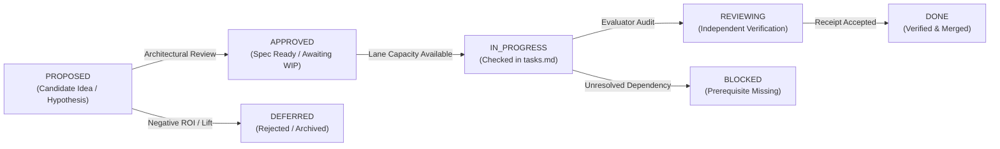

# AETHER / Vanguard: Feature & Capability Backlog

```text
====================================================================================================
Authority: Execution (Sequencing & Lifecycle Tracking)
Scope:     Capability Packages, Substrate Evolution, Tooling & Benchmarking Backlog
Lanes:     Lane A (Dev A — Senior Principal) | Lane B (Dev B — Independent Evaluator)
Invariant: Mechanism presence is not closure; state transitions require empirical receipts.
====================================================================================================
```

## 1. Lifecycle State Definitions

Every item in this backlog is managed through a strict predicate-driven lifecycle:



* **`PROPOSED`**: Candidate hypothesis, architectural proposal, or product feature under technical evaluation.
* **`APPROVED`**: Specification and falsifiers ratified; awaiting implementation. Team capacity is chosen later; there is no WIP=1 calendar in this file.
* **`IN_PROGRESS`**: Actively under implementation; checkboxes live in [`tasks.md`](tasks.md).
* **`REVIEWING`**: Code implemented; awaiting independent empirical evaluation and receipt production.
* **`BLOCKED`**: Execution halted due to prerequisite milestone gates (e.g., M-9 blocked on M-8).
* **`DONE`**: Implementation verified by passing tests, boundary checks, and frozen evidence receipts.
* **`DEFERRED`**: Candidate rejected or postponed due to lack of measured lift or architectural misalignment.
* **`REOPENED`**: A previously closed package has a current-source or
  exact-subject falsifier that invalidates carrying its old closure forward.
  The earlier receipt remains historical evidence for its own subject.

---

## 2. Capability Family Backlog

### 2.1 Substrate, Kernel & Event Sourcing (VISION.md §1–6)

| ID | Title & Focus | Subsystem | Lane | Status | Target Milestone | Description & Acceptance Gate |
|---|---|---|---|---|---|---|
| **SUB-01** | S0–S12 Monotonic Dispatch Pipeline | `kernel` | Lane A | `DONE` | M-0–M-3C | 13-stage dispatch pipeline, Typed Budget Governor, $\le 1438$ LOC budget. |
| **SUB-02** | Append-Only Event Store & JCS Ledger | `domain` / `runtime` | Lane A | `DONE` | M-5a | RFC 8785 JCS canonicalization, SQLite WAL ledger emitter, `mhf.event/2`. |
| **SUB-03** | Partial-Order Causal Graph & Concurrency | `runtime` | Lane A | `PROPOSED` | M-7+ | Transition physical sequence numbers to causal DAG dependency tracking. |
| **SUB-04** | Subprocess Sandbox PTY ShellPort | `adapters` | Lane A | `APPROVED` | M-9 | Persistent pseudo-terminal inside Bubblewrap with streaming and sub-200ms SIGINT. |

### 2.2 Memory, Learning & Metacognition (VISION.md §14, §18)

| ID | Title & Focus | Subsystem | Lane | Status | Target Milestone | Description & Acceptance Gate |
|---|---|---|---|---|---|---|
| **MEM-01** | Governed Memory & Rollback Mechanisms | `runtime` | Lane A | `REVIEWING` | M-8 | Authorization, recovery, and rollback receipts in `governance/learning.py`. |
| **MEM-02** | M-8 Empirical Held-Out Canary Proof | `benchmarks` | Lane B | `BLOCKED` (on REL-01R/REL-02R) | M-8 | Held-out real-model canary demonstrating $\ge 0.05$ lift without synthetic metrics after the runtime executor and successor canary are qualification-ready. |
| **MEM-03** | Adaptive Strategy & Meta-Controller | `agency` / `runtime` | Lane A | `APPROVED` | M-6.5 | Higher-order policy adjusting strategy upon failure without modifying history. |
| **MEM-04** | Trajectory-to-Skill Promotion Pipeline | `runtime` | Lane A | `PROPOSED` | M-8+ | Mining verified traces to propose reusable skills with explicit promotion receipts. |

### 2.3 Recursive Delegation & Topologies (VISION.md §12, §16)

| ID | Title & Focus | Subsystem | Lane | Status | Target Milestone | Description & Acceptance Gate |
|---|---|---|---|---|---|---|
| **DEL-01** | Monotonic Capability Attenuation | `kernel` / `agency` | Lane A | `DONE` | M-6 | Recursive budget attenuation $\mathcal{A}(B_{\text{parent}}, B_{\text{child}})$ and child spawning. |
| **DEL-02** | Multi-Role Topology Declarations | `runtime` | Lane A | `APPROVED` | M-7 | Declarative multi-agent topologies (debate, critic, swarm) through single runtime. |
| **DEL-03** | Hardware-Aware Swarm Scheduler | `runtime` | Lane A | `PROPOSED` | M-7+ | VRAM drain scheduling between Architect (DeepSeek) and Worker (Qwen) models. |

### 2.4 Code Intelligence, Verification & SOTA Tools (VISION.md §5, §8)

| ID | Title & Focus | Subsystem | Lane | Status | Target Milestone | Description & Acceptance Gate |
|---|---|---|---|---|---|---|
| **TLS-01** | AdmissionGate Closed-Loop Validation | `agency` | Lane A | `DONE` | W-092-2 | Fail-closed patch requirement and fresh workspace verification enforcement. |
| **TLS-02** | DeepSeek DSML / JSON Normalization | `agency` | Lane A | `DONE` | W-092-4 | Protocol recovery for malformed markdown tool calls and stream truncations. |
| **TLS-03** | Tree-Sitter & SBFL Fault Localization | `ports` / `adapters`| Lane B | `DEFERRED` | Post-CMX-07 | Optional treatment; may enter WIP only after the canonical single-worker baseline is qualified and a preregistered ablation exists. |
| **TLS-04** | AST Syntax Pre-Flight Gate (<0.2ms) | `adapters` | Lane A | `DEFERRED` | Post-CMX-07 | Optional treatment; current finish work must first make verification counts and subject binding truthful. |
| **TLS-05** | Speculative Git Checkpoint Engine | `adapters` | Lane A | `APPROVED` | W-092-4 | In-memory CoW git checkpoints with automatic rollback on test regression. |
| **TLS-06** | AST Mutation Verification (Anti-Collusion)| `adapters` | Lane B | `PROPOSED` | M-8+ | Injects AST mutants to falsify ungrounded or no-op candidate test suites. |
| **TLS-07** | Composable Web Research Port (SSRF-Safe)| `ports` / `adapters`| Lane A | `PROPOSED` | M-9 | Egress-controlled web search and fetch tools with domain allowlists. |

### 2.5 Documentation Plane & Developer Tools

| ID | Title & Focus | Subsystem | Lane | Status | Target Milestone | Description & Acceptance Gate |
|---|---|---|---|---|---|---|
| **DOC-01** | MkDocs + Native Mermaid + Strict Gate | `docs` | Lane A | `DONE` | P0 | `pymdownx.superfences` Mermaid rendering and MkDocs strict build. |
| **DOC-02** | Deterministic Knowledge Base (.jsonl) | `tools` | Lane A | `DONE` | P0 | Machine-generated `catalog`, `code-map`, `symbols`, and `ownership` files. |
| **DOC-03** | Structured RAG V0 (Deterministic) | `tools` | Lane A | `DONE` | P0 | Exact-ID and authority-weighted context query tool (`tools/docs_rag_v0.py`). |
| **DOC-04** | Griffe & mkdocstrings Python API Docs | `docs` / `tools` | Lane A | `APPROVED` | P1 | Auto-generated API documentation for ports and public runtime contracts. |
| **DOC-05** | AST-Grep Structural Repository Indexer | `tools` | Lane B | `PROPOSED` | P1 | Structural AST queries for callers, adapters, and deprecated APIs. |
| **DOC-06** | SCIP Language-Agnostic Symbol Index | `tools` | Lane B | `PROPOSED` | P1 | SCIP indexer generating full cross-language symbol maps for Python & TS. |

### 2.6 Beta Delivery, SWE-Bench & Release Hardening (VISION.md §20)

| ID | Title & Focus | Subsystem | Lane | Status | Target Milestone | Description & Acceptance Gate |
|---|---|---|---|---|---|---|
| **REL-01** | Wave H0: Tooling Integrity & Exact Subject | `benchmarks` | Lane B | `DONE` (historical subject only) | M-8 | Structural dry-run and injected seams were delivered, but current-source audit found the live executor cannot return a patch or execute a bounded multi-turn write-capable attempt. |
| **REL-01R** | Current-Subject Empirical Runner Repair | `benchmarks` / `runtime` | Lane B | `IN_PROGRESS` | W-092-F0 | Bind one write-capable multi-turn runtime attempt to patch, event/trajectory, usage and exterior-verdict identities; restore HEAD-bound LDA/navigation health. |
| **REL-02** | Wave H1: Frozen 10-Task Canary | `benchmarks` | Both | `DONE` (historical artifact only) | M-8 | The old artifact remains immutable, but title/payload/workspace duplication and current-subject drift prevent its reuse as qualification evidence. |
| **REL-02R** | Successor Uncontaminated Canary | `benchmarks` | Lane B | `BLOCKED` (on REL-01R) | W-092-F0 / M-8 | Freeze a successor only after every task, workspace, oracle, split, base revision and digest resolves to one unique subject. |
| **REL-03** | Wave H2: Official SWE-Bench Container Bridge| `benchmarks` | Lane B | `APPROVED` | M-9 | Isolated official evaluation container passing pure unified diffs. |
| **REL-04** | Wave H3: Preregistered Hypothesis Ablations | `runtime` / `bench` | Both | `PROPOSED` | M-9 | Controlled A/B trials with $\ge 0.05$ lift threshold per treatment. |
| **REL-05** | Wave H4: Release Qualification & Signed Envelope| `ci` / `release` | Both | `BLOCKED` (on M-9) | Full 2348+ test suite, clean out-of-tree install, signed Ed25519 envelope. |

### 2.7 Specialized CLI Product Family (PRD Candidate Proposals)

| ID | Title & Focus | Subsystem | Lane | Status | Target Milestone | Description & Acceptance Gate |
|---|---|---|---|---|---|---|
| **CLI-01** | `vg-code` (Autonomous SWE Problem Solver) | `packs/code-default` | Lane A | `DONE` | M-4 | Autonomous bug fixing: Ingestion $\to$ Reproducer $\to$ Surgical Patch $\to$ Verification. |
| **CLI-02** | `vg-swarm` (Tiered Multi-Model Coding Swarm) | `agency/spawn` | Lane A | `PROPOSED` | M-7+ | Tiered swarm: DeepSeek/Claude Architect plans $\to$ Qwen/Haiku workers execute diffs. |
| **CLI-03** | `vg-fuzz` / `vg-verifier` (Formal CEGIS & SMT Falsifier) | `ports/evaluator` | Lane B | `PROPOSED` | M-5b+ | Formal verification: SMT spec $\to$ CEGIS inductive synthesis $\to$ Concolic fuzzing. |
| **CLI-04** | `vg-refactor` (Causal Slicing & Modernizer) | `ports/index` | Lane A | `PROPOSED` | M-9+ | AST call-graph causal slicing for atomic, regression-free codebase refactoring. |
| **CLI-05** | `vg-review` / `vg-arena` (Adversarial Multi-Model Reviewer)| `agency/spawn` | Lane A | `PROPOSED` | M-7+ | Zero-trust PR review: Competing reviewer personas (Security, Performance, Style) debate. |
| **CLI-06** | `vg-tutor` (Evidence-Graph Codebase Guide) | `packs/tutor` | Lane A | `DONE` | M-5a | Dynamic AST traversal $\to$ Socratic interactive codebase explanations with clickable proofs. |
| **CLI-07** | `vg-research` (Bounded Technical RFC & Web Corroborator)| `packs/research` | Lane A | `PROPOSED` | M-9 | Egress-controlled technical search $\to$ SSRF-safe fetch $\to$ Triangulated RFC generation. |
| **CLI-08** | `vg-rlvr` (Verifiable Trajectory & Dataset Generator) | `domain/evidence` | Lane B | `PROPOSED` | M-8+ | Mining verified traces (State, Action, Reward, Trace) for RL fine-tuning. |
| **TUI-01** | `aether` Coding-Agent Terminal (unify `clients/tui` + `clients/cli/src/tui` onto one `@aether/tui-core`-driven cell renderer per the OpenTUI spike's fallback clause; plan mode) | `clients/tui-core` / `clients/tui` / `clients/cli` / `runtime` | Lane A | `REVIEWING` (command registry, plan-mode enforcement, and Ink consolidation done and green; OpenTUI spike closed via fallback, not qualified) | M-9 (`TC-E-047`, currently `BLOCKED` on M-8) | **Definition-of-Ready**: (1) one `@aether/tui-core` command registry replacing the duplicated/index-mismatched palette lists — **done**, `vanguard/clients/tui-core/`, 16 passing `node --test` unit tests, no terminal required; (2) plan mode enforced by grant attenuation at the runtime composition layer, not client-side politeness — **done**, `vanguard/packages/runtime/{profiles,wiring,session}.py`, falsifier in `test/runtime/test_w3_plan_mode.py` (patch.apply/proc.exec denied with the workspace byte-identical afterward, fs.read still succeeds under the same profile); (3) an OpenTUI qualification spike per `PRD_AETHER_TUI.md` §8.1 — **partial**, receipt at `.draft/todo/w0-spike/receipt.json`: first-frame (8.5ms) and event→render P95 (34.0ms) passed budget on Bun 1.4.0/tmux, but RSS (69.2MB vs. 45MB budget) failed, and keystroke→cell latency, a real SIGWINCH resize, the local-emulator/SSH terminals, and the 256-/16-color fallbacks were not exercised (no attached TTY or SSH endpoint in the environment that produced this receipt) — re-run with a human on a real interactive session, or re-scope the transcript's renderable count, before this gate is called closed; (4) the OpenTUI + Solid render layer itself — **not started**, blocked on (3) closing per the plan's `W0 gates W2` rule; the render layer stays the pre-existing hand-rolled `clients/tui/src/terminal` cell renderer (already consuming `@aether/tui-core` per (1)), per the plan's own fallback clause ("swap the view layer back to the existing cell renderer and lose nothing above the driver line") triggered by (3)'s RSS failure; (5) Ink deletion and CLI consolidation — **done**: `clients/cli/src/commands/run.ts`'s interactive path now embeds `@aether/tui`'s `TuiApplication` directly (in-process, no child spawn) instead of Ink's `RunTui`; `clients/cli/src/tui/{components,hooks,screens}` (the Ink-dependent tree) deleted, its React-free pure-logic siblings (`diff.ts`, `focus.ts`, `keys.ts`, `status-bar.ts`, `theme/tokens.ts`, `transcript-window.ts`, `why-display.ts`) kept and still covered by `ui.test.ts`; `legacy.tsx` replaced by a JSX-free `legacy.ts` with its unused (shadowed by `run.ts`/`approve.ts`/`daemon.ts`) `handleRun`/`handleApprove`/`handleDaemon` duplicates dropped; `ink`/`react`/`@types/react` removed from `clients/cli/package.json` and the root `package.json`; a latent bug fixed along the way — `TuiApplication.stop()` never removed its `stdin` `"data"` listener, so an embedding host's process could never exit after Ctrl+D, now fixed with a `TuiAppOptions.onExit` hook. Verified with a real interactive run in a tmux pty (`AETHER_HOME=... node bin/aether run --repo /tmp --demo`, exits 0 on Ctrl+D) and the full monorepo `npm run build`/`npm test` (0 failures). `bin/aether`/`bin/aether-tui` already existed and already forward to the built Node entrypoints — no `bun build --compile` packaging was needed since the Bun-only OpenTUI stack was not adopted; (6) the remainder of W1's "SOTA set" — **done**: `/init` (seeds `AETHER.md`, idempotent), `/title`, `/status`, `/context`, `/cost`, `/compact` (local transcript view only, does not touch run state), `/doctor`, `/diff`, `/undo` (registered but explicitly reports itself unimplemented — no git-backed rollback exists — rather than faking one), `@path` inline file-reference expansion on submit (`tui-core/src/commands/context-refs.ts`), and `!cmd` local zero-cost shell mode that never invokes the model (`tui-core/src/commands/shell.ts`); all covered by unit tests (`tui-core`: 23 passing; `@aether/tui`: 23 passing) and verified with real interactive tmux-pty runs (`!echo`, `/status`, `/doctor`, `/cost` all produced correct live output). Still missing from W1's list: `@file` is submit-time expansion only, not a live fuzzy-search popup (the hand-rolled renderer has no autocomplete surface); W2's leader-key grammar (`ctrl+x`, `<leader> n/l/m/a/e/t`) and colored usage-bar footer remain unbuilt, correctly, since they're OpenTUI-specific per the plan and W2 is not proceeding. (7) W4 polish on the fallback renderer — **partially done**: progressive-disclosure card folding (`▸`/`▾`, expand on Space/Enter) already existed pre-`TUI-01` and was verified rather than rebuilt (`components/turn.ts`, `components/cards/*`); a real ANSI-256/16-color fallback was implemented (`theme.ts`'s `styleToAnsi` previously collapsed every non-truecolor style to flat white-on-black — now does proper hue-based nearest-color quantization, since a raw RGB-distance match puts every pastel theme color nearest white) with a corrected `detectColorMode` (`xterm-256color` was mislabeled as truecolor); the status footer gained a real 4-tier colored context-usage bar with textual cues (`[OK]/[MED]/[HIGH]/[CRIT]`) plus last-event timing and a `[PLAN]` badge (`components/usage-bar.ts`); busy-input modes landed (`/busy queue|steer|interrupt` — `queue` genuinely defers and auto-flushes a follow-up prompt once the active run reaches a terminal status, `steer` honestly falls back to `interrupt` since no in-flight-redirect primitive exists rather than faking one). While implementing `/busy` a second, more consequential index-drift-shaped bug was found and fixed: typing a full command with args at the palette (e.g. `/busy queue`) previously matched nothing (the palette's internal filter substring-matched the *entire* typed string, args included, against each command's name) and, even on a surviving match, always dispatched with `args=""` — silently dropping everything typed after the command name for every argument-taking command reached via the palette. Fixed by exporting `filterCommandsByQuery`/`splitCommandQuery` from `@aether/tui-core` and making both the palette's rendering (`app.ts`, `command-palette.ts`) and its dispatch (`keyboard.ts`) read from those same two functions — the palette component no longer filters internally at all. Zero-input-starvation streaming was reviewed, not rebuilt: keystroke handling and event ingestion are already both synchronous per-tick against the existing signal-based store, so there was no blocking behavior to fix. Not done: an inverse-video focus-border convention (focus is currently indicated by a border *color* change, not video inversion — a real but lower-severity accessibility gap against `PRD_AETHER_TUI.md` §8.2) and `--no-animation` (moot for now: this renderer has no spinners/animation to suppress). Verified with `@aether/tui-core` (27 tests) and `@aether/tui` (42 tests, up from 19 at `TUI-01`'s prior close), all passing, plus live tmux-pty checks of the colored usage bar and the palette-args fix. This epic remains `BLOCKED` on M-8 at the milestone level per `TC-E-047`; the historical TUI lane recorded only the parts above that could proceed under `SUB-01`/`DEL-01`-style pure-package or Python-runtime work not contending for the milestone gate. |

### 2.8 Formal Reasoning & Algorithmic Engines (LIM Integration Proposals)

| ID | Title & Focus | Subsystem | Lane | Status | Target Milestone | Description & Acceptance Gate |
|---|---|---|---|---|---|---|
| **ALG-01** | SMT-Guided CEGIS Synthesis Loop | `ports/evaluator` | Lane B | `PROPOSED` | M-5b+ | Iterative counterexample synthesis loop: $\Phi(x, y) \to P \in \mathcal{L} \to \text{Z3 SMT Check}$. |
| **ALG-02** | SBFL Multi-Metric Fault Localization Suite | `ports/index` | Lane B | `PROPOSED` | M-8+ | Multi-metric suspiciousness scoring: DStar ($* = 2$), Tarantula, and Ochiai. |
| **ALG-03** | Formal State-Hash Anti-Thrashing FSM | `agency/episode` | Lane A | `PROPOSED` | W-092-4 | Signature hashing $H(\text{tool}, \text{args}, \text{state})$; triggers `ERR_THRASHING_LOOP` recovery. |

### 2.9 Coding Max Convergence Epic

This epic is the accepted planning disposition of the three Electroweak
solutions. It does not authorize copying executable prototypes from the report
tree. Production changes must be re-derived against current ports, boundaries,
source, and tests.

The architecture rule is **thin app, thick declarative composition**:
`apps/coding_max` owns request/result ergonomics and preset selection;
`packs/code-default` owns coding cognition and policy; runtime remains the only
composition/lifecycle authority; infrastructure stays behind generic ports.

| ID | Capability package | Primary owner | Status | Dependency | Acceptance gate |
|---|---|---|---|---|---|
| **CMX-01** | Current-mechanism delta and three presets | `packs/code-default`, manifests | `REOPENED` (product divergence) | EWK-Q disposition | Public fast/balanced/max still need accepted later harness behavior folded into one data-selected catalog; experimental manifest names are not product presets. |
| **CMX-02** | Port-backed repository intelligence | `ports/index.py`, adapters, code-pack bindings | `PARTIAL` | CMX-09 | Public Coding Max presets now declare the shared index and the runtime constructs bounded `ContextPacket` context; staged task-ranked retrieval, epoch refresh and fallback evidence remain. |
| **CMX-03** | Durable plan/context/recovery loop | code-pack policies + existing projections | `PARTIAL` | CMX-09 | Resume restores the original turn ceiling and approval mode, but rich task-state production, exact policy/profile/budget identity and 40+ turn cold parity remain. |
| **CMX-04** | Multi-file and greenfield correctness | code-pack policies and fixtures | `REVIEWING` | CMX-10A, CMX-11 | Hermetic policies/fixtures and conservative verification observation exist; task-specific completion and repository-scale change-surface qualification remain. |
| **CMX-05** | Coding Max application facade | `apps/coding_max`, shared application service, `vg` | `DONE (hermetic)` | CMX-03 | CLI and API invoke the same composition; run/status/resume/evidence/cost results agree; app owns no execution loop or provider HTTP |
| **CMX-06** | Conditional review and mediated specialist roles | manifests/topology/child runtime | `BLOCKED` (on CMX-07) | CMX-05 and accepted baseline | Reviewer/localizer/test-investigator roles remain disabled until one-role-at-a-time held-out ablations beat the qualified single-worker control. |
| **CMX-07** | Repository-scale qualification | benchmark program | `BLOCKED` (on REL-01R, CMX-09..11) | CMX-04, CMX-05 | Re-freeze the exact multi-class subject only after canonical completion, long-session resume and progressive-context gates pass. |
| **CMX-08** | First-party reference-agent portfolio | apps + independent packs/manifests | `TECHNICAL SLICE DONE` | M-10 and stable public composition contract | Coding Max plus two non-coding supported agents install, run, resume, and emit attributable evidence through the same public framework contract |
| **CMX-09** | Canonical Harness Convergence | runtime, code pack, manifests, thin app | `IN_PROGRESS` (Active in [`tasks.md`](tasks.md)) | W-092-F1 | Fold accepted later prompt/tool/recovery mechanisms into public presets; use one capability-derived admission/policy binding; exact technical delta governed by [`spec.md`](spec.md). |
| **CMX-10A** | Truthful Task-Aware Completion | runtime + code-pack completion policy | `IN_PROGRESS` | CMX-09 | Parse real verification counts and fail closed on zero, stale, partial, incomplete or task-inapplicable evidence across bugfix, feature, migration, greenfield and read-only tasks. |
| **CMX-10B** | Durable Long-Session Continuation | runtime/session/task projection | `IN_PROGRESS` | CMX-10A | Persist and restore exact task/composition/policy/budget/phase/next-action identity; prove 40+ turns and repeated fresh-process restarts without duplicate effects. |
| **CMX-11** | Progressive Repository Context & Change Closure | agency context, `IndexPort`, adapters, code pack | `APPROVED` | CMX-09, CMX-10B | Put `ContextPacket` on the product path, reserve recovery/verification context, refresh by repository epoch, expose omissions, and prove multi-file/affected-test closure with deterministic fallback. |

### 2.10 Octopus Meta-Controller & Swarm Topology (VISION.md §12, §16; M-OCT Horizon)

The Octopus / Conductor capability family represents the post-1.0 higher-order orchestration layer for long-horizon multi-day campaigns. It is declared as pure data topologies and content-addressed message exchanges; it does not replace the kernel's S0–S12 execution contracts. Detailed pseudocode is deferred to its dedicated implementation milestone.

| ID | Title & Focus | Subsystem | Lane | Status | Target Milestone | Description & Acceptance Gate |
|---|---|---|---|---|---|---|
| **OCT-01** | Content-Addressed Mailbox Protocol | `domain/topology` | Lane A | `PROPOSED` | M-OCT / W-OCT-1 | Sub-agents communicate strictly by publishing and reading content-addressed immutable message digests (`digest_of(payload)`); zero shared memory; deterministic replayability. |
| **OCT-02** | Declarative CoordinationPlan DAG & Merge Policies | `domain/topology` | Lane A | `PROPOSED` | M-OCT / W-OCT-2 | Topology declared as data DAG with per-mille budget shares ($\sum \text{budget\_share} \le 1000$); formal merge policies: `CONCAT`, `FIRST_COMPLETE`, `SYNTHESISE`, `UNANIMOUS`. |
| **OCT-03** | Outer-Loop Multi-Day Roadmap Director | `runtime/outer_loop` | Lane A | `PROPOSED` | M-OCT / W-OCT-3 | Persistent director above `EpisodeEngine`; manages multi-episode roadmaps, survives process restarts, and yields verified milestone handoffs without unbounded context saturation. |
| **OCT-04** | Meta-Conductor & Swarm Goal Algebra | `runtime/outer_loop` | Lane A | `PROPOSED` | M-OCT / W-OCT-4 | Higher-order pilot framework; formal algebraic separation and reconciliation of individual worker objectives under a shared global campaign objective. |

---

## 3. Package index (not a sprint queue)

Team capacity is chosen later. `requires:` edges live on tasks. This index maps packages to T-ids.

| Package | Aliases | Related T-ids | MS-* | Notes |
|---|---|---|---|---|
| **INSTRUMENT** | REL-01R | T-01–T-03, T-24–T-25, T-40–T-41 | MS-INSTRUMENT | `DONE` at `63b77116` |
| **TRUTH** | CMX-10A, W-092-F2 | T-04–T-08, T-42, T-38, T-23 | MS-TRUTH | Partial: T-23/T-38/T-42 `DONE`; T-04/T-05/T-07 open; T-08 landed `8637db55` |
| **STATE** | CMX-10B, W-092-F3 | T-09–T-13, T-43–T-44 | MS-RESUME | `IN_PROGRESS` (B landed `8637db55`). Do not mark `DONE`. |
| **SEE** | CMX-11, PRG-01, W-092-F4 | T-14–T-16, T-36–T-37, T-45–T-46 | MS-SEE | One ContextCompiler; ResultDistiller T-36 |
| **CHANGE** | TXN-01, SHD-01, TLS-04/05 | T-17–T-20, T-47–T-49 | MS-CHANGE | 2PC in adapters; tamper; completeness |
| **DIALECT** | WRN-01, TLS-02 | T-21–T-22, T-50 | — | Typed failure classes; fail-closed resolve |
| **CONTROL** | CMX-07, W-092-F5 | T-26–T-27, T-51–T-52 | MS-CONTROL | Frozen preregistration + canary |
| **META** | MEM-03 | T-28 | MS-META | `[PROPOSAL]` |
| **SPECIALIST** | CMX-06, W-092-F6 | T-29–T-30, T-53 | MS-SPECIALIST | `[PROPOSAL]` |
| **CAMPAIGN** | OCT-01…04, HYD-01/02 | T-31, T-54–T-55, T-34 | MS-CAMPAIGN / MS-HYDRA | `[PROPOSAL]`; director is runtime client |
| **MEMORY** | MEM-01, MEM-04 | T-32, T-56–T-57 | MS-MEMORY | `[PROPOSAL]` product wiring; ADR-0100 |
| **OFFICIAL** | REL-03, SWE-P5 | T-33, T-58 | MS-OFFICIAL | G-3; local ≠ official |
| **LATTICE** | SUB-01 (live kernel) | T-35, T-64 | — | TCB / boundaries / I-7 AST ban |
| **CLI** | TUI-01 (related) | T-59–T-60 | — | Facade stays thin |
| **PACKS** | CMX-01, CMX-04 | T-61–T-63 | — | Task-class policy; classifier; bypass |
| **DOCS** | DOC-* | T-67–T-68 | — | T-68: this Dev C pass. T-67 after merges. |
| **MUTATION** | VER-02, TLS-06 | T-39 | — | `[PROPOSAL]` optional ≥ 0.80 |

### v2 ID → T-id aliases (not a second DAG)

| v2 / old ID | Canonical T-id | Collision note |
|---|---|---|
| v2 `SUB-01` (admission) | T-04 / T-05 | Distinct from backlog **SUB-01** S0–S12 `DONE` |
| `TXN-01` | T-17 | |
| `SHD-01` | T-18 | |
| `PRG-01` | T-15 | Not a second compiler |
| `PRG-02` / ResultDistiller | T-36 | |
| `WRN-01` | T-21 | |
| `WRN-02` pager | T-37 | |
| `VER-01` fail-to-pass | T-38 | Bugfix class only |
| `VER-02` mutation | T-39 | `[PROPOSAL]` |
| `HYD-01` / `HYD-02` | T-55 | `[PROPOSAL]` |
| `CMX-10A` | T-04–T-08 cluster | |
| `CMX-10B` | T-09–T-13 cluster | |
| `CMX-11` | T-14–T-20 cluster | |
| `W-092-F2` | MS-TRUTH | See milestones appendix |
| `OCT-01` / `OCT-02` | T-54 | Keep existing OCT rows above |

Existing CMX-01…CMX-11, REL-*, OCT-*, TLS-*, MEM-*, TUI-01, SUB-* rows in §2 remain authoritative for lifecycle state. Do not restamp **SUB-01**.

---

## 5. Decision register

Score bands: see [`milestones.md`](milestones.md).

### D-01

Decision: preserve the domain-blind kernel.

Reason: current gaps are higher-layer truth, state, context, and evaluation problems.

### D-02

Decision: one canonical runtime execution path.

Reason: benchmark, app, agent, and campaign behavior must remain comparable.

### D-03

Decision: strong single-agent control precedes swarm defaults.

Reason: causal attribution and economics require a baseline.

### D-04

Decision: typed evidence precedes adaptive intelligence.

Reason: a controller trained on false completion optimizes the wrong objective.

### D-05

Decision: task state is a ledger projection.

Reason: long sessions must survive process death without competing truth.

### D-06

Decision: context is a selected evidence packet, not transcript truncation.

Reason: goal, obligations, and verification must retain explicit identities.

### D-07

Decision: repository intelligence is an optional projection.

Reason: stale or unavailable indexes need a deterministic fallback.

### D-08

Decision: outer-loop coordination uses content-addressed handoffs.

Reason: transcripts do not scale across packages or roles.

### D-09

Decision: memory promotion remains exterior and reversible.

Reason: self-certifying memory creates epistemic corruption.

### D-10

Decision: external benchmark scores are measurements, not architecture requirements.

Reason: benchmark defects and contamination change over time.

---

## 6. Open research questions (from A §33)

## 33. Open research questions

### Q-01

Which context items have the highest causal value at each task phase?

### Q-02

Can boundary-local paired continuation reliably score compaction quality?

### Q-03

When does a read-only localizer outperform extra worker self-retrieval?

### Q-04

What task features predict positive reviewer lift?

### Q-05

How should repository epoch be computed incrementally without false freshness?

### Q-06

Can affected-test recall be estimated without privileged gold patches?

### Q-07

Which failure fingerprints transfer across repositories and languages?

### Q-08

How much of long-horizon failure is state loss versus model planning error?

### Q-09

What is the optimal rolling-plan horizon by task class?

### Q-10

How should architectural erosion enter promotion utility?

### Q-11

Can cheap models safely manage context while strong models implement?

### Q-12

How should correlated model failures alter multi-agent topology value?

### Q-13

What confidence threshold should trigger human escalation?

### Q-14

How can research-agent citation correctness be graded automatically?

### Q-15

Which agent-computer interface changes yield more lift than prompt changes?

---

---

## 7. Risks

Keep A R-01–R-12 and B extras in this section. Score bands: see [`milestones.md`](milestones.md).

### R-01: architecture sprawl

Risk: each agent idea becomes a new subsystem.

Mitigation: profiles are declarative compositions over shared values, ports, runtime, and packs.

### R-02: `HarnessSession` becomes a god object

Risk: new features accumulate in one 1,600-line coordinator.

Mitigation: extract verification tracking, context-state assembly, and controller coordination behind internal collaborators without changing authority.

### R-03: benchmark gaming

Risk: prompts and policies specialize to public tasks.

Mitigation: private held-out tasks, rotating canaries, multi-benchmark portfolio, and treatment registry.

### R-04: false-positive completion

Risk: agent looks strong because weak checks pass.

Mitigation: typed verification lattice and exterior exact-subject grading.

### R-05: multi-agent cost explosion

Risk: duplicated context and model calls dominate.

Mitigation: bifurcation threshold, read-only specialists, content-addressed handoffs, and cost-per-signed-pass gates.

### R-06: context compression loss

Risk: compaction removes requirements or evidence.

Mitigation: mandatory floors, omission ledger, paired continuation tests at compaction boundaries.

### R-07: stale repository intelligence

Risk: agents act on pre-patch graphs.

Mitigation: repository epochs, incremental refresh, explicit stale fallback.

### R-08: self-reinforcing memory

Risk: agent learns from its own false passes.

Mitigation: only exterior-verified trajectories can become promotion candidates.

### R-09: resume divergence

Risk: resumed agent repeats work or changes intent.

Mitigation: full semantic state identity and restart-at-every-boundary falsifiers.

### R-10: evaluator coupling

Risk: candidate can influence its grader.

Mitigation: process and identity separation, immutable task manifests, signed verdicts.

### R-11: overclaiming professional equivalence

Risk: benchmark score becomes a claim of human job replacement.

Mitigation: report bounded competencies, task strata, time horizons, and failure distributions.

### R-12: documentation drift

Risk: rapidly edited documents conflict with source.

Mitigation: reverse-route every production change and regenerate knowledge projections only after canonical updates.

---

### From B

## 19. Risks

| Risk | Why it is real here | Mitigation | Rollback |
|---|---|---|---|
| Architecture sprawl | Forge/Chimera already second loops; Octopus/Hydra drafts want a third | One EpisodeEngine product path; quarantine | Delete product wiring, keep modules experimental |
| God-object growth | `HarnessSession` ~1000 lines; `EpisodeEngine` ~900 | New behavior as injected policies, not more branches | Split only with tests; no drive-by rewrite |
| Benchmark gaming | B1 `__pycache__`; Forge count=1; vendor vs Scale Pro | Wave 0–1; scaffold disclosure | INVALID stop |
| False-positive completion | default exemption | Tickets 04–08 | Restore exemption only with named harness + test |
| Multi-agent cost explosion | DeepSWE leaders already $2–$26/task on mini-swe-agent | Control first; \(\kappa\) primary | Treatments off |
| Context compression loss | structured consolidate keyword scrape | Progressive invariants | Disable new strategy |
| Stale repository intelligence | map at session start | Epoch + refresh | Fail closed on stale |
| Self-reinforcing memory | M-8 mechanism exists, product wiring tempting | Wave 9 after control | Unwire |
| Restart divergence | L3 dump; synthesized episode_id | Tickets 11–13 | Disable resume product claim |
| Evaluator coupling | local tests vs signed daemon | Lattice of confidence | Official claims require official eval |
| Overclaiming professional equivalence | user asked senior/staff/principal/lead | Profiles are suites, not HR | Ban job-title marketing |
| Documentation drift | active.md = tasks.md; W-092-F0 DONE vs LDA STALE; FEATURE_SPEC files missing | This draft records contradictions; do not “fix” canonical docs in this task | Canonical updates after implementation |
| LIM technique import | README forbids LIM as authority | Reimplement behind ports | Reject LIM calls from runtime |
| Dirty worktree confusion | TUI + runtime profile edits exist | Do not touch | — |
| Spending into noise | $0.10 cannot estimate p | No paid run this session | — |
| Kernel contamination | FEATURE_SPEC discipline is good; drafts sometimes ignore it | TCB 1386/1438 | revert kernel diffs |
| Adapter importing agency | hexagonal rule | `check_boundaries.py` | revert |
| Greenfield tamper gap | agents write tests then change them | Ticket 18–19 | fail closed |
| Parallel writes | WorkflowScheduler thread pool | Ticket 34 | sequential only |
| Stale Scale page narrative | ~23% GPT-5 story vs 61.5% table | Cite table + date | Re-fetch at Wave 10 |


---

## 4. Cross-References

* **Vision (Constitutional Law Zero)**: [`VISION.md`](../../VISION.md)
* **Target Milestone Gates**: [`milestones.md`](milestones.md)
* **Flat task tree**: [`tasks.md`](tasks.md)
* **Feature delta specification**: [`spec.md`](spec.md)
* **Technical handbook**: [`technical.md`](technical.md)
* **Normative System Specification**: [`../SPEC.md`](../SPEC.md)
