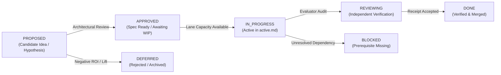

# AETHER / Vanguard: Feature & Capability Backlog

```text
====================================================================================================
Authority: Execution (Sequencing & Lifecycle Tracking)
Scope:     Capability Packages, Substrate Evolution, Tooling & Benchmarking Backlog
Lanes:     Lane A (Dev A — Senior Principal) | Lane B (Dev B — Independent Evaluator)
Invariant: Mechanism presence is not closure; state transitions require empirical receipts.
====================================================================================================
```

## 1. Lifecycle State Definitions

Every item in this backlog is managed through a strict predicate-driven lifecycle:



* **`PROPOSED`**: Candidate hypothesis, architectural proposal, or product feature under technical evaluation.
* **`APPROVED`**: Specification and falsifiers ratified; queued for active sprint execution once lane capacity (`WIP=1`) opens.
* **`IN_PROGRESS`**: Actively under implementation by the assigned lane owner in [`active.md`](active.md).
* **`REVIEWING`**: Code implemented; awaiting independent empirical evaluation and receipt production.
* **`BLOCKED`**: Execution halted due to prerequisite milestone gates (e.g., M-9 blocked on M-8).
* **`DONE`**: Implementation verified by passing tests, boundary checks, and frozen evidence receipts.
* **`DEFERRED`**: Candidate rejected or postponed due to lack of measured lift or architectural misalignment.
* **`REOPENED`**: A previously closed package has a current-source or
  exact-subject falsifier that invalidates carrying its old closure forward.
  The earlier receipt remains historical evidence for its own subject.

---

## 2. Capability Family Backlog

### 2.1 Substrate, Kernel & Event Sourcing (VISION.md §1–6)

| ID | Title & Focus | Subsystem | Lane | Status | Target Milestone | Description & Acceptance Gate |
|---|---|---|---|---|---|---|
| **SUB-01** | S0–S12 Monotonic Dispatch Pipeline | `kernel` | Lane A | `DONE` | M-0–M-3C | 13-stage dispatch pipeline, Typed Budget Governor, $\le 1438$ LOC budget. |
| **SUB-02** | Append-Only Event Store & JCS Ledger | `domain` / `runtime` | Lane A | `DONE` | M-5a | RFC 8785 JCS canonicalization, SQLite WAL ledger emitter, `mhf.event/2`. |
| **SUB-03** | Partial-Order Causal Graph & Concurrency | `runtime` | Lane A | `PROPOSED` | M-7+ | Transition physical sequence numbers to causal DAG dependency tracking. |
| **SUB-04** | Subprocess Sandbox PTY ShellPort | `adapters` | Lane A | `APPROVED` | M-9 | Persistent pseudo-terminal inside Bubblewrap with streaming and sub-200ms SIGINT. |

### 2.2 Memory, Learning & Metacognition (VISION.md §14, §18)

| ID | Title & Focus | Subsystem | Lane | Status | Target Milestone | Description & Acceptance Gate |
|---|---|---|---|---|---|---|
| **MEM-01** | Governed Memory & Rollback Mechanisms | `runtime` | Lane A | `REVIEWING` | M-8 | Authorization, recovery, and rollback receipts in `governance/learning.py`. |
| **MEM-02** | M-8 Empirical Held-Out Canary Proof | `benchmarks` | Lane B | `BLOCKED` (on REL-01R/REL-02R) | M-8 | Held-out real-model canary demonstrating $\ge 0.05$ lift without synthetic metrics after the runtime executor and successor canary are qualification-ready. |
| **MEM-03** | Adaptive Strategy & Meta-Controller | `agency` / `runtime` | Lane A | `APPROVED` | M-6.5 | Higher-order policy adjusting strategy upon failure without modifying history. |
| **MEM-04** | Trajectory-to-Skill Promotion Pipeline | `runtime` | Lane A | `PROPOSED` | M-8+ | Mining verified traces to propose reusable skills with explicit promotion receipts. |

### 2.3 Recursive Delegation & Topologies (VISION.md §12, §16)

| ID | Title & Focus | Subsystem | Lane | Status | Target Milestone | Description & Acceptance Gate |
|---|---|---|---|---|---|---|
| **DEL-01** | Monotonic Capability Attenuation | `kernel` / `agency` | Lane A | `DONE` | M-6 | Recursive budget attenuation $\mathcal{A}(B_{\text{parent}}, B_{\text{child}})$ and child spawning. |
| **DEL-02** | Multi-Role Topology Declarations | `runtime` | Lane A | `APPROVED` | M-7 | Declarative multi-agent topologies (debate, critic, swarm) through single runtime. |
| **DEL-03** | Hardware-Aware Swarm Scheduler | `runtime` | Lane A | `PROPOSED` | M-7+ | VRAM drain scheduling between Architect (DeepSeek) and Worker (Qwen) models. |

### 2.4 Code Intelligence, Verification & SOTA Tools (VISION.md §5, §8)

| ID | Title & Focus | Subsystem | Lane | Status | Target Milestone | Description & Acceptance Gate |
|---|---|---|---|---|---|---|
| **TLS-01** | AdmissionGate Closed-Loop Validation | `agency` | Lane A | `DONE` | W-092-2 | Fail-closed patch requirement and fresh workspace verification enforcement. |
| **TLS-02** | DeepSeek DSML / JSON Normalization | `agency` | Lane A | `DONE` | W-092-4 | Protocol recovery for malformed markdown tool calls and stream truncations. |
| **TLS-03** | Tree-Sitter & SBFL Fault Localization | `ports` / `adapters`| Lane B | `DEFERRED` | Post-CMX-07 | Optional treatment; may enter WIP only after the canonical single-worker baseline is qualified and a preregistered ablation exists. |
| **TLS-04** | AST Syntax Pre-Flight Gate (<0.2ms) | `adapters` | Lane A | `DEFERRED` | Post-CMX-07 | Optional treatment; current finish work must first make verification counts and subject binding truthful. |
| **TLS-05** | Speculative Git Checkpoint Engine | `adapters` | Lane A | `APPROVED` | W-092-4 | In-memory CoW git checkpoints with automatic rollback on test regression. |
| **TLS-06** | AST Mutation Verification (Anti-Collusion)| `adapters` | Lane B | `PROPOSED` | M-8+ | Injects AST mutants to falsify ungrounded or no-op candidate test suites. |
| **TLS-07** | Composable Web Research Port (SSRF-Safe)| `ports` / `adapters`| Lane A | `PROPOSED` | M-9 | Egress-controlled web search and fetch tools with domain allowlists. |

### 2.5 Documentation Plane & Developer Tools

| ID | Title & Focus | Subsystem | Lane | Status | Target Milestone | Description & Acceptance Gate |
|---|---|---|---|---|---|---|
| **DOC-01** | MkDocs + Native Mermaid + Strict Gate | `docs` | Lane A | `DONE` | P0 | `pymdownx.superfences` Mermaid rendering and MkDocs strict build. |
| **DOC-02** | Deterministic Knowledge Base (.jsonl) | `tools` | Lane A | `DONE` | P0 | Machine-generated `catalog`, `code-map`, `symbols`, and `ownership` files. |
| **DOC-03** | Structured RAG V0 (Deterministic) | `tools` | Lane A | `DONE` | P0 | Exact-ID and authority-weighted context query tool (`tools/docs_rag_v0.py`). |
| **DOC-04** | Griffe & mkdocstrings Python API Docs | `docs` / `tools` | Lane A | `APPROVED` | P1 | Auto-generated API documentation for ports and public runtime contracts. |
| **DOC-05** | AST-Grep Structural Repository Indexer | `tools` | Lane B | `PROPOSED` | P1 | Structural AST queries for callers, adapters, and deprecated APIs. |
| **DOC-06** | SCIP Language-Agnostic Symbol Index | `tools` | Lane B | `PROPOSED` | P1 | SCIP indexer generating full cross-language symbol maps for Python & TS. |

### 2.6 Beta Delivery, SWE-Bench & Release Hardening (VISION.md §20)

| ID | Title & Focus | Subsystem | Lane | Status | Target Milestone | Description & Acceptance Gate |
|---|---|---|---|---|---|---|
| **REL-01** | Wave H0: Tooling Integrity & Exact Subject | `benchmarks` | Lane B | `DONE` (historical subject only) | M-8 | Structural dry-run and injected seams were delivered, but current-source audit found the live executor cannot return a patch or execute a bounded multi-turn write-capable attempt. |
| **REL-01R** | Current-Subject Empirical Runner Repair | `benchmarks` / `runtime` | Lane B | `IN_PROGRESS` | W-092-F0 | Bind one write-capable multi-turn runtime attempt to patch, event/trajectory, usage and exterior-verdict identities; restore HEAD-bound LDA/navigation health. |
| **REL-02** | Wave H1: Frozen 10-Task Canary | `benchmarks` | Both | `DONE` (historical artifact only) | M-8 | The old artifact remains immutable, but title/payload/workspace duplication and current-subject drift prevent its reuse as qualification evidence. |
| **REL-02R** | Successor Uncontaminated Canary | `benchmarks` | Lane B | `BLOCKED` (on REL-01R) | W-092-F0 / M-8 | Freeze a successor only after every task, workspace, oracle, split, base revision and digest resolves to one unique subject. |
| **REL-03** | Wave H2: Official SWE-Bench Container Bridge| `benchmarks` | Lane B | `APPROVED` | M-9 | Isolated official evaluation container passing pure unified diffs. |
| **REL-04** | Wave H3: Preregistered Hypothesis Ablations | `runtime` / `bench` | Both | `PROPOSED` | M-9 | Controlled A/B trials with $\ge 0.05$ lift threshold per treatment. |
| **REL-05** | Wave H4: Release Qualification & Signed Envelope| `ci` / `release` | Both | `BLOCKED` (on M-9) | Full 2348+ test suite, clean out-of-tree install, signed Ed25519 envelope. |

### 2.7 Specialized CLI Product Family (PRD Candidate Proposals)

| ID | Title & Focus | Subsystem | Lane | Status | Target Milestone | Description & Acceptance Gate |
|---|---|---|---|---|---|---|
| **CLI-01** | `vg-code` (Autonomous SWE Problem Solver) | `packs/code-default` | Lane A | `DONE` | M-4 | Autonomous bug fixing: Ingestion $\to$ Reproducer $\to$ Surgical Patch $\to$ Verification. |
| **CLI-02** | `vg-swarm` (Tiered Multi-Model Coding Swarm) | `agency/spawn` | Lane A | `PROPOSED` | M-7+ | Tiered swarm: DeepSeek/Claude Architect plans $\to$ Qwen/Haiku workers execute diffs. |
| **CLI-03** | `vg-fuzz` / `vg-verifier` (Formal CEGIS & SMT Falsifier) | `ports/evaluator` | Lane B | `PROPOSED` | M-5b+ | Formal verification: SMT spec $\to$ CEGIS inductive synthesis $\to$ Concolic fuzzing. |
| **CLI-04** | `vg-refactor` (Causal Slicing & Modernizer) | `ports/index` | Lane A | `PROPOSED` | M-9+ | AST call-graph causal slicing for atomic, regression-free codebase refactoring. |
| **CLI-05** | `vg-review` / `vg-arena` (Adversarial Multi-Model Reviewer)| `agency/spawn` | Lane A | `PROPOSED` | M-7+ | Zero-trust PR review: Competing reviewer personas (Security, Performance, Style) debate. |
| **CLI-06** | `vg-tutor` (Evidence-Graph Codebase Guide) | `packs/tutor` | Lane A | `DONE` | M-5a | Dynamic AST traversal $\to$ Socratic interactive codebase explanations with clickable proofs. |
| **CLI-07** | `vg-research` (Bounded Technical RFC & Web Corroborator)| `packs/research` | Lane A | `PROPOSED` | M-9 | Egress-controlled technical search $\to$ SSRF-safe fetch $\to$ Triangulated RFC generation. |
| **CLI-08** | `vg-rlvr` (Verifiable Trajectory & Dataset Generator) | `domain/evidence` | Lane B | `PROPOSED` | M-8+ | Mining verified traces (State, Action, Reward, Trace) for RL fine-tuning. |
| **TUI-01** | `aether` Coding-Agent Terminal (unify `clients/tui` + `clients/cli/src/tui` onto one `@aether/tui-core`-driven cell renderer per the OpenTUI spike's fallback clause; plan mode) | `clients/tui-core` / `clients/tui` / `clients/cli` / `runtime` | Lane A | `REVIEWING` (command registry, plan-mode enforcement, and Ink consolidation done and green; OpenTUI spike closed via fallback, not qualified) | M-9 (`TC-E-047`, currently `BLOCKED` on M-8) | **Definition-of-Ready**: (1) one `@aether/tui-core` command registry replacing the duplicated/index-mismatched palette lists — **done**, `vanguard/clients/tui-core/`, 16 passing `node --test` unit tests, no terminal required; (2) plan mode enforced by grant attenuation at the runtime composition layer, not client-side politeness — **done**, `vanguard/packages/runtime/{profiles,wiring,session}.py`, falsifier in `test/runtime/test_w3_plan_mode.py` (patch.apply/proc.exec denied with the workspace byte-identical afterward, fs.read still succeeds under the same profile); (3) an OpenTUI qualification spike per `PRD_AETHER_TUI.md` §8.1 — **partial**, receipt at `.draft/todo/w0-spike/receipt.json`: first-frame (8.5ms) and event→render P95 (34.0ms) passed budget on Bun 1.4.0/tmux, but RSS (69.2MB vs. 45MB budget) failed, and keystroke→cell latency, a real SIGWINCH resize, the local-emulator/SSH terminals, and the 256-/16-color fallbacks were not exercised (no attached TTY or SSH endpoint in the environment that produced this receipt) — re-run with a human on a real interactive session, or re-scope the transcript's renderable count, before this gate is called closed; (4) the OpenTUI + Solid render layer itself — **not started**, blocked on (3) closing per the plan's `W0 gates W2` rule; the render layer stays the pre-existing hand-rolled `clients/tui/src/terminal` cell renderer (already consuming `@aether/tui-core` per (1)), per the plan's own fallback clause ("swap the view layer back to the existing cell renderer and lose nothing above the driver line") triggered by (3)'s RSS failure; (5) Ink deletion and CLI consolidation — **done**: `clients/cli/src/commands/run.ts`'s interactive path now embeds `@aether/tui`'s `TuiApplication` directly (in-process, no child spawn) instead of Ink's `RunTui`; `clients/cli/src/tui/{components,hooks,screens}` (the Ink-dependent tree) deleted, its React-free pure-logic siblings (`diff.ts`, `focus.ts`, `keys.ts`, `status-bar.ts`, `theme/tokens.ts`, `transcript-window.ts`, `why-display.ts`) kept and still covered by `ui.test.ts`; `legacy.tsx` replaced by a JSX-free `legacy.ts` with its unused (shadowed by `run.ts`/`approve.ts`/`daemon.ts`) `handleRun`/`handleApprove`/`handleDaemon` duplicates dropped; `ink`/`react`/`@types/react` removed from `clients/cli/package.json` and the root `package.json`; a latent bug fixed along the way — `TuiApplication.stop()` never removed its `stdin` `"data"` listener, so an embedding host's process could never exit after Ctrl+D, now fixed with a `TuiAppOptions.onExit` hook. Verified with a real interactive run in a tmux pty (`AETHER_HOME=... node bin/aether run --repo /tmp --demo`, exits 0 on Ctrl+D) and the full monorepo `npm run build`/`npm test` (0 failures). `bin/aether`/`bin/aether-tui` already existed and already forward to the built Node entrypoints — no `bun build --compile` packaging was needed since the Bun-only OpenTUI stack was not adopted. This epic remains `BLOCKED` on M-8 at the milestone level per `TC-E-047`; the WIP=1 lane in `active.md` records only the parts above that could proceed under `SUB-01`/`DEL-01`-style pure-package or Python-runtime work not contending for the milestone gate. |

### 2.8 Formal Reasoning & Algorithmic Engines (LIM Integration Proposals)

| ID | Title & Focus | Subsystem | Lane | Status | Target Milestone | Description & Acceptance Gate |
|---|---|---|---|---|---|---|
| **ALG-01** | SMT-Guided CEGIS Synthesis Loop | `ports/evaluator` | Lane B | `PROPOSED` | M-5b+ | Iterative counterexample synthesis loop: $\Phi(x, y) \to P \in \mathcal{L} \to \text{Z3 SMT Check}$. |
| **ALG-02** | SBFL Multi-Metric Fault Localization Suite | `ports/index` | Lane B | `PROPOSED` | M-8+ | Multi-metric suspiciousness scoring: DStar ($* = 2$), Tarantula, and Ochiai. |
| **ALG-03** | Formal State-Hash Anti-Thrashing FSM | `agency/episode` | Lane A | `PROPOSED` | W-092-4 | Signature hashing $H(\text{tool}, \text{args}, \text{state})$; triggers `ERR_THRASHING_LOOP` recovery. |

### 2.9 Coding Max Convergence Epic

This epic is the accepted planning disposition of the three Electroweak
solutions. It does not authorize copying executable prototypes from the report
tree. Production changes must be re-derived against current ports, boundaries,
source, and tests.

The architecture rule is **thin app, thick declarative composition**:
`apps/coding_max` owns request/result ergonomics and preset selection;
`packs/code-default` owns coding cognition and policy; runtime remains the only
composition/lifecycle authority; infrastructure stays behind generic ports.

| ID | Capability package | Primary owner | Status | Dependency | Acceptance gate |
|---|---|---|---|---|---|
| **CMX-01** | Current-mechanism delta and three presets | `packs/code-default`, manifests | `REOPENED` (product divergence) | EWK-Q disposition | Public fast/balanced/max still need accepted later harness behavior folded into one data-selected catalog; experimental manifest names are not product presets. |
| **CMX-02** | Port-backed repository intelligence | `ports/index.py`, adapters, code-pack bindings | `PARTIAL` | CMX-09 | Public Coding Max presets now declare the shared index and the runtime constructs bounded `ContextPacket` context; staged task-ranked retrieval, epoch refresh and fallback evidence remain. |
| **CMX-03** | Durable plan/context/recovery loop | code-pack policies + existing projections | `PARTIAL` | CMX-09 | Resume restores the original turn ceiling and approval mode, but rich task-state production, exact policy/profile/budget identity and 40+ turn cold parity remain. |
| **CMX-04** | Multi-file and greenfield correctness | code-pack policies and fixtures | `REVIEWING` | CMX-10A, CMX-11 | Hermetic policies/fixtures and conservative verification observation exist; task-specific completion and repository-scale change-surface qualification remain. |
| **CMX-05** | Coding Max application facade | `apps/coding_max`, shared application service, `vg` | `DONE (hermetic)` | CMX-03 | CLI and API invoke the same composition; run/status/resume/evidence/cost results agree; app owns no execution loop or provider HTTP |
| **CMX-06** | Conditional review and mediated specialist roles | manifests/topology/child runtime | `BLOCKED` (on CMX-07) | CMX-05 and accepted baseline | Reviewer/localizer/test-investigator roles remain disabled until one-role-at-a-time held-out ablations beat the qualified single-worker control. |
| **CMX-07** | Repository-scale qualification | benchmark program | `BLOCKED` (on REL-01R, CMX-09..11) | CMX-04, CMX-05 | Re-freeze the exact multi-class subject only after canonical completion, long-session resume and progressive-context gates pass. |
| **CMX-08** | First-party reference-agent portfolio | apps + independent packs/manifests | `TECHNICAL SLICE DONE` | M-10 and stable public composition contract | Coding Max plus two non-coding supported agents install, run, resume, and emit attributable evidence through the same public framework contract |
| **CMX-09** | Canonical Harness Convergence | runtime, code pack, manifests, thin app | `IN_PROGRESS` (Active in [`tasks.md`](tasks.md)) | W-092-F1 | Fold accepted later prompt/tool/recovery mechanisms into public presets; use one capability-derived admission/policy binding; exact technical delta governed by [`FEATURE_SPEC.md`](FEATURE_SPEC.md). |
| **CMX-10A** | Truthful Task-Aware Completion | runtime + code-pack completion policy | `APPROVED` | CMX-09 | Parse real verification counts and fail closed on zero, stale, partial, incomplete or task-inapplicable evidence across bugfix, feature, migration, greenfield and read-only tasks. |
| **CMX-10B** | Durable Long-Session Continuation | runtime/session/task projection | `APPROVED` | CMX-10A | Persist and restore exact task/composition/policy/budget/phase/next-action identity; prove 40+ turns and repeated fresh-process restarts without duplicate effects. |
| **CMX-11** | Progressive Repository Context & Change Closure | agency context, `IndexPort`, adapters, code pack | `APPROVED` | CMX-09, CMX-10B | Put `ContextPacket` on the product path, reserve recovery/verification context, refresh by repository epoch, expose omissions, and prove multi-file/affected-test closure with deterministic fallback. |

### 2.10 Octopus Meta-Controller & Swarm Topology (VISION.md §12, §16; M-OCT Horizon)

The Octopus / Conductor capability family represents the post-1.0 higher-order orchestration layer for long-horizon multi-day campaigns. It is declared as pure data topologies and content-addressed message exchanges; it does not replace the kernel's S0–S12 execution contracts. Detailed pseudocode is deferred to its dedicated implementation milestone.

| ID | Title & Focus | Subsystem | Lane | Status | Target Milestone | Description & Acceptance Gate |
|---|---|---|---|---|---|---|
| **OCT-01** | Content-Addressed Mailbox Protocol | `domain/topology` | Lane A | `PROPOSED` | M-OCT / W-OCT-1 | Sub-agents communicate strictly by publishing and reading content-addressed immutable message digests (`digest_of(payload)`); zero shared memory; deterministic replayability. |
| **OCT-02** | Declarative CoordinationPlan DAG & Merge Policies | `domain/topology` | Lane A | `PROPOSED` | M-OCT / W-OCT-2 | Topology declared as data DAG with per-mille budget shares ($\sum \text{budget\_share} \le 1000$); formal merge policies: `CONCAT`, `FIRST_COMPLETE`, `SYNTHESISE`, `UNANIMOUS`. |
| **OCT-03** | Outer-Loop Multi-Day Roadmap Director | `runtime/outer_loop` | Lane A | `PROPOSED` | M-OCT / W-OCT-3 | Persistent director above `EpisodeEngine`; manages multi-episode roadmaps, survives process restarts, and yields verified milestone handoffs without unbounded context saturation. |
| **OCT-04** | Meta-Conductor & Swarm Goal Algebra | `runtime/outer_loop` | Lane A | `PROPOSED` | M-OCT / W-OCT-4 | Higher-order pilot framework; formal algebraic separation and reconciliation of individual worker objectives under a shared global campaign objective. |

---

## 3. Prioritized Next-Up Queue (Staging for tasks.md)

The dependency-ordered queue is:

1. In parallel under lane WIP=1: **`REL-01R`** exact-subject runner/navigation
   repair and **`CMX-09`** canonical product convergence (governed by [`FEATURE_SPEC.md`](FEATURE_SPEC.md)).
2. **`REL-02R`** successor canary after REL-01R proves the evidence path.
3. **`CMX-10A`** truthful task-aware completion.
4. **`CMX-10B`** durable 40+ turn continuation and fresh-process parity.
5. **`CMX-11`** progressive repository context, affected-test mapping and
   multi-file change closure.
6. **`CMX-07`** frozen multi-class product qualification.
7. **`CMX-06`** optional one-treatment-at-a-time specialist ablations.
8. **`FIN-A1` / `W-092-5`** governed-memory experiment and independent M-8
   disposition; only an accepted positive M-8 result can authorize M-9.
9. **`CMX-08`** portfolio qualification after M-10 and a stable public contract.
10. **`OCT-01`–`OCT-04`** Octopus outer-loop orchestration after M-10 release.

---

## 4. Cross-References

* **Vision (Constitutional Law Zero)**: [`VISION.md`](../../VISION.md)
* **Target Milestone Gates**: [`milestones.md`](milestones.md)
* **Active Execution Runway (WIP=1)**: [`tasks.md`](tasks.md)
* **Active Feature Delta Specification**: [`FEATURE_SPEC.md`](FEATURE_SPEC.md)
* **Normative System Specification**: [`../SPEC.md`](../SPEC.md)
